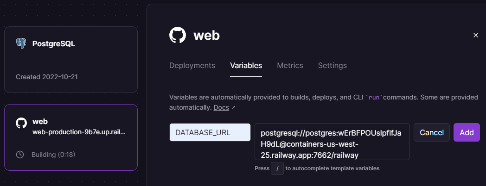

{{LearnSidebar}}{{PreviousMenuNext("Learn/Server-side/Django/Testing", "Learn/Server-side/Django/web_application_security", "Learn/Server-side/Django")}}

Now you've created (and tested) an awesome [LocalLibrary](/en-US/docs/Learn/Server-side/Django/Tutorial_local_library_website) website, you're going to want to install it on a public web server so that it can be accessed by library staff and members over the internet. This article provides an overview of how you might go about finding a host to deploy your website, and what you need to do in order to get your site ready for production.

<table>
  <tbody>
    <tr>
      <th scope="row">Prerequisites:</th>
      <td>
        Complete all previous tutorial topics, including <a href="/en-US/docs/Learn/Server-side/Django/Testing">Django Tutorial Part 10: Testing a Django web application</a>.
      </td>
    </tr>
    <tr>
      <th scope="row">Objective:</th>
      <td>To learn where and how you can deploy a Django app to production.</td>
    </tr>
  </tbody>
</table>

## Overview

Once your site is finished (or finished "enough" to start public testing) you're going to need to host it somewhere more public and accessible than your personal development computer.

Up to now you've been working in a development environment, using the Django development web server to share your site to the local browser/network, and running your website with (insecure) development settings that expose debug and other private information. Before you can host a website externally you're first going to have to:

- Make a few changes to your project settings.
- Choose an environment for hosting the Django app.
- Choose an environment for hosting any static files.
- Set up a production-level infrastructure for serving your website.

This tutorial provides some guidance on your options for choosing a hosting site, a brief overview of what you need to do in order to get your Django app ready for production, and a working example of how to install the LocalLibrary website onto the [Railway](https://railway.app/) cloud hosting service.

## What is a production environment?

The production environment is the environment provided by the server computer where you will run your website for external consumption. The environment includes:

- Computer hardware on which the website runs.
- Operating system (e.g. Linux, Windows).
- Programming language runtime and framework libraries on top of which your website is written.
- Web server used to serve pages and other content (e.g. Nginx, Apache).
- Application server that passes "dynamic" requests between your Django website and the web server.
- Databases on which your website is dependent.

> **Note:** Depending on how your production environment is configured you might also have a reverse proxy, load balancer, and so on.

The server computer could be located on your premises and connected to the internet by a fast link, but it is far more common to use a computer that is hosted "in the cloud". What this actually means is that your code is run on some remote computer (or possibly a "virtual" computer) in your hosting company's data center(s). The remote server will usually offer some guaranteed level of computing resources (CPU, RAM, storage memory, etc.) and internet connectivity for a certain price.

This sort of remotely accessible computing/networking hardware is referred to as _Infrastructure as a Service (IaaS)_. Many IaaS vendors provide options to preinstall a particular operating system, onto which you must install the other components of your production environment. Other vendors allow you to select more fully-featured environments, perhaps including a complete Django and web-server setup.

> **Note:** Pre-built environments can make setting up your website very easy because they reduce the configuration, but the available options may limit you to an unfamiliar server (or other components) and may be based on an older version of the OS. Often it is better to install components yourself, so that you get the ones that you want, and when you need to upgrade parts of the system, you have some idea of where to start!

Other hosting providers support Django as part of a _Platform as a Service_ (PaaS) offering. In this sort of hosting you don't need to worry about most of your production environment (web server, application server, load balancers) as the host platform takes care of those for you — along with most of what you need to do in order to scale your application.
That makes deployment quite easy, because you just need to concentrate on your web application and not all the other server infrastructure.

Some developers will choose the increased flexibility provided by IaaS over PaaS, while others will appreciate the reduced maintenance overhead and easier scaling of PaaS. When you're getting started, setting up your website on a PaaS system is much easier, and so that is what we'll do in this tutorial.

> **Note:** If you choose a Python/Django-friendly hosting provider they should provide instructions on how to set up a Django website using different configurations of web server, application server, reverse proxy, and so on. (this won't be relevant if you choose a PaaS). For example, there are many step-by-step guides for various configurations in the [Digital Ocean Django community docs](https://www.digitalocean.com/community/tutorials?q=django).

## Choosing a hosting provider

There are well over 100 hosting providers that are known to either actively support or work well with Django (you can find a fairly large list at [DjangoFriendly hosts](https://djangofriendly.com/index.html)).
These vendors provide different types of environments (IaaS, PaaS), and different levels of computing and network resources at different prices.

Some of the things to consider when choosing a host:

- How busy your site is likely to be and the cost of data and computing resources required to meet that demand.
- Level of support for scaling horizontally (adding more machines) and vertically (upgrading to more powerful machines) and the costs of doing so.
- Where the supplier has data centres, and hence where access is likely to be fastest.
- The host's historical uptime and downtime performance.
- Tools provided for managing the site — are they easy to use and are they secure (e.g. SFTP vs. FTP).
- Inbuilt frameworks for monitoring your server.
- Known limitations. Some hosts will deliberately block certain services (e.g. email). Others offer only a certain number of hours of "live time" in some price tiers, or only offer a small amount of storage.
- Additional benefits. Some providers will offer free domain names and support for SSL certificates that you would otherwise have to pay for.
- Whether the "free" tier you're relying on expires over time, and whether the cost of migrating to a more expensive tier means you would have been better off using some other service in the first place!

The good news when you're starting out is that there are quite a few sites that provide "free" computing environments that are intended for evaluation and testing.
These are usually fairly resource constrained/limited environments, and you do need to be aware that they may expire after some introductory period or have other constraints.
They are however great for testing low traffic sites in a hosted environment, and can provide an easy migration to paying for more resources when your site gets busier.
Popular choices in this category include [Railway](https://railway.app/), [Python Anywhere](https://www.pythonanywhere.com/), [Amazon Web Services](https://docs.aws.amazon.com/awsaccountbilling/latest/aboutv2/billing-free-tier.html), [Microsoft Azure](https://azure.microsoft.com/pricing/details/app-service/), etc

Most providers also offer a "basic" tier that is intended for small production sites, and which provide more useful levels of computing power and fewer limitations.
[Heroku](https://www.heroku.com/), [Digital Ocean](https://www.digitalocean.com/) and [Python Anywhere](https://www.pythonanywhere.com/) are examples of popular hosting providers that have a relatively inexpensive basic computing tier (in the $5 to $10 USD per month range).

> **Note:** Remember that price is not the only selection criterion. If your website is successful, it may turn out that scalability is the most important consideration.

## Getting your website ready to publish

The [Django skeleton website](/en-US/docs/Learn/Server-side/Django/skeleton_website) created using the _django-admin_ and _manage.py_ tools are configured to make development easier. Many of the Django project settings (specified in **settings.py**) should be different for production, either for security or performance reasons.

> **Note:** It is common to have a separate **settings.py** file for production, and/or to conditionally import sensitive settings from a separate file or an environment variable. This file should then be protected, even if the rest of the source code is available on a public repository.

The critical settings that you must check are:

- `DEBUG`. This should be set as `False` in production (`DEBUG = False`). This stops the sensitive/confidential debug trace and variable information from being displayed.
- `SECRET_KEY`. This is a large random value used for CSRF protection, etc. It is important that the key used in production is not in source control or accessible outside the production server. The Django documents suggest that this might best be loaded from an environment variable or read from a server-only file.

  ```python
  # Read SECRET_KEY from an environment variable
  import os
  SECRET_KEY = os.environ['SECRET_KEY']

  # OR

  # Read secret key from a file
  with open('/etc/secret_key.txt') as f:
      SECRET_KEY = f.read().strip()
  ```

Let's change the _LocalLibrary_ application so that we read our `SECRET_KEY` and `DEBUG` variables from environment variables if they are defined, but otherwise use the default values in the configuration file.

Open **/locallibrary/settings.py**, disable the original `SECRET_KEY` configuration and add the new lines as shown below.
During development no environment variable will be specified for the key, so the default value will be used (it shouldn't matter what key you use here, or if the key "leaks", because you won't use it in production).

```python
# SECURITY WARNING: keep the secret key used in production secret!
# SECRET_KEY = "cg#p$g+j9tax!#a3cup@1$8obt2_+&k3q+pmu)5%asj6yjpkag"
import os
SECRET_KEY = os.environ.get('DJANGO_SECRET_KEY', 'cg#p$g+j9tax!#a3cup@1$8obt2_+&k3q+pmu)5%asj6yjpkag')
```

Then comment out the existing `DEBUG` setting and add the new line shown below.

```python
# SECURITY WARNING: don't run with debug turned on in production!
# DEBUG = True
DEBUG = os.environ.get('DJANGO_DEBUG', '') != 'False'
```

The value of the `DEBUG` will be `True` by default, but will only be `False` if the value of the `DJANGO_DEBUG` environment variable is set to `False`. Please note that environment variables are strings and not Python types. We therefore need to compare strings. The only way to set the `DEBUG` variable to `False` is to actually set it to the string `False`.

You can set the environment variable to "False" on Linux by issuing the following command:

```bash
export DJANGO_DEBUG=False
```

A full checklist of settings you might want to change is provided in [Deployment checklist](https://docs.djangoproject.com/en/4.0/howto/deployment/checklist/) (Django docs). You can also list a number of these using the terminal command below:

```python
python3 manage.py check --deploy
```

## Example: Installing LocalLibrary on Railway

This section provides a practical demonstration of how to install _LocalLibrary_ on [Railway](https://railway.app/).

### Why Railway?

We are choosing to use Railway for several reasons:

- Railway has a [starter plan](https://docs.railway.app/reference/plans#starter-plan) free tier that is _really_ free, albeit with some limitations.
  The fact that it is affordable for all developers is really important to MDN!
- Railway takes care of most of the infrastructure so you don't have to.
  Not having to worry about servers, load balancers, reverse proxies, and so on, makes it much easier to get started.
- Railway has a [focus on developer experience for development and deployment](https://docs.railway.app/reference/compare-to-heroku), which leads to a faster and softer learning curve than many other alternatives.
- The skills and concepts you will learn when using Railway are transferrable.
  While Railway has some excellent new features, many of the same ideas and approaches are used by other popular hosting services.
- The service and plan limitations do not really impact us using Railway for the tutorial.
  For example:

  - The starter plan only offers 500 hours of continuous deployment time each month, and $5 of credit that is consumed based on usage.
    At the end of each month the hours and credit are reset and any projects must be redeployed.
    These constraints mean that you could run this tutorial continuously for about 21 days, which is more than enough for development and testing.
    However you wouldn't be able to use this plan for a "real" production site.
  - The starter plan environment has only 512 MB of RAM and 1 GB of storage memory; more than enough for the tutorial.
  - At time of writing there is only one supported region, which is in the USA.
    The service outside this region might be slower, or blocked by local regulations.
  - Other limitations can be found in the [Railway plan documentation](https://docs.railway.app/reference/plans#starter-plan).

- The service appears to be very reliable, and if you end up loving it, the pricing is predictable, and scaling your app is very easy.

While Railway is appropriate for hosting this demonstration, you should take the time to determine if it is [suitable for your own website](#choosing_a_hosting_provider).

### How does Railway work?

Web applications are each run in their own isolated and independent virtualized container.
In order to execute your application, Railway needs to be able to set up the appropriate environment and dependencies, and also understand how it is launched.
For Django apps we provide this information in a number of text files:

- **runtime.txt**: states the programming language and version to use.
- **requirements.txt**: lists the Python dependencies needed for your site, including Django.
- **Procfile**: A list of processes to be executed to start the web application.
  For Django this will usually be the Gunicorn web application server (with a `.wsgi` script).
- **wsgi.py**: [WSGI](https://wsgi.readthedocs.io/en/latest/what.html) configuration to call our Django application in the Railway environment.

Once the application is running it can configure itself using information provided in [environment variables](https://docs.railway.app/develop/variables).
For example, an application that uses a database can get the address using the variable `DATABASE_URL`.
The database service itself may be hosted by Railway or some other provider.

Developers interact with Railway through the Railway site, and using a special [Command Line Interface (CLI)](https://docs.railway.app/develop/cli) tool.
The CLI allows you to associate a local GitHub repository with a railway project, upload the repository from the local branch to the live site, inspect the logs of the running process, set and get configuration variables and much more.
One of the most useful features is that you can use the CLI to run your local project with the same environment variables as the live project.

In order to get our application to work on Railway, we'll need to put our Django web application into a git repository, add the files above, integrate with a database add-on, and make changes to properly handle static files.
Once we've done all that, we can set up a Railway account, get the Railway client, and install our website.

That's all the overview you need in order to get started.

### Creating an application repository in GitHub

Railway is closely integrated with GitHub and the **git** source code version control system, and you can configure it to automatically deploy changes to a particular repository or branch on GitHub.
Alternatively you can push your current local code branch direct to the railway deployment using the CLI.

> **Note:** Using a source code management system like GitHub is good software development practice.
> Skip this step if you're already using GitHub to manage your source.

There are a lot of ways to work with git, but one of the easiest is to first set up an account on [GitHub](https://github.com/), create the repository there, and then sync to it locally:

1. Visit <https://github.com/> and create an account.
2. Once you are logged in, click the **+** link in the top toolbar and select **New repository**.
3. Fill in all the fields on this form. While these are not compulsory, they are strongly recommended.

   - Enter a new repository name and description.
     For example, you might use the name "django_local_library" and description "Local Library website written in Django".
   - Choose **Python** in the _Add .gitignore_ selection list.
   - Choose your preferred license in the _Add license_ selection list.
   - Check **Initialize this repository with a README**.

4. Press **Create repository**.
5. Click the green **Clone or download** button on your new repo page.
6. Copy the URL value from the text field inside the dialog box that appears.
   If you used the repository name "django_local_library", the URL should be something like: `https://github.com/<your_git_user_id>/django_local_library.git`.

Now that the repository ("repo") is created we are going to want to clone it on our local computer:

1. Install _git_ for your local computer (you can find versions for different platforms [here](https://git-scm.com/downloads)).
2. Open a command prompt/terminal and clone your repo using the URL you copied above:

   ```bash
   git clone https://github.com/<your_git_user_id>/django_local_library.git
   ```

   This will create the repo in a new folder in the current working directory.

3. Navigate into the new repo.

   ```bash
   cd django_local_library
   ```

The final steps are to copy your application into this local project directory and then add (or "push", in git lingo) the local repo to your remote GitHub repo:

1. Copy your Django application into this folder (all the files at the same level as **manage.py** and below, **not** their containing locallibrary folder).
2. Open the **.gitignore** file, copy the following lines into the bottom of it, and then save (this file is used to identify files that should not be uploaded to git by default).

   ```plain
   # Text backup files
   *.bak

   # Database
   *.sqlite3
   ```

3. Open a command prompt/terminal and use the `add` command to add all files to git.
   This adds the files which aren't ignored by the **.gitignore** file to the "staging area".

   ```bash
   git add -A
   ```

4. Use the `status` command to check that all files you are about to `commit` are correct (you want to include source files, not binaries, temporary files etc.).
   It should look a bit like the listing below.

   ```plain
   > git status
   On branch main
   Your branch is up-to-date with 'origin/main'.
   Changes to be committed:
     (use "git reset HEAD <file>..." to unstage)

           modified:   .gitignore
           new file:   catalog/__init__.py
           ...
           new file:   catalog/migrations/0001_initial.py
           ...
           new file:   templates/registration/password_reset_form.html
   ```

5. When you're satisfied, `commit` the files to your local repo. This is essentially equivalent to signing off on the changes and making them an official part of the local repo.

   ```bash
   git commit -m "First version of application moved into GitHub"
   ```

6. At this point, the remote repo has not been changed.
   The last step is to synchronize (`push`) your local repo up to the remote GitHub repo using the following command:

   ```bash
   git push origin main
   ```

When this operation completes, you should be able to go back to the page on GitHub where you created your repo, refresh the page, and see that your whole application has now been uploaded. You can continue to update your repo as files change using this add/commit/push cycle.

> **Note:** This is a good point to make a backup of your "vanilla" project — while some of the changes we're going to be making in the following sections might be useful for deployment on any platform (or development) others might not.
>
> The _best_ way to do this is to use _git_ to manage your revisions. With _git_ you can not only go back to a particular old version, but you can maintain this in a separate "branch" from your production changes and cherry-pick any changes to move between production and development branches. [Learning Git](https://docs.github.com/en/get-started/quickstart/git-and-github-learning-resources) is well worth the effort, but is beyond the scope of this topic.
>
> The _easiest_ way to do this is to just copy your files into another location. Use whichever approach best matches your knowledge of git!

### Update the app for Railway

This section explains the changes you'll need to make to our _LocalLibrary_ application to get it to work on Railway.
Note that these changes will not prevent you using the local testing and workflows we've already learned.

#### Procfile

A _Procfile_ is the web application "entry point".
It lists the commands that will be executed by Railway to start your site.

Create the file `Procfile` (with no file extension) in the root of your GitHub repo and copy/paste in the following text:

```plain
web: python manage.py migrate && python manage.py collectstatic --no-input && gunicorn locallibrary.wsgi
```

The `web:` prefix tells Railway that this is a web process and can be sent HTTP traffic.
We then call the command Django migration command `python manage.py migrate` to set up the database tables.
Next, we call the Django command `python manage.py collectstatic` to collect static files into the folder defined by the `STATIC_ROOT` project setting (see the section [serving static files in production](#serving_static_files_in_production) below).
Finally, we start the _gunicorn_ process, a popular web application server, passing it configuration information in the module `locallibrary.wsgi` (created with our application skeleton: **/locallibrary/wsgi.py**).

Note that you can also use the Procfile to start worker processes or to run other non-interactive tasks before the release is deployed.

#### Gunicorn

[Gunicorn](https://gunicorn.org/) is a pure-Python HTTP server that is commonly used for serving Django WSGI applications on Railway (as referenced in the Procfile above).

While we don't need _Gunicorn_ to serve our LocalLibrary application during development, we'll install it locally so that it becomes part of our [requirements](#requirements) for Railway to set up on the remote server.

First make sure that you're in the Python virtual environment that was created when you [set up the development environment](/en-US/docs/Learn/Server-side/Django/development_environment) (use the `workon [name-of-virtual-environment]` command).
Then install _Gunicorn_ locally on the command line using _pip_:

```bash
pip3 install gunicorn
```

#### Database configuration

SQLite, the default Django database that you've been using for development, is a reasonable choice for small to medium websites.
Unfortunately it cannot be used on some popular hosting services, such as Heroku, because they don't provide persistent data storage in the application environment (a requirement of SQLite).
While that might not affect us on Railway, we'll show you another approach that will work on Railway, Heroku, and some other services.

The approach is to use a database that runs in its own process somewhere on the Internet, and is accessed by the Django library application using an address passed as an environment variable.
In this case we'll use a Postgres database that is also hosted on Railway, but you could use any database hosting service you like.

The database connection information will be supplied to Django using an environment variable named `DATABASE_URL`.
Rather than hard-coding this information into Django, we'll use the [dj-database-url](https://pypi.org/project/dj-database-url/) package to parse the `DATABASE_URL` environment variable and automatically convert it to Django's desired configuration format.
In addition to installing the _dj-database-url_ package we'll also need to install [psycopg2](https://www.psycopg.org/), as Django needs this to interact with Postgres databases.

##### dj-database-url

_dj-database-url_ is used to extract the Django database configuration from an environment variable.

Install it locally so that it becomes part of our [requirements](#requirements) for Railway to set up on the remote server:

```bash
pip3 install dj-database-url
```

##### settings.py

Open **/locallibrary/settings.py** and copy the following configuration into the bottom of the file:

```python
# Update database configuration from $DATABASE_URL.
import dj_database_url
db_from_env = dj_database_url.config(conn_max_age=500)
DATABASES['default'].update(db_from_env)
```

Django will now use the database configuration in `DATABASE_URL` if the environment variable is set; otherwise it uses the default SQLite database.
The value `conn_max_age=500` makes the connection persistent, which is far more efficient than recreating the connection on every request cycle (this is optional and can be removed if needed).

##### psycopg2

Django needs _psycopg2_ to work with Postgres databases.
Install it locally so that it becomes part of our [requirements](#requirements) for Railway to set up on the remote server:

```bash
pip3 install psycopg2-binary
```

Note that Django will use the SQLite database during development by default, unless `DATABASE_URL` is set.
You can switch to Postgres completely and use the same hosted database for development and production by setting the same environment variable in your development environment (Railway makes it easy to use the same environment for production and development).
Alternatively you can also install and use a [self-hosted Postgres database](https://www.psycopg.org/docs/install.html) on your local computer.

#### Serving static files in production

During development we use Django and the Django development web server to serve both our dynamic HTML and our static files (CSS, JavaScript, etc.).
This is inefficient for static files, because the requests have to pass through Django even though Django doesn't do anything with them.
While this doesn't matter during development, it would have a significant performance impact if we were to use the same approach in production.

In the production environment we typically separate the static files from the Django web application, making it easier to serve them directly from the web server or from a content delivery network (CDN).

The important setting variables are:

- `STATIC_URL`: This is the base URL location from which static files will be served, for example on a CDN.
- `STATIC_ROOT`: This is the absolute path to a directory where Django's _collectstatic_ tool will gather any static files referenced in our templates. Once collected, these can then be uploaded as a group to wherever the files are to be hosted.
- `STATICFILES_DIRS`: This lists additional directories that Django's _collectstatic_ tool should search for static files.

Django templates refer to static file locations relative to a `static` tag (you can see this in the base template defined in [Django Tutorial Part 5: Creating our home page](/en-US/docs/Learn/Server-side/Django/Home_page#the_locallibrary_base_template)), which in turn maps to the `STATIC_URL` setting.
Static files can therefore be uploaded to any host and you can update your application to find them using this setting.

The _collectstatic_ tool is used to collect static files into the folder defined by the `STATIC_ROOT` project setting.
It is called with the following command:

```bash
python3 manage.py collectstatic
```

For this tutorial, _collectstatic_ is run by Railway before the application is uploaded, copying all the static files in the application to the location specified in `STATIC_ROOT`.
`Whitenoise` then finds the files from the location defined by `STATIC_ROOT` (by default) and serves them at the base URL defined by `STATIC_URL`.

##### settings.py

Open **/locallibrary/settings.py** and copy the following configuration into the bottom of the file.
The `BASE_DIR` should already have been defined in your file (the `STATIC_URL` may already have been defined within the file when it was created.
While it will cause no harm, you might as well delete the duplicate previous reference).

```python
# Static files (CSS, JavaScript, Images)
# https://docs.djangoproject.com/en/4.0/howto/static-files/

# The absolute path to the directory where collectstatic will collect static files for deployment.
STATIC_ROOT = BASE_DIR / 'staticfiles'

# The URL to use when referring to static files (where they will be served from)
STATIC_URL = '/static/'
```

We'll actually do the file serving using a library called [WhiteNoise](https://pypi.org/project/whitenoise/), which we install and configure in the next section.

#### Whitenoise

There are many ways to serve static files in production (we saw the relevant Django settings in the previous sections).
The [WhiteNoise](https://pypi.org/project/whitenoise/) project provides one of the easiest methods for serving static assets directly from Gunicorn in production.

Railway calls _collectstatic_ to prepare your static files for use by WhiteNoise after it uploads your application.
Check out [WhiteNoise](https://pypi.org/project/whitenoise/) documentation for an explanation of how it works and why the implementation is a relatively efficient method for serving these files.

The steps to set up _WhiteNoise_ to use with the project are [given here](https://whitenoise.evans.io/en/stable/django.html) (and reproduced below):

##### Install whitenoise

Install whitenoise locally using the following command:

```bash
pip3 install whitenoise
```

##### settings.py

To install _WhiteNoise_ into your Django application, open **/locallibrary/settings.py**, find the `MIDDLEWARE` setting and add the `WhiteNoiseMiddleware` near the top of the list, just below the `SecurityMiddleware`:

```python
MIDDLEWARE = [
    'django.middleware.security.SecurityMiddleware',
    'whitenoise.middleware.WhiteNoiseMiddleware',
    'django.contrib.sessions.middleware.SessionMiddleware',
    'django.middleware.common.CommonMiddleware',
    'django.middleware.csrf.CsrfViewMiddleware',
    'django.contrib.auth.middleware.AuthenticationMiddleware',
    'django.contrib.messages.middleware.MessageMiddleware',
    'django.middleware.clickjacking.XFrameOptionsMiddleware',
]
```

Optionally, you can reduce the size of the static files when they are served (this is more efficient).
Just add the following to the bottom of **/locallibrary/settings.py**:

```python
# Simplified static file serving.
# https://pypi.org/project/whitenoise/
STATICFILES_STORAGE = 'whitenoise.storage.CompressedManifestStaticFilesStorage'
```

You don't need to do anything else to configure _WhiteNoise_ because it uses your project settings for `STATIC_ROOT` and `STATIC_URL` by default.

#### Requirements

The Python requirements of your web application must be stored in a file **requirements.txt** in the root of your repository. Railway will then install these automatically when it rebuilds your environment. You can create this file using _pip_ on the command line (run the following in the repo root):

```bash
pip3 freeze > requirements.txt
```

After installing all the different dependencies above, your **requirements.txt** file should have _at least_ these items listed (though the version numbers may be different).
Please delete any other dependencies not listed below, unless you've explicitly added them for this application.

```plain
dj-database-url==0.5.0
Django==4.0.2
gunicorn==20.1.0
psycopg2-binary==2.9.3
wheel==0.37.1
whitenoise==6.0.0
```

#### Runtime

The **runtime.txt** file, if defined, tells Railway which version of Python to use.
Create the file in the root of the repo and add the following text:

```plain
python-3.10.2
```

> **Note:** Hosting providers do not necessarily support every Python runtime minor version.
> They will generally use the closest supported version to the value that you specify.

#### Re-test and save changes to GitHub

Before you proceed, first test the site again locally and make sure it wasn't broken by any of the changes above.
Run the development web server as usual and then check the site still works as you expect on your browser.

```bash
python3 manage.py runserver
```

Next, lets `push` the changes to GitHub. In the terminal (after having navigated to our local repository), enter the following commands:

```python
git add -A
git commit -m "Added files and changes required for deployment"
git push origin main
```

We should now be ready to start deploying LocalLibrary on Railway.

### Get a Railway account

To start using Railway you will first need to create an account:

- Go to [railway.app](https://railway.app/) and click the **Login** link in the top toolbar.
- Select GitHub in the popup to login using your GitHub credentials
- You may then need to go to your email and verify your account.
- You'll then be logged in to the Railway.app dashboard: <https://railway.app/dashboard>.

### Deploy on Railway from GitHub

Next we'll set up Railway to deploy our library from GitHub.
First choose the **Dashboard** option from the site top menu, then select the **New Project** button:


Railway will display a list of options for the new project, including the option to deploy a project from a template that is first created in your GitHub account, and a number of databases.
Select **Deploy from GitHub repo**.


All projects in the GitHub repos you shared with Railway during setup are displayed.
Select your GitHub repository for the local library: `<user-name>/django-locallibrary-tutorial`.


Confirm your deployment by selecting **Deploy Now**.


Railway will then load and deploy your project, displaying progress on the deployments tab.
When deployment successfully completes, you'll see a screen like the one below.


You can click the site URL (highlighted above) to open the site in a browser (it still won't work, because the setup is not complete).

### Set ALLOWED_HOSTS and CSRF_TRUSTED_ORIGINS

When the site is opened, at this point you'll see an error debug screen as shown below.
This is a Django security error that is raised because our source code is not running on an "allowed host".


> **Note:** This kind of debug information is very useful when you're getting set up, but is a security risk in a deployed site.
> We'll show you how to disable it once the site is up and running.

Open **/locallibrary/settings.py** in your GitHub project and change the [ALLOWED_HOSTS](https://docs.djangoproject.com/en/4.0/ref/settings/#allowed-hosts) setting to include your Railway site URL:

```python
## For example, for a site URL at 'web-production-3640.up.railway.app'
## (replace the string below with your own site URL):
ALLOWED_HOSTS = ['web-production-3640.up.railway.app', '127.0.0.1']

# During development, you can instead set just the base URL
# (you might decide to change the site a few times).
# ALLOWED_HOSTS = ['.railway.com','127.0.0.1']
```

Since the applications uses CSRF protection, you will also need to set the [CSRF_TRUSTED_ORIGINS](https://docs.djangoproject.com/en/4.0/ref/settings/#csrf-trusted-origins) key.
Open **/locallibrary/settings.py** and add a line like the one below:

```python
## For example, for a site URL is at 'web-production-3640.up.railway.app'
## (replace the string below with your own site URL):
CSRF_TRUSTED_ORIGINS = ['https://web-production-3640.up.railway.app']

# During development/for this tutorial you can instead set just the base URL
# CSRF_TRUSTED_ORIGINS = ['https://*.railway.app']
```

Then save your settings and commit them to your GitHub repo (Railway will automatically update and redeploy your application).

```bash
git add -A
git commit -m 'Update ALLOWED_HOSTS and CSRF_TRUSTED_ORIGINS with site URL'
git push origin main
```

### Provision and connect a Postgres SQL database

Next we need to create a Postgres database and connect it to the Django application that we just deployed.
(If you open the site now you'll get a new error because the database cannot be accessed).
We will create the database as part of the application project, although you can create the database in its own separate project.

On Railway, choose the **Dashboard** option from the site top menu and then select your application project.
At this stage it just contains a single service for your application (this can be selected to set variables and other details of the service).
The **Settings** button can be selected to change project-wide settings.
Select the **New** button, which is used to add services to the project.


Select **Database** when prompted about the type of service to add:


Then select **Add PostgreSQL** to start adding the database


Railway will then provision a service containing an empty database in the same project.
On completion you will now see both the application and database services in the project view.


Select the PostgreSQL service to display information about the database.
Open the _Connect_ tab and copy the "Postgres Connection URL" (this is the address that we set up the locallibrary to read as an environment variable).


To make this accessible to the library application we need to add it to the application process using an environment variable.
First open the application service.
Then select the _Variables_ tab and press the **New Variable** button.

Enter the variable name `DATABASE_URL` and the connection URL you copied for the database.
This will look something like the screen shown below.



Select **Add** to add the variable; the project will then redeploy.

If you open the project now it should display just as it did locally.
Note however that there is no way to populate the library with data yet, because we have not yet created a superuser account.
We'll do that using the [CLI](https://docs.railway.app/develop/cli) tool on our local computer.

### Install the client

Download and install the Railway client for your local operating system by following the [instructions here](https://docs.railway.app/develop/cli).

After the client is installed you will be able to run commands.
Some of the more important operations include deploying the current directory of your computer to an associated Railway project (without having to upload to GitHub), and running your Django project locally using the same settings as you have on the production server.
We show these in the next sections.

You can get a list of all the possible commands by entering the following in a terminal.

```bash
railway help
```

> **Note:** In the following section we use `railway login` and `railway link` to link the current project to a directory.
> If you are logged out by the system, you will need to call both commands again to re-link the project.

### Configure a superuser

In order to create a superuser, we need to call the Django `createsuperuser` command against the production database (this is the same operation as we ran locally in [Django Tutorial Part 4: Django admin site > Creating a superuser](/en-US/docs/Learn/Server-side/Django/Admin_site#creating_a_superuser)).
Railway doesn't provide direct terminal access to the server, and we can't add this command to the [Procfile](#procfile) because it is interactive.

What we can do is call this command locally on our Django project when it is connected to the _production_ database.
The Railway client makes this easy by providing a mechanism to run commands locally using the same environment variables as the production server, including the database connection string.

First open a terminal or command prompt in a git clone of your locallibrary project.
Then login to your browser account using the `login` or `login --browserless` command (follow any resulting prompts and instructions from the client or website to complete the login):

```bash
railway login
```

Once logged in, link your current locallibrary directory to the associated Railway project using the following command.
Note that you will need to select/enter a particular project when prompted:

```bash
railway link
```

Now that the local directory and project are _linked_ you can run the local Django project with settings from the production environment.
First ensure that your normal [Django development environment](/en-US/docs/Learn/Server-side/Django/development_environment) is ready.
Then call the following command, entering name, email, and password as required:

```bash
railway run python manage.py createsuperuser
```

You should now be able to open your website admin area (`https://[your-url].railway.app/admin/`) and populate the database, just as shown in [Django Tutorial Part 4: Django admin site](/en-US/docs/Learn/Server-side/Django/Admin_site)).

### Setting configuration variables

The final step is to make the site secure.
Specifically, we need to disable debug logging and set a secret CSRF key.
The work to read the needed values from environment variables was done in [getting your website ready to publish](#getting_your_website_ready_to_publish) (see `DJANGO_DEBUG` and `DJANGO_SECRET_KEY`).

Open the information screen for the project and select the _Variables_ tab.
This should already have the `DATABASE_URL` as shown below.


There are many ways to generate a cryptographically secret key.
A simple way is to run the following Python command on your development computer:

```bash
python -c "import secrets; print(secrets.token_urlsafe())"
```

Select the **New Variable** button and enter the key `DJANGO_SECRET_KEY` with your secret value (then select **Add**).
Then enter the key `DJANGO_DEBUG` with the value `False`.
The final set of variables should look like this:


### Debugging

The Railway client provides the logs command to show the tail of logs (a more full log is available on the site for each project):

```bash
railway logs
```

If you need more information than this can provide you will need to start looking into [Django Logging](https://docs.djangoproject.com/en/4.0/topics/logging/).

## Summary

That's the end of this tutorial on setting up Django apps in production, and also the series of tutorials on working with Django. We hope you've found them useful. You can check out a fully worked-through version of the [source code on GitHub here](https://github.com/mdn/django-locallibrary-tutorial).

The next step is to read our last few articles, and then complete the assessment task.

## See also

- [Deploying Django](https://docs.djangoproject.com/en/4.0/howto/deployment/) (Django docs)

  - [Deployment checklist](https://docs.djangoproject.com/en/4.0/howto/deployment/checklist/) (Django docs)
  - [Deploying static files](https://docs.djangoproject.com/en/4.0/howto/static-files/deployment/) (Django docs)
  - [How to deploy with WSGI](https://docs.djangoproject.com/en/4.0/howto/deployment/wsgi/) (Django docs)
  - [How to use Django with Apache and mod_wsgi](https://docs.djangoproject.com/en/4.0/howto/deployment/wsgi/modwsgi/) (Django docs)
  - [How to use Django with Gunicorn](https://docs.djangoproject.com/en/4.0/howto/deployment/wsgi/gunicorn/) (Django docs)

- Railway Docs

  - [CLI](https://docs.railway.app/develop/cli)

- Digital Ocean

  - [How To Serve Django Applications with uWSGI and Nginx on Ubuntu 16.04](https://www.digitalocean.com/community/tutorials/how-to-serve-django-applications-with-uwsgi-and-nginx-on-ubuntu-16-04)
  - [Other Digital Ocean Django community docs](https://www.digitalocean.com/community/tutorials?q=django)

- Heroku Docs (similar setup concepts)

  - [Configuring Django apps for Heroku](https://devcenter.heroku.com/articles/django-app-configuration) (Heroku docs)
  - [Getting Started on Heroku with Django](https://devcenter.heroku.com/articles/getting-started-with-python#introduction) (Heroku docs)
  - [Django and Static Assets](https://devcenter.heroku.com/articles/django-assets) (Heroku docs)
  - [Concurrency and Database Connections in Django](https://devcenter.heroku.com/articles/python-concurrency-and-database-connections) (Heroku docs)
  - [How Heroku works](https://devcenter.heroku.com/articles/how-heroku-works) (Heroku docs)
  - [Dynos and the Dyno Manager](https://devcenter.heroku.com/articles/dynos) (Heroku docs)
  - [Configuration and Config Vars](https://devcenter.heroku.com/articles/config-vars) (Heroku docs)
  - [Limits](https://devcenter.heroku.com/articles/limits) (Heroku docs)
  - [Deploying Python applications with Gunicorn](https://devcenter.heroku.com/articles/python-gunicorn) (Heroku docs)
  - [Deploying Python and Django apps on Heroku](https://devcenter.heroku.com/articles/deploying-python) (Heroku docs)

{{PreviousMenuNext("Learn/Server-side/Django/Testing", "Learn/Server-side/Django/web_application_security", "Learn/Server-side/Django")}}
