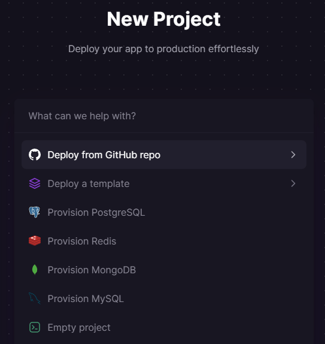
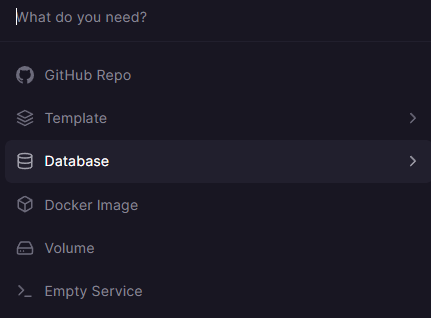

{{LearnSidebar}}{{PreviousMenuNext("Learn/Server-side/Django/Testing", "Learn/Server-side/Django/web_application_security", "Learn/Server-side/Django")}}

Now you've created (and tested) an awesome [LocalLibrary](/en-US/docs/Learn/Server-side/Django/Tutorial_local_library_website) website, you're going to want to install it on a public web server so that it can be accessed by library staff and members over the internet. This article provides an overview of how you might go about finding a host to deploy your website, and what you need to do in order to get your site ready for production.

<table>
  <tbody>
    <tr>
      <th scope="row">Prerequisites:</th>
      <td>
        Complete all previous tutorial topics, including <a href="/en-US/docs/Learn/Server-side/Django/Testing">Django Tutorial Part 10: Testing a Django web application</a>.
      </td>
    </tr>
    <tr>
      <th scope="row">Objective:</th>
      <td>To learn where and how you can deploy a Django app to production.</td>
    </tr>
  </tbody>
</table>

## Overview

Once your site is finished (or finished "enough" to start public testing) you're going to need to host it somewhere more public and accessible than your personal development computer.

Up to now you've been working in a development environment, using the Django development web server to share your site to the local browser/network, and running your website with (insecure) development settings that expose debug and other private information. Before you can host a website externally you're first going to have to:

- Make a few changes to your project settings.
- Choose an environment for hosting the Django app.
- Choose an environment for hosting any static files.
- Set up a production-level infrastructure for serving your website.

This tutorial provides some guidance on your options for choosing a hosting site, a brief overview of what you need to do in order to get your Django app ready for production, and a working example of how to install the LocalLibrary website onto the [Railway](https://railway.app/) cloud hosting service.

## What is a production environment?

The production environment is the environment provided by the server computer where you will run your website for external consumption. The environment includes:

- Computer hardware on which the website runs.
- Operating system (e.g. Linux, Windows).
- Programming language runtime and framework libraries on top of which your website is written.
- Web server used to serve pages and other content (e.g. Nginx, Apache).
- Application server that passes "dynamic" requests between your Django website and the web server.
- Databases on which your website is dependent.

> **Note:** Depending on how your production environment is configured you might also have a reverse proxy, load balancer, and so on.

The server computer could be located on your premises and connected to the internet by a fast link, but it is far more common to use a computer that is hosted "in the cloud". What this actually means is that your code is run on some remote computer (or possibly a "virtual" computer) in your hosting company's data center(s). The remote server will usually offer some guaranteed level of computing resources (CPU, RAM, storage memory, etc.) and internet connectivity for a certain price.

This sort of remotely accessible computing/networking hardware is referred to as _Infrastructure as a Service (IaaS)_. Many IaaS vendors provide options to preinstall a particular operating system, onto which you must install the other components of your production environment. Other vendors allow you to select more fully-featured environments, perhaps including a complete Django and web-server setup.

> **Note:** Pre-built environments can make setting up your website very easy because they reduce the configuration, but the available options may limit you to an unfamiliar server (or other components) and may be based on an older version of the OS. Often it is better to install components yourself, so that you get the ones that you want, and when you need to upgrade parts of the system, you have some idea of where to start!

Other hosting providers support Django as part of a _Platform as a Service_ (PaaS) offering. In this sort of hosting you don't need to worry about most of your production environment (web server, application server, load balancers) as the host platform takes care of those for you — along with most of what you need to do in order to scale your application.
That makes deployment quite easy, because you just need to concentrate on your web application and not all the other server infrastructure.

Some developers will choose the increased flexibility provided by IaaS over PaaS, while others will appreciate the reduced maintenance overhead and easier scaling of PaaS. When you're getting started, setting up your website on a PaaS system is much easier, and so that is what we'll do in this tutorial.

> **Note:** If you choose a Python/Django-friendly hosting provider they should provide instructions on how to set up a Django website using different configurations of web server, application server, reverse proxy, and so on. (this won't be relevant if you choose a PaaS). For example, there are many step-by-step guides for various configurations in the [Digital Ocean Django community docs](https://www.digitalocean.com/community/tutorials?q=django).

## Choosing a hosting provider

There are many hosting providers that are known to either actively support or work well with Django, including: [Heroku](https://www.heroku.com/), [Digital Ocean](https://www.digitalocean.com/), [Railway](https://railway.app/), [Python Anywhere](https://www.pythonanywhere.com/), [Amazon Web Services](https://aws.amazon.com/), [Azure](https://azure.microsoft.com/en-us/), [Google Cloud](https://cloud.google.com/), [Hetzner](https://www.hetzner.com/), and [Vultr Cloud Compute](https://www.vultr.com/news/new-free-tier-plan/) — to name just a few.
These vendors provide different types of environments (IaaS, PaaS), and different levels of computing and network resources at different prices.

Some of the things to consider when choosing a host:

- How busy your site is likely to be and the cost of data and computing resources required to meet that demand.
- Level of support for scaling horizontally (adding more machines) and vertically (upgrading to more powerful machines) and the costs of doing so.
- Where the supplier has data centres, and hence where access is likely to be fastest.
- The host's historical uptime and downtime performance.
- Tools provided for managing the site — are they easy to use and are they secure (e.g. SFTP vs. FTP).
- Inbuilt frameworks for monitoring your server.
- Known limitations. Some hosts will deliberately block certain services (e.g. email). Others offer only a certain number of hours of "live time" in some price tiers, or only offer a small amount of storage.
- Additional benefits. Some providers will offer free domain names and support for TLS certificates that you would otherwise have to pay for.
- Whether the "free" tier you're relying on expires over time, and whether the cost of migrating to a more expensive tier means you would have been better off using some other service in the first place!

The good news when you're starting out is that there are quite a few sites that provide "free" computing environments that are intended for evaluation and testing.
These are usually fairly resource constrained/limited environments, and you do need to be aware that they may expire after some introductory period or have other constraints.
They are however great for testing low traffic sites in a hosted environment, and can provide an easy migration to paying for more resources when your site gets busier.
Popular choices in this category include [Vultr Cloud Compute](https://www.vultr.com/news/new-free-tier-plan/), [Python Anywhere](https://www.pythonanywhere.com/), [Amazon Web Services](https://docs.aws.amazon.com/awsaccountbilling/latest/aboutv2/billing-free-tier.html), [Microsoft Azure](https://azure.microsoft.com/pricing/details/app-service/), and so on.

Most providers also offer a "basic" tier that is intended for small production sites, and which provide more useful levels of computing power and fewer limitations.
[Railway](https://railway.app/), [Heroku](https://www.heroku.com/), and [Digital Ocean](https://www.digitalocean.com/) are examples of popular hosting providers that have a relatively inexpensive basic computing tier (in the $5 to $10 USD per month range).

> **Note:** Remember that price is not the only selection criterion. If your website is successful, it may turn out that scalability is the most important consideration.

## Getting your website ready to publish

The [Django skeleton website](/en-US/docs/Learn/Server-side/Django/skeleton_website) created using the _django-admin_ and _manage.py_ tools are configured to make development easier. Many of the Django project settings (specified in **settings.py**) should be different for production, either for security or performance reasons.

> **Note:** It is common to have a separate **settings.py** file for production, and/or to conditionally import sensitive settings from a separate file or an environment variable. This file should then be protected, even if the rest of the source code is available on a public repository.

The critical settings that you must check are:

- `DEBUG`. This should be set as `False` in production (`DEBUG = False`). This stops the sensitive/confidential debug trace and variable information from being displayed.
- `SECRET_KEY`. This is a large random value used for CSRF protection, etc. It is important that the key used in production is not in source control or accessible outside the production server.

The Django documents suggest that secret information might best be loaded from an environment variable or read from a server-only file.
Let's change the _LocalLibrary_ application so that we read our `SECRET_KEY` and `DEBUG` variables from environment variables if they are defined, falling back to values defined in an **.env** file in the root, and lastly to using the default values in the configuration file.
This is very flexible as it allows any configuration supported by the hosting server.

For reading environment values from a file we'll use [python-dotenv](https://pypi.org/project/python-dotenv/).
This is a library for reading key-value pairs out of a file and using them as environment variables, but only if the corresponding environment variable is not defined.

Install the library into your virtual environment as shown (and also update your `requirements.txt` file):

```bash
pip3 install python-dotenv
```

Then open **/locallibrary/settings.py** and insert the following code after `BASE_DIR` is defined, but before the security warning: `# SECURITY WARNING: keep the secret key used in production secret!`

```py
# Support env variables from .env file if defined
import os
from dotenv import load_dotenv
env_path = load_dotenv(os.path.join(BASE_DIR, '.env'))
load_dotenv(env_path)
```

This loads the `.env` file from the root of the web application.
Variables defined as `KEY=VALUE` in the file are imported when the key is used in `os.environ.get('<KEY>'', '<DEFAULT VALUE>')`, if defined.

> **Note:** Any values that you add to **.env** are likely to be _secrets_!
> You must not save them to GitHub, and you should add `.env` to your `.gitignore` file so that it is not added by accident.

Next disable the original `SECRET_KEY` configuration and add the new lines as shown below.
During development no environment variable will be specified for the key, so the default value will be used (it shouldn't matter what key you use here, or if the key "leaks", because you won't use it in production).

```python
# SECURITY WARNING: keep the secret key used in production secret!
# SECRET_KEY = 'django-insecure-&psk#na5l=p3q8_a+-$4w1f^lt3lx1c@d*p4x$ymm_rn7pwb87'
import os
SECRET_KEY = os.environ.get('DJANGO_SECRET_KEY', 'django-insecure-&psk#na5l=p3q8_a+-$4w1f^lt3lx1c@d*p4x$ymm_rn7pwb87')
```

Then comment out the existing `DEBUG` setting and add the new line shown below.

```python
# SECURITY WARNING: don't run with debug turned on in production!
# DEBUG = True
DEBUG = os.environ.get('DJANGO_DEBUG', '') != 'False'
```

The value of the `DEBUG` will be `True` by default, but will only be `False` if the value of the `DJANGO_DEBUG` environment variable is set to `False` or `DJANGO_DEBUG=False` is set in the **.env** file.
Please note that environment variables are strings and not Python types. We therefore need to compare strings. The only way to set the `DEBUG` variable to `False` is to actually set it to the string `False`.

You can set the environment variable to "False" on Linux by issuing the following command:

```bash
export DJANGO_DEBUG=False
```

A full checklist of settings you might want to change is provided in [Deployment checklist](https://docs.djangoproject.com/en/5.0/howto/deployment/checklist/) (Django docs). You can also list a number of these using the terminal command below:

```python
python3 manage.py check --deploy
```

#### Gunicorn

[Gunicorn](https://gunicorn.org/) is a pure-Python HTTP server that is commonly used for serving Django WSGI applications.

While we don't need _Gunicorn_ to serve our LocalLibrary application during development, we'll install it locally so that it becomes part of our [requirements](#requirements) when the application is deployed.

First make sure that you're in the Python virtual environment that was created when you [set up the development environment](/en-US/docs/Learn/Server-side/Django/development_environment) (use the `workon [name-of-virtual-environment]` command).
Then install _Gunicorn_ locally on the command line using _pip_:

```bash
pip3 install gunicorn
```

#### Database configuration

SQLite, the default Django database that you've been using for development, is a reasonable choice for small to medium websites.
Unfortunately it cannot be used on some popular hosting services, such as Heroku, because they don't provide persistent data storage in the application environment (a requirement of SQLite).
While that might not affect us for the example deployment(s), we'll show you another approach that will work on Railway, Heroku, and some other services.

The approach is to use a database that runs in its own process somewhere on the Internet, and is accessed by the Django library application using an address passed as an environment variable.
In this case we'll use a Postgres database that is also hosted on Railway, but you could use any database hosting service you like.

The database connection information will be supplied to Django using an environment variable named `DATABASE_URL`.
Rather than hard-coding this information into Django, we'll use the [dj-database-url](https://pypi.org/project/dj-database-url/) package to parse the `DATABASE_URL` environment variable and automatically convert it to Django's desired configuration format.
In addition to installing the _dj-database-url_ package we'll also need to install [psycopg2](https://www.psycopg.org/), as Django needs this to interact with Postgres databases.

##### dj-database-url

_dj-database-url_ is used to extract the Django database configuration from an environment variable.

Install it locally so that it becomes part of our [requirements](#requirements) to set up on the deployment server:

```bash
pip3 install dj-database-url
```

##### settings.py

Open **/locallibrary/settings.py** and copy the following configuration into the bottom of the file:

```python
# Update database configuration from $DATABASE_URL environment variable (if defined)
import dj_database_url

if 'DATABASE_URL' in os.environ:
    DATABASES['default'] = dj_database_url.config(
        conn_max_age=500,
        conn_health_checks=True,
    )
```

Django will now use the database configuration in `DATABASE_URL` if the environment variable is set; otherwise it uses the default SQLite database.
The value `conn_max_age=500` makes the connection persistent, which is far more efficient than recreating the connection on every request cycle (this is optional and can be removed if needed).

##### psycopg2

<!-- Django 4.2 now supports Psycopg (3) : https://docs.djangoproject.com/en/5.0/releases/4.2/#psycopg-3-support
  But didn't work on Railway!
  Try again to update in next release.
-->

Django needs _psycopg2_ to work with Postgres databases.
Install it locally so that it becomes part of our [requirements](#requirements) for Railway to set up on the remote server:

```bash
pip3 install psycopg2-binary
```

Note that Django will use the SQLite database during development by default, unless `DATABASE_URL` is set.
You can switch to Postgres completely and use the same hosted database for development and production by setting the same environment variable in your development environment (Railway makes it easy to use the same environment for production and development).
Alternatively you can also install and use a [self-hosted Postgres database](https://www.psycopg.org/docs/install.html) on your local computer.

#### Serving static files in production

During development we use Django and the Django development web server to serve both our dynamic HTML and our static files (CSS, JavaScript, etc.).
This is inefficient for static files, because the requests have to pass through Django even though Django doesn't do anything with them.
While this doesn't matter during development, it would have a significant performance impact if we were to use the same approach in production.

In the production environment we typically separate the static files from the Django web application, making it easier to serve them directly from the web server or from a content delivery network (CDN).

The important setting variables are:

- `STATIC_URL`: This is the base URL location from which static files will be served, for example on a CDN.
- `STATIC_ROOT`: This is the absolute path to a directory where Django's _collectstatic_ tool will gather any static files referenced in our templates. Once collected, these can then be uploaded as a group to wherever the files are to be hosted.
- `STATICFILES_DIRS`: This lists additional directories that Django's _collectstatic_ tool should search for static files.

Django templates refer to static file locations relative to a `static` tag (you can see this in the base template defined in [Django Tutorial Part 5: Creating our home page](/en-US/docs/Learn/Server-side/Django/Home_page#the_locallibrary_base_template)), which in turn maps to the `STATIC_URL` setting.
Static files can therefore be uploaded to any host and you can update your application to find them using this setting.

The _collectstatic_ tool is used to collect static files into the folder defined by the `STATIC_ROOT` project setting.
It is called with the following command:

```bash
python3 manage.py collectstatic
```

For this tutorial, _collectstatic_ can be run before the application is uploaded, copying all the static files in the application to the location specified in `STATIC_ROOT`.
`Whitenoise` then finds the files from the location defined by `STATIC_ROOT` (by default) and serves them at the base URL defined by `STATIC_URL`.

##### settings.py

Open **/locallibrary/settings.py** and copy the following configuration into the bottom of the file.
The `BASE_DIR` should already have been defined in your file (the `STATIC_URL` may already have been defined within the file when it was created.
While it will cause no harm, you might as well delete the duplicate previous reference).

```python
# Static files (CSS, JavaScript, Images)
# https://docs.djangoproject.com/en/5.0/howto/static-files/

# The absolute path to the directory where collectstatic will collect static files for deployment.
STATIC_ROOT = BASE_DIR / 'staticfiles'

# The URL to use when referring to static files (where they will be served from)
STATIC_URL = '/static/'
```

We'll actually do the file serving using a library called [WhiteNoise](https://pypi.org/project/whitenoise/), which we install and configure in the next section.

#### Whitenoise

There are many ways to serve static files in production (we saw the relevant Django settings in the previous sections).
The [WhiteNoise](https://pypi.org/project/whitenoise/) project provides one of the easiest methods for serving static assets directly from Gunicorn in production.

Check out [WhiteNoise](https://pypi.org/project/whitenoise/) documentation for an explanation of how it works and why the implementation is a relatively efficient method for serving these files.

The steps to set up _WhiteNoise_ to use with the project are [given here](https://whitenoise.evans.io/en/stable/django.html) (and reproduced below):

##### Install whitenoise

Install whitenoise locally using the following command:

```bash
pip3 install whitenoise
```

##### settings.py

To install _WhiteNoise_ into your Django application, open **/locallibrary/settings.py**, find the `MIDDLEWARE` setting and add the `WhiteNoiseMiddleware` near the top of the list, just below the `SecurityMiddleware`:

```python
MIDDLEWARE = [
    'django.middleware.security.SecurityMiddleware',
    'whitenoise.middleware.WhiteNoiseMiddleware',
    'django.contrib.sessions.middleware.SessionMiddleware',
    'django.middleware.common.CommonMiddleware',
    'django.middleware.csrf.CsrfViewMiddleware',
    'django.contrib.auth.middleware.AuthenticationMiddleware',
    'django.contrib.messages.middleware.MessageMiddleware',
    'django.middleware.clickjacking.XFrameOptionsMiddleware',
]
```

Optionally, you can reduce the size of the static files when they are served (this is more efficient).
Just add the following to the bottom of **/locallibrary/settings.py**:

```python
# Static file serving.
# https://whitenoise.readthedocs.io/en/stable/django.html#add-compression-and-caching-support
STORAGES = {
    # ...
    "staticfiles": {
        "BACKEND": "whitenoise.storage.CompressedManifestStaticFilesStorage",
    },
}
```

You don't need to do anything else to configure _WhiteNoise_ because it uses your project settings for `STATIC_ROOT` and `STATIC_URL` by default.

#### Requirements

The Python requirements of your web application should be stored in a file **requirements.txt** in the root of your repository.
Many hosting services will automatically install dependencies in this file (in others you have to do this yourself).
You can create this file using _pip_ on the command line (run the following in the repo root):

```bash
pip3 freeze > requirements.txt
```

After installing all the different dependencies above, your **requirements.txt** file should have _at least_ these items listed (though the version numbers may be different).
Please delete any other dependencies not listed below, unless you've explicitly added them for this application.

```plain
Django==5.0.2
dj-database-url==2.1.0
gunicorn==21.2.0
psycopg2-binary==2.9.9
wheel==0.38.1
whitenoise==6.6.0
python-dotenv==1.0.1
```

### Update your application repository in GitHub

Many hosting services allow you to import and/or synchronize projects from a local repository or from cloud-based source version control platforms.
This can make deployment and iterative development much easier.

You should already be using GitHub to store the local library source code (this was set up in [Source code management with Git and GitHub](/en-US/docs/Learn/Server-side/Django/development_environment#source_code_management_with_git_and_github) as part of setting up your development environment.

This is a good point to make a backup of your "vanilla" project — while some of the changes we're going to be making in the following sections might be useful for deployment on any hosting service (or for development) others might not.
Assuming you have already backed up all the changes made so far to the `main` branch on GitHub you can create a new branch to backup your changes as shown:

```bash
# Fetch the latest main branch
git checkout main
git pull origin main

# Create branch vanilla_deployment from the current branch (main)
git checkout -b vanilla_deployment

# Push the new branch to GitHub
git push origin vanilla_deployment

# Switch back to main
git checkout main

# Make any further changes in a new branch
git checkout -b my_changes_for_deployment # Create a new branch
```

## Example: Hosting on PythonAnywhere

This section provides a practical demonstration of how to host _LocalLibrary_ on [PythonAnywhere](https://www.pythonanywhere.com/).

### Why PythonAnywhere?

We are choosing to use PythonAnywhere for several reasons:

- PythonAnywhere has a [free beginner plan](https://www.pythonanywhere.com/pricing/) that is _really_ free, albeit with some limitations.
  The fact that it is affordable for all developers is really important to MDN!

  > **Note:** This tutorial has been hosted on Heroku, Railway, and now PythonAnywhere, migrating when the previously free plans were discontinued.
  > We've chosen PythonAnywhere because we think this plan is likely to remain free.
  > We've kept the Railway example too, which is not free, for comparison, and because it allows us to more easily demonstrate features such as integration with a Postgres databases running on a different service.

- PythonAnywhere takes care of the infrastructure so you don't have to.
  Not having to worry about servers, load balancers, reverse proxies, and so on, makes it much easier to get started.
- The skills and concepts you will learn when using PythonAnywhere are transferrable.
- The service and plan limitations do not particularly impact us using PythonAnywhere for the tutorial.
  For example:

  - The beginner plan allows one web app at `<your-username>.pythonanywhere.com`, restricted outbound Internet access from your apps, low CPU/bandwidth, no IPython/Jupyter notebook support, no free Postgres database.
    But there is enough space for our basic site to run!
  - Custom domains are not supported (at time of writing).
  - The environment shuts down when not in use, so may be slow to restart.
    You can run it forever, but you will need to visit the site every three months and renew the web application.
  - There is free support for a separate MySQL database, but not Postgres.
    In this demonstration we'll just use the default Django SQLite database.

PythonAnywhere is appropriate for hosting this demonstration, and can be scaled to larger projects if needed.
You should take the time to determine if it is [suitable for your own website](#choosing_a_hosting_provider).

### How does PythonAnywhere work?

PythonAnywhere provides an entirely web-based interface for uploading, editing, and otherwise working with your application.

Through the interface you can launch a bash console to a Ubuntu Linux environment in which you can create your application.
In this demonstration we'll use the console to clone our local library GitHub repository, and create a Python environment in which we can run the web application.

The free plan doesn't provides separate Postgres support.
While we could use some other hosting service for our database, we'll just use the default SQLite database created by Django in the hosted Ubuntu environment (there is more than enough space for demonstrating the library functionality).

Once the application is running, it can be configured for production by setting environment variables through the bash console.

That's all the overview you need to get started.

### Get a PythonAnywhere account

To start using PythonAnywhere you will first need to create an account:

- Go to PythonAnywhere [Plans and pricing](https://www.pythonanywhere.com/pricing/) page, and select the **Create a Beginner account** button.
- Create an account with your username, email, and password, acknowledge the terms and conditions, and then select **Register**.
- You'll then be logged in and redirected to the PythonAnywhere dashboard: `https://www.pythonanywhere.com/user/<your_user_name>/`.

### Install library from GitHub

Next we're going open a Bash prompt, set up a virtual environment, and fetch the local library source code from GitHub.
We'll also configure the default database and collect static files so that they can be served by PythonAnywhere.

1. First open the Console management screen by selecting **Consoles** in the top application bar.
2. Then select the **Bash** link to create and launch a new console:

   

   Note that any console that you create is saved for your later re-use, along with all its history.
   The green arrow above shows that this account has a console we could have opened instead.

3. In the console, enter the following command to create a Python 3.10 virtual environment named "env_local_library" for installing the local library dependencies.

   ```bash
   mkvirtualenv --python=python3.10 env_local_library
   ```

   This is exactly the same process as covered in [Setting up a Django development environment](/en-US/docs/Learn/Server-side/Django/development_environment).
   We could have named the environment anything, and we can deactivate it and reactivate it using the commands below:

   ```bash
   deactivate
   workon env_local_library
   ```

4. Next get the library sources from GitHub.
   PythonAnywhere expects you to install applications in a folder named after your site URL.

   > **Note:** Because we're using the free account you can only name your account `<your_pythonaware_username>.pythonanywhere.com` (for example, if your username is "Odtsetseg" you will have to put the local library source into a folder named `odtsetseg.pythonanywhere.com`).

   Enter the following command to clone your library sources into an appropriately named folder (you will need to replace the username values with your own name):

   ```bash
   git clone https://github.com/<github_username>/django-locallibrary-tutorial.git <pythonaware_username>.pythonanywhere.com

   # Navigate into the new folder
   cd <pythonaware_username>.pythonanywhere.com
   ```

5. Install the library dependencies using the `requirements.txt` file:

   ```bash
   pip3 install -r requirements.txt
   ```

6. Create and configure an SQLite database on the hosting computer (just as we did during development).

   ```bash
   python manage.py migrate
   ```

   > **Note:** For the Railway example we will [Configure a Postgres database](#provision_and_connect_a_postgres_sql_database), and connect to it by setting the `DATABASE_URL` environment variable.
   > It is important that `migrate` is called _after_ configuring what database to use database.

7. Collect all the static files into a location where they can be [served in production](#serving_static_files_in_production):

   ```bash
   python manage.py collectstatic --no-input
   ```

8. Create a superuser for accessing the site (as covered in the [Django admin site](/en-US/docs/Learn/Server-side/Django/Admin_site#creating_a_superuser) section):

   ```bash
   python manage.py createsuperuser
   ```

   Note the details, as you'll need them to test your site.

### Setup the web app

After getting the local library sources and installing the dependencies in a virtual environment, we need to tell PythonAnywhere how to find them and use them as a web app.

1. Navigate to the _Web_ section of the site and select the **Add a new web app** link:

   

   The _Create new web app_ wizard will then open to guide you through configuring the main properties of the web app.

2. Select **Next** to skip through the web app domain name configuration.
   The free account will create the domain based on your user name: `<user_name>.pythonanywhere.com`.

   

3. In the _Select a Python Web framework_ screen select **Manual configuration**.

   

   Manual configuration allows us complete control over how the environment is configured.
   This doesn't matter so much now, but it would if we were hosting multiple sites, potentially with different versions of Python and/or Django.

4. In the _Select a Python version_ screen select **3.10**

   

   More generally you should select the latest version of Python allowed by the version of Django that you are using.

5. In the _Manual configuration_ screen select **Next** (the screen just explains some of the options for configuration)

   

   The web app is created, and displayed in the Web section as shown.
   The screen has a **Reload** button that you can use to reload the web application after you make any further changes.
   As noted on the screen, you'll need to click the **Run until 3 months from today** button to keep the site alive for another three months (and ongoing).

   

6. Scroll down to the "Code" section of the _Web_ tab and select the link to the WSGI configuration file.
   This will have a name with the form `/var/www/<user_name>_pythonanywhere_com_wsgi.py`.

   

   Replace the content in the file with the following text (first updating "hamishwillee" with your own username), and then select the **Save** button.

   ```py
   import os
   import sys

   path = '/home/hamishwillee/hamishwillee.pythonanywhere.com'
   if path not in sys.path:
       sys.path.append(path)

   os.environ['DJANGO_SETTINGS_MODULE'] = 'locallibrary.settings'

   from django.core.wsgi import get_wsgi_application
   application = get_wsgi_application()
   ```

   Note that the role of the WSGI file is to help the Gunicorn server find the local library application.
   PythonAnywhere expects this file to be in this location, which is why the WSGI file already in the project cannot be used.

7. Scroll down to the "Virtualenv" section of the _Web_ tab.
   Select the link **Enter the path to a virtual env, if desired** and enter the path of the virtual environment created in the previous section.
   If you named it "env_local_library" as suggested, the path will be: `/home/<user_name>/.virtualenvs/env_local_library`

   

8. Scroll down to the "Static files" section of the _Web_ tab.

   

   Select the **Enter URL** link and enter `\static_files\`.
   This is the `STATIC_URL` in the [application settings](#settings.py_2), and reflects the location where files were copied when we ran `collectstatic` in the previous section.

9. Near the top of the _Web_ tab select the **Reload** button to restart the site.
   Then then select the site URL link to launch the live site:


### Set ALLOWED_HOSTS and CSRF_TRUSTED_ORIGINS

When the site is opened, at this point you'll see an error debug screen as shown below.
This is a Django security error that is raised because our source code is not running on an "allowed host".


> **Note:** This kind of debug information is very useful when you're getting set up, but is a security risk in a deployed site.
> In the next section we'll show you how to disable this level of logging on the live site using [environment variables](#using_environment_variables_on_pythonanywhere).

Open **/locallibrary/settings.py** in your GitHub project and change the [ALLOWED_HOSTS](https://docs.djangoproject.com/en/5.0/ref/settings/#allowed-hosts) setting to include your PythonAnywhere site URL:

```python
## For example, for a site URL at 'hamishwillee.pythonanywhere.com'
## (replace the string below with your own site URL):
ALLOWED_HOSTS = ['hamishwillee.pythonanywhere.com', '127.0.0.1']

# During development, you can instead set just the base URL
# (you might decide to change the site a few times).
# ALLOWED_HOSTS = ['.pythonanywhere.com','127.0.0.1']
```

Since the applications uses CSRF protection, you will also need to set the [CSRF_TRUSTED_ORIGINS](https://docs.djangoproject.com/en/5.0/ref/settings/#csrf-trusted-origins) key.
Open **/locallibrary/settings.py** and add a line like the one below:

```python
## For example, for a site URL is at 'web-production-3640.up.railway.app'
## (replace the string below with your own site URL):
CSRF_TRUSTED_ORIGINS = ['https://hamishwillee.pythonanywhere.com']

# During development/for this tutorial you can instead set just the base URL
# CSRF_TRUSTED_ORIGINS = ['https://*.pythonanywhere.com']
```

Save these settings and commit them to your GitHub repo.

You will then need to update the version of your project on PythonAnywhere.
Assuming you're using your Bash prompt in the folder `<user_name>.pythonanywhere.com`, and you have pushed the changes to the main branch, then you could import them in the Bash prompt using the command:

```Bash
git pull origin main
```

Use the **Restart** button on the `Web` tab to restart the application.
If you refresh your hosted site, it should now open and display the home page of the site.

You should be able to log in with the superuser account you created above, and create authors, genres, books, and so on, just as you did on your local computer.

### Using environment variables on PythonAnywhere

In the section on [Getting your website ready to publish](#getting_your_website_ready_to_publish) we modified the application so that it can be configured using environment variables or variables in a **.env** file in production.

Specifically we set up the library so that you can set:

- `DJANGO_DEBUG=False` to reduce the debug tracing shown to the user when there is an error.
- `DJANGO_SECRET_KEY` to some secret value in production.
- `DATABASE_URL` if your application uses a hosted database (we do not in this example).

The way that environment variables are set depends on the hosting service.
For PythonAnywhere you need to read them from an environment file.
We're already set up for that, so all we need to do is create the file.

The steps are:

1. Open a PythonAware Bash prompt.
2. Navigate to your application directory (replacing `<user-name>` with your own account):

   ```bash
   cd ~/<user-name>.pythonanywhere.com
   ```

3. Set the environment variables by writing them as key-value pairs to the `.env` file.
   For example, to set `DJANGO_DEBUG` to `False` in the Bash console, enter the following command:

   ```bash
   echo "DJANGO_DEBUG=False" >> .env
   ```

4. Restart the application.

You can test that the operation worked by attempting to open a record that does not exist (for example, create a genre, then increment the number in the URL bar to open a record that has not yet been created).
If the environment variable has been loaded you'll get a "Not found" message rather than a detailed debug trace.

## Example: Hosting on Railway

This section provides a practical demonstration of how to install _LocalLibrary_ on [Railway](https://railway.app/).

### Why Railway?

> **Warning:** Railway no longer has a completely free starter tier.
> We've kept these instructions because Railway has some great features, and will be a better option for some users.

Railway is an attractive hosting option for several reasons:

- Railway takes care of most of the infrastructure so you don't have to.
  Not having to worry about servers, load balancers, reverse proxies, and so on, makes it much easier to get started.
- Railway has a [focus on developer experience for development and deployment](https://docs.railway.app/reference/compare-to-heroku), which leads to a faster and softer learning curve than many other alternatives.
- The skills and concepts you will learn when using Railway are transferrable.
  While Railway has some excellent new features, other popular hosting services use many of the same ideas and approaches.
- [Railway documentation](https://docs.railway.app/) is clear and complete.
- The service appears to be very reliable, and if you end up loving it, the pricing is predictable, and scaling your app is very easy.

You should take the time to determine if Railway is [suitable for your own website](#choosing_a_hosting_provider).

### How does Railway work?

Web applications are each run in their own isolated and independent virtualized container.
In order to execute your application, Railway needs to be able to set up the appropriate environment and dependencies, and also understand how it is launched.
For Django apps we provide this information in a number of text files:

- **runtime.txt**: states the programming language and version to use.
- **requirements.txt**: lists the Python dependencies needed for your site, including Django.
- **Procfile**: A list of processes to be executed to start the web application.
  For Django this will usually be the Gunicorn web application server (with a `.wsgi` script).
- **wsgi.py**: [WSGI](https://wsgi.readthedocs.io/en/latest/what.html) configuration to call our Django application in the Railway environment.

Once the application is running it can configure itself using information provided in [environment variables](https://docs.railway.app/develop/variables).
For example, an application that uses a database can get the address using the variable `DATABASE_URL`.
The database service itself may be hosted by Railway or some other provider.

Developers interact with Railway through the Railway site, and using a special [Command Line Interface (CLI)](https://docs.railway.app/develop/cli) tool.
The CLI allows you to associate a local GitHub repository with a railway project, upload the repository from the local branch to the live site, inspect the logs of the running process, set and get configuration variables and much more.
One of the most useful features is that you can use the CLI to run your local project with the same environment variables as the live project.

In order to get our application to work on Railway, we'll need to put our Django web application into a git repository, add the files above, integrate with a database add-on, and make changes to properly handle static files.
Once we've done all that, we can set up a Railway account, get the Railway client, and install our website.

That's all the overview you need in order to get started.

### Update the app for Railway

This section explains the changes you'll need to make to our _LocalLibrary_ application to get it to work on Railway.
We really only have to create a `Procfile` and `runtime.txt` file, because almost everything else is already present.

Note that these changes will not prevent you using the local testing and workflows we've already learned.

#### Procfile

A _Procfile_ is the web application "entry point".
It lists the commands that will be executed by Railway to start your site.

Create the file `Procfile` (with no file extension) in the root of your GitHub repo and copy/paste in the following text:

```plain
web: python manage.py migrate && python manage.py collectstatic --no-input && gunicorn locallibrary.wsgi
```

The `web:` prefix tells Railway that this is a web process and can be sent HTTP traffic.
We then call the command Django migration command `python manage.py migrate` to set up the database tables.
Next, we call the Django command `python manage.py collectstatic` to collect static files into the folder defined by the `STATIC_ROOT` project setting (see the section [serving static files in production](#serving_static_files_in_production) below).
Finally, we start the _gunicorn_ process, a popular web application server, passing it configuration information in the module `locallibrary.wsgi` (created with our application skeleton: **/locallibrary/wsgi.py**).

You will note that we already set up the project to include _gunicorn_ and support serving static files!

You can also use the Procfile to start worker processes or to run other non-interactive tasks before the release is deployed.

#### Runtime

The **runtime.txt** file, if defined, tells Railway which version of Python to use.
Create the file in the root of the repo and add the following text:

```plain
python-3.10.2
```

> **Note:** Hosting providers do not necessarily support every Python runtime minor version.
> They will generally use the closest supported version to the value that you specify.

#### Re-test and save changes to GitHub

Before you proceed, first test the site again locally and make sure it wasn't broken by any of the changes above.
Run the development web server as usual and then check the site still works as you expect on your browser.

```bash
python3 manage.py runserver
```

Next, lets `push` the changes to GitHub.
In the terminal (after having navigated to our local repository), enter the following commands:

```python
git checkout -b railway_changes
git add -A
git commit -m "Added files and changes required for deployment"
git push origin railway_changes
```

Then create and merge the PR on GitHub.

We should now be ready to start deploying LocalLibrary on Railway.

### Get a Railway account

To start using Railway you will first need to create an account:

- Go to [railway.app](https://railway.app/) and click the **Login** link in the top toolbar.
- Select GitHub in the popup to login using your GitHub credentials
- You may then need to go to your email and verify your account.
- You'll then be logged in to the Railway.app dashboard: <https://railway.app/dashboard>.

### Deploy on Railway from GitHub

Next we'll set up Railway to deploy our library from GitHub.
First choose the **Dashboard** option from the site top menu, then select the **New Project** button:


Railway will display a list of options for the new project, including the option to deploy a project from a template that is first created in your GitHub account, and a number of databases.
Select **Deploy from GitHub repo**.



All projects in the GitHub repos you shared with Railway during setup are displayed.
Select your GitHub repository for the local library: `<user-name>/django-locallibrary-tutorial`.


Confirm your deployment by selecting **Deploy Now**.


Railway will then load and deploy your project, displaying progress on the deployments tab.
When deployment successfully completes, you'll see a screen like the one below.


You can click the site URL (highlighted above) to open the site in a browser (it still won't work, because the setup is not complete).

### Set ALLOWED_HOSTS and CSRF_TRUSTED_ORIGINS

When the site is opened, at this point you'll see an error debug screen as shown below.
This is a Django security error that is raised because our source code is not running on an "allowed host".


> **Note:** This kind of debug information is very useful when you're getting set up, but is a security risk in a deployed site.
> We'll show you how to disable it once the site is up and running.

Open **/locallibrary/settings.py** in your GitHub project and change the [ALLOWED_HOSTS](https://docs.djangoproject.com/en/5.0/ref/settings/#allowed-hosts) setting to include your Railway site URL:

```python
## For example, for a site URL at 'web-production-3640.up.railway.app'
## (replace the string below with your own site URL):
ALLOWED_HOSTS = ['web-production-3640.up.railway.app', '127.0.0.1']

# During development, you can instead set just the base URL
# (you might decide to change the site a few times).
# ALLOWED_HOSTS = ['.railway.com','127.0.0.1']
```

Since the applications uses CSRF protection, you will also need to set the [CSRF_TRUSTED_ORIGINS](https://docs.djangoproject.com/en/5.0/ref/settings/#csrf-trusted-origins) key.
Open **/locallibrary/settings.py** and add a line like the one below:

```python
## For example, for a site URL is at 'web-production-3640.up.railway.app'
## (replace the string below with your own site URL):
CSRF_TRUSTED_ORIGINS = ['https://web-production-3640.up.railway.app']

# During development/for this tutorial you can instead set just the base URL
# CSRF_TRUSTED_ORIGINS = ['https://*.railway.app']
```

Then save your settings and commit them to your GitHub repo (Railway will automatically update and redeploy your application).

### Provision and connect a Postgres SQL database

Next we need to create a Postgres database and connect it to the Django application that we just deployed.
(If you open the site now you'll get a new error because the database cannot be accessed).
We will create the database as part of the application project, although you can create the database in its own separate project.

On Railway, choose the **Dashboard** option from the site top menu and then select your application project.
At this stage it just contains a single service for your application (this can be selected to set variables and other details of the service).
The **Settings** button can be selected to change project-wide settings.
Select the **New** button, which is used to add services to the project.


Select **Database** when prompted about the type of service to add:



Then select **Add PostgreSQL** to start adding the database


Railway will then provision a service containing an empty database in the same project.
On completion you will now see both the application and database services in the project view.


Select the web service and then the _Variables_ tab.
Select **New Variable** and then in the _Variable name_ box, select **Add reference**.
Scroll down and select `DATABASE_URL` (this is the name of the variable that we set up the locallibrary to read as an environment variable).


Then select **Add** to add the variable reference and finally **Deploy** (this will appear in a popup).
Note that you could also have opened the Postgres database, then its variable tab, and copied the variable across.

If you open the project now it should display just as it did locally.
Note however that there is no way to populate the library with data yet, because we have not yet created a superuser account.
We'll do that using the [CLI](https://docs.railway.app/develop/cli) tool on our local computer.

### Install the client

Download and install the Railway client for your local operating system by following the [instructions here](https://docs.railway.app/develop/cli).

After the client is installed you will be able to run commands.
Some of the more important operations include deploying the current directory of your computer to an associated Railway project (without having to upload to GitHub), and running your Django project locally using the same settings as you have on the production server.
We show these in the next sections.

You can get a list of all the possible commands by entering the following in a terminal.

```bash
railway help
```

> **Note:** In the following section we use `railway login` and `railway link` to link the current project to a directory.
> If you are logged out by the system, you will need to call both commands again to re-link the project.

### Configure a superuser

In order to create a superuser, we need to call the Django `createsuperuser` command against the production database (this is the same operation as we ran locally in [Django Tutorial Part 4: Django admin site > Creating a superuser](/en-US/docs/Learn/Server-side/Django/Admin_site#creating_a_superuser)).
Railway doesn't provide direct terminal access to the server, and we can't add this command to the [Procfile](#procfile) because it is interactive.

What we can do is call this command locally on our Django project when it is connected to the _production_ database.
The Railway client makes this easy by providing a mechanism to run commands locally using the same environment variables as the production server, including the database connection string.

First open a terminal or command prompt in a git clone of your locallibrary project.
Then login to your browser account using the `login` or `login --browserless` command (follow any resulting prompts and instructions from the client or website to complete the login):

```bash
railway login
```

Once logged in, link your current locallibrary directory to the associated Railway project using the following command.
Note that you will need to select/enter a particular project when prompted:

```bash
railway link
```

Now that the local directory and project are _linked_ you can run the local Django project with settings from the production environment.
First ensure that your normal [Django development environment](/en-US/docs/Learn/Server-side/Django/development_environment) is ready.
Then call the following command, entering name, email, and password as required:

```bash
railway run python manage.py createsuperuser
```

You should now be able to open your website admin area (`https://[your-url].railway.app/admin/`) and populate the database, just as shown in [Django Tutorial Part 4: Django admin site](/en-US/docs/Learn/Server-side/Django/Admin_site)).

### Setting configuration variables

The final step is to make the site secure.
Specifically, we need to disable debug logging and set a secret CSRF key.
The work to read the needed values from environment variables was done in [getting your website ready to publish](#getting_your_website_ready_to_publish) (see `DJANGO_DEBUG` and `DJANGO_SECRET_KEY`).

Open the information screen for the project and select the _Variables_ tab.
This should already have the `DATABASE_URL` as shown below.


There are many ways to generate a cryptographically secret key.
A simple way is to run the following Python command on your development computer:

```bash
python -c "import secrets; print(secrets.token_urlsafe())"
```

Select the **New Variable** button and enter the key `DJANGO_SECRET_KEY` with your secret value (then select **Add**).
Then enter the key `DJANGO_DEBUG` with the value `False`.
The final set of variables should look like this:


### Debugging

The Railway client provides the logs command to show the tail of logs (a more full log is available on the site for each project):

```bash
railway logs
```

If you need more information than this can provide you will need to start looking into [Django Logging](https://docs.djangoproject.com/en/5.0/topics/logging/).

## Summary

That's the end of this tutorial on setting up Django apps in production, and also the series of tutorials on working with Django. We hope you've found them useful. You can check out a fully worked-through version of the [source code on GitHub here](https://github.com/mdn/django-locallibrary-tutorial).

The next step is to read our last few articles, and then complete the assessment task.

## See also

- [Deploying Django](https://docs.djangoproject.com/en/5.0/howto/deployment/) (Django docs)

  - [Deployment checklist](https://docs.djangoproject.com/en/5.0/howto/deployment/checklist/) (Django docs)
  - [Deploying static files](https://docs.djangoproject.com/en/5.0/howto/static-files/deployment/) (Django docs)
  - [How to deploy with WSGI](https://docs.djangoproject.com/en/5.0/howto/deployment/wsgi/) (Django docs)
  - [How to use Django with Apache and mod_wsgi](https://docs.djangoproject.com/en/5.0/howto/deployment/wsgi/modwsgi/) (Django docs)
  - [How to use Django with Gunicorn](https://docs.djangoproject.com/en/5.0/howto/deployment/wsgi/gunicorn/) (Django docs)

- Railway Docs

  - [CLI](https://docs.railway.app/develop/cli)

- Digital Ocean

  - [How To Serve Django Applications with uWSGI and Nginx on Ubuntu 16.04](https://www.digitalocean.com/community/tutorials/how-to-serve-django-applications-with-uwsgi-and-nginx-on-ubuntu-16-04)
  - [Other Digital Ocean Django community docs](https://www.digitalocean.com/community/tutorials?q=django)

- Heroku Docs (similar setup concepts)

  - [Configuring Django apps for Heroku](https://devcenter.heroku.com/articles/django-app-configuration) (Heroku docs)
  - [Getting Started on Heroku with Django](https://devcenter.heroku.com/articles/getting-started-with-python#introduction) (Heroku docs)
  - [Django and Static Assets](https://devcenter.heroku.com/articles/django-assets) (Heroku docs)
  - [Concurrency and Database Connections in Django](https://devcenter.heroku.com/articles/python-concurrency-and-database-connections) (Heroku docs)
  - [How Heroku works](https://devcenter.heroku.com/articles/how-heroku-works) (Heroku docs)
  - [Dynos and the Dyno Manager](https://devcenter.heroku.com/articles/dynos) (Heroku docs)
  - [Configuration and Config Vars](https://devcenter.heroku.com/articles/config-vars) (Heroku docs)
  - [Limits](https://devcenter.heroku.com/articles/limits) (Heroku docs)
  - [Deploying Python applications with Gunicorn](https://devcenter.heroku.com/articles/python-gunicorn) (Heroku docs)
  - [Deploying Python and Django apps on Heroku](https://devcenter.heroku.com/articles/deploying-python) (Heroku docs)

{{PreviousMenuNext("Learn/Server-side/Django/Testing", "Learn/Server-side/Django/web_application_security", "Learn/Server-side/Django")}}
