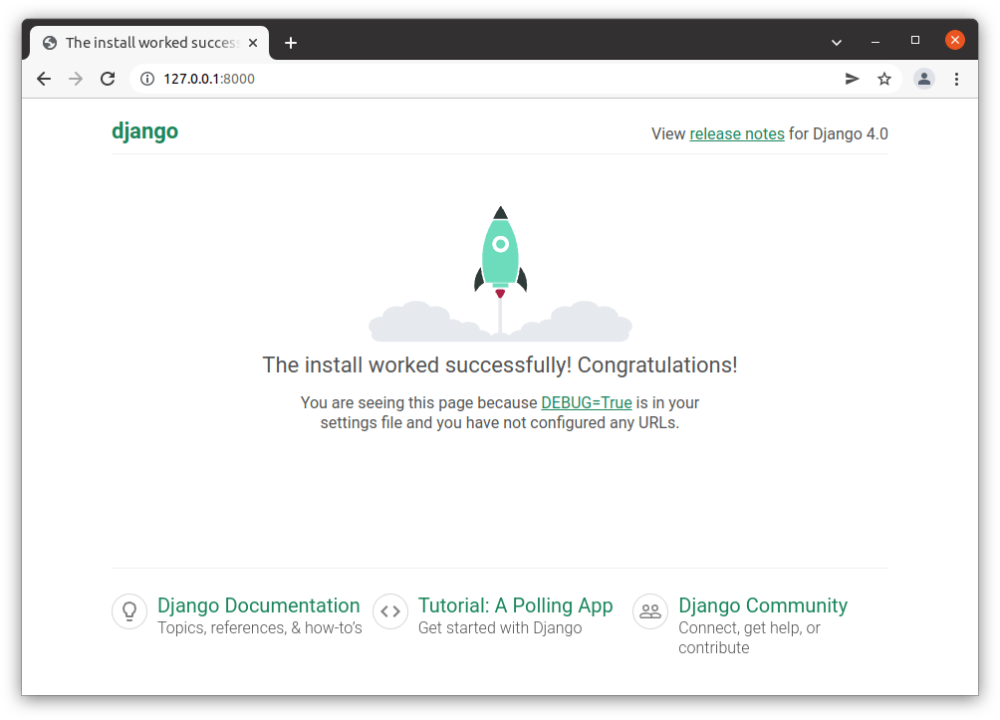

{{LearnSidebar}}{{PreviousMenuNext("Learn/Server-side/Django/Introduction", "Learn/Server-side/Django/Tutorial_local_library_website", "Learn/Server-side/Django")}}

Now that you know what Django is for, we'll show you how to set up and test a Django development environment on Windows, Linux (Ubuntu), and macOS — whatever common operating system you are using, this article should give you what you need to be able to start developing Django apps.

<table>
  <tbody>
    <tr>
      <th scope="row">Prerequisites:</th>
      <td>
        Basic knowledge of using a terminal/command line and how to install software packages on your development computer's operating system.
      </td>
    </tr>
    <tr>
      <th scope="row">Objective:</th>
      <td>
        To have a development environment for Django (4.*) running on your computer.
      </td>
    </tr>
  </tbody>
</table>

## Django development environment overview

Django makes it very easy to set up your own computer so that you can start developing web applications. This section explains what you get with the development environment, and provides an overview of some of your setup and configuration options. The remainder of the article explains the _recommended_ method of installing the Django development environment on Ubuntu, macOS, and Windows, and how you can test it.

### What is the Django development environment?

The development environment is an installation of Django on your local computer that you can use for developing and testing Django apps prior to deploying them to a production environment.

The main tools that Django itself provides are a set of Python scripts for creating and working with Django projects, along with a simple _development webserver_ that you can use to test local (i.e. on your computer, not on an external web server) Django web applications on your computer's web browser.

There are other peripheral tools, which form part of the development environment, that we won't be covering here. These include things like a [text editor](/en-US/docs/Learn/Common_questions/Available_text_editors) or IDE for editing code, and a source control management tool like [Git](https://git-scm.com/) for safely managing different versions of your code. We are assuming that you've already got a text editor installed.

### What are the Django setup options?

Django is extremely flexible in terms of how and where it can be installed and configured. Django can be:

- Installed on different operating systems.
- Installed from source, from the Python Package Index (PyPi) and in many cases from the host computer's package manager application.
- Configured to use one of several databases, which may also need to be separately installed and configured.
- Run in the main system Python environment or within separate Python virtual environments.

Each of these options requires a slightly different configuration and setup. The following subsections explain some of your choices. For the rest of the article, we'll show you how to setup Django on a small number of operating systems, and that setup will be assumed throughout the rest of this module.

> **Note:** Other possible installation options are covered in the official Django documentation. We link to the [appropriate documents below](#see_also).

#### What operating systems are supported?

Django web applications can be run on almost any machine that can run the Python 3 programming language: Windows, macOS, Linux/Unix, Solaris, to name just a few.
Almost any computer should have the necessary performance to run Django during development.

In this article, we'll provide instructions for Windows, macOS, and Linux/Unix.

#### What version of Python should be used?

You can use any Python version supported by your target Django release.
For Django 4.0.2 the allowed versions are Python 3.8 to 3.10 (see [FAQ:Installation](https://docs.djangoproject.com/en/4.0/faq/install/#what-python-version-can-i-use-with-django)).

The Django project _recommends_ (and "officially supports") using the newest available supported Python release.

#### Where can we download Django?

There are three places to download Django:

- The Python Package Repository (PyPi), using the _pip_ tool. This is the best way to get the latest stable version of Django.
- Use a version from your computer's package manager. Distributions of Django that are bundled with operating systems offer a familiar installation mechanism. Note however that the packaged version may be quite old, and can only be installed into the system Python environment (which may not be what you want).
- Install from source. You can get and install the latest bleeding-edge version of Django from the source. This is not recommended for beginners but is needed when you're ready to start contributing back to Django itself.

This article shows how to install Django from PyPi, in order to get the latest stable version.

#### Which database?

Django officially supports the PostgreSQL, MariaDB, MySQL, Oracle, and SQLite databases, and there are community libraries that provide varying levels of support for other popular SQL and NoSQL databases. We recommend that you select the same database for both production and development (although Django abstracts many of the database differences using its Object-Relational Mapper (ORM), there are still [potential issues](https://docs.djangoproject.com/en/4.0/ref/databases/) that are better to avoid).

For this article (and most of this module) we will be using the _SQLite_ database, which stores its data in a file. SQLite is intended for use as a lightweight database and can't support a high level of concurrency. It is, however, an excellent choice for applications that are primarily read-only.

> **Note:** Django is configured to use SQLite by default when you start your website project using the standard tools (_django-admin_). It's a great choice when you're getting started because it requires no additional configuration or setup.

#### Installing system-wide or in a Python virtual environment?

When you install Python3 you get a single global environment that is shared by all Python3 code. While you can install whatever Python packages you like in the environment, you can only install one particular version of each package at a time.

> **Note:** Python applications installed into the global environment can potentially conflict with each other (i.e. if they depend on different versions of the same package).

If you install Django into the default/global environment then you will only be able to target one version of Django on the computer. This can be a problem if you want to create new websites (using the latest version of Django) while still maintaining websites that rely on older versions.

As a result, experienced Python/Django developers typically run Python apps within independent _Python virtual environments_. This enables multiple different Django environments on a single computer. The Django developer team itself recommends that you use Python virtual environments!

This module assumes that you've installed Django into a virtual environment, and we'll show you how below.

## Installing Python 3

In order to use Django you will have to install Python on your operating system. If you're using _Python 3_ then you will also need the [Python Package Index](https://pypi.org/) tool — _pip3_ — which is used to manage (install, update, and remove) Python packages/libraries used by Django and your other Python apps.

This section briefly explains how you can check what versions of Python are present, and install new versions as needed, for Ubuntu Linux 20.04, macOS, and Windows 10.

> **Note:** Depending on your platform, you may also be able to install Python/pip from the operating system's own package manager or via other mechanisms. For most platforms, you can download the required installation files from <https://www.python.org/downloads/> and install them using the appropriate platform-specific method.

### Ubuntu 20.04

Ubuntu Linux 20.04 LTS includes Python 3.8.10 by default.
You can confirm this by running the following command in the bash terminal:

```bash
python3 -V
 Python 3.8.10
```

However, the Python Package Index tool (_pip3_) you'll need to install packages for Python 3 (including Django) is **not** available by default.
You can install _pip3_ in the bash terminal using:

```bash
sudo apt install python3-pip
```

> **Note:** Python 3.8 is the oldest version [supported by Django 4.0](https://docs.djangoproject.com/en/4.0/faq/install/#what-python-version-can-i-use-with-django).
> While Django recommend you update to the latest version, you don't _need_ to use the latest version for this tutorial.
> If you want to update Python, then there are instructions on the internet.

### macOS

macOS "El Capitan" and other more recent versions do not include Python 3. You can confirm this by running the following commands in the zsh or bash terminal:

```bash
$ python3 -V
  python3: command not found
```

You can easily install Python 3 (along with the _pip3_ tool) from [python.org](https://www.python.org/):

1. Download the required installer:

    1. Go to <https://www.python.org/downloads/macos/>
    2. Download the most recent [supported version](https://docs.djangoproject.com/en/4.0/faq/install/#what-python-version-can-i-use-with-django) that works with Django 4.0.2.
       (at time of writing this is Python 3.10.2).

2. Locate the file using _Finder_, and double-click the package file. Following the installation prompts.

You can now confirm successful installation by checking for the _Python 3_ version as shown below:

```bash
python3 -V
 Python 3.10.2
```

You can similarly check that _pip3_ is installed by listing the available packages:

```bash
pip3 list
```

### Windows 10

Windows doesn't include Python by default, but you can easily install it (along with the _pip3_ tool) from [python.org](https://www.python.org/):

1. Download the required installer:

    1. Go to <https://www.python.org/downloads/windows/>
    2. Download the most recent [supported version](https://docs.djangoproject.com/en/4.0/faq/install/#what-python-version-can-i-use-with-django) that works with Django 4.0.2.
       (at time of writing this is Python 3.10.2).
2. Install Python by double-clicking on the downloaded file and following the installation prompts
3. Be sure to check the box labeled "Add Python to PATH"

You can then verify that Python 3 was installed by entering the following text into the command prompt:

```bash
py -3 -V
 Python 3.10.2
```

The Windows installer incorporates _pip3_ (the Python package manager) by default.
You can list installed packages as shown:

```bash
pip3 list
```

> **Note:** The installer should set up everything you need for the above command to work.
> If however you get a message that Python cannot be found, you may have forgotten to add it to your system path.
> You can do this by running the installer again, selecting "Modify", and checking the box labeled "Add Python to environment variables" on the second page.

## Using Django inside a Python virtual environment

The libraries we'll use for creating our virtual environments are [virtualenvwrapper](https://virtualenvwrapper.readthedocs.io/en/latest/index.html) (Linux and macOS) and [virtualenvwrapper-win](https://pypi.org/project/virtualenvwrapper-win/) (Windows), which in turn both use the [virtualenv](https://virtualenv.pypa.io/en/latest/) tool. The wrapper tools creates a consistent interface for managing interfaces on all platforms.

### Installing the virtual environment software

#### Ubuntu virtual environment setup

After installing Python and pip you can install _virtualenvwrapper_ (which includes _virtualenv_). The official installation guide can be found [here](https://virtualenvwrapper.readthedocs.io/en/latest/install.html), or follow the instructions below.

Install the tool using _pip3_:

```bash
sudo pip3 install virtualenvwrapper
```

Then add the following lines to the end of your shell startup file (this is a hidden file name **.bashrc** in your home directory). These set the location where the virtual environments should live, the location of your development project directories, and the location of the script installed with this package:

```bash
export WORKON_HOME=$HOME/.virtualenvs
export VIRTUALENVWRAPPER_PYTHON=/usr/bin/python3
export VIRTUALENVWRAPPER_VIRTUALENV_ARGS=' -p /usr/bin/python3 '
export PROJECT_HOME=$HOME/Devel
source /usr/local/bin/virtualenvwrapper.sh
```

> **Note:** The `VIRTUALENVWRAPPER_PYTHON` and `VIRTUALENVWRAPPER_VIRTUALENV_ARGS` variables point to the normal installation location for Python3, and `source /usr/local/bin/virtualenvwrapper.sh` points to the normal location of the `virtualenvwrapper.sh` script. If the _virtualenv_ doesn't work when you test it, one thing to check is that Python and the script are in the expected location (and then change the startup file appropriately).
>
> You can find the correct locations for your system using the commands `which virtualenvwrapper.sh` and `which python3`.

Then reload the startup file by running the following command in the terminal:

```bash
source ~/.bashrc
```

At this point you should see a bunch of scripts being run as shown below:

```bash
virtualenvwrapper.user_scripts creating /home/ubuntu/.virtualenvs/premkproject
virtualenvwrapper.user_scripts creating /home/ubuntu/.virtualenvs/postmkproject
# …
virtualenvwrapper.user_scripts creating /home/ubuntu/.virtualenvs/preactivate
virtualenvwrapper.user_scripts creating /home/ubuntu/.virtualenvs/postactivate
virtualenvwrapper.user_scripts creating /home/ubuntu/.virtualenvs/get_env_details
```

Now you can create a new virtual environment with the `mkvirtualenv` command.

#### macOS virtual environment setup

Setting up _virtualenvwrapper_ on macOS is almost exactly the same as on Ubuntu (again, you can follow the instructions from either the [official installation guide](https://virtualenvwrapper.readthedocs.io/en/latest/install.html) or below).

Install _virtualenvwrapper_ (and bundling _virtualenv_) using _pip_ as shown.

```bash
sudo pip3 install virtualenvwrapper
```

Then add the following lines to the end of your shell startup file (these are the same lines as for Ubuntu).
If you're using the _zsh shell_ then the startup file will be a hidden file named **.zshrc** in your home directory. If you're using the _bash shell_ then it will be a hidden file named **.bash_profile**. You may need to create the file if it does not yet exist.

```bash
export WORKON_HOME=$HOME/.virtualenvs
export VIRTUALENVWRAPPER_PYTHON=/usr/bin/python3
export PROJECT_HOME=$HOME/Devel
source /usr/local/bin/virtualenvwrapper.sh
```

> **Note:** The `VIRTUALENVWRAPPER_PYTHON` variable points to the normal installation location for Python3, and `source /usr/local/bin/virtualenvwrapper.sh` points to the normal location of the `virtualenvwrapper.sh` script. If the _virtualenv_ doesn't work when you test it, one thing to check is that Python and the script are in the expected location (and then change the startup file appropriately).
>
> For example, one installation test on macOS ended up with the following lines being necessary in the startup file:
>
> ```bash
> export WORKON_HOME=$HOME/.virtualenvs
> export VIRTUALENVWRAPPER_PYTHON=/Library/Frameworks/Python.framework/Versions/3.7/bin/python3
> export PROJECT_HOME=$HOME/Devel
> source /Library/Frameworks/Python.framework/Versions/3.7/bin/virtualenvwrapper.sh
> ```
>
> You can find the correct locations for your system using the commands `which virtualenvwrapper.sh` and `which python3`.

Then reload the startup file by making the following call in the terminal:

```bash
source ~/.bash_profile
```

At this point, you may see a bunch of scripts being run (the same scripts as for the Ubuntu installation). You should now be able to create a new virtual environment with the `mkvirtualenv` command.

> **Note:** If you can't find the startup file to edit in the finder, you can also open this in the terminal using nano.
>
> Assuming you're using bash, the commands look something like this:
>
> ```bash
> cd ~  # Navigate to my home directory
> ls -la #List the content of the directory. YOu should see .bash_profile
> nano .bash_profile # Open the file in the nano text editor, within the terminal
> # Scroll to the end of the file, and copy in the lines above
> # Use Ctrl+X to exit nano, choose Y to save the file.
> ```

#### Windows 10 virtual environment setup

Installing [virtualenvwrapper-win](https://pypi.org/project/virtualenvwrapper-win/) is even simpler than setting up _virtualenvwrapper_ because you don't need to configure where the tool stores virtual environment information (there is a default value). All you need to do is run the following command in the command prompt:

```bash
pip3 install virtualenvwrapper-win
```

Now you can create a new virtual environment with the `mkvirtualenv` command

### Creating a virtual environment

Once you've installed _virtualenvwrapper_ or _virtualenvwrapper-win_ then working with virtual environments is very similar on all platforms.

Now you can create a new virtual environment with the `mkvirtualenv` command. As this command runs you'll see the environment being set up (what you see is slightly platform-specific). When the command completes the new virtual environment will be active — you can see this because the start of the prompt will be the name of the environment in brackets (below we show this for Ubuntu, but the final line is similar for Windows/macOS).

```bash
$ mkvirtualenv my_django_environment

Running virtualenv with interpreter /usr/bin/python3
# …
virtualenvwrapper.user_scripts creating /home/ubuntu/.virtualenvs/t_env7/bin/get_env_details
(my_django_environment) ubuntu@ubuntu:~$
```

Now you're inside the virtual environment you can install Django and start developing.

> **Note:** From now on in this article (and indeed the module) please assume that any commands are run within a Python virtual environment like the one we set up above.

### Using a virtual environment

There are just a few other useful commands that you should know (there are more in the tool documentation, but these are the ones you'll use regularly):

- `deactivate` — Exit out of the current Python virtual environment
- `workon` — List available virtual environments
- `workon name_of_environment` — Activate the specified Python virtual environment
- `rmvirtualenv name_of_environment` — Remove the specified environment.

## Installing Django

Once you've created a virtual environment, and called `workon` to enter it, you can use _pip3_ to install Django.

```bash
pip3 install django~=4.0
```

You can test that Django is installed by running the following command (this just tests that Python can find the Django module):

```bash
# Linux/macOS
python3 -m django --version
 4.0.2

# Windows
py -3 -m django --version
 4.0.2
```

> **Note:** If the above Windows command does not show a django module present, try:
>
> ```bash
> py -m django --version
> ```
>
> In Windows _Python 3_ scripts are launched by prefixing the command with `py -3`, although this can vary depending on your specific installation. Try omitting the `-3` modifier if you encounter any problems with commands. In Linux/macOS, the command is `python3.`

> **Warning:** The rest of this **module** uses the _Linux_ command for invoking Python 3 (`python3`) . If you're working on _Windows_ replace this prefix with: `py -3`

## Other Python tools

Experienced Python developers may install additional tools, such as linters (which help detect common errors in code).

Note that you should use a [Django aware linter](https://djangopackages.org/grids/g/linters/) like [pylint-django](https://pypi.org/project/pylint-django/).
Commonly used Python linters, such as `pylint`, may incorrectly report errors in the standard files generated for Django.

## Testing your installation

The above test works, but it isn't very much fun. A more interesting test is to create a skeleton project and see it working. To do this, first navigate in your command prompt/terminal to where you want to store your Django apps. Create a folder for your test site and navigate into it.

```bash
mkdir django_test
cd django_test
```

You can then create a new skeleton site called "_mytestsite_" using the **django-admin** tool as shown. After creating the site you can navigate into the folder where you will find the main script for managing projects, called **manage.py**.

```bash
django-admin startproject mytestsite
cd mytestsite
```

We can run the _development web server_ from within this folder using **manage.py** and the `runserver` command, as shown.

```bash
$ python3 manage.py runserver
Watching for file changes with StatReloader
Performing system checks…

System check identified no issues (0 silenced).

You have 18 unapplied migration(s). Your project may not work properly until you apply the migrations for app(s): admin, auth, contenttypes, sessions.
Run 'python manage.py migrate' to apply them.
March 01, 2022 - 01:19:16
Django version 4.0.2, using settings 'mytestsite.settings'
Starting development server at http://127.0.0.1:8000/
Quit the server with CONTROL-C.
```

> **Note:** The above command shows the Linux/macOS command.
> You can ignore the warnings about  "18 unapplied migration(s)" at this point!

Once the server is running you can view the site by navigating to the following URL on your local web browser: `http://127.0.0.1:8000/`. You should see a site that looks like this:



## Summary

You now have a Django development environment up and running on your computer.

In the testing section you also briefly saw how we can create a new Django website using `django-admin startproject`, and run it in your browser using the development web server (`python3 manage.py runserver`). In the next article, we expand on this process, building a simple but complete web application.

## See also

- [Quick Install Guide](https://docs.djangoproject.com/en/4.0/intro/install/) (Django docs)
- [How to install Django — Complete guide](https://docs.djangoproject.com/en/4.0/topics/install/) (Django docs) — also covers how to remove Django
- [How to install Django on Windows](https://docs.djangoproject.com/en/4.0/howto/windows/) (Django docs)

{{PreviousMenuNext("Learn/Server-side/Django/Introduction", "Learn/Server-side/Django/Tutorial_local_library_website", "Learn/Server-side/Django")}}

## In this module

- [Django introduction](/en-US/docs/Learn/Server-side/Django/Introduction)
- **Setting up a Django development environment**
- [Django Tutorial: The Local Library website](/en-US/docs/Learn/Server-side/Django/Tutorial_local_library_website)
- [Django Tutorial Part 2: Creating a skeleton website](/en-US/docs/Learn/Server-side/Django/skeleton_website)
- [Django Tutorial Part 3: Using models](/en-US/docs/Learn/Server-side/Django/Models)
- [Django Tutorial Part 4: Django admin site](/en-US/docs/Learn/Server-side/Django/Admin_site)
- [Django Tutorial Part 5: Creating our home page](/en-US/docs/Learn/Server-side/Django/Home_page)
- [Django Tutorial Part 6: Generic list and detail views](/en-US/docs/Learn/Server-side/Django/Generic_views)
- [Django Tutorial Part 7: Sessions framework](/en-US/docs/Learn/Server-side/Django/Sessions)
- [Django Tutorial Part 8: User authentication and permissions](/en-US/docs/Learn/Server-side/Django/Authentication)
- [Django Tutorial Part 9: Working with forms](/en-US/docs/Learn/Server-side/Django/Forms)
- [Django Tutorial Part 10: Testing a Django web application](/en-US/docs/Learn/Server-side/Django/Testing)
- [Django Tutorial Part 11: Deploying Django to production](/en-US/docs/Learn/Server-side/Django/Deployment)
- [Django web application security](/en-US/docs/Learn/Server-side/Django/web_application_security)
- [DIY Django mini blog](/en-US/docs/Learn/Server-side/Django/django_assessment_blog)
