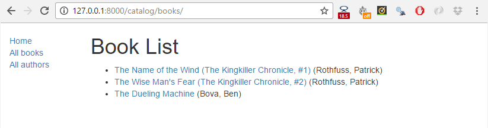
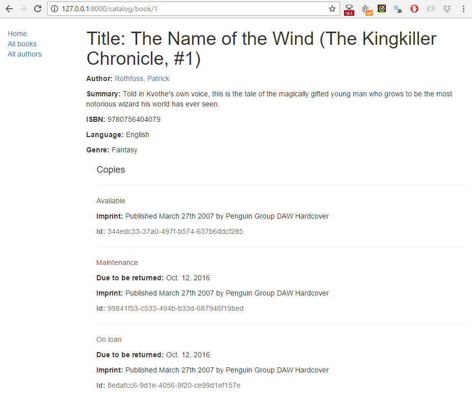
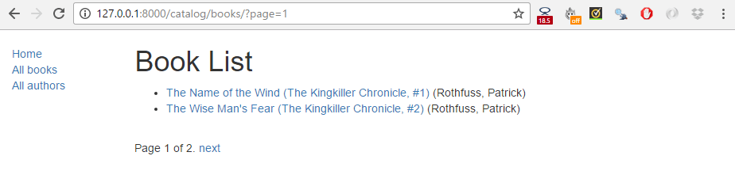
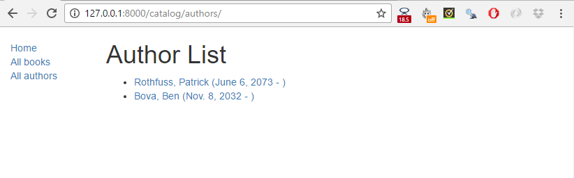
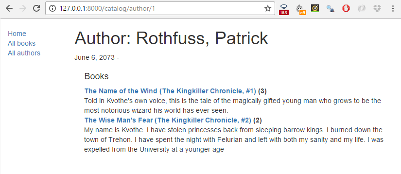

{{LearnSidebar}}{{PreviousMenuNext("Learn/Server-side/Django/Home_page", "Learn/Server-side/Django/Sessions", "Learn/Server-side/Django")}}

This tutorial extends our [LocalLibrary](/en-US/docs/Learn/Server-side/Django/Tutorial_local_library_website) website, adding list and detail pages for books and authors. Here we'll learn about generic class-based views, and show how they can reduce the amount of code you have to write for common use cases. We'll also go into URL handling in greater detail, showing how to perform basic pattern matching.

<table>
  <tbody>
    <tr>
      <th scope="row">Prerequisites:</th>
      <td>
        Complete all previous tutorial topics, including
        <a href="/en-US/docs/Learn/Server-side/Django/Home_page"
          >Django Tutorial Part 5: Creating our home page</a
        >.
      </td>
    </tr>
    <tr>
      <th scope="row">Objective:</th>
      <td>
        To understand where and how to use generic class-based views, and how to
        extract patterns from URLs and pass the information to views.
      </td>
    </tr>
  </tbody>
</table>

## Overview

In this tutorial we're going to complete the first version of the [LocalLibrary](/en-US/docs/Learn/Server-side/Django/Tutorial_local_library_website) website by adding list and detail pages for books and authors (or to be more precise, we'll show you how to implement the book pages, and get you to create the author pages yourself!)

The process is similar to creating the index page, which we showed in the previous tutorial. We'll still need to create URL maps, views, and templates. The main difference is that for the detail pages, we'll have the additional challenge of extracting information from patterns in the URL and passing it to the view. For these pages, we're going to demonstrate a completely different type of view: generic class-based list and detail views. These can significantly reduce the amount of view code needed, making them easier to write and maintain.

The final part of the tutorial will demonstrate how to paginate your data when using generic class-based list views.

## Book list page

The book list page will display a list of all the available book records in the page, accessed using the URL: `catalog/books/`. The page will display a title and author for each record, with the title being a hyperlink to the associated book detail page. The page will have the same structure and navigation as all other pages in the site, and we can, therefore, extend the base template (**base_generic.html**) we created in the previous tutorial.

### URL mapping

Open **/catalog/urls.py** and copy in the line setting the path for `'books/'`, as shown below.
Just as for the index page, this `path()` function defines a pattern to match against the URL (**'books/'**), a view function that will be called if the URL matches (`views.BookListView.as_view()`), and a name for this particular mapping.

```python
urlpatterns = [
    path('', views.index, name='index'),
    path('books/', views.BookListView.as_view(), name='books'),
]
```

As discussed in the previous tutorial the URL must already have matched `/catalog`, so the view will actually be called for the URL: `/catalog/books/`.

The view function has a different format than before — that's because this view will actually be implemented as a class. We will be inheriting from an existing generic view function that already does most of what we want this view function to do, rather than writing our own from scratch.

For Django class-based views we access an appropriate view function by calling the class method `as_view()`. This does all the work of creating an instance of the class, and making sure that the right handler methods are called for incoming HTTP requests.

### View (class-based)

We could quite easily write the book list view as a regular function (just like our previous index view), which would query the database for all books, and then call `render()` to pass the list to a specified template. Instead, however, we're going to use a class-based generic list view (`ListView`) — a class that inherits from an existing view. Because the generic view already implements most of the functionality we need and follows Django best-practice, we will be able to create a more robust list view with less code, less repetition, and ultimately less maintenance.

Open **catalog/views.py**, and copy the following code into the bottom of the file:

```python
from django.views import generic

class BookListView(generic.ListView):
    model = Book
```

That's it! The generic view will query the database to get all records for the specified model (`Book`) then render a template located at **/locallibrary/catalog/templates/catalog/book_list.html** (which we will create below). Within the template you can access the list of books with the template variable named `object_list` OR `book_list` (i.e. generically "`<the model name>_list`").

> **Note:** This awkward path for the template location isn't a misprint — the generic views look for templates in `/application_name/the_model_name_list.html` (`catalog/book_list.html` in this case) inside the application's `/application_name/templates/` directory (`/catalog/templates/)`.

You can add attributes to change the default behavior above. For example, you can specify another template file if you need to have multiple views that use this same model, or you might want to use a different template variable name if `book_list` is not intuitive for your particular template use-case. Possibly the most useful variation is to change/filter the subset of results that are returned — so instead of listing all books you might list top 5 books that were read by other users.

```python
class BookListView(generic.ListView):
    model = Book
    context_object_name = 'book_list'   # your own name for the list as a template variable
    queryset = Book.objects.filter(title__icontains='war')[:5] # Get 5 books containing the title war
    template_name = 'books/my_arbitrary_template_name_list.html'  # Specify your own template name/location
```

#### Overriding methods in class-based views

While we don't need to do so here, you can also override some of the class methods.

For example, we can override the `get_queryset()` method to change the list of records returned. This is more flexible than just setting the `queryset` attribute as we did in the preceding code fragment (though there is no real benefit in this case):

```python
class BookListView(generic.ListView):
    model = Book

    def get_queryset(self):
        return Book.objects.filter(title__icontains='war')[:5] # Get 5 books containing the title war
```

We might also override `get_context_data()` in order to pass additional context variables to the template (e.g. the list of books is passed by default). The fragment below shows how to add a variable named "`some_data`" to the context (it would then be available as a template variable).

```python
class BookListView(generic.ListView):
    model = Book

    def get_context_data(self, **kwargs):
        # Call the base implementation first to get the context
        context = super(BookListView, self).get_context_data(**kwargs)
        # Create any data and add it to the context
        context['some_data'] = 'This is just some data'
        return context
```

When doing this it is important to follow the pattern used above:

- First get the existing context from our superclass.
- Then add your new context information.
- Then return the new (updated) context.

> **Note:** Check out [Built-in class-based generic views](https://docs.djangoproject.com/en/4.0/topics/class-based-views/generic-display/) (Django docs) for many more examples of what you can do.

### Creating the List View template

Create the HTML file **/locallibrary/catalog/templates/catalog/book_list.html** and copy in the text below. As discussed above, this is the default template file expected by the generic class-based list view (for a model named `Book` in an application named `catalog`).

Templates for generic views are just like any other templates (although of course the context/information passed to the template may differ).
As with our _index_ template, we extend our base template in the first line and then replace the block named `content`.

```html



  <h1>Book List</h1>
  
  <ul>
    
      <li>
        <a href="\{{ book.get_absolute_url }}">\{{ book.title }}</a> (\{{book.author}})
      </li>
    
  </ul>
  
    <p>There are no books in the library.</p>
  

```

The view passes the context (list of books) by default as `object_list` and `book_list` aliases; either will work.

#### Conditional execution

We use the [`if`](https://docs.djangoproject.com/en/4.0/ref/templates/builtins/#if), `else`, and `endif` template tags to check whether the `book_list` has been defined and is not empty.
If `book_list` is empty, then the `else` clause displays text explaining that there are no books to list.
If `book_list` is not empty, then we iterate through the list of books.

```html

  <!-- code here to list the books -->

  <p>There are no books in the library.</p>

```

The condition above only checks for one case, but you can test on additional conditions using the `elif` template tag (e.g. ``).
For more information about conditional operators see: [if](https://docs.djangoproject.com/en/4.0/ref/templates/builtins/#if), [ifequal/ifnotequal](https://docs.djangoproject.com/en/4.0/ref/templates/builtins/#ifequal-and-ifnotequal), and [ifchanged](https://docs.djangoproject.com/en/4.0/ref/templates/builtins/#ifchanged) in [Built-in template tags and filters](https://docs.djangoproject.com/en/4.0/ref/templates/builtins/) (Django Docs).

#### For loops

The template uses the [for](https://docs.djangoproject.com/en/4.0/ref/templates/builtins/#for) and `endfor` template tags to loop through the book list, as shown below.
Each iteration populates the `book` template variable with information for the current list item.

```html

  <li> <!-- code here get information from each book item --> </li>

```

You might also use the `` template tag to define what happens if the book list is empty (although our template chooses to use a conditional instead):

```html
<ul>
  
    <li> <!-- code here get information from each book item --> </li>
  
    <p>There are no books in the library.</p>
  
</ul>
```

While not used here, within the loop Django will also create other variables that you can use to track the iteration.
For example, you can test the `forloop.last` variable to perform conditional processing the last time that the loop is run.

#### Accessing variables

The code inside the loop creates a list item for each book that shows both the title (as a link to the yet-to-be-created detail view) and the author.

```html
<a href="\{{ book.get_absolute_url }}">\{{ book.title }}</a> (\{{book.author}})
```

We access the _fields_ of the associated book record using the "dot notation" (e.g. `book.title` and `book.author`), where the text following the `book` item is the field name (as defined in the model).

We can also call _functions_ in the model from within our template — in this case we call `Book.get_absolute_url()` to get a URL you could use to display the associated detail record. This works provided the function does not have any arguments (there is no way to pass arguments!)

> **Note:** We have to be a little careful of "side effects" when calling functions in templates. Here we just get a URL to display, but a function can do pretty much anything — we wouldn't want to delete our database (for example) just by rendering our template!

#### Update the base template

Open the base template (**/locallibrary/catalog/templates/_base_generic.html_**) and insert **** into the URL link for **All books**, as shown below. This will enable the link in all pages (we can successfully put this in place now that we've created the "books" URL mapper).

```python
<li><a href="">Home</a></li>
<li><a href="">All books</a></li>
<li><a href="">All authors</a></li>
```

### What does it look like?

You won't be able to build the book list yet, because we're still missing a dependency — the URL map for the book detail pages, which is needed to create hyperlinks to individual books. We'll show both list and detail views after the next section.

## Book detail page

The book detail page will display information about a specific book, accessed using the URL `catalog/book/<id>` (where `<id>` is the primary key for the book). In addition to fields in the `Book` model (author, summary, ISBN, language, and genre), we'll also list the details of the available copies (`BookInstances`) including the status, expected return date, imprint, and id. This will allow our readers to not only learn about the book, but also to confirm whether/when it is available.

### URL mapping

Open **/catalog/urls.py** and add the path named '**book-detail**' shown below.
This `path()` function defines a pattern, associated generic class-based detail view, and a name.

```python
urlpatterns = [
    path('', views.index, name='index'),
    path('books/', views.BookListView.as_view(), name='books'),
    path('book/<int:pk>', views.BookDetailView.as_view(), name='book-detail'),
]
```

For the _book-detail_ path the URL pattern uses a special syntax to capture the specific id of the book that we want to see.
The syntax is very simple: angle brackets define the part of the URL to be captured, enclosing the name of the variable that the view can use to access the captured data.
For example, **\<something>** , will capture the marked pattern and pass the value to the view as a variable "something". You can optionally precede the variable name with a [converter specification](https://docs.djangoproject.com/en/4.0/topics/http/urls/#path-converters) that defines the type of data (int, str, slug, uuid, path).

In this case we use `'<int:pk>'` to capture the book id, which must be a specially formatted string and pass it to the view as a parameter named `pk` (short for primary key). This is the id that is being used to store the book uniquely in the database, as defined in the Book Model.

> **Note:** As discussed previously, our matched URL is actually `catalog/book/<digits>` (because we are in the **catalog** application, `/catalog/` is assumed).

> **Warning:** The generic class-based detail view _expects_ to be passed a parameter named **pk**. If you're writing your own function view you can use whatever parameter name you like, or indeed pass the information in an unnamed argument.

#### Advanced path matching/regular expression primer

> **Note:** You won't need this section to complete the tutorial! We provide it because knowing this option is likely to be useful in your Django-centric future.

The pattern matching provided by `path()` is simple and useful for the (very common) cases where you just want to capture _any_ string or integer. If you need more refined filtering (for example, to filter only strings that have a certain number of characters) then you can use the [re_path()](https://docs.djangoproject.com/en/4.0/ref/urls/#django.urls.re_path) method.

This method is used just like `path()` except that it allows you to specify a pattern using a [Regular expression](https://docs.python.org/3/library/re.html). For example, the previous path could have been written as shown below:

```python
re_path(r'^book/(?P<pk>\d+)$', views.BookDetailView.as_view(), name='book-detail'),
```

_Regular expressions_ are an incredibly powerful pattern mapping tool. They are, frankly, quite unintuitive and can be intimidating for beginners. Below is a very short primer!

The first thing to know is that regular expressions should usually be declared using the raw string literal syntax (i.e. they are enclosed as shown: **r'\<your regular expression text goes here>'**).

The main parts of the syntax you will need to know for declaring the pattern matches are:

<table class="standard-table no-markdown">
  <thead>
    <tr>
      <th scope="col">Symbol</th>
      <th scope="col">Meaning</th>
    </tr>
  </thead>
  <tbody>
    <tr>
      <td>^</td>
      <td>Match the beginning of the text</td>
    </tr>
    <tr>
      <td>$</td>
      <td>Match the end of the text</td>
    </tr>
    <tr>
      <td>\d</td>
      <td>Match a digit (0, 1, 2, … 9)</td>
    </tr>
    <tr>
      <td>\w</td>
      <td>
        Match a word character, e.g. any upper- or lower-case character in the
        alphabet, digit or the underscore character (_)
      </td>
    </tr>
    <tr>
      <td>+</td>
      <td>
        Match one or more of the preceding character. For example, to match one
        or more digits you would use <code>\d+</code>. To match one or more "a"
        characters, you could use <code>a+</code>
      </td>
    </tr>
    <tr>
      <td>*</td>
      <td>
        Match zero or more of the preceding character. For example, to match
        nothing or a word you could use <code>\w*</code>
      </td>
    </tr>
    <tr>
      <td>( )</td>
      <td>
        Capture the part of the pattern inside the brackets. Any captured values
        will be passed to the view as unnamed parameters (if multiple patterns
        are captured, the associated parameters will be supplied in the order
        that the captures were declared).
      </td>
    </tr>
    <tr>
      <td>(?P&#x3C;<em>name</em>>...)</td>
      <td>
        Capture the pattern (indicated by ...) as a named variable (in this case
        "name"). The captured values are passed to the view with the name
        specified. Your view must therefore declare a parameter with the same
        name!
      </td>
    </tr>
    <tr>
      <td>[ ]</td>
      <td>
        Match against one character in the set. For example, [abc] will match on
        'a' or 'b' or 'c'. [-\w] will match on the '-' character or any word
        character.
      </td>
    </tr>
  </tbody>
</table>

Most other characters can be taken literally!

Let's consider a few real examples of patterns:

<table class="standard-table">
  <thead>
    <tr>
      <th scope="col">Pattern</th>
      <th scope="col">Description</th>
    </tr>
  </thead>
  <tbody>
    <tr>
      <td><strong>r'^book/(?P&#x3C;pk>\d+)$'</strong></td>
      <td>
        <p>
          This is the RE used in our URL mapper. It matches a string that has
          <code>book/</code> at the start of the line (<strong>^book/</strong>),
          then has one or more digits (<code>\d+</code>), and then ends (with no
          non-digit characters before the end of line marker).
        </p>
        <p>
          It also captures all the digits <strong>(?P&#x3C;pk>\d+)</strong> and
          passes them to the view in a parameter named 'pk'.
          <strong>The captured values are always passed as a string!</strong>
        </p>
        <p>
          For example, this would match <code>book/1234</code> , and send a
          variable <code>pk='1234'</code> to the view.
        </p>
      </td>
    </tr>
    <tr>
      <td><strong>r'^book/(\d+)$'</strong></td>
      <td>
        This matches the same URLs as the preceding case. The captured
        information would be sent as an unnamed argument to the view.
      </td>
    </tr>
    <tr>
      <td><strong>r'^book/(?P&#x3C;stub>[-\w]+)$'</strong></td>
      <td>
        <p>
          This matches a string that has <code>book/</code> at the start of the
          line (<strong>^book/</strong>), then has one or more characters that
          are <em>either</em> a '-' or a word character
          (<strong>[-\w]+</strong>), and then ends. It also captures this set of
          characters and passes them to the view in a parameter named 'stub'.
        </p>
        <p>
          This is a fairly typical pattern for a "stub". Stubs are URL-friendly
          word-based primary keys for data. You might use a stub if you wanted
          your book URL to be more informative. For example
          <code>/catalog/book/the-secret-garden</code> rather than
          <code>/catalog/book/33</code>.
        </p>
      </td>
    </tr>
  </tbody>
</table>

You can capture multiple patterns in the one match, and hence encode lots of different information in a URL.

> **Note:** As a challenge, consider how you might encode a URL to list all books released in a particular year, month, day, and the RE that could be used to match it.

#### Passing additional options in your URL maps

One feature that we haven't used here, but which you may find valuable, is that you can pass a [dictionary containing additional options](https://docs.djangoproject.com/en/4.0/topics/http/urls/#views-extra-options) to the view (using the third un-named argument to the `path()` function). This approach can be useful if you want to use the same view for multiple resources, and pass data to configure its behavior in each case.

For example, given the path shown below, for a request to `/myurl/halibut/` Django will call `views.my_view(request, fish=halibut, my_template_name='some_path')`.

```python
path('myurl/<int:fish>', views.my_view, {'my_template_name': 'some_path'}, name='aurl'),
```

> **Note:** Both named captured patterns and dictionary options are passed to the view as _named_ arguments. If you use the **same name** for both a capture pattern and a dictionary key, then the dictionary option will be used.

### View (class-based)

Open **catalog/views.py**, and copy the following code into the bottom of the file:

```python
class BookDetailView(generic.DetailView):
    model = Book
```

That's it! All you need to do now is create a template called **/locallibrary/catalog/templates/catalog/book_detail.html**, and the view will pass it the database information for the specific `Book` record extracted by the URL mapper. Within the template you can access the book's details with the template variable named `object` OR `book` (i.e. generically "`the_model_name`").

If you need to, you can change the template used and the name of the context object used to reference the book in the template. You can also override methods to, for example, add additional information to the context.

#### What happens if the record doesn't exist?

If a requested record does not exist then the generic class-based detail view will raise an `Http404` exception for you automatically — in production, this will automatically display an appropriate "resource not found" page, which you can customize if desired.

Just to give you some idea of how this works, the code fragment below demonstrates how you would implement the class-based view as a function if you were **not** using the generic class-based detail view.

```python
def book_detail_view(request, primary_key):
    try:
        book = Book.objects.get(pk=primary_key)
    except Book.DoesNotExist:
        raise Http404('Book does not exist')

    return render(request, 'catalog/book_detail.html', context={'book': book})
```

The view first tries to get the specific book record from the model. If this fails the view should raise an `Http404` exception to indicate that the book is "not found". The final step is then, as usual, to call `render()` with the template name and the book data in the `context` parameter (as a dictionary).

Alternatively, we can use the `get_object_or_404()` function as a shortcut to raise an `Http404` exception if the record is not found.

```python
from django.shortcuts import get_object_or_404

def book_detail_view(request, primary_key):
    book = get_object_or_404(Book, pk=primary_key)
    return render(request, 'catalog/book_detail.html', context={'book': book})
```

### Creating the Detail View template

Create the HTML file **/locallibrary/catalog/templates/catalog/book_detail.html** and give it the below content. As discussed above, this is the default template file name expected by the generic class-based _detail_ view (for a model named `Book` in an application named `catalog`).

```html



  <h1>Title: \{{ book.title }}</h1>

  <p><strong>Author:</strong> <a href="">\{{ book.author }}</a></p> <!-- author detail link not yet defined -->
  <p><strong>Summary:</strong> \{{ book.summary }}</p>
  <p><strong>ISBN:</strong> \{{ book.isbn }}</p>
  <p><strong>Language:</strong> \{{ book.language }}</p>
  <p><strong>Genre:</strong> \{{ book.genre.all|join:", " }}</p>

  <div style="margin-left:20px;margin-top:20px">
    <h4>Copies</h4>

    
      <hr>
      <p class="text-successtext-dangertext-warning">
        \{{ copy.get_status_display }}
      </p>
      
        <p><strong>Due to be returned:</strong> \{{ copy.due_back }}</p>
      
      <p><strong>Imprint:</strong> \{{ copy.imprint }}</p>
      <p class="text-muted"><strong>Id:</strong> \{{ copy.id }}</p>
    
  </div>

```

> **Note:** The author link in the template above has an empty URL because we've not yet created an author detail page to link to.
> Once the detail page exists we can get its URL with either of these two approaches:
>
> - Use the `url` template tag to reverse the 'author-detail' URL (defined in the URL mapper), passing it the author instance for the book:
>
>   ```python
>   <a href="">\{{ book.author }}</a>
>   ```
>
> - Call the author model's `get_absolute_url()` method (this performs the same reversing operation):
>
>   ```plain
>   <a href="\{{ book.author.get_absolute_url }}">\{{ book.author }}</a>
>   ```
>
> While both methods effectively do the same thing, `get_absolute_url()` is preferred because it helps you write more consistent and maintainable code (any changes only need to be done in one place: the author model).

Though a little larger, almost everything in this template has been described previously:

- We extend our base template and override the "content" block.
- We use conditional processing to determine whether or not to display specific content.
- We use `for` loops to loop through lists of objects.
- We access the context fields using the dot notation (because we've used the detail generic view, the context is named `book`; we could also use "`object`")

The first interesting thing we haven't seen before is the function `book.bookinstance_set.all()`. This method is "automagically" constructed by Django in order to return the set of `BookInstance` records associated with a particular `Book`.

```python

  <!-- code to iterate across each copy/instance of a book -->

```

This method is needed because you declare a `ForeignKey` (one-to many) field only in the "many" side of the relationship (the `BookInstance`). Since you don't do anything to declare the relationship in the other ("one") model, it (the `Book`) doesn't have any field to get the set of associated records. To overcome this problem, Django constructs an appropriately named "reverse lookup" function that you can use. The name of the function is constructed by lower-casing the model name where the `ForeignKey` was declared, followed by `_set` (i.e. so the function created in `Book` is `bookinstance_set()`).

> **Note:** Here we use `all()` to get all records (the default). While you can use the `filter()` method to get a subset of records in code, you can't do this directly in templates because you can't specify arguments to functions.
>
> Beware also that if you don't define an order (on your class-based view or model), you will also see errors from the development server like this one:
>
> ```plain
> [29/May/2017 18:37:53] "GET /catalog/books/?page=1 HTTP/1.1" 200 1637
> /foo/local_library/venv/lib/python3.5/site-packages/django/views/generic/list.py:99: UnorderedObjectListWarning: Pagination may yield inconsistent results with an unordered object_list: <QuerySet [<Author: Ortiz, David>, <Author: H. McRaven, William>, <Author: Leigh, Melinda>]>
>   allow_empty_first_page=allow_empty_first_page, **kwargs)
> ```
>
> That happens because the [paginator object](https://docs.djangoproject.com/en/4.0/topics/pagination/#paginator-objects) expects to see some ORDER BY being executed on your underlying database. Without it, it can't be sure the records being returned are actually in the right order!
>
> This tutorial hasn't covered **Pagination** (yet!), but since you can't use `sort_by()` and pass a parameter (the same with `filter()` described above) you will have to choose between three choices:
>
> 1. Add a `ordering` inside a `class Meta` declaration on your model.
> 2. Add a `queryset` attribute in your custom class-based view, specifying an `order_by()`.
> 3. Adding a `get_queryset` method to your custom class-based view and also specify the `order_by()`.
>
> If you decide to go with a `class Meta` for the `Author` model (probably not as flexible as customizing the class-based view, but easy enough), you will end up with something like this:
>
> ```python
> class Author(models.Model):
>     first_name = models.CharField(max_length=100)
>     last_name = models.CharField(max_length=100)
>     date_of_birth = models.DateField(null=True, blank=True)
>     date_of_death = models.DateField('Died', null=True, blank=True)
>
>     def get_absolute_url(self):
>         return reverse('author-detail', args=[str(self.id)])
>
>     def __str__(self):
>         return f'{self.last_name}, {self.first_name}'
>
>     class Meta:
>         ordering = ['last_name']
> ```
>
> Of course, the field doesn't need to be `last_name`: it could be any other.
>
> Last but not least, you should sort by an attribute/column that actually has an index (unique or not) on your database to avoid performance issues. Of course, this will not be necessary here (we are probably getting ahead of ourselves with so few books and users), but it is something worth keeping in mind for future projects.

The second interesting (and non-obvious) thing in the template is where we display the status text for each book instance ("available", "maintenance", etc.).
Astute readers will note that the method `BookInstance.get_status_display()` that we use to get the status text does not appear elsewhere in the code.

```python
 <p class="text-successtext-dangertext-warning">
 \{{ copy.get_status_display }} </p>
```

This function is automatically created because `BookInstance.status` is a [choices field](https://docs.djangoproject.com/en/4.0/ref/models/fields/#choices).
Django automatically creates a method `get_FOO_display()` for every choices field "`Foo`" in a model, which can be used to get the current value of the field.

## What does it look like?

At this point, we should have created everything needed to display both the book list and book detail pages. Run the server (`python3 manage.py runserver`) and open your browser to `http://127.0.0.1:8000/`.

> **Warning:** Don't click any author or author detail links yet — you'll create those in the challenge!

Click the **All books** link to display the list of books.



Then click a link to one of your books. If everything is set up correctly, you should see something like the following screenshot.



## Pagination

If you've just got a few records, our book list page will look fine. However, as you get into the tens or hundreds of records the page will take progressively longer to load (and have far too much content to browse sensibly). The solution to this problem is to add pagination to your list views, reducing the number of items displayed on each page.

Django has excellent inbuilt support for pagination. Even better, this is built into the generic class-based list views so you don't have to do very much to enable it!

### Views

Open **catalog/views.py**, and add the `paginate_by` line shown below.

```python
class BookListView(generic.ListView):
    model = Book
    paginate_by = 10
```

With this addition, as soon as you have more than 10 records the view will start paginating the data it sends to the template.
The different pages are accessed using GET parameters — to access page 2 you would use the URL `/catalog/books/?page=2`.

### Templates

Now that the data is paginated, we need to add support to the template to scroll through the results set. Because we might want paginate all list views, we'll add this to the base template.

Open **/locallibrary/catalog/templates/_base_generic.html_** and find the "content block" (as shown below).

```python

```

Copy in the following pagination block immediately following the ``. The code first checks if pagination is enabled on the current page. If so, it adds _next_ and _previous_ links as appropriate (and the current page number).

```python

    
        <div class="pagination">
            <span class="page-links">
                
                    <a href="\{{ request.path }}?page=\{{ page_obj.previous_page_number }}">previous</a>
                
                <span class="page-current">
                    Page \{{ page_obj.number }} of \{{ page_obj.paginator.num_pages }}.
                </span>
                
                    <a href="\{{ request.path }}?page=\{{ page_obj.next_page_number }}">next</a>
                
            </span>
        </div>
    
  
```

The `page_obj` is a [Paginator](https://docs.djangoproject.com/en/4.0/topics/pagination/#paginator-objects) object that will exist if pagination is being used on the current page. It allows you to get all the information about the current page, previous pages, how many pages there are, etc.

We use `\{{ request.path }}` to get the current page URL for creating the pagination links. This is useful because it is independent of the object that we're paginating.

That's it!

### What does it look like?

The screenshot below shows what the pagination looks like — if you haven't entered more than 10 titles into your database, then you can test it more easily by lowering the number specified in the `paginate_by` line in your **catalog/views.py** file. To get the below result we changed it to `paginate_by = 2`.

The pagination links are displayed on the bottom, with next/previous links being displayed depending on which page you're on.



## Challenge yourself

The challenge in this article is to create the author detail and list views required to complete the project. These should be made available at the following URLs:

- `catalog/authors/` — The list of all authors.
- `catalog/author/<id>` — The detail view for the specific author with a primary key field named `<id>`

The code required for the URL mappers and the views should be virtually identical to the `Book` list and detail views we created above. The templates will be different but will share similar behavior.

> **Note:**
>
> - Once you've created the URL mapper for the author list page you will also need to update the **All authors** link in the base template.
>   Follow the [same process](#update_the_base_template) as we did when we updated the **All books** link.
> - Once you've created the URL mapper for the author detail page, you should also update the [book detail view template](#creating_the_detail_view_template) (**/locallibrary/catalog/templates/catalog/book_detail.html**) so that the author link points to your new author detail page (rather than being an empty URL).
>   The recommended way to do this is to call `get_absolute_url()` on the author model as shown below.
>
>   ```html
>   <p><strong>Author:</strong> <a href="\{{ book.author.get_absolute_url }}">\{{ book.author }}</a></p>
>
>   ```

When you are finished, your pages should look something like the screenshots below.





## Summary

Congratulations, our basic library functionality is now complete!

In this article, we've learned how to use the generic class-based list and detail views and used them to create pages to view our books and authors. Along the way we've learned about pattern matching with regular expressions, and how you can pass data from URLs to your views. We've also learned a few more tricks for using templates. Last of all we've shown how to paginate list views so that our lists are manageable even when we have many records.

In our next articles, we'll extend this library to support user accounts, and thereby demonstrate user authentication, permissions, sessions, and forms.

## See also

- [Built-in class-based generic views](https://docs.djangoproject.com/en/4.0/topics/class-based-views/generic-display/) (Django docs)
- [Generic display views](https://docs.djangoproject.com/en/4.0/ref/class-based-views/generic-display/) (Django docs)
- [Introduction to class-based views](https://docs.djangoproject.com/en/4.0/topics/class-based-views/intro/) (Django docs)
- [Built-in template tags and filters](https://docs.djangoproject.com/en/4.0/ref/templates/builtins/) (Django docs)
- [Pagination](https://docs.djangoproject.com/en/4.0/topics/pagination/) (Django docs)
- [Making queries > Related objects](https://docs.djangoproject.com/en/4.0/topics/db/queries/#related-objects) (Django docs)

{{PreviousMenuNext("Learn/Server-side/Django/Home_page", "Learn/Server-side/Django/Sessions", "Learn/Server-side/Django")}}

## In this module

- [Django introduction](/en-US/docs/Learn/Server-side/Django/Introduction)
- [Setting up a Django development environment](/en-US/docs/Learn/Server-side/Django/development_environment)
- [Django Tutorial: The Local Library website](/en-US/docs/Learn/Server-side/Django/Tutorial_local_library_website)
- [Django Tutorial Part 2: Creating a skeleton website](/en-US/docs/Learn/Server-side/Django/skeleton_website)
- [Django Tutorial Part 3: Using models](/en-US/docs/Learn/Server-side/Django/Models)
- [Django Tutorial Part 4: Django admin site](/en-US/docs/Learn/Server-side/Django/Admin_site)
- [Django Tutorial Part 5: Creating our home page](/en-US/docs/Learn/Server-side/Django/Home_page)
- **Django Tutorial Part 6: Generic list and detail views**
- [Django Tutorial Part 7: Sessions framework](/en-US/docs/Learn/Server-side/Django/Sessions)
- [Django Tutorial Part 8: User authentication and permissions](/en-US/docs/Learn/Server-side/Django/Authentication)
- [Django Tutorial Part 9: Working with forms](/en-US/docs/Learn/Server-side/Django/Forms)
- [Django Tutorial Part 10: Testing a Django web application](/en-US/docs/Learn/Server-side/Django/Testing)
- [Django Tutorial Part 11: Deploying Django to production](/en-US/docs/Learn/Server-side/Django/Deployment)
- [Django web application security](/en-US/docs/Learn/Server-side/Django/web_application_security)
- [DIY Django mini blog](/en-US/docs/Learn/Server-side/Django/django_assessment_blog)
