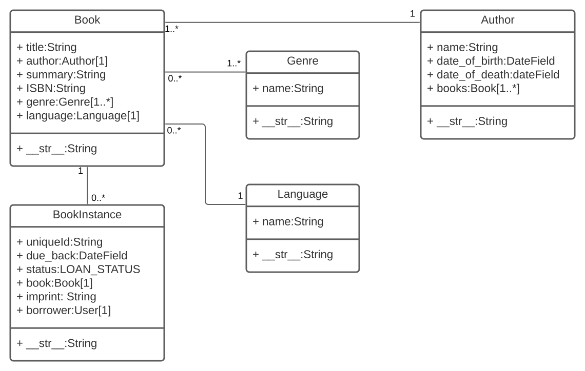

{{LearnSidebar}}{{PreviousMenuNext("Learn/Server-side/Django/skeleton_website", "Learn/Server-side/Django/Admin_site", "Learn/Server-side/Django")}}

This article shows how to define models for the LocalLibrary website. It explains what a model is, how it is declared, and some of the main field types. It also briefly shows a few of the main ways you can access model data.

<table>
  <tbody>
    <tr>
      <th scope="row">Prerequisites:</th>
      <td>
        <a href="/en-US/docs/Learn/Server-side/Django/skeleton_website">Django Tutorial Part 2: Creating a skeleton website</a>.
      </td>
    </tr>
    <tr>
      <th scope="row">Objective:</th>
      <td>
        <p>
          To be able to design and create your own models, choosing fields appropriately.
        </p>
      </td>
    </tr>
  </tbody>
</table>

## Overview

Django web applications access and manage data through Python objects referred to as models. Models define the _structure_ of stored data, including the field _types_ and possibly also their maximum size, default values, selection list options, help text for documentation, label text for forms, etc. The definition of the model is independent of the underlying database — you can choose one of several as part of your project settings. Once you've chosen what database you want to use, you don't need to talk to it directly at all — you just write your model structure and other code, and Django handles all the dirty work of communicating with the database for you.

This tutorial shows how to define and access the models for the [LocalLibrary website](/en-US/docs/Learn/Server-side/Django/Tutorial_local_library_website) example.

## Designing the LocalLibrary models

Before you jump in and start coding the models, it's worth taking a few minutes to think about what data we need to store and the relationships between the different objects.

We know that we need to store information about books (title, summary, author, written language, category, ISBN) and that we might have multiple copies available (with globally unique id, availability status, etc.). We might need to store more information about the author than just their name, and there might be multiple authors with the same or similar names. We want to be able to sort information based on book title, author, written language, and category.

When designing your models, it makes sense to have separate models for every "object" (a group of related information). In this case, the obvious objects are books, book instances, and authors.

You might also want to use models to represent selection-list options (e.g. like a drop down list of choices), rather than hard coding the choices into the website itself — this is recommended when all the options aren't known up front or may change. Obvious candidates for models, in this case, include the book genre (e.g. Science Fiction, French Poetry, etc.) and language (English, French, Japanese).

Once we've decided on our models and field, we need to think about the relationships. Django allows you to define relationships that are one to one (`OneToOneField`), one to many (`ForeignKey`) and many to many (`ManyToManyField`).

With that in mind, the UML association diagram below shows the models we'll define in this case (as boxes).



We've created models for the book (the generic details of the book), book instance (status of specific physical copies of the book available in the system), and author. We have also decided to have a model for the genre so that values can be created/selected through the admin interface. We've decided not to have a model for the `BookInstance:status` — we've hardcoded the values (`LOAN_STATUS`) because we don't expect these to change. Within each of the boxes, you can see the model name, the field names, and types, and also the methods and their return types.

The diagram also shows the relationships between the models, including their _multiplicities_. The multiplicities are the numbers on the diagram showing the numbers (maximum and minimum) of each model that may be present in the relationship. For example, the connecting line between the boxes shows that Book and a Genre are related. The numbers close to the Genre model show that a book must have one or more Genres (as many as you like), while the numbers on the other end of the line next to the Book model show that a Genre can have zero or many associated books.

> **Note:** The next section provides a basic primer explaining how models are defined and used. As you read it, consider how we will construct each of the models in the diagram above.

## Model primer

This section provides a brief overview of how a model is defined and some of the more important fields and field arguments.

### Model definition

Models are usually defined in an application's **models.py** file. They are implemented as subclasses of `django.db.models.Model`, and can include fields, methods and metadata. The code fragment below shows a "typical" model, named `MyModelName`:

```python
from django.db import models
from django.urls import reverse

class MyModelName(models.Model):
    """A typical class defining a model, derived from the Model class."""

    # Fields
    my_field_name = models.CharField(max_length=20, help_text='Enter field documentation')
    # …

    # Metadata
    class Meta:
        ordering = ['-my_field_name']

    # Methods
    def get_absolute_url(self):
        """Returns the URL to access a particular instance of MyModelName."""
        return reverse('model-detail-view', args=[str(self.id)])

    def __str__(self):
        """String for representing the MyModelName object (in Admin site etc.)."""
        return self.my_field_name
```

In the below sections we'll explore each of the features inside the model in detail:

#### Fields

A model can have an arbitrary number of fields, of any type — each one represents a column of data that we want to store in one of our database tables. Each database record (row) will consist of one of each field value. Let's look at the example seen below:

```python
my_field_name = models.CharField(max_length=20, help_text='Enter field documentation')
```

Our above example has a single field called `my_field_name`, of type `models.CharField` — which means that this field will contain strings of alphanumeric characters. The field types are assigned using specific classes, which determine the type of record that is used to store the data in the database, along with validation criteria to be used when values are received from an HTML form (i.e. what constitutes a valid value). The field types can also take arguments that further specify how the field is stored or can be used. In this case we are giving our field two arguments:

- `max_length=20` — States that the maximum length of a value in this field is 20 characters.
- `help_text='Enter field documentation'` — helpful text that may be displayed in a form to help users understand how the field is used.

The field name is used to refer to it in queries and templates.
Fields also have a label, which is specified using the `verbose_name` argument (with a default value of `None`).
If `verbose_name` is not set, the label is created from the field name by replacing any underscores with a space, and capitalizing the first letter (for example, the field `my_field_name` would have a default label of _My field name_ when used in forms).

The order that fields are declared will affect their default order if a model is rendered in a form (e.g. in the Admin site), though this may be overridden.

##### Common field arguments

The following common arguments can be used when declaring many/most of the different field types:

- [help_text](https://docs.djangoproject.com/en/4.0/ref/models/fields/#help-text): Provides a text label for HTML forms (e.g. in the admin site), as described above.
- [verbose_name](https://docs.djangoproject.com/en/4.0/ref/models/fields/#verbose-name): A human-readable name for the field used in field labels. If not specified, Django will infer the default verbose name from the field name.
- [default](https://docs.djangoproject.com/en/4.0/ref/models/fields/#default): The default value for the field. This can be a value or a callable object, in which case the object will be called every time a new record is created.
- [null](https://docs.djangoproject.com/en/4.0/ref/models/fields/#null): If `True`, Django will store blank values as `NULL` in the database for fields where this is appropriate (a `CharField` will instead store an empty string). The default is `False`.
- [blank](https://docs.djangoproject.com/en/4.0/ref/models/fields/#blank): If `True`, the field is allowed to be blank in your forms. The default is `False`, which means that Django's form validation will force you to enter a value. This is often used with `null=True`, because if you're going to allow blank values, you also want the database to be able to represent them appropriately.
- [choices](https://docs.djangoproject.com/en/4.0/ref/models/fields/#choices): A group of choices for this field. If this is provided, the default corresponding form widget will be a select box with these choices instead of the standard text field.
- [primary_key](https://docs.djangoproject.com/en/4.0/ref/models/fields/#primary-key):
  If `True`, sets the current field as the primary key for the model (A primary key is a special database column designated to uniquely identify all the different table records).
  If no field is specified as the primary key, Django will automatically add a field for this purpose.
  The type of auto-created primary key fields can be specified for each app in [`AppConfig.default_auto_field`](https://docs.djangoproject.com/en/4.0/ref/applications/#django.apps.AppConfig.default_auto_field) or globally in the [`DEFAULT_AUTO_FIELD`](https://docs.djangoproject.com/en/4.0/ref/settings/#std:setting-DEFAULT_AUTO_FIELD) setting.

  > **Note:** Apps created using **manage.py** set the type of the primary key to a [BigAutoField](https://docs.djangoproject.com/en/4.0/ref/models/fields/#bigautofield).
  > You can see this in the local library **catalog/apps.py** file:
  >
  > ```py
  > class CatalogConfig(AppConfig):
  >   default_auto_field = 'django.db.models.BigAutoField'
  > ```

There are many other options — you can view the [full list of field options here](https://docs.djangoproject.com/en/4.0/ref/models/fields/#field-options).

##### Common field types

The following list describes some of the more commonly used types of fields.

- [CharField](https://docs.djangoproject.com/en/4.0/ref/models/fields/#django.db.models.CharField) is used to define short-to-mid sized fixed-length strings. You must specify the `max_length` of the data to be stored.
- [TextField](https://docs.djangoproject.com/en/4.0/ref/models/fields/#django.db.models.TextField) is used for large arbitrary-length strings. You may specify a `max_length` for the field, but this is used only when the field is displayed in forms (it is not enforced at the database level).
- [IntegerField](https://docs.djangoproject.com/en/4.0/ref/models/fields/#django.db.models.IntegerField) is a field for storing integer (whole number) values, and for validating entered values as integers in forms.
- [DateField](https://docs.djangoproject.com/en/4.0/ref/models/fields/#datefield) and [DateTimeField](https://docs.djangoproject.com/en/4.0/ref/models/fields/#datetimefield) are used for storing/representing dates and date/time information (as Python `datetime.date` and `datetime.datetime` objects, respectively). These fields can additionally declare the (mutually exclusive) parameters `auto_now=True` (to set the field to the current date every time the model is saved), `auto_now_add` (to only set the date when the model is first created), and `default` (to set a default date that can be overridden by the user).
- [EmailField](https://docs.djangoproject.com/en/4.0/ref/models/fields/#emailfield) is used to store and validate email addresses.
- [FileField](https://docs.djangoproject.com/en/4.0/ref/models/fields/#filefield) and [ImageField](https://docs.djangoproject.com/en/4.0/ref/models/fields/#imagefield) are used to upload files and images respectively (the `ImageField` adds additional validation that the uploaded file is an image). These have parameters to define how and where the uploaded files are stored.
- [AutoField](https://docs.djangoproject.com/en/4.0/ref/models/fields/#autofield) is a special type of `IntegerField` that automatically increments. A primary key of this type is automatically added to your model if you don't explicitly specify one.
- [ForeignKey](https://docs.djangoproject.com/en/4.0/ref/models/fields/#foreignkey) is used to specify a one-to-many relationship to another database model (e.g. a car has one manufacturer, but a manufacturer can make many cars). The "one" side of the relationship is the model that contains the "key" (models containing a "foreign key" referring to that "key", are on the "many" side of such a relationship).
- [ManyToManyField](https://docs.djangoproject.com/en/4.0/ref/models/fields/#manytomanyfield) is used to specify a many-to-many relationship (e.g. a book can have several genres, and each genre can contain several books). In our library app we will use these very similarly to `ForeignKeys`, but they can be used in more complicated ways to describe the relationships between groups. These have the parameter `on_delete` to define what happens when the associated record is deleted (e.g. a value of `models.SET_NULL` would set the value to `NULL`).

There are many other types of fields, including fields for different types of numbers (big integers, small integers, floats), booleans, URLs, slugs, unique ids, and other "time-related" information (duration, time, etc.). You can view the [full list here](https://docs.djangoproject.com/en/4.0/ref/models/fields/#field-types).

#### Metadata

You can declare model-level metadata for your Model by declaring `class Meta`, as shown.

```python
class Meta:
    ordering = ['-my_field_name']
```

One of the most useful features of this metadata is to control the _default ordering_ of records returned when you query the model type. You do this by specifying the match order in a list of field names to the `ordering` attribute, as shown above. The ordering will depend on the type of field (character fields are sorted alphabetically, while date fields are sorted in chronological order). As shown above, you can prefix the field name with a minus symbol (-) to reverse the sorting order.

So as an example, if we chose to sort books like this by default:

```python
ordering = ['title', '-pubdate']
```

the books would be sorted alphabetically by title, from A-Z, and then by publication date inside each title, from newest to oldest.

Another common attribute is `verbose_name`, a verbose name for the class in singular and plural form:

```python
verbose_name = 'BetterName'
```

Other useful attributes allow you to create and apply new "access permissions" for the model (default permissions are applied automatically), allow ordering based on another field, or to declare that the class is "abstract" (a base class that you cannot create records for, and will instead be derived from to create other models).

Many of the other metadata options control what database must be used for the model and how the data is stored (these are really only useful if you need to map a model to an existing database).

The full list of metadata options are available here: [Model metadata options](https://docs.djangoproject.com/en/4.0/ref/models/options/) (Django docs).

#### Methods

A model can also have methods.

**Minimally, in every model you should define the standard Python class method `__str__()` to return a human-readable string for each object.** This string is used to represent individual records in the administration site (and anywhere else you need to refer to a model instance). Often this will return a title or name field from the model.

```python
def __str__(self):
    return self.my_field_name
```

Another common method to include in Django models is `get_absolute_url()`, which returns a URL for displaying individual model records on the website (if you define this method then Django will automatically add a "View on Site" button to the model's record editing screens in the Admin site). A typical pattern for `get_absolute_url()` is shown below.

```python
def get_absolute_url(self):
    """Returns the URL to access a particular instance of the model."""
    return reverse('model-detail-view', args=[str(self.id)])
```

> **Note:** Assuming you will use URLs like `/myapplication/mymodelname/2` to display individual records for your model (where "2" is the `id` for a particular record), you will need to create a URL mapper to pass the response and id to a "model detail view" (which will do the work required to display the record). The `reverse()` function above is able to "reverse" your URL mapper (in the above case named _'model-detail-view'_) in order to create a URL of the right format.
>
> Of course to make this work you still have to write the URL mapping, view, and template!

You can also define any other methods you like, and call them from your code or templates (provided that they don't take any parameters).

### Model management

Once you've defined your model classes you can use them to create, update, or delete records, and to run queries to get all records or particular subsets of records. We'll show you how to do that in the tutorial when we define our views, but here is a brief summary.

#### Creating and modifying records

To create a record you can define an instance of the model and then call `save()`.

```python
# Create a new record using the model's constructor.
record = MyModelName(my_field_name="Instance #1")

# Save the object into the database.
record.save()
```

> **Note:** If you haven't declared any field as a `primary_key`, the new record will be given one automatically, with the field name `id`. You could query this field after saving the above record, and it would have a value of 1.

You can access the fields in this new record using the dot syntax, and change the values. You have to call `save()` to store modified values to the database.

```python
# Access model field values using Python attributes.
print(record.id) # should return 1 for the first record.
print(record.my_field_name) # should print 'Instance #1'

# Change record by modifying the fields, then calling save().
record.my_field_name = "New Instance Name"
record.save()
```

#### Searching for records

You can search for records that match certain criteria using the model's `objects` attribute (provided by the base class).

> **Note:** Explaining how to search for records using "abstract" model and field names can be a little confusing. In the discussion below, we'll refer to a `Book` model with `title` and `genre` fields, where genre is also a model with a single field `name`.

We can get all records for a model as a `QuerySet`, using `objects.all()`. The `QuerySet` is an iterable object, meaning that it contains a number of objects that we can iterate/loop through.

```python
all_books = Book.objects.all()
```

Django's `filter()` method allows us to filter the returned `QuerySet` to match a specified **text** or **numeric** field against particular criteria. For example, to filter for books that contain "wild" in the title and then count them, we could do the following.

```python
wild_books = Book.objects.filter(title__contains='wild')
number_wild_books = wild_books.count()
```

The fields to match and the type of match are defined in the filter parameter name, using the format: `field_name__match_type` (note the _double underscore_ between `title` and `contains` above). Above we're filtering `title` with a case-sensitive match. There are many other types of matches you can do: `icontains` (case insensitive), `iexact` (case-insensitive exact match), `exact` (case-sensitive exact match) and `in`, `gt` (greater than), `startswith`, etc. The [full list is here](https://docs.djangoproject.com/en/4.0/ref/models/querysets/#field-lookups).

In some cases, you'll need to filter on a field that defines a one-to-many relationship to another model (e.g. a `ForeignKey`). In this case, you can "index" to fields within the related model with additional double underscores.
So for example to filter for books with a specific genre pattern, you will have to index to the `name` through the `genre` field, as shown below:

```python
# Will match on: Fiction, Science fiction, non-fiction etc.
books_containing_genre = Book.objects.filter(genre__name__icontains='fiction')
```

> **Note:** You can use underscores (`__`) to navigate as many levels of relationships (`ForeignKey`/`ManyToManyField`) as you like.
> For example, a `Book` that had different types, defined using a further "cover" relationship might have a parameter name: `type__cover__name__exact='hard'.`

There is a lot more you can do with queries, including backwards searches from related models, chaining filters, returning a smaller set of values, etc. For more information, see [Making queries](https://docs.djangoproject.com/en/4.0/topics/db/queries/) (Django Docs).

## Defining the LocalLibrary Models

In this section we will start defining the models for the library. Open `models.py` (in /locallibrary/catalog/). The boilerplate at the top of the page imports the _models_ module, which contains the model base class `models.Model` that our models will inherit from.

```python
from django.db import models

# Create your models here.
```

### Genre model

Copy the `Genre` model code shown below and paste it into the bottom of your `models.py` file. This model is used to store information about the book category — for example whether it is fiction or non-fiction, romance or military history, etc.
As mentioned above, we've created the genre as a model rather than as free text or a selection list so that the possible values can be managed through the database rather than being hard coded.

```python
class Genre(models.Model):
    """Model representing a book genre."""
    name = models.CharField(max_length=200, help_text='Enter a book genre (e.g. Science Fiction)')

    def __str__(self):
        """String for representing the Model object."""
        return self.name
```

The model has a single `CharField` field (`name`), which is used to describe the genre (this is limited to 200 characters and has some `help_text`). At the end of the model, we declare a `__str__()` method, which returns the name of the genre defined by a particular record. No verbose name has been defined, so the field will be called `Name` in forms.

### Book model

Copy the `Book` model below and again paste it into the bottom of your file. The `Book` model represents all information about an available book in a general sense, but not a particular physical "instance" or "copy" available for loan. The model uses a `CharField` to represent the book's `title` and `isbn`. For `isbn`, note how the first unnamed parameter explicitly sets the label as "ISBN" (otherwise, it would default to "Isbn"). We also set the parameter `unique` as `true` to ensure all books have a unique ISBN (the unique parameter makes the field value globally unique in a table). The model uses `TextField` for the `summary`, because this text may need to be quite long.

```python
from django.urls import reverse # Used to generate URLs by reversing the URL patterns

class Book(models.Model):
    """Model representing a book (but not a specific copy of a book)."""
    title = models.CharField(max_length=200)

    # Foreign Key used because book can only have one author, but authors can have multiple books
    # Author is a string rather than an object because it hasn't been declared yet in the file
    author = models.ForeignKey('Author', on_delete=models.SET_NULL, null=True)

    summary = models.TextField(max_length=1000, help_text='Enter a brief description of the book')
    isbn = models.CharField('ISBN', max_length=13, unique=True,
                             help_text='13 Character <a href="https://www.isbn-international.org/content/what-isbn">ISBN number</a>')

    # ManyToManyField used because genre can contain many books. Books can cover many genres.
    # Genre class has already been defined so we can specify the object above.
    genre = models.ManyToManyField(Genre, help_text='Select a genre for this book')

    def __str__(self):
        """String for representing the Model object."""
        return self.title

    def get_absolute_url(self):
        """Returns the URL to access a detail record for this book."""
        return reverse('book-detail', args=[str(self.id)])
```

The genre is a `ManyToManyField`, so that a book can have multiple genres and a genre can have many books. The author is declared as `ForeignKey`, so each book will only have one author, but an author may have many books (in practice a book might have multiple authors, but not in this implementation!)

In both field types the related model class is declared as the first unnamed parameter using either the model class or a string containing the name of the related model. You must use the name of the model as a string if the associated class has not yet been defined in this file before it is referenced! The other parameters of interest in the `author` field are `null=True`, which allows the database to store a `Null` value if no author is selected, and `on_delete=models.SET_NULL`, which will set the value of the book's author field to `Null` if the associated author record is deleted.

> **Warning:** By default `on_delete=models.CASCADE`, which means that if the author was deleted, this book would be deleted too! We use `SET_NULL` here, but we could also use `PROTECT` or `RESTRICT` to prevent the author being deleted while any book uses it.

The model also defines `__str__()`, using the book's `title` field to represent a `Book` record. The final method, `get_absolute_url()` returns a URL that can be used to access a detail record for this model (for this to work, we will have to define a URL mapping that has the name `book-detail`, and define an associated view and template).

### BookInstance model

Next, copy the `BookInstance` model (shown below) under the other models. The `BookInstance` represents a specific copy of a book that someone might borrow, and includes information about whether the copy is available or on what date it is expected back, "imprint" or version details, and a unique id for the book in the library.

Some of the fields and methods will now be familiar. The model uses:

- `ForeignKey` to identify the associated `Book` (each book can have many copies, but a copy can only have one `Book`). The key specifies `on_delete=models.RESTRICT` to ensure that the `Book` cannot be deleted while referenced by a `BookInstance`.
- `CharField` to represent the imprint (specific release) of the book.

```python
import uuid # Required for unique book instances

class BookInstance(models.Model):
    """Model representing a specific copy of a book (i.e. that can be borrowed from the library)."""
    id = models.UUIDField(primary_key=True, default=uuid.uuid4, help_text='Unique ID for this particular book across whole library')
    book = models.ForeignKey('Book', on_delete=models.RESTRICT, null=True)
    imprint = models.CharField(max_length=200)
    due_back = models.DateField(null=True, blank=True)

    LOAN_STATUS = (
        ('m', 'Maintenance'),
        ('o', 'On loan'),
        ('a', 'Available'),
        ('r', 'Reserved'),
    )

    status = models.CharField(
        max_length=1,
        choices=LOAN_STATUS,
        blank=True,
        default='m',
        help_text='Book availability',
    )

    class Meta:
        ordering = ['due_back']

    def __str__(self):
        """String for representing the Model object."""
        return f'{self.id} ({self.book.title})'
```

We additionally declare a few new types of field:

- `UUIDField` is used for the `id` field to set it as the `primary_key` for this model. This type of field allocates a globally unique value for each instance (one for every book you can find in the library).
- `DateField` is used for the `due_back` date (at which the book is expected to become available after being borrowed or in maintenance). This value can be `blank` or `null` (needed for when the book is available). The model metadata (`Class Meta`) uses this field to order records when they are returned in a query.
- `status` is a `CharField` that defines a choice/selection list. As you can see, we define a tuple containing tuples of key-value pairs and pass it to the choices argument. The value in a key/value pair is a display value that a user can select, while the keys are the values that are actually saved if the option is selected. We've also set a default value of 'm' (maintenance) as books will initially be created unavailable before they are stocked on the shelves.

The method `__str__()` represents the `BookInstance` object using a combination of its unique id and the associated `Book`'s title.

> **Note:** A little Python:
>
> - Starting with Python 3.6, you can use the string interpolation syntax (also known as f-strings): `f'{self.id} ({self.book.title})'`.
> - In older versions of this tutorial, we were using a [formatted string](https://peps.python.org/pep-3101/) syntax, which is also a valid way of formatting strings in Python (e.g. `'{0} ({1})'.format(self.id,self.book.title)`).

### Author model

Copy the `Author` model (shown below) underneath the existing code in **models.py**.

```python
class Author(models.Model):
    """Model representing an author."""
    first_name = models.CharField(max_length=100)
    last_name = models.CharField(max_length=100)
    date_of_birth = models.DateField(null=True, blank=True)
    date_of_death = models.DateField('Died', null=True, blank=True)

    class Meta:
        ordering = ['last_name', 'first_name']

    def get_absolute_url(self):
        """Returns the URL to access a particular author instance."""
        return reverse('author-detail', args=[str(self.id)])

    def __str__(self):
        """String for representing the Model object."""
        return f'{self.last_name}, {self.first_name}'
```

All of the fields/methods should now be familiar. The model defines an author as having a first name, last name, and dates of birth and death (both optional). It specifies that by default the `__str__()` returns the name in _last name_, _firstname_ order. The `get_absolute_url()` method reverses the `author-detail` URL mapping to get the URL for displaying an individual author.

## Re-run the database migrations

All your models have now been created. Now re-run your database migrations to add them to your database.

```bash
python3 manage.py makemigrations
python3 manage.py migrate
```

## Language model — challenge

Imagine a local benefactor donates a number of new books written in another language (say, Farsi). The challenge is to work out how these would be best represented in our library website, and then to add them to the models.

Some things to consider:

- Should "language" be associated with a `Book`, `BookInstance`, or some other object?
- Should the different languages be represented using model, a free text field, or a hard-coded selection list?

After you've decided, add the field. You can see what we decided on GitHub [here](https://github.com/mdn/django-locallibrary-tutorial/blob/main/catalog/models.py).

Don't forget that after a change to your model, you should again re-run your database migrations to add the changes.

```bash
python3 manage.py makemigrations
python3 manage.py migrate
```

## Summary

In this article we've learned how models are defined, and then used this information to design and implement appropriate models for the _LocalLibrary_ website.

At this point we'll divert briefly from creating the site, and check out the _Django Administration site_. This site will allow us to add some data to the library, which we can then display using our (yet to be created) views and templates.

## See also

- [Writing your first Django app, part 2](https://docs.djangoproject.com/en/4.0/intro/tutorial02/) (Django docs)
- [Making queries](https://docs.djangoproject.com/en/4.0/topics/db/queries/) (Django Docs)
- [QuerySet API Reference](https://docs.djangoproject.com/en/4.0/ref/models/querysets/) (Django Docs)

{{PreviousMenuNext("Learn/Server-side/Django/skeleton_website", "Learn/Server-side/Django/Admin_site", "Learn/Server-side/Django")}}
