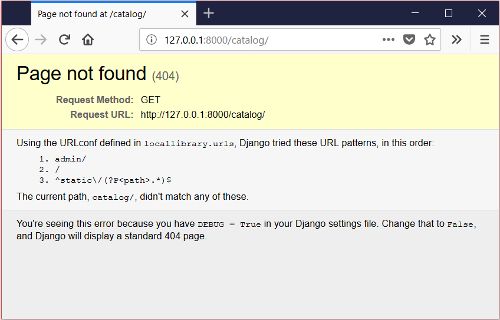

{{LearnSidebar}}{{PreviousMenuNext("Learn/Server-side/Django/Tutorial_local_library_website", "Learn/Server-side/Django/Models", "Learn/Server-side/Django")}}

This second article in our [Django Tutorial](/en-US/docs/Learn/Server-side/Django/Tutorial_local_library_website) shows how you can create a "skeleton" website project as a basis, which you can then populate with site-specific settings, paths, models, views, and templates.

<table>
  <tbody>
    <tr>
      <th scope="row">Prerequisites:</th>
      <td>
        <a href="/en-US/docs/Learn/Server-side/Django/development_environment"
          >Set up a Django development environment</a
        >. Review the
        <a
          href="/en-US/docs/Learn/Server-side/Django/Tutorial_local_library_website"
          >Django Tutorial</a
        >.
      </td>
    </tr>
    <tr>
      <th scope="row">Objective:</th>
      <td>
        To be able to use Django's tools to start your own new website projects.
      </td>
    </tr>
  </tbody>
</table>

## Overview

This article shows how you can create a "skeleton" website, which you can then populate with site-specific settings, paths, models, views, and templates (we discuss these in later articles).

To get started:

1. Use the `django-admin` tool to generate a project folder, the basic file templates, and **manage.py**, which serves as your project management script.
2. Use **manage.py** to create one or more _applications_.

    > **Note:** A website may consist of one or more sections. For example, main site, blog, wiki, downloads area, etc. Django encourages you to develop these components as separate _applications_, which could then be re-used in different projects if desired.

3. Register the new applications to include them in the project.
4. Hook up the **url/path** mapper for each application.

For the [Local Library website](/en-US/docs/Learn/Server-side/Django/Tutorial_local_library_website), the website and project folders are named *locallibrary*, and includes one application named _catalog_.
The top-level folder structure will therefore be as follows:

```bash
locallibrary/         # Website folder
    manage.py         # Script to run Django tools for this project (created using django-admin)
    locallibrary/     # Website/project folder (created using django-admin)
    catalog/          # Application folder (created using manage.py)
```

The following sections discuss the process steps in detail, and show how you can test your changes.
At the end of this article, we discuss other site-wide configuration you might also do at this stage.

## Creating the project

To create the project:

1. Open a command shell (or a terminal window), and make sure you are in your [virtual environment](/en-US/docs/Learn/Server-side/Django/development_environment#using_a_virtual_environment).
2. Navigate to where you want to store your Django apps (make it somewhere easy to find like inside your _Documents_ folder), and create a folder for your new website (in this case: _django_projects_). Then change into your newly-created directory:

    ```bash
    mkdir django_projects
    cd django_projects
    ```

3. Create the new project using the `django-admin startproject` command as shown, and then change into the project folder:

    ```bash
    django-admin startproject locallibrary
    cd locallibrary
    ```

The `django-admin` tool creates a folder/file structure as follows:

```bash
locallibrary/
    manage.py
    locallibrary/
        __init__.py
        settings.py
        urls.py
        wsgi.py
        asgi.py
```

Our current working directory should look something like this:

```python
../django_projects/locallibrary/
```

The _locallibrary_ project sub-folder is the entry point for the website:

- **\_\_init\_\_.py** is an empty file that instructs Python to treat this directory as a Python package.
- **settings.py** contains all the website settings, including registering any applications we create, the location of our static files, database configuration details, etc.
- **urls.py** defines the site URL-to-view mappings. While this could contain _all_ the URL mapping code, it is more common to delegate some of the mappings to particular applications, as you'll see later.
- **wsgi.py** is used to help your Django application communicate with the webserver. You can treat this as boilerplate.
- **asgi.py** is a standard for Python asynchronous web apps and servers to communicate with each other. ASGI is the asynchronous successor to WSGI and provides a standard for both asynchronous and synchronous Python apps (whereas WSGI provided a standard for synchronous apps only). It is backward-compatible with WSGI and supports multiple servers and application frameworks.

The **manage.py** script is used to create applications, work with databases, and start the development web server.

## Creating the catalog application

Next, run the following command to create the _catalog_ application that will live inside our _locallibrary_ project. Make sure to run this command from the same folder as your project's **manage.py**:

```bash
# Linux/macOS
python3 manage.py startapp catalog

# Windows
py manage.py startapp catalog
```

> **Note:** The rest of the tutorial uses the Linux/macOS syntax.
> If you're working on Windows, wherever you see a command starting with `python3` you should instead use `py` (or `py -3`).

The tool creates a new folder and populates it with files for the different parts of the application (shown in the following example).
Most of the files are named after their purpose (e.g. views should be stored in **views.py**, models in **models.py**, tests in **tests.py**, administration site configuration in **admin.py**, application registration in **apps.py**) and contain some minimal boilerplate code for working with the associated objects.

The updated project directory should now look like this:

```bash
locallibrary/
    manage.py
    locallibrary/
    catalog/
        admin.py
        apps.py
        models.py
        tests.py
        views.py
        __init__.py
        migrations/
```

In addition we now have:

- A _migrations_ folder, used to store "migrations" — files that allow you to automatically update your database as you modify your models.
- **\_\_init\_\_.py** — an empty file created here so that Django/Python will recognize the folder as a [Python Package](https://docs.python.org/3/tutorial/modules.html#packages) and allow you to use its objects within other parts of the project.

> **Note:** Have you noticed what is missing from the files list above? While there is a place for your views and models, there is nowhere for you to put your URL mappings, templates, and static files. We'll show you how to create them further along (these aren't needed in every website but they are needed in this example).

## Registering the catalog application

Now that the application has been created, we have to register it with the project so that it will be included when any tools are run (like adding models to the database for example). Applications are registered by adding them to the `INSTALLED_APPS` list in the project settings.

Open the project settings file, **django_projects/locallibrary/locallibrary/settings.py**, and find the definition for the `INSTALLED_APPS` list. Then add a new line at the end of the list, as shown below:

```bash
INSTALLED_APPS = [
    'django.contrib.admin',
    'django.contrib.auth',
    'django.contrib.contenttypes',
    'django.contrib.sessions',
    'django.contrib.messages',
    'django.contrib.staticfiles',
    # Add our new application
    'catalog.apps.CatalogConfig', #This object was created for us in /catalog/apps.py
]
```

The new line specifies the application configuration object (`CatalogConfig`) that was generated for you in **/locallibrary/catalog/apps.py** when you created the application.

> **Note:** You'll notice that there are already a lot of other `INSTALLED_APPS` (and `MIDDLEWARE`, further down in the settings file). These enable support for the [Django administration site](/en-US/docs/Learn/Server-side/Django/Admin_site) and the functionality it uses (including sessions, authentication, etc.).

## Specifying the database

This is also the point where you would normally specify the database to be used for the project. It makes sense to use the same database for development and production where possible, in order to avoid minor differences in behavior. You can find out about the different options in [Databases](https://docs.djangoproject.com/en/4.0/ref/settings/#databases) (Django docs).

We'll use the SQLite database for this example, because we don't expect to require a lot of concurrent access on a demonstration database, and it requires no additional work to set up! You can see how this database is configured in **settings.py**:

```python
DATABASES = {
    'default': {
        'ENGINE': 'django.db.backends.sqlite3',
        'NAME': BASE_DIR / 'db.sqlite3',
    }
}
```

Because we are using SQLite, we don't need to do any further setup here. Let's move on!

## Other project settings

The **settings.py** file is also used for configuring a number of other settings, but at this point, you probably only want to change the [TIME_ZONE](https://docs.djangoproject.com/en/4.0/ref/settings/#std:setting-TIME_ZONE) — this should be made equal to a string from the standard [List of tz database time zones](https://en.wikipedia.org/wiki/List_of_tz_database_time_zones) (the TZ column in the table contains the values you want). Change your `TIME_ZONE` value to one of these strings appropriate for your time zone, for example:

```python
TIME_ZONE = 'Europe/London'
```

There are two other settings you won't change now, but that you should be aware of:

- `SECRET_KEY`. This is a secret key that is used as part of Django's website security strategy. If you're not protecting this code in development, you'll need to use a different code (perhaps read from an environment variable or file) when putting it into production.
- `DEBUG`. This enables debugging logs to be displayed on error, rather than HTTP status code responses. This should be set to `False` in production as debug information is useful for attackers, but for now we can keep it set to `True`.

## Hooking up the URL mapper

The website is created with a URL mapper file (**urls.py**) in the project folder. While you can use this file to manage all your URL mappings, it is more usual to defer mappings to the associated application.

Open **locallibrary/locallibrary/urls.py** and note the instructional text which explains some of the ways to use the URL mapper.

```python
"""locallibrary URL Configuration

The `urlpatterns` list routes URLs to views. For more information please see:
    https://docs.djangoproject.com/en/4.0/topics/http/urls/
Examples:
Function views
    1. Add an import:  from my_app import views
    2. Add a URL to urlpatterns:  path('', views.home, name='home')
Class-based views
    1. Add an import:  from other_app.views import Home
    2. Add a URL to urlpatterns:  path('', Home.as_view(), name='home')
Including another URLconf
    1. Import the include() function: from django.urls import include, path
    2. Add a URL to urlpatterns:  path('blog/', include('blog.urls'))
"""
from django.contrib import admin
from django.urls import path

urlpatterns = [
    path('admin/', admin.site.urls),
]
```

The URL mappings are managed through the `urlpatterns` variable, which is a Python _list_ of `path()` functions. Each `path()` function either associates a URL pattern to a _specific view_, which will be displayed when the pattern is matched, or with another list of URL pattern testing code (in this second case, the pattern becomes the "base URL" for patterns defined in the target module). The `urlpatterns` list initially defines a single function that maps all URLs with the pattern _admin/_ to the module `admin.site.urls` , which contains the Administration application's own URL mapping definitions.

> **Note:** The route in `path()` is a string defining a URL pattern to match. This string might include a named variable (in angle brackets), e.g. `'catalog/<id>/'`. This pattern will match a URL like **catalog/_any_chars_/** and pass *any_chars* to the view as a string with parameter name `id`. We discuss path methods and route patterns further in later topics.

To add a new list item to the `urlpatterns` list, add the following lines to the bottom of the file. This new item includes a `path()` that forwards requests with the pattern `catalog/` to the module `catalog.urls` (the file with the relative URL **catalog/urls.py**).

```python
# Use include() to add paths from the catalog application
from django.urls import include

urlpatterns += [
    path('catalog/', include('catalog.urls')),
]
```

> **Note:** Note that we included the import line (`from django.urls import include`) with the code that uses it (so it is easy to see what we've added), but it is common to include all your import lines at the top of a Python file.

Now let's redirect the root URL of our site (i.e. `127.0.0.1:8000`) to the URL `127.0.0.1:8000/catalog/`. This is the only app we'll be using in this project. To do this, we'll use a special view function, `RedirectView`, which takes the new relative URL to redirect to (`/catalog/`) as its first argument when the URL pattern specified in the `path()` function is matched (the root URL, in this case).

Add the following lines to the bottom of the file:

```python
#Add URL maps to redirect the base URL to our application
from django.views.generic import RedirectView
urlpatterns += [
    path('', RedirectView.as_view(url='catalog/', permanent=True)),
]
```

Leave the first parameter of the path function empty to imply '/'. If you write the first parameter as '/' Django will give you the following warning when you start the development server:

```python
System check identified some issues:

WARNINGS:
?: (urls.W002) Your URL pattern '/' has a route beginning with a '/'.
Remove this slash as it is unnecessary.
If this pattern is targeted in an include(), ensure the include() pattern has a trailing '/'.
```

Django does not serve static files like CSS, JavaScript, and images by default, but it can be useful for the development web server to do so while you're creating your site. As a final addition to this URL mapper, you can enable the serving of static files during development by appending the following lines.

Add the following final block to the bottom of the file now:

```python
# Use static() to add URL mapping to serve static files during development (only)
from django.conf import settings
from django.conf.urls.static import static

urlpatterns += static(settings.STATIC_URL, document_root=settings.STATIC_ROOT)
```

> **Note:** There are a number of ways to extend the `urlpatterns` list (previously, we just appended a new list item using the `+=` operator to clearly separate the old and new code). We could have instead just included this new pattern-map in the original list definition:
>
> ```python
> urlpatterns = [
>     path('admin/', admin.site.urls),
>     path('catalog/', include('catalog.urls')),
>     path('', RedirectView.as_view(url='catalog/')),
> ] + static(settings.STATIC_URL, document_root=settings.STATIC_ROOT)
> ```

As a final step, create a file inside your catalog folder called **urls.py**, and add the following text to define the (empty) imported `urlpatterns`. This is where we'll add our patterns as we build the application.

```python
from django.urls import path
from . import views

urlpatterns = [

]
```

## Testing the website framework

At this point we have a complete skeleton project. The website doesn't actually *do* anything yet, but it's worth running it to make sure that none of our changes have broken anything.

Before we do that, we should first run a _database migration_. This updates our database (to include any models in our installed applications) and removes some build warnings.

### Running database migrations

Django uses an Object-Relational-Mapper (ORM) to map model definitions in the Django code to the data structure used by the underlying database. As we change our model definitions, Django tracks the changes and can create database migration scripts (in **/locallibrary/catalog/migrations/**) to automatically migrate the underlying data structure in the database to match the model.

When we created the website, Django automatically added a number of models for use by the admin section of the site (which we'll look at later). Run the following commands to define tables for those models in the database (make sure you are in the directory that contains **manage.py**):

```bash
python3 manage.py makemigrations
python3 manage.py migrate
```

> **Warning:** You'll need to run these commands every time your models change in a way that will affect the structure of the data that needs to be stored (including both addition and removal of whole models and individual fields).

The `makemigrations` command *creates* (but does not apply) the migrations for all applications installed in your project. You can specify the application name as well to just run a migration for a single project. This gives you a chance to check out the code for these migrations before they are applied. If you're a Django expert, you may choose to tweak them slightly!

The `migrate` command is what applies the migrations to your database. Django tracks which ones have been added to the current database.

> **Note:** See [Migrations](https://docs.djangoproject.com/en/4.0/topics/migrations/) (Django docs) for additional information about the lesser-used migration commands.

### Running the website

During development, you can serve the website first using the _development web server_, and then viewing it on your local web browser.

> **Note:** The development web server is not robust or performant enough for production use, but it is a very easy way to get your Django website up and running during development to give it a convenient quick test. By default it will serve the site to your local computer (`http://127.0.0.1:8000/)`, but you can also specify other computers on your network to serve to. For more information see [django-admin and manage.py: runserver](https://docs.djangoproject.com/en/4.0/ref/django-admin/#runserver) (Django docs).

Run the _development web server_ by calling the `runserver` command (in the same directory as **manage.py**):

```bash
$ python3 manage.py runserver

Watching for file changes with StatReloader
Performing system checks...

System check identified no issues (0 silenced).
March 01, 2022 - 04:08:45
Django version 4.0.2, using settings 'locallibrary.settings'
Starting development server at http://127.0.0.1:8000/
Quit the server with CONTROL-C.
```

Once the server is running, you can view the site by navigating to `http://127.0.0.1:8000/` in your local web browser. You should see a site error page that looks like this:



Don't worry! This error page is expected because we don't have any pages/urls defined in the `catalog.urls` module (which we're redirected to when we get a URL to the root of the site).

> **Note:** The example page demonstrates a great Django feature — automated debug logging. Whenever a page cannot be found, Django displays an error screen with useful information or any error raised by the code. In this case, we can see that the URL we've supplied doesn't match any of our URL patterns (as listed). Logging is turned off in production (which is when we put the site live on the Web), in which case a less informative but more user-friendly page will be served.

At this point, we know that Django is working!

> **Note:** You should re-run migrations and re-test the site whenever you make significant changes. It doesn't take very long!

## Challenge yourself

The **catalog/** directory contains files for the views, models, and other parts of the application. Open these files and inspect the boilerplate.

As you saw previously, a URL-mapping for the Admin site has already been added in the project's **urls.py**. Navigate to the admin area in your browser and see what happens (you can infer the correct URL from the mapping).

## Summary

You have now created a complete skeleton website project, which you can go on to populate with URLs, models, views, and templates.

Now that the skeleton for the [Local Library website](/en-US/docs/Learn/Server-side/Django/Tutorial_local_library_website) is complete and running, it's time to start writing the code that makes this website do what it is supposed to do.

## See also

- [Writing your first Django app - part 1](https://docs.djangoproject.com/en/4.0/intro/tutorial01/) (Django docs)
- [Applications](https://docs.djangoproject.com/en/4.0/ref/applications/#configuring-applications) (Django Docs). Contains information on configuring applications.

{{PreviousMenuNext("Learn/Server-side/Django/Tutorial_local_library_website", "Learn/Server-side/Django/Models", "Learn/Server-side/Django")}}

## In this module

- [Django introduction](/en-US/docs/Learn/Server-side/Django/Introduction)
- [Setting up a Django development environment](/en-US/docs/Learn/Server-side/Django/development_environment)
- [Django Tutorial: The Local Library website](/en-US/docs/Learn/Server-side/Django/Tutorial_local_library_website)
- **Django Tutorial Part 2: Creating a skeleton website**
- [Django Tutorial Part 3: Using models](/en-US/docs/Learn/Server-side/Django/Models)
- [Django Tutorial Part 4: Django admin site](/en-US/docs/Learn/Server-side/Django/Admin_site)
- [Django Tutorial Part 5: Creating our home page](/en-US/docs/Learn/Server-side/Django/Home_page)
- [Django Tutorial Part 6: Generic list and detail views](/en-US/docs/Learn/Server-side/Django/Generic_views)
- [Django Tutorial Part 7: Sessions framework](/en-US/docs/Learn/Server-side/Django/Sessions)
- [Django Tutorial Part 8: User authentication and permissions](/en-US/docs/Learn/Server-side/Django/Authentication)
- [Django Tutorial Part 9: Working with forms](/en-US/docs/Learn/Server-side/Django/Forms)
- [Django Tutorial Part 10: Testing a Django web application](/en-US/docs/Learn/Server-side/Django/Testing)
- [Django Tutorial Part 11: Deploying Django to production](/en-US/docs/Learn/Server-side/Django/Deployment)
- [Django web application security](/en-US/docs/Learn/Server-side/Django/web_application_security)
- [DIY Django mini blog](/en-US/docs/Learn/Server-side/Django/django_assessment_blog)
