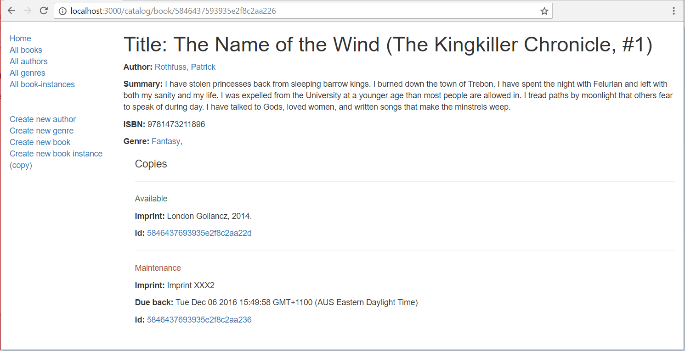

The _Book detail page_ needs to display the information for a specific `Book` (identified using its automatically generated `_id` field value), along with information about each associated copy in the library (`BookInstance`). Wherever we display an author, genre, or book instance, these should be linked to the associated detail page for that item.

## Controller

Open **/controllers/bookController.js**. Find the exported `book_detail()` controller method and replace it with the following code.

```js
// Display detail page for a specific book.
exports.book_detail = (req, res, next) => {
  async.parallel(
    {
      book(callback) {
        Book.findById(req.params.id)
          .populate("author")
          .populate("genre")
          .exec(callback);
      },
      book_instance(callback) {
        BookInstance.find({ book: req.params.id }).exec(callback);
      },
    },
    (err, results) => {
      if (err) {
        return next(err);
      }
      if (results.book == null) {
        // No results.
        const err = new Error("Book not found");
        err.status = 404;
        return next(err);
      }
      // Successful, so render.
      res.render("book_detail", {
        title: results.book.title,
        book: results.book,
        book_instances: results.book_instance,
      });
    }
  );
};
```

> **Note:** We don't need to require `async` and `BookInstance` in this step, as we already imported those modules when we implemented the home page controller.

The method uses `async.parallel()` to find the `Book` and its associated copies (`BookInstances`) in parallel. The approach is exactly the same as described for the [Genre detail page](/en-US/docs/Learn/Server-side/Express_Nodejs/Displaying_data/Genre_detail_page). Since the key 'title' is used to give name to the webpage (as defined in the header in 'layout.pug'), this time we are passing `results.book.title` while rendering the webpage.

## View

Create **/views/book_detail.pug** and add the text below.

```pug
extends layout

block content
  h1 Title: #{book.title}

  p #[strong Author:]
    a(href=book.author.url) #{book.author.name}
  p #[strong Summary:] #{book.summary}
  p #[strong ISBN:] #{book.isbn}
  p #[strong Genre:]
    each val, index in book.genre
      a(href=val.url) #{val.name}
      if index < book.genre.length - 1
        |,

  div(style='margin-left:20px;margin-top:20px')
    h4 Copies

    each val in book_instances
      hr
      if val.status=='Available'
        p.text-success #{val.status}
      else if val.status=='Maintenance'
        p.text-danger #{val.status}
      else
        p.text-warning #{val.status}
      p #[strong Imprint:] #{val.imprint}
      if val.status!='Available'
        p #[strong Due back:] #{val.due_back}
      p #[strong Id:]
        a(href=val.url) #{val._id}

    else
      p There are no copies of this book in the library.
```

Almost everything in this template has been demonstrated in previous sections.

> **Note:** The list of genres associated with the book is implemented in the template as below. This adds a comma after every genre associated with the book except for the last one.
>
> ```pug
>   p #[strong Genre:]
>     each val, index in book.genre
>       a(href=val.url) #{val.name}
>       if index < book.genre.length - 1
>         |,
> ```

## What does it look like?

Run the application and open your browser to `http://localhost:3000/`. Select the _All books_ link, then select one of the books. If everything is set up correctly, your page should look something like the following screenshot.



## Next steps

- Return to [Express Tutorial Part 5: Displaying library data](/en-US/docs/Learn/Server-side/Express_Nodejs/Displaying_data).
- Proceed to the next subarticle of part 5: [Author detail page](/en-US/docs/Learn/Server-side/Express_Nodejs/Displaying_data/Author_detail_page).
