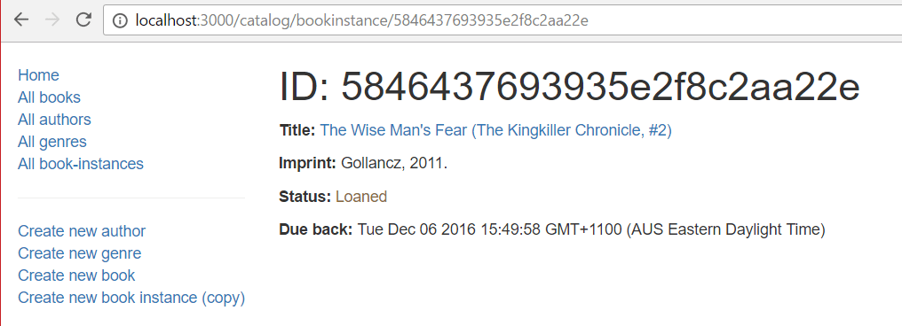

## BookInstance detail page

The `BookInstance` detail page needs to display the information for each `BookInstance`, identified using its (automatically generated) `_id` field value. This will include the `Book` name (as a link to the _Book detail page_) along with other information in the record.

### Controller

Open **/controllers/bookinstanceController.js**.
Find the exported `bookinstance_detail()` controller method and replace it with the following code.

```js
// Display detail page for a specific BookInstance.
exports.bookinstance_detail = asyncHandler(async (req, res, next) => {
  const bookInstance = await BookInstance.findById(req.params.id)
    .populate("book")
    .exec();

  if (bookInstance === null) {
    // No results.
    const err = new Error("Book copy not found");
    err.status = 404;
    return next(err);
  }

  res.render("bookinstance_detail", {
    title: "Book:",
    bookinstance: bookInstance,
  });
});
```

The implementation is very similar to that used for the other model detail pages.
The route controller function calls `BookInstance.findById()` with the ID of a specific book instance extracted from the URL (using the route), and accessed within the controller via the request parameters: `req.params.id`.
It then calls `populate()` to get the details of the associated `Book`.
If a matching `BookInstance` is not found an error is sent to the Express middleware.
Otherwise the returned data is rendered using the **bookinstance_detail.pug** view.

### View

Create **/views/bookinstance_detail.pug** and copy in the content below.

```pug
extends layout

block content

  h1 ID: #{bookinstance._id}

  p #[strong Title:]
    a(href=bookinstance.book.url) #{bookinstance.book.title}
  p #[strong Imprint:] #{bookinstance.imprint}

  p #[strong Status:]
    if bookinstance.status=='Available'
      span.text-success #{bookinstance.status}
    else if bookinstance.status=='Maintenance'
      span.text-danger #{bookinstance.status}
    else
      span.text-warning #{bookinstance.status}

  if bookinstance.status!='Available'
    p #[strong Due back:] #{bookinstance.due_back}
```

Everything in this template has been demonstrated in previous sections.

### What does it look like?

Run the application and open your browser to `http://localhost:3000/`. Select the _All book-instances_ link, then select one of the items. If everything is set up correctly, your site should look something like the following screenshot.



## Challenge

Currently most _dates_ displayed on the site use the default JavaScript format (e.g. _Tue Oct 06 2020 15:49:58 GMT+1100 (AUS Eastern Daylight Time))_. The challenge for this article is to improve the appearance of the date display for `Author` lifespan information (date of death/birth) and for _BookInstance detail_ pages to use the format: Oct 6th, 2016.

> **Note:** You can use the same approach as we used for the _Book Instance List_ (adding the virtual property for the lifespan to the `Author` model and use [luxon](https://www.npmjs.com/package/luxon) to format the date strings).

To complete this challenge, you must:

1. Replace the variable `due_back` with `due_back_formatted` in the _BookInstance detail_ page.
2. Update the `Author` model to add a lifespan virtual property. The lifespan should look like: _date_of_birth - date_of_death_, where both values have the same date format as `BookInstance.due_back_formatted`.
3. Use `Author.lifespan` in all views where you currently explicitly use `date_of_birth` and `date_of_death`.

## Next steps

- Return to [Express Tutorial Part 5: Displaying library data](/en-US/docs/Learn/Server-side/Express_Nodejs/Displaying_data#displaying_library_data_tutorial_subarticles).
