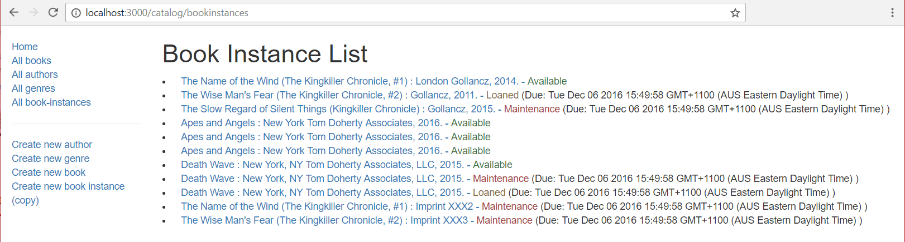

Next we'll implement our list of all book copies (`BookInstance`) in the library. This page needs to include the title of the `Book` associated with each `BookInstance` (linked to its detail page) along with other information in the `BookInstance` model, including the status, imprint, and unique id of each copy. The unique id text should be linked to the `BookInstance` detail page.

## Controller

The `BookInstance` list controller function needs to get a list of all book instances, populate the associated book information, and then pass the list to the template for rendering.

Open `/controllers/bookinstanceController.js`.
Find the exported `bookinstance_list()` controller method and replace it with the following code.

```js
// Display list of all BookInstances.
exports.bookinstance_list = asyncHandler(async (req, res, next) => {
  const allBookInstances = await BookInstance.find().populate("book").exec();

  res.render("bookinstance_list", {
    title: "Book Instance List",
    bookinstance_list: allBookInstances,
  });
});
```

The route handler calls the `find()` function on the `BookInstance` model, and then daisy-chains a call to `populate()` with the `book` field—this will replace the book id stored for each `BookInstance` with a full `Book` document.
`exec()` is then daisy-chained on the end in order to execute the query and return a promise.

The route handler uses `await` to wait on the promise, pausing execution until it is settled.
If the promise is fulfilled, the results of the query are saved to the `allBookInstances` variable, and the route handler continues execution.

The last part of the code calls `render()`, specifying the **bookinstance_list** (.pug) template and passing values for the `title` and `bookinstance_list` into the template.

## View

Create **/views/bookinstance_list.pug** and copy in the text below.

```pug
extends layout

block content
  h1= title

  ul
    each val in bookinstance_list
      li
        a(href=val.url) #{val.book.title} : #{val.imprint} -
        if val.status=='Available'
          span.text-success #{val.status}
        else if val.status=='Maintenance'
          span.text-danger #{val.status}
        else
          span.text-warning #{val.status}
        if val.status!='Available'
          span  (Due: #{val.due_back} )

    else
      li There are no book copies in this library.
```

This view is much the same as all the others. It extends the layout, replacing the _content_ block, displays the `title` passed in from the controller, and iterates through all the book copies in `bookinstance_list`. For each copy we display its status (color coded) and if the book is not available, its expected return date. One new feature is introduced—we can use dot notation after a tag to assign a class. So `span.text-success` will be compiled to `<span class="text-success">` (and might also be written in Pug as `span(class="text-success")`.

## What does it look like?

Run the application, open your browser to `http://localhost:3000/`, then select the _All book-instances_ link. If everything is set up correctly, your site should look something like the following screenshot.



## Next steps

- Return to [Express Tutorial Part 5: Displaying library data](/en-US/docs/Learn/Server-side/Express_Nodejs/Displaying_data).
- Proceed to the next subarticle of part 5: [Date formatting using luxon](/en-US/docs/Learn/Server-side/Express_Nodejs/Displaying_data/Date_formatting_using_moment).
