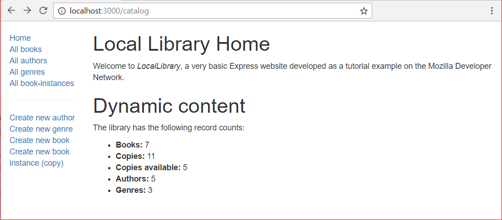

The first page we'll create will be the website home page, which is accessible from either the site (`'/'`) or catalog (`catalog/`) root. This will display some static text describing the site, along with dynamically calculated "counts" of different record types in the database.

We've already created a route for the home page. In order to complete the page we need to update our controller function to fetch "counts" of records from the database, and create a view (template) that we can use to render the page.

## Route

We created our index page routes in a [previous tutorial.](/en-US/docs/Learn/Server-side/Express_Nodejs/routes) As a reminder, all the route functions are defined in **/routes/catalog.js**:

```js
// GET catalog home page.
router.get('/', book_controller.index);  //This actually maps to /catalog/ because we import the route with a /catalog prefix
```

Where the callback function parameter (`book_controller.index`) is defined in **/controllers/bookController.js**:

```js
exports.index = (req, res, next) => {
  res.send('NOT IMPLEMENTED: Site Home Page');
}
```

It is this controller function that we extend to get information from our models and then render it using a template (view).

## Controller

The index controller function needs to fetch information about how many `Book`, `BookInstance`, available `BookInstance`, `Author`, and `Genre` records we have in the database, render this data in a template to create an HTML page, and then return it in an HTTP response.

> **Note:** We use the [`countDocuments()`](https://mongoosejs.com/docs/api.html#model_Model.countDocuments) method to get the number of instances of each model. This is called on a model, with an optional set of conditions to match against in the first argument, and a callback in the second argument (as discussed in [Using a Database (with Mongoose)](/en-US/docs/Learn/Server-side/Express_Nodejs/mongoose), and you can also return a `Query` and then execute it with a callback later). The callback will be invoked when the database returns the count, with an error value as the first parameter (or `null`) and the count of documents as the second parameter (or `null` if there was an error) .
>
> ```js
> SomeModel.countDocuments({ a_model_field: 'match_value' }, (err, count) => {
>  // Do something if there is an err
>  // Do something with the count if there was no error
>  });
> ```

Open **/controllers/bookController.js**. Near the top of the file you should see the exported `index()` function.

```python
const Book = require('../models/book')

exports.index = (req, res, next) => {
 res.send('NOT IMPLEMENTED: Site Home Page');
}
```

Replace all the code above with the following code fragment.
The first thing this does is import (`require()`) all the models.
We need to do this because we'll be using them to get our counts of documents.
It then imports the _async_ module (which we discussed previously in [Asynchronous flow control using async](/en-US/docs/Learn/Server-side/Express_Nodejs/Displaying_data/flow_control_using_async)).

```js
const Book = require('../models/book');
const Author = require('../models/author');
const Genre = require('../models/genre');
const BookInstance = require('../models/bookinstance');

const async = require('async');

exports.index = (req, res) =>{
  async.parallel({
    book_count(callback) {
      Book.countDocuments({}, callback); // Pass an empty object as match condition to find all documents of this collection
    },
    book_instance_count(callback) {
      BookInstance.countDocuments({}, callback);
    },
    book_instance_available_count(callback) {
      BookInstance.countDocuments({ status:'Available' }, callback);
    },
    author_count(callback) {
      Author.countDocuments({}, callback);
    },
    genre_count(callback) {
      Genre.countDocuments({}, callback);
    }
  },
  (err, results) => {
    res.render('index', { title: 'Local Library Home', error: err, data: results });
  });
};
```

The `async.parallel()` method is passed an object with functions for getting the counts for each of our models. These functions are all started at the same time. When all of them have completed the final callback is invoked with the counts in the `results` parameter (or an error).

On success the callback function calls [`res.render()`](https://expressjs.com/en/4x/api.html#res.render), specifying a view (template) named '**index**' and an object containing the data that is to be inserted into it (this includes the `results` object that contains our model counts). The data is supplied as key-value pairs, and can be accessed in the template using the key.

> **Note:** The callback function from `async.parallel()` above is a little unusual in that we render the page whether or not there was an error (normally you might use a separate execution path for handling the display of errors).

## View

Open **/views/index.pug** and replace its content with the text below.

```pug
extends layout

block content
  h1= title
  p Welcome to #[em LocalLibrary], a very basic Express website developed as a tutorial example on the Mozilla Developer Network.

  h1 Dynamic content

  if error
    p Error getting dynamic content.
  else
    p The library has the following record counts:

    ul
      li #[strong Books:] !{data.book_count}
      li #[strong Copies:] !{data.book_instance_count}
      li #[strong Copies available:] !{data.book_instance_available_count}
      li #[strong Authors:] !{data.author_count}
      li #[strong Genres:] !{data.genre_count}
```

The view is straightforward. We extend the **layout.pug** base template, overriding the `block` named '**content**'. The first `h1` heading will be the escaped text for the `title` variable that was passed into the `render()` function—note the use of the '`h1=`' so that the following text is treated as a JavaScript expression. We then include a paragraph introducing the LocalLibrary.

Under the _Dynamic content_ heading we check whether the error variable passed in from the `render()` function has been defined. If so, we note the error. If not, we get and list the number of copies of each model from the `data` variable.

> **Note:** We didn't escape the count values (i.e. we used the `!{}` syntax) because the count values are calculated. If the information was supplied by end-users then we'd escape the variable for display.

## What does it look like?

At this point we should have created everything needed to display the index page. Run the application and open your browser to `http://localhost:3000/`. If everything is set up correctly, your site should look something like the following screenshot.



> **Note:** You won't be able to _use_ the sidebar links yet because the URLs, views, and templates for those pages haven't been defined. If you try you'll get errors like "NOT IMPLEMENTED: Book list" for example, depending on the link you click on. These string literals (which will be replaced with proper data) were specified in the different controllers that live inside your "controllers" file.

## Next steps

- Return to [Express Tutorial Part 5: Displaying library data](/en-US/docs/Learn/Server-side/Express_Nodejs/Displaying_data).
- Proceed to the next subarticle of part 5: [Book list page](/en-US/docs/Learn/Server-side/Express_Nodejs/Displaying_data/Book_list_page).
