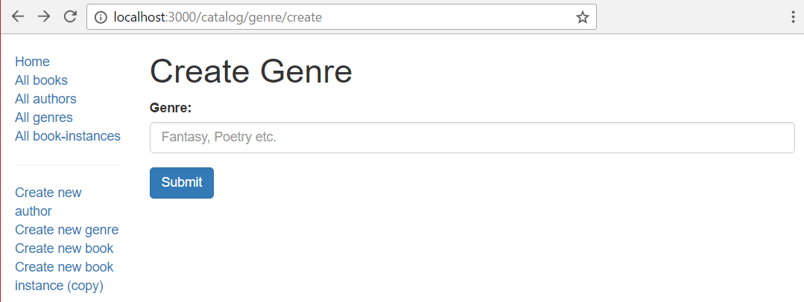

This sub article shows how we define our page to create `Genre` objects (this is a good place to start because the `Genre` has only one field, its `name`, and no dependencies). Like any other pages, we need to set up routes, controllers, and views.

## Import validation and sanitization methods

To use the _express-validator_ in our controllers we have to _require_ the functions we want to use from the `'express-validator'` module.

Open **/controllers/genreController.js**, and add the following line at the top of the file:

```js
const { body, validationResult } = require("express-validator");
```

> **Note:** This syntax allows us to use `body` and `validationResult` as the associated middleware functions, as you will see in the post route section below. It is equivalent to:
>
> ```js
> const validator = require("express-validator");
> const body = validator.body;
> const validationResult = validator.validationResult;
> ```

## Controller—get route

Find the exported `genre_create_get()` controller method and replace it with the following code. This renders the **genre_form.pug** view, passing a title variable.

```js
// Display Genre create form on GET.
exports.genre_create_get = (req, res, next) => {
  res.render("genre_form", { title: "Create Genre" });
};
```

## Controller—post route

Find the exported `genre_create_post()` controller method and replace it with the following code.

```js
// Handle Genre create on POST.
exports.genre_create_post = [
  // Validate and sanitize the name field.
  body("name", "Genre name required").trim().isLength({ min: 1 }).escape(),

  // Process request after validation and sanitization.
  (req, res, next) => {
    // Extract the validation errors from a request.
    const errors = validationResult(req);

    // Create a genre object with escaped and trimmed data.
    const genre = new Genre({ name: req.body.name });

    if (!errors.isEmpty()) {
      // There are errors. Render the form again with sanitized values/error messages.
      res.render("genre_form", {
        title: "Create Genre",
        genre,
        errors: errors.array(),
      });
      return;
    } else {
      // Data from form is valid.
      // Check if Genre with same name already exists.
      Genre.findOne({ name: req.body.name }).exec((err, found_genre) => {
        if (err) {
          return next(err);
        }

        if (found_genre) {
          // Genre exists, redirect to its detail page.
          res.redirect(found_genre.url);
        } else {
          genre.save((err) => {
            if (err) {
              return next(err);
            }
            // Genre saved. Redirect to genre detail page.
            res.redirect(genre.url);
          });
        }
      });
    }
  },
];
```

The first thing to note is that instead of being a single middleware function (with arguments `(req, res, next)`) the controller specifies an _array_ of middleware functions. The array is passed to the router function and each method is called in order.

> **Note:** This approach is needed, because the validators are middleware functions.

The first method in the array defines a body validator (`body()`) that validates and sanitizes the field. This uses `trim()` to remove any trailing/leading whitespace, checks that the _name_ field is not empty, and then uses `escape()` to remove any dangerous HTML characters).

```js
[
  // Validate that the name field is not empty.
  body('name', 'Genre name required')
    .trim()
    .isLength({ min: 1 })
    .escape(),
  // …
]
```

After specifying the validators we create a middleware function to extract any validation errors. We use `isEmpty()` to check whether there are any errors in the validation result. If there are then we render the form again, passing in our sanitized genre object and the array of error messages (`errors.array()`).

```js
// Process request after validation and sanitization.
(req, res, next) => {
  // Extract the validation errors from a request.
  const errors = validationResult(req);

  // Create a genre object with escaped and trimmed data.
  const genre = new Genre({ name: req.body.name });

  if (!errors.isEmpty()) {
    // There are errors. Render the form again with sanitized values/error messages.
    res.render("genre_form", {
      title: "Create Genre",
      genre,
      errors: errors.array(),
    });
    return;
  } else {
    // Form data is valid.
    // Save the result.
    // …
  }
};
```

If the genre name data is valid then we check if a `Genre` with the same name already exists (as we don't want to create duplicates). If it does, we redirect to the existing genre's detail page. If not, we save the new `Genre` and redirect to its detail page.

```js
// Check if Genre with same name already exists.
Genre.findOne({ name: req.body.name }).exec((err, found_genre) => {
  if (err) {
    return next(err);
  }
  if (found_genre) {
    // Genre exists, redirect to its detail page.
    res.redirect(found_genre.url);
  } else {
    genre.save((err) => {
      if (err) {
        return next(err);
      }
      // Genre saved. Redirect to genre detail page.
      res.redirect(genre.url);
    });
  }
});
```

This same pattern is used in all our post controllers: we run validators (with sanitizers), then check for errors and either re-render the form with error information or save the data.

## View

The same view is rendered in both the `GET` and `POST` controllers/routes when we create a new `Genre` (and later on it is also used when we _update_ a `Genre`). In the `GET` case the form is empty, and we just pass a title variable. In the `POST` case the user has previously entered invalid data—in the `genre` variable we pass back a sanitized version of the entered data and in the `errors` variable we pass back an array of error messages.

```js
res.render("genre_form", { title: "Create Genre" });
res.render("genre_form", {
  title: "Create Genre",
  genre,
  errors: errors.array(),
});
```

Create **/views/genre_form.pug** and copy in the text below.

```pug
extends layout

block content
  h1 #{title}

  form(method='POST' action='')
    div.form-group
      label(for='name') Genre:
      input#name.form-control(type='text', placeholder='Fantasy, Poetry etc.' name='name' value=(undefined===genre ? '' : genre.name))
    button.btn.btn-primary(type='submit') Submit

  if errors
   ul
    for error in errors
     li!= error.msg
```

Much of this template will be familiar from our previous tutorials. First, we extend the **layout.pug** base template and override the `block` named '**content**'. We then have a heading with the `title` we passed in from the controller (via the `render()` method).

Next, we have the pug code for our HTML form that uses the `POST` `method` to send the data to the server, and because the `action` is an empty string, will send the data to the same URL as the page.

The form defines a single required field of type "text" called "name". The default _value_ of the field depends on whether the `genre` variable is defined. If called from the `GET` route it will be empty as this is a new form. If called from a `POST` route it will contain the (invalid) value originally entered by the user.

The last part of the page is the error code. This prints a list of errors, if the error variable has been defined (in other words, this section will not appear when the template is rendered on the `GET` route).

> **Note:** This is just one way to render the errors. You can also get the names of the affected fields from the error variable, and use these to control where the error messages are rendered, whether to apply custom CSS, etc.

## What does it look like?

Run the application, open your browser to `http://localhost:3000/`, then select the _Create new genre_ link. If everything is set up correctly, your site should look something like the following screenshot. After you enter a value, it should be saved and you'll be taken to the genre detail page.



The only error we validate against server-side is that the genre field must not be empty. The screenshot below shows what the error list would look like if you didn't supply a genre (highlighted in red).

![The Create Genre section of the Local library application. The left column has a vertical navigation bar. The right section is the create a new Genre from with a heading that reads 'Create Genre'. There is one input field labeled 'Genre'. There is a submit button at the bottom. There is an error message that reads 'Genre name required' directly below the Submit button. The error message was highlighted by the author of this article. There is no visual indication in the form that the genre is required nor that the error message only appears on error.](locallibary_express_genre_create_error.png)

> **Note:** Our validation uses `trim()` to ensure that whitespace is not accepted as a genre name. We can also validate that the field is not empty on the client side by adding the value `required='true'` to the field definition in the form:
>
> ```
> input#name.form-control(type='text', placeholder='Fantasy, Poetry etc.' name='name' value=(undefined===genre ? '' : genre.name), required='true' )
> ```

## Next steps

1. Return to [Express Tutorial Part 6: Working with forms.](/en-US/docs/Learn/Server-side/Express_Nodejs/forms)
2. Proceed to the next sub article of part 6: [Create Author form](/en-US/docs/Learn/Server-side/Express_Nodejs/forms/Create_author_form).
