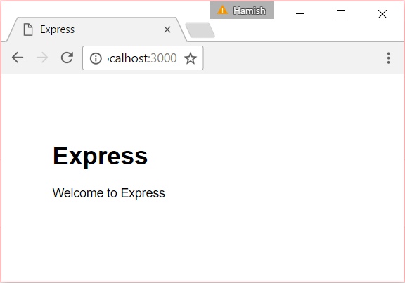

{{LearnSidebar}}

{{PreviousMenuNext("Learn/Server-side/Express_Nodejs/Tutorial_local_library_website", "Learn/Server-side/Express_Nodejs/mongoose", "Learn/Server-side/Express_Nodejs")}}

This second article in our [Express Tutorial](/en-US/docs/Learn/Server-side/Express_Nodejs/Tutorial_local_library_website) shows how you can create a "skeleton" website project which you can then go on to populate with site-specific routes, templates/views, and database calls.

<table>
  <tbody>
    <tr>
      <th scope="row">Prerequisites:</th>
      <td>
        <a href="/en-US/docs/Learn/Server-side/Express_Nodejs/development_environment">Set up a Node development environment</a>.
          Review the Express Tutorial.
      </td>
    </tr>
    <tr>
      <th scope="row">Objective:</th>
      <td>
        To be able to start your own new website projects using the <em>Express Application Generator</em>.
      </td>
    </tr>
  </tbody>
</table>

## Overview

This article shows how you can create a "skeleton" website using the [Express Application Generator](https://expressjs.com/en/starter/generator.html) tool, which you can then populate with site-specific routes, views/templates, and database calls. In this case, we'll use the tool to create the framework for our [Local Library website](/en-US/docs/Learn/Server-side/Express_Nodejs/Tutorial_local_library_website), to which we'll later add all the other code needed by the site. The process is extremely simple, requiring only that you invoke the generator on the command line with a new project name, optionally also specifying the site's template engine and CSS generator.

The following sections show you how to call the application generator, and provides a little explanation about the different view/CSS options. We'll also explain how the skeleton website is structured. At the end, we'll show how you can run the website to verify that it works.

> **Note:**
>
> - The _Express Application Generator_ is not the only generator for Express applications, and the generated project is not the only viable way to structure your files and directories. The generated site does however have a modular structure that is easy to extend and understand. For information about a _minimal_ Express application, see [Hello world example](https://expressjs.com/en/starter/hello-world.html) (Express docs).
> - The _Express Application Generator_ declares most variables using `var`.
>   We have changed most of these to [`const`](/en-US/docs/Web/JavaScript/Reference/Statements/const) (and a few to [`let`](/en-US/docs/Web/JavaScript/Reference/Statements/let)) in the tutorial, because we want to demonstrate modern JavaScript practice.
> - This tutorial uses the version of _Express_ and other dependencies that are defined in the **package.json** created by the _Express Application Generator_.
>   These are not (necessarily) the latest version, and you may want to update them when deploying a real application to production.

## Using the application generator

You should already have installed the generator as part of [setting up a Node development environment](/en-US/docs/Learn/Server-side/Express_Nodejs/development_environment). As a quick reminder, you install the generator tool site-wide using the npm package manager, as shown:

```bash
npm install express-generator -g
```

The generator has a number of options, which you can view on the command line using the `--help` (or `-h`) command:

```bash
> express --help

    Usage: express [options] [dir]

  Options:

        --version        output the version number
    -e, --ejs            add ejs engine support
        --pug            add pug engine support
        --hbs            add handlebars engine support
    -H, --hogan          add hogan.js engine support
    -v, --view <engine>  add view <engine> support (dust|ejs|hbs|hjs|jade|pug|twig|vash) (defaults to jade)
        --no-view        use static html instead of view engine
    -c, --css <engine>   add stylesheet <engine> support (less|stylus|compass|sass) (defaults to plain CSS)
        --git            add .gitignore
    -f, --force          force on non-empty directory
    -h, --help           output usage information
```

You can specify express to create a project inside the _current_ directory using the _Jade_ view engine and plain CSS (if you specify a directory name then the project will be created in a sub-folder with that name).

```bash
express
```

You can also choose a view (template) engine using `--view` and/or a CSS generation engine using `--css`.

> **Note:** The other options for choosing template engines (e.g. `--hogan`, `--ejs`, `--hbs` etc.) are deprecated. Use `--view` (or `-v`).

### What view engine should I use?

The _Express Application Generator_ allows you to configure a number of popular view/templating engines, including [EJS](https://www.npmjs.com/package/ejs), [Hbs](https://github.com/pillarjs/hbs), [Pug](https://pugjs.org/api/getting-started.html) (Jade), [Twig](https://www.npmjs.com/package/twig), and [Vash](https://www.npmjs.com/package/vash), although it chooses Jade by default if you don't specify a view option. Express itself can also support a large number of other templating languages [out of the box](https://github.com/expressjs/express/wiki#template-engines).

> **Note:** If you want to use a template engine that isn't supported by the generator then see [Using template engines with Express](https://expressjs.com/en/guide/using-template-engines.html) (Express docs) and the documentation for your target view engine.

Generally speaking, you should select a templating engine that delivers all the functionality you need and allows you to be productive sooner — or in other words, in the same way that you choose any other component! Some of the things to consider when comparing template engines:

- Time to productivity — If your team already has experience with a templating language then it is likely they will be productive faster using that language. If not, then you should consider the relative learning curve for candidate templating engines.
- Popularity and activity — Review the popularity of the engine and whether it has an active community. It is important to be able to get support when problems arise throughout the lifetime of the website.
- Style — Some template engines use specific markup to indicate inserted content within "ordinary" HTML, while others construct the HTML using a different syntax (for example, using indentation and block names).
- Performance/rendering time.
- Features — you should consider whether the engines you look at have the following features available:

  - Layout inheritance: Allows you to define a base template and then "inherit" just the parts of it that you want to be different for a particular page. This is typically a better approach than building templates by including a number of required components or building a template from scratch each time.
  - "Include" support: Allows you to build up templates by including other templates.
  - Concise variable and loop control syntax.
  - Ability to filter variable values at template level, such as making variables upper-case, or formatting a date value.
  - Ability to generate output formats other than HTML, such as JSON or XML.
  - Support for asynchronous operations and streaming.
  - Client-side features. If a templating engine can be used on the client this allows the possibility of having all or most of the rendering done client-side.

> **Note:** There are many resources on the Internet to help you compare the different options!

For this project, we'll use the [Pug](https://pugjs.org/api/getting-started.html) templating engine (this is the recently-renamed Jade engine), as this is one of the most popular Express/JavaScript templating languages and is supported out of the box by the generator.

### What CSS stylesheet engine should I use?

The _Express Application Generator_ allows you to create a project that is configured to use the most common CSS stylesheet engines: [LESS](https://lesscss.org/), [SASS](https://sass-lang.com/), [Compass](http://compass-style.org/), [Stylus](https://stylus-lang.com/).

> **Note:** CSS has some limitations that make certain tasks difficult. CSS stylesheet engines allow you to use more powerful syntax for defining your CSS and then compile the definition into plain-old CSS for browsers to use.

As with templating engines, you should use the stylesheet engine that will allow your team to be most productive. For this project, we'll use vanilla CSS (the default) as our CSS requirements are not sufficiently complicated to justify using anything else.

### What database should I use?

The generated code doesn't use/include any databases. _Express_ apps can use any [database mechanism](https://expressjs.com/en/guide/database-integration.html) supported by _Node_ (_Express_ itself doesn't define any specific additional behavior/requirements for database management).

We'll discuss how to integrate with a database in a later article.

## Creating the project

For the sample _Local Library_ app we're going to build, we'll create a project named _express-locallibrary-tutorial_ using the _Pug_ template library and no CSS engine.

First, navigate to where you want to create the project and then run the _Express Application Generator_ in the command prompt as shown:

```bash
express express-locallibrary-tutorial --view=pug
```

The generator will create (and list) the project's files.

```bash
   create : express-locallibrary-tutorial\
   create : express-locallibrary-tutorial\public\
   create : express-locallibrary-tutorial\public\javascripts\
   create : express-locallibrary-tutorial\public\images\
   create : express-locallibrary-tutorial\public\stylesheets\
   create : express-locallibrary-tutorial\public\stylesheets\style.css
   create : express-locallibrary-tutorial\routes\
   create : express-locallibrary-tutorial\routes\index.js
   create : express-locallibrary-tutorial\routes\users.js
   create : express-locallibrary-tutorial\views\
   create : express-locallibrary-tutorial\views\error.pug
   create : express-locallibrary-tutorial\views\index.pug
   create : express-locallibrary-tutorial\views\layout.pug
   create : express-locallibrary-tutorial\app.js
   create : express-locallibrary-tutorial\package.json
   create : express-locallibrary-tutorial\bin\
   create : express-locallibrary-tutorial\bin\www

   change directory:
     > cd express-locallibrary-tutorial

   install dependencies:
     > npm install

   run the app (Bash (Linux or macOS))
     > DEBUG=express-locallibrary-tutorial:* npm start

   run the app (PowerShell (Windows))
     > $ENV:DEBUG = "express-locallibrary-tutorial:*"; npm start

   run the app (Command Prompt (Windows)):
     > SET DEBUG=express-locallibrary-tutorial:* & npm start
```

At the end of the output, the generator provides instructions on how to install the dependencies (as listed in the **package.json** file) and how to run the application on different operating systems.

> **Note:** The generator-created files define all variables as `var`.
> Open all of the generated files and change the `var` declarations to `const` before you continue (the remainder of the tutorial assumes that you have done so).

## Running the skeleton website

At this point, we have a complete skeleton project. The website doesn't actually _do_ very much yet, but it's worth running it to show that it works.

1. First, install the dependencies (the `install` command will fetch all the dependency packages listed in the project's **package.json** file).

   ```bash
   cd express-locallibrary-tutorial
   npm install
   ```

2. Then run the application.

   - On the Windows CMD prompt, use this command:

     ```bash
     SET DEBUG=express-locallibrary-tutorial:* & npm start
     ```

   - On Windows Powershell, use this command:

     ```bash
     $ENV:DEBUG = "express-locallibrary-tutorial:*"; npm start
     ```

     > **Note:** Powershell commands are not covered further in this tutorial (The provided "Windows" commands assume you're using the Windows CMD prompt.)

   - On macOS or Linux, use this command:

     ```bash
     DEBUG=express-locallibrary-tutorial:* npm start
     ```

3. Then load `http://localhost:3000/` in your browser to access the app.

You should see a browser page that looks like this:



Congratulations! You now have a working Express application that can be accessed via port 3000.

> **Note:** You could also start the app just using the `npm start` command. Specifying the DEBUG variable as shown enables console logging/debugging. For example, when you visit the above page you'll see debug output like this:
>
> ```bash
> >SET DEBUG=express-locallibrary-tutorial:* & npm start
>
> > express-locallibrary-tutorial@0.0.0 start D:\github\mdn\test\exprgen\express-locallibrary-tutorial
> > node ./bin/www
>
>   express-locallibrary-tutorial:server Listening on port 3000 +0ms
> GET / 304 490.296 ms - -
> GET /stylesheets/style.css 200 4.886 ms - 111
> ```

## Enable server restart on file changes

Any changes you make to your Express website are currently not visible until you restart the server. It quickly becomes very irritating to have to stop and restart your server every time you make a change, so it is worth taking the time to automate restarting the server when needed.

A convenient tool for this purpose is [nodemon](https://github.com/remy/nodemon). This is usually installed globally (as it is a "tool"), but here we'll install and use it locally as a _developer dependency_, so that any developers working with the project get it automatically when they install the application. Use the following command in the root directory for the skeleton project:

```bash
npm install --save-dev nodemon
```

If you still choose to install [nodemon](https://github.com/remy/nodemon) globally to your machine, and not only to your project's **package.json** file:

```bash
npm install -g nodemon
```

If you open your project's **package.json** file you'll now see a new section with this dependency:

```json
 "devDependencies": {
    "nodemon": "^2.0.4"
}
```

Because the tool isn't installed globally we can't launch it from the command line (unless we add it to the path) but we can call it from an npm script because npm knows all about the installed packages. Find the `scripts` section of your package.json. Initially, it will contain one line, which begins with `"start"`. Update it by putting a comma at the end of that line, and adding the `"devstart"` and `"serverstart"` lines:

- On Linux and macOS, the scripts section will look like this:

  ```json
    "scripts": {
      "start": "node ./bin/www",
      "devstart": "nodemon ./bin/www",
      "serverstart": "DEBUG=express-locallibrary-tutorial:* npm run devstart"
    },
  ```

- On Windows, the "serverstart" value would instead look like this (if using the command prompt):

  ```bash
  "serverstart": "SET DEBUG=express-locallibrary-tutorial:* & npm run devstart"
  ```

We can now start the server in almost exactly the same way as previously, but using the `devstart` command.

> **Note:** Now if you edit any file in the project the server will restart (or you can restart it by typing `rs` on the command prompt at any time). You will still need to reload the browser to refresh the page.
>
> We now have to call "`npm run <scriptname>`" rather than just `npm start`, because "start" is actually an npm command that is mapped to the named script. We could have replaced the command in the _start_ script but we only want to use _nodemon_ during development, so it makes sense to create a new script command.
>
> The `serverstart` command added to the scripts in the **package.json** above is a very good example. Using this approach means you no longer have to type a long command to start the server. Note that the particular command added to the script works for macOS or Linux only.

## The generated project

Let's now take a look at the project we just created.

### Directory structure

The generated project, now that you have installed dependencies, has the following file structure (files are the items **not** prefixed with "/").
The **package.json** file defines the application dependencies and other information.
It also defines a startup script that will call the application entry point, the JavaScript file **/bin/www**.
This sets up some of the application error handling and then loads **app.js** to do the rest of the work.
The app routes are stored in separate modules under the **routes/** directory.
The templates are stored under the /**views** directory.

```plain
express-locallibrary-tutorial
    app.js
    /bin
        www
    package.json
    package-lock.json
    /node_modules
        [about 6700 subdirectories and files]
    /public
        /images
        /javascripts
        /stylesheets
            style.css
    /routes
        index.js
        users.js
    /views
        error.pug
        index.pug
        layout.pug
```

The following sections describe the files in a little more detail.

### package.json

The **package.json** file defines the application dependencies and other information:

```json
{
  "name": "express-locallibrary-tutorial",
  "version": "0.0.0",
  "private": true,
  "scripts": {
    "start": "node ./bin/www"
  },
  "dependencies": {
    "cookie-parser": "~1.4.4",
    "debug": "~2.6.9",
    "express": "~4.16.1",
    "http-errors": "~1.6.3",
    "morgan": "~1.9.1",
    "pug": "2.0.0-beta11"
  },
  "devDependencies": {
    "nodemon": "^2.0.4"
  }
}
```

The dependencies include the _express_ package and the package for our selected view engine (_pug_). In addition, we have the following packages that are useful in many web applications:

- [cookie-parser](https://www.npmjs.com/package/cookie-parser): Used to parse the cookie header and populate `req.cookies` (essentially provides a convenient method for accessing cookie information).
- [debug](https://www.npmjs.com/package/debug): A tiny node debugging utility modeled after node core's debugging technique.
- [morgan](https://www.npmjs.com/package/morgan): An HTTP request logger middleware for node.
- [http-errors](https://www.npmjs.com/package/http-errors): Create HTTP errors where needed (for express error handling).

The scripts section first defines a "_start_" script, which is what we are invoking when we call `npm start` to start the server (this script was added by the _Express Application Generator_). From the script definition, you can see that this actually starts the JavaScript file **./bin/www** with _node_.

```json
  "scripts": {
    "start": "node ./bin/www",
    "devstart": "nodemon ./bin/www",
    "serverstart": "DEBUG=express-locallibrary-tutorial:* npm run devstart"
  },
```

The _devstart_ and _serverstart_ scripts can be used to start the same **./bin/www** file with _nodemon_ rather than _node_ (this example is for Linux and macOS, as discussed above in [Enable server restart on file changes](#enable_server_restart_on_file_changes)).

### www file

The file **/bin/www** is the application entry point! The very first thing this does is `require()` the "real" application entry point (**app.js**, in the project root) that sets up and returns the [`express()`](https://expressjs.com/en/api.html) application object.

```js
#!/usr/bin/env node

/**
 * Module dependencies.
 */

const app = require("../app");
```

> **Note:** `require()` is a global node function that is used to import modules into the current file. Here we specify **app.js** module using a relative path and omitting the optional (.**js**) file extension.

The remainder of the code in this file sets up a node HTTP server with `app` set to a specific port (defined in an environment variable or 3000 if the variable isn't defined), and starts listening and reporting server errors and connections. For now you don't really need to know anything else about the code (everything in this file is "boilerplate"), but feel free to review it if you're interested.

### app.js

This file creates an `express` application object (named `app`, by convention), sets up the application with various settings and middleware, and then exports the app from the module. The code below shows just the parts of the file that create and export the app object:

```js
const express = require("express");
const app = express();
// …
module.exports = app;
```

Back in the **www** entry point file above, it is this `module.exports` object that is supplied to the caller when this file is imported.

Let's work through the **app.js** file in detail. First, we import some useful node libraries into the file using `require()`, including _http-errors_, _express_, _morgan_ and _cookie-parser_ that we previously downloaded for our application using npm; and _path_, which is a core Node library for parsing file and directory paths.

```js
const createError = require("http-errors");
const express = require("express");
const path = require("path");
const cookieParser = require("cookie-parser");
const logger = require("morgan");
```

Then we `require()` modules from our routes directory. These modules/files contain code for handling particular sets of related "routes" (URL paths). When we extend the skeleton application, for example to list all books in the library, we will add a new file for dealing with book-related routes.

```js
const indexRouter = require("./routes/index");
const usersRouter = require("./routes/users");
```

> **Note:** At this point, we have just _imported_ the module; we haven't actually used its routes yet (this happens just a little bit further down the file).

Next, we create the `app` object using our imported _express_ module, and then use it to set up the view (template) engine. There are two parts to setting up the engine. First, we set the '`views`' value to specify the folder where the templates will be stored (in this case the subfolder **/views**). Then we set the '`view engine`' value to specify the template library (in this case "pug").

```js
const app = express();

// view engine setup
app.set("views", path.join(__dirname, "views"));
app.set("view engine", "pug");
```

The next set of functions call `app.use()` to add the _middleware_ libraries that we imported above into the request handling chain.
For example, `express.json()` and `express.urlencoded()` are needed to populate [`req.body`](https://expressjs.com/en/api.html#req.body) with the form fields.
After these libraries we also use the `express.static` middleware, which makes _Express_ serve all the static files in the **/public** directory in the project root.

```js
app.use(logger("dev"));
app.use(express.json());
app.use(express.urlencoded({ extended: false }));
app.use(cookieParser());

app.use(express.static(path.join(__dirname, "public")));
```

Now that all the other middleware is set up, we add our (previously imported) route-handling code to the request handling chain. The imported code will define particular routes for the different _parts_ of the site:

```js
app.use("/", indexRouter);
app.use("/users", usersRouter);
```

> **Note:** The paths specified above (`'/'` and '`/users'`) are treated as a prefix to routes defined in the imported files.
> So for example, if the imported **users** module defines a route for `/profile`, you would access that route at `/users/profile`. We'll talk more about routes in a later article.

The last middleware in the file adds handler methods for errors and HTTP 404 responses.

```js
// catch 404 and forward to error handler
app.use((req, res, next) => {
  next(createError(404));
});

// error handler
app.use((err, req, res, next) => {
  // set locals, only providing error in development
  res.locals.message = err.message;
  res.locals.error = req.app.get("env") === "development" ? err : {};

  // render the error page
  res.status(err.status || 500);
  res.render("error");
});
```

The Express application object (app) is now fully configured. The last step is to add it to the module exports (this is what allows it to be imported by **/bin/www**).

```js
module.exports = app;
```

### Routes

The route file **/routes/users.js** is shown below (route files share a similar structure, so we don't need to also show **index.js**).
First, it loads the _express_ module and uses it to get an `express.Router` object.
Then it specifies a route on that object and lastly exports the router from the module (this is what allows the file to be imported into **app.js**).

```js
const express = require("express");
const router = express.Router();

/* GET users listing. */
router.get("/", (req, res, next) => {
  res.send("respond with a resource");
});

module.exports = router;
```

The route defines a callback that will be invoked whenever an HTTP `GET` request with the correct pattern is detected. The matching pattern is the route specified when the module is imported ('`/users`') plus whatever is defined in this file ('`/`'). In other words, this route will be used when a URL of `/users/` is received.

> **Note:** Try this out by running the server with node and visiting the URL in your browser: `http://localhost:3000/users/`. You should see a message: 'respond with a resource'.

One thing of interest above is that the callback function has the third argument '`next`', and is hence a middleware function rather than a simple route callback. While the code doesn't currently use the `next` argument, it may be useful in the future if you want to add multiple route handlers to the `'/'` route path.

### Views (templates)

The views (templates) are stored in the **/views** directory (as specified in **app.js**) and are given the file extension **.pug**. The method [`Response.render()`](https://expressjs.com/en/4x/api.html#res.render) is used to render a specified template along with the values of named variables passed in an object, and then send the result as a response. In the code below from **/routes/index.js** you can see how that route renders a response using the template "index" passing the template variable "title".

```js
/* GET home page. */
router.get("/", (req, res, next) => {
  res.render("index", { title: "Express" });
});
```

The corresponding template for the above route is given below (**index.pug**). We'll talk more about the syntax later. All you need to know for now is that the `title` variable (with value `'Express'`) is inserted where specified in the template.

```pug
extends layout

block content
  h1= title
  p Welcome to #{title}
```

## Challenge yourself

Create a new route in **/routes/users.js** that will display the text "_You're so cool"_ at URL `/users/cool/`. Test it by running the server and visiting `http://localhost:3000/users/cool/` in your browser

## Summary

You have now created a skeleton website project for the [Local Library](/en-US/docs/Learn/Server-side/Express_Nodejs/Tutorial_local_library_website) and verified that it runs using _node_. Most importantly, you also understand how the project is structured, so you have a good idea where we need to make changes to add routes and views for our local library.

Next, we'll start modifying the skeleton so that it works as a library website.

## See also

- [Express application generator](https://expressjs.com/en/starter/generator.html) (Express docs)
- [Using template engines with Express](https://expressjs.com/en/guide/using-template-engines.html) (Express docs)

{{PreviousMenuNext("Learn/Server-side/Express_Nodejs/Tutorial_local_library_website", "Learn/Server-side/Express_Nodejs/mongoose", "Learn/Server-side/Express_Nodejs")}}
