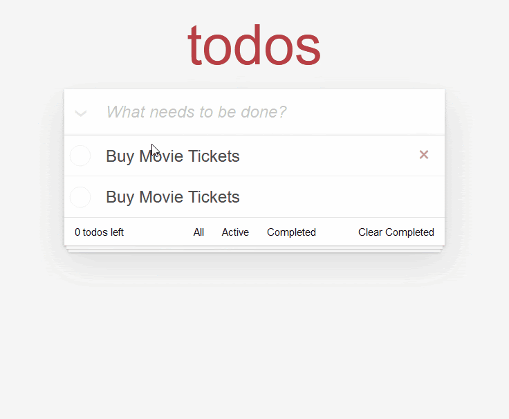

{{LearnSidebar}}
{{PreviousMenuNext("Learn/Tools_and_testing/Client-side_JavaScript_frameworks/Ember_structure_componentization","Learn/Tools_and_testing/Client-side_JavaScript_frameworks/Ember_conditional_footer", "Learn/Tools_and_testing/Client-side_JavaScript_frameworks")}}

At this point we'll start adding some interactivity to our app, providing the ability to add and display new todo items. Along the way, we'll look at using events in Ember, creating component classes to contain JavaScript code to control interactive features, and setting up a service to keep track of the data state of our app.

<table>
  <tbody>
    <tr>
      <th scope="row">Prerequisites:</th>
      <td>
        <p>
          At minimum, it is recommended that you are familiar with the core
          <a href="/en-US/docs/Learn/HTML">HTML</a>,
          <a href="/en-US/docs/Learn/CSS">CSS</a>, and
          <a href="/en-US/docs/Learn/JavaScript">JavaScript</a> languages, and
          have knowledge of the
          <a
            href="/en-US/docs/Learn/Tools_and_testing/Understanding_client-side_tools/Command_line"
            >terminal/command line</a
          >.
        </p>
        <p>
          A deeper understanding of modern JavaScript features (such as classes,
          modules, etc.), will be extremely beneficial, as Ember makes heavy use
          of them.
        </p>
      </td>
    </tr>
    <tr>
      <th scope="row">Objective:</th>
      <td>
        To learn how to create component classes and use events to control
        interactivity, and keep track of app state using a service.
      </td>
    </tr>
  </tbody>
</table>

## Adding Interactivity

Now we've got a refactored componentized version of our todo app, lets walk through how we can add the interactivity we need to make the app functional.

When beginning to think about interactivity, it's good to declare what each component's goals and responsibilities are. In the below sections we'll do this for each component, and then walk you through how the functionality can be implemented.

## Creating todos

For our card-header / todo input, we'll want to be able to submit our typed in todo task when we press the <kbd>Enter</kbd> key and have it appear in the todos list.

We want to be able to capture the text typed into the input. We do this so that our JavaScript code knows what we typed in, and we can save our todo and pass that text along to the todo list component to display.

We can capture the [`keydown`](/en-US/docs/Web/API/Document/keydown_event) event via the [on modifier](https://api.emberjs.com/ember/3.16/classes/Ember.Templates.helpers/methods/on?anchor=on), which is just Ember syntactic sugar around [`addEventListener`](/en-US/docs/Web/API/EventTarget/addEventListener) and [`removeEventListener`](/en-US/docs/Web/API/EventTarget/removeEventListener) (see [this explanation](/en-US/docs/Learn/JavaScript/Building_blocks/Events#addeventlistener_and_removeeventlistener) if needed).

Add the new line shown below to your `header.hbs` file:

```html
<input
  class='new-todo'
  aria-label='What needs to be done?'
  placeholder='What needs to be done?'
  autofocus
  \{{on 'keydown' this.onKeyDown}}
>
```

This new attribute is inside double curly braces, which tells you it is part of Ember's dynamic templating syntax. The first argument passed to `on` is the type of event to respond to (`keydown`), and the last argument is the event handler — the code that will run in response to the `keydown` event firing. As you may expect from dealing with [vanilla JavaScript objects](/en-US/docs/Learn/JavaScript/Objects/Basics#what_is_this), the `this` keyword refers to the "context" or "scope" of the component. One component's `this` will be different from another component's `this`.

We can define what is available inside `this` by generating a component class to go along with your component. This is a vanilla JavaScript class and has no special meaning to Ember, other than _extending_ from the `Component` super-class.

To create a header class to go with your header component, type this in to your terminal:

```bash
ember generate component-class header
```

This will create the following empty class file — `todomvc/app/components/header.js`:

```js
import Component from '@glimmer/component';

export default class HeaderComponent extends Component {

}
```

Inside this file we will implement the event handler code. Update the content to the following:

```js
import Component from '@glimmer/component';
import { action } from '@ember/object';

export default class HeaderComponent extends Component {

  @action
  onKeyDown({ target, key }) {
    let text = target.value.trim();
    let hasValue = Boolean(text);

    if (key === 'Enter' && hasValue) {
      alert(text);

      target.value = ''
    }
  }
}
```

The `@action` decorator is the only Ember-specific code here (aside from extending from the `Component` superclass, and the Ember-specific items we are importing using [JavaScript module syntax](/en-US/docs/Web/JavaScript/Guide/Modules)) — the rest of the file is vanilla JavaScript, and would work in any application. The `@action` decorator declares that the function is an "action", meaning it's a type of function that will be invoked from an event that occurred in the template. `@action` also binds the `this` of the function to the class instance.

> **Note:** A decorator is basically a wrapper function, which wraps and calls other functions or properties, providing additional functionality along the way. For example, the `@tracked` decorator (see slightly later on) runs code it is applied to, but additionally tracks it and automatically updates the app when values change. [Read JavaScript Decorators: What They Are and When to Use Them](https://www.sitepoint.com/javascript-decorators-what-they-are/) for more general information on decorators.

Coming back to our browser tab with the app running, we can type whatever we want, and when we hit <kbd>Enter</kbd> we'll be greeted with an alert message telling us exactly what we typed.


With the interactivity of the header input out of the way, we need a place to store todos so that other components can access them.

## Storing Todos with a service

Ember has built-in application-level **state** management that we can use to manage the storage of our todos and allow each of our components to access data from that application-level state. Ember calls these constructs [Services](https://guides.emberjs.com/release/services/), and they live for the entire lifetime of the page (a page refresh will clear them; persisting the data for longer is beyond the scope of this tutorial).

Run this terminal command to generate a service for us to store our todo-list data in:

```bash
ember generate service todo-data
```

This should give you a terminal output like so:

```
installing service
  create app/services/todo-data.js
installing service-test
  create tests/unit/services/todo-data-test.js
```

This creates a `todo-data.js` file inside the `todomvc/app/services` directory to contain our service, which initially contains an import statement and an empty class:

```js
import Service from '@ember/service';

export default class TodoDataService extends Service {

}
```

First of all, we want to define _what a todo is_. We know that we want to track both the text of a todo, and whether or not it is completed.

Add the following `import` statement below the existing one:

```js
import { tracked } from '@glimmer/tracking';
```

Now add the following class below the previous line you added:

```js
class Todo {
  @tracked text = '';
  @tracked isCompleted = false;

  constructor(text) {
    this.text = text;
  }
}
```

This class represents a todo — it contains a `@tracked` `text` property containing the text of the todo, and a `@tracked` `isCompleted` property that specifies whether the todo has been completed or not. When instantiated, a `Todo` object will have an initial `text` value equal to the text given to it when created (see below), and an `isCompleted` value of `false`. The only Ember-specific part of this class is the `@tracked` decorator — this hooks in to the reactivity system and allows Ember to update what you're seeing in your app automatically if the tracked properties change. [More information on tracked can be found here](https://api.emberjs.com/ember/3.15/functions/@glimmer%2Ftracking/tracked).

Now it's time to add to the body of the service.

First add another `import` statement below the previous one, to make actions available inside the service:

```js
import { action } from '@ember/object';
```

Update the existing `export default class TodoDataService extends Service { }` block as follows:

```js
export default class TodoDataService extends Service {
  @tracked todos = [];

  @action
  add(text) {
    let newTodo = new Todo(text);

    this.todos.pushObject(newTodo);
  }
}
```

Here, the `todos` property on the service will maintain our list of todos contained inside an array, and we'll mark it with `@tracked`, because when the value of `todos` is updated we want the UI to update as well.

And just like before, the `add()` function that will be called from the template gets annotated with the `@action` decorator to bind it to the class instance.
While this may look like familiar JavaScript, you may notice that we're calling the method [`pushObject()`](https://api.emberjs.com/ember/4.2/classes/ArrayProxy/methods/filterBy?anchor=pushObject) on our `todos` array.
This is because Ember extends JavaScript's Array prototype by default, giving us convenient methods to ensure Ember's tracking system knows about these changes.
There are dozens of these methods, including `pushObjects()`, `insertAt()`, or `popObject()`, which can be used with any type (not just Objects).
Ember's [ArrayProxy](https://api.emberjs.com/ember/4.2/classes/ArrayProxy) also gives us more handy methods, like `isAny()`, `findBy()`, and `filterBy()` to make life easier.

## Using the service from our header component

Now that we've defined a way to add todos, we can interact with this service from the `header.js` input component to actually start adding them.

First of all, the service needs to be injected into the template via the `@inject` decorator, which we'll rename to `@service` for semantic clarity. To do this, add the following `import` line to `header.js`, beneath the two existing `import` lines:

```js
import { inject as service } from '@ember/service';
```

With this import in place, we can now make the `todo-data` service available inside the `HeaderComponent` class via the `todos` object, using the `@service` decorator. Add the following line just below the opening `export…` line:

```js
@service('todo-data') todos;
```

Now the placeholder `alert(text);` line can be replaced with a call to our new `add()` function. Replace it with the following:

```js
this.todos.add(text);
```

If we try this out in the todo app in our browser (`npm start`, go to `localhost:4200`), it will look like nothing happens after hitting the <kbd>Enter</kbd> key (although the fact that the app builds without any errors is a good sign). Using the [Ember Inspector](https://guides.emberjs.com/release/ember-inspector/installation/) however, we can see that our todo was added:



## Displaying our todos

Now that we know that we can create todos, there needs to be a way to swap out our static "Buy Movie Tickets" todos with the todos we're actually creating. In the `TodoList` component, we'll want to get the todos out of the service, and render a `Todo` component for each todo.

In order to retrieve the todos from the service, our `TodoList` component first needs a backing component class to contain this functionality. Press <kbd>Ctrl</kbd> + <kbd>C</kbd> to stop the development server, and enter the following terminal command:

```bash
ember generate component-class todo-list
```

This generates the new component class `todomvc/app/components/todo-list.js`.

Populate this file with the following code, which exposes the `todo-data` service, via the `todos` property, to our template. This makes it accessible via `this.todos` inside both the class and the template:

```js
import Component from '@glimmer/component';
import { inject as service } from '@ember/service';

export default class TodoListComponent extends Component {
  @service('todo-data') todos;
}
```

One issue here is that our service is called `todos`, but the list of todos is also called `todos`, so currently we would access the data using `this.todos.todos`. This is not intuitive, so we'll add a [getter](/en-US/docs/Web/JavaScript/Reference/Functions/get) to the `todos` service called `all`, which will represent all todos.

To do this, go back to your `todo-data.js` file and add the following below the `@tracked todos = [];` line:

```js
get all() {
  return this.todos;
}
```

Now we can access the data using `this.todos.all`, which is much more intuitive. To put this in action, go to your `todo-list.hbs` component, and replace the static component calls:

```html
<Todo />
<Todo />
```

With a dynamic `#each` block (which is basically syntactic sugar over the top of JavaScript's [`forEach()`](/en-US/docs/Web/JavaScript/Reference/Global_Objects/Array/forEach)) that creates a `<Todo />` component for each todo available in the list of todos returned by the service's `all()` getter:

```html
\{{#each this.todos.all as |todo|}}
  <Todo @todo=\{{todo}} />
\{{/each}}
```

Another way to look at this:

- `this` — the rendering context / component instance.
- `todos` — a property on `this`, which we defined in the `todo-list.js` component using `@service('todo-data') todos;`. This is a reference to the `todo-data` service, allowing us to interact with the service instance directly.
- `all` — a getter on the `todo-data` service that returns all the todos.

Try starting the server again and navigating to our app, and you'll find that it works! Well, sort of. Whenever you enter a new Todo item, a new list item appears below the text input, but unfortunately it always says "Buy Movie Tickets".

This is because the text label inside each list item is hardcoded to that text, as seen in `todo.hbs`:

```html
<label>Buy Movie Tickets</label>
```

Update this line to use the Argument `@todo` — which will represent the Todo that we passed in to this component when it was invoked in `todo-list.hbs`, in the line `<Todo @todo=\{{todo}} />`:

```html
<label>\{{@todo.text}}</label>
```

OK, try it again. You should find that now the text submitted in the `<input>` is properly reflected in the UI:


## Summary

OK, so that's great progress for now. We can now add todo items to our app, and the state of the data is tracked using our service. Next we'll move on to getting our footer functionality working, including the todo counter, and look at conditional rendering, including correctly styling todos when they've been checked. We'll also wire up our "Clear completed" button.

{{PreviousMenuNext("Learn/Tools_and_testing/Client-side_JavaScript_frameworks/Ember_structure_componentization","Learn/Tools_and_testing/Client-side_JavaScript_frameworks/Ember_conditional_footer", "Learn/Tools_and_testing/Client-side_JavaScript_frameworks")}}

## In this module

- [Introduction to client-side frameworks](/en-US/docs/Learn/Tools_and_testing/Client-side_JavaScript_frameworks/Introduction)
- [Framework main features](/en-US/docs/Learn/Tools_and_testing/Client-side_JavaScript_frameworks/Main_features)
- React

  - [Getting started with React](/en-US/docs/Learn/Tools_and_testing/Client-side_JavaScript_frameworks/React_getting_started)
  - [Beginning our React todo list](/en-US/docs/Learn/Tools_and_testing/Client-side_JavaScript_frameworks/React_todo_list_beginning)
  - [Componentizing our React app](/en-US/docs/Learn/Tools_and_testing/Client-side_JavaScript_frameworks/React_components)
  - [React interactivity: Events and state](/en-US/docs/Learn/Tools_and_testing/Client-side_JavaScript_frameworks/React_interactivity_events_state)
  - [React interactivity: Editing, filtering, conditional rendering](/en-US/docs/Learn/Tools_and_testing/Client-side_JavaScript_frameworks/React_interactivity_filtering_conditional_rendering)
  - [Accessibility in React](/en-US/docs/Learn/Tools_and_testing/Client-side_JavaScript_frameworks/React_accessibility)
  - [React resources](/en-US/docs/Learn/Tools_and_testing/Client-side_JavaScript_frameworks/React_resources)

- Ember

  - [Getting started with Ember](/en-US/docs/Learn/Tools_and_testing/Client-side_JavaScript_frameworks/Ember_getting_started)
  - [Ember app structure and componentization](/en-US/docs/Learn/Tools_and_testing/Client-side_JavaScript_frameworks/Ember_structure_componentization)
  - [Ember interactivity: Events, classes and state](/en-US/docs/Learn/Tools_and_testing/Client-side_JavaScript_frameworks/Ember_interactivity_events_state)
  - [Ember Interactivity: Footer functionality, conditional rendering](/en-US/docs/Learn/Tools_and_testing/Client-side_JavaScript_frameworks/Ember_conditional_footer)
  - [Routing in Ember](/en-US/docs/Learn/Tools_and_testing/Client-side_JavaScript_frameworks/Ember_routing)
  - [Ember resources and troubleshooting](/en-US/docs/Learn/Tools_and_testing/Client-side_JavaScript_frameworks/Ember_resources)

- Vue

  - [Getting started with Vue](/en-US/docs/Learn/Tools_and_testing/Client-side_JavaScript_frameworks/Vue_getting_started)
  - [Creating our first Vue component](/en-US/docs/Learn/Tools_and_testing/Client-side_JavaScript_frameworks/Vue_first_component)
  - [Rendering a list of Vue components](/en-US/docs/Learn/Tools_and_testing/Client-side_JavaScript_frameworks/Vue_rendering_lists)
  - [Adding a new todo form: Vue events, methods, and models](/en-US/docs/Learn/Tools_and_testing/Client-side_JavaScript_frameworks/Vue_methods_events_models)
  - [Styling Vue components with CSS](/en-US/docs/Learn/Tools_and_testing/Client-side_JavaScript_frameworks/Vue_styling)
  - [Using Vue computed properties](/en-US/docs/Learn/Tools_and_testing/Client-side_JavaScript_frameworks/Vue_computed_properties)
  - [Vue conditional rendering: editing existing todos](/en-US/docs/Learn/Tools_and_testing/Client-side_JavaScript_frameworks/Vue_conditional_rendering)
  - [Focus management with Vue refs](/en-US/docs/Learn/Tools_and_testing/Client-side_JavaScript_frameworks/Vue_refs_focus_management)
  - [Vue resources](/en-US/docs/Learn/Tools_and_testing/Client-side_JavaScript_frameworks/Vue_resources)

- Svelte

  - [Getting started with Svelte](/en-US/docs/Learn/Tools_and_testing/Client-side_JavaScript_frameworks/Svelte_getting_started)
  - [Starting our Svelte Todo list app](/en-US/docs/Learn/Tools_and_testing/Client-side_JavaScript_frameworks/Svelte_Todo_list_beginning)
  - [Dynamic behavior in Svelte: working with variables and props](/en-US/docs/Learn/Tools_and_testing/Client-side_JavaScript_frameworks/Svelte_variables_props)
  - [Componentizing our Svelte app](/en-US/docs/Learn/Tools_and_testing/Client-side_JavaScript_frameworks/Svelte_components)
  - [Advanced Svelte: Reactivity, lifecycle, accessibility](/en-US/docs/Learn/Tools_and_testing/Client-side_JavaScript_frameworks/Svelte_reactivity_lifecycle_accessibility)
  - [Working with Svelte stores](/en-US/docs/Learn/Tools_and_testing/Client-side_JavaScript_frameworks/Svelte_stores)
  - [TypeScript support in Svelte](/en-US/docs/Learn/Tools_and_testing/Client-side_JavaScript_frameworks/Svelte_TypeScript)
  - [Deployment and next steps](/en-US/docs/Learn/Tools_and_testing/Client-side_JavaScript_frameworks/Svelte_deployment_next)

- Angular

  - [Getting started with Angular](/en-US/docs/Learn/Tools_and_testing/Client-side_JavaScript_frameworks/Angular_getting_started)
  - [Beginning our Angular todo list app](/en-US/docs/Learn/Tools_and_testing/Client-side_JavaScript_frameworks/Angular_todo_list_beginning)
  - [Styling our Angular app](/en-US/docs/Learn/Tools_and_testing/Client-side_JavaScript_frameworks/Angular_styling)
  - [Creating an item component](/en-US/docs/Learn/Tools_and_testing/Client-side_JavaScript_frameworks/Angular_item_component)
  - [Filtering our to-do items](/en-US/docs/Learn/Tools_and_testing/Client-side_JavaScript_frameworks/Angular_filtering)
  - [Building Angular applications and further resources](/en-US/docs/Learn/Tools_and_testing/Client-side_JavaScript_frameworks/Angular_building)
