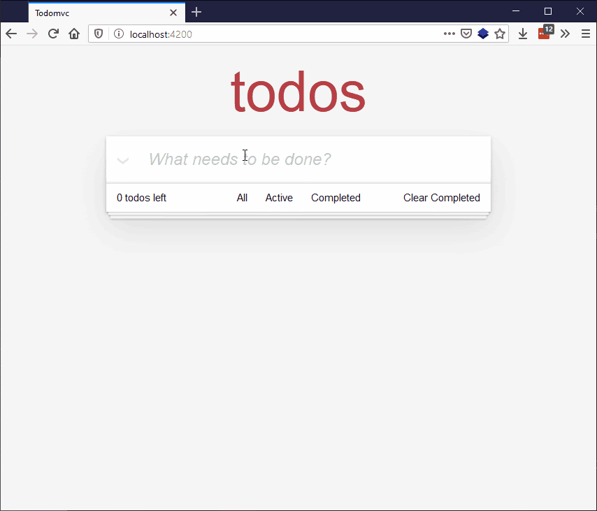

{{LearnSidebar}}
{{PreviousMenuNext("Learn/Tools_and_testing/Client-side_JavaScript_frameworks/Ember_conditional_footer","Learn/Tools_and_testing/Client-side_JavaScript_frameworks/Ember_resources", "Learn/Tools_and_testing/Client-side_JavaScript_frameworks")}}

In this article we learn about **routing**, or URL-based filtering as it is sometimes referred to. We'll use it to provide a unique URL for each of the three todo views — "All", "Active", and "Completed".

<table>
  <tbody>
    <tr>
      <th scope="row">Prerequisites:</th>
      <td>
        <p>
          At minimum, it is recommended that you are familiar with the core
          <a href="/en-US/docs/Learn/HTML">HTML</a>,
          <a href="/en-US/docs/Learn/CSS">CSS</a>, and
          <a href="/en-US/docs/Learn/JavaScript">JavaScript</a> languages, and
          have knowledge of the
          <a
            href="/en-US/docs/Learn/Tools_and_testing/Understanding_client-side_tools/Command_line"
            >terminal/command line</a
          >.
        </p>
        <p>
          A deeper understanding of modern JavaScript features (such as classes,
          modules, etc.), will be extremely beneficial, as Ember makes heavy use
          of them.
        </p>
      </td>
    </tr>
    <tr>
      <th scope="row">Objective:</th>
      <td>To learn about implementing routing in Ember.</td>
    </tr>
  </tbody>
</table>

## URL-based filtering

Ember comes with a routing system that has a tight integration with the browser URL. Typically, when writing web applications, you want the page to be represented by the URL so that if (for any reason), the page needs to refresh, the user isn't surprised by the state of the web app — they can link directly to significant views of the app.

At the moment, we already have the "All" page, as we are currently not doing any filtering in the page that we've been working with, but we will need to reorganize it a bit to handle a different view for the "Active" and "Completed" todos.

An Ember application has a default "application" route, which is tied to the `app/templates/application.hbs` template. Because that application template is the entry point to our todo app, we'll need to make some changes to allow for routing.

## Creating the routes

Let's start by creating three new routes: "Index", "Active" and "Completed". To do this you'll need to enter the following commands into your terminal, inside the root directory of your app:

```bash
ember generate route index
ember generate route completed
ember generate route active
```

The second and third commands should have not only generated new files, but also updated an existing file, `app/router.js`. It contains the following contents:

```js
import EmberRouter from '@ember/routing/router';
import config from './config/environment';

export default class Router extends EmberRouter {
  location = config.locationType;
  rootURL = config.rootURL;
}

Router.map(function() {
  this.route('completed');
  this.route('active');
});
```

The highlighted lines were added when the 2nd and 3rd commands above were run.

`router.js` behaves as a "sitemap" for developers to be able to quickly see how the entire app is structured.  It also tells Ember how to interact with your route, such as when loading arbitrary data, handling errors while loading that data, or interpreting dynamic segments of the URL. Since our data is static, we won't get to any of those fancy features, but we'll still make sure that the route provides the minimally required data to view a page.

Creating the "Index" route did not add a route definition line to `router.js`, because like with URL navigation and JavaScript module loading, "Index" is a special word that indicates the default route to render, load, etc.

To adjust our old way of rendering the TodoList app, we'll first need to replace the TodoList component invocation from the application template with an `\{{outlet}}` call, which means "any sub-route will be rendered in place here".

Go to the `todomvc/app/templates/application.hbs` file and replace

```hbs
<TodoList />
```

With

```hbs
\{{outlet}}
```

Next, in our `index.hbs`, `completed.hbs`, and `active.hbs` templates (also found in the templates directory) we can for now just enter the TodoList component invocation.

In each case, replace

```hbs
\{{outlet}}
```

with

```hbs
<TodoList />
```

So at this point, if you try the app again and visit any of the three routes

`localhost:4200 localhost:4200/active localhost:4200/completed`

you'll see exactly the same thing. At each URL, the template that corresponds to the specific path ("Active", "Completed", or "Index"), will render the `<TodoList />` component. The location in the page where `<TodoList />` is rendered is determined by the `\{{ outlet }}` inside the parent route, which in this case is `application.hbs`. So we have our routes in place. Great!

But now we need a way to differentiate between each of these routes, so that they show what they are supposed to show.

First of all, return once more to our `todo-data.js` file. It already contains a getter that returns all todos, and a getter that returns incomplete todos. The getter we are missing is one to return just the completed todos. Add the following below the existing getters:

```js
get completed() {
  return this.todos.filter((todo) => todo.isCompleted);
}
```

## Models

Now we need to add models to our route JavaScript files to allow us to easily return specific data sets to display in those models. `model` is a data loading lifecycle hook. For TodoMVC, the capabilities of model aren't that important to us; you can find more information in the [Ember model guide](https://guides.emberjs.com/release/routing/specifying-a-routes-model/) if you want to dig deeper. We also provide access to the service, like we did for the components.

### The index route model

First of all, update `todomvc/app/routes/index.js` so it looks as follows:

```js
import Route from '@ember/routing/route';
import { inject as service } from '@ember/service';

export default class IndexRoute extends Route {
  @service('todo-data') todos;

  model() {
    let todos = this.todos;

    return {
      get allTodos() {
        return todos.all;
      }
    }
  }
}
```

We can now update the `todomvc/app/templates/index.hbs` file so that when it includes the `<TodoList />` component, it does so explicitly with the available model, calling its `allTodos()` getter to make sure all of the todos are shown.

In this file, change

```hbs
<TodoList />
```

To

```hbs
<TodoList @todos=\{{ @model.allTodos }}/>
```

### The completed route model

Now update `todomvc/app/routes/completed.js` so it looks as follows:

```js
import Route from '@ember/routing/route';
import { inject as service } from '@ember/service';

export default class CompletedRoute extends Route {
  @service('todo-data') todos;

  model() {
    let todos = this.todos;

    return {
      get completedTodos() {
        return todos.completed;
      }
    }
  }
}
```

We can now update the `todomvc/app/templates/completed.hbs` file so that when it includes the `<TodoList />` component, it does so explicitly with the available model, calling its `completedTodos()` getter to make sure only the completed todos are shown.

In this file, change

```hbs
<TodoList />
```

To

```hbs
<TodoList @todos=\{{ @model.completedTodos }}/>
```

### The active route model

Finally for the routes, let's sort out our active route. Start by updating `todomvc/app/routes/active.js` so it looks as follows:

```js
import Route from '@ember/routing/route';
import { inject as service } from '@ember/service';

export default class ActiveRoute extends Route {
  @service('todo-data') todos;

  model() {
    let todos = this.todos;

    return {
      get activeTodos() {
        return todos.incomplete;
      }
    }
  }
}
```

We can now update the `todomvc/app/templates/active.hbs` file so that when it includes the `<TodoList />` component, it does so explicitly with the available model, calling its `activeTodos()` getter to make sure only the active (incomplete) todos are shown.

In this file, change

```html
<TodoList />
```

To

```html
<TodoList @todos=\{{ @model.activeTodos }}/>
```

Note that, in each of the route model hooks, we are returning an object with a getter instead of a static object, or more just the static list of todos (for example, `this.todos.completed`). The reason for this is that we want the template to have a dynamic reference to the todo list, and if we returned the list directly, the data would never re-compute, which would result in the navigations appearing to fail / not actually filter. By having a getter defined in the return object from the model data, the todos are re-looked-up so that our changes to the todo list are represented in the rendered list.

## Getting the footer links working

So our route functionality is now all in place, but we can't access them from our app. Let's get the footer links active so that clicking on them goes to the desired routes.

Go back to `todomvc/app/components/footer.hbs`, and find the following bit of markup:

```html
<a href="#">All</a>
<a href="#">Active</a>
<a href="#">Completed</a>
```

Update it to

```html
<LinkTo @route='index'>All</LinkTo>
<LinkTo @route='active'>Active</LinkTo>
<LinkTo @route='completed'>Completed</LinkTo>
```

`<LinkTo>` is a built-in Ember component that handles all the state changes when navigating routes, as well as setting an "active" class on any link that matches the URL, in case there is a desire to style it differently from inactive links.

## Updating the todos display inside TodoList

One small final thing that we need to fix is that previously, inside `todomvc/app/components/todo-list.hbs`, we were accessing the todo-data service directly and looping over all todos, as shown here:

```hbs
\{{#each this.todos.all as |todo| }}
```

Since we now want to have our TodoList component show a filtered list, we'll want to pass an argument to the TodoList component representing the "current list of todos", as shown here:

```hbs
\{{#each @todos as |todo| }}
```

And that's it for this tutorial! Your app should now have fully working links in the footer that display the "Index"/default, "Active", and "Completed" routes.



## Summary

Congratulations! You've finished this tutorial!

There is a lot more to be implemented before what we've covered here has parity with the original [TodoMVC app](https://todomvc.com), such as editing, deleting, and persisting todos across page reloads.

To see our finished Ember implementation, checkout the finished app folder in the repository for [the code of this tutorial](https://github.com/NullVoxPopuli/ember-todomvc-tutorial/tree/master/steps/00-finished-todomvc/todomvc) or see the [live deployed version](https://nullvoxpopuli.github.io/ember-todomvc-tutorial/) here. Study the code to learn more about Ember, and also check out the next article, which provides links to more resources and some troubleshooting advice.

{{PreviousMenuNext("Learn/Tools_and_testing/Client-side_JavaScript_frameworks/Ember_conditional_footer","Learn/Tools_and_testing/Client-side_JavaScript_frameworks/Ember_resources", "Learn/Tools_and_testing/Client-side_JavaScript_frameworks")}}

## In this module

- [Introduction to client-side frameworks](/en-US/docs/Learn/Tools_and_testing/Client-side_JavaScript_frameworks/Introduction)
- [Framework main features](/en-US/docs/Learn/Tools_and_testing/Client-side_JavaScript_frameworks/Main_features)
- React

  - [Getting started with React](/en-US/docs/Learn/Tools_and_testing/Client-side_JavaScript_frameworks/React_getting_started)
  - [Beginning our React todo list](/en-US/docs/Learn/Tools_and_testing/Client-side_JavaScript_frameworks/React_todo_list_beginning)
  - [Componentizing our React app](/en-US/docs/Learn/Tools_and_testing/Client-side_JavaScript_frameworks/React_components)
  - [React interactivity: Events and state](/en-US/docs/Learn/Tools_and_testing/Client-side_JavaScript_frameworks/React_interactivity_events_state)
  - [React interactivity: Editing, filtering, conditional rendering](/en-US/docs/Learn/Tools_and_testing/Client-side_JavaScript_frameworks/React_interactivity_filtering_conditional_rendering)
  - [Accessibility in React](/en-US/docs/Learn/Tools_and_testing/Client-side_JavaScript_frameworks/React_accessibility)
  - [React resources](/en-US/docs/Learn/Tools_and_testing/Client-side_JavaScript_frameworks/React_resources)

- Ember

  - [Getting started with Ember](/en-US/docs/Learn/Tools_and_testing/Client-side_JavaScript_frameworks/Ember_getting_started)
  - [Ember app structure and componentization](/en-US/docs/Learn/Tools_and_testing/Client-side_JavaScript_frameworks/Ember_structure_componentization)
  - [Ember interactivity: Events, classes and state](/en-US/docs/Learn/Tools_and_testing/Client-side_JavaScript_frameworks/Ember_interactivity_events_state)
  - [Ember Interactivity: Footer functionality, conditional rendering](/en-US/docs/Learn/Tools_and_testing/Client-side_JavaScript_frameworks/Ember_conditional_footer)
  - [Routing in Ember](/en-US/docs/Learn/Tools_and_testing/Client-side_JavaScript_frameworks/Ember_routing)
  - [Ember resources and troubleshooting](/en-US/docs/Learn/Tools_and_testing/Client-side_JavaScript_frameworks/Ember_resources)

- Vue

  - [Getting started with Vue](/en-US/docs/Learn/Tools_and_testing/Client-side_JavaScript_frameworks/Vue_getting_started)
  - [Creating our first Vue component](/en-US/docs/Learn/Tools_and_testing/Client-side_JavaScript_frameworks/Vue_first_component)
  - [Rendering a list of Vue components](/en-US/docs/Learn/Tools_and_testing/Client-side_JavaScript_frameworks/Vue_rendering_lists)
  - [Adding a new todo form: Vue events, methods, and models](/en-US/docs/Learn/Tools_and_testing/Client-side_JavaScript_frameworks/Vue_methods_events_models)
  - [Styling Vue components with CSS](/en-US/docs/Learn/Tools_and_testing/Client-side_JavaScript_frameworks/Vue_styling)
  - [Using Vue computed properties](/en-US/docs/Learn/Tools_and_testing/Client-side_JavaScript_frameworks/Vue_computed_properties)
  - [Vue conditional rendering: editing existing todos](/en-US/docs/Learn/Tools_and_testing/Client-side_JavaScript_frameworks/Vue_conditional_rendering)
  - [Focus management with Vue refs](/en-US/docs/Learn/Tools_and_testing/Client-side_JavaScript_frameworks/Vue_refs_focus_management)
  - [Vue resources](/en-US/docs/Learn/Tools_and_testing/Client-side_JavaScript_frameworks/Vue_resources)

- Svelte

  - [Getting started with Svelte](/en-US/docs/Learn/Tools_and_testing/Client-side_JavaScript_frameworks/Svelte_getting_started)
  - [Starting our Svelte Todo list app](/en-US/docs/Learn/Tools_and_testing/Client-side_JavaScript_frameworks/Svelte_Todo_list_beginning)
  - [Dynamic behavior in Svelte: working with variables and props](/en-US/docs/Learn/Tools_and_testing/Client-side_JavaScript_frameworks/Svelte_variables_props)
  - [Componentizing our Svelte app](/en-US/docs/Learn/Tools_and_testing/Client-side_JavaScript_frameworks/Svelte_components)
  - [Advanced Svelte: Reactivity, lifecycle, accessibility](/en-US/docs/Learn/Tools_and_testing/Client-side_JavaScript_frameworks/Svelte_reactivity_lifecycle_accessibility)
  - [Working with Svelte stores](/en-US/docs/Learn/Tools_and_testing/Client-side_JavaScript_frameworks/Svelte_stores)
  - [TypeScript support in Svelte](/en-US/docs/Learn/Tools_and_testing/Client-side_JavaScript_frameworks/Svelte_TypeScript)
  - [Deployment and next steps](/en-US/docs/Learn/Tools_and_testing/Client-side_JavaScript_frameworks/Svelte_deployment_next)

- Angular

  - [Getting started with Angular](/en-US/docs/Learn/Tools_and_testing/Client-side_JavaScript_frameworks/Angular_getting_started)
  - [Beginning our Angular todo list app](/en-US/docs/Learn/Tools_and_testing/Client-side_JavaScript_frameworks/Angular_todo_list_beginning)
  - [Styling our Angular app](/en-US/docs/Learn/Tools_and_testing/Client-side_JavaScript_frameworks/Angular_styling)
  - [Creating an item component](/en-US/docs/Learn/Tools_and_testing/Client-side_JavaScript_frameworks/Angular_item_component)
  - [Filtering our to-do items](/en-US/docs/Learn/Tools_and_testing/Client-side_JavaScript_frameworks/Angular_filtering)
  - [Building Angular applications and further resources](/en-US/docs/Learn/Tools_and_testing/Client-side_JavaScript_frameworks/Angular_building)
