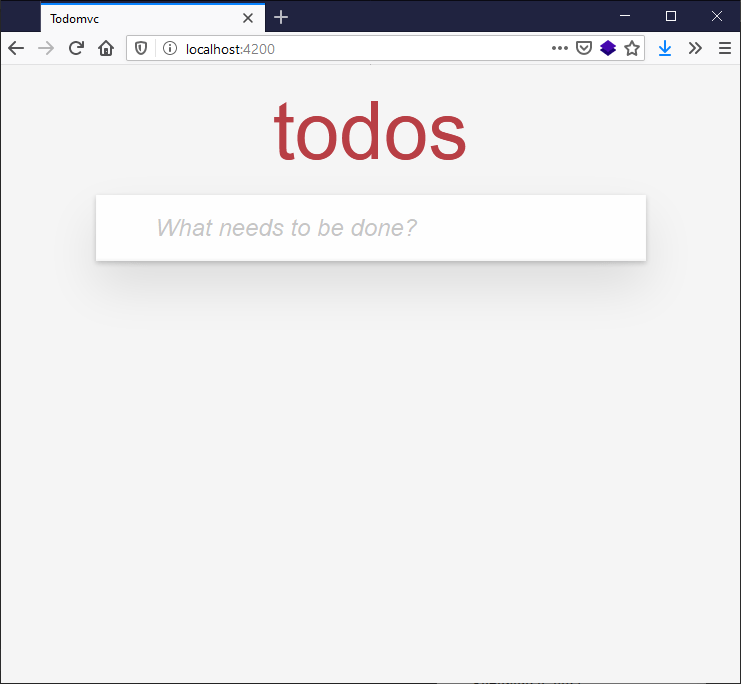
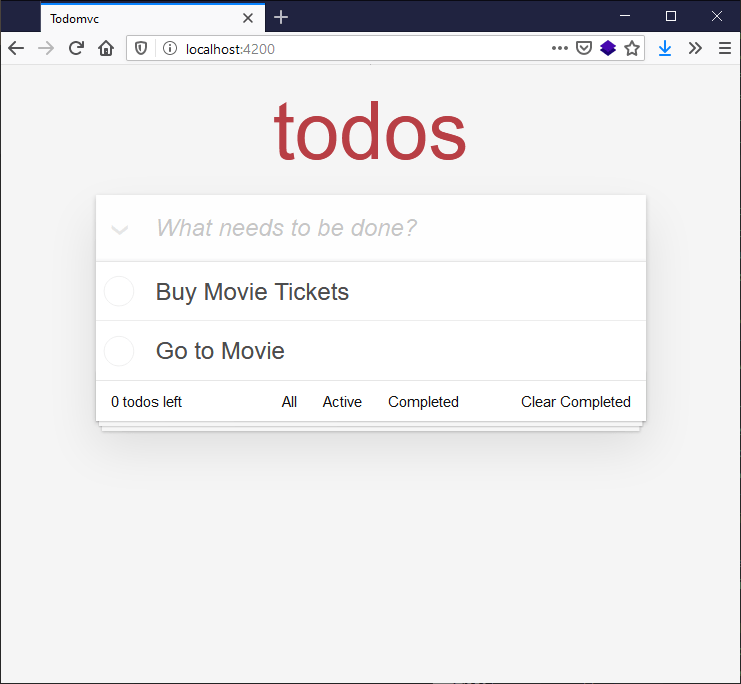
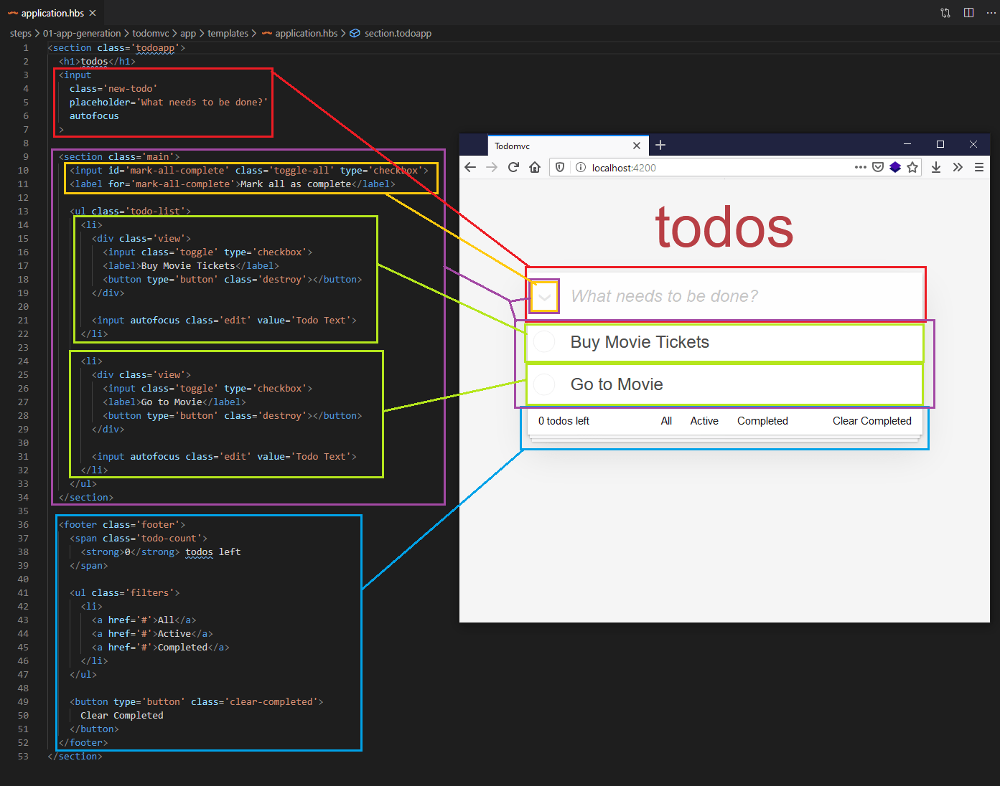
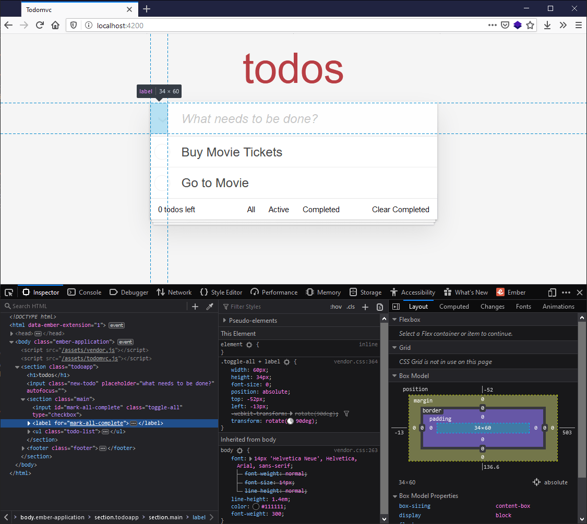
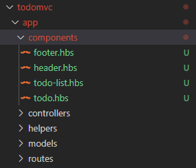
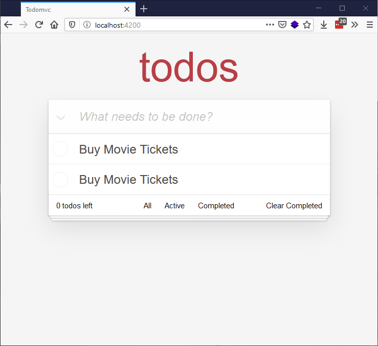

{{LearnSidebar}}
{{PreviousMenuNext("Learn/Tools_and_testing/Client-side_JavaScript_frameworks/Ember_getting_started","Learn/Tools_and_testing/Client-side_JavaScript_frameworks/Ember_interactivity_events_state", "Learn/Tools_and_testing/Client-side_JavaScript_frameworks")}}

In this article we'll get right on with planning out the structure of our TodoMVC Ember app, adding in the HTML for it, and then breaking that HTML structure into components.

<table>
  <tbody>
    <tr>
      <th scope="row">Prerequisites:</th>
      <td>
        <p>
          At minimum, it is recommended that you are familiar with the core
          <a href="/en-US/docs/Learn/HTML">HTML</a>,
          <a href="/en-US/docs/Learn/CSS">CSS</a>, and
          <a href="/en-US/docs/Learn/JavaScript">JavaScript</a> languages, and
          have knowledge of the
          <a
            href="/en-US/docs/Learn/Tools_and_testing/Understanding_client-side_tools/Command_line"
            >terminal/command line</a
          >.
        </p>
        <p>
          A deeper understanding of modern JavaScript features (such as classes,
          modules, etc.), will be extremely beneficial, as Ember makes heavy use
          of them.
        </p>
      </td>
    </tr>
    <tr>
      <th scope="row">Objective:</th>
      <td>
        To learn how to structure an Ember app, and then break that structure
        into components.
      </td>
    </tr>
  </tbody>
</table>

## Planning out the layout of the TodoMVC app

In the last article we set up a new Ember project, then added and configured our CSS styles. At this point we add some HTML, planning out the structure and semantics of our TodoMVC app.

The landing page HTML of our application is defined in `app/templates/application.hbs`. This already exists, and its contents currently look like so:

```hbs
\{{!-- The following component displays Ember's default welcome message. --}}
<WelcomePage />
\{{!-- Feel free to remove this! --}}

\{{outlet}}
```

`<WelcomePage />` is a component provided by an Ember addon that renders the default welcome page we saw in the previous article, when we first navigated to our server at `localhost:4200`.

However, we don't want this. Instead, we want it to contain the TodoMVC app structure. To start with, delete the contents of `application.hbs` and replace them with the following:

```html
<section class="todoapp">
  <h1>todos</h1>
  <input
    class="new-todo"
    aria-label="What needs to be done?"
    placeholder="What needs to be done?"
    autofocus />
</section>
```

> [!NOTE] > [`aria-label`](/en-US/docs/Web/Accessibility/ARIA/Attributes/aria-label) provides a label for assistive technology to make use of — for example, for a screen reader to read out. This is useful in such cases where we have an [`<input>`](/en-US/docs/Web/HTML/Element/input) being used with no corresponding HTML text that could be turned into a label.

When you save `application.hbs`, the development server you started earlier will automatically rebuild the app and refresh the browser. The rendered output should now look like this:



It doesn't take too much effort to get our HTML looking like a fully-featured to-do list app. Update the `application.hbs` file again so its content looks like this:

```html
<section class="todoapp">
  <h1>todos</h1>
  <input
    class="new-todo"
    aria-label="What needs to be done?"
    placeholder="What needs to be done?"
    autofocus />

  <section class="main">
    <input id="mark-all-complete" class="toggle-all" type="checkbox" />
    <label for="mark-all-complete">Mark all as complete</label>

    <ul class="todo-list">
      <li>
        <div class="view">
          <input
            aria-label="Toggle the completion of this todo"
            class="toggle"
            type="checkbox" />
          <label>Buy Movie Tickets</label>
          <button
            type="button"
            class="destroy"
            title="Remove this todo"></button>
        </div>

        <input autofocus class="edit" value="Todo Text" />
      </li>

      <li>
        <div class="view">
          <input
            aria-label="Toggle the completion of this todo"
            class="toggle"
            type="checkbox" />
          <label>Go to Movie</label>
          <button
            type="button"
            class="destroy"
            title="Remove this todo"></button>
        </div>

        <input autofocus class="edit" value="Todo Text" />
      </li>
    </ul>
  </section>

  <footer class="footer">
    <span class="todo-count"> <strong>0</strong> todos left </span>

    <ul class="filters">
      <li>
        <a href="#">All</a>
        <a href="#">Active</a>
        <a href="#">Completed</a>
      </li>
    </ul>

    <button type="button" class="clear-completed">Clear Completed</button>
  </footer>
</section>
```

The rendered output should now be as follows:



This looks pretty complete, but remember that this is only a static prototype. Now we need to break up our HTML code into dynamic components; later we'll turn it into a fully interactive app.

Looking at the code next to the rendered todo app, there are a number of ways we could decide how to break up the UI, but let's plan on splitting the HTML out into the following components:



The component groupings are as follows:

- The main input / "new-todo" (red in the image)
- The containing body of the todo list + the `mark-all-complete` button (purple in the image)

  - The `mark-all-complete button`, explicitly highlighted for reasons given below (yellow in the image)
  - Each todo is an individual component (green in the image)

- The footer (blue in the image)

Something odd to note is that the `mark-all-complete` checkbox (marked in yellow), while in the "main" section, is rendered next to the "new-todo" input. This is because the default CSS absolutely positions the checkbox + label with negative top and left values to move it next to the input, rather than it being inside the "main" section.



## Using the CLI to create our components for us

So to represent our app, we want to create 4 components:

- Header
- List
- Individual Todo
- Footer

To create a component, we use the `ember generate component` command, followed by the name of the component. Let's create the header component first. To do so:

1. Stop the server running by going to the terminal and pressing <kbd>Ctrl</kbd> + <kbd>C</kbd>.
2. Enter the following command into your terminal:

   ```bash
   ember generate component header
   ```

   These will generate some new files, as shown in the resulting terminal output:

   ```plain
   installing component
     create app/components/header.hbs
     skip app/components/header.js
     tip to add a class, run `ember generate component-class header`
   installing component-test
     create tests/integration/components/header-test.js
   ```

`header.hbs` is the template file where we'll include the HTML structure for just that component. Later on we'll add the required dynamic functionality such as data bindings, responding to user interaction, etc.

> [!NOTE]
> The `header.js` file (shown as skipped) is for connection to a backing Glimmer Component Class, which we don't need for now, as they are for adding interactivity and state manipulation. By default, `generate component` generates template-only components, because in large applications, template-only components end up being the majority of the components.

`header-test.js` is for writing automated tests to ensure that our app continues to work over time as we upgrade, add features, refactor, etc. Testing is outside the scope of this tutorial, although generally testing should be implemented as you develop, rather than after, otherwise it tends to be forgotten about. If you're curious about testing, or why you would want to have automated tests, check out the [official Ember tutorial on testing](https://guides.emberjs.com/release/tutorial/part-1/automated-testing/).

Before we start adding any component code, let's create the scaffolding for the other components. Enter the following lines into your terminal, one by one:

```bash
ember generate component todo-list
ember generate component todo
ember generate component footer
```

You'll now see the following inside your `todomvc/app/components` directory:



Now that we have all of our component structure files, we can cut and paste the HTML for each component out of the `application.hbs` file and into each of those components, and then re-write the `application.hbs` to reflect our new abstractions.

1. The `header.hbs` file should be updated to contain the following:

   ```html
   <input
     class="new-todo"
     aria-label="What needs to be done?"
     placeholder="What needs to be done?"
     autofocus />
   ```

2. `todo-list.hbs` should be updated to contain this chunk of code:

   ```html
   <section class="main">
     <input id="mark-all-complete" class="toggle-all" type="checkbox" />
     <label for="mark-all-complete">Mark all as complete</label>

     <ul class="todo-list">
       <Todo />
       <Todo />
     </ul>
   </section>
   ```

   > **Note:** The only non-HTML in this new `todo-list.hbs` is the `<Todo />` component invocation. In Ember, a component invocation is similar to declaring an HTML element, but the first letter starts with a capital letter, and the names are written in {{Glossary("camel_case", "upper camel case")}}, as you'll see with `<TodoList />` later on. The contents of the `todo.hbs` file below will replace `<Todo />` in the rendered page as our application loads.

3. Add the following into the `todo.hbs` file:

   ```html
   <li>
     <div class="view">
       <input
         aria-label="Toggle the completion of this todo"
         class="toggle"
         type="checkbox" />
       <label>Buy Movie Tickets</label>
       <button type="button" class="destroy" title="Remove this todo"></button>
     </div>

     <input autofocus class="edit" value="Todo Text" />
   </li>
   ```

4. `footer.hbs` should be updated to contain the following:

   ```html
   <footer class="footer">
     <span class="todo-count"> <strong>0</strong> todos left </span>

     <ul class="filters">
       <li>
         <a href="#">All</a>
         <a href="#">Active</a>
         <a href="#">Completed</a>
       </li>
     </ul>

     <button type="button" class="clear-completed">Clear Completed</button>
   </footer>
   ```

5. Finally, the contents of `application.hbs` should be updated so that they call the appropriate components, like so:

   ```hbs
   <section class="todoapp">
     <h1>todos</h1>

     <Header />
     <TodoList />
     <Footer />
   </section>
   ```

6. With these changes made, run `npm start` in your terminal again, then head over to `http://localhost:4200` to ensure that the todo app still looks as it did before the refactor.



Notice how the todo items both say "Buy Movie Tickets" — this is because the same component is being invoked twice, and the todo text is hardcoded into it. We'll look at showing different todo items in the next article!

## Summary

Great! Everything looks as it should. We have successfully refactored our HTML into components! In the next article we'll start looking into adding interactivity to our Ember application.

{{PreviousMenuNext("Learn/Tools_and_testing/Client-side_JavaScript_frameworks/Ember_getting_started","Learn/Tools_and_testing/Client-side_JavaScript_frameworks/Ember_interactivity_events_state", "Learn/Tools_and_testing/Client-side_JavaScript_frameworks")}}
