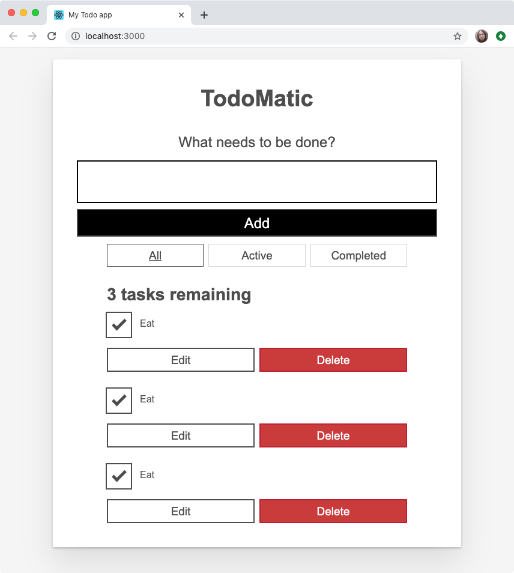
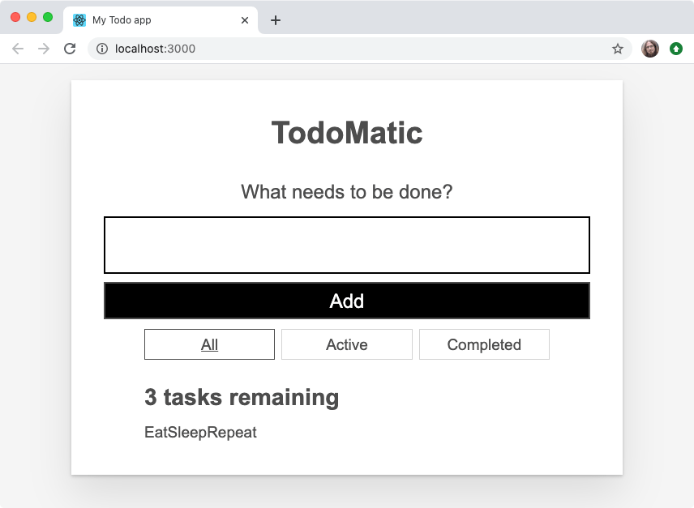

{{LearnSidebar}}{{PreviousMenuNext("Learn/Tools_and_testing/Client-side_JavaScript_frameworks/React_todo_list_beginning","Learn/Tools_and_testing/Client-side_JavaScript_frameworks/React_interactivity_events_state", "Learn/Tools_and_testing/Client-side_JavaScript_frameworks")}}

At this point, our app is a monolith. Before we can make it do things, we need to break it apart into manageable, descriptive components. React doesn't have any hard rules for what is and isn't a component – that's up to you! In this article we will show you a sensible way to break our app up into components.

<table>
  <tbody>
    <tr>
      <th scope="row">Prerequisites:</th>
      <td>
        <p>
          Familiarity with the core <a href="/en-US/docs/Learn/HTML">HTML</a>,
          <a href="/en-US/docs/Learn/CSS">CSS</a>, and
          <a href="/en-US/docs/Learn/JavaScript">JavaScript</a> languages,
          knowledge of the
          <a
            href="/en-US/docs/Learn/Tools_and_testing/Understanding_client-side_tools/Command_line"
            >terminal/command line</a
          >.
        </p>
      </td>
    </tr>
    <tr>
      <th scope="row">Objective:</th>
      <td>
        To show a sensible way of breaking our todo list app into components.
      </td>
    </tr>
  </tbody>
</table>

## Defining our first component

Defining a component can seem tricky until you have some practice, but the gist is:

- If it represents an obvious "chunk" of your app, it's probably a component
- If it gets reused often, it's probably a component.

That second bullet is especially valuable: making a component out of common UI elements allows you to change your code in one place and see those changes everywhere that component is used. You don't have to break everything out into components right away, either. Let's take the second bullet point as inspiration and make a component out of the most reused, most important piece of the UI: a todo list item.

## Make a `<Todo />`

Before we can make a component, we should create a new file for it. In fact, we should make a directory just for our components. The following commands make a `components` directory and then, within that, a file called `Todo.js`. Make sure you're in the root of your app before you run these!

```bash
mkdir src/components
touch src/components/Todo.js
```

Our new `Todo.js` file is currently empty! Open it up and give it its first line:

```jsx
import React from "react";
```

Since we're going to make a component called `Todo`, you can start adding the code for that to `Todo.js` too, as follows. In this code, we define the function and export it:

```jsx
function Todo() {
  return (
    // …
  );
}

export default Todo;
```

This is OK so far, but our component has to return something! Go back to `src/App.js`, copy the first [`<li>`](/en-US/docs/Web/HTML/Element/li) from inside the unordered list, and paste it into `Todo.js` so that it reads like this:

```jsx
export default function Todo() {
  return (
    <li className="todo stack-small">
      <div className="c-cb">
        <input id="todo-0" type="checkbox" defaultChecked={true} />
        <label className="todo-label" htmlFor="todo-0">
          Eat
        </label>
      </div>
      <div className="btn-group">
        <button type="button" className="btn">
          Edit <span className="visually-hidden">Eat</span>
        </button>
        <button type="button" className="btn btn__danger">
          Delete <span className="visually-hidden">Eat</span>
        </button>
      </div>
    </li>
  );
}
```

> **Note:** Components must always return something. If at any point in the future you try to render a component that does not return anything, React will display an error in your browser.

Our `Todo` component is complete, at least for now; now we can use it. In `App.js`, add the following line near the top of the file to import `Todo`:

```jsx
import Todo from "./components/Todo";
```

With this component imported, you can replace all of the `<li>` elements in `App.js` with `<Todo />` component calls. Your `<ul>` should read like this:

```jsx
<ul
  role="list"
  className="todo-list stack-large stack-exception"
  aria-labelledby="list-heading">
  <Todo />
  <Todo />
  <Todo />
</ul>
```

When you look back at your browser, you'll notice something unfortunate: your list now repeats the first task three times!



We don't only want to eat; we have other things to — well — to do. Next we'll look at how we can make different component calls render unique content.

## Make a unique `<Todo />`

Components are powerful because they let us re-use pieces of our UI, and refer to one place for the source of that UI. The problem is, we don't typically want to reuse all of each component; we want to reuse most parts, and change small pieces. This is where props come in.

### What's in a `name`?

In order to track the names of tasks we want to complete, we should ensure that each `<Todo />` component renders a unique name.

In `App.js`, give each `<Todo />` a name prop. Let's use the names of our tasks that we had before:

```jsx
<Todo name="Eat" />
<Todo name="Sleep" />
<Todo name="Repeat" />
```

When your browser refreshes, you will see… the exact same thing as before. We gave our `<Todo />` some props, but we aren't using them yet. Let's go back to `Todo.js` and remedy that.

First modify your `Todo()` function definition so that it takes `props` as a parameter. You can `console.log()` your `props` as we did before, if you'd like to check that they are being received by the component correctly.

Once you're confident that your component is getting its `props`, you can replace every occurrence of `Eat` with your `name` prop. Remember: when you're in the middle of a JSX expression, you use curly braces to inject the value of a variable.

Putting all that together, your `Todo()` function should read like this:

```jsx
function Todo(props) {
  return (
    <li className="todo stack-small">
      <div className="c-cb">
        <input id="todo-0" type="checkbox" defaultChecked={true} />
        <label className="todo-label" htmlFor="todo-0">
          {props.name}
        </label>
      </div>
      <div className="btn-group">
        <button type="button" className="btn">
          Edit <span className="visually-hidden">{props.name}</span>
        </button>
        <button type="button" className="btn btn__danger">
          Delete <span className="visually-hidden">{props.name}</span>
        </button>
      </div>
    </li>
  );
}

export default Todo;
```

_Now_ your browser should show three unique tasks. Another problem remains though: they're all still checked by default.


### Is it `completed`?

In our original static list, only `Eat` was checked. Once again, we want to reuse _most_ of the UI that makes up a `<Todo />` component, but change one thing. That's a good job for another prop! Give each `<Todo />` call in `App.js` a new prop of `completed`. The first (`Eat`) should have a value of `true`; the rest should be `false`:

```jsx
<Todo name="Eat" completed={true} />
<Todo name="Sleep" completed={false} />
<Todo name="Repeat" completed={false} />
```

As before, we must go back to `Todo.js` to actually use these props. Change the `defaultChecked` attribute on the `<input />` so that its value is equal to the `completed` prop. Once you're done, the Todo component's `<input />` element will read like this:

```jsx
<input id="todo-0" type="checkbox" defaultChecked={props.completed} />
```

And your browser should update to show only `Eat` being checked:


If you change each `<Todo />` component's `completed` prop, your browser will check or uncheck the equivalent rendered checkboxes accordingly.

### Gimme some `id`, please

Right now, our `<Todo />` component gives every task an `id` attribute of `todo-0`. This is bad HTML because [`id` attributes](/en-US/docs/Web/HTML/Global_attributes/id) must be unique (they are used as unique identifiers for document fragments, by CSS, JavaScript, etc.). This means we should give our component an `id` prop that takes a unique value for each `Todo`.

To follow the same pattern we had initially, let's give each instance of the `<Todo />` component an ID in the format of `todo-i`, where `i` gets larger by one every time:

```jsx
<Todo name="Eat" completed={true} id="todo-0" />
<Todo name="Sleep" completed={false} id="todo-1" />
<Todo name="Repeat" completed={false} id="todo-2" />
```

Now go back to `Todo.js` and make use of the `id` prop. It needs to replace the value of the `id` attribute of the `<input />` element, as well as the value of its label's `htmlFor` attribute:

```jsx
<div className="c-cb">
  <input id={props.id} type="checkbox" defaultChecked={props.completed} />
  <label className="todo-label" htmlFor={props.id}>
    {props.name}
  </label>
</div>
```

## So far, so good?

We're making good use of React so far, but we could do better! Our code is repetitive. The three lines that render our `<Todo />` component are almost identical, with only one difference: the value of each prop.

We can clean up our code with one of JavaScript's core abilities: iteration. To use iteration, we should first re-think our tasks.

## Tasks as data

Each of our tasks currently contains three pieces of information: its name, whether it has been checked, and its unique ID. This data translates nicely to an object. Since we have more than one task, an array of objects would work well in representing this data.

In `src/index.js`, make a new `const` beneath the final import, but above `ReactDOM.render()`:

```jsx
const DATA = [
  { id: "todo-0", name: "Eat", completed: true },
  { id: "todo-1", name: "Sleep", completed: false },
  { id: "todo-2", name: "Repeat", completed: false },
];
```

Next, we'll pass `DATA` to `<App />` as a prop, called `tasks`. The final line of `src/index.js` should read like this:

```jsx
const root = ReactDOM.createRoot(document.getElementById("root"));
root.render(
  <React.StrictMode>
    <App tasks={DATA} />
  </React.StrictMode>,
);
```

This array is now available to the App component as `props.tasks`. You can `console.log()` it to check, if you'd like.

> **Note:** `ALL_CAPS` constant names have no special meaning in JavaScript; they're a convention that tells other developers "this data will never change after being defined here".

## Rendering with iteration

To render our array of objects, we have to turn each object into a `<Todo />` component. JavaScript gives us an array method for transforming items into something else: [`Array.prototype.map()`](/en-US/docs/Web/JavaScript/Reference/Global_Objects/Array/map).

Above the return statement of `App()`, make a new `const` called `taskList`. Let's start by transforming each task in the `props.tasks` array into its `name`:

```jsx
const taskList = props.tasks?.map((task) => task.name);
```

Let's try replacing all the children of the `<ul>` with `taskList`:

```jsx
<ul
  role="list"
  className="todo-list stack-large stack-exception"
  aria-labelledby="list-heading">
  {taskList}
</ul>
```

This gets us some of the way towards showing all the components again, but we've got more work to do: the browser currently renders each task's name as unstructured text. We're missing our HTML structure — the `<li>` and its checkboxes and buttons!



To fix this, we need to return a `<Todo />` component from our `map()` function — remember that JSX allows us to mix up JavaScript and markup structures! Let's try the following instead of what we have already:

```jsx
const taskList = props.tasks.map((task) => <Todo />);
```

Look again at your app; now our tasks look more like they used to, but they're missing the names of the tasks themselves. Remember that each task we map over has the `id`, `name`, and `completed` properties we want to pass into our `<Todo />` component. If we put that knowledge together, we get code like this:

```jsx
const taskList = props.tasks.map((task) => (
  <Todo id={task.id} name={task.name} completed={task.completed} />
));
```

Now the app looks like it did before, and our code is less repetitive.

## Unique keys

Now that React is rendering our tasks out of an array, it has to keep track of which one is which in order to render them properly. React tries to do its own guesswork to keep track of things, but we can help it out by passing a `key` prop to our `<Todo />` components. `key` is a special prop that's managed by React – you cannot use the word `key` for any other purpose.

Because keys should be unique, we're going to re-use the `id` of each task object as its key. Update your `taskList` constant like so:

```jsx
const taskList = props.tasks.map((task) => (
  <Todo
    id={task.id}
    name={task.name}
    completed={task.completed}
    key={task.id}
  />
));
```

**You should always pass a unique key to anything you render with iteration.** Nothing obvious will change in your browser, but if you do not use unique keys, React will log warnings to your console and your app may behave strangely!

## Componentizing the rest of the app

Now that we've got our most important component sorted out, we can turn the rest of our app into components. Remembering that components are either obvious pieces of UI, reused pieces of UI, or both, we can make two more components:

- `<Form/>`
- `<FilterButton/>`

Since we know we need both, we can batch some of the file creation work together with a terminal command. Run this command in your terminal, taking care that you're in the root directory of your app:

```bash
touch src/components/Form.js src/components/FilterButton.js
```

### The `<Form />`

Open `components/Form.js` and do the following:

- Import `React` at the top of the file, like we did in `Todo.js`.
- Make yourself a new `Form()` component with the same basic structure as `Todo()`.
- Copy the `<form>` tags and everything between them from inside `App.js`, and paste them inside `Form()`'s `return` statement.
- Export `Form` at the end of the file.

Your `Form.js` file should read like this:

```jsx
import React from "react";

function Form(props) {
  return (
    <form>
      <h2 className="label-wrapper">
        <label htmlFor="new-todo-input" className="label__lg">
          What needs to be done?
        </label>
      </h2>
      <input
        type="text"
        id="new-todo-input"
        className="input input__lg"
        name="text"
        autoComplete="off"
      />
      <button type="submit" className="btn btn__primary btn__lg">
        Add
      </button>
    </form>
  );
}

export default Form;
```

### The \<FilterButton />

Do the same things you did to create `Form.js` inside `FilterButton.js`, but call the component `FilterButton()` and copy the HTML for the first button inside the `<div>` element with the `class` of `filters` from `App.js` into the `return` statement.

The file should read like this:

```jsx
import React from "react";

function FilterButton(props) {
  return (
    <button type="button" className="btn toggle-btn" aria-pressed="true">
      <span className="visually-hidden">Show </span>
      <span>all </span>
      <span className="visually-hidden"> tasks</span>
    </button>
  );
}

export default FilterButton;
```

> **Note:** You might notice that we are making the same mistake here as we first made for the `<Todo />` component, in that each button will be the same. That's fine! We're going to fix up this component later on, in [Back to the filter buttons](/en-US/docs/Learn/Tools_and_testing/Client-side_JavaScript_frameworks/React_interactivity_filtering_conditional_rendering#back_to_the_filter_buttons).

## Importing all our components

Let's make use of our new components.

Add some more `import` statements to the top of `App.js`, to import them.

Then, update the `return` statement of `App()` so that it renders our components. When you're done, `App.js` will read like this:

```jsx
import React from "react";
import Form from "./components/Form";
import FilterButton from "./components/FilterButton";
import Todo from "./components/Todo";

function App(props) {
  const taskList = props.tasks.map((task) => (
    <Todo
      id={task.id}
      name={task.name}
      completed={task.completed}
      key={task.id}
    />
  ));
  return (
    <div className="todoapp stack-large">
      <h1>TodoMatic</h1>
      <Form />
      <div className="filters btn-group stack-exception">
        <FilterButton />
        <FilterButton />
        <FilterButton />
      </div>
      <h2 id="list-heading">3 tasks remaining</h2>
      <ul
        role="list"
        className="todo-list stack-large stack-exception"
        aria-labelledby="list-heading">
        {taskList}
      </ul>
    </div>
  );
}

export default App;
```

With this in place, we're _almost_ ready to tackle some interactivity in our React app!

## Summary

And that's it for this article — we've gone into some depth on how to break up your app nicely into components, and render them efficiently. Now we'll go on to look at how we handle events in React, and start adding some interactivity.

{{PreviousMenuNext("Learn/Tools_and_testing/Client-side_JavaScript_frameworks/React_todo_list_beginning","Learn/Tools_and_testing/Client-side_JavaScript_frameworks/React_interactivity_events_state", "Learn/Tools_and_testing/Client-side_JavaScript_frameworks")}}
