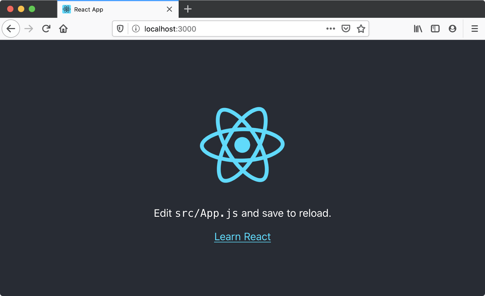

{{LearnSidebar}}{{PreviousMenuNext("Learn/Tools_and_testing/Client-side_JavaScript_frameworks/Main_features","Learn/Tools_and_testing/Client-side_JavaScript_frameworks/React_todo_list_beginning", "Learn/Tools_and_testing/Client-side_JavaScript_frameworks")}}

In this article we will say hello to React. We'll discover a little bit of detail about its background and use cases, set up a basic React toolchain on our local computer, and create and play with a simple starter app — learning a bit about how React works in the process.

<table>
  <tbody>
    <tr>
      <th scope="row">Prerequisites:</th>
      <td>
        <p>
          Familiarity with the core <a href="/en-US/docs/Learn/HTML">HTML</a>,
          <a href="/en-US/docs/Learn/CSS">CSS</a>, and
          <a href="/en-US/docs/Learn/JavaScript">JavaScript</a> languages,
          knowledge of the
          <a
            href="/en-US/docs/Learn/Tools_and_testing/Understanding_client-side_tools/Command_line"
            >terminal/command line</a
          >.
        </p>
        <p>
          React uses an HTML-in-JavaScript syntax called JSX (JavaScript and
          XML). Familiarity with both HTML and JavaScript will help you to learn
          JSX, and better identify whether bugs in your application are related
          to JavaScript or to the more specific domain of React.
        </p>
      </td>
    </tr>
    <tr>
      <th scope="row">Objective:</th>
      <td>
        <p>
          To set up a local React development environment, create a start app, and
          understand the basics of how it works.
        </p>
      </td>
    </tr>
  </tbody>
</table>

## Hello React

As its official tagline states, [React](https://react.dev/) is a library for building user interfaces. React is not a framework – it's not even exclusive to the web. It's used with other libraries to render to certain environments. For instance, [React Native](https://reactnative.dev/) can be used to build mobile applications.

To build for the web, developers use React in tandem with [ReactDOM](https://react.dev/reference/react-dom). React and ReactDOM are often discussed in the same spaces as — and utilized to solve the same problems as — other true web development frameworks. When we refer to React as a "framework", we're working with that colloquial understanding.

React's primary goal is to minimize the bugs that occur when developers are building UIs. It does this through the use of components — self-contained, logical pieces of code that describe a portion of the user interface. These components can be composed together to create a full UI, and React abstracts away much of the rendering work, leaving you to concentrate on the UI design.

## Use cases

Unlike the other frameworks covered in this module, React does not enforce strict rules around code conventions or file organization. This allows teams to set conventions that work best for them, and to adopt React in any way they would like to. React can handle a single button, a few pieces of an interface, or an app's entire user interface.

While React _can_ be used for [small pieces of an interface](https://react.dev/learn/add-react-to-an-existing-project), it's not as easy to "drop into" an application as a library like jQuery, or even a framework like Vue — it is more approachable when you build your entire app with React.

In addition, many of the developer-experience benefits of a React app, such as writing interfaces with JSX, require a compilation process. Adding a compiler like Babel to a website makes the code on it run slowly, so developers often set up such tooling with a build step. React arguably has a heavy tooling requirement, but it can be learned.

This article is going to focus on the use case of using React to render the entire user interface of an application, using tooling provided by Facebook's own [create-react-app](https://create-react-app.dev/) tool.

## How does React use JavaScript?

React utilizes features of modern JavaScript for many of its patterns. Its biggest departure from JavaScript comes with the use of [JSX](https://react.dev/learn/writing-markup-with-jsx) syntax. JSX extends JavaScript's syntax so that HTML-like code can live alongside it. For example:

```jsx
const heading = <h1>Mozilla Developer Network</h1>;
```

This heading constant is known as a **JSX expression**. React can use it to render that [`<h1>`](/en-US/docs/Web/HTML/Element/Heading_Elements) tag in our app.

Suppose we wanted to wrap our heading in a [`<header>`](/en-US/docs/Web/HTML/Element/header) tag, for semantic reasons? The JSX approach allows us to nest our elements within each other, just like we do with HTML:

```jsx
const header = (
  <header>
    <h1>Mozilla Developer Network</h1>
  </header>
);
```

> **Note:** The parentheses in the previous snippet aren't unique to JSX, and don't have any effect on your application. They're a signal to you (and your computer) that the multiple lines of code inside are part of the same expression. You could just as well write the header expression like this:
>
> ```jsx-nolint
> const header = <header>
>   <h1>Mozilla Developer Network</h1>
> </header>;
> ```
>
> However, this looks kind of awkward, because the [`<header>`](/en-US/docs/Web/HTML/Element/header) tag that starts the expression is not indented to the same position as its corresponding closing tag.

Of course, your browser can't read JSX without help. When compiled (using a tool like [Babel](https://babeljs.io/) or [Parcel](https://parceljs.org/)), our header expression would look like this:

```jsx
const header = React.createElement(
  "header",
  null,
  React.createElement("h1", null, "Mozilla Developer Network"),
);
```

It's _possible_ to skip the compilation step and use [`React.createElement()`](https://react.dev/reference/react/createElement) to write your UI yourself. In doing this, however, you lose the declarative benefit of JSX, and your code becomes harder to read. Compilation is an extra step in the development process, but many developers in the React community think that the readability of JSX is worthwhile. Plus, modern front-end development almost always involves a build process anyway — you have to downlevel modern syntax to be compatible with older browsers, and you may want to [minify](/en-US/docs/Glossary/Minification) your code to optimize loading performance. Popular tooling like Babel already comes with JSX support out-of-the-box, so you don't have to configure compilation yourself unless you want to.

Because JSX is a blend of HTML and JavaScript, some developers find it intuitive. Others say that its blended nature makes it confusing. Once you're comfortable with it, however, it will allow you to build user interfaces more quickly and intuitively, and allow others to better understand your codebase at a glance.

To read more about JSX, check out the React team's [Writing Markup with JSX](https://react.dev/learn/writing-markup-with-jsx) article.

## Setting up your first React app

There are many ways to use React, but we're going to use the command-line interface (CLI) tool create-react-app, as mentioned earlier, which expedites the process of developing a React application by installing some packages and creating some files for you, handling the tooling described above.

It's possible to [add React to a website without create-react-app](https://react.dev/learn/add-react-to-an-existing-project) by copying some [`<script>`](/en-US/docs/Web/HTML/Element/script) elements into an HTML file, but the create-react-app CLI is a common starting point for React applications. Using it will allow you to spend more time building your app, and less time fussing with setup.

### Requirements

In order to use create-react-app, you need to have [Node.js](https://nodejs.org/en/) installed. It's recommended that you use the long-term support (LTS) version. Node includes npm (the node package manager), and npx (the node package runner).

You may also use the Yarn package manager as an alternative, but we'll assume you are using npm in this set of tutorials. See [Package management basics](/en-US/docs/Learn/Tools_and_testing/Understanding_client-side_tools/Package_management) for more information on npm and yarn.

If you're using Windows, you will need to install some software to give you parity with Unix/macOS terminal in order to use the terminal commands mentioned in this tutorial. **Gitbash** (which comes as part of the [git for Windows toolset](https://gitforwindows.org/)) or **[Windows Subsystem for Linux](https://docs.microsoft.com/windows/wsl/about)** (**WSL**) are both suitable. See [Command line crash course](/en-US/docs/Learn/Tools_and_testing/Understanding_client-side_tools/Command_line) for more information on these, and on terminal commands in general.

Also bear in mind that React and ReactDOM produce apps that only work on a fairly modern set of browsers — IE9+ by way of some polyfills. It is recommended that you use a modern browser like Firefox, Microsoft Edge, Safari, or Chrome when working through these tutorials.

Also, see the following for more information:

- ["About npm" on the npm blog](https://docs.npmjs.com/about-npm/)
- ["Introducing npx" on the npm blog](https://blog.npmjs.org/post/162869356040/introducing-npx-an-npm-package-runner)
- [The create-react-app documentation](https://create-react-app.dev/)

### Initializing your app

create-react-app takes one argument: the name you'd like to give your app. create-react-app uses this name to make a new directory, then creates the necessary files inside it. Make sure you `cd` to the place you'd like your app to live on your hard drive, then run the following in your terminal:

```bash
npx create-react-app moz-todo-react
```

This creates a `moz-todo-react` directory, and does several things inside it:

- Installs some npm packages essential to the functionality of the app.
- Writes scripts for starting and serving the application.
- Creates a structure of files and directories that define the basic app architecture.
- Initializes the directory as a git repository, if you have git installed on your computer.

> **Note:** if you have the Yarn package manager installed, create-react-app will default to using it instead of npm. If you have both package managers installed and explicitly want to use npm, you can add the flag `--use-npm` when you run create-react-app:
>
> ```bash
> npx create-react-app moz-todo-react --use-npm
> ```

create-react-app will display a number of messages in your terminal while it works; this is normal! This might take a few minutes, so now might be a good time to go make a cup of tea.

When the process is complete, `cd` into the `moz-todo-react` directory and run the command `npm start`. The scripts installed by create-react-app will start being served at a local server at localhost:3000, and open the app in a new browser tab. Your browser will display something like this:



### Application structure

create-react-app gives us everything we need to develop a React application. Its initial file structure looks like this:

```plain
moz-todo-react
├── README.md
├── node_modules
├── package.json
├── package-lock.json
├── .gitignore
├── public
│   ├── favicon.ico
│   ├── index.html
│   ├── logo192.png
│   ├── logo512.png
│   ├── manifest.json
│   └── robots.txt
└── src
    ├── App.css
    ├── App.js
    ├── App.test.js
    ├── index.css
    ├── index.js
    ├── logo.svg
    ├── reportWebVitals.js
    └── setupTests.js
```

The **`src`** directory is where we'll spend most of our time, as it's where the source code for our application lives.

The **`public`** directory contains files that will be read by your browser while you're developing the app; the most important of these is `index.html`. React injects your code into this file so that your browser can run it. There's some other markup that helps create-react-app function, so take care not to edit it unless you know what you're doing. You very much should change the text inside the [`<title>`](/en-US/docs/Web/HTML/Element/title) element in this file to reflect the title of your application. Accurate page titles are important for accessibility!

The `public` directory will also be published when you build and deploy a production version of your app. We won't cover deployment in this tutorial, but you should be able to use a similar solution to that described in our [Deploying our app](/en-US/docs/Learn/Tools_and_testing/Understanding_client-side_tools/Deployment) tutorial.

The `package.json` file contains information about our project that Node.js/npm uses to keep it organized. This file is not unique to React applications; create-react-app merely populates it. You don't need to understand this file at all to complete this tutorial, however, if you'd like to learn more about it, you can read [package.json on the npm blog](https://docs.npmjs.com/cli/v9/configuring-npm/package-json/); we also talk about it in our [Package management basics](/en-US/docs/Learn/Tools_and_testing/Understanding_client-side_tools/Package_management) tutorial.

## Exploring our first React component — \<App/>

In React, a **component** is a reusable module that renders a part of our app. These parts can be big or small, but they are usually clearly defined: they serve a single, obvious purpose.

Let's open `src/App.js`, since our browser is prompting us to edit it. This file contains our first component, `App`, and a few other lines of code:

```jsx
import logo from "./logo.svg";
import "./App.css";

function App() {
  return (
    <div className="App">
      <header className="App-header">
        
        <p>
          Edit <code>src/App.js</code> and save to reload.
        </p>
        <a
          className="App-link"
          href="https://react.dev"
          target="_blank"
          rel="noopener noreferrer">
          Learn React
        </a>
      </header>
    </div>
  );
}
export default App;
```

The `App.js` file consists of three main parts: some [`import`](/en-US/docs/Web/JavaScript/Reference/Statements/import) statements at the top, the `App` component in the middle, and an [`export`](/en-US/docs/Web/JavaScript/Reference/Statements/export) statement at the bottom. Most React components follow this pattern.

### Import statements

The `import` statements at the top of the file allow `App.js` to use code that has been defined elsewhere. Let's look at these statements more closely.

```jsx
import logo from "./logo.svg";
import "./App.css";
```

The first statement imports a logo from `'./logo.svg'`. Note the use of `./` at the beginning of the path and the `.svg` extension at the end — these tell us that the file is local and that it is not a JavaScript file. Indeed, the `logo.svg` file lives in our source directory.

The second statement imports the CSS related to our App component. Note that there is no variable name and no `from` directive. This is called a [_side-effect import_](/en-US/docs/Web/JavaScript/Reference/Statements/import#import_a_module_for_its_side_effects_only) — it doesn't import any value into the JavaScript file, but it tells Webpack, the bundler, to add the referenced CSS file to the final CSS bundle.

Releases of React prior to the React 17 release in 2020 also required an import of the React library itself, as in - `import React from 'react'`. Skipping this step would result in an error: React turned the JSX we write into `React.createElement()`, so all React components needed to import the `React` module. React 17 introduced a new, rewritten version of the JSX transform that makes this statement unnecessary, with backported support to React 16.14.0, React 15.7.0, and React 0.14.10 (read more on the [official React doc](https://reactjs.org/blog/2020/09/22/introducing-the-new-jsx-transform.html)).

### The App component

After the imports, we have a function named `App`. Whereas most of the JavaScript community prefers camel-case names like `helloWorld`, React components use pascal-case variable names, like `HelloWorld`, to make it clear that a given JSX element is a React component, and not a regular HTML tag. If you were to rename the `App` function to `app`, your browser would show you an error.

Let's look at `App` more closely.

```jsx
function App() {
  return (
    <div className="App">
      <header className="App-header">
        
        <p>
          Edit <code>src/App.js</code> and save to reload.
        </p>
        <a
          className="App-link"
          href="https://react.dev"
          target="_blank"
          rel="noopener noreferrer">
          Learn React
        </a>
      </header>
    </div>
  );
}
```

The `App` function returns a JSX expression. This expression defines what your browser ultimately renders to the DOM.

Some elements in the expression have attributes, which are written just like in HTML, following a pattern of `attribute="value"`. On line 3, the opening [`<div>`](/en-US/docs/Web/HTML/Element/div) tag has a `className` attribute. This is the same as the [`class`](/en-US/docs/Web/HTML/Global_attributes/class) attribute in HTML, but because JSX is JavaScript, we can't use the word `class` — it's reserved, meaning JavaScript already uses it for a specific purpose and it would cause problems here in our code. A few other HTML attributes are written differently in JSX than they are in HTML too, for the same kind of reason. We'll cover them as we encounter them.

Take a moment to change the [`<p>`](/en-US/docs/Web/HTML/Element/p) tag on line 6 so that it reads "Hello, World!", then save your file. You'll notice that this change is immediately rendered in the development server running at `http://localhost:3000` in your browser. Now delete the [`<a>`](/en-US/docs/Web/HTML/Element/a) tag and save; the "Learn React" link will be gone.

Your `App` component should now look like this:

```jsx
function App() {
  return (
    <div className="App">
      <header className="App-header">
        
        <p>Hello, World!</p>
      </header>
    </div>
  );
}
```

### Export statements

At the very bottom of the `App.js` file, the statement `export default App` makes our `App` component available to other modules.

## Interrogating the index

Let's open `src/index.js`, because that's where the `App` component is being used. This file is the entry point for our app, and it initially looks like this:

```jsx
import React from "react";
import ReactDOM from "react-dom/client";
import "./index.css";
import App from "./App";
import reportWebVitals from "./reportWebVitals";

const root = ReactDOM.createRoot(document.getElementById("root"));
root.render(
  <React.StrictMode>
    <App />
  </React.StrictMode>,
);

// If you want to start measuring performance in your app, pass a function
// to log results (for example: reportWebVitals(console.log))
// or send to an analytics endpoint. Learn more: https://bit.ly/CRA-vitals
reportWebVitals();
```

As with `App.js`, the file starts by importing all the JS modules and other assets it needs to run.

The first two statements import the `React` and `ReactDOM` libraries because they are referenced later in the file. We don't write a path or extension when importing these libraries because they are not local files. In fact, they are listed as dependencies in our `package.json` file. Be careful of this distinction as you work through this lesson!

`index.css` holds global styles that are applied to our whole app. We can also see our `App` component imported here; it is made available for import thanks to the `export` statement at the bottom of `App.js`.

Line 7 calls the `ReactDOM.createRoot()` function with the DOM element inside which we want the React element to be rendered, in this case the DOM element with an ID of `root`. If you look inside `public/index.html`, you'll see that this is a `<div>` element just inside the `<body>`. React will create a root for this node, and take over managing the DOM inside it (read more on the [official react doc](https://beta.reactjs.org/apis/react-dom/client/createRoot)). The function returns the `root`.

Line 8 calls the `root.render()` method with the React element we want to render into the DOM, `<App />` in this case. We use [strict mode](https://react.dev/reference/react/StrictMode) during development to find common bugs in our components.

All of this tells React that we want to render our React application with `<App />` as the root, or first element.

> **Note:** In JSX, React elements and HTML elements must have closing slashes. Writing just `<App>` or just `` will cause an error.

[`reportWebVitals`](https://create-react-app.dev/docs/measuring-performance/) are a set of useful metrics that aim to capture the user experience of a web page, but they're not in scope for this article. You can delete its import line, as well as the `reportWebVitals();` line.

Your final `index.js` file should look like this:

```jsx
import React from "react";
import ReactDOM from "react-dom/client";
import "./index.css";
import App from "./App";

const root = ReactDOM.createRoot(document.getElementById("root"));
root.render(
  <React.StrictMode>
    <App />
  </React.StrictMode>,
);
```

## Variables and props

Next, we'll use a few of our JavaScript skills to get a bit more comfortable editing components and working with data in React. We'll talk about how variables are used inside JSX, and introduce props, which are a way of passing data into a component (which can then be accessed using variables).

### Variables in JSX

Back in `App.js`, let's focus on line 8:

```jsx

```

Here, the `` tag's `src` attribute value is in curly braces. This is how JSX recognizes variables. React will see `{logo}`, know you are referring to the logo import on line 2 of our app, then retrieve the logo file and render it.

Let's try making a variable of our own. Before the return statement of `App`, add `const subject = 'React';`. Your `App` component should now look like this:

```jsx
function App() {
  const subject = "React";
  return (
    <div className="App">
      <header className="App-header">
        
        <p>Hello, World!</p>
      </header>
    </div>
  );
}
```

Change line 8 to use our `subject` variable instead of the word "World", like this:

```jsx
function App() {
  const subject = "React";
  return (
    <div className="App">
      <header className="App-header">
        
        <p>Hello, {subject}!</p>
      </header>
    </div>
  );
}
```

When you save, your browser should display "Hello, React!" instead of "Hello, World!"

Variables are convenient, but the one we've just set doesn't make great use of React's features. That's where props come in.

### Component props

A **prop** is any data passed into a React component. React props are comparable to HTML attributes. Where HTML elements have attributes, React components have props. Props are written inside component calls, and use the same syntax as HTML attributes — `prop="value"`. In React, dataflow is unidirectional: props can only be passed from Parent components down to Child components; and props are read-only.

Let's open `index.js` and give our `<App/>` call its first prop.

Add a prop of `subject` to the `<App/>` component call, with a value of `Clarice`. When you are done, your code should look something like this:

```jsx
root.render(<App subject="Clarice" />);
```

Back in `App.js`, let's revisit the App function itself, which reads like this (with the `return` statement shortened for brevity):

```jsx
function App() {
  const subject = "React";
  return (
    // return statement
  );
}
```

Change the signature of the `App` function so that it accepts `props` as a parameter, and delete the `subject` const.
Just like any other function parameter, you can put `props` in a `console.log()` to print it to your browser's console. Go ahead and do that before the `return` statement, like so:

```jsx
function App(props) {
  console.log(props);
  return (
    // return statement
  );
}
```

With this change, {subject} becomes undefined, so comment out the line `Hello, {subject}!` for now.
Save your file and check your browser's JavaScript console. You should see something like this logged:

```plain
Object { subject: "Clarice" }
```

The object property `subject` corresponds to the `subject` prop we added to our `<App />` component call, and the string `Clarice` corresponds to its value. Component props in React are always collected into objects in this fashion.

Now that `subject` is one of our props, let's utilize it in `App.js`. Change the `subject` constant so that, instead of defining it as the string `React`, you are reading the value of `props.subject`. Now, you can also uncomment the line `Hello, {subject}!` and, if you wish, delete your `console.log()`.

```jsx
function App(props) {
  const subject = props.subject;
  return (
    // return statement
  );
}
```

When you save, the app should now greet you with "Hello, Clarice!". If you return to `index.js`, edit the value of `subject`, and save, your text will change.
Note that if you wanted to leave in the `Hello` line throughout this change, you could also have updated the JSX variable to `{props.subject}`.

## Summary

This brings us to the end of our initial look at React, including how to install it locally, creating a starter app, and how the basics work. In the next article, we'll start building our first proper application — a todo list. Before we do that, however, let's recap some of the things we've learned.

In React:

- Components can import modules they need and must export themselves at the bottom of their files.
- Component functions are named with `PascalCase`.
- You can read JSX variables by putting them between curly braces, like `{so}`.
- Some JSX attributes are different than HTML attributes so that they don't conflict with JavaScript reserved words. For example, `class` in HTML translates to `className` in JSX. Note that multi-word attributes are in `camelCase`.
- Props are written just like attributes inside component calls and are passed into components.

{{PreviousMenuNext("Learn/Tools_and_testing/Client-side_JavaScript_frameworks/Main_features","Learn/Tools_and_testing/Client-side_JavaScript_frameworks/React_todo_list_beginning", "Learn/Tools_and_testing/Client-side_JavaScript_frameworks")}}
