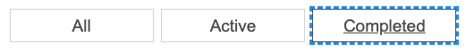

{{LearnSidebar}}{{PreviousMenuNext("Learn/Tools_and_testing/Client-side_JavaScript_frameworks/React_interactivity_events_state","Learn/Tools_and_testing/Client-side_JavaScript_frameworks/React_accessibility", "Learn/Tools_and_testing/Client-side_JavaScript_frameworks")}}

As we near the end of our React journey (for now at least), we'll add the finishing touches to the main areas of functionality in our Todo list app. This includes allowing you to edit existing tasks, and filtering the list of tasks between all, completed, and incomplete tasks. We'll look at conditional UI rendering along the way.

<table>
  <tbody>
    <tr>
      <th scope="row">Prerequisites:</th>
      <td>
        <p>
          Familiarity with the core <a href="/en-US/docs/Learn/HTML">HTML</a>,
          <a href="/en-US/docs/Learn/CSS">CSS</a>, and
          <a href="/en-US/docs/Learn/JavaScript">JavaScript</a> languages,
          knowledge of the
          <a
            href="/en-US/docs/Learn/Tools_and_testing/Understanding_client-side_tools/Command_line"
            >terminal/command line</a
          >.
        </p>
      </td>
    </tr>
    <tr>
      <th scope="row">Objective:</th>
      <td>
        To learn about conditional rendering in React, and implementing list
        filtering and an editing UI in our app.
      </td>
    </tr>
  </tbody>
</table>

## Editing the name of a task

We don't have a user interface for editing the name of a task yet. We'll get to that in a moment. To start with, we can at least implement an `editTask()` function in `App.js`. It'll be similar to `deleteTask()` because it'll take an `id` to find its target object, but it'll also take a `newName` property containing the name to update the task to. We'll use [`Array.prototype.map()`](/en-US/docs/Web/JavaScript/Reference/Global_Objects/Array/map) instead of [`Array.prototype.filter()`](/en-US/docs/Web/JavaScript/Reference/Global_Objects/Array/filter) because we want to return a new array with some changes, instead of deleting something from the array.

Add the `editTask()` function inside your App component, in the same place as the other functions:

```js
function editTask(id, newName) {
  const editedTaskList = tasks.map((task) => {
  // if this task has the same ID as the edited task
    if (id === task.id) {
      //
      return {...task, name: newName}
    }
    return task;
  });
  setTasks(editedTaskList);
}
```

Pass `editTask` into our `<Todo />` components as a prop in the same way we did with `deleteTask`:

```js
const taskList = tasks.map((task) => (
  <Todo
    id={task.id}
    name={task.name}
    completed={task.completed}
    key={task.id}
    toggleTaskCompleted={toggleTaskCompleted}
    deleteTask={deleteTask}
    editTask={editTask}
  />
));
```

Now open `Todo.js`. We're going to do some refactoring.

## A UI for editing

In order to allow users to edit a task, we have to provide a user interface for them to do so. First, import `useState` into the `Todo` component like we did before with the `App` component, by updating the first import statement to this:

```js
import React, { useState } from "react";
```

We'll now use this to set an `isEditing` state, the default state of which should be `false`. Add the following line just inside the top of your `Todo(props) { }` component definition:

```js
const [isEditing, setEditing] = useState(false);
```

Next, we're going to rethink the `<Todo />` component — from now on, we want it to display one of two possible "templates", rather than the single template it's used so far:

- The "view" template, when we are just viewing a todo; this is what we've used in the tutorial thus far.
- The "editing" template, when we are editing a todo. We're about to create this.

Copy this block of code into the `Todo()` function, beneath your `useState()` hook but above the `return` statement:

```js
const editingTemplate = (
  <form className="stack-small">
    <div className="form-group">
      <label className="todo-label" htmlFor={props.id}>
        New name for {props.name}
      </label>
      <input id={props.id} className="todo-text" type="text" />
    </div>
    <div className="btn-group">
      <button type="button" className="btn todo-cancel">
        Cancel
        <span className="visually-hidden">renaming {props.name}</span>
      </button>
      <button type="submit" className="btn btn__primary todo-edit">
        Save
        <span className="visually-hidden">new name for {props.name}</span>
      </button>
    </div>
  </form>
);
const viewTemplate = (
  <div className="stack-small">
    <div className="c-cb">
        <input
          id={props.id}
          type="checkbox"
          defaultChecked={props.completed}
          onChange={() => props.toggleTaskCompleted(props.id)}
        />
        <label className="todo-label" htmlFor={props.id}>
          {props.name}
        </label>
      </div>
      <div className="btn-group">
        <button type="button" className="btn">
          Edit <span className="visually-hidden">{props.name}</span>
        </button>
        <button
          type="button"
          className="btn btn__danger"
          onClick={() => props.deleteTask(props.id)}
        >
          Delete <span className="visually-hidden">{props.name}</span>
        </button>
      </div>
  </div>
);
```

We've now got the two different template structures — "edit" and "view" — defined inside two separate constants. This means that the `return` statement of `<Todo />` is now repetitious — it also contains a definition of the "view" template. We can clean this up by using **conditional rendering** to determine which template the component returns, and is therefore rendered in the UI.

## Conditional rendering

In JSX, we can use a condition to change what is rendered by the browser. To write a condition in JSX, we can use a [ternary operator](/en-US/docs/Web/JavaScript/Reference/Operators/Conditional_Operator).

In the case of our `<Todo />` component, our condition is "Is this task being edited?" Change the `return` statement inside `Todo()` so that it reads like so:

```js
return <li className="todo">{isEditing ? editingTemplate : viewTemplate}</li>;
```

Your browser should render all your tasks just like before. To see the editing template, you will have to change the default `isEditing` state from `false` to `true` in your code for now; we will look at making the edit button toggle this in the next section!

## Toggling the `<Todo />` templates

At long last, we are ready to make our final core feature interactive. To start with, we want to call `setEditing()` with a value of `true` when a user presses the "Edit" button in our `viewTemplate`, so that we can switch templates.

Update the "Edit" button in the `viewTemplate` like so:

```js
<button type="button" className="btn" onClick={() => setEditing(true)}>
  Edit <span className="visually-hidden">{props.name}</span>
</button>
```

Now we'll add the same `onClick` handler to the "Cancel" button in the `editingTemplate`, but this time we'll set `isEditing` to `false` so that it switches us back to the view template.

Update the "Cancel" button in the `editingTemplate` like so:

```js
<button
  type="button"
  className="btn todo-cancel"
  onClick={() => setEditing(false)}
>
  Cancel
  <span className="visually-hidden">renaming {props.name}</span>
</button>
```

With this code in place, you should be able to press the "Edit" and "Cancel" buttons in your todo items to toggle between templates.


The next step is to actually make the editing functionality work.

## Editing from the UI

Much of what we're about to do will mirror the work we did in `Form.js`: as the user types in our new input field, we need to track the text they enter; once they submit the form, we need to use a callback prop to update our state with the new name of the task.

We'll start by making a new hook for storing and setting the new name. Still in `Todo.js`, put the following underneath the existing hook:

```js
const [newName, setNewName] = useState('');
```

Next, create a `handleChange()` function that will set the new name; put this underneath the hooks but before the templates:

```js
function handleChange(e) {
  setNewName(e.target.value);
}
```

Now we'll update our `editingTemplate`'s `<input />` field, setting a `value` attribute of `newName`, and binding our `handleChange()` function to its `onChange` event. Update it as follows:

```js
<input
  id={props.id}
  className="todo-text"
  type="text"
  value={newName}
  onChange={handleChange}
/>
```

Finally, we need to create a function to handle the edit form's `onSubmit` event; add the following just below the previous function you added:

```js
function handleSubmit(e) {
  e.preventDefault();
  props.editTask(props.id, newName);
  setNewName("");
  setEditing(false);
}
```

Remember that our `editTask()` callback prop needs the ID of the task we're editing as well as its new name.

Bind this function to the form's `submit` event by adding the following `onSubmit` handler to the `editingTemplate`'s `<form>`:

```js
<form className="stack-small" onSubmit={handleSubmit}>
```

You should now be able to edit a task in your browser!

## Back to the filter buttons

Now that our main features are complete, we can think about our filter buttons. Currently, they repeat the "All" label, and they have no functionality! We will be reapplying some skills we used in our `<Todo />` component to:

- Create a hook for storing the active filter.
- Render an array of `<FilterButton />` elements that allow users to change the active filter between all, completed, and incomplete.

### Adding a filter hook

Add a new hook to your `App()` function that reads and sets a filter. We want the default filter to be `All` because all of our tasks should be shown initially:

```js
const [filter, setFilter] = useState('All');
```

### Defining our filters

Our goal right now is two-fold:

- Each filter should have a unique name.
- Each filter should have a unique behavior.

A JavaScript object would be a great way to relate names to behaviors: each key is the name of a filter; each property is the behavior associated with that name.

At the top of `App.js`, beneath our imports but above our `App()` function, let's add an object called `FILTER_MAP`:

```js
const FILTER_MAP = {
  All: () => true,
  Active: (task) => !task.completed,
  Completed: (task) => task.completed
};
```

The values of `FILTER_MAP` are functions that we will use to filter the `tasks` data array:

- The `All` filter shows all tasks, so we return `true` for all tasks.
- The `Active` filter shows tasks whose `completed` prop is `false`.
- The `Completed` filter shows tasks whose `completed` prop is `true`.

Beneath our previous addition, add the following — here we are using the [`Object.keys()`](/en-US/docs/Web/JavaScript/Reference/Global_Objects/Object/keys) method to collect an array of `FILTER_NAMES`:

```js
const FILTER_NAMES = Object.keys(FILTER_MAP);
```

> **Note:** We are defining these constants outside our `App()` function because if they were defined inside it, they would be recalculated every time the `<App />` component re-renders, and we don't want that. This information will never change no matter what our application does.

### Rendering the filters

Now that we have the `FILTER_NAMES` array, we can use it to render all three of our filters. Inside the `App()` function we can create a constant called `filterList`, which we will use to map over our array of names and return a `<FilterButton />` component. Remember, we need keys here, too.

Add the following underneath your `taskList` constant declaration:

```js
const filterList = FILTER_NAMES.map((name) => (
  <FilterButton key={name} name={name}/>
));
```

Now we'll replace the three repeated `<FilterButton />`s in `App.js` with this `filterList`. Replace the following:

```js
<FilterButton />
<FilterButton />
<FilterButton />
```

With this:

```js
{filterList}
```

This won't work yet. We've got a bit more work to do first.

### Interactive filters

To make our filter buttons interactive, we should consider what props they need to utilize.

- We know that the `<FilterButton />` should report whether it is currently pressed, and it should be pressed if its name matches the current value of our filter state.
- We know that the `<FilterButton />` needs a callback to set the active filter. We can make direct use of our `setFilter` hook.

Update your `filterList` constant as follows:

```js
const filterList = FILTER_NAMES.map((name) => (
  <FilterButton
    key={name}
    name={name}
    isPressed={name === filter}
    setFilter={setFilter}
  />
));
```

In the same way as we did earlier with our `<Todo />` component, we now have to update `FilterButton.js` to utilize the props we have given it. Do each of the following, and remember to use curly braces to read these variables!

- Replace `all` with `{props.name}`.
- Set the value of `aria-pressed` to `{props.isPressed}`.
- Add an `onClick` handler that calls `props.setFilter()` with the filter's name.

With all of that done, your `FilterButton()` function should read like this:

```js
function FilterButton(props) {
  return (
    <button
      type="button"
      className="btn toggle-btn"
      aria-pressed={props.isPressed}
      onClick={() => props.setFilter(props.name)}
    >
      <span className="visually-hidden">Show </span>
      <span>{props.name}</span>
      <span className="visually-hidden"> tasks</span>
    </button>
  );
}
```

Visit your browser again. You should see that the different buttons have been given their respective names. When you press a filter button, you should see its text take on a new outline — this tells you it has been selected. And if you look at your DevTool's Page Inspector while clicking the buttons, you'll see the `aria-pressed` attribute values change accordingly.



However, our buttons still don't actually filter the todos in the UI! Let's finish this off.

### Filtering tasks in the UI

Right now, our `taskList` constant in `App()` maps over the tasks state and returns a new `<Todo />` component for all of them. This is not what we want! A task should only render if it is included in the results of applying the selected filter. Before we map over the tasks state, we should filter it (with [`Array.prototype.filter()`](/en-US/docs/Web/JavaScript/Reference/Global_Objects/Array/filter)) to eliminate objects we don't want to render.

Update your `taskList` like so:

```js
const taskList = tasks
.filter(FILTER_MAP[filter])
.map((task) => (
  <Todo
    id={task.id}
    name={task.name}
    completed={task.completed}
    key={task.id}
    toggleTaskCompleted={toggleTaskCompleted}
    deleteTask={deleteTask}
    editTask={editTask}
  />
));
```

In order to decide which callback function to use in `Array.prototype.filter()`, we access the value in `FILTER_MAP` that corresponds to the key of our filter state. When filter is `All`, for example, `FILTER_MAP[filter]` will evaluate to `() => true`.

Choosing a filter in your browser will now remove the tasks that do not meet its criteria. The count in the heading above the list will also change to reflect the list!


## Summary

So that's it — our app is now functionally complete. However, now that we've implemented all of our features, we can make a few improvements to ensure that a wider range of users can use our app. Our next article rounds things off for our React tutorials by looking at including focus management in React, which can improve usability and reduce confusion for both keyboard-only and screen reader users.

{{PreviousMenuNext("Learn/Tools_and_testing/Client-side_JavaScript_frameworks/React_interactivity_events_state","Learn/Tools_and_testing/Client-side_JavaScript_frameworks/React_accessibility", "Learn/Tools_and_testing/Client-side_JavaScript_frameworks")}}

## In this module

- [Introduction to client-side frameworks](/en-US/docs/Learn/Tools_and_testing/Client-side_JavaScript_frameworks/Introduction)
- [Framework main features](/en-US/docs/Learn/Tools_and_testing/Client-side_JavaScript_frameworks/Main_features)
- React

  - [Getting started with React](/en-US/docs/Learn/Tools_and_testing/Client-side_JavaScript_frameworks/React_getting_started)
  - [Beginning our React todo list](/en-US/docs/Learn/Tools_and_testing/Client-side_JavaScript_frameworks/React_todo_list_beginning)
  - [Componentizing our React app](/en-US/docs/Learn/Tools_and_testing/Client-side_JavaScript_frameworks/React_components)
  - [React interactivity: Events and state](/en-US/docs/Learn/Tools_and_testing/Client-side_JavaScript_frameworks/React_interactivity_events_state)
  - [React interactivity: Editing, filtering, conditional rendering](/en-US/docs/Learn/Tools_and_testing/Client-side_JavaScript_frameworks/React_interactivity_filtering_conditional_rendering)
  - [Accessibility in React](/en-US/docs/Learn/Tools_and_testing/Client-side_JavaScript_frameworks/React_accessibility)
  - [React resources](/en-US/docs/Learn/Tools_and_testing/Client-side_JavaScript_frameworks/React_resources)

- Ember

  - [Getting started with Ember](/en-US/docs/Learn/Tools_and_testing/Client-side_JavaScript_frameworks/Ember_getting_started)
  - [Ember app structure and componentization](/en-US/docs/Learn/Tools_and_testing/Client-side_JavaScript_frameworks/Ember_structure_componentization)
  - [Ember interactivity: Events, classes and state](/en-US/docs/Learn/Tools_and_testing/Client-side_JavaScript_frameworks/Ember_interactivity_events_state)
  - [Ember Interactivity: Footer functionality, conditional rendering](/en-US/docs/Learn/Tools_and_testing/Client-side_JavaScript_frameworks/Ember_conditional_footer)
  - [Routing in Ember](/en-US/docs/Learn/Tools_and_testing/Client-side_JavaScript_frameworks/Ember_routing)
  - [Ember resources and troubleshooting](/en-US/docs/Learn/Tools_and_testing/Client-side_JavaScript_frameworks/Ember_resources)

- Vue

  - [Getting started with Vue](/en-US/docs/Learn/Tools_and_testing/Client-side_JavaScript_frameworks/Vue_getting_started)
  - [Creating our first Vue component](/en-US/docs/Learn/Tools_and_testing/Client-side_JavaScript_frameworks/Vue_first_component)
  - [Rendering a list of Vue components](/en-US/docs/Learn/Tools_and_testing/Client-side_JavaScript_frameworks/Vue_rendering_lists)
  - [Adding a new todo form: Vue events, methods, and models](/en-US/docs/Learn/Tools_and_testing/Client-side_JavaScript_frameworks/Vue_methods_events_models)
  - [Styling Vue components with CSS](/en-US/docs/Learn/Tools_and_testing/Client-side_JavaScript_frameworks/Vue_styling)
  - [Using Vue computed properties](/en-US/docs/Learn/Tools_and_testing/Client-side_JavaScript_frameworks/Vue_computed_properties)
  - [Vue conditional rendering: editing existing todos](/en-US/docs/Learn/Tools_and_testing/Client-side_JavaScript_frameworks/Vue_conditional_rendering)
  - [Focus management with Vue refs](/en-US/docs/Learn/Tools_and_testing/Client-side_JavaScript_frameworks/Vue_refs_focus_management)
  - [Vue resources](/en-US/docs/Learn/Tools_and_testing/Client-side_JavaScript_frameworks/Vue_resources)

- Svelte

  - [Getting started with Svelte](/en-US/docs/Learn/Tools_and_testing/Client-side_JavaScript_frameworks/Svelte_getting_started)
  - [Starting our Svelte Todo list app](/en-US/docs/Learn/Tools_and_testing/Client-side_JavaScript_frameworks/Svelte_Todo_list_beginning)
  - [Dynamic behavior in Svelte: working with variables and props](/en-US/docs/Learn/Tools_and_testing/Client-side_JavaScript_frameworks/Svelte_variables_props)
  - [Componentizing our Svelte app](/en-US/docs/Learn/Tools_and_testing/Client-side_JavaScript_frameworks/Svelte_components)
  - [Advanced Svelte: Reactivity, lifecycle, accessibility](/en-US/docs/Learn/Tools_and_testing/Client-side_JavaScript_frameworks/Svelte_reactivity_lifecycle_accessibility)
  - [Working with Svelte stores](/en-US/docs/Learn/Tools_and_testing/Client-side_JavaScript_frameworks/Svelte_stores)
  - [TypeScript support in Svelte](/en-US/docs/Learn/Tools_and_testing/Client-side_JavaScript_frameworks/Svelte_TypeScript)
  - [Deployment and next steps](/en-US/docs/Learn/Tools_and_testing/Client-side_JavaScript_frameworks/Svelte_deployment_next)

- Angular

  - [Getting started with Angular](/en-US/docs/Learn/Tools_and_testing/Client-side_JavaScript_frameworks/Angular_getting_started)
  - [Beginning our Angular todo list app](/en-US/docs/Learn/Tools_and_testing/Client-side_JavaScript_frameworks/Angular_todo_list_beginning)
  - [Styling our Angular app](/en-US/docs/Learn/Tools_and_testing/Client-side_JavaScript_frameworks/Angular_styling)
  - [Creating an item component](/en-US/docs/Learn/Tools_and_testing/Client-side_JavaScript_frameworks/Angular_item_component)
  - [Filtering our to-do items](/en-US/docs/Learn/Tools_and_testing/Client-side_JavaScript_frameworks/Angular_filtering)
  - [Building Angular applications and further resources](/en-US/docs/Learn/Tools_and_testing/Client-side_JavaScript_frameworks/Angular_building)
