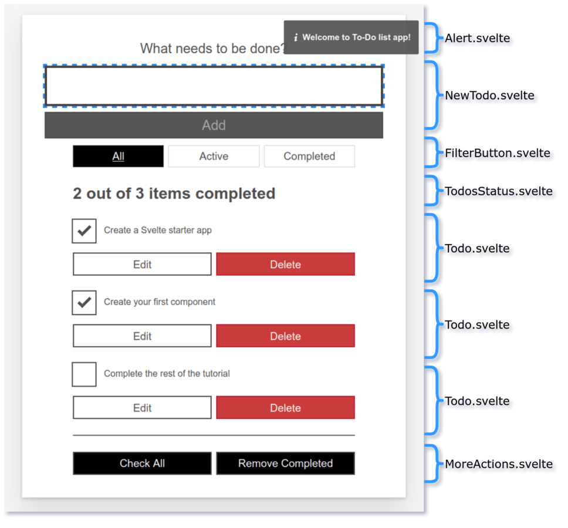

{{LearnSidebar}}
{{PreviousMenuNext("Learn/Tools_and_testing/Client-side_JavaScript_frameworks/Svelte_variables_props","Learn/Tools_and_testing/Client-side_JavaScript_frameworks/Svelte_reactivity_lifecycle_accessibility", "Learn/Tools_and_testing/Client-side_JavaScript_frameworks")}}

In the last article we started developing our to-do list app. The central objective of this article is to look at how to break our app into manageable components and share information between them. We'll componentize our app, then add more functionality to allow users to update existing components.

<table>
  <tbody>
    <tr>
      <th scope="row">Prerequisites:</th>
      <td>
        <p>
          At minimum, it is recommended that you are familiar with the core
          <a href="/en-US/docs/Learn/HTML">HTML</a>,
          <a href="/en-US/docs/Learn/CSS">CSS</a>, and
          <a href="/en-US/docs/Learn/JavaScript">JavaScript</a> languages, and
          have knowledge of the
          <a
            href="/en-US/docs/Learn/Tools_and_testing/Understanding_client-side_tools/Command_line"
            >terminal/command line</a
          >.
        </p>
        <p>
          You'll need a terminal with node and npm installed to compile and build
          your app.
        </p>
      </td>
    </tr>
    <tr>
      <th scope="row">Objective:</th>
      <td>
        To learn how to break our app into components and share information
        among them.
      </td>
    </tr>
  </tbody>
</table>

## Code along with us

### Git

Clone the GitHub repo (if you haven't already done it) with:

```bash
git clone https://github.com/opensas/mdn-svelte-tutorial.git
```

Then to get to the current app state, run

```bash
cd mdn-svelte-tutorial/04-componentizing-our-app
```

Or directly download the folder's content:

```bash
npx degit opensas/mdn-svelte-tutorial/04-componentizing-our-app
```

Remember to run `npm install && npm run dev` to start your app in development mode.

### REPL

To code along with us using the REPL, start at

<https://svelte.dev/repl/99b9eb228b404a2f8c8959b22c0a40d3?version=3.23.2>

## Breaking the app into components

In Svelte, an application is composed from one or more components. A component is a reusable, self-contained block of code that encapsulates HTML, CSS, and JavaScript that belong together, written into a `.svelte` file. Components can be big or small, but they are usually clearly defined: the most effective components serve a single, obvious purpose.

The benefits of defining components are comparable to the more general best practice of organizing your code into manageable pieces. It will help you understand how they relate to each other, it will promote reuse, and it will make your code easier to reason about, maintain, and extend.

But how do you know what should be split into its own component?

There are no hard rules for this. Some people prefer an intuitive approach and start looking at the markup and drawing boxes around every component and subcomponent that seems to have its own logic.

Other people apply the same techniques used for deciding if you should create a new function or object. One such technique is the single responsibility principle — that is, a component should ideally only do one thing. If it ends up growing, it should be split into smaller subcomponents.

Both approaches should complement each other, and help you decide how to better organize your components.

Eventually, we will split up our app into the following components:

- `Alert.svelte`: A general notification box for communicating actions that have occurred.
- `NewTodo.svelte`: The text input and button that allow you to enter a new to-do item.
- `FilterButton.svelte`: The _All_, _Active_, and _Completed_ buttons that allow you to apply filters to the displayed to-do items.
- `TodosStatus.svelte`: The "x out of y items completed" heading.
- `Todo.svelte`: An individual to-do item. Each visible to-do item will be displayed in a separate copy of this component.
- `MoreActions.svelte`: The _Check All_ and _Remove Completed_ buttons at the bottom of the UI that allow you to perform mass actions on the to-do items.



In this article we will concentrate on creating the `FilterButton` and `Todo` components; we'll get to the others in future articles.

Let's get started.

> **Note:** In the process of creating our first couple of components, we will also learn different techniques to communicate between components, and the pros and cons of each.

## Extracting our filter component

We'll begin by creating our `FilterButton.svelte`.

1. First of all, create a new file, `components/FilterButton.svelte`.
2. Inside this file we will declare a `filter` prop, and then copy the relevant markup over to it from `Todos.svelte`. Add the following content into the file:

   ```svelte
   <script>
     export let filter = 'all'
   </script>

   <div class="filters btn-group stack-exception">
     <button class="btn toggle-btn" class:btn__primary={filter === 'all'} aria-pressed={filter === 'all'} on:click={() => filter = 'all'} >
       <span class="visually-hidden">Show</span>
       <span>All</span>
       <span class="visually-hidden">tasks</span>
     </button>
     <button class="btn toggle-btn" class:btn__primary={filter === 'active'} aria-pressed={filter === 'active'} on:click={() => filter = 'active'} >
       <span class="visually-hidden">Show</span>
       <span>Active</span>
       <span class="visually-hidden">tasks</span>
     </button>
     <button class="btn toggle-btn" class:btn__primary={filter === 'completed'} aria-pressed={filter === 'completed'} on:click={() => filter = 'completed'} >
       <span class="visually-hidden">Show</span>
       <span>Completed</span>
       <span class="visually-hidden">tasks</span>
     </button>
   </div>
   ```

3. Back in our `Todos.svelte` component, we want to make use of our `FilterButton` component. First of all, we need to import it. Add the following line at the top of the `Todos.svelte <script>` section:

   ```js
   import FilterButton from "./FilterButton.svelte";
   ```

4. Now replace the `<div class="filters...` element with a call to the `FilterButton` component, which takes the current filter as a prop. The below line is all you need:

   ```svelte
   <FilterButton {filter} />
   ```

> **Note:** Remember that when the HTML attribute name and variable match, they can be replaced with `{variable}`. That's why we could replace `<FilterButton filter={filter} />` with `<FilterButton {filter} />`.

So far so good! Let's try out the app now. You'll notice that when you click on the filter buttons, they are selected and the style updates appropriately. But we have a problem: the to-dos aren't filtered. That's because the `filter` variable flows down from the `Todos` component to the `FilterButton` component through the prop, but changes occurring in the `FilterButton` component don't flow back up to its parent — the data binding is one-way by default. Let's look at a way to solve this.

## Sharing data between components: passing a handler as a prop

One way to let child components notify their parents of any changes is to pass a handler as a prop. The child component will execute the handler, passing the needed information as a parameter, and the handler will modify the parent's state.

In our case, the `FilterButton` component will receive an `onclick` handler from its parent. Whenever the user clicks on any filter button, the child will call the `onclick` handler, passing the selected filter as a parameter back up to its parent.

We will just declare the `onclick` prop assigning a dummy handler to prevent errors, like this:

```js
export let onclick = (clicked) => {};
```

And we'll declare the reactive statement `$: onclick(filter)` to call the `onclick` handler whenever the `filter` variable is updated.

1. The `<script>` section of our `FilterButton` component should end up looking like this. Update it now:

   ```js
   export let filter = "all";
   export let onclick = (clicked) => {};
   $: onclick(filter);
   ```

2. Now when we call `FilterButton` inside `Todos.svelte`, we'll need to specify the handler. Update it like this:

   ```svelte
   <FilterButton {filter} onclick={ (clicked) => filter = clicked }/>
   ```

When any filter button is clicked, we just update the filter variable with the new filter. Now our `FilterButton` component will work again.

## Easier two-way data binding with the bind directive

In the previous example we realized that our `FilterButton` component wasn't working because our application state was flowing down from parent to child through the `filter` prop, but it wasn't going back up. So we added an `onclick` prop to let the child component communicate the new `filter` value to its parent.

It works OK, but Svelte provides us with an easier and more straightforward way to achieve two-way data binding. Data ordinarily flows down from parent to child using props. If we want it to also flow the other way, from child to parent, we can use [the `bind:` directive](https://svelte.dev/docs#bind_element_property).

Using `bind`, we will tell Svelte that any changes made to the `filter` prop in the `FilterButton` component should propagate back up to the parent component, `Todos`. That is, we will bind the `filter` variable's value in the parent to its value in the child.

1. In `Todos.svelte`, update the call to the `FilterButton` component as follows:

   ```svelte
   <FilterButton bind:filter={filter} />
   ```

   As usual, Svelte provides us with a nice shorthand: `bind:value={value}` is equivalent to `bind:value`. So in the above example you could just write `<FilterButton bind:filter />`.

2. The child component can now modify the value of the parent's filter variable, so we no longer need the `onclick` prop. Modify the `<script>` element of your `FilterButton` like this:

   ```svelte
   <script>
     export let filter = "all";
   </script>
   ```

3. Try your app again, and you should still see your filters working correctly.

## Creating our Todo component

Now we will create a `Todo` component to encapsulate each individual to-do, including the checkbox and some editing logic so you can change an existing to-do.

Our `Todo` component will receive a single `todo` object as a prop. Let's declare the `todo` prop and move the code from the `Todos` component. Just for now, we'll replace the call to `removeTodo` with an alert. We'll add that functionality back in later on.

1. Create a new component file, `components/Todo.svelte`.
2. Put the following contents inside this file:

   ```svelte
   <script>
     export let todo
   </script>

   <div class="stack-small">
     <div class="c-cb">
       <input type="checkbox" id="todo-{todo.id}"
         on:click={() => todo.completed = !todo.completed}
         checked={todo.completed}
       />
       <label for="todo-{todo.id}" class="todo-label">{todo.name}</label>
     </div>
     <div class="btn-group">
       <button type="button" class="btn">
         Edit <span class="visually-hidden">{todo.name}</span>
       </button>
       <button type="button" class="btn btn__danger" on:click={() => alert('not implemented')}>
         Delete <span class="visually-hidden">{todo.name}</span>
       </button>
     </div>
   </div>
   ```

3. Now we need to import our `Todo` component into `Todos.svelte`. Go to this file now, and add the following `import` statement below your previous one:

   ```js
   import Todo from "./Todo.svelte";
   ```

4. Next we need to update our `{#each}` block to include a `<Todo>` component for each to-do, rather than the code that has been moved out to `Todo.svelte`. We are also passing the current `todo` object into the component as a prop.

   Update the `{#each}` block inside `Todos.svelte` like so:

   ```svelte
   <ul role="list" class="todo-list stack-large" aria-labelledby="list-heading">
     {#each filterTodos(filter, todos) as todo (todo.id)}
     <li class="todo">
       <Todo {todo} />
     </li>
     {:else}
     <li>Nothing to do here!</li>
     {/each}
   </ul>
   ```

The list of to-dos is displayed on the page, and the checkboxes should work (try checking/unchecking a couple, and then observing that the filters still work as expected), but our "x out of y items completed" status heading will no longer update accordingly. That's because our `Todo` component is receiving the to-do via the prop, but it's not sending any information back to its parent. We'll fix this later on.

## Sharing data between components: props-down, events-up pattern

The `bind` directive is pretty straightforward and allows you to share data between a parent and child component with minimal fuss. However, when your application grows larger and more complex, it can easily get difficult to keep track of all your bound values. A different approach is the "props-down, events-up" communication pattern.

Basically, this pattern relies on child components receiving data from their parents via props and parent components updating their state by handling events emitted from child components. So props _flow down_ from parent to child and events _bubble up_ from child to parent. This pattern establishes a two-way flow of information, which is predictable and easier to reason about.

Let's look at how to emit our own events to re-implement the missing _Delete_ button functionality.

To create custom events, we'll use the `createEventDispatcher` utility. This will return a `dispatch()` function that will allow us to emit custom events. When you dispatch an event, you have to pass the name of the event and, optionally, an object with additional information that you want to pass to every listener. This additional data will be available on the `detail` property of the event object.

> **Note:** Custom events in Svelte share the same API as regular DOM events. Moreover, you can bubble up an event to your parent component by specifying `on:event` without any handler.

We'll edit our `Todo` component to emit a `remove` event, passing the to-do being removed as additional information.

1. First of all, add the following lines to the top of the `Todo` component's `<script>` section:

   ```js
   import { createEventDispatcher } from "svelte";
   const dispatch = createEventDispatcher();
   ```

2. Now update the _Delete_ button in the markup section of the same file to look like so:

   ```svelte
   <button type="button" class="btn btn__danger" on:click={() => dispatch('remove', todo)}>
     Delete <span class="visually-hidden">{todo.name}</span>
   </button>
   ```

   With `dispatch('remove', todo)` we are emitting a `remove` event, and passing as additional data the `todo` being deleted. The handler will be called with an event object available, with the additional data available in the `event.detail` property.

3. Now we have to listen to that event from inside `Todos.svelte` and act accordingly. Go back to this file and update your `<Todo>` component call like so:

   ```svelte
   <Todo {todo} on:remove={(e) => removeTodo(e.detail)} />
   ```

   Our handler receives the `e` parameter (the event object), which as described before holds the to-do being deleted in the `detail` property.

4. At this point, if you try out your app again, you should see that the _Delete_ functionality now works again. So our custom event has worked as we hoped. In addition, the `remove` event listener is sending the data change back up to the parent, so our "x out of y items completed" status heading will now update appropriately when to-dos are deleted.

Now we'll take care of the `update` event, so that our parent component can get notified of any modified to-do.

## Updating to-dos

We still have to implement functionality to allow us to edit existing to-dos. We'll have to include an editing mode in the `Todo` component. When entering editing mode, we'll show an `<input>` field to allow us to edit the current to-do name, with two buttons to confirm or cancel our changes.

### Handling the events

1. We'll need one variable to track whether we are in editing mode and another to store the name of the task being updated. Add the following variable definitions at the bottom of the `<script>` section of the `Todo` component:

   ```js
   let editing = false; // track editing mode
   let name = todo.name; // hold the name of the to-do being edited
   ```

2. We have to decide what events our `Todo` component will emit:

   - We could emit different events for the status toggle and editing of the name (for example, `updateTodoStatus` and `updateTodoName`).
   - Or we could take a more generic approach and emit a single `update` event for both operations.

   We will take the second approach so that we can demonstrate a different technique. The advantage of this approach is that later we can add more fields to the to-dos and still handle all updates with the same event.

   Let's create an `update()` function that will receive the changes and will emit an update event with the modified to-do. Add the following, again to the bottom of the `<script>` section:

   ```js
   function update(updatedTodo) {
     todo = { ...todo, ...updatedTodo }; // applies modifications to todo
     dispatch("update", todo); // emit update event
   }
   ```

   Here we are using the [spread syntax](/en-US/docs/Web/JavaScript/Reference/Operators/Spread_syntax) to return the original to-do with the modifications applied to it.

3. Next we'll create different functions to handle each user action. When the to-do is in editing mode, the user can save or cancel the changes. When it's not in editing mode, the user can delete the to-do, edit it, or toggle its status between completed and active.

   Add the following set of functions below your previous function to handle these actions:

   ```js
   function onCancel() {
     name = todo.name; // restores name to its initial value and
     editing = false; // and exit editing mode
   }

   function onSave() {
     update({ name }); // updates todo name
     editing = false; // and exit editing mode
   }

   function onRemove() {
     dispatch("remove", todo); // emit remove event
   }

   function onEdit() {
     editing = true; // enter editing mode
   }

   function onToggle() {
     update({ completed: !todo.completed }); // updates todo status
   }
   ```

### Updating the markup

Now we need to update our `Todo` component's markup to call the above functions when the appropriate actions are taken.

To handle the editing mode, we are using the `editing` variable, which is a boolean. When it's `true`, it should display the `<input>` field for editing the to-do name, and the _Cancel_ and _Save_ buttons. When it's not in editing mode, it will display the checkbox, the to-do name, and the buttons to edit and delete the to-do.

To achieve this we will use an [`if` block](https://svelte.dev/docs#if). The `if` block conditionally renders some markup. Take into account that it won't just show or hide the markup based on the condition — it will dynamically add and remove the elements from the DOM, depending on the condition.

When `editing` is `true`, for example, Svelte will show the update form; when it's `false`, it will remove it from the DOM and add in the checkbox. Thanks to Svelte reactivity, assigning the value of the editing variable will be enough to display the correct HTML elements.

The following gives you an idea of what the basic `if` block structure looks like:

```svelte
<div class="stack-small">
  {#if editing}
  <!-- markup for editing to-do: label, input text, Cancel and Save Button -->
  {:else}
  <!-- markup for displaying to-do: checkbox, label, Edit and Delete Button -->
  {/if}
</div>
```

The non-editing section — that is, the `{:else}` part (lower half) of the `if` block — will be very similar to the one we had in our `Todos` component. The only difference is that we are calling `onToggle()`, `onEdit()`, and `onRemove()`, depending on the user action.

```svelte
{:else}
  <div class="c-cb">
    <input type="checkbox" id="todo-{todo.id}"
      on:click={onToggle} checked={todo.completed}
    >
    <label for="todo-{todo.id}" class="todo-label">{todo.name}</label>
  </div>
  <div class="btn-group">
    <button type="button" class="btn" on:click={onEdit}>
      Edit<span class="visually-hidden"> {todo.name}</span>
    </button>
    <button type="button" class="btn btn__danger" on:click={onRemove}>
      Delete<span class="visually-hidden"> {todo.name}</span>
    </button>
  </div>
{/if}
</div>
```

It is worth noting that:

- When the user presses the _Edit_ button, we execute `onEdit()`, which just sets the `editing` variable to `true`.
- When the user clicks on the checkbox, we call the `onToggle()` function, which executes `update()`, passing an object with the new `completed` value as a parameter.
- The `update()` function emits the `update` event, passing as additional information a copy of the original to-do with the changes applied.
- Finally, the `onRemove()` function emits the `remove` event, passing the `todo` to be deleted as additional data.

The editing UI (the upper half) will contain an `<input>` field and two buttons to cancel or save the changes:

```svelte
<div class="stack-small">
{#if editing}
  <form on:submit|preventDefault={onSave} class="stack-small" on:keydown={(e) => e.key === 'Escape' && onCancel()}>
    <div class="form-group">
      <label for="todo-{todo.id}" class="todo-label">New name for '{todo.name}'</label>
      <input bind:value={name} type="text" id="todo-{todo.id}" autoComplete="off" class="todo-text" />
    </div>
    <div class="btn-group">
      <button class="btn todo-cancel" on:click={onCancel} type="button">
        Cancel<span class="visually-hidden">renaming {todo.name}</span>
        </button>
      <button class="btn btn__primary todo-edit" type="submit" disabled={!name}>
        Save<span class="visually-hidden">new name for {todo.name}</span>
      </button>
    </div>
  </form>
{:else}
[...]
```

When the user presses the _Edit_ button, the `editing` variable will be set to `true`, and Svelte will remove the markup in the `{:else}` part of the DOM and replace it with the markup in the `{#if}` section.

The `<input>`'s `value` property will be bound to the `name` variable, and the buttons to cancel and save the changes call `onCancel()` and `onSave()` respectively (we added those functions earlier):

- When `onCancel()` is invoked, `name` is restored to its original value (when passed in as a prop) and we exit editing mode (by setting `editing` to `false`).
- When `onSave()` in invoked, we run the `update()` function — passing it the modified `name` — and exit editing mode.

We also disable the _Save_ button when the `<input>` is empty, using the `disabled={!name}` attribute, and allow the user to cancel the edit using the <kbd>Escape</kbd> key, like this:

```plain
on:keydown={(e) => e.key === 'Escape' && onCancel()}
```

We also use `todo.id` to create unique ids for the new input controls and labels.

1. The complete updated markup of our `Todo` component looks like the following. Update yours now:

   ```svelte
   <div class="stack-small">
   {#if editing}
     <!-- markup for editing todo: label, input text, Cancel and Save Button -->
     <form on:submit|preventDefault={onSave} class="stack-small" on:keydown={(e) => e.key === 'Escape' && onCancel()}>
       <div class="form-group">
         <label for="todo-{todo.id}" class="todo-label">New name for '{todo.name}'</label>
         <input bind:value={name} type="text" id="todo-{todo.id}" autoComplete="off" class="todo-text" />
       </div>
       <div class="btn-group">
         <button class="btn todo-cancel" on:click={onCancel} type="button">
           Cancel<span class="visually-hidden">renaming {todo.name}</span>
           </button>
         <button class="btn btn__primary todo-edit" type="submit" disabled={!name}>
           Save<span class="visually-hidden">new name for {todo.name}</span>
         </button>
       </div>
     </form>
   {:else}
     <!-- markup for displaying todo: checkbox, label, Edit and Delete Button -->
     <div class="c-cb">
       <input type="checkbox" id="todo-{todo.id}"
         on:click={onToggle} checked={todo.completed}
       >
       <label for="todo-{todo.id}" class="todo-label">{todo.name}</label>
     </div>
     <div class="btn-group">
       <button type="button" class="btn" on:click={onEdit}>
         Edit<span class="visually-hidden"> {todo.name}</span>
       </button>
       <button type="button" class="btn btn__danger" on:click={onRemove}>
         Delete<span class="visually-hidden"> {todo.name}</span>
       </button>
     </div>
   {/if}
   </div>
   ```

   > **Note:** We could further split this into two different components, one for editing the to-do and the other for displaying it. In the end, it boils down to how comfortable you feel dealing with this level of complexity in a single component. You should also consider whether splitting it further would enable reusing this component in a different context.

2. To get the update functionality working, we have to handle the `update` event from the `Todos` component. In its `<script>` section, add this handler:

   ```js
   function updateTodo(todo) {
     const i = todos.findIndex((t) => t.id === todo.id);
     todos[i] = { ...todos[i], ...todo };
   }
   ```

   We find the `todo` by `id` in our `todos` array, and update its content using spread syntax. In this case we could have also just used `todos[i] = todo`, but this implementation is more bullet-proof, allowing the `Todo` component to return only the updated parts of the to-do.

3. Next we have to listen for the `update` event on our `<Todo>` component call, and run our `updateTodo()` function when this occurs to change the `name` and `completed` status. Update your \<Todo> call like this:

   ```svelte
   {#each filterTodos(filter, todos) as todo (todo.id)}
   <li class="todo">
     <Todo {todo} on:update={(e) => updateTodo(e.detail)} on:remove={(e) =>
     removeTodo(e.detail)} />
   </li>
   ```

4. Try your app again, and you should see that you can delete, add, edit, cancel editing of, and toggle completion status of to-dos. And our "x out of y items completed" status heading will now update appropriately when to-dos are completed.

As you can see, it's easy to implement the "props-down, events-up" pattern in Svelte. Nevertheless, for simple components `bind` can be a good choice; Svelte will let you choose.

> **Note:** Svelte provides more advanced mechanisms to share information among components: the [Context API](https://svelte.dev/docs#setContext) and [Stores](https://svelte.dev/docs#svelte_store). The Context API provides a mechanism for components and their descendants to "talk" to each other without passing around data and functions as props, or dispatching lots of events. Stores allows you to share reactive data among components that are not hierarchically related. We will look at Stores later on in the series.

## The code so far

### Git

To see the state of the code as it should be at the end of this article, access your copy of our repo like this:

```bash
cd mdn-svelte-tutorial/05-advanced-concepts
```

Or directly download the folder's content:

```bash
npx degit opensas/mdn-svelte-tutorial/05-advanced-concepts
```

Remember to run `npm install && npm run dev` to start your app in development mode.

### REPL

To see the current state of the code in a REPL, visit:

<https://svelte.dev/repl/76cc90c43a37452e8c7f70521f88b698?version=3.23.2>

## Summary

Now we have all of our app's required functionality in place. We can display, add, edit, and delete to-dos, mark them as completed, and filter by status.

In this article, we covered the following topics:

- Extracting functionality to a new component
- Passing information from child to parent using a handler received as a prop
- Passing information from child to parent using the `bind` directive
- Conditionally rendering blocks of markup using the `if` block
- Implementing the "props-down, events-up" communication pattern
- Creating and listening to custom events

In the next article we will continue componentizing our app and look at some advanced techniques for working with the DOM.

{{PreviousMenuNext("Learn/Tools_and_testing/Client-side_JavaScript_frameworks/Svelte_variables_props","Learn/Tools_and_testing/Client-side_JavaScript_frameworks/Svelte_reactivity_lifecycle_accessibility", "Learn/Tools_and_testing/Client-side_JavaScript_frameworks")}}
