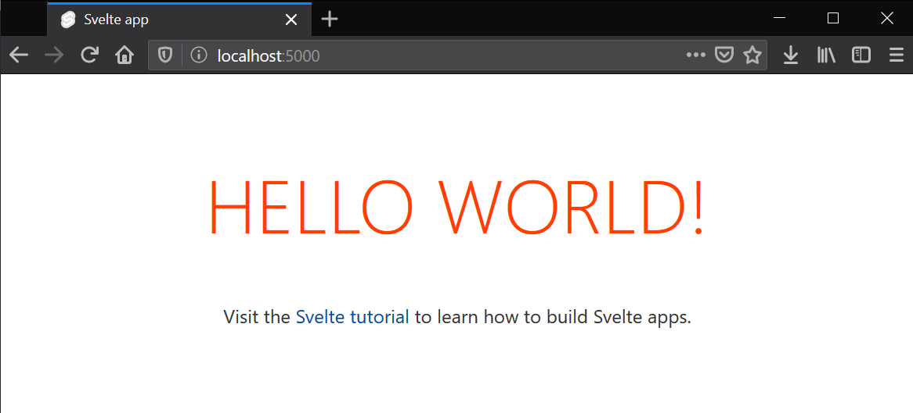
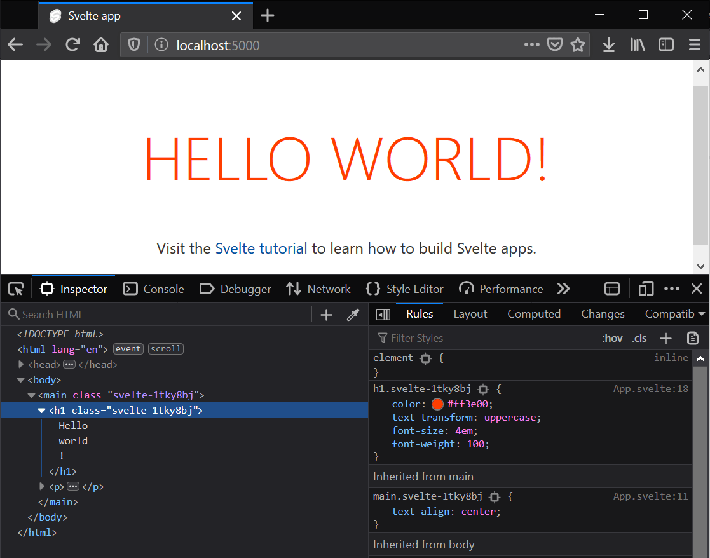

{{LearnSidebar}}
{{PreviousMenuNext("Learn/Tools_and_testing/Client-side_JavaScript_frameworks/Vue_resources","Learn/Tools_and_testing/Client-side_JavaScript_frameworks/Svelte_todo_list_beginning", "Learn/Tools_and_testing/Client-side_JavaScript_frameworks")}}

In this article we'll provide a quick introduction to the [Svelte framework](https://svelte.dev/). We will see how Svelte works and what sets it apart from the rest of the frameworks and tools we've seen so far. Then we will learn how to set up our development environment, create a sample app, understand the structure of the project, and see how to run it locally and build it for production.

<table>
  <tbody>
    <tr>
      <th scope="row">Prerequisites:</th>
      <td>
        <p>
          At minimum, it is recommended that you are familiar with the core
          <a href="/en-US/docs/Learn/HTML">HTML</a>,
          <a href="/en-US/docs/Learn/CSS">CSS</a>, and
          <a href="/en-US/docs/Learn/JavaScript">JavaScript</a> languages, and
          have knowledge of the
          <a
            href="/en-US/docs/Learn/Tools_and_testing/Understanding_client-side_tools/Command_line"
            >terminal/command line</a
          >.
        </p>
        <p>
          Svelte is a compiler that generates minimal and highly optimized
          JavaScript code from our sources; you'll need a terminal with node +
          npm installed to compile and build your app.
        </p>
      </td>
    </tr>
    <tr>
      <th scope="row">Objective:</th>
      <td>
        To setup a local Svelte development environment, create and build a
        starter app, and understand the basics of how it works.
      </td>
    </tr>
  </tbody>
</table>

## Svelte: A new approach to building rich user interfaces

Svelte provides a different approach to building web apps than some of the other frameworks covered in this module. While frameworks like React and Vue do the bulk of their work in the user's browser while the app is running, Svelte shifts that work into a compile step that happens only when you build your app, producing highly optimized vanilla JavaScript.

The outcome of this approach is not only smaller application bundles and better performance, but also a developer experience that is more approachable for people that have limited experience of the modern tooling ecosystem.

Svelte sticks closely to the classic web development model of HTML, CSS, and JS, just adding a few extensions to HTML and JavaScript. It arguably has fewer concepts and tools to learn than some of the other framework options.

Its main current disadvantages are that it is a young framework — its ecosystem is therefore more limited in terms of tooling, support, plugins, clear usage patterns, etc. than more mature frameworks, and there are also fewer job opportunities. But its advantages should be enough to make you interested to explore it.

> **Note:** recently Svelte has added [official TypeScript support](https://svelte.dev/blog/svelte-and-typescript), one of its most requested features. We'll look at it later on in this tutorial series.

We encourage you to go through the [Svelte tutorial](https://learn.svelte.dev/) for a really quick introduction to the basic concepts, before returning to this tutorial series to learn how to build something slightly more in-depth.

## Use cases

Svelte can be used to develop small pieces of an interface or whole applications. You can either start from scratch letting Svelte drive your UI or you can incrementally integrate it into an existing application.

Nevertheless, Svelte is particularly appropriate to tackle the following situations:

- Web applications intended for low-power devices: Applications built with Svelte have smaller bundle sizes, which is ideal for devices with slow network connections and limited processing power. Less code means fewer KB to download, parse, execute, and keep hanging around in memory.
- Highly interactive pages or complex visualizations: If you are building data-visualizations that need to display a large number of DOM elements, the performance gains that come from a framework with no runtime overhead will ensure that user interactions are snappy and responsive.
- Onboarding people with basic web development knowledge: Svelte has a shallow learning curve. Web developers with basic HTML, CSS, and JavaScript knowledge can easily grasp Svelte specifics in a short time and start building web applications.

The Svelte team launched [SvelteKit](https://kit.svelte.dev), a framework for building web applications using Svelte. It contains features found in modern web frameworks, such as filesystem-based routing, server-side rendering (SSR), page-specific rendering modes, offline support, and more. For more information about SvelteKit, see the [official tutorial](https://learn.svelte.dev) and [documentation](https://kit.svelte.dev/docs).

> **Note:** SvelteKit is designed to replace [Sapper](https://sapper.svelte.dev/) as the recommended Svelte framework for building web applications.

Svelte is also available for mobile development via [Svelte Native](https://svelte-native.technology).

## How does Svelte work?

Being a compiler, Svelte can extend HTML, CSS, and JavaScript, generating optimal JavaScript code without any runtime overhead. To achieve this, Svelte extends vanilla web technologies in the following ways:

- It extends HTML by allowing JavaScript expressions in markup and providing directives to use conditions and loops, in a fashion similar to handlebars.
- It extends CSS by adding a scoping mechanism, allowing each component to define its own styles without the risk of clashing with other components' styles.
- It extends JavaScript by reinterpreting specific directives of the language to achieve true reactivity and ease component state management.

The compiler only intervenes in very specific situations and only in the context of Svelte components. Extensions to the JavaScript language are minimal and carefully picked in order not to break JavaScript syntax or alienate developers. In fact, you will be mostly working with vanilla JavaScript.

## First steps with Svelte

Since Svelte is a compiler, you can't just add a `<script src="svelte.js">` tag to your page and import it into your app. You'll have to set up your development environment in order to let the compiler do its job.

### Requirements

In order to work with Svelte, you need to have [Node.js](https://nodejs.org/en/) installed. It's recommended that you use the long-term support (LTS) version. Node includes npm (the node package manager), and npx (the node package runner). Note that you can also use the Yarn package manager in place of npm, but we'll assume you are using npm in this set of tutorials. See [Package management basics](/en-US/docs/Learn/Tools_and_testing/Understanding_client-side_tools/Package_management) for more information on npm and yarn.

If you're using Windows, you will need to install some software to give you parity with Unix/macOS terminal in order to use the terminal commands mentioned in this tutorial. Gitbash (which comes as part of the [git for Windows toolset](https://gitforwindows.org/)) or [Windows Subsystem for Linux (WSL)](https://docs.microsoft.com/windows/wsl/about) are both suitable. See [Command line crash course](/en-US/docs/Learn/Tools_and_testing/Understanding_client-side_tools/Command_line) for more information on these, and on terminal commands in general.

Also see the following for more information:

- ["About npm"](https://docs.npmjs.com/about-npm) on the npm documentation
- ["Introducing npx"](https://blog.npmjs.org/post/162869356040/introducing-npx-an-npm-package-runner) on the npm blog
- ["The easiest way to get started with Svelte"](https://svelte.dev/blog/the-easiest-way-to-get-started) on the Svelte blog

### Creating your first Svelte app

The easiest way to create a starter app template is to just download the starter template application. You can do that by visiting [sveltejs/template](https://github.com/sveltejs/template) on GitHub, or you can avoid having to download and unzip it and just use [degit](https://github.com/Rich-Harris/degit).

To create your starter app template, run the following terminal commands:

```bash
npx degit sveltejs/template moz-todo-svelte
cd moz-todo-svelte
npm install
npm run dev
```

> **Note:** degit doesn't do any kind of magic — it just lets you download and unzip the latest version of a git repo's contents. This is much quicker than using `git clone` because it will not download all the history of the repo, or create a complete local clone.

After running `npm run dev`, Svelte will compile and build your application. It will start a local server at `localhost:8080`. Svelte will watch for file updates, and automatically recompile and refresh the app for you when changes are made to the source files. Your browser will display something like this:



### Application structure

The starter template comes with the following structure:

```plain
moz-todo-svelte
├── README.md
├── package.json
├── package-lock.json
├── rollup.config.js
├── .gitignore
├── node_modules
├── public
│   ├── favicon.png
│   ├── index.html
│   ├── global.css
│   └── build
│       ├── bundle.css
│       ├── bundle.js
│       └── bundle.js.map
├── scripts
│   └── setupTypeScript.js
└── src
    ├── App.svelte
    └── main.js
```

The contents are as follows:

- `package.json` and `package-lock.json`: Contains information about the project that Node.js/npm uses to keep it organized. You don't need to understand this file at all to complete this tutorial, however, if you'd like to learn more about it, you can read [What is the file `package.json`](https://nodejs.org/en/knowledge/getting-started/npm/what-is-the-file-package-json/)? on NodeJS.org; we also talk about it in our [Package management basics tutorial](/en-US/docs/Learn/Tools_and_testing/Understanding_client-side_tools/Package_management).
- `node_modules`: This is where node saves the project dependencies. These dependencies won't be sent to production, they are just used for development purposes.
- `.gitignore`: Tells git which files or folder to ignore from the project — useful if you decide to include your app in a git repo.
- `rollup.config.js`: Svelte uses [rollup.js](https://rollupjs.org/) as a module bundler. This configuration file tells rollup how to compile and build your app. If you prefer [webpack](https://webpack.js.org/), you can create your starter project with `npx degit sveltejs/template-webpack svelte-app` instead.
- `scripts`: Contains setup scripts as required. Currently should only contain `setupTypeScript.js`.

  - `setupTypeScript.js`: This script sets up TypeScript support in Svelte. We'll talk about this more in the last article.

- `src`: This directory is where the source code for your application lives — where you'll be creating the code for your app.

  - `App.svelte`: This is the top-level component of your app. So far it just renders the 'Hello World!' message.
  - `main.js`: The entry point to our application. It just instantiates the `App` component and binds it to the body of our HTML page.

- `public`: This directory contains all the files that will be published in production.

  - `favicon.png`: This is the favicon for your app. Currently, it's the Svelte logo.
  - `index.html`: This is the main page of your app. Initially it's just an empty HTML page that loads the CSS files and js bundles generated by Svelte.
  - `global.css`: This file contains unscoped styles. It's a regular CSS file that will be applied to the whole application.
  - `build`: This folder contains the generated CSS and JavaScript source code.

    - `bundle.css`: The CSS file that Svelte generated from the styles defined for each component.
    - `bundle.js`: The JavaScript file compiled from all your JavaScript source code.

## Having a look at our first Svelte component

Components are the building blocks of Svelte applications. They are written into `.svelte` files using a superset of HTML.

All three sections — `<script>`, `<style>`, and markup — are optional, and can appear in any order you like.

```html
<script>
  // logic goes here
</script>

<style>
  /* styles go here */
</style>

<!-- markup (zero or more HTML elements) goes here -->
```

> **Note:** For more information on the component format, have a look at the [Svelte documentation](https://svelte.dev/docs#Component_format).

With this in mind, let's have a look at the `src/App.svelte` file that came with the starter template. You should see something like the following:

```html
<script>
  export let name;
</script>

<main>
  <h1>Hello {name}!</h1>
  <p>
    Visit the <a href="https://learn.svelte.dev/">Svelte tutorial</a> to learn
    how to build Svelte apps.
  </p>
</main>

<style>
  main {
    text-align: center;
    padding: 1em;
    max-width: 240px;
    margin: 0 auto;
  }

  h1 {
    color: #ff3e00;
    text-transform: uppercase;
    font-size: 4em;
    font-weight: 100;
  }

  @media (min-width: 640px) {
    main {
      max-width: none;
    }
  }
</style>
```

### The `<script>` section

The `<script>` block contains JavaScript that runs when a component instance is created. Variables declared (or imported) at the top level are 'visible' from the component's markup. Top-level variables are the way Svelte handles the component state, and they are reactive by default. We will explain in detail what this means later on.

```html
<script>
  export let name;
</script>
```

Svelte uses the [`export`](/en-US/docs/Web/JavaScript/Reference/Statements/export) keyword to mark a variable declaration as a property (or prop), which means it becomes accessible to consumers of the component (e.g. other components). This is one example of Svelte extending JavaScript syntax to make it more useful, while keeping it familiar.

### The markup section

In the markup section you can insert any HTML you like, and in addition you can insert valid JavaScript expressions inside single curly brackets (`{}`). In this case we are embedding the value of the `name` prop right after the `Hello` text.

```html
<main>
  <h1>Hello {name}!</h1>
  <p>
    Visit the <a href="https://learn.svelte.dev/">Svelte tutorial</a> to learn
    how to build Svelte apps.
  </p>
</main>
```

Svelte also supports tags like `{#if}`, `{#each}`, and `{#await}` — these examples allow you to conditionally render a portion of the markup, iterate through a list of elements, and work with async values, respectively.

### The `<style>` section

If you have experience working with CSS, the following snippet should make sense:

```html
<style>
  main {
    text-align: center;
    padding: 1em;
    max-width: 240px;
    margin: 0 auto;
  }

  h1 {
    color: #ff3e00;
    text-transform: uppercase;
    font-size: 4em;
    font-weight: 100;
  }

  @media (min-width: 640px) {
    main {
      max-width: none;
    }
  }
</style>
```

We are applying a style to our [`<h1>`](/en-US/docs/Web/HTML/Element/Heading_Elements) element. What will happen to other components with `<h1>` elements in them?

In Svelte, CSS inside a component's `<style>` block will be scoped only to that component. This works by adding a class to selected elements, which is based on a hash of the component styles.

You can see this in action by opening `localhost:8080` in a new browser tab, right/<kbd>Ctrl</kbd>-clicking on the _HELLO WORLD!_ label, and choosing _Inspect_:



When compiling the app, Svelte changes our `h1` styles definition to `h1.svelte-1tky8bj`, and then modifies every `<h1>` element in our component to `<h1 class="svelte-1tky8bj">`, so that it picks up the styles as required.

> **Note:** You can override this behavior and apply styles to a selector globally using the `:global()` modifier (see the [Svelte `<style>` docs](https://svelte.dev/docs#style) for more information).

## Making a couple of changes

Now that we have a general idea of how it all fits together, we can start making a few changes.
At this point you can try updating your `App.svelte` component — for example change the `<h1>` element on line 6 of `App.svelte` so that it reads like this:

```html
<h1>Hello {name} from MDN!</h1>
```

Just save your changes and the app running at `localhost:8080` will be automatically updated.

### A first look at Svelte reactivity

In the context of a UI framework, reactivity means that the framework can automatically update the DOM when the state of any component is changed.

In Svelte, reactivity is triggered by assigning a new value to any top-level variable in a component. For example, we could include a `toggleName()` function in our `App` component, and a button to run it.

Try updating your `<script>` and markup sections like so:

```html
<script>
  export let name;

  function toggleName() {
    if (name === "world") {
      name = "Svelte";
    } else {
      name = "world";
    }
  }
</script>

<main>
  <h1>Hello {name}!</h1>
  <button on:click="{toggleName}">Toggle name</button>
  <p>
    Visit the <a href="https://learn.svelte.dev/">Svelte tutorial</a> to learn
    how to build Svelte apps.
  </p>
</main>
```

Whenever the button is clicked, Svelte executes the `toggleName()` function, which in turn updates the value of the `name` variable.

As you can see, the `<h1>` label is automatically updated. Behind the scenes, Svelte created the JavaScript code to update the DOM whenever the value of the name variable changes, without using any virtual DOM or other complex reconciliation mechanism.

Note the use of `:` in `on:click`. That's Svelte's syntax for listening to DOM events.

## Inspecting main.js: the entry point of our app

Let's open `src/main.js`, which is where the `App` component is being imported and used. This file is the entry point for our app, and it initially looks like this:

```js
import App from "./App.svelte";

const app = new App({
  target: document.body,
  props: {
    name: "world",
  },
});

export default app;
```

`main.js` starts by importing the Svelte component that we are going to use. Then in line 3 it instantiates it, passing an option object with the following properties:

- `target`: The DOM element inside which we want the component to be rendered, in this case the `<body>` element.
- `props`: the values to assign to each prop of the `App` component.

## A look under the hood

How does Svelte manage to make all these files work together nicely?

The Svelte compiler processes the `<style>` section of every component and compiles them into the `public/build/bundle.css` file.

It also compiles the markup and `<script>` section of every component and stores the result in `public/build/bundle.js`. It also adds the code in `src/main.js` to reference the features of each component.

Finally the file `public/index.html` includes the generated `bundle.css` and `bundle.js` files:

```html
<!doctype html>
<html lang="en">
  <head>
    <meta charset="utf-8" />
    <meta name="viewport" content="width=device-width,initial-scale=1" />

    <title>Svelte app</title>

    <link rel="icon" type="image/png" href="/favicon.png" />
    <link rel="stylesheet" href="/global.css" />
    <link rel="stylesheet" href="/build/bundle.css" />

    <script defer src="/build/bundle.js"></script>
  </head>

  <body></body>
</html>
```

The minified version of `bundle.js` weighs a little more than 3KB, which includes the "Svelte runtime" (just 300 lines of JavaScript code) and the `App.svelte` compiled component. As you can see, `bundle.js` is the only JavaScript file referenced by `index.html`. There are no other libraries loaded into the web page.

This is a much smaller footprint than compiled bundles from other frameworks. Take into account that, in the case of code bundles, it's not just the size of the files you have to download that matter. This is executable code that needs to be parsed, executed, and kept in memory. So this really makes a difference, especially in low-powered devices or CPU-intensive applications.

## Following this tutorial

In this tutorial series you will be building a complete web application. We'll learn all the basics about Svelte and also quite a few advanced topics.

You can just read the content to get a good understanding of Svelte features, but you'll get the most out of this tutorial if you follow along coding the app with us as you go. To make it easier for you to follow each article, we provide a GitHub repository with a folder containing the source for the app as it is at the start of each tutorial.

Svelte also provides an online REPL, which is a playground for live-coding Svelte apps on the web without having to install anything on your machine. We provide a REPL for each article so you can start coding along right away. Let's talk a bit more about how to use these tools.

### Using Git

The most popular version control system is Git, along with GitHub, a site that provides hosting for your repositories and several tools for working with them.

We'll be using GitHub so that you can easily download the source code for each article. You will also be able to get the code as it should be after completing the article, just in case you get lost.

After [installing git](https://git-scm.com/downloads), to clone the repository you should execute:

```bash
git clone https://github.com/opensas/mdn-svelte-tutorial.git
```

Then at the beginning of each article, you can just `cd` into the corresponding folder and start the app in dev mode to see what its current state should be, like this:

```bash
cd 02-starting-our-todo-app
npm install
npm run dev
```

If you want lo learn more about git and GitHub, we've compiled a list of links to useful guides — see [Git and GitHub](/en-US/docs/Learn/Tools_and_testing/GitHub).

> **Note:** If you just want to download the files without cloning the git repo, you can use the degit tool like this — `npx degit opensas/mdn-svelte-tutorial`. You can also download a specific folder with `npx degit opensas/mdn-svelte-tutorial/01-getting-started`. Degit won't create a local git repo, it will just download the files of the specified folder.

### Using the Svelte REPL

A REPL ([read–eval–print loop](https://en.wikipedia.org/wiki/Read%E2%80%93eval%E2%80%93print_loop)) is an interactive environment that allows you to enter commands and immediately see the results — many programming languages provide a REPL.

Svelte's REPL is much more than that. It's an online tool that allows you to create complete apps, save them online, and share with others.

It's the easiest way to start playing with Svelte from any machine, without having to install anything. It is also widely used by Svelte community. If you want to share an idea, ask for help, or report an issue, it's always extremely useful to create a REPL instance demonstrating the issue.

Let's have a quick look at the Svelte REPL and how you'd use it. It looks like so:


To start a REPL, open your browser and navigate to <https://svelte.dev/repl>.

- On the left side of the screen you'll see the code of your components, and on the right you'll see the running output of your app.
- The bar above the code lets you create `.svelte` and `.js` files and rearrange them. To create a file inside a folder, just specify the complete pathname, like this: `components/MyComponent.svelte`. The folder will be automatically created.
- Above that bar you have the title of the REPL. Click on it to edit it.
- On the right side you have three tabs:

  - The _Result_ tab shows your app output, and provides a console at the bottom.
  - The _JS output_ tab lets you inspect the JavaScript code generated by Svelte and set compiler options.
  - The _CSS output_ tab shows the CSS generated by Svelte.

- Above the tabs, you'll find a toolbar that lets you enter fullscreen mode and download your app. If you log in with a GitHub account, you'll also be able to fork and save the app. You'll also be able to see all your saved REPLs by clicking on your GitHub username profile and selecting _Your saved apps_.

Whenever you change any file on the REPL, Svelte will recompile the app and update the Result tab. To share your app, share the URL. For example, here's the link for a REPL running our complete app: <https://svelte.dev/repl/378dd79e0dfe4486a8f10823f3813190?version=3.23.2>.

> **Note:** Notice how you can specify Svelte's version in the URL. This is useful when reporting issues related to a specific version of Svelte.

We will provide a REPL at the beginning and end of each article so that you can start coding with us right away.

> **Note:** At the moment the REPL can't handle folder names properly. If you are following the tutorial on the REPL, just create all your components inside the root folder. Then when you see a path in the code, for example `import Todos from './components/Todos.svelte'`, just replace it with a flat URL, e.g. `import Todos from './Todos.svelte'`.

## The code so far

### Git

Clone the GitHub repo (if you haven't already done it) with:

```bash
git clone https://github.com/opensas/mdn-svelte-tutorial.git
```

Then to get to the current app state, run

```bash
cd mdn-svelte-tutorial/01-getting-started
```

Or directly download the folder's content:

```bash
npx degit opensas/mdn-svelte-tutorial/01-getting-started
```

Remember to run `npm install && npm run dev` to start your app in development mode.

### REPL

To code along with us using the REPL, start at

<https://svelte.dev/repl/fc68b4f059d34b9c84fa042d1cce586c?version=3.23.2>

## Summary

This brings us to the end of our initial look at Svelte, including how to install it locally, create a starter app, and how the basics work. In the next article we'll start building our first proper application, a todo list. Before we do that, however, let's recap some of the things we've learned.

In Svelte:

- We define the script, style, and markup of each component in a single `.svelte` file.
- Component props are declared with the `export` keyword.
- Svelte components can be used just by importing the corresponding `.svelte` file.
- Components styles are scoped, keeping them from clashing with each other.
- In the markup section you can include any JavaScript expression by putting it between curly braces.
- The top-level variables of a component constitute its state.
- Reactivity is fired just by assigning a new value to a top-level variable.

{{PreviousMenuNext("Learn/Tools_and_testing/Client-side_JavaScript_frameworks/Vue_resources","Learn/Tools_and_testing/Client-side_JavaScript_frameworks/Svelte_todo_list_beginning", "Learn/Tools_and_testing/Client-side_JavaScript_frameworks")}}
