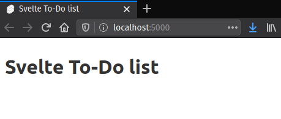
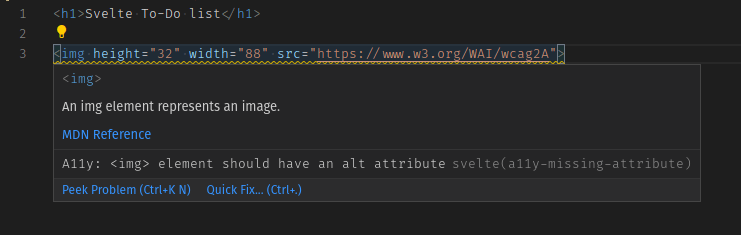
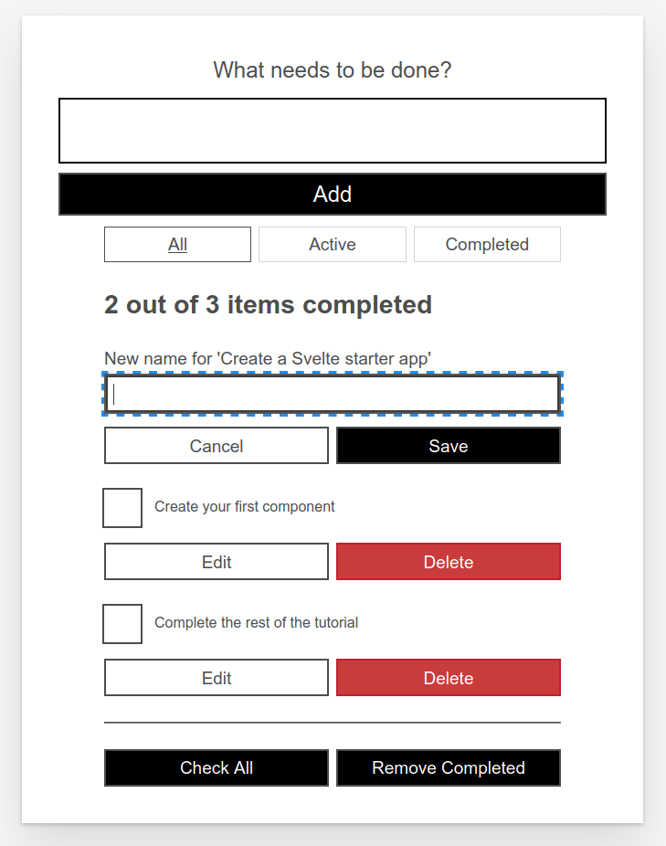

{{LearnSidebar}}
{{PreviousMenuNext("Learn/Tools_and_testing/Client-side_JavaScript_frameworks/Svelte_getting_started","Learn/Tools_and_testing/Client-side_JavaScript_frameworks/Svelte_variables_props", "Learn/Tools_and_testing/Client-side_JavaScript_frameworks")}}

Now that we have a basic understanding of how things work in Svelte, we can start building our example app: a to-do list. In this article we will first have a look at the desired functionality of our app, and then we'll create a `Todos.svelte` component and put static markup and styles in place, leaving everything ready to start developing our to-do list app features, which we'll go on to in subsequent articles.

We want our users to be able to browse, add and delete tasks, and also to mark them as complete. This will be the basic functionality that we'll be developing in this tutorial series, and we'll look at some more advanced concepts along the way too.

<table>
  <tbody>
    <tr>
      <th scope="row">Prerequisites:</th>
      <td>
        <p>
          At minimum, it is recommended that you are familiar with the core
          <a href="/en-US/docs/Learn/HTML">HTML</a>,
          <a href="/en-US/docs/Learn/CSS">CSS</a>, and
          <a href="/en-US/docs/Learn/JavaScript">JavaScript</a> languages, and
          have knowledge of the
          <a
            href="/en-US/docs/Learn/Tools_and_testing/Understanding_client-side_tools/Command_line"
            >terminal/command line</a
          >.
        </p>
        <p>
          You'll need a terminal with node + npm installed to compile and build
          your app.
        </p>
      </td>
    </tr>
    <tr>
      <th scope="row">Objective:</th>
      <td>
        To learn how to create a Svelte component, render it inside another
        component, pass data into it using props, and save its state.
      </td>
    </tr>
  </tbody>
</table>

## Code along with us

### Git

Clone the GitHub repo (if you haven't already done it) with:

```bash
git clone https://github.com/opensas/mdn-svelte-tutorial.git
```

Then to get to the current app state, run

```bash
cd mdn-svelte-tutorial/02-starting-our-todo-app
```

Or directly download the folder's content:

```bash
npx degit opensas/mdn-svelte-tutorial/02-starting-our-todo-app
```

Remember to run `npm install && npm run dev` to start your app in development mode.

### REPL

To code along with us using the REPL, start at

<https://svelte.dev/repl/b7b831ea3a354d3789cefbc31e2ca495?version=3.23.2>

## To-do list app features

This is what our to-do list app will look like once it's ready:


Using this UI our user will be able to:

- Browse their tasks
- Mark tasks as completed/pending without deleting them
- Remove tasks
- Add new tasks
- Filter tasks by status: all tasks, active tasks, or completed tasks
- Edit tasks
- Mark all tasks as active/completed
- Remove all completed tasks

## Building our first component

Let's create a `Todos.svelte` component. This will contain our list of to-dos.

1. Create a new folder — `src/components`.

    > **Note:** You can put your components anywhere inside the `src` folder, but the `components` folder is a recognized convention to follow, allowing you to find your components easily.

2. Create a file named `src/components/Todos.svelte` with the following content:

    ```html
    <h1>Svelte to-do list</h1>
    ```

3. Change the `title` element in `public/index.html` to contain the text _Svelte to-do list_:

    ```html
    <title>Svelte to-do list</title>
    ```

4. Open `src/App.svelte` and replace its contents with the following:

    ```html
    <script>
      import Todos from './components/Todos.svelte'
    </script>

    <Todos />
    ```

5. In development mode, Svelte will issue a warning in the browser console when specifying a prop that doesn't exist in the component; in this case we have a `name` prop being specified when we instantiate the `App` component inside `src/main.js`, which isn't used inside `App`. The console should currently give you a message along the lines of "\<App> was created with unknown prop 'name'". To get rid of this, remove the `name` prop from `src/main.js`; it should now look like so:

    ```js
    import App from './App.svelte'

    const app = new App({
      target: document.body
    })

    export default app
    ```

Now if you check your testing server URL you'll see our `Todos.svelte` component being rendered:



## Adding static markup

For the moment we will start with a static markup representation of our app, so you can see what it will look like. Copy and paste the following into our `Todos.svelte` component file, replacing the existing content:

```html
<!-- Todos.svelte -->
<div class="todoapp stack-large">

  <!-- NewTodo -->
  <form>
    <h2 class="label-wrapper">
      <label for="todo-0" class="label__lg">
        What needs to be done?
      </label>
    </h2>
    <input type="text" id="todo-0" autocomplete="off"
      class="input input__lg" />
    <button type="submit" disabled="" class="btn btn__primary btn__lg">
      Add
    </button>
  </form>

  <!-- Filter -->
  <div class="filters btn-group stack-exception">
    <button class="btn toggle-btn" aria-pressed="true">
      <span class="visually-hidden">Show</span>
      <span>All</span>
      <span class="visually-hidden">tasks</span>
    </button>
    <button class="btn toggle-btn" aria-pressed="false">
      <span class="visually-hidden">Show</span>
      <span>Active</span>
      <span class="visually-hidden">tasks</span>
    </button>
    <button class="btn toggle-btn" aria-pressed="false">
      <span class="visually-hidden">Show</span>
      <span>Completed</span>
      <span class="visually-hidden">tasks</span>
    </button>
  </div>

  <!-- TodosStatus -->
  <h2 id="list-heading">2 out of 3 items completed</h2>

  <!-- Todos -->
  <ul role="list" class="todo-list stack-large" aria-labelledby="list-heading">

    <!-- todo-1 (editing mode) -->
    <li class="todo">
      <div class="stack-small">
        <form class="stack-small">
          <div class="form-group">
            <label for="todo-1" class="todo-label">
              New name for 'Create a Svelte starter app'
            </label>
            <input type="text" id="todo-1" autocomplete="off" class="todo-text" />
          </div>
          <div class="btn-group">
            <button class="btn todo-cancel" type="button">
              Cancel
              <span class="visually-hidden">renaming Create a Svelte starter app</span>
            </button>
            <button class="btn btn__primary todo-edit" type="submit">
              Save
              <span class="visually-hidden">new name for Create a Svelte starter app</span>
            </button>
          </div>
        </form>
      </div>
    </li>

    <!-- todo-2 -->
    <li class="todo">
      <div class="stack-small">
        <div class="c-cb">
          <input type="checkbox" id="todo-2" checked/>
          <label for="todo-2" class="todo-label">
            Create your first component
          </label>
        </div>
        <div class="btn-group">
          <button type="button" class="btn">
            Edit
            <span class="visually-hidden">Create your first component</span>
          </button>
          <button type="button" class="btn btn__danger">
            Delete
            <span class="visually-hidden">Create your first component</span>
          </button>
        </div>
      </div>
    </li>

    <!-- todo-3 -->
    <li class="todo">
      <div class="stack-small">
        <div class="c-cb">
          <input type="checkbox" id="todo-3" />
          <label for="todo-3" class="todo-label">
            Complete the rest of the tutorial
          </label>
        </div>
        <div class="btn-group">
          <button type="button" class="btn">
            Edit
            <span class="visually-hidden">Complete the rest of the tutorial</span>
          </button>
          <button type="button" class="btn btn__danger">
            Delete
            <span class="visually-hidden">Complete the rest of the tutorial</span>
          </button>
        </div>
      </div>
    </li>
  </ul>

  <hr />

  <!-- MoreActions -->
  <div class="btn-group">
    <button type="button" class="btn btn__primary">Check all</button>
    <button type="button" class="btn btn__primary">Remove completed</button>
  </div>

</div>
```

Check the rendered out again, and you'll see something like this:


The HTML markup above is not very nicely styled and it's also functionally useless. Nevertheless, let's have a look at the markup and see how it relates to our desired features:

- A label and a text box for entering new tasks
- Three buttons to filter by task status
- A label showing the total number of tasks and the completed tasks
- An unordered list, which holds a list item for each task
- When the task is being edited, the list item has an input and two button to cancel or save modifications
- If the task is not being edited, there's a checkbox to set the completed status, and two buttons to edit or delete the task
- Finally there are two buttons to check/uncheck all task and to remove completed tasks

In subsequent articles we'll get all these features working, and more besides.

### Accessibility features of the to-do list

You may notice some unusual attributes here. For example:

```html
<button class="btn toggle-btn" aria-pressed="true">
  <span class="visually-hidden">Show</span>
  <span>All</span>
  <span class="visually-hidden">tasks</span>
</button>
```

Here, `aria-pressed` tells assistive technology (like screen readers) that the button can be in one of two states: `pressed` or `unpressed`. Think of these as analogs for on and off. Setting a value of `true` means that the button is pressed by default.

The class `visually-hidden` has no effect yet, because we have not included any CSS. Once we have put our styles in place, though, any element with this class will be hidden from sighted users and still available to screen reader users — this is because these words are not needed by sighted users; they are there to provide more information about what the button does for screen reader users that do not have the extra visual context to help them.

Further down, you can find the following `<ul>` element:

```html
<ul role="list" className="todo-list stack-large" aria-labelledby="list-heading">
```

The `role` attribute helps assistive technology explain what kind of semantic value an element has — or what its purpose is. A `<ul>` is treated like a list by default, but the styles we're about to add will break that functionality. This role will restore the "list" meaning to the `<ul>` element. If you want to learn more about why this is necessary, you can check out Scott O'Hara's article "Fixing Lists".

The `aria-labelledby` attribute tells assistive technologies that we're treating our `<h2>` with an `id` of `list-heading` as the label that describes the purpose of the list beneath it. Making this association gives the list a more informative context, which could help screen reader users better understand the purpose of it.

This seems like a good time to talk about how Svelte deals with accessibility; let's do that now.

## Svelte accessibility support

Svelte has a special emphasis on accessibility. The intention is to encourage developers to write more accessible code "by default". Being a compiler, Svelte can statically analyze our HTML templates to provide accessibility warnings when components are being compiled.

Accessibility (shortened to a11y) isn't always easy to get right, but Svelte will help by warning you if you write inaccessible markup.

For example, if we add an `` element to our `todos.svelte` component without its corresponding `alt` prop:

```html
<h1>Svelte To-Do list</h1>


```

The compiler will issue the following warning:

```bash
(!) Plugin svelte: A11y:  element should have an alt attribute
src/components/Todos.svelte
1: <h1>Svelte To-Do list</h1>
2:
3: 
   ^
created public/build/bundle.js in 220ms

[2020-07-15 04:07:43] waiting for changes...
```

Moreover, our editor can display this warning even before calling the compiler:



You can tell Svelte to ignore this warning for the next block of markup with a [comment](https://svelte.dev/docs#Comments) beginning with `svelte-ignore`, like this:

```html
<!-- svelte-ignore a11y-missing-attribute -->

```

> **Note:** With VSCode you can automatically add this ignore comment by clicking on the _Quick fix…_ link or pressing <kbd>Ctrl</kbd> + <kbd>.</kbd>.

If you want to globally disable this warning, you can add this `onwarn` handler to your `rollup.config.js` file inside the configuration for the `Svelte` plugin, like this:

```js
plugins: [
  svelte({
    dev: !production,
    css: (css) => {
      css.write('public/build/bundle.css');
    },
    // Warnings are normally passed straight to Rollup. You can
    // optionally handle them here, for example to squelch
    // warnings with a particular code
    onwarn: (warning, handler) => {
      // e.g. I don't care about screen readers -> please DON'T DO THIS!!!
      if (warning.code === 'a11y-missing-attribute') return;

      // let Rollup handle all other warnings normally
      handler(warning);
    }
  }),

  // …
]
```

By design, these warnings are implemented in the compiler itself, and not as a plug-in that you may choose to add to your project. The idea is to check for a11y issues in your markup by default and let you opt out of specific warnings.

> **Note:** You should only disable these warnings if you have good reasons to do so, for example while building a quick prototype. It's important to be a good web citizen and make your pages accessible to the broadest possible userbase.

The accessibility rules checked by Svelte are taken from [eslint-plugin-jsx-a11y](https://github.com/jsx-eslint/eslint-plugin-jsx-a11y#supported-rules), a plugin for ESLint that provides static checks for many accessibility rules on JSX elements. Svelte aims to implement all of them in its compiler, and most of them have already been ported to Svelte. On GitHub you can see [which accessibility checks are still missing](https://github.com/sveltejs/svelte/issues/820). You can check the meaning of each rule by clicking on its link.

## Styling our markup

Let's make the to-do list look a little better. Replace the contents of the file `public/global.css` with the following:

```css
/* RESETS */
*,
*::before,
*::after {
  box-sizing: border-box;
}
*:focus {
  outline: 3px dashed #228bec;
  outline-offset: 0;
}
html {
  font: 62.5% / 1.15 sans-serif;
}
h1,
h2 {
  margin-bottom: 0;
}
ul {
  list-style: none;
  padding: 0;
}
button {
  border: none;
  margin: 0;
  padding: 0;
  width: auto;
  overflow: visible;
  background: transparent;
  color: inherit;
  font: inherit;
  line-height: normal;
  -webkit-font-smoothing: inherit;
  -moz-osx-font-smoothing: inherit;
  appearance: none;
}
button::-moz-focus-inner {
  border: 0;
}
button,
input,
optgroup,
select,
textarea {
  font-family: inherit;
  font-size: 100%;
  line-height: 1.15;
  margin: 0;
}
button,
input {
  overflow: visible;
}
input[type="text"] {
  border-radius: 0;
}
body {
  width: 100%;
  max-width: 68rem;
  margin: 0 auto;
  font: 1.6rem/1.25 Arial, sans-serif;
  background-color: #f5f5f5;
  color: #4d4d4d;
}
@media screen and (min-width: 620px) {
  body {
    font-size: 1.9rem;
    line-height: 1.31579;
  }
}
/*END RESETS*/

/* GLOBAL STYLES */
.form-group > input[type="text"] {
  display: inline-block;
  margin-top: 0.4rem;
}
.btn {
  padding: 0.8rem 1rem 0.7rem;
  border: 0.2rem solid #4d4d4d;
  cursor: pointer;
  text-transform: capitalize;
}
.btn.toggle-btn {
  border-width: 1px;
  border-color: #d3d3d3;
}
.btn.toggle-btn[aria-pressed="true"] {
  text-decoration: underline;
  border-color: #4d4d4d;
}
.btn__danger {
  color: #fff;
  background-color: #ca3c3c;
  border-color: #bd2130;
}
.btn__filter {
  border-color: lightgrey;
}
.btn__primary {
  color: #fff;
  background-color: #000;
}
.btn__primary:disabled {
  color: darkgrey;
  background-color:#565656;
}
.btn-group {
  display: flex;
  justify-content: space-between;
}
.btn-group > * {
  flex: 1 1 49%;
}
.btn-group > * + * {
  margin-left: 0.8rem;
}
.label-wrapper {
  margin: 0;
  flex: 0 0 100%;
  text-align: center;
}
.visually-hidden {
  position: absolute !important;
  height: 1px;
  width: 1px;
  overflow: hidden;
  clip: rect(1px 1px 1px 1px);
  clip: rect(1px, 1px, 1px, 1px);
  white-space: nowrap;
}
[class*="stack"] > * {
  margin-top: 0;
  margin-bottom: 0;
}
.stack-small > * + * {
  margin-top: 1.25rem;
}
.stack-large > * + * {
  margin-top: 2.5rem;
}
@media screen and (min-width: 550px) {
  .stack-small > * + * {
    margin-top: 1.4rem;
  }
  .stack-large > * + * {
    margin-top: 2.8rem;
  }
}
.stack-exception {
  margin-top: 1.2rem;
}
/* END GLOBAL STYLES */

.todoapp {
  background: #fff;
  margin: 2rem 0 4rem 0;
  padding: 1rem;
  position: relative;
  box-shadow: 0 2px 4px 0 rgba(0, 0, 0, 0.2), 0 2.5rem 5rem 0 rgba(0, 0, 0, 0.1);
}
@media screen and (min-width: 550px) {
  .todoapp {
    padding: 4rem;
  }
}
.todoapp > * {
  max-width: 50rem;
  margin-left: auto;
  margin-right: auto;
}
.todoapp > form {
  max-width: 100%;
}
.todoapp > h1 {
  display: block;
  max-width: 100%;
  text-align: center;
  margin: 0;
  margin-bottom: 1rem;
}
.label__lg {
  line-height: 1.01567;
  font-weight: 300;
  padding: 0.8rem;
  margin-bottom: 1rem;
  text-align: center;
}
.input__lg {
  padding: 2rem;
  border: 2px solid #000;
}
.input__lg:focus {
  border-color: #4d4d4d;
  box-shadow: inset 0 0 0 2px;
}
[class*="__lg"] {
  display: inline-block;
  width: 100%;
  font-size: 1.9rem;
}
[class*="__lg"]:not(:last-child) {
  margin-bottom: 1rem;
}
@media screen and (min-width: 620px) {
  [class*="__lg"] {
    font-size: 2.4rem;
  }
}
.filters {
  width: 100%;
  margin: unset auto;
}
/* Todo item styles */
.todo {
  display: flex;
  flex-direction: row;
  flex-wrap: wrap;
}
.todo > * {
  flex: 0 0 100%;
}
.todo-text {
  width: 100%;
  min-height: 4.4rem;
  padding: 0.4rem 0.8rem;
  border: 2px solid #565656;
}
.todo-text:focus {
  box-shadow: inset 0 0 0 2px;
}
/* CHECKBOX STYLES */
.c-cb {
  box-sizing: border-box;
  font-family: Arial, sans-serif;
  -webkit-font-smoothing: antialiased;
  font-weight: 400;
  font-size: 1.6rem;
  line-height: 1.25;
  display: block;
  position: relative;
  min-height: 44px;
  padding-left: 40px;
  clear: left;
}
.c-cb > label::before,
.c-cb > input[type="checkbox"] {
  box-sizing: border-box;
  top: -2px;
  left: -2px;
  width: 44px;
  height: 44px;
}
.c-cb > input[type="checkbox"] {
  -webkit-font-smoothing: antialiased;
  cursor: pointer;
  position: absolute;
  z-index: 1;
  margin: 0;
  opacity: 0;
}
.c-cb > label {
  font-size: inherit;
  font-family: inherit;
  line-height: inherit;
  display: inline-block;
  margin-bottom: 0;
  padding: 8px 15px 5px;
  cursor: pointer;
  touch-action: manipulation;
}
.c-cb > label::before {
  content: "";
  position: absolute;
  border: 2px solid currentcolor;
  background: transparent;
}
.c-cb > input[type="checkbox"]:focus + label::before {
  border-width: 4px;
  outline: 3px dashed #228bec;
}
.c-cb > label::after {
  box-sizing: content-box;
  content: "";
  position: absolute;
  top: 11px;
  left: 9px;
  width: 18px;
  height: 7px;
  transform: rotate(-45deg);
  border: solid;
  border-width: 0 0 5px 5px;
  border-top-color: transparent;
  opacity: 0;
  background: transparent;
}
.c-cb > input[type="checkbox"]:checked + label::after {
  opacity: 1;
}
```

With our markup styled, everything now looks better:



## The code so far

### Git

To see the state of the code as it should be at the end of this article, access your copy of our repo like this:

```bash
cd mdn-svelte-tutorial/03-adding-dynamic-behavior
```

Or directly download the folder's content:

```bash
npx degit opensas/mdn-svelte-tutorial/03-adding-dynamic-behavior
```

Remember to run `npm install && npm run dev` to start your app in development mode.

### REPL

To see the current state of the code in a REPL, visit:

<https://svelte.dev/repl/c862d964d48d473ca63ab91709a0a5a0?version=3.23.2>

## Summary

With our markup and styling in place, our to-do list app is starting to take shape, and we have everything ready so that we can start to focus on the features we have to implement.

{{PreviousMenuNext("Learn/Tools_and_testing/Client-side_JavaScript_frameworks/Svelte_getting_started","Learn/Tools_and_testing/Client-side_JavaScript_frameworks/Svelte_variables_props", "Learn/Tools_and_testing/Client-side_JavaScript_frameworks")}}

## In this module

- [Introduction to client-side frameworks](/en-US/docs/Learn/Tools_and_testing/Client-side_JavaScript_frameworks/Introduction)
- [Framework main features](/en-US/docs/Learn/Tools_and_testing/Client-side_JavaScript_frameworks/Main_features)
- React

  - [Getting started with React](/en-US/docs/Learn/Tools_and_testing/Client-side_JavaScript_frameworks/React_getting_started)
  - [Beginning our React to-do list](/en-US/docs/Learn/Tools_and_testing/Client-side_JavaScript_frameworks/React_todo_list_beginning)
  - [Componentizing our React app](/en-US/docs/Learn/Tools_and_testing/Client-side_JavaScript_frameworks/React_components)
  - [React interactivity: Events and state](/en-US/docs/Learn/Tools_and_testing/Client-side_JavaScript_frameworks/React_interactivity_events_state)
  - [React interactivity: Editing, filtering, conditional rendering](/en-US/docs/Learn/Tools_and_testing/Client-side_JavaScript_frameworks/React_interactivity_filtering_conditional_rendering)
  - [Accessibility in React](/en-US/docs/Learn/Tools_and_testing/Client-side_JavaScript_frameworks/React_accessibility)
  - [React resources](/en-US/docs/Learn/Tools_and_testing/Client-side_JavaScript_frameworks/React_resources)

- Ember

  - [Getting started with Ember](/en-US/docs/Learn/Tools_and_testing/Client-side_JavaScript_frameworks/Ember_getting_started)
  - [Ember app structure and componentization](/en-US/docs/Learn/Tools_and_testing/Client-side_JavaScript_frameworks/Ember_structure_componentization)
  - [Ember interactivity: Events, classes and state](/en-US/docs/Learn/Tools_and_testing/Client-side_JavaScript_frameworks/Ember_interactivity_events_state)
  - [Ember Interactivity: Footer functionality, conditional rendering](/en-US/docs/Learn/Tools_and_testing/Client-side_JavaScript_frameworks/Ember_conditional_footer)
  - [Routing in Ember](/en-US/docs/Learn/Tools_and_testing/Client-side_JavaScript_frameworks/Ember_routing)
  - [Ember resources and troubleshooting](/en-US/docs/Learn/Tools_and_testing/Client-side_JavaScript_frameworks/Ember_resources)

- Vue

  - [Getting started with Vue](/en-US/docs/Learn/Tools_and_testing/Client-side_JavaScript_frameworks/Vue_getting_started)
  - [Creating our first Vue component](/en-US/docs/Learn/Tools_and_testing/Client-side_JavaScript_frameworks/Vue_first_component)
  - [Rendering a list of Vue components](/en-US/docs/Learn/Tools_and_testing/Client-side_JavaScript_frameworks/Vue_rendering_lists)
  - [Adding a new todo form: Vue events, methods, and models](/en-US/docs/Learn/Tools_and_testing/Client-side_JavaScript_frameworks/Vue_methods_events_models)
  - [Styling Vue components with CSS](/en-US/docs/Learn/Tools_and_testing/Client-side_JavaScript_frameworks/Vue_styling)
  - [Using Vue computed properties](/en-US/docs/Learn/Tools_and_testing/Client-side_JavaScript_frameworks/Vue_computed_properties)
  - [Vue conditional rendering: editing existing to-dos](/en-US/docs/Learn/Tools_and_testing/Client-side_JavaScript_frameworks/Vue_conditional_rendering)
  - [Focus management with Vue refs](/en-US/docs/Learn/Tools_and_testing/Client-side_JavaScript_frameworks/Vue_refs_focus_management)
  - [Vue resources](/en-US/docs/Learn/Tools_and_testing/Client-side_JavaScript_frameworks/Vue_resources)

- Svelte

  - [Getting started with Svelte](/en-US/docs/Learn/Tools_and_testing/Client-side_JavaScript_frameworks/Svelte_getting_started)
  - [Starting our Svelte to-do list app](/en-US/docs/Learn/Tools_and_testing/Client-side_JavaScript_frameworks/Svelte_Todo_list_beginning)
  - [Dynamic behavior in Svelte: working with variables and props](/en-US/docs/Learn/Tools_and_testing/Client-side_JavaScript_frameworks/Svelte_variables_props)
  - [Componentizing our Svelte app](/en-US/docs/Learn/Tools_and_testing/Client-side_JavaScript_frameworks/Svelte_components)
  - [Advanced Svelte: Reactivity, lifecycle, accessibility](/en-US/docs/Learn/Tools_and_testing/Client-side_JavaScript_frameworks/Svelte_reactivity_lifecycle_accessibility)
  - [Working with Svelte stores](/en-US/docs/Learn/Tools_and_testing/Client-side_JavaScript_frameworks/Svelte_stores)
  - [TypeScript support in Svelte](/en-US/docs/Learn/Tools_and_testing/Client-side_JavaScript_frameworks/Svelte_TypeScript)
  - [Deployment and next steps](/en-US/docs/Learn/Tools_and_testing/Client-side_JavaScript_frameworks/Svelte_deployment_next)

- Angular

  - [Getting started with Angular](/en-US/docs/Learn/Tools_and_testing/Client-side_JavaScript_frameworks/Angular_getting_started)
  - [Beginning our Angular to-do list app](/en-US/docs/Learn/Tools_and_testing/Client-side_JavaScript_frameworks/Angular_todo_list_beginning)
  - [Styling our Angular app](/en-US/docs/Learn/Tools_and_testing/Client-side_JavaScript_frameworks/Angular_styling)
  - [Creating an item component](/en-US/docs/Learn/Tools_and_testing/Client-side_JavaScript_frameworks/Angular_item_component)
  - [Filtering our to-do items](/en-US/docs/Learn/Tools_and_testing/Client-side_JavaScript_frameworks/Angular_filtering)
  - [Building Angular applications and further resources](/en-US/docs/Learn/Tools_and_testing/Client-side_JavaScript_frameworks/Angular_building)
