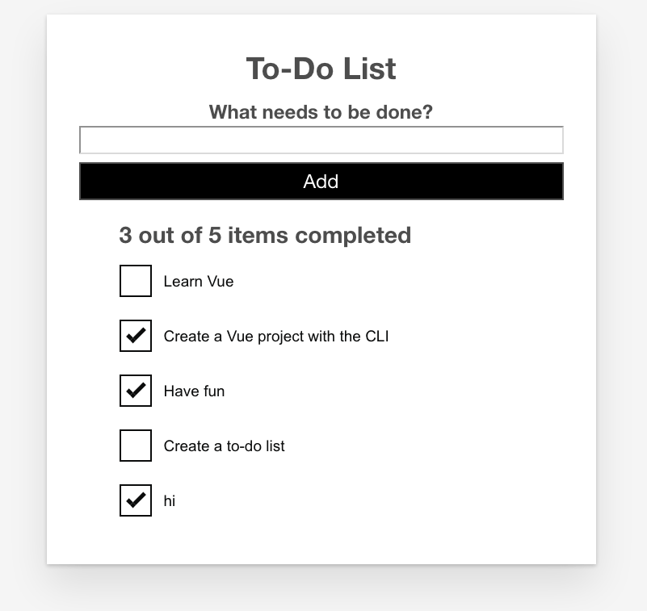

{{LearnSidebar}}{{PreviousMenuNext("Learn/Tools_and_testing/Client-side_JavaScript_frameworks/Vue_styling","Learn/Tools_and_testing/Client-side_JavaScript_frameworks/Vue_conditional_rendering", "Learn/Tools_and_testing/Client-side_JavaScript_frameworks")}}

In this article we'll add a counter that displays the number of completed todo items, using a feature of Vue called computed properties. These work similarly to methods, but only re-run when one of their dependencies changes.

<table>
  <tbody>
    <tr>
      <th scope="row">Prerequisites:</th>
      <td>
        <p>
          Familiarity with the core <a href="/en-US/docs/Learn/HTML">HTML</a>,
          <a href="/en-US/docs/Learn/CSS">CSS</a>, and
          <a href="/en-US/docs/Learn/JavaScript">JavaScript</a> languages,
          knowledge of the
          <a
            href="/en-US/docs/Learn/Tools_and_testing/Understanding_client-side_tools/Command_line"
            >terminal/command line</a
          >.
        </p>
        <p>
          Vue components are written as a combination of JavaScript objects that
          manage the app's data and an HTML-based template syntax that maps to
          the underlying DOM structure. For installation, and to use some of the
          more advanced features of Vue (like Single File Components or render
          functions), you'll need a terminal with node + npm installed.
        </p>
      </td>
    </tr>
    <tr>
      <th scope="row">Objective:</th>
      <td>To learn how to use Vue computed properties.</td>
    </tr>
  </tbody>
</table>

## Using computed properties

The aim here is to add a summary count of our to-do list. This can be useful for users, while also serving to label the list for assistive technology. If we have 2 of 5 items completed in our to-do list, our summary could read "2 items completed out of 5". While it might be tempting to do something like this:

```vue
<h2>
  \{{ToDoItems.filter(item =&gt; item.done).length}} out of
  \{{ToDoItems.length}} items completed
</h2>
```

It would be recalculated on every render. For a small app like this, that probably doesn't matter too much. For bigger apps, or when the expression is more complicated, that could cause a serious performance problem.

A better solution is to use Vue's [computed properties](https://vuejs.org/guide/essentials/computed.html). Computed Properties work similarly to methods, but only re-run when one of their dependencies changes. In our case, this would only re-run when the `ToDoItems` array changes.

To create a computed property, we need to add a `computed` property to our component object, much like the `methods` property we've used previously.

## Adding a summary counter

Add the following code to your `App` component object, below the `methods` property. The list summary method will get the number of finished `ToDoItems`, and return a string reporting this.

```js
computed: {
  listSummary() {
    const numberFinishedItems = this.ToDoItems.filter((item) =>item.done).length
    return `${numberFinishedItems} out of ${this.ToDoItems.length} items completed`
  }
}
```

Now we can add `\{{listSummary}}` directly to our template; we'll add this inside an `<h2>` element, just above our `<ul>`. We'll also add an `id` and an `aria-labelledby` attribute to assign the `<h2>` contents to be a label for the `<ul>` element.

Add the described `<h2>` and update the `<ul>` inside your `App`'s template as follows:

```vue
<h2 id="list-summary">\{{listSummary}}</h2>
<ul aria-labelledby="list-summary" class="stack-large">
  <li v-for="item in ToDoItems" :key="item.id">
    <to-do-item
      :label="item.label"
      :done="item.done"
      :id="item.id"></to-do-item>
  </li>
</ul>
```

You should now see the list summary in your app, and the total number of items update as you add more todo items! However, if you try checking and unchecking some items, you'll reveal a bug. Currently, we're not actually tracking the "done" data in any fashion, so the number of completed items does not change.

## Tracking changes to "done"

We can use events to capture the checkbox update and manage our list accordingly.

Since we're not relying on a button press to trigger the change, we can attach a `@change` event handler to each checkbox instead of using `v-model`.

Update the `<input>` element in `ToDoItem.vue` to look like this.

```vue
<input
  type="checkbox"
  class="checkbox"
  :id="id"
  :checked="isDone"
  @change="$emit('checkbox-changed')" />
```

Since all we need to do is emit that the checkbox was checked, we can include the `$emit()` inline.

In `App.vue`, add a new method called `updateDoneStatus()`, below your `addToDo()` method. This method should take one parameter: the todo item _id_. We want to find the item with the matching `id` and update its `done` status to be the opposite of its current status:

```js
updateDoneStatus(toDoId) {
  const toDoToUpdate = this.ToDoItems.find((item) => item.id === toDoId)
  toDoToUpdate.done = !toDoToUpdate.done
}
```

We want to run this method whenever a `ToDoItem` emits a `checkbox-changed` event, and pass in its `item.id` as the parameter. Update your `<to-do-item></to-do-item>` call as follows:

```vue
<to-do-item
  :label="item.label"
  :done="item.done"
  :id="item.id"
  @checkbox-changed="updateDoneStatus(item.id)">
</to-do-item>
```

Now if you check a `ToDoItem`, you should see the summary update appropriately!



## Summary

In this article we've used a computed property to add a nice little feature to our app. We do however have bigger fish to fry — in the next article we will look at conditional rendering, and how we can use it to show an edit form when we want to edit existing todo items.

{{PreviousMenuNext("Learn/Tools_and_testing/Client-side_JavaScript_frameworks/Vue_styling","Learn/Tools_and_testing/Client-side_JavaScript_frameworks/Vue_conditional_rendering", "Learn/Tools_and_testing/Client-side_JavaScript_frameworks")}}
