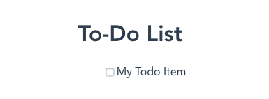

{{LearnSidebar}}{{PreviousMenuNext("Learn/Tools_and_testing/Client-side_JavaScript_frameworks/Vue_getting_started","Learn/Tools_and_testing/Client-side_JavaScript_frameworks/Vue_rendering_lists", "Learn/Tools_and_testing/Client-side_JavaScript_frameworks")}}

Now it's time to dive deeper into Vue, and create our own custom component — we'll start by creating a component to represent each item in the todo list. Along the way, we'll learn about a few important concepts such as calling components inside other components, passing data to them via props, and saving data state.

> **Note:** If you need to check your code against our version, you can find a finished version of the sample Vue app code in our [todo-vue repository](https://github.com/mdn/todo-vue). For a running live version, see <https://mdn.github.io/todo-vue/dist/>.

<table>
  <tbody>
    <tr>
      <th scope="row">Prerequisites:</th>
      <td>
        <p>
          Familiarity with the core <a href="/en-US/docs/Learn/HTML">HTML</a>,
          <a href="/en-US/docs/Learn/CSS">CSS</a>, and
          <a href="/en-US/docs/Learn/JavaScript">JavaScript</a> languages,
          knowledge of the
          <a
            href="/en-US/docs/Learn/Tools_and_testing/Understanding_client-side_tools/Command_line"
            >terminal/command line</a
          >.
        </p>
        <p>
          Vue components are written as a combination of JavaScript objects that
          manage the app's data and an HTML-based template syntax that maps to
          the underlying DOM structure. For installation, and to use some of the
          more advanced features of Vue (like Single File Components or render
          functions), you'll need a terminal with
          <a
            href="https://nodejs.org/en/download/"
            rel="noopener noreferrer"
            target="_blank"
            >Node</a
          >
          and
          <a
            href="https://www.npmjs.com/get-npm"
            rel="noopener noreferrer"
            target="_blank"
            >npm</a
          >
          installed.
        </p>
      </td>
    </tr>
    <tr>
      <th scope="row">Objective:</th>
      <td>
        To learn how to create a Vue component, render it inside another
        component, pass data into it using props, and save its state.
      </td>
    </tr>
  </tbody>
</table>

## Creating a ToDoItem component

Let's create our first component, which will display a single todo item. We'll use this to build our list of todos.

1. In your `moz-todo-vue/src/components` directory, create a new file named `ToDoItem.vue`. Open the file in your code editor.
2. Create the component's template section by adding `<template></template>` to the top of the file.
3. Create a `<script></script>` section below your template section. Inside the `<script>` tags, add a default exported object `export default {}`, which is your component object.

Your file should now look like this:

```html
<template> </template>
<script>
  export default {};
</script>
```

We can now begin to add actual content to our `ToDoItem`. Vue templates are currently only allowed a single root element — one element needs to wrap everything inside the template section (this will change when Vue 3 comes out). We'll use a [`<div>`](/en-US/docs/Web/HTML/Element/div) for that root element.

1. Add an empty `<div>` inside your component template now.
2. Inside that `<div>`, let's add a checkbox and a corresponding label. Add an `id` to the checkbox, and a `for` attribute mapping the checkbox to the label, as shown below.

    ```html
    <template>
      <div>
        <input type="checkbox" id="todo-item" />
        <label for="todo-item">My Todo Item</label>
      </div>
    </template>
    ```

### Using TodoItem inside our app

This is all fine, but we haven't added the component to our app yet, so there's no way to test it and see if everything is working. Let's add it now.

1. Open up `App.vue` again.
2. At the top of your `<script>` tag, add the following to import your `ToDoItem` component:

    ```js
    import ToDoItem from './components/ToDoItem.vue';
    ```

3. Inside your component object, add the `components` property, and inside it add your `ToDoItem` component to register it.

Your `<script>` contents should now look like this:

```js
import ToDoItem from './components/ToDoItem.vue';

export default {
  name: 'app',
  components: {
    ToDoItem
  }
};
```

This is the same way that the `HelloWorld` component was registered by the Vue CLI earlier.

To actually render the `ToDoItem` component in the app, you need to go up into your `<template>` element and call it as a `<to-do-item></to-do-item>` element. Note that the component file name and its representation in JavaScript is always in PascalCase (e.g. `ToDoList`), and the equivalent custom element is always in kebab-case (e.g. `<to-do-list>`).

1. Underneath the [`<h1>`](/en-US/docs/Web/HTML/Element/Heading_Elements), create an unordered list ([`<ul>`](/en-US/docs/Web/HTML/Element/ul)) containing a single list item ([`<li>`](/en-US/docs/Web/HTML/Element/li)).
2. Inside the list item add `<to-do-item></to-do-item>`.

Your `App.vue` `<template>` contents should now look something like this:

```html
<div id="app">
  <h1>To-Do List</h1>
  <ul>
    <li>
      <to-do-item></to-do-item>
    </li>
  </ul>
</div>
```

If you check your rendered app again, you should now see your rendered `ToDoItem`, consisting of a checkbox and a label.



## Making components dynamic with props

Our `ToDoItem` component is still not very useful because we can only really include this once on a page (IDs need to be unique), and we have no way to set the label text. Nothing about this is dynamic.

What we need is some component state. This can be achieved by adding props to our component. You can think of props as being similar to inputs in a function. The value of a prop gives components an initial state that affects their display.

### Registering props

In Vue, there are two ways to register props:

- The first way is to just list props out as an array of strings. Each entry in the array corresponds to the name of a prop.
- The second way is to define props as an object, with each key corresponding to the prop name. Listing props as an object allows you to specify default values, mark props as required, perform basic object typing (specifically around JavaScript primitive types), and perform simple prop validation.

> **Note:** Prop validation only happens in development mode, so you can't strictly rely on it in production. Additionally, prop validation functions are invoked before the component instance is created, so they do not have access to the component state (or other props).

For this component, we'll use the object registration method.

1. Go back to your `ToDoItem.vue` file.
2. Add a `props` property inside the export `default {}` object, which contains an empty object.
3. Inside this object, add two properties with the keys `label` and `done`.
4. The `label` key's value should be an object with 2 properties (or **props**, as they are called in the context of being available to the components).

    1. The first is a `required` property, which will have a value of `true`. This will tell Vue that we expect every instance of this component to have a label field. Vue will warn us if a `ToDoItem` component does not have a label field.
    2. The second property we'll add is a `type` property. Set the value for this property as the JavaScript `String` type (note the capital "S"). This tells Vue that we expect the value of this property to be a string.

5. Now on to the `done` prop.

    1. First add a `default` field, with a value of `false`. This means that when no `done` prop is passed to a `ToDoItem` component, the `done` prop will have a value of false (bear in mind that this is not required — we only need `default` on non-required props).
    2. Next add a `type` field with a value of `Boolean`. This tells Vue we expect the value prop to be a JavaScript boolean type.

Your component object should now look like this:

```js
export default {
  props: {
    label: { required: true, type: String },
    done: { default: false, type: Boolean }
  }
};
```

### Using registered props

With these props defined inside the component object, we can now use these variable values inside our template. Let's start by adding the `label` prop to the component template.

In your `<template>`, replace the contents of the `<label>` element with `\{{label}}`.

`\{{}}` is a special template syntax in Vue, which lets us print the result of JavaScript expressions defined in our class, inside our template, including values and methods. It's important to know that content inside `\{{}}` is displayed as text and not HTML. In this case, we're printing the value of the `label` prop.

Your component's template section should now look like this:

```html
<template>
  <div>
    <input type="checkbox" id="todo-item" />
    <label for="todo-item">\{{label}}</label>
  </div>
</template>
```

Go back to your browser and you'll see the todo item rendered as before, but without a label (oh no!). Go to your browser's DevTools and you'll see a warning along these lines in the console:

```
[Vue warn]: Missing required prop: "label"

found in

---> <ToDoItem> at src/components/ToDoItem.vue
        <App> at src/App.vue
          <Root>
```

This is because we marked the `label` as a required prop, but we never gave the component that prop — we've defined where inside the template we want it used, but we haven't passed it into the component when calling it. Let's fix that.

Inside your `App.vue` file, add a `label` prop to the `<to-do-item></to-do-item>` component, just like a regular HTML attribute:

```html
<to-do-item label="My ToDo Item"></to-do-item>
```

Now you'll see the label in your app, and the warning won't be spat out in the console again.

So that's props in a nutshell. Next we'll move on to how Vue persists data state.

## Vue's data object

If you change the value of the `label` prop passed into the `<to-do-item></to-do-item>` call in your `App` component, you should see it update. This is great. We have a checkbox, with an updatable label. However, we're currently not doing anything with the "done" prop — we can check the checkboxes in the UI, but nowhere in the app are we recording whether a todo item is actually done.

To achieve this, we want to bind the component's `done` prop to the `checked` attribute on the [`<input>`](/en-US/docs/Web/HTML/Element/input) element, so that it can serve as a record of whether the checkbox is checked or not. However, it's important that props serve as one-way data binding — a component should never alter the value of its own props. There are a lot of reasons for this. In part, components editing props can make debugging a challenge. If a value is passed to multiple children, it could be hard to track where the changes to that value were coming from. In addition, changing props can cause components to re-render. So mutating props in a component would trigger the component to rerender, which may in-turn trigger the mutation again.

To work around this, we can manage the `done` state using Vue's `data` property. The `data` property is where you can manage local state in a component, it lives inside the component object alongside the `props` property and has the following structure:

```js
data() {
  return {
    key: value
  }
}
```

You'll note that the `data` property is a function. This is to keep the data values unique for each instance of a component at runtime — the function is invoked separately for each component instance. If you declared data as just an object, all instances of that component would share the same values. This is a side-effect of the way Vue registers components and something you do not want.

You use `this` to access a component's props and other properties from inside data, as you may expect. We'll see an example of this shortly.

> **Note:** Because of the way that `this` works in arrow functions (binding to the parent's context), you wouldn't be able to access any of the necessary attributes from inside `data` if you used an arrow function. So don't use an arrow function for the `data` property.

So let's add a `data` property to our `ToDoItem` component. This will return an object containing a single property that we'll call `isDone`, whose value is `this.done`.

Update the component object like so:

```js
export default {
  props: {
    label: { required: true, type: String },
    done: { default: false, type: Boolean }
  },
  data() {
    return {
      isDone: this.done
    };
  }
};
```

Vue does a little magic here — it binds all of your props directly to the component instance, so we don't have to call `this.props.done`. It also binds other attributes (`data`, which you've already seen, and others like `methods`, `computed`, etc.) directly to the instance. This is, in part, to make them available to your template. The down-side to this is that you need to keep the keys unique across these attributes. This is why we called our `data` attribute `isDone` instead of `done`.

So now we need to attach the `isDone` property to our component. In a similar fashion to how Vue uses `\{{}}` expressions to display JavaScript expressions inside templates, Vue has a special syntax to bind JavaScript expressions to HTML elements and components: **`v-bind`**. The `v-bind` expression looks like this:

```
v-bind:attribute="expression"
```

In other words, you prefix whatever attribute/prop you want to bind to with `v-bind:`. In most cases, you can use a shorthand for the `v-bind` property, which is to just prefix the attribute/prop with a colon. So `:attribute="expression"` works the same as `v-bind:attribute="expression"`.

So in the case of the checkbox in our `ToDoItem` component, we can use `v-bind` to map the `isDone` property to the `checked` attribute on the `<input>` element. Both of the following are equivalent:

```html
<input type="checkbox" id="todo-item" v-bind:checked="isDone" />

<input type="checkbox" id="todo-item" :checked="isDone" />
```

You're free to use whichever pattern you would like. It's best to keep it consistent though. Because the shorthand syntax is more commonly used, this tutorial will stick to that pattern.

So let's do this. Update your `<input>` element now to include `:checked="isDone"`.

Test out your component by passing `:done="true"` to the `ToDoItem` call in `App.vue`. Note that you need to use the `v-bind` syntax, because otherwise `true` is passed as a string. The displayed checkbox should be checked.

```html
<template>
  <div id="app">
    <h1>My To-Do List</h1>
    <ul>
      <li>
        <to-do-item label="My ToDo Item" :done="true"></to-do-item>
      </li>
    </ul>
  </div>
</template>
```

Try changing `true` to `false` and back again, reloading your app in between to see how the state changes.

## Giving Todos a unique id

Great! We now have a working checkbox where we can set the state programmatically. However, we can currently only add one `ToDoList` component to the page because the `id` is hardcoded. This would result in errors with assistive technology since the `id` is needed to correctly map labels to their checkboxes. To fix this, we can programmatically set the `id` in the component data.

We can use the [lodash](https://www.npmjs.com/package/lodash) package's `uniqueid()` method to help keep the index unique. This package exports a function that takes in a string and appends a unique integer to the end of the prefix. This will be sufficient for keeping component `id`s unique.

Let's add the package to our project with npm; stop your server and enter the following command into your terminal:

```bash
npm install --save lodash.uniqueid
```

> **Note:** If you prefer yarn, you could instead use `yarn add lodash.uniqueid`.

We can now import this package into our `ToDoItem` component. Add the following line at the top of `ToDoItem.vue`'s `<script>` element:

```js
import uniqueId from 'lodash.uniqueid';
```

Next, add an `id` field to our data property, so the component object ends up looking like so (`uniqueId()` returns the specified prefix — `todo-` — with a unique string appended to it):

```js
import uniqueId from 'lodash.uniqueid';

export default {
  props: {
    label: { required: true, type: String },
    done: { default: false, type: Boolean }
  },
  data() {
    return {
      isDone: this.done,
      id: uniqueId('todo-')
    };
  }
};
```

Next, bind the `id` to both our checkbox's `id` attribute and the label's `for` attribute, updating the existing `id` and `for` attributes as shown:

```html
<template>
  <div>
    <input type="checkbox" :id="id" :checked="isDone" />
    <label :for="id">\{{label}}</label>
  </div>
</template>
```

## Summary

And that will do for this article. At this point we have a nicely-working `ToDoItem` component that can be passed a label to display, will store its checked state, and will be rendered with a unique `id` each time it is called. You can check if the unique `id`s are working by temporarily adding more `<to-do-item></to-do-item>` calls into `App.vue`, and then checking their rendered output with your browser's DevTools.

Now we're ready to add multiple `ToDoItem` components to our app. In our next article we'll look at adding a set of todo item data to our `App.vue` component, which we'll then loop through and display inside `ToDoItem` components using the `v-for` directive.

{{PreviousMenuNext("Learn/Tools_and_testing/Client-side_JavaScript_frameworks/Vue_getting_started","Learn/Tools_and_testing/Client-side_JavaScript_frameworks/Vue_rendering_lists", "Learn/Tools_and_testing/Client-side_JavaScript_frameworks")}}

## In this module

- [Introduction to client-side frameworks](/en-US/docs/Learn/Tools_and_testing/Client-side_JavaScript_frameworks/Introduction)
- [Framework main features](/en-US/docs/Learn/Tools_and_testing/Client-side_JavaScript_frameworks/Main_features)
- React

  - [Getting started with React](/en-US/docs/Learn/Tools_and_testing/Client-side_JavaScript_frameworks/React_getting_started)
  - [Beginning our React todo list](/en-US/docs/Learn/Tools_and_testing/Client-side_JavaScript_frameworks/React_todo_list_beginning)
  - [Componentizing our React app](/en-US/docs/Learn/Tools_and_testing/Client-side_JavaScript_frameworks/React_components)
  - [React interactivity: Events and state](/en-US/docs/Learn/Tools_and_testing/Client-side_JavaScript_frameworks/React_interactivity_events_state)
  - [React interactivity: Editing, filtering, conditional rendering](/en-US/docs/Learn/Tools_and_testing/Client-side_JavaScript_frameworks/React_interactivity_filtering_conditional_rendering)
  - [Accessibility in React](/en-US/docs/Learn/Tools_and_testing/Client-side_JavaScript_frameworks/React_accessibility)
  - [React resources](/en-US/docs/Learn/Tools_and_testing/Client-side_JavaScript_frameworks/React_resources)

- Ember

  - [Getting started with Ember](/en-US/docs/Learn/Tools_and_testing/Client-side_JavaScript_frameworks/Ember_getting_started)
  - [Ember app structure and componentization](/en-US/docs/Learn/Tools_and_testing/Client-side_JavaScript_frameworks/Ember_structure_componentization)
  - [Ember interactivity: Events, classes and state](/en-US/docs/Learn/Tools_and_testing/Client-side_JavaScript_frameworks/Ember_interactivity_events_state)
  - [Ember Interactivity: Footer functionality, conditional rendering](/en-US/docs/Learn/Tools_and_testing/Client-side_JavaScript_frameworks/Ember_conditional_footer)
  - [Routing in Ember](/en-US/docs/Learn/Tools_and_testing/Client-side_JavaScript_frameworks/Ember_routing)
  - [Ember resources and troubleshooting](/en-US/docs/Learn/Tools_and_testing/Client-side_JavaScript_frameworks/Ember_resources)

- Vue

  - [Getting started with Vue](/en-US/docs/Learn/Tools_and_testing/Client-side_JavaScript_frameworks/Vue_getting_started)
  - [Creating our first Vue component](/en-US/docs/Learn/Tools_and_testing/Client-side_JavaScript_frameworks/Vue_first_component)
  - [Rendering a list of Vue components](/en-US/docs/Learn/Tools_and_testing/Client-side_JavaScript_frameworks/Vue_rendering_lists)
  - [Adding a new todo form: Vue events, methods, and models](/en-US/docs/Learn/Tools_and_testing/Client-side_JavaScript_frameworks/Vue_methods_events_models)
  - [Styling Vue components with CSS](/en-US/docs/Learn/Tools_and_testing/Client-side_JavaScript_frameworks/Vue_styling)
  - [Using Vue computed properties](/en-US/docs/Learn/Tools_and_testing/Client-side_JavaScript_frameworks/Vue_computed_properties)
  - [Vue conditional rendering: editing existing todos](/en-US/docs/Learn/Tools_and_testing/Client-side_JavaScript_frameworks/Vue_conditional_rendering)
  - [Focus management with Vue refs](/en-US/docs/Learn/Tools_and_testing/Client-side_JavaScript_frameworks/Vue_refs_focus_management)
  - [Vue resources](/en-US/docs/Learn/Tools_and_testing/Client-side_JavaScript_frameworks/Vue_resources)

- Svelte

  - [Getting started with Svelte](/en-US/docs/Learn/Tools_and_testing/Client-side_JavaScript_frameworks/Svelte_getting_started)
  - [Starting our Svelte Todo list app](/en-US/docs/Learn/Tools_and_testing/Client-side_JavaScript_frameworks/Svelte_Todo_list_beginning)
  - [Dynamic behavior in Svelte: working with variables and props](/en-US/docs/Learn/Tools_and_testing/Client-side_JavaScript_frameworks/Svelte_variables_props)
  - [Componentizing our Svelte app](/en-US/docs/Learn/Tools_and_testing/Client-side_JavaScript_frameworks/Svelte_components)
  - [Advanced Svelte: Reactivity, lifecycle, accessibility](/en-US/docs/Learn/Tools_and_testing/Client-side_JavaScript_frameworks/Svelte_reactivity_lifecycle_accessibility)
  - [Working with Svelte stores](/en-US/docs/Learn/Tools_and_testing/Client-side_JavaScript_frameworks/Svelte_stores)
  - [TypeScript support in Svelte](/en-US/docs/Learn/Tools_and_testing/Client-side_JavaScript_frameworks/Svelte_TypeScript)
  - [Deployment and next steps](/en-US/docs/Learn/Tools_and_testing/Client-side_JavaScript_frameworks/Svelte_deployment_next)

- Angular

  - [Getting started with Angular](/en-US/docs/Learn/Tools_and_testing/Client-side_JavaScript_frameworks/Angular_getting_started)
  - [Beginning our Angular todo list app](/en-US/docs/Learn/Tools_and_testing/Client-side_JavaScript_frameworks/Angular_todo_list_beginning)
  - [Styling our Angular app](/en-US/docs/Learn/Tools_and_testing/Client-side_JavaScript_frameworks/Angular_styling)
  - [Creating an item component](/en-US/docs/Learn/Tools_and_testing/Client-side_JavaScript_frameworks/Angular_item_component)
  - [Filtering our to-do items](/en-US/docs/Learn/Tools_and_testing/Client-side_JavaScript_frameworks/Angular_filtering)
  - [Building Angular applications and further resources](/en-US/docs/Learn/Tools_and_testing/Client-side_JavaScript_frameworks/Angular_building)
