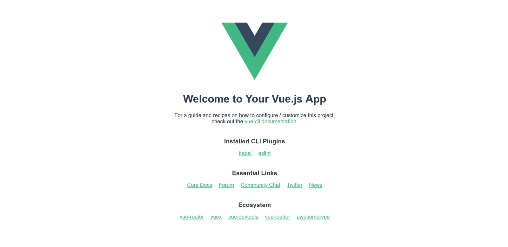

{{LearnSidebar}}{{PreviousMenuNext("Learn/Tools_and_testing/Client-side_JavaScript_frameworks/Ember_resources","Learn/Tools_and_testing/Client-side_JavaScript_frameworks/Vue_first_component", "Learn/Tools_and_testing/Client-side_JavaScript_frameworks")}}

Now let's introduce Vue, the third of our frameworks. In this article we'll look at a little bit of Vue background, learn how to install it and create a new project, study the high-level structure of the whole project and an individual component, see how to run the project locally, and get it prepared to start building our example.

<table>
  <tbody>
    <tr>
      <th scope="row">Prerequisites:</th>
      <td>
        <p>
          Familiarity with the core <a href="/en-US/docs/Learn/HTML">HTML</a>,
          <a href="/en-US/docs/Learn/CSS">CSS</a>, and
          <a href="/en-US/docs/Learn/JavaScript">JavaScript</a> languages,
          knowledge of the
          <a
            href="/en-US/docs/Learn/Tools_and_testing/Understanding_client-side_tools/Command_line"
            >terminal/command line</a
          >.
        </p>
        <p>
          Vue components are written as a combination of JavaScript objects that
          manage the app's data and an HTML-based template syntax that maps to
          the underlying DOM structure. For installation, and to use some of the
          more advanced features of Vue (like Single File Components or render
          functions), you'll need a terminal with node + npm installed.
        </p>
      </td>
    </tr>
    <tr>
      <th scope="row">Objective:</th>
      <td>
        To setup a local Vue development environment, create a starter app, and
        understand the basics of how it works.
      </td>
    </tr>
  </tbody>
</table>

## A clearer Vue

Vue is a modern JavaScript framework that provides useful facilities for progressive enhancement — unlike many other frameworks, you can use Vue to enhance existing HTML. This lets you use Vue as a drop-in replacement for a library like [jQuery](https://jquery.com/).

That being said, you can also use Vue to write entire Single Page Applications (SPAs). This allows you to create markup managed entirely by Vue, which can improve developer experience and performance when dealing with complex applications. It also allows you to take advantage of libraries for client-side routing and state management when you need to. Additionally, Vue takes a "middle ground" approach to tooling like client-side routing and state management. While the Vue core team maintains suggested libraries for these functions, they are not directly bundled into Vue. This allows you to select a different routing/state management library if they better fit your application.

In addition to allowing you to progressively integrate Vue into your applications, Vue also provides a progressive approach to writing markup. Like most frameworks, Vue lets you create reusable blocks of markup via components. Most of the time, Vue components are written using a special HTML template syntax. When you need more control than the HTML syntax allows, you can write JSX or plain JavaScript functions to define your components.

As you work through this tutorial, you might want to keep the [Vue guide](https://vuejs.org/guide/introduction.html) and [API documentation](https://vuejs.org/api/) open in other tabs, so you can refer to them if you want more information on any sub topic.
For a good (but potentially biased) comparison between Vue and many of the other frameworks, see [Vue Docs: Comparison with Other Frameworks](https://v2.vuejs.org/v2/guide/comparison.html).

## Installation

To use Vue in an existing site, you can drop one of the following [`<script>`](/en-US/docs/Web/HTML/Element/script) elements onto a page. This allows you to start using Vue on existing sites, which is why Vue prides itself on being a progressive framework. This is a great option when migrating an existing project using a library like jQuery to Vue. With this method, you can use a lot of the core features of Vue, such as the attributes, custom components, and data-management.

- Development Script (not optimized, but includes console warnings which is great for development.)

  ```html
  <script src="https://unpkg.com/vue@3/dist/vue.global.js"></script>
  ```

- Production Script (Optimized version, minimal console warnings. It is recommended that you specify a version number when including Vue on your site so that any framework updates do not break your live site without you knowing.)

  ```html
  <script src="https://unpkg.com/vue@3/dist/vue.global.prod.js"></script>
  ```

However, this approach has some limitations. To build more complex apps, you'll want to use the [Vue npm package](https://www.npmjs.com/package/vue). This will let you use advanced features of Vue and take advantage of bundlers like WebPack. To make building apps with Vue easier, there is a CLI to streamline the development process. To use the npm package & the CLI you will need:

1. Node.js 8.11+ installed.
2. [npm](https://docs.npmjs.com/downloading-and-installing-node-js-and-npm) or [yarn](https://yarnpkg.com/).

> **Note:** If you don't have the above installed, find out [more about installing npm and Node.js](/en-US/docs/Learn/Tools_and_testing/Understanding_client-side_tools/Command_line#adding_powerups) here.

To install the CLI, run the following command in your terminal:

```bash
npm install --global @vue/cli
```

Or if you'd prefer to use yarn:

```bash
yarn global add @vue/cli
```

Once installed, to initialize a new project you can then open a terminal in the directory you want to create the project in, and run `vue create <project-name>`. The CLI will then give you a list of project configurations you can use. There are a few preset ones, and you can make your own. These options let you configure things like TypeScript, linting, vue-router, testing, and more.

We'll look at using this below.

## Initializing a new project

To explore various features of Vue, we will be building up a sample todo list app. We'll begin by using the Vue CLI to create a new app framework to build our app into.

In terminal, `cd` to where you'd like to create your sample app, then run `vue create moz-todo-vue`.
You can choose the default option `Default ([Vue 3] babel, eslint)` by pressing <kbd>Enter</kbd> to proceed.
The CLI will now begin scaffolding out your project, and installing all of your dependencies.

If you've never run the Vue CLI before, you'll get one more question — you'll be asked to choose a package manager which defaults to `yarn`.
The Vue CLI will default to this package manager from now on. If you need to use a different package manager after this, you can pass in a flag `--packageManager=<package-manager>`, when you run `vue create`. So if you wanted to create the `moz-todo-vue` project with npm and you'd previously chosen yarn, you'd run `vue create moz-todo-vue --packageManager=npm`.

> **Note:** We've not gone over all of the options here, but you can [find more information on the CLI](https://cli.vuejs.org) in the Vue docs.

## Project structure

If everything went successfully, the CLI should have created a series of files and directories for your project. The most significant ones are as follows:

- `package.json`: This file contains the list of dependencies for your project, as well as some metadata and `eslint` configuration.
- `yarn.lock`: If you chose `yarn` as your package manager, this file will be generated with a list of all the dependencies and sub-dependencies that your project needs.
- `babel.config.js`: This is the config file for [Babel](https://babeljs.io/), which transforms modern JavaScript features being used in development code into older syntax that is more cross-browser compatible in production code. You can register additional babel plugins in this file.
- `jsconfig.json`: This is a config file for [Visual Studio Code](https://code.visualstudio.com/docs/languages/jsconfig) and gives context for VS Code on your project structure and assists auto-completion.
- `public`: This directory contains static assets that are published, but not processed by [Webpack](https://webpack.js.org/) during build (with one exception; `index.html` gets some processing).

  - `favicon.ico`: This is the favicon for your app. Currently, it's the Vue logo.
  - `index.html`: This is the template for your app. Your Vue app is run from this HTML page, and you can use lodash template syntax to interpolate values into it.

    > **Note:** this is not the template for managing the layout of your application — this template is for managing static HTML that sits outside of your Vue app. Editing this file typically only occurs in advanced use cases.

- `src`: This directory contains the core of your Vue app.

  - `main.js`: this is the entry point to your application. Currently, this file initializes your Vue application and signifies which HTML element in the `index.html` file your app should be attached to. This file is often where you register global components or additional Vue libraries.
  - `App.vue`: this is the top-level component in your Vue app. See below for more explanation of Vue components.
  - `components`: this directory is where you keep your components. Currently, it just has one example component.
  - `assets`: this directory is for storing static assets like CSS and images. Because these files are in the source directory, they can be processed by Webpack. This means you can use pre-processors like [Sass/SCSS](https://sass-lang.com/) or [Stylus](https://stylus-lang.com/).

> **Note:** Depending on the options you select when creating a new project, there might be other directories present (for example, if you choose a router, you will also have a `views` directory).

## .vue files (single file components)

Like in many front-end frameworks, components are a central part of building apps in Vue. These components let you break a large application into discrete building blocks that can be created and managed separately, and transfer data between each other as required. These small blocks can help you reason about and test your code.

While some frameworks encourage you to separate your template, logic, and styling code into separate files, Vue takes the opposite approach. Using [Single File Components (SFC)](https://vuejs.org/guide/scaling-up/sfc.html), Vue lets you group your templates, corresponding script, and CSS all together in a single file ending in `.vue`. These files are processed by a JS build tool (such as Webpack), which means you can take advantage of build-time tooling in your project. This allows you to use tools like Babel, TypeScript, SCSS and more to create more sophisticated components.

As a bonus, projects created with the Vue CLI are configured to use `.vue` files with Webpack out of the box. In fact, if you look inside the `src` folder in the project we created with the CLI, you'll see your first `.vue` file: `App.vue`.

Let's explore this now.

### App.vue

Open your `App.vue` file — you'll see that it has three parts: `<template>`, `<script>`, and `<style>`, which contain the component's template, scripting, and styling information. All Single File Components share this same basic structure.

`<template>` contains all the markup structure and display logic of your component. Your template can contain any valid HTML, as well as some Vue-specific syntax that we'll cover later.

> **Note:** By setting the `lang` attribute on the `<template>` tag, you can use Pug template syntax instead of standard HTML — `<template lang="pug">`. We'll stick to standard HTML through this tutorial, but it is worth knowing that this is possible.

`<script>` contains all of the non-display logic of your component. Most importantly, your `<script>` tag needs to have a default exported JS object. This object is where you locally register components, define component inputs (props), handle local state, define methods, and more. Your build step will process this object and transform it (with your template) into a Vue component with a `render()` function.

In the case of `App.vue`, our default export sets the name of the component to `App` and registers the `HelloWorld` component by adding it into the `components` property. When you register a component in this way, you're registering it locally. Locally registered components can only be used inside the components that register them, so you need to import and register them in every component file that uses them. This can be useful for bundle splitting/tree shaking since not every page in your app necessarily needs every component.

```js
import HelloWorld from "./components/HelloWorld.vue";

export default {
  name: "App",
  components: {
    //You can register components locally here.
    HelloWorld,
  },
};
```

> **Note:** If you want to use [TypeScript](https://www.typescriptlang.org/) syntax, you need to set the `lang` attribute on the `<script>` tag to signify to the compiler that you're using TypeScript — `<script lang="ts">`.

`<style>` is where you write your CSS for the component. If you add a `scoped` attribute — `<style scoped>` — Vue will scope the styles to the contents of your SFC. This works similar to CSS-in-JS solutions, but allows you to just write plain CSS.

> **Note:** If you select a CSS pre-processor when creating the project via the CLI, you can add a `lang` attribute to the `<style>` tag so that the contents can be processed by Webpack at build time. For example, `<style lang="scss">` will allow you to use SCSS syntax in your styling information.

## Running the app locally

The Vue CLI comes with a built-in development server. This allows you to run your app locally so you can test it easily without needing to configure a server yourself. The CLI adds a `serve` command to the project's `package.json` file as an npm script, so you can easily run it.

In your terminal, try running `npm run serve` (or `yarn serve` if you prefer yarn). Your terminal should output something like the following:

```plain
INFO  Starting development server...
98% after emitting CopyPlugin

  DONE  Compiled successfully in 18121ms

  App running at:
  - Local:   <http://localhost:8080/>
  - Network: <http://192.168.1.9:8080/>

  Note that the development build is not optimized.
  To create a production build, run npm run build.
```

If you navigate to the "local" address in a new browser tab (this should be something like `http://localhost:8080` as stated above, but may vary based on your setup), you should see your app. Right now, it should contain a welcome message, a link to the Vue documentation, links to the plugins you added when you initialized the app with your CLI, and some other useful links to the Vue community and ecosystem.



## Making a couple of changes

Let's make our first change to the app — we'll delete the Vue logo. Open the `App.vue` file, and delete the [``](/en-US/docs/Web/HTML/Element/img) element from the template section:

```html

```

If your server is still running, you should see the logo removed from the rendered site almost instantly. Let's also remove the `HelloWorld` component from our template.

First of all delete this line:

```html
<HelloWorld msg="Welcome to Your Vue.js App" />
```

If you save your `App.vue` file now, the rendered app will throw an error because we've registered the component but are not using it. We also need to remove the lines from inside the `<script>` element that import and register the component:

Delete these lines now:

```js
import HelloWorld from "./components/HelloWorld.vue";
```

```js
components: {
  HelloWorld;
}
```

The `<template>` tag is empty now so you'll see an error saying `The template requires child element` in both the console and the rendered app.
You can fix this by adding some content inside the `<template>` tag and we can start with a new `<h1>` element inside a `<div>`.
Since we're going to be creating a todo list app below, let's set our heading to "To-Do List" like so:

```html
<template>
  <div id="app">
    <h1>To-Do List</h1>
  </div>
</template>
```

`App.vue` will now show our heading, as you'd expect.

## Summary

Let's leave this here for now. We've learnt about some of the ideas behind Vue, created some scaffolding for our example app to live inside, inspected it, and made a few preliminary changes.

With a basic introduction out of the way, we'll now go further and build up our sample app, a basic Todo list application that allows us to store a list of items, check them off when done, and filter the list by all, complete, and incomplete todos.

In the next article we'll build our first custom component, and look at some important concepts such as passing props into it and saving its data state.

{{PreviousMenuNext("Learn/Tools_and_testing/Client-side_JavaScript_frameworks/Ember_resources","Learn/Tools_and_testing/Client-side_JavaScript_frameworks/Vue_first_component", "Learn/Tools_and_testing/Client-side_JavaScript_frameworks")}}
