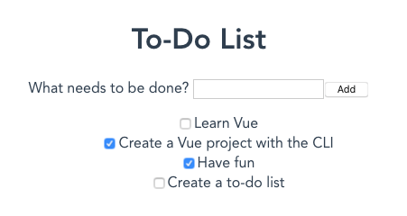
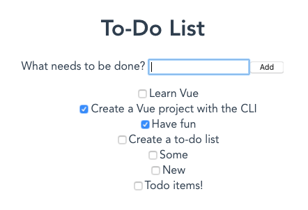

{{LearnSidebar}}{{PreviousMenuNext("Learn/Tools_and_testing/Client-side_JavaScript_frameworks/Vue_rendering_lists","Learn/Tools_and_testing/Client-side_JavaScript_frameworks/Vue_styling", "Learn/Tools_and_testing/Client-side_JavaScript_frameworks")}}

We now have sample data in place, and a loop that takes each bit of data and renders it inside a `ToDoItem` in our app. What we really need next is the ability to allow our users to enter their own todo items into the app, and for that we'll need a text `<input>`, an event to fire when the data is submitted, a method to fire upon submission to add the data and rerender the list, and a model to control the data. This is what we'll cover in this article.

<table>
  <tbody>
    <tr>
      <th scope="row">Prerequisites:</th>
      <td>
        <p>
          Familiarity with the core <a href="/en-US/docs/Learn/HTML">HTML</a>,
          <a href="/en-US/docs/Learn/CSS">CSS</a>, and
          <a href="/en-US/docs/Learn/JavaScript">JavaScript</a> languages,
          knowledge of the
          <a
            href="/en-US/docs/Learn/Tools_and_testing/Understanding_client-side_tools/Command_line"
            >terminal/command line</a
          >.
        </p>
        <p>
          Vue components are written as a combination of JavaScript objects that
          manage the app's data and an HTML-based template syntax that maps to
          the underlying DOM structure. For installation, and to use some of the
          more advanced features of Vue (like Single File Components or render
          functions), you'll need a terminal with node + npm installed.
        </p>
      </td>
    </tr>
    <tr>
      <th scope="row">Objective:</th>
      <td>
        To learn about handling forms in Vue, and by association, events,
        models, and methods.
      </td>
    </tr>
  </tbody>
</table>

## Creating a New To-Do form

We now have an app that displays a list of to-do items. However, we can't update our list of items without manually changing our code! Let's fix that. Let's create a new component that will allow us to add a new to-do item.

1. In your components folder, create a new file called `ToDoForm.vue`.
2. Add a blank `<template>` and a `<script>` tag like before:

   ```html
   <template></template>

   <script>
     export default {};
   </script>
   ```

3. Let's add in an HTML form that lets you enter a new todo item and submit it into the app. We need a [`<form>`](/en-US/docs/Web/HTML/Element/form) with a [`<label>`](/en-US/docs/Web/HTML/Element/label), an [`<input>`](/en-US/docs/Web/HTML/Element/input), and a [`<button>`](/en-US/docs/Web/HTML/Element/button). Update your template as follows:

   ```html
   <template>
     <form>
       <label for="new-todo-input"> What needs to be done? </label>
       <input
         type="text"
         id="new-todo-input"
         name="new-todo"
         autocomplete="off" />
       <button type="submit">Add</button>
     </form>
   </template>
   ```

   So we now have a form component into which we can enter the title of a new todo item (which will become a label for the corresponding `ToDoItem` when it is eventually rendered).

4. Let's load this component into our app. Go back to `App.vue` and add the following `import` statement just below the previous one, inside your `<script>` element:

   ```js
   import ToDoForm from "./components/ToDoForm";
   ```

5. You also need to register the new component in your `App` component — update the `components` property of the component object so that it looks like this:

   ```js
   components: {
     ToDoItem, ToDoForm;
   }
   ```

6. Finally for this section, render your `ToDoForm` component inside your app by adding the `<to-do-form />` element inside your `App`'s `<template>`, like so:

   ```html
   <template>
     <div id="app">
       <h1>My To-Do List</h1>
       <to-do-form></to-do-form>
       <ul>
         <li v-for="item in ToDoItems" :key="item.id">
           <to-do-item
             :label="item.label"
             :done="item.done"
             :id="item.id"></to-do-item>
         </li>
       </ul>
     </div>
   </template>
   ```

Now when you view your running site, you should see the new form displayed.



If you fill it out and click the "Add" button, the page will post the form back to the server, but this isn't really what we want. What we actually want to do is run a method on the [`submit` event](/en-US/docs/Web/API/HTMLFormElement/submit_event) that will add the new todo to the `ToDoItem` data list defined inside `App`. To do that, we'll need to add a method to the component instance.

## Creating a method & binding it to an event with v-on

To make a method available to the `ToDoForm` component, we need to add it to the component object, and this is done inside a `methods` property to our component, which goes in the same place as `data()`, `props`, etc. The `methods` property holds any methods we might need to call in our component. When referenced, methods are fully run, so it's not a good idea to use them to display information inside the template. For displaying data that comes from calculations, you should use a `computed` property, which we'll cover later.

1. In this component, we need to add an `onSubmit()` method to a `methods` property inside the `ToDoForm` component object. We'll use this to handle the submit action.

   Add this like so:

   ```js
   export default {
     methods: {
       onSubmit() {
         console.log("form submitted");
       },
     },
   };
   ```

2. Next we need to bind the method to our `<form>` element's `submit` event handler. Much like how Vue uses the [`v-bind`](https://vuejs.org/api/built-in-directives.html#v-bind) syntax for binding attributes, Vue has a special directive for event handling: [`v-on`](https://vuejs.org/api/built-in-directives.html#v-on). The `v-on` directive works via the `v-on:event="method"` syntax. And much like `v-bind`, there's also a shorthand syntax: `@event="method"`.

   We'll use the shorthand syntax here for consistency. Add the `submit` handler to your `<form>` element like so:

   ```html
   <form @submit="onSubmit">…</form>
   ```

3. When you run this, the app still posts the data to the server, causing a refresh. Since we're doing all of our processing on the client, there's no server to handle the postback. We also lose all local state on page refresh. To prevent the browser from posting to the server, we need to stop the event's default action while bubbling up through the page ([`Event.preventDefault()`](/en-US/docs/Web/API/Event/preventDefault), in vanilla JavaScript). Vue has a special syntax called **event modifiers** that can handle this for us right in our template.

   Modifiers are appended to the end of an event with a dot like so: `@event.modifier`. Here is a list of event modifiers:

   - `.stop`: Stops the event from propagating. Equivalent to [`Event.stopPropagation()`](/en-US/docs/Web/API/Event/stopPropagation) in regular JavaScript events.
   - `.prevent`: Prevents the event's default behavior. Equivalent to [`Event.preventDefault()`](/en-US/docs/Web/API/Event/preventDefault).
   - `.self`: Triggers the handler only if the event was dispatched from this exact element.
   - `{.key}`: Triggers the event handler only via the specified key. [MDN has a list of valid key values](/en-US/docs/Web/API/UI_Events/Keyboard_event_key_values); multi-word keys just need to be converted to kebab case (e.g. `page-down`).
   - `.native`: Listens for a native event on the root (outer-most wrapping) element on your component.
   - `.once`: Listens for the event until it's been triggered once, and then no more.
   - `.left`: Only triggers the handler via the left mouse button event.
   - `.right`: Only triggers the handler via the right mouse button event.
   - `.middle`: Only triggers the handler via the middle mouse button event.
   - `.passive`: Equivalent to using the `{ passive: true }` parameter when creating an event listener in vanilla JavaScript using [`addEventListener()`](/en-US/docs/Web/API/EventTarget/addEventListener).

   In this case, we need to use the `.prevent` modifier to stop the browser's default submit action. Add `.prevent` to the `@submit` handler in your template like so:

   ```html
   <form @submit.prevent="onSubmit">…</form>
   ```

If you try submitting the form now, you'll notice that the page doesn't reload. If you open the console, you can see the results of the [`console.log()`](/en-US/docs/Web/API/console/log) we added inside our `onSubmit()` method.

## Binding data to inputs with v-model

Next up, we need a way to get the value from the form's `<input>` so we can add the new to-do item to our `ToDoItems` data list.

The first thing we need is a `data` property in our form to track the value of the to-do.

1. Add a `data()` method to our `ToDoForm` component object that returns a `label` field. We can set the initial value of the `label` to an empty string.

   Your component object should now look something like this:

   ```js
   export default {
     methods: {
       onSubmit() {
         console.log("form submitted");
       },
     },
     data() {
       return {
         label: "",
       };
     },
   };
   ```

2. We now need some way to attach the value of the `new-todo-input` element's field to the `label` field. Vue has a special directive for this: [`v-model`](https://vuejs.org/api/built-in-directives.html#v-model). `v-model` binds to the data property you set on it and keeps it in sync with the `<input>`. `v-model` works across all the various input types, including checkboxes, radios, and select inputs. To use `v-model`, you add an attribute with the structure `v-model="variable"` to the `<input>`.

   So in our case, we would add it to our `new-todo-input` field as seen below. Do this now:

   ```html
   <input
     type="text"
     id="new-todo-input"
     name="new-todo"
     autocomplete="off"
     v-model="label" />
   ```

   > **Note:** You can also sync data with `<input>` values through a combination of events and `v-bind` attributes. In fact, this is what `v-model` does behind the scenes. However, the exact event and attribute combination varies depending on input types and will take more code than just using the `v-model` shortcut.

3. Let's test out our use of `v-model` by logging the value of the data submitted in our `onSubmit()` method. In components, data attributes are accessed using the `this` keyword. So we access our `label` field using `this.label`.

   Update your `onSubmit()` method to look like this:

   ```js
   methods: {
     onSubmit() {
       console.log('Label value: ', this.label);
     }
   },
   ```

4. Now go back to your running app, add some text to the `<input>` field, and click the "Add" button. You should see the value you entered logged to your console, for example:

   ```
   Label value: My value
   ```

## Changing v-model behavior with modifiers

In a similar fashion to event modifiers, we can also add modifiers to change the behavior of `v-model`. In our case, there are two worth considering. The first, `.trim`, will remove whitespace from before or after the input. We can add the modifier to our `v-model` statement like so: `v-model.trim="label"`.

The second modifier we should consider is called `.lazy`. This modifier changes when `v-model` syncs the value for text inputs. As mentioned earlier, `v-model` syncing works by updating the variable using events. For text inputs, this sync happens using the [`input` event](/en-US/docs/Web/API/HTMLElement/input_event). Often, this means that Vue is syncing the data after every keystroke. The `.lazy` modifier causes `v-model` to use the [`change` event](/en-US/docs/Web/API/HTMLElement/change_event) instead. This means that Vue will only sync data when the input loses focus or the form is submitted. For our purposes, this is much more reasonable since we only need the final data.

To use both the `.lazy` modifier and the `.trim` modifier together, we can chain them, e.g. `v-model.lazy.trim="label"`.

Update your `v-model` attribute to chain `lazy` and `trim` as shown above, and then test your app again. Try for example, submitting a value with whitespace at each end.

## Passing data to parents with custom events

We now are very close to being able to add new to-do items to our list. The next thing we need to be able to do is pass the newly-created to-do item to our `App` component. To do that, we can have our `ToDoForm` emit a custom event that passes the data, and have `App` listen for it. This works very similarly to native events on HTML elements: a child component can emit an event which can be listened to via `v-on`.

In the `onSubmit` event handler of our `ToDoForm`, let's add a `todo-added` event. Custom events are emitted like this: `this.$emit("event-name")`. It's important to know that event handlers are case sensitive and cannot include spaces. Vue templates also get converted to lowercase, which means Vue templates cannot listen for events named with capital letters.

1. Replace the `console.log()` in the `onSubmit()` method with the following:

   ```js
   this.$emit("todo-added");
   ```

2. Next, go back to `App.vue` and add a `methods` property to your component object containing an `addToDo()` method, as shown below. For now, this method can just log `To-do added` to the console.

   ```js
   export default {
     name: "app",
     components: {
       ToDoItem,
       ToDoForm,
     },
     data() {
       return {
         ToDoItems: [
           { id: uniqueId("todo-"), label: "Learn Vue", done: false },
           {
             id: uniqueId("todo-"),
             label: "Create a Vue project with the CLI",
             done: true,
           },
           { id: uniqueId("todo-"), label: "Have fun", done: true },
           { id: uniqueId("todo-"), label: "Create a to-do list", done: false },
         ],
       };
     },
     methods: {
       addToDo() {
         console.log("To-do added");
       },
     },
   };
   ```

3. Next, add an event listener for the `todo-added` event to the `<to-do-form></to-do-form>`, which calls the `addToDo()` method when the event fires. Using the `@` shorthand, the listener would look like this: `@todo-added="addToDo"`:

   ```html
   <to-do-form @todo-added="addToDo"></to-do-form>
   ```

4. When you submit your `ToDoForm`, you should see the console log from the `addToDo()` method. This is good, but we're still not passing any data back into the `App.vue` component. We can do that by passing additional arguments to the `this.$emit()` function back in the `ToDoForm` component.

   In this case, when we fire the event we want to pass the `label` data along with it. This is done by including the data you want to pass as another parameter in the `$emit()` method: `this.$emit("todo-added", this.label)`. This is similar to how native JavaScript events include data, except custom Vue events include no event object by default. This means that the emitted event will directly match whatever object you submit. So in our case, our event object will just be a string.

   Update your `onSubmit()` method like so:

   ```js
   onSubmit() {
     this.$emit('todo-added', this.label)
   }
   ```

5. To actually pick up this data inside `App.vue`, we need to add a parameter to our `addToDo()` method that includes the `label` of the new to-do item.

   Go back to `App.vue` and update this now:

   ```js
   methods: {
     addToDo(toDoLabel) {
       console.log('To-do added:', toDoLabel);
     }
   }
   ```

If you test your form again, you'll see whatever text you enter logged in your console upon submission. Vue automatically passes the arguments after the event name in `this.$emit()` to your event handler.

## Adding the new todo into our data

Now that we have the data from `ToDoForm` available in `App.vue`, we need to add an item representing it to the `ToDoItems` array. This can be done by pushing a new to-do item object to the array containing our new data.

1. Update your `addToDo()` method like so:

   ```js
   addToDo(toDoLabel) {
     this.ToDoItems.push({id:uniqueId('todo-'), label: toDoLabel, done: false});
   }
   ```

2. Try testing your form again, and you should see new to-do items get appended to the end of the list.
3. Let's make a further improvement before we move on. If you submit the form while the input is empty, todo items with no text still get added to the list. To fix that, we can prevent the todo-added event from firing when name is empty. Since name is already being trimmed by the `.trim` modifier, we only need to test for the empty string.

   Go back to your `ToDoForm` component, and update the `onSubmit()` method like so. If the label value is empty, let's not emit the `todo-added` event.

   ```js
   onSubmit() {
     if (this.label === "") {
       return;
     }
     this.$emit('todo-added', this.label);
   }
   ```

4. Try your form again. Now you will not be able to add empty items to the to-do list.



## Using v-model to update an input value

There's one more thing to fix in our `ToDoForm` component — after submitting, the `<input>` still contains the old value. But this is easy to fix — because we're using `v-model` to bind the data to the `<input>` in `ToDoForm`, if we set the name parameter to equal an empty string, the input will update as well.

Update your `ToDoForm` component's `onSubmit()` method to this:

```js
onSubmit() {
  if (this.label === "") {
    return;
  }
  this.$emit('todo-added', this.label);
  this.label = "";
}
```

Now when you click the "Add" button, the "new-todo-input" will clear itself.

## Summary

Excellent. We can now add todo items to our form! Our app is now starting to feel interactive, but one issue is that we've completely ignored its look and feel up to now. In the next article, we'll concentrate on fixing this, looking at the different ways Vue provides to style components.

{{PreviousMenuNext("Learn/Tools_and_testing/Client-side_JavaScript_frameworks/Vue_rendering_lists","Learn/Tools_and_testing/Client-side_JavaScript_frameworks/Vue_styling", "Learn/Tools_and_testing/Client-side_JavaScript_frameworks")}}
