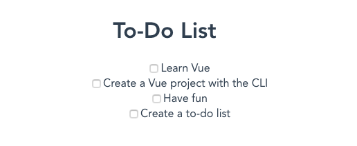

{{LearnSidebar}}{{PreviousMenuNext("Learn/Tools_and_testing/Client-side_JavaScript_frameworks/Vue_first_component","Learn/Tools_and_testing/Client-side_JavaScript_frameworks/Vue_methods_events_models", "Learn/Tools_and_testing/Client-side_JavaScript_frameworks")}}

At this point we've got a fully working component; we're now ready to add multiple `ToDoItem` components to our app. In this article we'll look at adding a set of todo item data to our `App.vue` component, which we'll then loop through and display inside `ToDoItem` components using the `v-for` directive.

<table>
  <tbody>
    <tr>
      <th scope="row">Prerequisites:</th>
      <td>
        <p>
          Familiarity with the core <a href="/en-US/docs/Learn/HTML">HTML</a>,
          <a href="/en-US/docs/Learn/CSS">CSS</a>, and
          <a href="/en-US/docs/Learn/JavaScript">JavaScript</a> languages,
          knowledge of the
          <a
            href="/en-US/docs/Learn/Tools_and_testing/Understanding_client-side_tools/Command_line"
            >terminal/command line</a
          >.
        </p>
        <p>
          Vue components are written as a combination of JavaScript objects that
          manage the app's data and an HTML-based template syntax that maps to
          the underlying DOM structure. For installation, and to use some of the
          more advanced features of Vue (like Single File Components or render
          functions), you'll need a terminal with node + npm installed.
        </p>
      </td>
    </tr>
    <tr>
      <th scope="row">Objective:</th>
      <td>
        To learn how to loop through an array of data and render it in multiple
        components.
      </td>
    </tr>
  </tbody>
</table>

## Rendering lists with v-for

To be an effective to-do list, we need to be able to render multiple to-do items. To do that, Vue has a special directive, [`v-for`](https://v2.vuejs.org/v2/api/#v-for). This is a built-in Vue directive that lets us include a loop inside of our template, repeating the rendering of a template feature for each item in an array. We'll use this to iterate through an array of to-do items and display them in our app in separate `ToDoItem` components.

### Adding some data to render

First we need to get an array of to-do items. To do that, we'll add a `data` property to the `App.vue` component object, containing a `ToDoItems` field whose value is an array of todo items. While we'll eventually add a mechanism to add new todo items, we can start with some mock to do items. Each to-do item will be represented by an object with a `label` and a `done` property.

Add a few sample to-do items, along the lines of those seen below. This way you have some data available for rendering using `v-for`.

```js
export default {
  name: 'app',
  components: {
    ToDoItem
  },
  data() {
    return {
      ToDoItems: [
        { label: 'Learn Vue', done: false },
        { label: 'Create a Vue project with the CLI', done: true },
        { label: 'Have fun', done: true },
        { label: 'Create a to-do list', done: false }
      ]
    };
  }
};
```

Now that we have a list of items, we can use the `v-for` directive to display them. Directives are applied to elements like other attributes. In case of `v-for`, you use a special syntax similar to a [`for...in`](/en-US/docs/Web/JavaScript/Reference/Statements/for...in) loop in JavaScript — `v-for="item in items"` — where `items` is the array you want to iterate over, and `item` is a reference to the current element in the array.

`v-for` attaches to the element you want to repeat, and renders that element and its children. In this case, we want to display an `<li>` element for every to-do item inside our `ToDoItems` array. Then we want to pass the data from each to-do item to a `ToDoItem` component.

### Key attribute

Before we do that, there's one other piece of syntax to know about that is used with `v-for`, the `key` attribute. To help Vue optimize rendering the elements in the list, it tries to patch list elements so it's not recreating them every time the list changes. However, Vue needs help. To make sure it is re-using list elements appropriately, it needs a unique "key" on the same element that you attach `v-for` to.

To make sure that Vue can accurately compare the `key` attributes, they need to be string or numeric values. While it would be great to use the name field, this field will eventually be controlled by user input, which means we can't guarantee that the names would be unique. We could use `lodash.uniqueid()`, however, like we did in the previous article.

1. Import `lodash.uniqueid` into your `App` component in the same way you did with your `ToDoItem` component, using

    ```js
     import uniqueId from 'lodash.uniqueid';
    ```

2. Next, add an `id` field to each element in your `ToDoItems` array, and assign each of them a value of `uniqueId('todo-')`.

    Your `App.vue` `<script>` element contents should now look like this:

    ```js
    import ToDoItem from './components/ToDoItem.vue';
    import uniqueId from 'lodash.uniqueid'

    export default {
      name: 'app',
      components: {
        ToDoItem
      },
      data() {
        return {
          ToDoItems: [
            { id: uniqueId('todo-'), label: 'Learn Vue', done: false },
            { id: uniqueId('todo-'), label: 'Create a Vue project with the CLI', done: true },
            { id: uniqueId('todo-'), label: 'Have fun', done: true },
            { id: uniqueId('todo-'), label: 'Create a to-do list', done: false }
          ]
        };
      }
    };
    ```

3. Now, add the `v-for` directive and `key` attribute to the `<li>` element in your `App.vue` template, like so:

    ```html
    <ul>
      <li v-for="item in ToDoItems" :key="item.id">
        <to-do-item label="My ToDo Item" :done="true"></to-do-item>
      </li>
    </ul>
    ```

    When you make this change, every JavaScript expression between the `<li>` tags will have access to the `item` value in addition to the other component attributes. This means we can pass the fields of our item objects to our `ToDoItem` component — just remember to use the `v-bind` syntax. This is really useful, as we want our todo items to display their `label` properties as their label, not a static label of "My Todo Item". In addition, we want their checked status to reflect their `done` properties, not always be set to `done="true"`.

4. Update the `label="My ToDo Item"` attribute to `:label="item.label"`, and the `:done="true"` attribute to `:done="item.done"`, as seen in context below:

    ```html
    <ul>
      <li v-for="item in ToDoItems" :key="item.id">
         <to-do-item :label="item.label" :done="item.done"></to-do-item>
      </li>
    </ul>
    ```

Now when you look at your running app, it'll show the todo items with their proper names, and if you inspect the source code you'll see that the inputs all have unique `id`s, taken from the object in the `App` component.



## Chance for a slight refactor

There's one little bit of refactoring we can do here. Instead of generating the `id` for the checkboxes inside your `ToDoItem` component, we can turn the `id` into a prop. While this isn't strictly necessary, it makes it easier for us to manage since we already need to create a unique `id` for each todo item anyway.

1. Add a new prop to your `ToDoItem` component — `id`.
2. Make it required, and make its type a `String`.
3. To prevent name collisions, remove the `id` field from your `data` attribute.
4. You are no longer using `uniqueId`, so you need to remove the `import uniqueId from 'lodash.uniqueid';` line, otherwise your app will throw an error.

The `<script>` contents in your `ToDoItem` component should now look something like this:

```js
export default {
    props: {
        label: {required: true, type: String},
        done: {default: false, type: Boolean},
        id: {required: true, type: String}
    },
    data() {
        return {
           isDone : this.done,
        }
    },
}
```

Now, over in your `App.vue` component, pass `item.id` as a prop to the `ToDoItem` component. Your `App.vue` template should now look like this:

```html
<template>
  <div id="app">
    <h1>My To-Do List</h1>
    <ul>
      <li v-for="item in ToDoItems" :key="item.id">
        <to-do-item :label="item.label" :done="item.done" :id="item.id"></to-do-item>
      </li>
    </ul>
  </div>
</template>
```

When you look at your rendered site, it should look the same, but our refactor now means that our `id` is being taken from the data inside `App.vue` and passed into `ToDoItem` as a prop, just like everything else, so things are now more logical and consistent.

## Summary

And that brings us to the end of another article. We now have sample data in place, and a loop that takes each bit of data and renders it inside a `ToDoItem` in our app.

What we really need next is the ability to allow our users to enter their own todo items into the app, and for that we'll need a text `<input>`, an event to fire when the data is submitted, a method to fire upon submission to add the data and rerender the list, and a model to control the data. We'll get to these in the next article.

{{PreviousMenuNext("Learn/Tools_and_testing/Client-side_JavaScript_frameworks/Vue_first_component","Learn/Tools_and_testing/Client-side_JavaScript_frameworks/Vue_methods_events_models", "Learn/Tools_and_testing/Client-side_JavaScript_frameworks")}}

## In this module

- [Introduction to client-side frameworks](/en-US/docs/Learn/Tools_and_testing/Client-side_JavaScript_frameworks/Introduction)
- [Framework main features](/en-US/docs/Learn/Tools_and_testing/Client-side_JavaScript_frameworks/Main_features)
- React

  - [Getting started with React](/en-US/docs/Learn/Tools_and_testing/Client-side_JavaScript_frameworks/React_getting_started)
  - [Beginning our React todo list](/en-US/docs/Learn/Tools_and_testing/Client-side_JavaScript_frameworks/React_todo_list_beginning)
  - [Componentizing our React app](/en-US/docs/Learn/Tools_and_testing/Client-side_JavaScript_frameworks/React_components)
  - [React interactivity: Events and state](/en-US/docs/Learn/Tools_and_testing/Client-side_JavaScript_frameworks/React_interactivity_events_state)
  - [React interactivity: Editing, filtering, conditional rendering](/en-US/docs/Learn/Tools_and_testing/Client-side_JavaScript_frameworks/React_interactivity_filtering_conditional_rendering)
  - [Accessibility in React](/en-US/docs/Learn/Tools_and_testing/Client-side_JavaScript_frameworks/React_accessibility)
  - [React resources](/en-US/docs/Learn/Tools_and_testing/Client-side_JavaScript_frameworks/React_resources)

- Ember

  - [Getting started with Ember](/en-US/docs/Learn/Tools_and_testing/Client-side_JavaScript_frameworks/Ember_getting_started)
  - [Ember app structure and componentization](/en-US/docs/Learn/Tools_and_testing/Client-side_JavaScript_frameworks/Ember_structure_componentization)
  - [Ember interactivity: Events, classes and state](/en-US/docs/Learn/Tools_and_testing/Client-side_JavaScript_frameworks/Ember_interactivity_events_state)
  - [Ember Interactivity: Footer functionality, conditional rendering](/en-US/docs/Learn/Tools_and_testing/Client-side_JavaScript_frameworks/Ember_conditional_footer)
  - [Routing in Ember](/en-US/docs/Learn/Tools_and_testing/Client-side_JavaScript_frameworks/Ember_routing)
  - [Ember resources and troubleshooting](/en-US/docs/Learn/Tools_and_testing/Client-side_JavaScript_frameworks/Ember_resources)

- Vue

  - [Getting started with Vue](/en-US/docs/Learn/Tools_and_testing/Client-side_JavaScript_frameworks/Vue_getting_started)
  - [Creating our first Vue component](/en-US/docs/Learn/Tools_and_testing/Client-side_JavaScript_frameworks/Vue_first_component)
  - [Rendering a list of Vue components](/en-US/docs/Learn/Tools_and_testing/Client-side_JavaScript_frameworks/Vue_rendering_lists)
  - [Adding a new todo form: Vue events, methods, and models](/en-US/docs/Learn/Tools_and_testing/Client-side_JavaScript_frameworks/Vue_methods_events_models)
  - [Styling Vue components with CSS](/en-US/docs/Learn/Tools_and_testing/Client-side_JavaScript_frameworks/Vue_styling)
  - [Using Vue computed properties](/en-US/docs/Learn/Tools_and_testing/Client-side_JavaScript_frameworks/Vue_computed_properties)
  - [Vue conditional rendering: editing existing todos](/en-US/docs/Learn/Tools_and_testing/Client-side_JavaScript_frameworks/Vue_conditional_rendering)
  - [Focus management with Vue refs](/en-US/docs/Learn/Tools_and_testing/Client-side_JavaScript_frameworks/Vue_refs_focus_management)
  - [Vue resources](/en-US/docs/Learn/Tools_and_testing/Client-side_JavaScript_frameworks/Vue_resources)

- Svelte

  - [Getting started with Svelte](/en-US/docs/Learn/Tools_and_testing/Client-side_JavaScript_frameworks/Svelte_getting_started)
  - [Starting our Svelte Todo list app](/en-US/docs/Learn/Tools_and_testing/Client-side_JavaScript_frameworks/Svelte_Todo_list_beginning)
  - [Dynamic behavior in Svelte: working with variables and props](/en-US/docs/Learn/Tools_and_testing/Client-side_JavaScript_frameworks/Svelte_variables_props)
  - [Componentizing our Svelte app](/en-US/docs/Learn/Tools_and_testing/Client-side_JavaScript_frameworks/Svelte_components)
  - [Advanced Svelte: Reactivity, lifecycle, accessibility](/en-US/docs/Learn/Tools_and_testing/Client-side_JavaScript_frameworks/Svelte_reactivity_lifecycle_accessibility)
  - [Working with Svelte stores](/en-US/docs/Learn/Tools_and_testing/Client-side_JavaScript_frameworks/Svelte_stores)
  - [TypeScript support in Svelte](/en-US/docs/Learn/Tools_and_testing/Client-side_JavaScript_frameworks/Svelte_TypeScript)
  - [Deployment and next steps](/en-US/docs/Learn/Tools_and_testing/Client-side_JavaScript_frameworks/Svelte_deployment_next)

- Angular

  - [Getting started with Angular](/en-US/docs/Learn/Tools_and_testing/Client-side_JavaScript_frameworks/Angular_getting_started)
  - [Beginning our Angular todo list app](/en-US/docs/Learn/Tools_and_testing/Client-side_JavaScript_frameworks/Angular_todo_list_beginning)
  - [Styling our Angular app](/en-US/docs/Learn/Tools_and_testing/Client-side_JavaScript_frameworks/Angular_styling)
  - [Creating an item component](/en-US/docs/Learn/Tools_and_testing/Client-side_JavaScript_frameworks/Angular_item_component)
  - [Filtering our to-do items](/en-US/docs/Learn/Tools_and_testing/Client-side_JavaScript_frameworks/Angular_filtering)
  - [Building Angular applications and further resources](/en-US/docs/Learn/Tools_and_testing/Client-side_JavaScript_frameworks/Angular_building)
