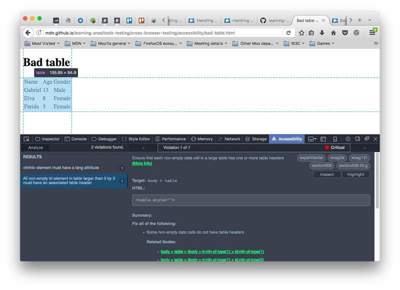

{{LearnSidebar}}{{PreviousMenuNext("Learn/Tools_and_testing/Cross_browser_testing/JavaScript","Learn/Tools_and_testing/Cross_browser_testing/Feature_detection", "Learn/Tools_and_testing/Cross_browser_testing")}}

Next we turn our attention to accessibility, providing information on common problems, how to do simple testing, and how to make use of auditing/automation tools for finding accessibility issues.

<table>
  <tbody>
    <tr>
      <th scope="row">Prerequisites:</th>
      <td>
        Familiarity with the core <a href="/en-US/docs/Learn/HTML">HTML</a>,
        <a href="/en-US/docs/Learn/CSS">CSS</a>, and
        <a href="/en-US/docs/Learn/JavaScript">JavaScript</a> languages; an idea
        of the high level
        <a
          href="/en-US/docs/Learn/Tools_and_testing/Cross_browser_testing/Introduction"
          >principles of cross browser testing</a
        >.
      </td>
    </tr>
    <tr>
      <th scope="row">Objective:</th>
      <td>
        To be able to diagnose common Accessibility problems, and use
        appropriate tools and techniques to fix them.
      </td>
    </tr>
  </tbody>
</table>

## What is accessibility?

When we say accessibility in the context of web technology, most people immediately think of making sure websites/apps are usable by people with disabilities, for example:

- Visually impaired people using screen readers or magnification/zoom to access text
- People with motor function impairments using the keyboard (or other non-mouse features) to activate website functionality.
- People with hearing impairments relying on captions/subtitles or other text alternatives for audio/video content.

However, it is wrong to say that accessibility is just about disabilities. Really, the aim of accessibility is to make your websites/apps usable by as many people in as many contexts as possible, not just those users using high-powered desktop computers. Some examples might include:

- Users on mobile devices.
- Users on alternative browsing devices such as TVs, watches, etc.
- Users of older devices that might not have the latest browsers.
- Users of lower spec devices that might have slow processors.

In a way, this whole module is about accessibility — cross browser testing makes sure that your sites can be used by as many people as possible. [What is accessibility?](/en-US/docs/Learn/Accessibility/What_is_accessibility) defines accessibility more completely and thoroughly than this article does.

That said, this article will cover cross browser and testing issues surrounding people with disabilities, and how they use the Web. We've already talked about other spheres such as [responsive design](/en-US/docs/Learn/Tools_and_testing/Cross_browser_testing/HTML_and_CSS#responsive_design_problems) and [performance](/en-US/docs/Learn/Tools_and_testing/Cross_browser_testing/JavaScript#performance_issues) in other places in the module.

> **Note:** Like many things in web development, accessibility isn't about 100% success or not; 100% accessibility is pretty much impossible to achieve for all content, especially as sites get more complex. Instead, it is more about making a reasonable effort to make as much of your content accessible to as many people as possible via defensive coding and sticking to best practices.

## Common accessibility issues

In this section we'll detail some of the main issues that arise around web accessibility, connected with specific technologies, along with best practices to follow, and some quick tests you can do to see if your sites are going in the right direction.

> **Note:** Accessibility is morally the right thing to do, and good for business (numbers of disabled users, users on mobile devices, etc. present significant market segments), but it is also a legal requirement in many parts of the world to make web content accessible to people with disabilities. Read [Accessibility guidelines and the law](/en-US/docs/Learn/Accessibility/What_is_accessibility#accessibility_guidelines_and_the_law) for more information.

### HTML

Semantic HTML (where the elements are used for their correct purpose) is accessible right out of the box — such content is readable by sighted viewers (provided you don't do anything silly like make the text way too small or hide it using CSS), but will also be usable by assistive technologies like screen readers (apps that literally read out a web page to their user), and confer other advantages too.

#### Semantic structure

The most important quick win in semantic HTML is to use a structure of headings and paragraphs for your content; this is because screen reader users tend to use the headings of a document as signposts to find the content they need more quickly. If your content has no headings, all they will get is a huge wall of text with no signposts to find anything. Examples of bad and good HTML:

```html-nolint example-bad
<font size="7">My heading</font>
<br /><br />
This is the first section of my document.
<br /><br />
I'll add another paragraph here too.
<br /><br />
<font size="5">My subheading</font>
<br /><br />
This is the first subsection of my document. I'd love people to be able to find
this content!
<br /><br />
<font size="5">My 2nd subheading</font>
<br /><br />
This is the second subsection of my content. I think it is more interesting than
the last one.
```

```html example-good
<h1>My heading</h1>

<p>This is the first section of my document.</p>

<p>I'll add another paragraph here too.</p>

<h2>My subheading</h2>

<p>
  This is the first subsection of my document. I'd love people to be able to
  find this content!
</p>

<h2>My 2nd subheading</h2>

<p>
  This is the second subsection of my content. I think it is more interesting
  than the last one.
</p>
```

In addition, your content should make logical sense in its source order — you can always place it where you want using CSS later on, but you should get the source order right to start with.

As a test, you can turn off a site's CSS and see how understandable it is without it. You could do this manually by just removing the CSS from your code, but the easiest way is to use browser features, for example:

- Firefox: Select _View > Page Style > No Style_ from the main menu.
- Safari: Select _Develop > Disable Styles_ from the main menu (to enable the _Develop_ menu, choose _Safari > Preferences > Advanced > Show Develop menu in menu bar_).
- Chrome: Install the Web Developer Toolbar extension, then restart the browser. Click the gear icon that will appear, then select _CSS > Disable All Styles_.
- Edge: Select _View > Style > No Style_ from the main menu.

#### Using native keyboard accessibility

Certain HTML features can be selected using only the keyboard — this is default behavior, available since the early days of the web. The elements that have this capability are the common ones that allow user to interact with web pages, namely links, {{htmlelement("button")}}s, and form elements like {{htmlelement("input")}}.

You can try this out using our [native-keyboard-accessibility.html](https://mdn.github.io/learning-area/tools-testing/cross-browser-testing/accessibility/native-keyboard-accessibility.html) example (see the [source code](https://github.com/mdn/learning-area/blob/main/tools-testing/cross-browser-testing/accessibility/native-keyboard-accessibility.html)) — open this in a new tab, and try pressing the tab key; after a few presses, you should see the tab focus start to move through the different focusable elements; the focused elements are given a highlighted default style in every browser (it differs slightly between different browsers) so that you can tell what element is focused.


> **Note:** In Firefox, you can also enable an overlay that shows the page tabbing order. For more information see: [Accessibility Inspector > Show web page tabbing order](https://firefox-source-docs.mozilla.org/devtools-user/accessibility_inspector/index.html#show-web-page-tabbing-order).

You can then press Enter/Return to follow a focused link or press a button (we've included some JavaScript to make the buttons alert a message), or start typing to enter text in a text input (other form elements have different controls, for example the {{htmlelement("select")}} element can have its options displayed and cycled between using the up and down arrow keys).

Note that different browsers may have different keyboard control options available. Most modern browsers follow the tab pattern described above (you can also do Shift + Tab to move backwards through the focusable elements), but some browsers have their own idiosyncrasies:

- Firefox for the Mac doesn't do tabbing by default. To turn it on, you have to go to _Preferences > Advanced > General_, then uncheck "Always use the cursor keys to navigate within pages". Next, you have to open your Mac's System Preferences app, then go to _Keyboard > Shortcuts_, then select the _All Controls_ radio button.
- Safari doesn't allow you to tab through links by default; to enable this, you need to open Safari's _Preferences_, go to Advanced, and check the _Press Tab to highlight each item on a webpage_ checkbox.

> **Warning:** You should perform this kind of test/review on any new page you write — make sure that functionality can be accessed by the keyboard, and that the tab order provides a sensible navigation path through the document.

This example highlights the importance of using the correct semantic element for the correct job. It is possible to style _any_ element to look like a link or button with CSS, and to behave like a link or button with JavaScript, but they won't actually be links or buttons, and you'll lose a lot of the accessibility these elements give you for free. So don't do it if you can avoid it.

Another tip — as shown in our example, you can control how your focusable elements look when focused, using the [:focus](/en-US/docs/Web/CSS/:focus) pseudo-class. It is a good idea to double up focus and hover styles, so your users get that visual clue that a control will do something when activated, whether they are using mouse or keyboard:

```css
a:hover,
input:hover,
button:hover,
select:hover,
a:focus,
input:focus,
button:focus,
select:focus {
  font-weight: bold;
}
```

> **Note:** If you do decide to remove the default focus styling using CSS, make sure you replace it with something else that fits in with your design better — it is a very valuable accessibility tool, and should not be removed.

#### Building in keyboard accessibility

Sometimes it is not possible to avoid losing keyboard accessibility. You might have inherited a site where the semantics are not very good (perhaps you've ended up with a horrible CMS that generates buttons made with `<div>`s), or you are using a complex control that does not have keyboard accessibility built in, like the HTML {{htmlelement("video")}} element (amazingly, Opera is the only browser that allows you to tab through the `<video>` element's default browser controls). You have a few options here:

1. Create custom controls using `<button>` elements (which we can tab to by default!) and JavaScript to wire up their functionality. See [Creating a cross-browser video player](/en-US/docs/Web/Guide/Audio_and_video_delivery/cross_browser_video_player) for some good examples of this.
2. Create keyboard shortcuts via JavaScript, so functionality is activated when you press certain keys on the keyboard. See [Desktop mouse and keyboard controls](/en-US/docs/Games/Techniques/Control_mechanisms/Desktop_with_mouse_and_keyboard) for some game-related examples that can be adapted for any purpose.
3. Use some interesting tactics to fake button behavior. Take for example our [fake-div-buttons.html](https://mdn.github.io/learning-area/tools-testing/cross-browser-testing/accessibility/fake-div-buttons.html) example (see [source code](https://github.com/mdn/learning-area/blob/main/tools-testing/cross-browser-testing/accessibility/fake-div-buttons.html)). Here we've given our fake `<div>` buttons the ability to be focused (including via tab) by giving each one the attribute `tabindex="0"` (see WebAIM's [tabindex article](https://webaim.org/techniques/keyboard/tabindex) for more really useful details). This allows us to tab to the buttons, but not to activate them via the Enter/Return key. To do that, we had to add the following bit of JavaScript trickery:

   ```js
   document.onkeydown = (e) => {
     if (e.keyCode === 13) {
       // The Enter/Return key
       document.activeElement.onclick(e);
     }
   };
   ```

   Here we add a listener to the `document` object to detect when a button has been pressed on the keyboard. We check what button was pressed via the event object's [keyCode](/en-US/docs/Web/API/KeyboardEvent/keyCode) property; if it is the keycode that matches Return/Enter, we run the function stored in the button's `onclick` handler using `document.activeElement.onclick()`. [`activeElement`](/en-US/docs/Web/API/Document/activeElement) gives us the element that is currently focused on the page.

> **Note:** This technique will only work if you set your original event handlers via event handler properties (e.g. `onclick`). `addEventListener` won't work. This is a lot of extra hassle to build the functionality back in. And there's bound to be other problems with it. Better to just use the right element for the right job in the first place.

#### Text alternatives

Text alternatives are very important for accessibility — if a person has a visual or hearing impairment that stops them being able to see or hear some content, then this is a problem. The simplest text alternative available is the humble `alt` attribute, which we should include on all images that contain relevant content. This should contain a description of the image that successfully conveys its meaning and content on the page, to be picked up by a screen reader and read out to the user.

> **Note:** For more information, read [Text alternatives](/en-US/docs/Learn/Accessibility/HTML#text_alternatives).

Missing alt text can be tested for in a number of ways, for example using accessibility [Auditing tools](#auditing_tools).

Alt text is slightly more complex for video and audio content. There is a way to define text tracks (e.g. subtitles) and display them when video is being played, in the form of the {{htmlelement("track")}} element, and the [WebVTT](/en-US/docs/Web/API/WebVTT_API) format (see [Adding captions and subtitles to HTML video](/en-US/docs/Web/Guide/Audio_and_video_delivery/Adding_captions_and_subtitles_to_HTML5_video) for a detailed tutorial). [Browser compatibility](/en-US/docs/Web/Guide/Audio_and_video_delivery/Adding_captions_and_subtitles_to_HTML5_video#browser_compatibility) for these features is fairly good, but if you want to provide text alternatives for audio or support older browsers, a simple text transcript presented somewhere on the page or on a separate page might be a good idea.

#### Element relationships and context

There are certain features and best practices in HTML designed to provide context and relationships between elements where none otherwise exists. The three most common examples are links, form labels, and data tables.

The key to accessible link text is that people using screen readers will often use a common feature whereby they pull up a list of all the links on the page. In this case, the link text needs to make sense out of context. For example, a list of links labeled "click here", "click me", etc. is really bad for accessibility. It is better for link text to make sense in context and out of context.

Next on our list, the form {{htmlelement("label")}} element is one of the central features that allows us to make forms accessible. The trouble with forms is that you need labels to say what data should be entered into each form input. Each label needs to be included inside a {{htmlelement("label")}} to link it unambiguously to its partner form input (the `for` attribute value of each `<label>` needs to match the form element `id` value), and it will make sense even if the source order is not completely logical (which to be fair it should be).

> **Note:** For more information about link text and form labels, read [Meaningful text labels](/en-US/docs/Learn/Accessibility/HTML#meaningful_text_labels).

Finally, a quick word about data tables. A basic data table can be written with very simple markup (see `bad-table.html` [live](https://mdn.github.io/learning-area/accessibility/html/bad-table.html), and [source](https://github.com/mdn/learning-area/blob/main/accessibility/html/bad-table.html)), but this has problems — there is no way for a screen reader user to associate rows or columns together as groupings of data — to do this you need to know what the header rows are, and if they are heading up rows, columns, etc. This can only be done visually for such a table.

If you instead look at our `punk-bands-complete.html` example ([live](https://mdn.github.io/learning-area/css/styling-boxes/styling-tables/punk-bands-complete.html), [source](https://github.com/mdn/learning-area/blob/main/css/styling-boxes/styling-tables/punk-bands-complete.html)), you can see a few accessibility aids at work here, such as table headers ({{htmlelement("th")}} and `scope` attributes), {{htmlelement("caption")}} element, etc.

> **Note:** For more information about accessible tables, read [Accessible data tables](/en-US/docs/Learn/Accessibility/HTML#accessible_data_tables).

### CSS

CSS tends to provide a lot fewer fundamental accessibility features than HTML, but it can still do just as much damage to accessibility if used incorrectly. We have already mentioned a couple of accessibility tips involving CSS:

- Use the correct semantic elements to mark up different content in HTML; if you want to create a different visual effect, use CSS — don't abuse an HTML element to get the look you want. For example, if you want bigger text, use {{cssxref("font-size")}}, not an {{htmlelement("Heading_Elements", "h1")}} element.
- Make sure your source order makes sense without CSS; you can always use CSS to style the page any way you want afterward.
- You should make sure interactive elements like buttons and links have appropriate focus/hover/active states set, to give the user visual clues as to their function. If you remove the defaults for stylistic reasons, make sure you include some replacement styles.

There are a few other considerations you should take into account.

#### Color and color contrast

When choosing a color scheme for your website, you should make sure that the text (foreground) color contrasts well with the background color. Your design might look cool, but it is no good if people with visual impairments like color blindness can't read your content. Use a tool like WebAIM's [Color Contrast Checker](https://webaim.org/resources/contrastchecker/) to check whether your scheme is contrasting enough.

Another tip is to not rely on color alone for signposts/information, as this will be no good for those who can't see the color. Instead of marking required form fields in red, for example, mark them with an asterisk and in red.

> **Note:** A high contrast ratio will also allow anyone using a smartphone or tablet with a glossy screen to better read pages when in a bright environment, such as sunlight.

#### Hiding content

There are many instances where a visual design will require that not all content is shown at once. For example, in our [Tabbed info box example](https://mdn.github.io/learning-area/css/css-layout/practical-positioning-examples/info-box.html) (see [source code](https://github.com/mdn/learning-area/blob/main/css/css-layout/practical-positioning-examples/info-box.html)) we have three panels of information, but we are [positioning](/en-US/docs/Learn/CSS/CSS_layout/Positioning) them on top of one another and providing tabs that can be clicked to show each one (it is also keyboard accessible — you can alternatively use Tab and Enter/Return to select them).


Screen reader users don't care about any of this — they are happy with the content as long as the source order makes sense, and they can get to it all. Absolute positioning (as used in this example) is generally seen as one of the best mechanisms of hiding content for visual effect, because it doesn't stop screen readers from getting to it.

On the other hand, you shouldn't use {{cssxref("visibility")}}`:hidden` or {{cssxref("display")}}`:none`, because they do hide content from screen readers. Unless of course, there is a good reason why you want this content to be hidden from screen readers.

> **Note:** [Invisible Content Just for Screen Reader Users](https://webaim.org/techniques/css/invisiblecontent/) has a lot more useful detail surrounding this topic.

### JavaScript

JavaScript has the same kind of problems as CSS with respect to accessibility — it can be disastrous for accessibility if used badly, or overused. We've already hinted at some accessibility problems related to JavaScript, mainly in the area of semantic HTML — you should always use appropriate semantic HTML to implement functionality wherever it is available, for example use links and buttons as appropriate. Don't use `<div>` elements with JavaScript code to fake functionality if at all possible — it is error-prone, and more work than using the free functionality HTML gives you.

#### Simple functionality

Generally simple functionality should work with just the HTML in place — JavaScript should only be used to enhance functionality, not build it in entirely. Good uses of JavaScript include:

- Providing client-side form validation, which alerts users to problems with their form entries quickly, without having to wait for the server to check the data. If it isn't available, the form will still work, but validation might be slower.
- Providing custom controls for HTML `<video>`s that are accessible to keyboard-only users (as we said earlier, the default browser controls aren't keyboard-accessible in most browsers).

> **Note:** WebAIM's [Accessible JavaScript](https://webaim.org/techniques/javascript/) provides some useful further details about considerations for accessible JavaScript.

More complex JavaScript implementations can create issues with accessibility — you need to do what you can. For example, it would be unreasonable to expect you to make a complex 3D game written using [WebGL](/en-US/docs/Glossary/WebGL) 100% accessible to a blind person, but you could implement [keyboard controls](/en-US/docs/Games/Techniques/Control_mechanisms/Desktop_with_mouse_and_keyboard) so it is usable by non-mouse users, and make the color scheme contrasting enough to be usable by those with color deficiencies.

#### Complex functionality

One of the main areas problematic for accessibility is complex apps that involve complicated form controls (such as date pickers) and dynamic content that is updated often and incrementally.

Non-native complicated form controls are problematic because they tend to involve a lot of nested `<div>`s, and the browser does not know what to do with them by default. If you are inventing them yourself, you need to make sure that they are keyboard accessible; if you are using some kind of third-party framework, carefully review the options available to see how accessible they are before diving in. [Bootstrap](https://getbootstrap.com/) looks to be fairly good for accessibility, for example, although [Making Bootstrap a Little More Accessible](https://www.sitepoint.com/making-bootstrap-accessible/) by Rhiana Heath explores some of its issues (mainly related to color contrast), and looks at some solutions.

Regularly updated dynamic content can be a problem because screen reader users might miss it, especially if it updates unexpectedly. If you have a single-page app with a main content panel that is regularly updated using [XMLHttpRequest](/en-US/docs/Web/API/XMLHttpRequest) or [Fetch](/en-US/docs/Web/API/Fetch_API), a screen reader user might miss those updates.

#### WAI-ARIA

Do you need to use such complex functionality, or will plain old semantic HTML do instead? If you do need complexity, you should consider using [WAI-ARIA](https://www.w3.org/TR/wai-aria-1.1/) (Accessible Rich Internet Applications), a specification that provides semantics (in the form of new HTML attributes) for items such as complex form controls and updating panels that can be understood by most browsers and screen readers.

To deal with complex form widgets, you need to use ARIA attributes like `roles` to state what role different elements have in a widget (for example, are they a tab, or a tab panel?), `aria-disabled` to say whether a control is disabled or not, etc.

To deal with regularly updating regions of content, you can use the `aria-live` attribute, which identifies an updating region. Its value indicates how urgently the screen reader should read it out:

- `off:` The default. Updates should not be announced.
- `polite`: Updates should be announced only if the user is idle.
- `assertive`: Updates should be announced to the user as soon as possible.
- `rude`: Updates should be announced straight away, even if this interrupts the user.

Here's an example:

```html
<p><span id="LiveRegion1" aria-live="polite" aria-atomic="false"></span></p>
```

You can see an example in action at Freedom Scientific's [ARIA (Accessible Rich Internet Applications) Live Regions](https://www.freedomscientific.com/SurfsUp/AriaLiveRegions.htm) example — the highlighted paragraph should update its content every 10 seconds, and a screen reader should read this out to the user. [ARIA Live Regions - Atomic](https://www.freedomscientific.com/SurfsUp/AriaLiveRegionsAtomic.htm) provides another useful example.

We don't have space to cover WAI-ARIA in detail here, you can learn a lot more about it at [WAI-ARIA basics](/en-US/docs/Learn/Accessibility/WAI-ARIA_basics).

## Accessibility tools

Now we've covered accessibility considerations for different web technologies, including a few testing techniques (like keyboard navigation and color contrast checkers), let's have a look at other tools you can make use of when doing accessibility testing.

### Auditing tools

There are a number of auditing tools available that you can feed your web pages into. They will look over them and return a list of accessibility issues present on the page. Examples include:

- [Wave](https://wave.webaim.org/): A rather nice online accessibility testing tool that accepts a web address and returns a useful annotated view of that page with accessibility problems highlighted.
- [Tenon](https://tenon.io): Another nice online tool that goes through the code at a provided URL and returns results on accessibility errors including metrics, specific errors along with the WCAG criteria they affect, and suggested fixes. It requires a free trial signup to view the results.
- [tota11y](https://khan.github.io/tota11y/): An accessibility tool from the Khan Academy that takes the form of a JavaScript library that you attach to your page to provide a number of accessibility tools.

Let's look at an example, using Wave.

1. Go to the [Wave homepage](https://wave.webaim.org/).
2. Enter the URL of our [bad-semantics.html](https://mdn.github.io/learning-area/accessibility/html/bad-semantics.html) example into the text input box near the top of the page. Then press enter or click/tap the arrow at the far right edge of the input box.
3. The site should respond with a description of the accessibility problems. Click the icons displayed to see more information about each of the issues identified by Wave's evaluation.

> **Note:** Such tools aren't good enough to solve all your accessibility problems on their own. You'll need a combination of these, knowledge and experience, user testing, etc. to get a full picture.

### Automation tools

[Deque's aXe tool](https://www.deque.com/axe/) goes a bit further than the auditing tools we mentioned above. Like the others, it checks pages and returns accessibility errors. Its most immediately useful form is probably the browser extensions:

- [aXe for Chrome](https://chrome.google.com/webstore/detail/axe-devtools-web-accessib/lhdoppojpmngadmnindnejefpokejbdd)
- [aXe for Firefox](https://addons.mozilla.org/en-US/firefox/addon/axe-devtools/)

These add an accessibility tab to the browser developer tools. For example, we installed the Firefox version, then used it to audit our [bad-table.html](https://mdn.github.io/learning-area/accessibility/html/bad-table.html) example. We got the following results:



aXe is also installable using `npm`, and can be integrated with task runners like [Grunt](https://gruntjs.com/) and [Gulp](https://gulpjs.com/), automation frameworks like [Selenium](https://www.selenium.dev/) and [Cucumber](https://cucumber.io/), unit testing frameworks like [Jasmine](https://jasmine.github.io/), and more besides (again, see the [main aXe page](https://www.deque.com/axe/) for details).

### Screen readers

It is definitely worth testing with a screen reader to get used to how severely visually impaired people use the Web. There are a number of screen readers available:

- Some are paid-for commercial products, like [JAWS](https://www.freedomscientific.com/Products/software/JAWS/) (Windows) and [Window Eyes](http://www.gwmicro.com/) (Windows).
- Some are free products, like [NVDA](https://www.nvaccess.org/) (Windows), [ChromeVox](https://support.google.com/chromebook/answer/7031755) (Chrome, Windows, and macOS), and [Orca](https://wiki.gnome.org/Projects/Orca) (Linux).
- Some are built into the operating system, like [VoiceOver](https://www.apple.com/accessibility/vision/) (macOS and iOS), [ChromeVox](https://support.google.com/chromebook/answer/7031755) (on Chromebooks), and [TalkBack](https://play.google.com/store/apps/details?id=com.google.android.marvin.talkback) (Android).

Generally, screen readers are separate apps that run on the host operating system and can read not only web pages, but text in other apps as well. This is not always the case (ChromeVox is a browser extension), but usually, screen readers tend to act in slightly different ways and have different controls, so you'll have to consult the documentation for your chosen screen reader to get all the details — saying that, they all work in basically the same sort of way.

Let's go through some tests with a couple of different screen readers to give you a general idea of how they work and how to test with them.

> **Note:** WebAIM's [Designing for Screen Reader Compatibility](https://webaim.org/techniques/screenreader/) provides some useful information about screen reader usage and what works best for screen readers. Also see [Screen Reader User Survey #9 Results](https://webaim.org/projects/screenreadersurvey9/#used) for some interesting screen reader usage statistics.

#### VoiceOver

VoiceOver (VO) comes free with your Mac/iPhone/iPad, so it's useful for testing on desktop/mobile if you use Apple products. We'll be testing it on Mac OS X on a MacBook Pro.

To turn it on, press Cmd + F5. If you've not used VO before, you will be given a welcome screen where you can choose to start VO or not, and run through a rather useful tutorial to learn how to use it. To turn it off again, press Cmd + F5 again.

> **Note:** You should go through the tutorial at least once — it is a really useful way to learn VO.

When VO is on, the display will look mostly the same, but you'll see a black box at the bottom left of the screen that contains information on what VO currently has selected. The current selection will also be highlighted, with a black border — this highlight is known as the **VO cursor**.


To use VO, you will make a lot of use of the "VO modifier" — this is a key or key combination that you need to press in addition to the actual VO keyboard shortcuts to get them to work. Using a modifier like this is common with screen readers, to enable them to keep their commands from clashing with other commands. In the case of VO, the modifier can either be CapsLock, or Ctrl + Option.

VO has many keyboard commands, and we won't list them all here. The basic ones you'll need for web page testing are in the following table. In the keyboard shortcuts, "VO" means "the VoiceOver modifier".

<table class="standard-table no-markdown">
  <caption>
    Most common VoiceOver keyboard shortcuts
  </caption>
  <thead>
    <tr>
      <th scope="col">Keyboard shortcut</th>
      <th scope="col">Description</th>
    </tr>
  </thead>
  <tbody>
    <tr>
      <td>VO + Cursor keys</td>
      <td>Move the VO cursor up, right, down, left.</td>
    </tr>
    <tr>
      <td>VO + Spacebar</td>
      <td>
        Select/activate items highlighted by the VO cursor. This includes items
        selected in the Rotor (see below).
      </td>
    </tr>
    <tr>
      <td>VO + Shift + down cursor</td>
      <td>
        Move into a group of items (such as an HTML table, or a form, etc.) Once
        inside a group you can move around and select items inside that group
        using the above commands as normal.
      </td>
    </tr>
    <tr>
      <td>VO + Shift + up cursor</td>
      <td>Move out of a group.</td>
    </tr>
    <tr>
      <td>VO + C</td>
      <td>(when inside a table) Read the header of the current column.</td>
    </tr>
    <tr>
      <td>VO + R</td>
      <td>(when inside a table) Read the header of the current row.</td>
    </tr>
    <tr>
      <td>VO + C + C (two Cs in succession)</td>
      <td>
        (when inside a table) Read the entire current column, including header.
      </td>
    </tr>
    <tr>
      <td>VO + R + R (two Rs in succession)</td>
      <td>
        (when inside a table) Read the entire current row, including the headers
        that correspond to each cell.
      </td>
    </tr>
    <tr>
      <td>VO + left cursor, VO + right cursor</td>
      <td>
        (when inside some horizontal options, such as a date or time picker)
        Move between options.
      </td>
    </tr>
    <tr>
      <td>VO + up cursor, VO + down cursor</td>
      <td>
        (when inside some horizontal options, such as a date or time picker)
        Change the current option.
      </td>
    </tr>
    <tr>
      <td>VO + U</td>
      <td>
        Use the Rotor, which displays lists of headings, links, form controls,
        etc. for easy navigation.
      </td>
    </tr>
    <tr>
      <td>VO + left cursor, VO + right cursor</td>
      <td>
        (when inside Rotor) Move between different lists available in the Rotor.
      </td>
    </tr>
    <tr>
      <td>VO + up cursor, VO + down cursor</td>
      <td>
        (when inside Rotor) Move between different items in the current Rotor
        list.
      </td>
    </tr>
    <tr>
      <td>Esc</td>
      <td>(when inside Rotor) Exit Rotor.</td>
    </tr>
    <tr>
      <td>Ctrl</td>
      <td>(when VO is speaking) Pause/Resume speech.</td>
    </tr>
    <tr>
      <td>VO + Z</td>
      <td>Restart the last bit of speech.</td>
    </tr>
    <tr>
      <td>VO + D</td>
      <td>Go into the Mac's Dock, so you can select apps to run inside it.</td>
    </tr>
  </tbody>
</table>

This seems like a lot of commands, but it isn't so bad when you get used to it, and VO regularly gives you reminders of what commands to use in certain places. Have a play with VO now; you can then go on to play with some of our examples in the [Screen reader testing](#screen reader_testing) section.

#### NVDA

NVDA is Windows-only, and you'll need to install it.

1. Download it from [nvaccess.org](https://www.nvaccess.org/). You can choose whether to make a donation or download it for free; you'll also need to give them your email address before you can download it.
2. Once downloaded, install it — you double-click the installer, accept the license and follow the prompts.
3. To start NVDA, double-click on the program file/shortcut, or use the keyboard shortcut Ctrl + Alt + N. You'll see the NVDA welcome dialog when you start it. Here you can choose from a couple of options, then press the _OK_ button to get going.

NVDA will now be active on your computer.

To use NVDA, you will make a lot of use of the "NVDA modifier" — this is a key that you need to press in addition to the actual NVDA keyboard shortcuts to get them to work. Using a modifier like this is common with screen readers, to enable them to keep their commands from clashing with other commands. In the case of NVDA, the modifier can either be Insert (the default), or CapsLock (can be chosen by checking the first checkbox in the NVDA welcome dialog before pressing _OK_).

> **Note:** NVDA is more subtle than VoiceOver in terms of how it highlights where it is and what it is doing. When you are scrolling through headings, lists, etc., items you are selected on will generally be highlighted with a subtle outline, but this is not always the case for all things. If you get completely lost, you can press Ctrl + F5 to refresh the current page and begin from the top again.

NVDA has many keyboard commands, and we won't list them all here. The basic ones you'll need for web page testing are in the following table. In the keyboard shortcuts, "NVDA" means "the NVDA modifier".

<table class="standard-table no-markdown">
  <caption>
    Most common NVDA keyboard shortcuts
  </caption>
  <thead>
    <tr>
      <th scope="col">Keyboard shortcut</th>
      <th scope="col">Description</th>
    </tr>
  </thead>
  <tbody>
    <tr>
      <td>NVDA + Q</td>
      <td>Turn NVDA off again after you've started it.</td>
    </tr>
    <tr>
      <td>NVDA + up cursor</td>
      <td>Read the current line.</td>
    </tr>
    <tr>
      <td>NVDA + down cursor</td>
      <td>Start reading at the current position.</td>
    </tr>
    <tr>
      <td>Up cursor and down cursor, or Shift + Tab and Tab</td>
      <td>Move to previous/next item on page and read it.</td>
    </tr>
    <tr>
      <td>Left cursor and right cursor</td>
      <td>Move to previous/next character in current item and read it.</td>
    </tr>
    <tr>
      <td>Shift + H and H</td>
      <td>Move to previous/next heading and read it.</td>
    </tr>
    <tr>
      <td>Shift + K and K</td>
      <td>Move to previous/next link and read it.</td>
    </tr>
    <tr>
      <td>Shift + D and D</td>
      <td>
        Move to previous/next document landmark (e.g. <code>&#x3C;nav></code>)
        and read it.
      </td>
    </tr>
    <tr>
      <td>Shift + 1–6 and 1–6</td>
      <td>Move to previous/next heading (level 1–6) and read it.</td>
    </tr>
    <tr>
      <td>Shift + F and F</td>
      <td>Move to previous/next form input and focus on it.</td>
    </tr>
    <tr>
      <td>Shift + T and T</td>
      <td>Move to previous/next data table and focus on it.</td>
    </tr>
    <tr>
      <td>Shift + B and B</td>
      <td>Move to previous/next button and read its label.</td>
    </tr>
    <tr>
      <td>Shift + L and L</td>
      <td>Move to previous/next list and read its first list item.</td>
    </tr>
    <tr>
      <td>Shift + I and I</td>
      <td>Move to previous/next list item and read it.</td>
    </tr>
    <tr>
      <td>Enter/Return</td>
      <td>
        (when link/button or other activatable item is selected) Activate item.
      </td>
    </tr>
    <tr>
      <td>NVDA + Space</td>
      <td>
        (when form is selected) Enter form so individual items can be selected,
        or leave form if you are already in it.
      </td>
    </tr>
    <tr>
      <td>Shift Tab and Tab</td>
      <td>(when inside form) Move between form inputs.</td>
    </tr>
    <tr>
      <td>Up cursor and down cursor</td>
      <td>
        (when inside form) Change form input values (in the case of things like
        select boxes).
      </td>
    </tr>
    <tr>
      <td>Spacebar</td>
      <td>(when inside form) Select chosen value.</td>
    </tr>
    <tr>
      <td>Ctrl + Alt + cursor keys</td>
      <td>(when a table is selected) Move between table cells.</td>
    </tr>
  </tbody>
</table>

#### Screen reader testing

Now you've gotten used to using a screen reader, we'd like you to use it to do some quick accessibility tests, to get an idea of how screen readers deal with good and bad webpage features:

- Look at [good-semantics.html](https://mdn.github.io/learning-area/accessibility/html/good-semantics.html), and note how the headers are found by the screen reader and available to use for navigation. Now look at [bad-semantics.html](https://mdn.github.io/learning-area/accessibility/html/bad-semantics.html), and note how the screen reader gets none of this information. Imagine how annoying this would be when trying to navigate a really long page of text.
- Look at [good-links.html](https://mdn.github.io/learning-area/accessibility/html/good-links.html), and note how they make sense when viewed out of context. This is not the case with [bad-links.html](https://mdn.github.io/learning-area/accessibility/html/bad-links.html) — they are all just "click here".
- Look at [good-form.html](https://mdn.github.io/learning-area/accessibility/html/good-form.html), and note how the form inputs are described using their labels because we've used `<label>` elements properly. In [bad-form.html](https://mdn.github.io/learning-area/accessibility/html/bad-form.html), they get an unhelpful label along the lines of "blank".
- Look at our [punk-bands-complete.html](https://mdn.github.io/learning-area/css/styling-boxes/styling-tables/punk-bands-complete.html) example, and see how the screen reader is able to associate columns and rows of content and read them out all together because we've defined headers properly. In [bad-table.html](https://mdn.github.io/learning-area/accessibility/html/bad-table.html), none of the cells can be associated at all. Note that NVDA seems to behave slightly strangely when you've only got a single table on a page; you could try [WebAIM's table test page](https://webaim.org/articles/nvda/tables.htm) instead.
- Have a look at the [WAI-ARIA live regions example](https://www.freedomscientific.com/SurfsUp/AriaLiveRegions.htm) we saw earlier, and note how the screen reader will keep reading out the constantly updating section as it updates.

### User testing

As mentioned above, you can't rely on automated tools alone for determining accessibility problems on your site. It is recommended that when you draw up your testing plan, you should include some accessibility user groups if at all possible (see our [User Testing](/en-US/docs/Learn/Tools_and_testing/Cross_browser_testing/Testing_strategies#user_testing) section earlier on in the course for some more context). Try to get some screen reader users involved, some keyboard-only users, some non-hearing users, and perhaps other groups too, as suits your requirements.

## Accessibility testing checklist

The following list provides a checklist for you to follow to make sure you've carried out the recommended accessibility testing for your project:

1. Make sure your HTML is as semantically correct as possible. [Validating it](/en-US/docs/Learn/Tools_and_testing/Cross_browser_testing/HTML_and_CSS#validation) is a good start, as is using an [Auditing tool](#auditing_tools).
2. Check that your content makes sense when the CSS is turned off.
3. Make sure your functionality is [keyboard accessible](#using_native_keyboard_accessibility). Test using Tab, Return/Enter, etc.
4. Make sure your non-text content has [text alternatives](#text_alternatives). An [Auditing tool](#auditing_tools) is good for catching such problems.
5. Make sure your site's [color contrast](#color_and_color_contrast) is acceptable, using a suitable checking tool.
6. Make sure [hidden content](#hiding_content) is visible by screen readers.
7. Make sure that functionality is usable without JavaScript wherever possible.
8. Use ARIA to improve accessibility where appropriate.
9. Run your site through an [Auditing tool](#auditing_tools).
10. Test it with a screen reader.
11. Include an accessibility policy/statement somewhere findable on your site to say what you did.

## Finding help

There are many other issues you'll encounter with accessibility; the most important thing to know really is how to find answers online. Consult the HTML and CSS article's [Finding help section](/en-US/docs/Learn/Tools_and_testing/Cross_browser_testing/HTML_and_CSS#finding_help) for some good pointers.

## Summary

Hopefully this article has given you a good grounding in the main accessibility problems you might encounter, and how to test and overcome them.

In the next article we'll look at feature detection in more detail.

{{PreviousMenuNext("Learn/Tools_and_testing/Cross_browser_testing/JavaScript","Learn/Tools_and_testing/Cross_browser_testing/Feature_detection", "Learn/Tools_and_testing/Cross_browser_testing")}}
