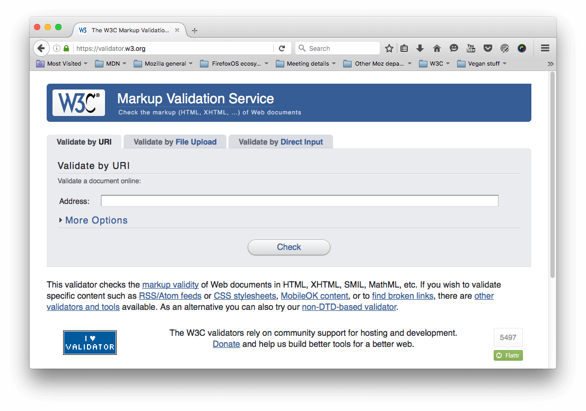
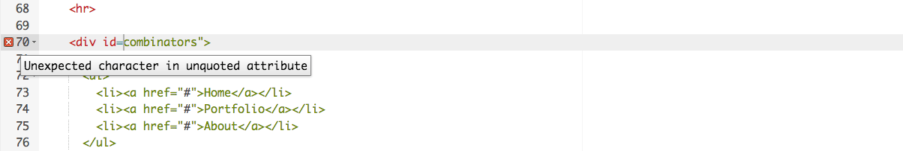
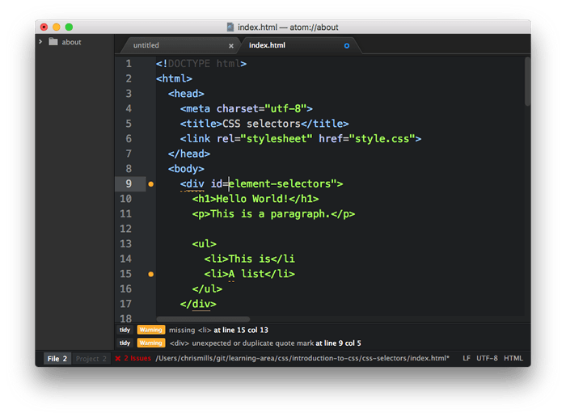
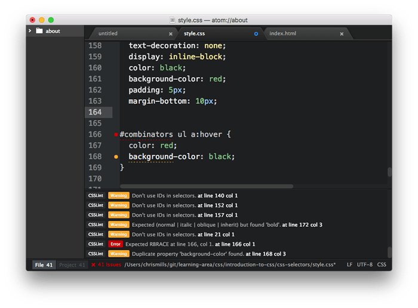
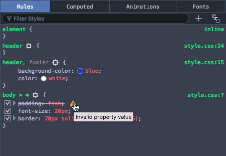
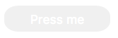
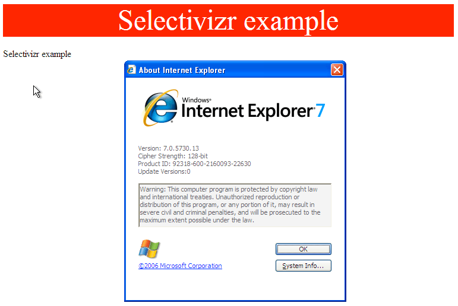

{{LearnSidebar}}{{PreviousMenuNext("Learn/Tools_and_testing/Cross_browser_testing/Testing_strategies","Learn/Tools_and_testing/Cross_browser_testing/JavaScript", "Learn/Tools_and_testing/Cross_browser_testing")}}

With the scene set, we'll now look specifically at the common cross-browser problems you will come across in HTML and CSS code, and what tools can be used to prevent problems from happening, or fix problems that occur. This includes linting code, handling CSS prefixes, using browser dev tools to track down problems, using polyfills to add support into browsers, tackling responsive design problems, and more.

<table>
  <tbody>
    <tr>
      <th scope="row">Prerequisites:</th>
      <td>
        Familiarity with the core <a href="/en-US/docs/Learn/HTML">HTML</a>,
        <a href="/en-US/docs/Learn/CSS">CSS</a>, and
        <a href="/en-US/docs/Learn/JavaScript">JavaScript</a> languages; an idea
        of the high level
        <a
          href="/en-US/docs/Learn/Tools_and_testing/Cross_browser_testing/Introduction"
          >principles of cross browser testing</a
        >.
      </td>
    </tr>
    <tr>
      <th scope="row">Objective:</th>
      <td>
        To be able to diagnose common HTML and CSS cross browser problems, and
        use appropriate tools and techniques to fix them.
      </td>
    </tr>
  </tbody>
</table>

## The trouble with HTML and CSS

Some of the trouble with HTML and CSS lies with the fact that both languages are fairly simple, and often developers don't take them seriously, in terms of making sure the code is well-crafted, efficient, and semantically describes the purpose of the features on the page. In the worst cases, JavaScript is used to generate the entire web page content and style, which makes your pages inaccessible, and less performant (generating DOM elements is expensive). In other cases, nascent features are not supported consistently across browsers, which can make some features and styles not work for some users. Responsive design problems are also common — a site that looks good in a desktop browser might provide a terrible experience on a mobile device, because the content is too small to read, or perhaps the site is slow because of expensive animations.

Let's go forth and look at how we can reduce cross browser errors that result from HTML/CSS.

## First things first: fixing general problems

We said in the [first article of this series](/en-US/docs/Learn/Tools_and_testing/Cross_browser_testing/Introduction#testingdiscovery) that a good strategy to begin with is to test in a couple of modern browsers on desktop/mobile, to make sure your code is working generally, before going on to concentrate on the cross browser issues.

In our [Debugging HTML](/en-US/docs/Learn/HTML/Introduction_to_HTML/Debugging_HTML) and [Debugging CSS](/en-US/docs/Learn/CSS/Building_blocks/Debugging_CSS) articles, we provided some really basic guidance on debugging HTML/CSS — if you are not familiar with the basics, you should definitely study these articles before carrying on.

Basically, it is a matter of checking whether your HTML and CSS code is well formed and doesn't contain any syntax errors.

> **Note:** One common problem with CSS and HTML arises when different CSS rules begin to conflict with one another. This can be especially problematic when you are using third party code. For example, you might use a CSS framework and find that one of the class names it uses clashes with one you've already used for a different purpose. Or you might find that HTML generated by some kind of third party API (generating ad banners, for example) includes a class name or ID that you are already using for a different purpose. To ensure this doesn't happen, you need to research the tools you are using first and design your code around them. It is also worth "namespacing" CSS, e.g. if you have a widget, make sure it has a distinct class, and then start the selectors that select elements inside the widget with this class, so conflicts are less likely. For example `.audio-player ul a`.

### Validation

For HTML, validation involves making sure all your tags are properly closed and nested, you are using a DOCTYPE, and you are using tags for their correct purpose. A good strategy is to validate your code regularly. One service that can do this is the W3C [Markup Validation Service](https://validator.w3.org/), which allows you to point to your code, and returns a list of errors:



CSS has a similar story — you need to check that your property names are spelled correctly, property values are spelled correctly and are valid for the properties they are used on, you are not missing any curly braces, and so on. The W3C has a [CSS Validator](https://jigsaw.w3.org/css-validator/) available too, for this purpose.

### Linters

Another good option to choose is a so-called Linter application, which not only points out errors, but can also flag up warnings about bad practices in your CSS, and other points besides. Linters can generally be customized to be stricter or more relaxed in their error/warning reporting.

There are many online linter applications, the best of which are probably [Dirty Markup](https://www.10bestdesign.com/dirtymarkup/) (HTML, CSS, JavaScript), and [CSS Lint](http://csslint.net/) (CSS only). These allows you to paste your code into a window, and it will flag up any errors with crosses, which can then be hovered to get an error message informing you what the problem is. Dirty Markup also allows you to make fixes to your markup using the _Clean_ button.



However, it is not very convenient to have to copy and paste your code over to a web page to check its validity several times. What you really want is a linter that will fit into your standard workflow with the minimum of hassle.

Many code editors have linter plugins. Github's [Atom](https://atom.io/) code editor for example has a rich plugin ecosystem available, with many linting options. To show you an example of how such plugins generally work:

1.  Install Atom (if you haven't got an up-to-date version already installed) — download it from the Atom page linked above.
2.  Go to Atom's _Preferences..._ dialog (e.g. by Choosing _Atom > Preferences..._ on Mac, or _File > Preferences..._ on Windows/Linux) and choose the _Install_ option in the left hand menu.
3.  In the _Search packages_ text field, type "lint" and press Enter/Return to search for linting-related packages.
4.  You should see a package called **lint** at the top of the list. Install this first (using the _Install_ button), as other linters rely on it to work. After that, install the **linter-csslint** plugin for linting CSS, and the **linter-tidy** plugin for linting HTML.
5.  After the packages have finished installing, try loading up an HTML file and a CSS file: you'll see any issues highlighted with green (for warnings) and red (for errors) circles next to the line numbers, and a separate panel at the bottom provides line numbers, error messages, and sometimes suggested values or other fixes.



Other popular editors have similar linting packages available. For example, see:

- [SublimeLinter](https://www.sublimelinter.com/) for Sublime Text
- [Notepad++ linter](https://sourceforge.net/projects/notepad-linter/)
- [VSCode linters](https://marketplace.visualstudio.com/search?target=vscode&category=Linters&sortBy=Installs)

### Browser developer tools

The developer tools built into most browsers also feature useful tools for hunting down errors, mainly for CSS.

> **Note:** HTML errors don't tend to show up so easily in dev tools, as the browser will try to correct badly-formed markup automatically; the W3C validator is the best way to find HTML errors — see {{anch("Validation")}} above.

As an example, in Firefox the CSS inspector will show CSS declarations that aren't applied crossed out, with a warning triangle. Hovering the warning triangle will provide a descriptive error message:



Other browser devtools have similar features.

## Common cross browser problems

Now let's move on to look at some of the most common cross browser HTML and CSS problems. The main areas we'll look at are lack of support for modern features, and layout issues.

### Older browsers not supporting modern features

This is a common problem, especially when you need to support old browsers (such as old IE versions) or you are using features that are implemented using CSS prefixes. In general, most core HTML and CSS functionality (such as basic HTML elements, CSS basic colors and text styling) works across most browsers you'll want to support; more problems are uncovered when you start wanting to use newer features such as [Flexbox](/en-US/docs/Learn/CSS/CSS_layout/Flexbox), or [HTML5 video/audio](/en-US/docs/Web/Guide/Audio_and_video_delivery), or even more nascent, [CSS Grids](/en-US/docs/Learn/CSS/CSS_layout/Grids#native_css_grids_with_grid_layout) or [-webkit-background-clip: text](/en-US/docs/Learn/CSS/Building_blocks/Advanced_styling_effects#-webkit-background-clip_text).

Once you've identified a list of potential problem technologies you will be using, it is a good idea to research what browsers they are supported in, and what related techniques are useful. See {{anch("Finding help")}} below.

#### HTML fallback behavior

Some problems can be solved by just taking advantage of the natural way in which HTML/CSS work.

Unrecognized HTML elements are treated by the browser as anonymous inline elements (effectively inline elements with no semantic value, similar to {{htmlelement("span")}} elements). You can still refer to them by their names, and style them with CSS, for example — you just need to make sure they are behaving as you want them to, for example setting `display: block;` on all of the new semantic elements (such as {{htmlelement("article")}}, {{htmlelement("aside")}}, etc.), but only in old versions of IE that don't recognize them (so, IE 8 and lower). This way new browsers can just use the code as normal, but older IE versions will be able to style these elements too.

> **Note:** See {{anch("IE conditional comments")}} for the best way to do this.

More complex elements like HTML [`<video>`](/en-US/docs/Web/HTML/Element/video), [`<audio>`](/en-US/docs/Web/HTML/Element/audio), and [`<canvas>`](/en-US/docs/Web/HTML/Element/canvas) (and other features besides) have natural mechanisms for fallbacks to be added, which work on the same principle as described above. You can add fallback content in between the opening and closing tags, and non-supporting browsers will effectively ignore the outer element and run the nested content.

For example:

```html
<video id="video" controls preload="metadata" poster="img/poster.jpg">
  <source src="video/tears-of-steel-battle-clip-medium.mp4" type="video/mp4">
  <source src="video/tears-of-steel-battle-clip-medium.webm" type="video/webm">
  <!-- Offer download -->
  <p>Your browser does not support HTML5 video; here is a link to
  <a href="video/tears-of-steel-battle-clip-medium.mp4">view the video</a> directly.</p>
</video>
```

This example includes a simple link allowing you to download the video if even the HTML5 video player doesn't work, so at least the user can still access the video.

HTML5 form elements also exhibit fallback qualities — HTML5 introduced some special [`<input>`](/en-US/docs/Web/HTML/Element/input) types for inputting specific information into forms, such as times, dates, colors, numbers, etc. These are very useful, particularly on mobile platforms, where providing a pain-free way of entering data is very important for the user experience. Supporting platforms provide special UI widgets when these input types are used, such as a calendar widget for entering dates.

The following example shows date and time inputs:

```html
<form>
  <div>
    <label for="date">Enter a date:</label>
    <input id="date" type="date">
  </div>
  <div>
    <label for="time">Enter a time:</label>
    <input id="time" type="time">
  </div>
</form>
```

The output of this code is as follows:

{{EmbedGHLiveSample("learning-area/tools-testing/cross-browser-testing/html-css/forms-test", '100%', 150)}}

> **Note:** You can also see this running live as [forms-test.html](https://mdn.github.io/learning-area/tools-testing/cross-browser-testing/html-css/forms-test.html) on GitHub (see the [source code](https://github.com/mdn/learning-area/blob/master/tools-testing/cross-browser-testing/html-css/forms-test.html) also).

If you view the example on a supporting browser like desktop/Android Chrome or iOS Safari, you'll see the special widgets/features in action as you try to input data. On a non-supporting platform such as Firefox or Internet Explorer, the inputs will just fallback to normal text inputs, so at least the user can still enter some information.

> **Note:** Of course, this may not be a great solution for your project's needs — the difference in visual presentation is not great, plus it is harder to guarantee the data will be entered in the format you want it in. For cross browser forms, It is probably better to rely on simple form elements, or selectively use advanced form elements only in supporting browsers, or using a library that provides decent cross browser form widgets, such as [jQuery UI](https://jqueryui.com/) or [Bootstrap datepicker](https://bootstrap-datepicker.readthedocs.io/en/latest/).

#### CSS fallback behavior

CSS is arguably better at fallbacks than HTML. If a browser encounters a declaration or rule it doesn't understand, it just skips it completely without applying it or throwing an error. This might be frustrating for you and your users if such a mistake slips through to production code, but at least it means the whole site doesn't come crashing down because of one error, and if used cleverly you can use it to your advantage.

Let's look at an example — a simple box styled with CSS, which has some styling provided by various CSS3 features:


> **Note:** You can also see this example running live on GitHub as [button-with-fallback.html](https://mdn.github.io/learning-area/tools-testing/cross-browser-testing/html-css/button-with-fallback.html) (also see the [source code](https://mdn.github.io/learning-area/tools-testing/cross-browser-testing/html-css/button-with-fallback.html)).

The button has a number of declarations that style, but the two we are most interested in are as follows:

```css
button {
  ...

  background-color: #ff0000;
  background-color: rgba(255,0,0,1);
  box-shadow: inset 1px 1px 3px rgba(255,255,255,0.4),
              inset -1px -1px 3px rgba(0,0,0,0.4);
}

button:hover {
  background-color: rgba(255,0,0,0.5);
}

button:active {
  box-shadow: inset 1px 1px 3px rgba(0,0,0,0.4),
              inset -1px -1px 3px rgba(255,255,255,0.4);
}
```

Here we are providing an [RGBA](</en-US/docs/Web/CSS/color_value#rgba()>) {{cssxref("background-color")}} that changes opacity on hover to give the user a hint that the button is interactive, and some semi-transparent inset {{cssxref("box-shadow")}} shades to give the button a bit of texture and depth. The trouble is that RGBA colors and box shadows don't work in IE versions older than 9 — in older versions the background just wouldn't show up at all so the text would be unreadable, no good at all!



To sort this out, we have added a second `background-color` declaration, which just specifies a hex color — this is supported way back in really old browsers, and acts as a fallback if the modern shiny features don't work. What happens is a browser visiting this page first applies the first `background-color` value; when it gets to the second `background-color` declaration, it will override the initial value with this value if it supports RGBA colors. If not, it will just ignore the entire declaration and move on.

> **Note:** The same is true for other CSS features like [media queries](/en-US/docs/Web/CSS/Media_Queries/Using_media_queries), [`@font-face`](/en-US/docs/Web/CSS/@font-face) and [`@supports`](/en-US/docs/Web/CSS/@supports) blocks — if they are not supported, the browser just ignores them.

#### IE conditional comments

IE conditional comments are a modified proprietary HTML comment syntax, which can be used to selectively apply HTML code to different versions of IE. This has proven to be a very effective mechanism for fixing cross browser bugs. The syntax looks like this:

```html
<!--[if lte IE 8]>
  <script src="ie-fix.js"></script>
  <link href="ie-fix.css" rel="stylesheet" type="text/css">
<![endif]-->
```

This block will apply the IE-specific CSS and JavaScript only if the browser viewing the page is IE 8 or older. `lte` means "less than or equal to", but you can also use lt, gt, gte, `!` for NOT, and other logical syntax.

> **Note:** Sitepoint's [Internet Explorer Conditional Comments](https://www.sitepoint.com/web-foundations/internet-explorer-conditional-comments/) provides a useful beginner's tutorial/reference that explains the conditional comment syntax in detail.

As you can see, this is especially useful for applying code fixes to old versions of IE. The use case we mentioned earlier (making modern semantic elements stylable in old versions of IE) can be achieved easily using conditional comments, for example you could put something like this in your IE stylesheet:

```css
aside, main, article, section, nav, figure, figcaption {
  display: block;
}
```

It isn't that simple, however — you also need to create a copy of each element you want to style in the DOM via JavaScript, for them to be stylable; this is a strange quirk, and we won't bore you with the details here. For example:

```js
const asideElem = document.createElement('aside');
 ...
```

This sounds like a pain to deal with, but fortunately there is a {{glossary("polyfill")}} available that does the necessary fixes for you, and more besides — see [HTML5Shiv](https://github.com/aFarkas/html5shiv) for all the details (see [manual installation](https://github.com/aFarkas/html5shiv#installation) for the simplest usage).

#### Selector support

Of course, no CSS features will apply at all if you don't use the right [selectors](/en-US/docs/Learn/CSS/Building_blocks/Selectors) to select the element you want to style! If you just write a selector incorrectly so the styling isn't as expected in any browser, you'll just need to troubleshoot and work out what is wrong with your selector. We find that it is helpful to inspect the element you are trying to style using your browser's dev tools, then look at the DOM tree breadcrumb trail that DOM inspectors tend to provide to see if your selector makes sense compared to it.

For example, in the Firefox dev tools, you get this kind of output at the bottom of the DOM inspector:


If for example you were trying to use this selector, you'd be able to see that it wouldn't select the input element as desired:

```css
form > #date
```

(The `date` form input isn't directly inside the `<form>`; you'd be better off using a general descendant selector instead of a child selector).

However, another issue that appears in versions of IE older than 9 is that none of the newer selectors (mainly pseudo-classes and pseudo-elements like [`:nth-of-type`](/en-US/docs/Web/CSS/:nth-of-type), [`:not`](/en-US/docs/Web/CSS/:not), [`::selection`](/en-US/docs/Web/CSS/::selection), etc.) work. If you want to use these in your CSS and you need to support older IE versions, a good move is to use Keith Clark's [Selectivizr](http://selectivizr.com/) library — this is a small JavaScript library that works on top of an existing JavaScript library like [jQuery](https://jquery.com/) or [MooTools](https://mootools.net/).

1.  To try this example, make a local copy of [selectivizr-example-start.html](https://github.com/mdn/learning-area/blob/master/tools-testing/cross-browser-testing/html-css/selectivizr-example-start.html). If you look at this running live, you'll see that it contains two paragraphs, one of which is styled. We've selected the paragraph with `p:first-child`, which won't work in old versions of IE.
2.  Now download [MooTools](https://mootools.net/) and [Selectivizr](http://selectivizr.com/), and save them in the same directory as your sample HTML.
3.  Put the following code into the head of your HTML document, just before the opening `<style>` tag:

    ```html
    <script type="text/javascript" src="MooTools-Core-1.6.0.js"></script>
        <!--[if (gte IE 6)&(lte IE 8)]>
          <script type="text/javascript" src="selectivizr-min.js"></script>
        <![endif]-->
    ```

If you try running this in an old version of IE, it should work fine.



#### Handling CSS prefixes

Another set of problems comes with CSS prefixes — these are a mechanism originally used to allow browser vendors to implement their own version of a CSS (or JavaScript) feature while the technology is in an experimental state, so they can play with it and get it right without conflicting with other browser's implementations, or the final unprefixed implementations. So for example:

- Mozilla uses `-moz-`
- Chrome/Opera/Safari use `-webkit-`
- Microsoft uses `-ms-`

Here's some examples:

```css
-webkit-transform: rotate(90deg);

background-image: -moz-linear-gradient(left,green,yellow);
background-image: -webkit-gradient(linear,left center,right center,from(green),to(yellow));
background-image: linear-gradient(to right,green,yellow);
```

The first line shows a {{cssxref("transform")}} property with a `-webkit-` prefix — this was needed to make transforms work in Chrome, etc. until the feature was finalized and such browsers added a prefix-free version of the property (at the time of writing, Chrome supported both versions).

The last three lines show three different versions of the [`linear-gradient()`](</en-US/docs/Web/CSS/linear-gradient()>) function, which is used to generate a linear gradient in the background of an element:

1.  The first one has a `-moz-` prefix, and shows a slightly older version of the syntax (Firefox)
2.  The second one has a `-webkit-` prefix, and shows an even older, proprietary version of the syntax (this is actually from a really old version of the WebKit engine).
3.  The third one has no prefix, and shows the final version of the syntax (included in the [CSS Image Values and Replaced Content Module Level 3 spec](https://drafts.csswg.org/css-images-3/#linear-gradients), which defines this feature).

Prefixed features were never supposed to be used in production websites — they are subject to change or removal without warning, and cause cross browser issues. This is particularly a problem when developers decide to only use say, the `-webkit-` version of a property — meaning that the site won't work in other browsers. This actually happens so much that other browsers have started to implement `-webkit-` prefixed versions of various CSS properties, so they will work with such code. Usage of prefixes by browser vendors has declined recently precisely because of these types of problems, but there are still some that need attention.

If you insist on using prefixed features, make sure you use the right ones. You can look up what browsers require prefixes on MDN reference pages, and sites like [caniuse.com](https://caniuse.com/). If you are unsure, you can also find out by doing some testing directly in browsers.

Try this simple example:

1.  Open up google.com, or another site that has a prominent heading or other block-level element.
2.  Right/Cmd + click on the element in question and choose Inspect/Inspect element (or whatever the option is in your browser) — this should open up the dev tools in your browser, with the element highlighted in the DOM inspector.
3.  Look for a feature you can use to select that element. For example, at the time of writing, the main Google logo had an ID of `hplogo`.
4.  Store a reference to this element in a variable, for example:

    ```js
    const test = document.getElementById('hplogo');
    ```

5.  Now try to set a new value for the CSS property you are interested in on that element; you can do this using the [style](/en-US/docs/Web/API/HTMLElement/style) property of the element, for example try typing these into the JavaScript console:

    ```js
    test.style.transform = 'rotate(90deg)'
    test.style.webkitTransform = 'rotate(90deg)'
    ```

As you start to type the property name representation after the second dot (note that in JavaScript, CSS property names are written in lower camel case, not hyphenated), the JavaScript console should begin to autocomplete the names of the properties that exist in the browser and match what you've written so far. This is useful for finding out what versions of the property are implemented in that browser.

At the time of writing, both Firefox and Chrome implemented `-webkit-` prefixed and non-prefixed versions of {{cssxref("transform")}}!

Once you've found out which prefixes you need to support, you should write them all out in your CSS, for example:

```css
-ms-transform: rotate(90deg);
-webkit-transform: rotate(90deg);
transform: rotate(90deg);
```

This ensures that all browsers that support any of the above forms of the property can make the feature work. It is worth putting the non-prefixed version last, because that will be the most up-to-date version, which you'll want browsers to use if possible. If for example a browser implements both the `-webkit-` version and the non-prefixed version,  it will first apply the `-webkit-` version, then override it with the non-prefixed version. You want it to happen this way round, not the other way round.

Of course, doing this for lots of different CSS rules can get really tedious. It is better to use an automation tool to do it for you. And such tools exist:

The [prefix-free JavaScript library](https://leaverou.github.io/prefixfree/) can be attached to a page, and will automatically detect what capabilities are possessed by browsers viewing the page and add prefixes as appropriate. It is really easy and convenient to use, although it does have some downsides (see the link above for details), and it is arguable that parsing every stylesheet in your site and add prefixes at run time can be a drain on the computer's processing power for a large site.

Another solution is to add prefixes automatically during development, and this (and other things besides) can be done using tools like [Autoprefixer](https://github.com/postcss/autoprefixer) and [PostCSS](https://postcss.org/). These tools can be used in a variety of ways, for example [Autoprefixer](https://tools.hubsadda.com/autoprefixer/) has an [online version](https://autoprefixer.github.io/) that allows you to enter your non-prefixed CSS on the left, and gives you a prefix-added version on the right. You can choose which browsers you want to make sure you support using the notation outlined in [Autoprefixer options](https://github.com/postcss/autoprefixer#options); also see [Browserslist queries](https://github.com/ai/browserslist#queries), which this is based on, for more detail. As an example, the following query will select the last 2 versions of all major browsers and versions of IE above 9.

    last 2 versions, ie > 9

Autoprefixer can also be used in other, more convenient ways — see [Autoprefixer usage](https://github.com/postcss/autoprefixer#usage). For example, you can use it with a task runner/build tool such as [Gulp](https://gulpjs.com/) or [Webpack](https://webpack.github.io/) to automatically add prefixes once development has been done. (Explaining how these work is somewhat beyond the scope of this article.)

You can also use a plugin for a text editor such as Atom or Sublime text. For example, in Atom:

1.  You can install it by going to _Preferences > Install_, searching for _Autoprefixer_, then hitting install.
2.  You can set a browser query by pressing the Autoprefixer _Settings_ button and entering the query in the text field in the _Settings_ section on the page.
3.  In your code, you can select sections of CSS you want to add prefixes to, open the command pallette (_Cmd/Ctrl + Shift + P_), then type in Autoprefixer and select the Autoprefixer result that autocompletes.

As an example, we entered the following code:

```css
body {
  display: flex;
}
```

We highlighted it and ran the Autoprefixer command, and it replaced it with this:

```css
body {
  display: -webkit-box;
  display: -ms-flexbox;
  display: flex;
}
```

### Layout issues

Another problem that might come up is differences in layouts between browsers. Historically this used to be much more of a problem, but recently, with modern browsers tending to support CSS more consistently, layout issues tend to be more commonly associated with:

- Lack of (or differences in) support for modern layout features.
- Layouts not looking good in mobile browsers (i.e. responsive design problems).

> **Note:** Historically web developers used to use CSS files called resets, which removed all the default browser styling applied to HTML, and then applied their own styles for everything over the top — this was done to make styling on a project more consistent, and reduce possible cross browser issues, especially for things like layout. However, it has more recently been seen as overkill. The best equivalent we have in modern times is [normalize.css](https://necolas.github.io/normalize.css/), a neat bit of CSS that builds slightly on the default browser styling to make things more consistent and fix some layout issues. You are advised to apply normalize.css to all your HTML pages.

> **Note:** When trying to track down a tricky layout issue, a good technique is to add a brightly colored {{cssxref("outline")}} to the offending element, or all the elements nearby. This makes it a lot easier to see where everything is placed. See [Debug your CSS with outline visualizations](https://www.otsukare.info/2016/10/05/debugging-css "Permalink to Debug your CSS with outline visualizations.") for more details.

#### Support for new layout features

Much of the layout work on the web today is done using [floats](/en-US/docs/Learn/CSS/CSS_layout/Floats) — this is because floats are well-supported (way back to IE4, albeit with a number of bugs that would also need to be investigated if you were to try to support IE that far back). However, they are not really meant for layout purposes — using floats the way we do is really a hack — and they do have some serious limitations (e.g. see [Why Flexbox?](/en-US/docs/Learn/CSS/CSS_layout/Flexbox#why_flexbox))

More recently, dedicated layout mechanisms have appeared, like [Flexbox](/en-US/docs/Learn/CSS/CSS_layout/Flexbox) and [CSS Grids](/en-US/docs/Learn/CSS/CSS_layout/Grids#native_css_grids_with_grid_layout), which make common layout tasks far easier and remove such shortcomings. These however are not as well-supported in browsers:

- CSS grids are very new; at the time of writing, they were only [supported](https://gridbyexample.com/browsers/) in the very newest versions of modern browsers.
- Flexbox is [well-supported](/en-US/docs/Learn/CSS/CSS_layout/Flexbox#cross_browser_compatibility) in modern browsers, but provides problems in older browsers. IE 9 doesn't support it at all, and IE 10 and old versions of iOS/desktop Safari respectively support incompatible old versions of the flexbox spec. This results in some interesting browser prefix juggling if you want to try to use flexbox across all these browsers (see [Advanced Cross-Browser Flexbox](https://dev.opera.com/articles/advanced-cross-browser-flexbox/) to get an idea).

Layout features aren't as easy to provide graceful fallbacks for as simple colors, shadows, or gradients. If layout properties are ignored, your entire design will likely fall to pieces. Because of this, you need to use feature detection to detect whether visiting browsers support those layout features, and selectively apply different layouts depending on the result (we will cover feature detection in detail in a later article).

For example, you could apply a flexbox layout to modern browsers, then instead apply a floated layout to older browsers that don't support flexbox.

> **Note:** There is a fairly new feature in CSS called [`@supports`](/en-US/docs/Web/CSS/@supports), which allows you to implement native feature detection tests.

#### Responsive design problems

Responsive design is the practice of creating web layouts that change to suit different device form factors — for example, different screen widths, orientations (portrait or landscape), or resolutions. A desktop layout for example will look terrible when viewed on a mobile device, so you need to provide a suitable mobile layout using [media queries](/en-US/docs/Web/CSS/Media_Queries), and make sure it is applied correctly using [viewport](/en-US/docs/Web/HTML/Viewport_meta_tag). You can find a detailed account of such practices in [The building blocks of responsive design](/en-US/docs/Web/Progressive_web_apps/Responsive/responsive_design_building_blocks).

Resolution is a big issue too — for example, mobile devices are less likely to need big heavy images than desktop computers, and are more likely to have slower internet connections and possibly even expensive data plans that make wasted bandwidth more of a problem. In addition, different devices can have a range of different resolutions, meaning that smaller images could appear pixelated. There are a number of techniques that allow you to work around such problems, from simple [mobile first media queries](/en-US/docs/Web/Progressive_web_apps/Responsive/Mobile_first), to more complex [responsive image techniques](/en-US/docs/Learn/HTML/Multimedia_and_embedding/Responsive_images#resolution_switching_different_sizes).

Another difficulty that can present problems is browser support for the features that make the above techniques possible. media queries are not supported in IE 8 or less, so if you want to use a mobile first layout and have the desktop layout then apply to old IE versions, you'll have to apply a media query {{glossary("polyfill")}} to your page, like [css3-mediaqueries-js](https://code.google.com/archive/p/css3-mediaqueries-js/), or [Respond.js](https://github.com/scottjehl/Respond).

## Finding help

There are many other issues you'll encounter with HTML and CSS, making knowledge of how to find answers online invaluable.

Among the best sources of support information are the Mozilla Developer Network (that's where you are now!), [stackoverflow.com](https://stackoverflow.com/), and [caniuse.com](https://caniuse.com/).

To use the Mozilla Developer Network (MDN), most people do a search engine search of the technology they are trying to find information on, plus the term "mdn", for example "mdn HTML5 video". MDN contains several useful types of content:

- Reference material with browser support information for client-side web technologies, e.g. the [\<video> reference page](/en-US/docs/Web/HTML/Element/video).
- Other supporting reference material, e.g. the [Guide to media types and formats on the web](/en-US/docs/Web/Media/Formats),
- Useful tutorials that solve specific problems, for example, [Creating a cross-browser video player](/en-US/docs/Web/Guide/Audio_and_video_delivery/cross_browser_video_player).

[caniuse.com](https://caniuse.com/) provides support information, along with a few useful external resource links. For example, see <https://caniuse.com/#search=video> (you just have to enter the feature you are searching for into the text box).

[stackoverflow.com](https://stackoverflow.com/) (SO) is a forum site where you can ask questions and have fellow developers share their solutions, look up previous posts, and help other developers. You are advised to look and see if there is an answer to your question already, before posting a new question. For example, we searched for "cross browser html5 video" on SO, and very quickly came up with [HTML5 Video with full cross browser compatibility](https://stackoverflow.com/questions/16212510/html5-video-with-full-cross-browser-compatibility).

Aside from that, try searching your favorite search engine for an answer to your problem. It is often useful to search for specific error messages if you have them — other developers will be likely to have had the same problems as you.

## Summary

Now you should be familiar with the main types of cross browser HTML and CSS problems that you'll meet in web development, and how to go about fixing them.

{{PreviousMenuNext("Learn/Tools_and_testing/Cross_browser_testing/Testing_strategies","Learn/Tools_and_testing/Cross_browser_testing/JavaScript", "Learn/Tools_and_testing/Cross_browser_testing")}}

## In this module

- [Introduction to cross browser testing](/en-US/docs/Learn/Tools_and_testing/Cross_browser_testing/Introduction)
- [Strategies for carrying out testing](/en-US/docs/Learn/Tools_and_testing/Cross_browser_testing/Testing_strategies)
- [Handling common HTML and CSS problems](/en-US/docs/Learn/Tools_and_testing/Cross_browser_testing/HTML_and_CSS)
- [Handling common JavaScript problems](/en-US/docs/Learn/Tools_and_testing/Cross_browser_testing/JavaScript)
- [Handling common accessibility problems](/en-US/docs/Learn/Tools_and_testing/Cross_browser_testing/Accessibility)
- [Implementing feature detection](/en-US/docs/Learn/Tools_and_testing/Cross_browser_testing/Feature_detection)
- [Introduction to automated testing](/en-US/docs/Learn/Tools_and_testing/Cross_browser_testing/Automated_testing)
- [Setting up your own test automation environment](/en-US/docs/Learn/Tools_and_testing/Cross_browser_testing/Your_own_automation_environment)
