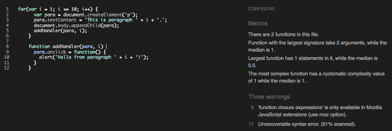
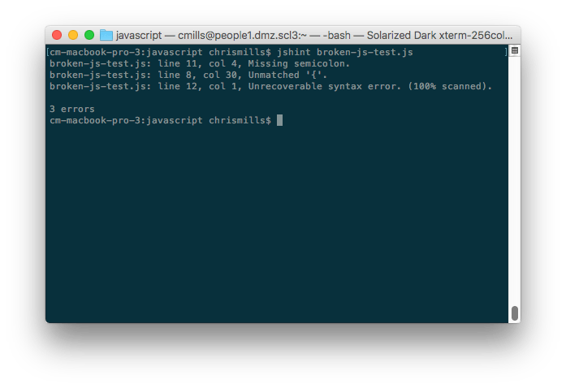
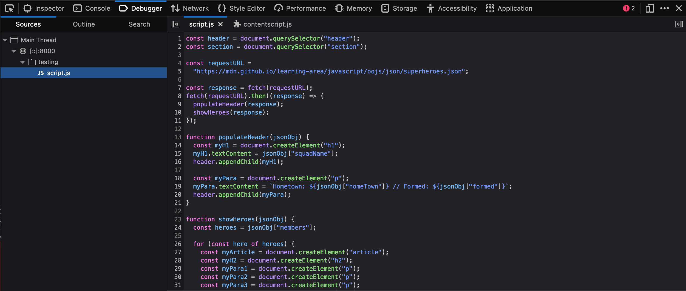
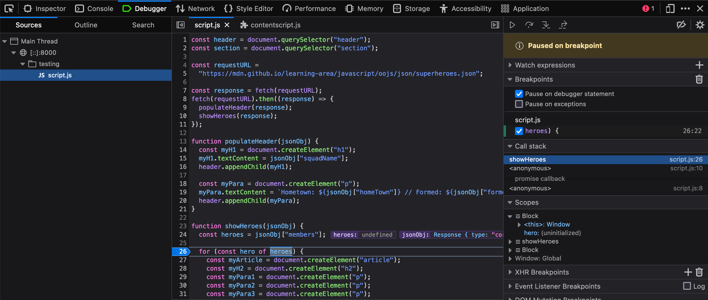

{{LearnSidebar}}{{PreviousMenuNext("Learn/Tools_and_testing/Cross_browser_testing/HTML_and_CSS","Learn/Tools_and_testing/Cross_browser_testing/Accessibility", "Learn/Tools_and_testing/Cross_browser_testing")}}

Now we'll look at common cross-browser JavaScript problems and how to fix them.
This includes information on using browser dev tools to track down and fix problems, using Polyfills and libraries to work around problems, getting modern JavaScript features working in older browsers, and more.

<table>
  <tbody>
    <tr>
      <th scope="row">Prerequisites:</th>
      <td>
        Familiarity with the core <a href="/en-US/docs/Learn/HTML">HTML</a>,
        <a href="/en-US/docs/Learn/CSS">CSS</a>, and
        <a href="/en-US/docs/Learn/JavaScript">JavaScript</a> languages; an idea of the high-level <a href="/en-US/docs/Learn/Tools_and_testing/Cross_browser_testing/Introduction">principles of cross browser testing</a>.
      </td>
    </tr>
    <tr>
      <th scope="row">Objective:</th>
      <td>
        To be able to diagnose common JavaScript cross-browser problems, and use appropriate tools and techniques to fix them.
      </td>
    </tr>
  </tbody>
</table>

## The trouble with JavaScript

Historically, JavaScript was plagued with cross-browser compatibility problems — back in the 1990s, the main browser choices back then (Internet Explorer and Netscape) had scripting implemented in different language flavors (Netscape had JavaScript, IE had JScript and also offered VBScript as an option), and while at least JavaScript and JScript were compatible to some degree (both based on the {{glossary("ECMAScript")}} specification), things were often implemented in conflicting, incompatible ways, causing developers many nightmares.

Such incompatibility problems persisted well into the early 2000s, as old browsers were still being used and still needed supporting. For example, code to create {{domxref("XMLHttpRequest")}} objects had to have special handling for Internet Explorer 6:

```js
if (window.XMLHttpRequest) {
  // Mozilla, Safari, IE7+ ...
  httpRequest = new XMLHttpRequest();
} else if (window.ActiveXObject) {
  // IE 6 and older
  httpRequest = new ActiveXObject("Microsoft.XMLHTTP");
}
```

This is one of the main reasons why libraries like [jQuery](https://jquery.com/) came into existence — to abstract away differences in browser implementations, so a developer could just use, for example, [`jQuery.ajax()`](https://api.jquery.com/jquery.ajax/), which would then handle the differences in the background.

Things have improved significantly since then; modern browsers do a good job of supporting "classic JavaScript features", and the requirement to use such code has diminished as the requirement to support older browsers has lessened (although bear in mind that they have not gone away altogether).

These days, most cross-browser JavaScript problems are seen:

- When poor-quality browser-sniffing code, feature-detection code, and vendor prefix usage block browsers from running code they could otherwise use just fine.
- When developers make use of new/nascent JavaScript features, modern Web APIs, etc. in their code, and find that such features don't work in older browsers.

We'll explore all these problems and more below.

## Fixing general JavaScript problems

As we said in the [previous article](/en-US/docs/Learn/Tools_and_testing/Cross_browser_testing/HTML_and_CSS#first_things_first_fixing_general_problems) on HTML/CSS, you should make sure your code is working generally, before going on to concentrate on the cross-browser issues. If you are not already familiar with the basics of [Troubleshooting JavaScript](/en-US/docs/Learn/JavaScript/First_steps/What_went_wrong), you should study that article before moving on. There are a number of common JavaScript problems that you will want to be mindful of, such as:

- Basic syntax and logic problems (again, check out [Troubleshooting JavaScript](/en-US/docs/Learn/JavaScript/First_steps/What_went_wrong)).
- Making sure variables, etc. are defined in the correct scope, and you are not running into conflicts between items declared in different places (see [Function scope and conflicts](/en-US/docs/Learn/JavaScript/Building_blocks/Functions#function_scope_and_conflicts)).
- Confusion about [this](/en-US/docs/Web/JavaScript/Reference/Operators/this), in terms of what scope it applies to, and therefore if its value is what you intended. You can read [What is "this"?](/en-US/docs/Learn/JavaScript/Objects/Basics#what_is_this) for a light introduction; you should also study examples like [this one](https://github.com/mdn/learning-area/blob/7ed039d17e820c93cafaff541aa65d874dde8323/javascript/oojs/assessment/main.js#L143), which shows a typical pattern of saving a `this` scope to a separate variable, then using that variable in nested functions so you can be sure you are applying functionality to the correct `this` scope.
- Incorrectly using functions inside loops that iterate with a global variable (more generally "getting the scope wrong").

> **Callout:**
> For example, in [bad-for-loop.html](https://mdn.github.io/learning-area/tools-testing/cross-browser-testing/javascript/bad-for-loop.html) (see [source code](https://github.com/mdn/learning-area/blob/main/tools-testing/cross-browser-testing/javascript/bad-for-loop.html)), we loop through 10 iterations using a variable defined with `var`, each time creating a paragraph and adding an [onclick](/en-US/docs/Web/API/Element/click_event) event handler to it. When clicked, we want each one to display an alert message containing its number (the value of `i` at the time it was created). Instead they all report `i` as 11 — because the `for` loop does all its iterating before nested functions are invoked.
>
> The easiest solution is to declare the iteration variable with `let` instead of `var`—the value of `i` associated with the function is then unique to each iteration. See [good-for-loop.html](https://mdn.github.io/learning-area/tools-testing/cross-browser-testing/javascript/good-for-loop.html) (see the [source code](https://github.com/mdn/learning-area/blob/main/tools-testing/cross-browser-testing/javascript/good-for-loop.html) also) for a version that works.

- Making sure [asynchronous operations](/en-US/docs/Learn/JavaScript/Asynchronous) have completed before trying to use the values they return. This usually means understanding how to use _promises_: using [`await`](/en-US/docs/Web/JavaScript/Reference/Operators/await) appropriately or running the code to handle the result of an asynchronous call in the promise's {{jsxref("Promise.then()", "then()")}} handler. See [How to use promises](/en-US/docs/Learn/JavaScript/Asynchronous/Promises) for an introduction to this topic.

> **Note:** [Buggy JavaScript Code: The 10 Most Common Mistakes JavaScript Developers Make](https://www.toptal.com/javascript/10-most-common-javascript-mistakes) has some nice discussions of these common mistakes and more.

### Linters

As with [HTML and CSS](/en-US/docs/Learn/Tools_and_testing/Cross_browser_testing/HTML_and_CSS#linters), you can ensure better quality, less error-prone JavaScript code using a linter, which points out errors and can also flag up warnings about bad practices, etc., and be customized to be stricter or more relaxed in their error/warning reporting. The JavaScript/ECMAScript linters we'd recommend are [JSHint](https://jshint.com/) and [ESLint](https://eslint.org/); these can be used in a variety of ways, some of which we'll detail below.

#### Online

The [JSHint homepage](https://jshint.com/) provides an online linter, which allows you to enter your JavaScript code on the left and provides an output on the right, including metrics, warnings, and errors.



#### Code editor plugins

It is not very convenient to have to copy and paste your code over to a web page to check its validity several times. What you really want is a linter that will fit into your standard workflow with the minimum of hassle. Many code editors have linter plugins. For example, see the "Plugins for text editors and IDEs" section of the [JSHint install page](https://jshint.com/install/).

#### Other uses

There are other ways to use such linters; you can read about them on the [JSHint](https://jshint.com/install/) and [ESLint](https://eslint.org/docs/user-guide/getting-started) install pages.

It is worth mentioning command line uses — you can install these tools as command line utilities (available via the CLI — command line interface) using npm (Node Package Manager — you'll have to install [NodeJS](https://nodejs.org/en/) first). For example, the following command installs JSHint:

```bash
npm install -g jshint
```

You can then point these tools at JavaScript files you want to lint, for example:



You can also use these tools with a task runner/build tool such as [Gulp](https://gulpjs.com/) or [Webpack](https://webpack.github.io/) to automatically lint your JavaScript during development. (see [Using a task runner to automate testing tools](/en-US/docs/Learn/Tools_and_testing/Cross_browser_testing/Automated_testing#using_a_task_runner_to_automate_testing_tools) in a later article.) See [ESLint integrations](https://eslint.org/docs/user-guide/integrations) for ESLint options; JSHint is supported out of the box by Grunt, and also has other integrations available, e.g. [JSHint loader for Webpack](https://github.com/webpack-contrib/jshint-loader).

> **Note:** ESLint takes a bit more setup and configuration than JSHint, but it is more powerful too.

### Browser developer tools

Browser developer tools have many useful features for helping to debug JavaScript. For a start, the JavaScript console will report errors in your code.

Make a local copy of our [fetch-broken](https://mdn.github.io/learning-area/tools-testing/cross-browser-testing/javascript/fetch-broken) example (see the [source code](https://github.com/mdn/learning-area/blob/main/tools-testing/cross-browser-testing/javascript/fetch-broken) also).

If you look at the console, you'll see an error message. The exact wording is browser-dependent, but it will be something like: "Uncaught TypeError: heroes is not iterable", and the referenced line number is 25. If we look at the source code, the relevant code section is this:

```js
function showHeroes(jsonObj) {
  const heroes = jsonObj["members"];

  for (const hero of heroes) {
    // ...
  }
}
```

So the code falls over as soon as we try to use `jsonObj` (which as you might expect, is supposed to be a [JSON object](/en-US/docs/Learn/JavaScript/Objects/JSON)). This is supposed to be fetched from an external `.json` file using the following {{domxref("fetch()")}} call:

```js
const requestURL =
  "https://mdn.github.io/learning-area/javascript/oojs/json/superheroes.json";

const response = fetch(requestURL);
populateHeader(response);
showHeroes(response);
```

But this fails.

#### The Console API

You may already know what is wrong with this code, but let's explore it some more to show how you could investigate this. For a start, there is a [Console](/en-US/docs/Web/API/console) API that allows JavaScript code to interact with the browser's JavaScript console. It has a number of features available, but the one you'll use most often is [`console.log()`](/en-US/docs/Web/API/console/log_static), which prints a custom message to the console.

Try adding a `console.log()` call to log the return value of `fetch()`, like this:

```js
const requestURL =
  "https://mdn.github.io/learning-area/javascript/oojs/json/superheroes.json";

const response = fetch(requestURL);
console.log(`Response value: ${response}`);
const superHeroes = response;
populateHeader(superHeroes);
showHeroes(superHeroes);
```

Refresh the page in the browser. This time, before the error message, you'll see a new message logged to the console:

```plain
Response value: [object Promise]
```

The `console.log()` output shows that the return value of `fetch()` is not the JSON data, it's a {{jsxref("Promise")}}. The `fetch()` function is asynchronous: it returns a `Promise` that is fulfilled only when the actual response has been received from the network. Before we can use the response, we have to wait for the `Promise` to be fulfilled.

We can do this by putting the code that uses the response inside the {{jsxref("Promise.prototype.then()", "then()")}} method of the returned `Promise`, like this:

```js
const response = fetch(requestURL);
fetch(requestURL).then((response) => {
  populateHeader(response);
  showHeroes(response);
});
```

To summarize, anytime something is not working and a value does not appear to be what it is meant to be at some point in your code, you can use `console.log()` to print it out and see what is happening.

#### Using the JavaScript debugger

Unfortunately, we still have the same error — the problem has not gone away. Let's investigate this now, using a more sophisticated feature of browser developer tools: the [JavaScript debugger](https://firefox-source-docs.mozilla.org/devtools-user/debugger/index.html) as it is called in Firefox.

> **Note:** Similar tools are available in other browsers; the [Sources tab](https://developer.chrome.com/docs/devtools/#sources) in Chrome, Debugger in Safari (see [Safari Web Development Tools](https://developer.apple.com/safari/tools/)), etc.

In Firefox, the Debugger tab looks like this:



- On the left, you can select the script you want to debug (in this case we have only one).
- The center panel shows the code in the selected script.
- The right-hand panel shows useful details pertaining to the current environment — _Breakpoints_, _Callstack_ and currently active _Scopes_.

The main feature of such tools is the ability to add breakpoints to code — these are points where the execution of the code stops, and at that point you can examine the environment in its current state and see what is going on.

Let's get to work. The error is now being thrown at line 26. Click on line number 26 in the center panel to add a breakpoint to it (you'll see a blue arrow appear over the top of it). Now refresh the page (Cmd/Ctrl + R) — the browser will pause execution of the code at line 26. At this point, the right-hand side will update to show some very useful information.



- Under _Breakpoints_, you'll see the details of the break-point you have set.
- Under _Call Stack_, you'll see a few entries — this is basically a list of the series of functions that were invoked to cause the current function to be invoked. At the top, we have `showHeroes()` the function we are currently in, and second we have `onload`, which stores the event handler function containing the call to `showHeroes()`.
- Under _Scopes_, you'll see the currently active scope for the function we are looking at. We only have three — `showHeroes`, `block`, and `Window` (the global scope). Each scope can be expanded to show the values of variables inside the scope when execution of the code was stopped.

We can find out some very useful information in here.

1. Expand the `showHeroes` scope — you can see from this that the heroes variable is `undefined`, indicating that accessing the `members` property of `jsonObj` (first line of the function) didn't work.
2. You can also see that the `jsonObj` variable is storing a {{domxref("Response")}} object, not a JSON object.

The argument to `showHeroes()` is the value the `fetch()` promise was fulfilled with. So this promise is not in the JSON format: it is a `Response` object. There's an extra step needed to retrieve the content of the response as a JSON object.

We'd like you to try fixing this problem yourself. To get you started, see the documentation for the {{domxref("Response")}} object. If you get stuck, you can find the fixed source code at <https://github.com/mdn/learning-area/blob/main/tools-testing/cross-browser-testing/javascript/fetch-fixed>.

> **Note:** The debugger tab has many other useful features that we've not discussed here, for example conditional breakpoints and watch expressions. For a lot more information, see the [Debugger](https://firefox-source-docs.mozilla.org/devtools-user/debugger/index.html) page.

### Performance issues

As your apps get more complex and you start to use more JavaScript, you may start to run into performance problems, especially when viewing apps on slower devices. Performance is a big topic, and we don't have time to cover it in detail here. Some quick tips are as follows:

- To avoid loading more JavaScript than you need, bundle your scripts into a single file using a solution like [Browserify](https://browserify.org/). In general, reducing the number of HTTP requests is very good for performance.
- Make your files even smaller by minifying them before you load them onto your production server. Minifying squashes all the code together onto a huge single line, making it take up far less file size. It is ugly, but you don't need to read it when it is finished! This is best done using a minification tool like [Uglify](https://github.com/mishoo/UglifyJS) (there's also an online version — see [JSCompress.com](https://jscompress.com/))
- When using APIs, make sure you turn off the API features when they are not being used; some API calls can be really expensive on processing power. For example, when showing a video stream, make sure it is turned off when you can't see it. When tracking a device's location using repeated Geolocation calls, make sure you turn it off when the user stops using it.
- Animations can be really costly for performance. A lot of JavaScript libraries provide animation capabilities programmed by JavaScript, but it is much more cost effective to do the animations via native browser features like [CSS Animations](/en-US/docs/Web/CSS/CSS_animations/Using_CSS_animations) (or the nascent [Web Animations API](/en-US/docs/Web/API/Web_Animations_API)) than JavaScript. Read Brian Birtles' [Animating like you just don't care with Element.animate](https://hacks.mozilla.org/2016/08/animating-like-you-just-dont-care-with-element-animate/) for some really useful theory on why animation is expensive, tips on how to improve animation performance, and information on the Web Animations API.

> **Note:** Addy Osmani's [Writing Fast, Memory-Efficient JavaScript](https://www.smashingmagazine.com/2012/11/writing-fast-memory-efficient-javascript/) contains a lot of detail and some excellent tips for boosting JavaScript performance.

## Cross-browser JavaScript problems

In this section, we'll look at some of the more common cross-browser JavaScript problems. We'll break this down into:

- Using modern core JavaScript features
- Using modern Web API features
- Using bad browser sniffing code
- Performance problems

### Using modern JavaScript/API features

In the [previous article](/en-US/docs/Learn/Tools_and_testing/Cross_browser_testing/HTML_and_CSS) we described some of the ways in which HTML and CSS errors and unrecognized features can be handled due to the nature of the languages. JavaScript is not as permissive as HTML and CSS however — if the JavaScript engine encounters mistakes or unrecognized syntax, such as when new, unsupported features are used, more often than not it will throw errors.

There are a few strategies for handling new feature support; let's explore the most common ones.

> **Note:** These strategies do not exist in separate silos — you can, of course combine them as needed. For example, you could use feature detection to determine whether a feature is supported; if it isn't, you could then run code to load a polyfill or a library to handle the lack of support.

#### Feature detection

The idea behind feature detection is that you can run a test to determine whether a JavaScript feature is supported in the current browser, and then conditionally run code to provide an acceptable experience both in browsers that do and don't support the feature. As a quick example, the [Geolocation API](/en-US/docs/Web/API/Geolocation_API) (which exposes available location data for the device the web browser is running on) has a main entry point for its use — a `geolocation` property available on the global [Navigator](/en-US/docs/Web/API/Navigator) object. Therefore, you can detect whether the browser supports geolocation or not by using something like the following:

```js
if ("geolocation" in navigator) {
  navigator.geolocation.getCurrentPosition((position) => {
    // show the location on a map, perhaps using the Google Maps API
  });
} else {
  // Give the user a choice of static maps instead perhaps
}
```

You could also write such a test for a CSS feature, for example by testing for the existence of _[element.style.property](/en-US/docs/Web/API/HTMLElement/style)_ (e.g. `paragraph.style.transform !== undefined`).
If you're looking to apply styles if a CSS feature is supported, you can directly use the [@supports](/en-US/docs/Web/CSS/@supports) at-rule (known as a feature query).
For example, to check whether the browser supports CSS container queries, you could do something like this:

```css
@supports (container-type: inline-size) {
  /* Use container queries if supported */
}
```

As a last point, don't confuse feature detection with **browser sniffing** (detecting what specific browser is accessing the site) — this is a terrible practice that should be discouraged at all costs. See [don't browser sniff](#dont_browser_sniff), later on, for more details.

> **Note:** Feature detection will be covered in a lot more detail in its own dedicated article, later in the module.

#### Libraries

JavaScript libraries are essentially third party units of code that you can attach to your page, providing you with a wealth of ready-made functionality that can be used straight away, saving you a lot of time in the process. A lot of JavaScript libraries probably came into existence because their developer was writing a set of common utility functions to save them time when writing future projects, and decided to release them into the wild because other people might find them useful too.

JavaScript libraries tend to come in a few main varieties (some libraries will serve more than one of these purposes):

- Utility libraries: Provide a bunch of functions to make mundane tasks easier and less boring to manage. [jQuery](https://jquery.com/) for example provides its own fully-featured selectors and DOM manipulation libraries, to allow CSS-selector type selecting of elements in JavaScript and easier DOM building. It is not so important now we have modern features like {{domxref("Document.querySelector()")}}/{{domxref("Document.querySelectorAll()")}}/{{domxref("Node")}} methods available across browsers, but it can still be useful when older browsers need supporting.
- Convenience libraries: Make difficult things easier to do. For example, the [WebGL API](/en-US/docs/Web/API/WebGL_API) is really complex and challenging to use when you write it directly, so the [Three.js](https://threejs.org/) library (and others) is built on top of WebGL and provides a much easier API for creating common 3D objects, lighting, textures, etc.
  The [Service Worker API](/en-US/docs/Web/API/Service_Worker_API) is also very complex to use, so code libraries have started appearing to make common Service Worker uses-cases much easier to implement (see the [Service Worker Cookbook](https://github.com/mdn/serviceworker-cookbook) for several useful code samples).
- Effects libraries: These libraries are designed to allow you to easily add special effects to your websites. This was more useful back when "DHTML" was a popular buzzword, and implementing an effect involved a lot of complex JavaScript, but these days browsers have a lot of built in CSS features and APIs to implementing effects more easily.
- UI libraries: Provide methods for implementing complex UI features that would otherwise be challenging to implement and get working cross browser, for example [Foundation](https://get.foundation/), [Bootstrap](https://getbootstrap.com/), and [Material-UI](https://mui.com/) (the latter is a set of components for use with the React framework). These tend to be used as the basis of an entire site layout; it is often difficult to drop them in just for one UI feature.
- Normalization libraries: Give you a simple syntax that allows you to easily complete a task without having to worry about cross browser differences. The library will manipulate appropriate APIs in the background so the functionality will work whatever the browser (in theory). For example, [LocalForage](https://github.com/localForage/localForage) is a library for client-side data storage, which provides a simple syntax for storing and retrieving data. In the background, it uses the best API the browser has available for storing the data, whether that is [IndexedDB](/en-US/docs/Web/API/IndexedDB_API), [Web Storage](/en-US/docs/Web/API/Web_Storage_API), or even Web SQL (which is now deprecated, but is still supported in Chromium-based browsers in secure contexts). As another example, jQuery

When choosing a library to use, make sure that it works across the set of browsers you want to support, and test your implementation thoroughly. Also make sure that the library is popular and well-supported, and isn't likely to just become obsolete next week. Talk to other developers to find out what they recommend, see how much activity and how many contributors the library has on GitHub (or wherever else it is stored), etc.

Library usage at a basic level tends to consist of downloading the library's files (JavaScript, possibly some CSS or other dependencies too) and attaching them to your page (e.g. via a {{htmlelement("script")}} element), although there are normally many other usage options for such libraries, like installing them as [Bower](https://bower.io/) components, or including them as dependencies via the [Webpack](https://webpack.github.io/) module bundler. You will have to read the libraries' individual install pages for more information.

> **Note:** You will also come across JavaScript frameworks in your travels around the Web, like [Ember](https://emberjs.com/) and [Angular](https://angularjs.org/). Whereas libraries are often usable for solving individual problems and dropping into existing sites, frameworks tend to be more along the lines of complete solutions for developing complex web applications.

#### Polyfills

Polyfills also consist of 3rd party JavaScript files that you can drop into your project, but they differ from libraries — whereas libraries tend to enhance existing functionality and make things easier, polyfills provide functionality that doesn't exist at all. Polyfills use JavaScript or other technologies entirely to build in support for a feature that a browser doesn't support natively. For example, you might use a polyfill like [es6-promise](https://github.com/stefanpenner/es6-promise) to make promises work in browsers where they are not supported natively.

Let's work through an exercise — in this example used for demonstration purposes only, we use a Fetch polyfill and an es6-promise polyfill. While Fetch and promises are fully supported in modern browsers, if we were targeting a browser that did not support Fetch that browser would likely not support Fetch either, and Fetch makes heavy use of promises:

1. To get started, make a local copy of our [fetch-polyfill.html](https://github.com/mdn/learning-area/blob/main/tools-testing/cross-browser-testing/javascript/fetch-polyfill.html) example and [our nice image of some flowers](https://github.com/mdn/learning-area/blob/main/tools-testing/cross-browser-testing/javascript/flowers.jpg) in a new directory. We are going to write code to fetch the flowers image and display it in the page.
2. Next, save a copy of the [Fetch polyfill](https://raw.githubusercontent.com/github/fetch/master/fetch.js) in the same directory as the HTML.
3. Apply the polyfill scripts to the page using the following code — place these above the existing {{htmlelement("script")}} element so they will be available on the page already when we start trying to use Fetch (we are also loading a Promise polyfill from a CDN, as IE11 does support promises, which fetch requires):

   ```html
   <script src="https://cdn.jsdelivr.net/npm/es6-promise@4/dist/es6-promise.min.js"></script>
   <script src="https://cdn.jsdelivr.net/npm/es6-promise@4/dist/es6-promise.auto.min.js"></script>
   <script src="fetch.js"></script>
   ```

4. Inside the original {{htmlelement("script")}}, add the following code:

   ```js
   const myImage = document.querySelector(".my-image");

   fetch("flowers.jpg").then((response) => {
     response.blob().then((myBlob) => {
       const objectURL = URL.createObjectURL(myBlob);
       myImage.src = objectURL;
     });
   });
   ```

5. If you load it in a browser that doesn't support [Fetch](/en-US/docs/Web/API/Window/fetch), you should still see the flower image appear — cool!
   

> **Note:** You can find our finished version at [fetch-polyfill-finished.html](https://mdn.github.io/learning-area/tools-testing/cross-browser-testing/javascript/fetch-polyfill-finished.html) (see also the [source code](https://github.com/mdn/learning-area/blob/main/tools-testing/cross-browser-testing/javascript/fetch-polyfill-finished.html)).

> **Note:** Again, there are many different ways to make use of the different polyfills you will encounter — consult each polyfill's individual documentation.

One thing you might be thinking is "why should we always load the polyfill code, even if we don't need it?" This is a good point — as your sites get more complex and you start to use more libraries, polyfills, etc., you can start to load a lot of extra code, which can start to affect performance, especially on less-powerful devices. It makes sense to only load files as needed.

Doing this requires some extra setup in your JavaScript. You need some kind of a feature detection test that detects whether the browser supports the feature we are trying to use:

```js
if (browserSupportsAllFeatures()) {
  main();
} else {
  loadScript("polyfills.js", main);
}

function main(err) {
  // actual app code goes in here
}
```

So first we run a conditional that checks whether the function `browserSupportsAllFeatures()` returns `true`. If it does, we run the `main()` function, which will contain all our app's code. `browserSupportsAllFeatures()` looks like this:

```js
function browserSupportsAllFeatures() {
  return window.Promise && window.fetch;
}
```

Here we are testing whether the [`Promise`](/en-US/docs/Web/JavaScript/Reference/Global_Objects/Promise) object and [`fetch()`](/en-US/docs/Web/API/Window/fetch) function exist in the browser. If both do, the function returns `true`. If the function returns `false`, then we run the code inside the second part of the conditional — this runs a function called `loadScript()`, which loads the polyfills into the page, then runs `main()` after the loading has finished. `loadScript()` looks like this:

```js
function loadScript(src, done) {
  const js = document.createElement("script");
  js.src = src;
  js.onload = () => {
    done();
  };
  js.onerror = () => {
    done(new Error(`Failed to load script ${src}`));
  };
  document.head.appendChild(js);
}
```

This function creates a new `<script>` element, then sets its `src` attribute to the path we specified as the first argument (`'polyfills.js'` when we called it in the code above). When it has loaded, we run the function we specified as the second argument (`main()`). If an error occurs in the loading of the script, we still call the function, but with a custom error that we can retrieve to help debug a problem if it occurs.

Note that `polyfills.js` is basically the two polyfills we are using put together into one file. We did this manually, but there are cleverer solutions that will automatically generate bundles for you — see [Browserify](https://browserify.org/) (see [Getting started with Browserify](https://www.sitepoint.com/getting-started-browserify/) for a basic tutorial). It is a good idea to bundle JS files into one like this — reducing the number of HTTP requests you need to make improves the performance of your site.

You can see this code in action in [fetch-polyfill-only-when-needed.html](https://mdn.github.io/learning-area/tools-testing/cross-browser-testing/javascript/fetch-polyfill-only-when-needed.html) (see the [source code also](https://github.com/mdn/learning-area/blob/main/tools-testing/cross-browser-testing/javascript/fetch-polyfill-only-when-needed.html)). We'd like to make it clear that we can't take credit for this code — it was originally written by Philip Walton. Check out his article [Loading Polyfills Only When Needed](https://philipwalton.com/articles/loading-polyfills-only-when-needed/) for the original code, plus a lot of useful explanation around the wider subject.

#### JavaScript transpiling

Another option that is becoming popular for people who want to use modern JavaScript features now is converting code that uses recent ECMAScript features to a version that will work in older browsers.

> **Note:** This is called "transpiling" — you are not compiling code into a lower level to be run on a computer (like you would say with C code); instead, you are changing it into a syntax that exists at a similar level of abstraction so it can be used in the same way, but in slightly different circumstances (in this case, transforming one flavor of JavaScript into another).

A common transpiler is [Babel.js](https://babeljs.io/) but there are others.

### Don't browser sniff

Historically developers used _browser sniffing code_ to detect which browser the user was using, and give them appropriate code to work on that browser.

All browsers have a **user-agent** string, which identifies what the browser is (version, name, OS, etc.). Many developers implemented bad browser sniffing code and didn't maintain it. This lead to supporting browsers getting locked out of using websites they could easily render. This became so common that browsers started to lie about what browser they were in their user-agent strings (or claim they were all browsers), to get around sniffing code. Browsers also implemented facilities to allow users to change what user-agent string the browser reported when queried with JavaScript. This all made browser sniffing even more error prone, and ultimately pointless.

[History of the browser user-agent string](https://webaim.org/blog/user-agent-string-history/) by Aaron Andersen provides a useful and amusing take on the history of browser sniffing.
Use [feature detection](#feature_detection) (and CSS @supports for CSS feature detection) to reliably detect whether a feature is supported. But doing so, you won't need to change your code when new browser versions come out.

### Handling JavaScript prefixes

In the previous article, we included quite a lot of discussion about [handling CSS prefixes](/en-US/docs/Learn/Tools_and_testing/Cross_browser_testing/HTML_and_CSS#handling_css_prefixes). Well, new JavaScript implementations used to use prefixes as well, with JavaScript using {{Glossary("camel_case", "camel case")}} rather than {{Glossary("kebab_case", "hyphenation")}} like CSS. For example, if a prefix was being used on a new jshint API object called `Object`:

- Mozilla would use `mozObject`
- Chrome/Opera/Safari would use `webkitObject`
- Microsoft would use `msObject`

Here's an example, taken from our [violent-theremin demo](https://mdn.github.io/webaudio-examples/violent-theremin/) (see [source code](https://github.com/mdn/webaudio-examples/tree/main/violent-theremin)), which uses a combination of the [Canvas API](/en-US/docs/Web/API/Canvas_API) and the [Web Audio API](/en-US/docs/Web/API/Web_Audio_API) to create a fun (and noisy) drawing tool:

```js
const AudioContext = window.AudioContext || window.webkitAudioContext;
const audioCtx = new AudioContext();
```

In the case of the Web Audio API, the key entry points to using the API were supported in Chrome/Opera via `webkit` prefixed versions (they now support the unprefixed versions). The easy way to get around this situation is to create a new version of the objects that are prefixed in some browsers, and make it equal to the non-prefixed version, OR the prefixed version (OR any other prefixed versions that need consideration) — whichever one is supported by the browser currently viewing the site will be used.

Then we use that object to manipulate the API, rather than the original one. In this case we are creating a modified [AudioContext](/en-US/docs/Web/API/AudioContext) constructor, then creating a new audio context instance to use for our Web Audio coding.

This pattern can be applied to just about any prefixed JavaScript feature. JavaScript libraries/polyfills also make use of this kind of code, to abstract browser differences away from the developer as much as possible.

Again, prefixed features were never supposed to be used in production websites — they are subject to change or removal without warning, and cause cross browser issues. If you insist on using prefixed features, make sure you use the right ones. You can look up what browsers require prefixes for different JavaScript/API features on MDN reference pages, and sites like [caniuse.com](https://caniuse.com/). If you are unsure, you can also find out by doing some testing directly in browsers.

For example, try going into your browser's developer console and start typing

```js
window.AudioContext;
```

If this feature is supported in your browser, it will autocomplete.

## Finding help

There are many other issues you'll encounter with JavaScript; the most important thing to know really is how to find answers online. Consult the HTML and CSS article's [Finding help section](/en-US/docs/Learn/Tools_and_testing/Cross_browser_testing/HTML_and_CSS#finding_help) for our best advice.

## Summary

So that's JavaScript. Simple huh? Maybe not so simple, but this article should at least give you a start, and some ideas on how to tackle the JavaScript-related problems you will come across.

{{PreviousMenuNext("Learn/Tools_and_testing/Cross_browser_testing/HTML_and_CSS","Learn/Tools_and_testing/Cross_browser_testing/Accessibility", "Learn/Tools_and_testing/Cross_browser_testing")}}
