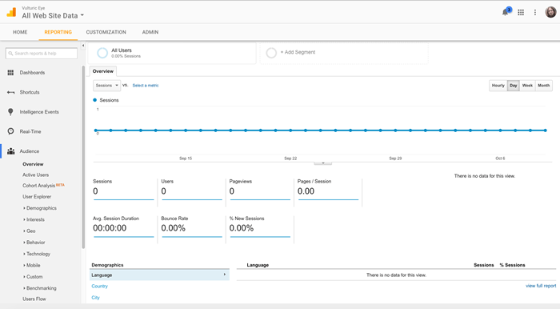
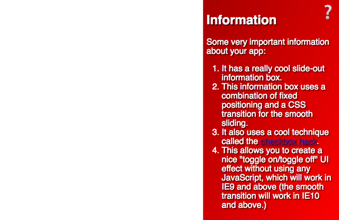
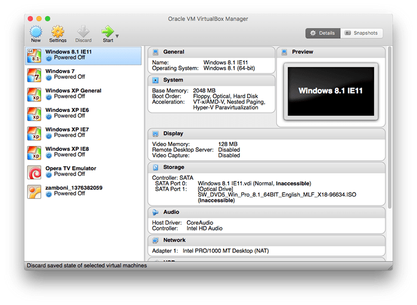
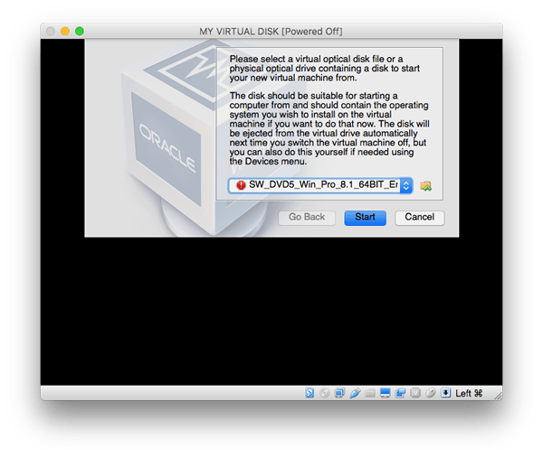
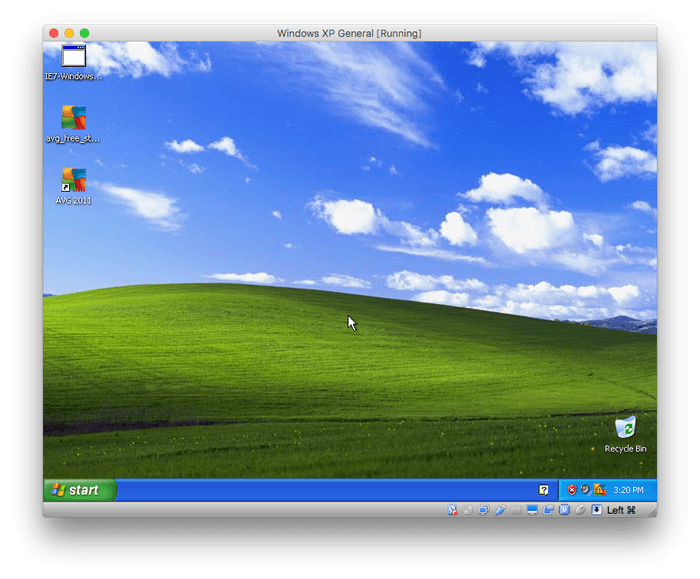

{{LearnSidebar}}{{PreviousMenuNext("Learn/Tools_and_testing/Cross_browser_testing/Introduction","Learn/Tools_and_testing/Cross_browser_testing/HTML_and_CSS", "Learn/Tools_and_testing/Cross_browser_testing")}}

This article explains how to do cross-browser testing: how to choose which browsers and devices to test, how to actually test those browsers and devices, and how to test with user groups.

<table>
  <tbody>
    <tr>
      <th scope="row">Prerequisites:</th>
      <td>
        Familiarity with the core <a href="/en-US/docs/Learn/HTML">HTML</a>,
        <a href="/en-US/docs/Learn/CSS">CSS</a>, and
        <a href="/en-US/docs/Learn/JavaScript">JavaScript</a> languages; an idea
        of the high-level
        <a
          href="/en-US/docs/Learn/Tools_and_testing/Cross_browser_testing/Introduction"
          >principles of cross-browser testing</a
        >.
      </td>
    </tr>
    <tr>
      <th scope="row">Objective:</th>
      <td>
        To gain an understanding of the high-level concepts involved in
        cross-browser testing.
      </td>
    </tr>
  </tbody>
</table>

## Choosing which browsers and devices to test

Since you can't test every combination of browser and device, it's enough that you ensure your site works on the most important ones. In practical applications, "important" often means "commonly used among the target audience."

You can classify browsers and devices by the amount of support you intend to give. For example:

1. A-grade: Common/modern browsers — Known to be capable. Test thoroughly and provide full support.
2. B-grade: Older/less capable browsers — known not to be capable. Test, and provide a more basic experience that gives full access to core information and services.
3. C-grade: Rare/unknown browsers — don't test, but assume they are capable. Serve the full site, which should work, at least with the fallbacks provided by our defensive coding.

In the following sections, we'll build up a support chart in this format.

> **Note:** Yahoo first made this approach popular, with their [Graded browser Support](https://github.com/yui/yui3/wiki/Graded-Browser-Support) approach.

### Predict your audience's most commonly used browsers

This typically involves making educated guesses based on user demographics. For example, suppose your users are in North America and Western Europe:

A quick online search tells you that most people in North America and Western Europe use Windows or Mac desktops/laptops, where the main browsers are Chrome, Firefox, Safari, and Edge. You'd probably want to just test the latest versions of these browsers, as these browsers get regular updates. These should all go in the A-grade tier.

Most people in this demographic also use either iOS or Android phones, so you'd probably want to test the latest versions of iOS Safari, the last couple of versions of the old Android stock browser, and Chrome and Firefox for iOS and Android. You should ideally test these on both a phone and a tablet, to ensure responsive designs work.

Opera Mini [isn't very capable of running complex JavaScript](https://dev.opera.com/articles/opera-mini-and-javascript/), so we should put this into grade B as well.

Thus, we've based our choice of which browsers to test on the browsers that we expect our users to use.
This gives us the following support chart so far:

1. A-grade: Chrome and Firefox for Windows/Mac, Safari for Mac, Edge for Windows, iOS Safari for iPhone/iPad, Android stock browser (last two versions) on phone/tablet, Chrome, and Firefox for Android (last two versions) on phone/tablet
2. B-grade: Opera Mini
3. C-grade: n/a

If your target audience is mostly located somewhere else, then the most common browsers and OSs may differ from the above.

> **Note:** "The CEO of my company uses a Blackberry, so we'd better make sure it looks good on that" can also be something to consider.

### Browser statistics

Some websites show which browsers are popular in a given region. For example, [Statcounter](https://gs.statcounter.com/) gives an idea of trends in North America.

### Using analytics

A much more accurate source of data, if you can get it, is an analytics app like [Google Analytics](https://marketingplatform.google.com/about/analytics/), which tells you exactly what browsers people are using to browse your site. Of course, this relies on you already having a site to use it on, so it isn't good for completely new sites.

You may also consider using open-source and privacy-focused analytics platforms like [Open Web Analytics](https://www.openwebanalytics.com/) and [Matomo](https://matomo.org). They expect you to self-host the analytics platform.

#### Setting up Google analytics

1. First of all, you'll need a Google account. Use this account to sign into [Google Analytics](https://marketingplatform.google.com/about/analytics/).
2. Choose the [Google Analytics](https://analytics.google.com/analytics/web/) (web) option, and click the _Sign Up_ button.
3. Enter your website/app details into the signup page. This is fairly intuitive to set up; the most important field to get right is the website URL. This needs to be your site/app's root URL.
4. Once you've finished filling in everything, press the _Get Tracking ID_ button, then accept the terms of service that appear.
5. The next page provides you with some code snippets and other instructions. For a basic website, what you need to do is copy the _Website tracking_ code block and paste it into all the different pages you want to track using Google Analytics on your site. You could place the snippets below your closing `</body>` tag, or somewhere else appropriate that keeps it from getting muddled up with your application code.
6. Upload the changes to the development server, or wherever else you need your code.

That's it! Your site should now be ready to start reporting analytics data.

#### Studying analytics data

Now you should be able to go back to the [Analytics Web](https://analytics.google.com/analytics/web) homepage, and start looking at the data you've collected about your site (you need to leave a little bit of time for some data to actually be collected, of course.)

By default, you should see the reporting tab, like so:

There is a huge amount of data you could look at using Google Analytics — customized reports in different categories, etc. — and we haven't got time to discuss it all.
[Getting started with Analytics](https://support.google.com/analytics/answer/9306384?visit_id=637855964517698041-2103767437&rd=1) provides some useful guidance on reporting (and more) for beginners.

You can see what browsers and operating systems your users are using by selecting _Audience > Technology > Browser & OS_ from the left-hand menu.

> **Note:** When using Google analytics, you need to beware of misleading bias, e.g. "We have no Firefox Mobile users" might lead you to not bother supporting Firefox mobile. But you are not going to have any Firefox Mobile users if the site was broken on Firefox mobile in the first place.

### Other considerations

You should include accessibility as a grade A testing requirement (we'll cover exactly what you should test in our Handling common accessibility problems article).

Also, you should be aware of situation-specific needs. For example, if you are creating some kind of company intranet for delivering sales figures to managers, and all the managers have been provided with Windows phones, you will probably want to make mobile IE support a priority.

### Final support chart

So, our final support chart will end up looking like so:

1. A-grade: Chrome and Firefox for Windows/Mac, Safari for Mac, and Edge (last two versions of each), iOS Safari for iPhone/iPad, Android stock browser (last two versions) on phone/tablet, Chrome, and Firefox for Android (last two versions) on phone tablet. Accessibility passing common tests.
2. B-grade: Opera Mini.
3. C-grade: Opera, other niche modern browsers.

## What are you going to test?

When you've got a new addition to your codebase that needs testing, before you start testing you should write out a list of testing requirements that need to pass to be accepted. These requirements can be visual or functional — both combine to make a usable website feature.

Consider the following example (see the [source code](https://github.com/mdn/learning-area/blob/main/tools-testing/cross-browser-testing/strategies/hidden-info-panel.html), and also the [example running live](https://mdn.github.io/learning-area/tools-testing/cross-browser-testing/strategies/hidden-info-panel.html)):

Test criteria for this feature could be written like so:

A and B grade:

- Button should be activatable by the user's primary control mechanism, whatever it is — this should include mouse, keyboard, and touch.
- Toggling the button should make the information box appear/disappear.
- The text should be readable.
- Visually impaired users using screen readers should be able to access the text.

A-grade:

- The information box should animate smoothly as it appears/disappears.
- The gradient and text shadow should appear to enhance the look of the box.

You may notice from the text in the example that it won't work in IE8 — this is a problem according to our support chart, which you'll have to work on, perhaps by using a feature detection library to implement the functionality in a different way if the browser doesn't support CSS transitions (see Implementing feature detection, later on in the course).

You might also notice that the button isn't usable using only the keyboard — this also needs to be remedied. Maybe we could use some JavaScript to implement a keyboard control for the toggle, or use some other method entirely?

These test criteria are useful, because:

- They give you a set of steps to follow when you are performing tests.
- They can be easily turned into sets of instructions for user groups to follow when carrying out tests (e.g. "try to activate the button using your mouse, and then the keyboard…") — see [User testing](#user_testing), below.
- They can also provide a basis for writing automated tests. It is easier to write such tests if you know exactly what you want to test, and what the success conditions are (see [Selenium](/en-US/docs/Learn/Tools_and_testing/Cross_browser_testing/Your_own_automation_environment#selenium), later in the series).

## Putting together a testing lab

One option for carrying out browser tests is to do the testing yourself. To do this, you will probably use a combination of actual physical devices, and emulated environments (using either an emulator or a virtual machine).

### Physical devices

It is generally better to have a real device running the browser you want to test — this provides the greatest accuracy in terms of behavior and overall user experience. You'll probably want something like the following, for a reasonable low-level device lab:

- A Mac, with the browsers installed that you need to test — this can include Firefox, Chrome, Opera, and Safari.
- A Windows PC, with the browsers installed that you need to test — this can include Edge (or IE), Chrome, Firefox, and Opera.
- A higher-spec Android phone and tablet with the browser installed that you need to test — this can include Chrome, Firefox, and Opera Mini for Android, as well as the original Android stock browser.
- A higher-spec iOS phone and tablet with the browsers installed that you need to test — this can include iOS Safari and Chrome, Firefox, and Opera Mini for iOS.

The following are also good options, if you can get them:

- A Linux PC available, in case you need to test bugs specific to Linux versions of browsers. Linux users commonly use Firefox, Opera, and Chrome. If you only have one machine available, you could consider creating a dual boot machine running Linux and Windows on separate partitions. Ubuntu's installer makes this quite easy to set up; see [WindowsDualBoot](https://help.ubuntu.com/community/WindowsDualBoot) for help with this.
- A couple of lower-spec mobile devices, so you can test the performance of features like animations on less powerful processors.

Your main work machine can also be a place to install other tools for specific purposes, such as accessibility auditing tools, screen readers, and emulators/virtual machines.

Some larger companies have device labs that stock a very large selection of different devices, enabling developers to hunt down bugs on very specific browser/device combinations. Smaller companies and individuals are generally not able to afford such a sophisticated lab, so tend to make do with smaller labs, emulators, virtual machines, and commercial testing apps.

We will cover each of the other options below.

> **Note:** Some efforts have been made to create publicly accessible device labs — see [Open Device Labs](https://www.smashingmagazine.com/2016/11/worlds-best-open-device-labs/).

> **Note:** We also need to consider accessibility — there are a number of useful tools you can install on your machine to facilitate accessibility testing, but we'll cover those in the Handling common accessibility problems article, later in the course.

### Emulators

Emulators are basically programs that run inside your computer and emulate a device or particular device conditions of some kind, allowing you to do some of your testing more conveniently than having to find a particular combination of hardware/software to test.

An emulator might be as simple as testing a device condition. For example, if you want to do some quick and dirty testing of your width/height media queries for responsive design, you could use Firefox's [Responsive Design Mode](https://firefox-source-docs.mozilla.org/devtools-user/responsive_design_mode/index.html). Safari has a similar mode too, which can be enabled by going to _Safari > Preferences_, and checking _Show Develop menu_, then choosing _Develop > Enter Responsive Design Mode_. Chrome also has something similar: Device mode (see [Simulate Mobile Devices with Device Mode](https://developer.chrome.com/docs/devtools/device-mode/)).

More often than not though, you'll have to install some kind of emulator. The most common devices/browsers you'll want to test are as follows:

- The official [Android Studio IDE](https://developer.android.com/studio/) for developing Android apps is a bit heavy weight for just testing websites on Google Chrome or the old Stock Android browser, but it does come with a Robust [emulator](https://developer.android.com/studio/run/emulator.html). If you want something a bit more lightweight, [Andy](https://www.andyroid.net/) is a reasonable option that runs on both Windows and Mac.
- Apple provides an app called [Simulator](https://help.apple.com/simulator/mac/current/) that runs on top of the [XCode](https://developer.apple.com/xcode/) development environment, and emulates iPad/iPhone/Apple Watch/Apple TV. This includes the native iOS Safari browser. This unfortunately only runs on a Mac.

You can often find simulators for other mobile device environments too, for example:

- You can emulate [Opera Mini](https://dev.opera.com/articles/installing-opera-mini-on-your-computer/) on its own if you want to test it.
- There are emulators available for Windows Mobile OSes: see [Windows Phone Emulator for Windows Phone 8](<https://msdn.microsoft.com/library/windows/apps/ff402563(v=vs.105).aspx>) and [Test with the Microsoft Emulator for Windows 10 Mobile](https://docs.microsoft.com/windows/uwp/debug-test-perf/test-with-the-emulator) (these only run on Windows).

> **Note:** Many emulators actually require the use of a virtual machine (see below); when this is the case, instructions are often provided, and/or use of the virtual machine is incorporated into the installer of the emulator.

### Virtual machines

Virtual machines are applications that run on your desktop computer and allow you to run emulations of entire operating systems, each compartmentalized in its own virtual hard drive (often represented by a single large file existing on the host machine's hard drive). There are a number of popular virtual machine apps available, such as [Parallels](https://www.parallels.com/), [VMWare](https://www.vmware.com/), and [Virtual Box](https://www.virtualbox.org/wiki/Downloads); we personally like the latter, because it is free.

> **Note:** You need a lot of hard disk space available to run virtual machine emulations; each operating system you emulate can take up a lot of memory. You tend to choose the hard drive space you want for each install; you could get away with probably 10GB, but some sources recommend up to 50GB or more, so the operating system will run reliably. A good option provided by most virtual machine apps is to create a **dynamically allocated** hard drive that grows and shrinks as the need arises.

To use a Virtual Box, you need to:

1. Get hold of an installer disk or image (e.g. ISO file) for the operating system you want to emulate. Virtual Box is unable to provide these; most, like Windows OSes, are commercial products that can't be freely distributed.
2. [Download the appropriate installer](https://www.virtualbox.org/wiki/Downloads) for your operating system and install it.
3. Open the app; you'll be presented with a view like the following: 
4. To create a new virtual machine, press the _New_ button in the top left-hand corner.
5. Follow the instructions and fill in the following dialog boxes as appropriate. You'll:

   1. Provide a name for the new virtual machine
   2. Choose which operating system and version you are installing on it
   3. Set how much RAM should be allocated (we'd recommend something like 2048MB, or 2GB)
   4. Create a virtual hard disk (choose the default options across the three dialog boxes containing _Create a virtual hard disk now_, _VDI (virtual disk image)_, and _Dynamically allocated_).
   5. Choose the file location and size for the virtual hard disk (choose a sensible name and location to keep it, and for the size specify around 50GB, or as much as you are comfortable with specifying).

Now the new virtual box should appear in the left-hand menu of the main Virtual Box UI window. At this point, you can double-click to open it — it will start to boot up the virtual machine, but it won't yet have the operating system (OS) installed. At this point you need to point the dialog box at the installer image/disk, and it will run through the steps to install the OS just like on a physical machine.

> **Warning:** You need to make sure you have the operating system image you want to install on the virtual machine available at this point, and install it right away. If you cancel the process at this point, it can render the virtual machine unusable, and make it so you need to delete it and create it again. This is not fatal, but it is annoying.

After the process has completed, you should have a virtual machine running an operating system inside a window on your host computer.

You need to treat this virtual operating system installation just like you would any real installation — for example, as well as installing the browsers you want to test, install an anti-virus program to protect it from viruses.

Having multiple virtual machines is very useful, particularly for Windows IE/Edge testing — on Windows, you are not able to have multiple versions of the default browser installed side by side, so you might want to build up a library of virtual machines to handle different tests as required, e.g.:

- Windows 10 with Edge 14
- Windows 10 with Edge 13

> **Note:** Another good thing about virtual machines is that the virtual disk images are fairly self-contained. If you are working on a team, you can create one virtual disk image, then copy it and pass it around. Just make sure you have the required licenses to run all those copies of Windows or whatever else you are running if it is a licensed product.

### Automation and commercial apps

As mentioned in the last chapter, you can take a lot of the pain out of browser testing by using some kind of automation system. You can set up your own testing automation system ([Selenium](https://www.selenium.dev/) being the popular app of choice), which does take some setup, but can be very rewarding when you get it worked out.

There are also commercial tools available such as [Sauce Labs](https://saucelabs.com/), [Browser Stack](https://www.browserstack.com/) and [LambdaTest](https://www.lambdatest.com/) that do this kind of thing for you, without you having to worry about the setup, if you wish to invest some money in your testing.

Another alternative is to use no-code test automation tools such as [Endtest](https://endtest.io).

We will look at how to use such tools later on in the module.

## User testing

Before we move on, we'll finish this article off by talking a bit about user testing — this can be a good option if you have a willing user group to test your new functionality on. Bear in mind that this can be as lo-fi or as sophisticated as you like — your user group could be a group of friends, a group of colleagues, or a group of unpaid or paid volunteers, depending on whether you have any money to spend on testing.

Generally, you'll get your users to look at the page or view containing the new functionality on some kind of a development server, so you are not putting the final site or change live until it is finished. You should get them to follow some steps and report the results they get. It is useful to provide a set of steps (sometimes called a script) so that you get more reliable results pertaining to what you were trying to test. We mentioned this in the [What are you going to test](#what_are_you_going_to_test) section above — it is easy to turn the test criteria detailed there into steps to follow. For example, the following would work for a sighted user:

- Click the question mark button using the mouse on your desktop computer a few times. Refresh the browser window.
- Select and activate the question mark button using the keyboard on your desktop computer a few times.
- Tap the question mark button a few times on your touch screen device.
- Toggling the button should make the information box appear/disappear. Does it do this, in each of the above three cases?
- Is the text readable?
- Does the information box animate smoothly as it appears/disappears?

When running tests, it can also be a good idea to:

- Set up a separate browser profile where possible, with browser extensions and other such things disabled, and run your tests in that profile (see [Use the Profile Manager to create and remove Firefox profiles](https://support.mozilla.org/en-US/kb/profile-manager-create-remove-switch-firefox-profiles) and [Share Chrome with others or add personas](https://support.google.com/chrome/answer/2364824), for example).
- Use browser's private mode functionality when running tests, where available (e.g. [Private Browsing](https://support.mozilla.org/en-US/kb/private-browsing-use-firefox-without-history) in Firefox, [Incognito Mode](https://support.google.com/chrome/answer/95464) in Chrome) so things like cookies and temp files are not saved.

These steps are designed to make sure that the browser you are testing in is as "pure" as possible, i.e. there is nothing installed that could affect the results of the tests.

> **Note:** Another useful lo-fi option, if you have the hardware available, is to test your sites on low-end phones/other devices — as sites get larger and feature more effects, there is a higher chance of the site slowing down, so you need to start giving performance more consideration. Trying to get your functionality working on a low end device will make it more likely that the experience will be good on higher-end devices.

> **Note:** Some server-side development environments provide useful mechanisms for rolling out site changes to only a subset of users, providing a useful mechanism for getting a feature tested by a subset of users without the need for a separate development server. An example is [Django Waffle Flags](https://github.com/django-waffle/django-waffle).

## Summary

After reading this article you should now have a good idea of what you can do to identify your target audience/target browser list, and then effectively carry out cross-browser testing on that list.

Next, we'll turn our attention to the actual code issues your testing might uncover, starting with HTML and CSS.

{{PreviousMenuNext("Learn/Tools_and_testing/Cross_browser_testing/Introduction","Learn/Tools_and_testing/Cross_browser_testing/HTML_and_CSS", "Learn/Tools_and_testing/Cross_browser_testing")}}
