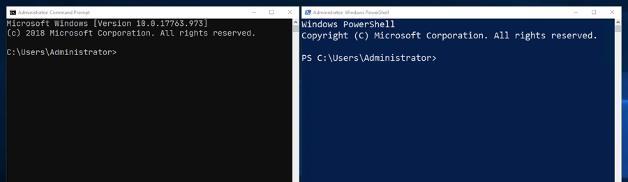
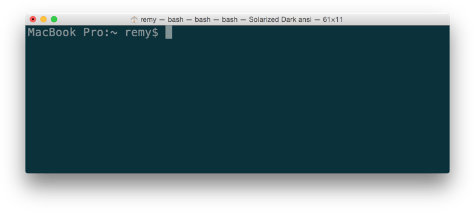
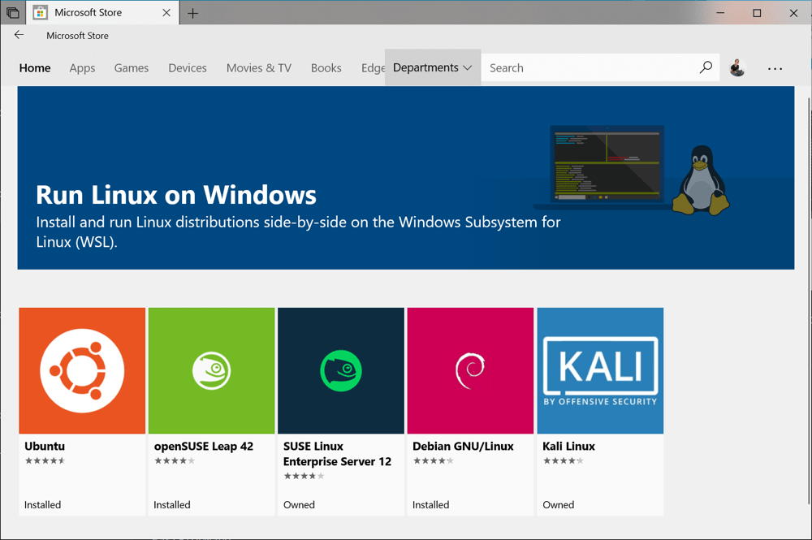
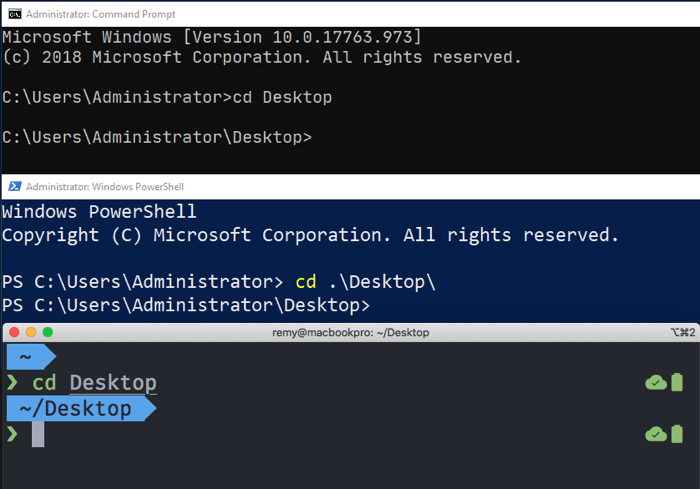
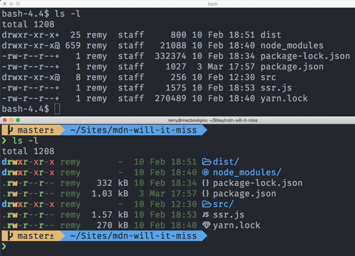
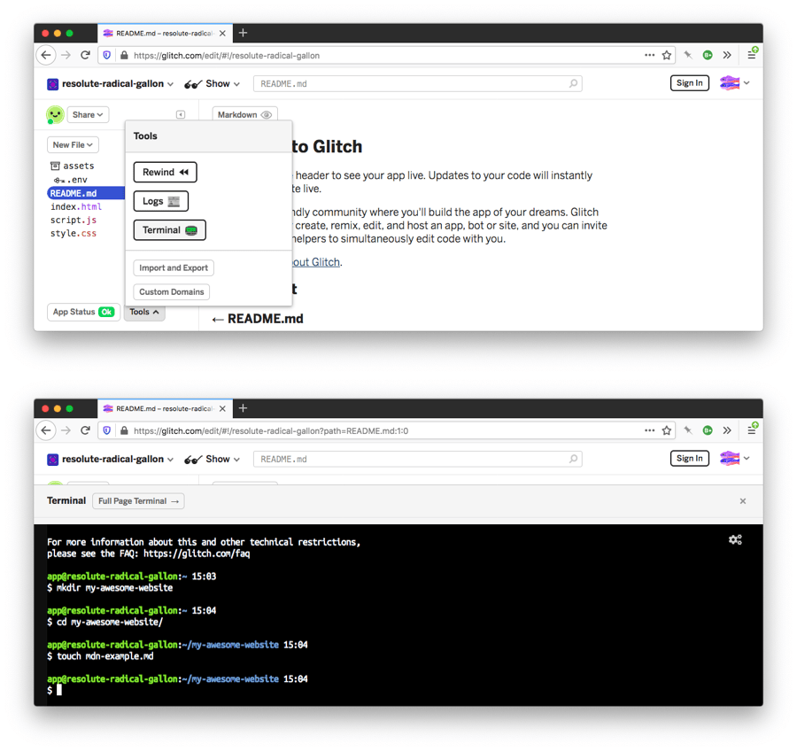
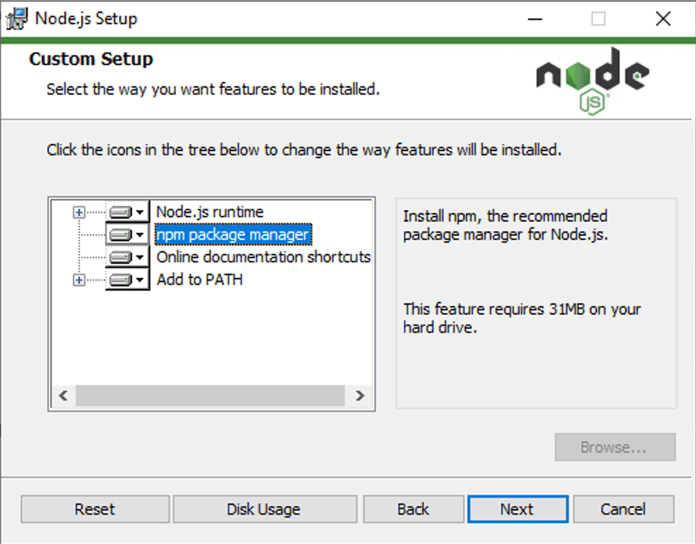

{{LearnSidebar}}{{PreviousMenuNext("Learn/Tools_and_testing/Understanding_client-side_tools/Overview","Learn/Tools_and_testing/Understanding_client-side_tools/Package_management", "Learn/Tools_and_testing/Understanding_client-side_tools")}}

In your development process, you'll undoubtedly be required to run some commands in the terminal (or on the "command line" — these are effectively the same thing). This article provides an introduction to the terminal, the essential commands you'll need to enter into it, how to chain commands together, and how to add your own command line interface (CLI) tools.

<table>
  <tbody>
    <tr>
      <th scope="row">Prerequisites:</th>
      <td>
        Familiarity with the core <a href="/en-US/docs/Learn/HTML">HTML</a>,
        <a href="/en-US/docs/Learn/CSS">CSS</a>, and <a href="/en-US/docs/Learn/JavaScript">JavaScript</a> languages.
      </td>
    </tr>
    <tr>
      <th scope="row">Objective:</th>
      <td>
        To understand what the terminal/command line is, what basic commands you should learn, and how to install new command line tools.
      </td>
    </tr>
  </tbody>
</table>

## Welcome to the terminal

The terminal is a text interface for executing text-based programs. If you're running any tooling for web development there's a near-guaranteed chance that you'll have to pop open the command line and run some commands to use your chosen tools (you'll often see such tools referred to as **CLI tools** — command line interface tools).

A large number of tools can be used by typing commands into the command line; many come pre-installed on your system, and a huge number of others are installable from package registries.
Package registries are like app stores, but (mostly) for command line based tools and software.
We'll see how to install some tools later on in this chapter, and we'll learn more about package registries in the next chapter.

One of the biggest criticisms of the command line is that it lacks hugely in user experience.
Viewing the command line for the first time can be a daunting experience: a blank screen and a blinking cursor, with very little obvious help available on what to do.

On the surface, they're far from welcoming but there's a lot you can do with them, and we promise that, with a bit of guidance and practice, using them will get easier!
This is why we are providing this chapter — to help you get started in this seemingly unfriendly environment.

### Where did the terminal come from?

The terminal originates from around the 1950s-60s and its original form really doesn't resemble what we use today (for that we should be thankful). You can read a bit of the history on Wikipedia's entry for [Computer Terminal](https://en.wikipedia.org/wiki/Computer_terminal).

Since then, the terminal has remained a constant feature of all operating systems — from desktop machines to servers tucked away in the cloud, to microcomputers like the Raspberry PI Zero, and even to mobile phones. It provides direct access to the computer's underlying file system and low-level features, and is therefore incredibly useful for performing complex tasks rapidly, if you know what you are doing.

It is also useful for automation — for example, to write a command to update the titles of hundreds of files instantly, say from "ch01-xxxx.png" to "ch02-xxxx.png". If you updated the file names using your finder or explorer GUI app, it would take you a long time.

Anyway, the terminal is not going away anytime soon.

### What does the terminal look like?

Below you can see some of the different flavors of programs that are available that can get you to a terminal.

The next images show the command prompts available in Windows — there's a good range of options from the "cmd" program to "powershell" — which can be run from the start menu by typing the program name.



And below, you can see the macOS terminal application.



### How do you access the terminal?

Many developers today are using Unix-based tools (e.g. the terminal, and the tools you can access through it). Many tutorials and tools that exist on the web today support (and sadly assume) Unix-based systems, but not to worry — they are available on most systems. In this section, we'll look at how to get access to the terminal on your chosen system.

#### Linux/Unix

As hinted at above, Linux/Unix systems have a terminal available by default, listed among your Applications.

#### macOS

macOS has a system called Darwin that sits underneath the graphical user interface. Darwin is a Unix-like system, which provides the terminal, and access to the low-level tools. macOS Darwin mostly has parity with Unix, certainly good enough to not cause us any worries as we work through this article.

The terminal is available on macOS at Applications/Utilities/Terminal.

#### Windows

As with some other programming tools, using the terminal (or command line) on Windows has traditionally not been as simple or easy as on other operating systems. But things are getting better.

Windows has traditionally had its own terminal-like program called cmd ("the command prompt") for a long time, but this definitely doesn't have parity with Unix commands, and is equivalent to the old-style Windows DOS prompt.

Better programs exist for providing a terminal experience on Windows, such as Powershell ([see here to find installers](https://github.com/PowerShell/PowerShell)), and Gitbash (which comes as part of the [git for Windows](https://gitforwindows.org/) toolset).

However, the best option for Windows in the modern day is the Windows Subsystem for Linux (WSL) — a compatibility layer for running Linux operating systems directly from inside Windows 10, allowing you to run a "true terminal" directly on Windows, without needing a virtual machine.

This can be installed directly from the Windows store for free. You can find all the documentation you need in the [Windows Subsystem for Linux Documentation](https://docs.microsoft.com/windows/wsl/).



In terms of what option to choose on Windows, we'd strongly recommend trying to install the WSL. You could stick with the default command prompt (`cmd`), and many tools will work OK, but you'll find everything easier if you have better parity with Unix tools.

#### Side note: what's the difference between a command line and a terminal?

Generally, you'll find these two terms used interchangeably. Technically, a terminal is a software that starts and connects to a shell. A shell is your session and session environment (where things like the prompt and shortcuts might be customized). The command line is the literal line where you enter commands and the cursor blinks.

### Do you have to use the terminal?

Although there's a great wealth of tools available from the command line, if you're using tools like [Visual Studio Code](https://code.visualstudio.com/) there's also a mass of extensions that can be used as a proxy to use terminal commands without needing to use the terminal directly. However, you won't find a code editor extension for everything you want to do — you'll have to get some experience with the terminal eventually.

## Basic built-in terminal commands

Enough talk — let's start looking at some terminal commands! Out of the box, here are just a few of the things the command line can do, along with the names of relevant tools in each case:

- Navigate your computer's file system along with base-level tasks such as create, copy, rename, and delete:

  - Move around your directory structure: `cd`
  - Create directories: `mkdir`
  - Create files (and modify their metadata): `touch`
  - Copy files or directories: `cp`
  - Move files or directories: `mv`
  - Delete files or directories: `rm`

- Download files found at specific URLs: `curl`
- Search for fragments of text inside larger bodies of text: `grep`
- View a file's contents page by page: `less`, `cat`
- Manipulate and transform streams of text (for example changing all the instances of `<div>`s in an HTML file to `<article>`): `awk`, `tr`, `sed`

> **Note:** There are a number of good tutorials on the web that go much deeper into the command line on the web — this is only a brief introduction!

Let's move forward and look at using a few of these tools on the command line. Before you go any further, open your terminal program!

### Navigation on the command line

When you visit the command line you will inevitably need to navigate to a particular directory to "do something". All the operating systems (assuming a default setup) will launch their terminal program in your "home" directory, and from there you're likely to want to move to a different place.

The `cd` command lets you Change Directory. Technically, cd isn't a program but a built-in. This means your operating system provides it out of the box, and also that you can't accidentally delete it — thank goodness! You don't need to worry too much about whether a command is built-in or not, but bear in mind that built-ins appear on all unix-based systems.

To change the directory, you type `cd` into your terminal, followed by the directory you want to move to. Assuming the directory is inside your home directory, you can use `cd Desktop` (see the screenshots below).



Try typing this into your system's terminal:

```bash
cd Desktop
```

If you want to move back up to the previous directory, you can use two dots:

```bash
cd ..
```

> **Note:** A very useful terminal shortcut is using the <kbd>tab</kbd> key to autocomplete names that you know are present, rather than having to type out the whole thing. For example, after typing the above two commands, try typing `cd D` and pressing <kbd>tab</kbd> — it should autocomplete the directory name `Desktop` for you, provided it is present in the current directory. Bear this in mind as you move forward.

If the directory you want to go to is nested deep, you need to know the path to get to it. This usually becomes easier as you get more familiar with the structure of your file system, but if you are not sure of the path you can usually figure it out with a combination of the `ls` command (see below), and by clicking around in your Explorer/Finder window to see where a directory is, relative to where you currently are.

For example, if you wanted to go to a directory called `src`, located inside a directory called `project`, located on the `Desktop`, you could type these three commands to get there from your home folder:

```bash
cd Desktop
cd project
cd src
```

But this a waste of time — instead, you can type one command, with the different items in the path separated by forward slashes, just like you do when specifying paths to images or other assets in CSS, HTML, or JavaScript code:

```bash
cd Desktop/project/src
```

Note that including a leading slash on your path makes the path absolute, for example `/Users/your-user-name/Desktop`. Omitting the leading slash as we've done above makes the path relative to your present working directory. This is exactly the same as you would see with URLs in your web browser. A leading slash means "at the root of the website", whereas omitting the slash means "the URL is relative to my current page".

> **Note:** On windows, you use backslashes instead of forward slashes, e.g. `cd Desktop\project\src` — this may seem really odd, but if you are interested in why, [watch this YouTube clip](https://www.youtube.com/watch?v=5T3IJfBfBmI) featuring an explanation by one of Microsoft's Principal engineers.

### Listing directory contents

Another built-in Unix command is `ls` (short for list), which lists the contents of the directory you're currently in. Note that this won't work if you're using the default Windows command prompt (`cmd`) — the equivalent there is `dir`.

Try running this now in your terminal:

```bash
ls
```

This gives you a list of the files and directories in your present working directory, but the information is really basic — you only get the name of each item present, not whether it is a file or a directory, or anything else. Fortunately, a small change to the command usage can give you a lot more information.

### Introducing command options

Most terminal commands have options — these are modifiers that you add onto the end of a command, which make it behave in a slightly different way. These usually consist of a space after the command name, followed by a dash, followed by one or more letters.

For example, give this a go and see what you get:

```bash
ls -l
```

In the case of `ls`, the `-l` (_dash ell_) option gives you a listing with one file or directory on each line, and a lot more information shown. Directories can be identified by looking for a letter "d" on the very left-hand side of the lines. Those are the ones we can `cd` into.

Below is a screenshot with a "vanilla" macOS terminal at the top, and a customized terminal with some extra icons and colors to keep it looking lively — both showing the results of running `ls -l`:



> **Note:** To find out exactly what options each command has available, you can look at its [man page](https://en.wikipedia.org/wiki/Man_page). This is done by typing the `man` command, followed by the name of the command you want to look up, for example `man ls`. This will open up the man page in the terminal's default text file viewer (for example, [`less`](<https://en.wikipedia.org/wiki/Less_(Unix)>) in my terminal), and you should then be able to scroll through the page using the arrow keys, or some similar mechanism. The man page lists all the options in great detail, which may be a bit intimidating to begin with, but at least you know it's there if you need it. Once you are finished looking through the man page, you need to quit out of it using your text viewer's quit command ("q" in `less`; you may have to search on the web to find it if it isn't obvious).

> **Note:** To run a command with multiple options at the same time, you can usually put them all in a single string after the dash character, for example `ls -lah`, or `ls -ltrh`. Try looking at the `ls` man page to work out what these extra options do!

Now that we've discussed two fundamental commands, have a little poke around your directory and see if you can navigate from one place to the next.

### Creating, copying, moving, removing

There are a number of other basic utility commands that you'll probably end up using quite a lot as you work with the terminal. They are pretty simple, so we won't explain them all in quite as much detail as the previous couple.

Have a play with them in a test directory you've created somewhere so that you don't accidentally delete anything important, using the example commands below for guidance:

- `mkdir` — this creates a new directory inside the current directory you are in, with the name you provide after the command name. For example, `mkdir my-awesome-website` will make a new directory called `my-awesome-website`.
- `rmdir` — removes the named directory, but only if it's empty. For example, `rmdir my-awesome-website` will remove the directory we created above. If you want to remove a directory that is not empty (and also remove everything it contains), then you can use the `-r` option (recursive), but this is dangerous. Make sure there is nothing you might need inside the directory later on, as it will be gone forever.
- `touch` — creates a new empty file, inside the current directory. For example, `touch mdn-example.md` creates a new empty file called `mdn-example.md`.
- `mv` — moves a file from the first specified file location to the second specified file location, for example `mv mdn-example.md mdn-example.txt` (the locations are written as file paths). This command moves a file called `mdn-example.md` in the current directory to a file called `mdn-example.txt` in the current directory. Technically the file is being moved, but from a practical perspective, this command is actually renaming the file.
- `cp` — similar in usage to `mv`, `cp` creates a copy of the file in the first location specified, in the second location specified. For example, `cp mdn-example.txt mdn-example.txt.bak` creates a copy of `mdn-example.txt` called `mdn-example.txt.bak` (you can of course call it something else if you wish).
- `rm` — removes the specified file. For example, `rm mdn-example.txt` deletes a single file called `mdn-example.txt`. Note that this delete is permanent and can't be undone via the recycle bin that you might have on your desktop user interface.

> **Note:** Many terminal commands allow you to use asterisks as "wild card" characters, meaning "any sequence of characters". This allows you to run an operation against a potentially large number of files at once, all of which match the specified pattern. As an example, `rm mdn-*` would delete all files beginning with `mdn-`. `rm mdn-*.bak` would delete all files that start with `mdn-` and end with `.bak`.

## Terminal — considered harmful?

We've alluded to this before, but to be clear — you need to be careful with the terminal. Simple commands do not carry too much danger, but as you start putting together more complex commands, you need to think carefully about what the command will do, and try testing them out first before you finally run them in the intended directory.

Let's say you had 1000 text files in a directory, and you wanted to go through them all and only delete the ones that have a certain substring inside the filename. If you are not careful, then you might end up deleting something important, losing you a load of your work in the process.
One good habit to get into is to write your terminal command out inside a text editor, figure out how you think it should look, and then make a backup copy of your directory and try running the command on that first, to test it.

Another good tip — if you're not comfortable trying terminal commands out on your own machine, a nice safe place to try them is over at [Glitch.com](https://glitch.com/). Along with being a great place to try out web development code, the projects also give you access to a terminal, so you can run all these commands directly in that terminal, safe in the knowledge that you won't break your own machine.



A great resource for getting a quick overview of specific terminal commands is [tldr.sh](https://tldr.sh/). This is a community-driven documentation service, similar to MDN, but specific to terminal commands.

In the next section let's step it up a notch (or several notches in fact) and see how we can connect tools together on the command line to really see how the terminal can be advantageous over the regular desktop user interface.

## Connecting commands together with pipes

The terminal really comes into its own when you start to chain commands together using the `|` (pipe) symbol. Let's look at a very quick example of what this means.

We've already looked at `ls`, which outputs the contents of the current directory:

```bash
ls
```

But what if we wanted to quickly count the number of files and directories inside the current directory? `ls` can't do that on its own.

There is another Unix tool available called `wc`. This counts the number of words, lines, characters, or bytes of whatever is inputted into it. This can be a text file — the below example outputs the number of lines in `myfile.txt`:

```bash
wc -l myfile.txt
```

But it can also count the number of lines of whatever output is **piped** into it. For example, the below command counts the number of lines outputted by the `ls` command (what it would normally print to the terminal if run on its own) and outputs that count to the terminal instead:

```bash
ls | wc -l
```

Since `ls` prints each file or directory on its own line, that effectively gives us a directory and file count.

So what is going on here? A general philosophy of (unix) command line tools is that they print text to the terminal (also referred to "printing to standard output" or `STDOUT`). A good deal of commands can also read content from streamed input (known as "standard input" or `STDIN`).

The pipe operator can _connect_ these inputs and outputs together, allowing us to build up increasingly more complex operations to suit our needs — the output from one command can become the input to the next command. In this case, `ls` would normally print its output to `STDOUT`, but instead `ls`'s output is being piped into `wc`, which takes that output as an input, counting the number of lines it contains, and prints that count to `STDOUT` instead.

## A slightly more complex example

Let's go through something a bit more complicated.

We will first try to fetch the contents of MDN's "fetch" page using the `curl` command (which can be used to request content from URLs), from `https://developer.mozilla.org/en-US/docs/Web/API/WindowOrWorkerGlobalScope/fetch`.
Try it now:

```bash
curl https://developer.mozilla.org/en-US/docs/Web/API/WindowOrWorkerGlobalScope/fetch
```

You won't get an output because the page has been redirected (to [/Web/API/fetch](/en-US/docs/Web/API/fetch)).
We need to explicitly tell `curl` to follow redirects using the `-L` flag.

Let's also look at the headers that `developer.mozilla.org` returns using `curl`'s `-I` flag, and print all the location redirects it sends to the terminal, by piping the output of `curl` into `grep` (we will ask `grep` to return all the lines that contain the word "location").

Try running the following (you'll see that there is just one redirect before we reach the final page):

```bash
curl https://developer.mozilla.org/en-US/docs/Web/API/WindowOrWorkerGlobalScope/fetch -L -I | grep location
```

Your output should look something like this (`curl` will first output some download counters and suchlike):

```bash
location: /en-US/docs/Web/API/fetch
```

Although contrived, we could take this result a little further and transform the `location:` line contents, adding the base origin to the start of each one so that we get complete URLs printed out.
For that, we'll add `awk` to the mix (which is a programming language akin to JavaScript or Ruby or Python, just a lot older!).

Try running this:

```bash
curl https://developer.mozilla.org/en-US/docs/Web/API/WindowOrWorkerGlobalScope/fetch -L -I | grep location | awk '{ print "https://developer.mozilla.org" $2 }'
```

Your final output should look something like this:

```bash
https://developer.mozilla.org/en-US/docs/Web/API/fetch
```

By combining these commands we've customized the output to show the full URLs that the Mozilla server is redirecting through when we request the `/docs/Web/API/WindowOrWorkerGlobalScope/fetch` URL.
Getting to know your system will prove useful in years to come — learn how these single serving tools work and how they can become part of your toolkit to solve niche problems.

## Adding powerups

Now we've had a look at some of the built-in commands your system comes equipped with, let's look at how we can install a third-party CLI tool and make use of it.

The vast ecosystem of installable tools for front-end web development currently exists mostly inside [npm](https://www.npmjs.com), a privately owned, package hosting service that works closely together with Node.js.
This is slowly expanding — you can expect to see more package providers as time goes on.

[Installing Node.js](https://nodejs.org/en/) also installs the npm command line tool (and a supplementary npm-centric tool called npx), which offers a gateway to installing additional command line tools. Node.js and npm work the same across all systems: macOS, Windows, and Linux.

Install npm on your system now, by going to the URL above and downloading and running a Node.js installer appropriate to your operating system. If prompted, make sure to include npm as part of the installation.



Although we'll look at a number of different tools in the next article onwards, we'll cut our teeth on [Prettier](https://prettier.io/).
Prettier is an opinionated code formatter that only has a "few options".
Fewer options tends to mean simpler.
Given how tooling can sometimes get out of hand in terms of complexity, "few options" can be very appealing.

### Where to install our CLI tools?

Before we dive into installing Prettier, there's a question to answer — "where should we install it?"

With `npm` we have the choice of installing tools globally — so we can access them anywhere — or locally to the current project directory.

There are pros and cons each way — and the following lists of pros and cons for installing globally are far from exhaustive.

**Pros of installing globally:**

- Accessible anywhere in your terminal
- Only install once
- Uses less disk space
- Always the same version
- Feels like any other unix command

**Cons of installing globally:**

- May not be compatible with your project's codebase
- Other developers in your team won't have access to these tools, for example if you are sharing the codebase over a tool like git.
- Related to the previous point, it makes project code harder to replicate (if you install your tools locally, they can be set up as dependencies and installed with <code>npm install</code>).

Although the _cons_ list is shorter, the negative impact of global installing is potentially much larger than the benefits.
Here we'll install locally, but feel free to install globally once you understand the relative risks.

### Installing Prettier

Prettier is an opinionated code formatting tool for front-end developers, focusing on JavaScript-based languages and adding support for HTML, CSS, SCSS, JSON, and more.

Prettier can:

- Save the cognitive overhead of getting the style consistent manually across all your code files; Prettier can do this for you automatically.
- Help newcomers to web development format their code in best-practice fashion.
- Be installed on any operating system and even as a direct part of project tooling, ensuring that colleagues and friends who work on your code use the code style you're using.
- Be configured to run upon save, as you type, or even before publishing your code (with additional tooling that we'll see later on in the module).

For this article, we will install Prettier locally, as suggested in the [Prettier installation guide](https://prettier.io/docs/en/install.html)

Once you've installed node, open up the terminal and run the following command to install Prettier:

```bash
npm install prettier
```

You can now run the file locally using the [npx](https://nodejs.dev/learn/the-npx-nodejs-package-runner/) tool.
Running the command without any arguments, as with many other commands, will offer up usage and help information.
Try this now:

```bash
npx prettier
```

Your output should look something like this:

```bash
Usage: prettier [options] [file/glob ...]

By default, output is written to stdout.
Stdin is read if it is piped to Prettier and no files are given.

…
```

It's always worth at the very least skimming over the usage information, even if it is long.
It'll help you to understand better how the tool is intended to be used.

> **Note:** If you have not first installed Prettier locally, then running `npx prettier` will download and run the latest version of Prettier all in one go _just for that command_.
> While that might sound great, new versions of Prettier may slightly modify the output.
> You want to install it locally so that you are fixing the version of Prettier that you are using for formatting until you are ready to change it.

### Playing with Prettier

Let's have a quick play with Prettier, so you can see how it works.

First of all, create a new directory somewhere on your file system that is easy to find. Maybe a directory called `prettier-test` on your `Desktop`.

Now save the following code in a new file called `index.js`, inside your test directory:

```js-nolint
const myObj = {
a:1,b:{c:2}}
function printMe(obj){console.log(obj.b.c)}
printMe(myObj)
```

We can run Prettier against a codebase to just check if our code wants adjusting. `cd` into your directory, and try running this command:

```bash
npx prettier --check index.js
```

You should get an output along the lines of:

```bash
Checking formatting...
index.js
Code style issues found in the above file(s). Forgot to run Prettier?
```

So, there's some code styles that can be fixed. No problem. Adding the `--write` option to the `prettier` command will fix those up, leaving us to focus on actually writing useful code.

Now try running this version of the command:

```bash
npx prettier --write index.js
```

You'll get an output like this

```bash
Checking formatting...
index.js
Code style issues fixed in the above file(s).
```

But more importantly, if you look back at your JavaScript file you'll find it has been reformatted to something like this:

```js
const myObj = {
  a: 1,
  b: { c: 2 },
};
function printMe(obj) {
  console.log(obj.b.c);
}
printMe(myObj);
```

Depending on your workflow (or the workflow that you pick) you can make this an automated part of your process. Automation is really where tools excel; our personal preference is the kind of automation that "just happens" without having to configure anything.

With Prettier there's a number of ways automation can be achieved and though they're beyond the scope of this article, there's some excellent resources online to help (some of which have been linked to). You can invoke Prettier:

- Before you commit your code into a git repository using [Husky](https://github.com/typicode/husky).
- Whenever you hit "save" in your code editor, be it [VS Code](https://marketplace.visualstudio.com/items?itemName=esbenp.prettier-vscode), or [Sublime Text](https://packagecontrol.io/packages/JsPrettier).
- As part of continuous integration checks using tools like [GitHub Actions](https://github.com/features/actions).

Our personal preference is the second one — while using say VS Code, Prettier kicks in and cleans up any formatting it needs to do every time we hit save. You can find a lot more information about using Prettier in different ways in the [Prettier docs](https://prettier.io/docs/en/).

## Other tools to play with

If you want to play with a few more tools, here's a brief list that are fun to try out:

- [`bat`](https://github.com/sharkdp/bat) — A "nicer" `cat` (`cat` is used to print the contents of files).
- [`prettyping`](https://denilson.sa.nom.br/prettyping/) — `ping` on the command line, but visualized (`ping` is a useful tool to check if a server is responding).
- [`htop`](https://htop.dev/) — A process viewer, useful for when something is making your CPU fan behave like a jet engine and you want to identify the offending program.
- [`tldr`](https://tldr.sh/#installation) — mentioned earlier in this chapter, but available as a command line tool.

Note that some of the above suggestions may need installing using npm, like we did with Prettier.

## Summary

That brings us to the end of our brief tour of the terminal/command line. Next up we'll be looking in more detail at package managers, and what we can do with them.

{{PreviousMenuNext("Learn/Tools_and_testing/Understanding_client-side_tools/Overview","Learn/Tools_and_testing/Understanding_client-side_tools/Package_management", "Learn/Tools_and_testing/Understanding_client-side_tools")}}
