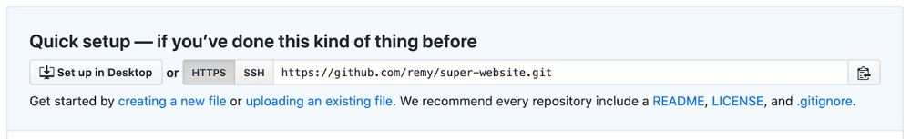
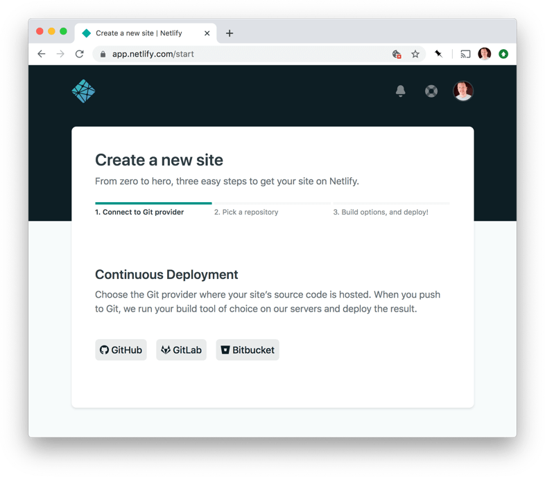
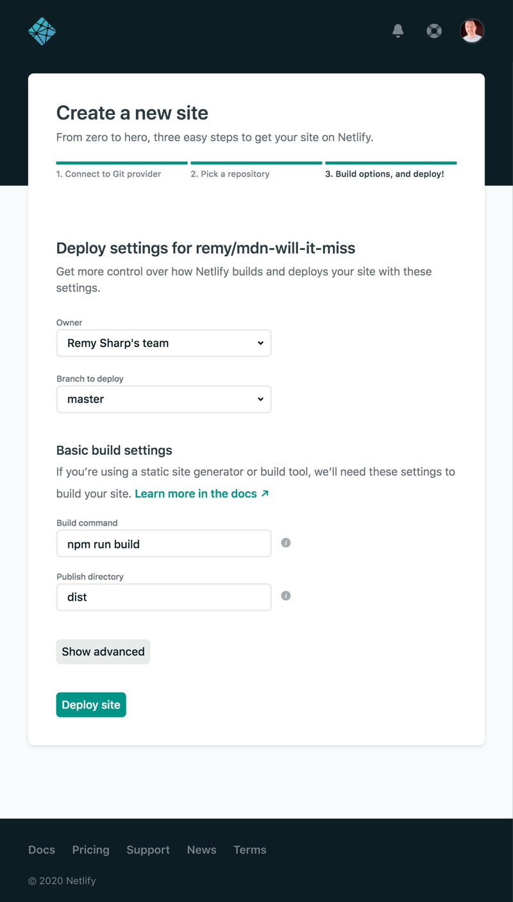

{{LearnSidebar}}{{PreviousMenu("Learn/Tools_and_testing/Understanding_client-side_tools/Introducing_complete_toolchain", "Learn/Tools_and_testing/Understanding_client-side_tools")}}

In the final article in our series, we take the example toolchain we built up in the previous article and add to it so that we can deploy our sample app. We push the code to GitHub, deploy it using Netlify, and even show you how to add a simple test into the process.

<table>
  <tbody>
    <tr>
      <th scope="row">Prerequisites:</th>
      <td>
        Familiarity with the core <a href="/en-US/docs/Learn/HTML">HTML</a>,
        <a href="/en-US/docs/Learn/CSS">CSS</a>, and
        <a href="/en-US/docs/Learn/JavaScript">JavaScript</a> languages.
      </td>
    </tr>
    <tr>
      <th scope="row">Objective:</th>
      <td>
        To finish working through our complete toolchain case study, focusing on
        deploying the app.
      </td>
    </tr>
  </tbody>
</table>

## Post development

There's potentially a large range of problems to be solved in this section of the project's lifecycle. As such, it's important to create a toolchain that handles these problems in a way that requires as little manual intervention as possible.

Here's just a few things to consider for this particular project:

- Generating a production build: Ensuring files are minimized, chunked, have tree-shaking applied, and that versions are "cache busted".
- Running tests: These can range from "is this code formatted properly?" to "does this thing do what I expect?", and ensuring failing tests prevent deployment.
- Actually deploying the updated code to a live URL: Or potentially a staging URL so it can be reviewed first.

> **Note:** Cache busting is a new term that we haven't met before in the module. This is the strategy of breaking a browser's own caching mechanism, which forces the browser to download a new copy of your code. Parcel (and indeed many other tools) will generate filenames that are unique to each new build. This unique filename "busts" your browser's cache, thereby making sure the browser downloads the fresh code each time an update is made to the deployed code.

The above tasks also break down into further tasks; note that most web development teams will have their own terms and processes for at least some part of the post-development phase.

For this project, we're going to use [Netlify](https://www.netlify.com/)'s wonderful static hosting offering to host our project. Netlify gives us hosting or more specifically, a URL to view your project online and to share it with your friends, family, and colleagues.

Deploying to hosting tends to be at the tail-end of the project life cycle, but with services such as Netlify bringing down the cost of deployments (both in financial terms and also the time required to actually deploy) it's possible to deploy during development to either share work in progress or to have a pre-release for some other purpose.

Netlify, amongst other things, also allows you to run pre-deployment tasks, which in our case means that all the production code build processes can be performed inside of Netlify and if the build is successful, the website changes will be deployed.

Although Netlify offers a [drag and drop deployment service](https://app.netlify.com/drop), we are intending to trigger a new deployment to Netlify each time we push to a GitHub repo.

It's exactly these kinds of connected services that we would encourage you to look for when deciding on your own build toolchain. We can commit our code and push to GitHub and the updated code will automatically trigger the entire build routine. If all is well, we get a live change deployed automatically. The _only_ action we need to perform is that initial "push".

However, we do have to set these steps up, and we'll look at that now.

## The build process

Again, because we're using Parcel for development, the build option is extremely simple to add. Instead of running the server with `npx parcel src/index.html`, we can run it with `npx parcel build src/index.html` and Parcel will build everything ready for production instead of just running it for development and testing purposes. This includes doing minification and tree-shaking of code, and cache-busting on filenames.

The newly-created production code is placed in a new directory called `dist`, which contains _all_ the files required to run the website, ready for you to upload to a server.

However, doing this step manually isn't our final aim — what we want is for the build to happen automatically and the result of the `dist` directory to be deployed live on our website.

This is where our code, GitHub, and Netlify need to be set up to talk to one another, so that each time we update our GitHub code repository, Netlify will automatically pick up the changes, run the build tasks, and finally release a new update.

We're going to add the build command to our `package.json` file as an npm script, so that the command `npm run build` will trigger the build process. This step isn't necessary, but it is a good best practice to get into the habit of setting up — across all our projects, we can then rely on `npm run build` to always do the complete build step, without needing to remember the specific build command arguments for each project.

1. Open the `package.json` file in your project's root directory, and find the `scripts` property.
2. We'll add a `build` command that we can run to build our code. Add the following line to your project now:

   ```json
   "scripts": {
     // …
     "build": "parcel build src/index.html"
   }
   ```

   > **Note:** If the `scripts` property already has a command inside it, put a comma at the end of it. Keep the JSON valid.

3. You should now be able to run the following command in the root of your project directory to run the production build step (first quit the running process with <kbd>Ctrl</kbd> + <kbd>C</kbd> if you need to):

   ```bash
   npm run build
   ```

   This should give you an output like the following, showing you the production files that were created, how big they are, and how long they took to build:

   ```bash
   dist/src.99d8a31a.js.map       446.15 KB     63ms
   dist/src.99d8a31a.js           172.51 KB    5.55s
   dist/stars.7f1dd035.svg          6.31 KB    145ms
   dist/asteroid2.3ead4904.svg      3.51 KB    155ms
   dist/asteroid1.698d75e9.svg       2.9 KB    153ms
   dist/src.84f2edd1.css.map        2.57 KB      3ms
   dist/src.84f2edd1.css            1.25 KB    1.53s
   dist/bg.084d3fd3.svg               795 B    147ms
   dist/index.html                    354 B    944ms
   ```

   Try it now!

For you to create your own instance of this project you will need to host this project's code in your own git repository. Our next step is to push the project to GitHub.

## Committing changes to GitHub

This section will get you over the line to storing your code in a git repository, but it is a far cry from a git tutorial. There are many great tutorials and books available, and our [Git and GitHub](/en-US/docs/Learn/Tools_and_testing/GitHub) page is a good place to start.

We initialized our working directory as a git working directory earlier on. A quick way to verify this is to run the following command:

```bash
git status
```

You should get a status report of what files are being tracked, what files are staged, and so on — all terms that are part of the git grammar. If you get the error `fatal: not a git repository` returned, then the working directory is not a git working directory and you'll need to initialise git using `git init`.

Now we have three tasks ahead of us:

- Add any changes we've made to the stage (a special name for the place that git will commit files from).
- Commit the changes to the repository.
- Push the changes to GitHub.

1. To add changes, run the following command:

   ```bash
   git add .
   ```

   Note the period at the end, it means "everything in this directory". The `git add .` command is a bit of a sledgehammer approach — it will add all local changes you've worked on in one go. If you want finer control over what you add, then use `git add -p` for an interactive process, or add individual files using `git add path/to/file`.

2. Now all the code is staged, we can commit; run the following command:

   ```bash
   git commit -m 'committing initial code'
   ```

   > **Note:** Although you're free to write whatever you wish in the commit message, there's some useful tips around the web on good commit messages. Keep them short, concise, and descriptive, so they clearly describe what the change does.

3. Finally, the code needs to be pushed to your GitHub-hosted repository. Let's do that now.

   Over at GitHub, visit <https://github.com/new> and create your own repository to host this code.

4. Give your repository a short, memorable name, without spaces in it (use hyphens to separate words), and a description, then click _Create repository_ at the bottom of the page.

   You should now have a "remote" URL that points to your new GitHub repo.

   

5. This remote location needs to be added to our local git repository before we can push it up there, otherwise it won't be able to find it. You'll need to run a command with the following structure (use the provided HTTPS option for now — especially if you are new to GitHub — not the SSH option):

   ```bash
   git remote add github https://github.com/yourname/repo-name.git
   ```

   So if your remote URL was `https://github.com/remy/super-website.git`, as in the screenshot above, your command would be

   ```bash
   git remote add github https://github.com/remy/super-website.git
   ```

   Change the URL to your own repository, and run it now.

6. Now we're ready to push our code to GitHub; run the following command now:

   ```bash
   git push github main
   ```

   At this point, you'll be prompted to enter a username and password before Git will allow the push to be sent. This is because we used the HTTPS option rather than the SSH option, as seen in the screenshot earlier. For this, you need your GitHub username and then — if you do not have two-factor authentication (2FA) turned on — your GitHub password. We would always encourage you to use 2FA if possible, but bear in mind that if you do, you'll also need to use a "personal access token". GitHub help pages has an [excellent and simple walkthrough covering how to get one](https://docs.github.com/en/authentication/keeping-your-account-and-data-secure/creating-a-personal-access-token).

> **Note:** If you are interested in using the SSH option, thereby avoiding the need to enter your username and password every time you push to GitHub, [this tutorial walks you through how](https://docs.github.com/en/authentication/connecting-to-github-with-ssh).

This final command instructs git to push the code (aka publish) to the "remote" location that we called `github` (that's the repository hosted on github.com — we could have called it anything we like) using the branch `main`. We've not encountered branches at all, but the "main" branch is the default place for our work and it's what git starts on. It's also the default branch that Netlify will look for, which is convenient.

> **Note:** Until October 2020 the default branch on GitHub was `master`, which for various social reasons was switched to `main`. You should be aware that this older default branch may appear in various projects you encounter, but we'd suggest using `main` for your own projects.

So with our project committed in git and pushed to our GitHub repository, the next step in the toolchain is to connect GitHub to Netlify so our project can be deployed live on the web!

## Using Netlify for deployment

Deploying from GitHub to Netlify is surprisingly simple once you know the steps, particularly with "static websites" such as this project.

> **Note:** There are also a lot of [guides and tutorials on Netlify](https://www.netlify.com/blog/tags/tutorial/) to help you improve your development workflow.

Let's get this done:

1. Go to <https://app.netlify.com/start>.
2. Press the GitHub button underneath the _Continuous Deployment_ heading. "Continuous Deployment" means that whenever the code repository changes, Netlify will (try) to deploy the code, thus it being "continuous".

   

3. Depending on whether you authorized Netlify before, you might need to authorize Netlify with GitHub, and choose what account you want to authorize it for (if you have multiple GitHub accounts or orgs). Choose the one you pushed your project to.
4. Netlify will prompt you with a list of the GitHub repositories it can find. Select your project repository and proceed to the next step.
5. Since we've connected Netlify to our GitHub account and given it access to deploy the project repository, Netlify will ask _how_ to prepare the project for deployment and _what_ to deploy.

   You should enter the command `npm run build` for the _Build command_, and specify the `dist` directory for the _Publish directory_ — this contains the code that we want to make public.

6. To finish up, click _Deploy site_.

   

7. After a short wait for the deployment to occur, you should get a URL that you can go to, to see your published site — try it out!
8. And even better, whenever we make a change and _push_ the change to our remote git repository (on GitHub), this will trigger a notification to Netlify which will then run our specified build task and then deploy the resulting `dist` directory to our published site.

   Try it now — make a small change to your app, and then push it to GitHub using these commands:

   ```bash
   git add .
   git commit -m 'simple netlify test'
   git push github main
   ```

   You should see your published site update with the change — this might take a few minutes to publish, so have a little patience.

That's it for Netlify. We can optionally change the name of the Netlify project or specify to use our own domain name, which Netlify offers some [excellent documentation](https://docs.netlify.com/) on.

Now for one final link in our toolchain: a test to ensure our code works.

## Testing

Testing itself is a vast subject, even within the realm of front-end development. I'll show you how to add an initial test to your project and how to use the test to prevent or to allow the project deployment to happen.

When approaching tests there are a good deal of ways to approach the problem:

- End-to-end testing, which involves your visitor clicking a thing and some other thing happening.
- Integration testing, which basically says "does one block of code still work when connected to another block?"
- Unit testing, where small and specific bits of functionality are tested to see if they do what they are supposed to do.
- [And many more types](https://en.wikipedia.org/wiki/Functional_testing). Also, see our [cross browser testing module](/en-US/docs/Learn/Tools_and_testing/Cross_browser_testing) for a bunch of useful testing information

Remember also that tests are not limited to JavaScript; tests can be run against the rendered DOM, user interactions, CSS, and even how a page looks.

However, for this project we're going to create a small test that will check the third-party NASA data feed and ensure it's in the correct format. If not, the test will fail and will prevent the project from going live. To do anything else would be beyond the scope of this module — testing is a huge subject that really requires its own separate module. We are hoping that this section will at least make you aware of the need for testing, and will plant the seed that inspires you to go and learn more.

Although the test for this project does not include a test framework, as with all things in the front-end development world, there are a slew of [framework options](https://www.npmjs.com/search?q=keywords%3Atesting).

The test itself isn't what is important. What is important is how the failure or success is handled. Some deployment platforms will include a specific method for testing as part of their pipeline. Products like GitHub, GitLab, etc., all support running tests against individual commits.

As this project is deploying to Netlify, and Netlify only asks about the build command, we will have to make the tests part of the build. If the test fails, the build fails, and Netlify won't deploy.

Let's get started.

1. Go to your `package.json` file and open it up.
2. Find your `scripts` member, and update it so that it contains the following test and build commands:

   ```json
   "scripts": {
     …
     "test": "node tests/*.js",
     "build": "npm run test && parcel build src/index.html"
   }
   ```

3. Now of course we need to add the test to our codebase; create a new directory in your root directory called tests:

   ```bash
   mkdir tests
   ```

4. Inside the new directory, create a test file:

   ```bash
   cd tests
   touch nasa-feed.test.js
   ```

5. Open this file, and add the contents of [nasa-feed.test.js](https://raw.githubusercontent.com/remy/mdn-will-it-miss/master/tests/nasa-feed.test.js) to it:
6. This test uses the axios package to fetch the data feed we want to test; to install this dependency, run the following command:

   ```bash
   npm install --save-dev axios
   ```

   We need to manually install axios because Parcel won't help us with this dependency. Our tests are outside of Parcel's view of our system — since Parcel never sees nor runs any of the test code, we're left to install the dependency ourselves.

7. Now to manually run the test, from the command line we can run:

   ```bash
   npm run test
   ```

   The result, if successful, is … nothing. This is considered a success. In general, we only want tests to be noisy if there's something wrong. The test also exited with a special signal that tells the command line that it was successful — an exit signal of 0. If there's a failure the test fails with an exit code of 1 — this is a system-level value that says "something failed".

   The `npm run test` command will use node to run all the files that are in the tests directory that end with `.js`.

   In our build script, `npm run test` is called, then you see the string `&&` — this means "if the thing on the left succeeded (exited with zero), then do this thing on the right". So this translates into: if the tests pass, then build the code.

8. You'll have to upload your new code to GitHub, using similar commands to what you used before:

   ```bash
   git add .
   git commit -m 'adding test'
   git push github main
   ```

   In some cases you might want to test the result of the built code (since this isn't quite the original code we wrote), so the test might need to be run after the build command. You'll need to consider all these individual aspects whilst you're working on your own projects.

Now, finally, a minute or so after pushing, Netlify will deploy the project update. But only if it passes the test that was introduced.

## Summary

That's it for our sample case study, and for the module! We hope you found it useful. While there is a long way to go before you can consider yourself a client-side tooling wizard, we are hoping that this module has given you that first important step towards understanding client-side tooling, and the confidence to learn more and try out new things.

Let's summarize all the parts of the toolchain:

- Code quality and maintenance are performed by ESLint and Prettier. These tools are added as `devDependencies` to the project via `npm install --dev eslint prettier eslint-plugin-react` (the ESLint plugin is needed because this particular project uses React).
- There are two configuration files that the code quality tools read: `.eslintrc` and `.prettierrc`.
- During development, we use Parcel to handle our dependencies. `parcel src/index.html` is running in the background to watch for changes and to automatically build our source.
- Deployment is handled by pushing our changes to GitHub (on the "main" branch), which triggers a build and deployment on Netlify to publish the project. For our instance this URL is [near-misses.netlify.com](https://near-misses.netlify.app/); you will have your own unique URL.
- We also have a simple test that blocks the building and deployment of the site if the NASA API feed isn't giving us the correct data format.

For those of you wanting a challenge, consider whether you can optimize some part of this toolchain. Some questions to ask yourself:

- Can [images be compressed](https://github.com/ralscha/parcel-plugin-compress) during the build step?
- Could React be swapped out for [something smaller](https://preactjs.com/)?
- Could you add more tests to prevent a bad build from deploying, such as [performance audits](https://web.dev/lighthouse-performance/)?
- Could you set up a notification to let you know when a new deploy succeeded or failed?

{{PreviousMenu("Learn/Tools_and_testing/Understanding_client-side_tools/Introducing_complete_toolchain", "Learn/Tools_and_testing/Understanding_client-side_tools")}}
