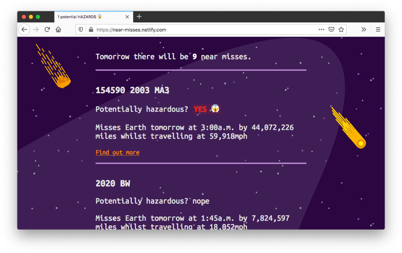
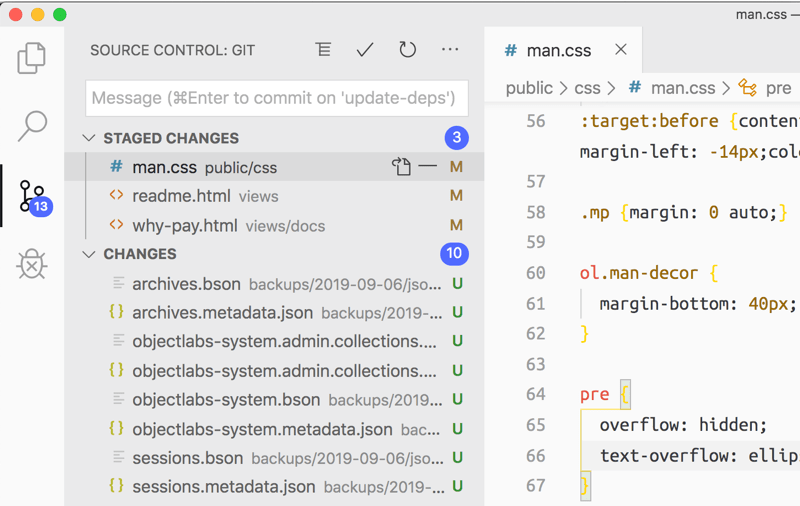
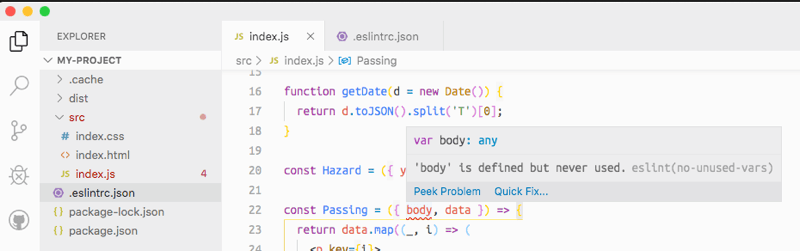
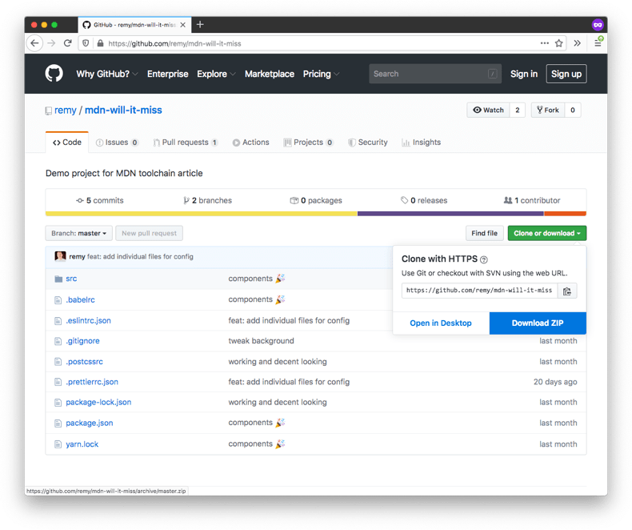

{{LearnSidebar}}{{PreviousMenuNext("Learn/Tools_and_testing/Understanding_client-side_tools/Package_management","Learn/Tools_and_testing/Understanding_client-side_tools/Deployment", "Learn/Tools_and_testing/Understanding_client-side_tools")}}

In the final couple of articles in the series, we will solidify your tooling knowledge by walking you through the process of building up a sample case study toolchain. We'll go all the way from setting up a sensible development environment and putting transformation tools in place to actually deploying your app on Netlify. In this article, we'll introduce the case study, set up our development environment, and set up our code transformation tools.

<table>
  <tbody>
    <tr>
      <th scope="row">Prerequisites:</th>
      <td>
        Familiarity with the core <a href="/en-US/docs/Learn/HTML">HTML</a>,
        <a href="/en-US/docs/Learn/CSS">CSS</a>, and
        <a href="/en-US/docs/Learn/JavaScript">JavaScript</a> languages.
      </td>
    </tr>
    <tr>
      <th scope="row">Objective:</th>
      <td>
        To solidify what we've learnt so far by working through a complete
        toolchain case study.
      </td>
    </tr>
  </tbody>
</table>

There really are unlimited combinations of tools and ways to use them, what you see in this article and the next is only _one_ way that the featured tools can be used for a project.

> **Note:** It's also worth repeating that not all of these tools need to be run on the command line. Many of today's code editors (such as VS Code) have integration support for a _lot_ of tools via plugins.

## Introducing our case study

The toolchain that we are creating in this article will be used to build and deploy a mini-site that lists data (taken from one of [NASA's open APIs](https://api.nasa.gov/)) concerning potentially hazardous space objects that threaten our existence on Earth! It looks like this:



You can see a live version of the site at [near-misses.netlify.com](https://near-misses.netlify.app/).

## Tools used in our toolchain

In this article we're going to use the following tools and features:

- [JSX](https://reactjs.org/docs/introducing-jsx.html), a [React](https://reactjs.org)-related set of syntax extensions that allow you to do things like defining component structures inside JavaScript. You won't need to know React to follow this tutorial, but we've included this to give you an idea of how a non-native web language could be integrated into a toolchain.
- The latest built-in JavaScript features (at the time of writing), such as [`import`](/en-US/docs/Web/JavaScript/Reference/Statements/import).
- Useful development tools such as [Prettier](https://prettier.io/) for formatting and [ESLint](https://eslint.org/) for linting.
- [PostCSS](https://postcss.org/) to provide CSS nesting capabilities.
- [Parcel](https://parceljs.org/) to build and minify our code, and to write a bunch of configuration file content automatically for us.
- [GitHub](/en-US/docs/Learn/Tools_and_testing/GitHub) to manage our source code control.
- [Netlify](https://www.netlify.com/) to automate our deployment process.

You may not be familiar with all the above features and tools or what they are doing, but don't panic — we'll explain each part as we move through this article.

## Toolchains and their inherent complexity

As with any chain, the more links you have in your toolchain, the more complex and potentially brittle it is — for example it might be more complex to configure, and easier to break. Conversely, the fewer links, the more resilient the toolchain is likely to be.

All web projects will be different, and you need to consider what parts of your toolchain are necessary and consider each part carefully.

The smallest toolchain is one that has no links at all. You would hand code the HTML, use "vanilla JavaScript" (meaning no frameworks or intermediary languages), and manually upload it all to a server for hosting.

However, more complicated software requirements will likely benefit from the usage of tools to help simplify the development process. In addition, you should include tests before you deploy to your production server to ensure your software works as intended — this already sounds like a necessary toolchain.

For our sample project, we'll be using a toolchain specifically designed to aid our software development and support the technical choices made during the software design phase. We will however be avoiding any superfluous tooling, with the aim of keeping complexity to a minimum.

For example, we _could_ have included a tool to minimize our SVG file sizes during the build. However, this project has only 4 SVG images, which were [manually minified using SVGO](https://www.npmjs.com/package/svgo) before adding them to the project.

## A couple of prerequisites

Besides the tools we're going to install that contribute to our toolchain, we mentioned two web services in the above list of tools. Let's take this opportunity to make sure we are set up with them before we continue. You will need to create accounts with each of GitHub and Netlify if you wish to complete the tutorial.

- As mentioned previously, GitHub is a source code repository service that adds community features such as issue tracking, following project releases, and much more. In the next chapter, we will push to a GitHub code repository, which will cause a cascade effect that (should) deploy all the software to a home on the web.
- Netlify is a hosting service for static websites (that is, websites that entirely consist of files that do not change in real-time), which lets us deploy multiple times a day and freely hosts static sites of all kinds. Netlify is what provides the "home on the web" mentioned above — free hosting for us to deploy our test app to.

Once you've signed up for [GitHub](https://github.com/) (click the _Sign Up_ link on the homepage if you don't already have an account, and follow the instructions), you can use your GitHub account for authentication on [Netlify](https://www.netlify.com/) (click _Sign Up_, then choose _GitHub_ from the "Sign up with one of the following" list), so technically you only need to create one new account.

Later on, you'll need to connect your Netlify account to your GitHub repository to deploy this project; we'll see how to do that in the next chapter.

## Three stages of tools

As we talked about in [Chapter 1](/en-US/docs/Learn/Tools_and_testing/Understanding_client-side_tools/Overview), the toolchain will be structured into the following phases:

- **Safety net**: Making the software development experience stable and more efficient. We might also refer to this as our development environment.
- **Transformation**: Tooling that allows us to use the latest features of a language (e.g. JavaScript) or another language entirely (e.g. JSX or TypeScript) in our development process, and then transforms our code so that the production version still runs on a wide variety of browsers, modern and older.
- **Post development**: Tooling that comes into play after you are done with the body of development to ensure that your software makes it to the web and continues to run. In this case study we'll look at adding tests to your code, and deploying your app using Netlify so it is available for all the web to see.

Let's start working on these, beginning with our development environment.

## Creating a development environment

This part of the toolchain is sometimes seen to be delaying the actual work, and it can be very easy to fall into a "rabbit hole" of tooling where you spend a lot of time trying to get the environment "just right".

But you can look at this in the same way as setting up your physical work environment. The chair needs to be comfortable, and set up in a good position to help with your posture. You need power, Wi-Fi, and USB ports! There might be important decorations or music that help with your mental state — these are all important to do your best work possible, and they should also only need to be set up once, if done properly.

In the same way, setting up your development environment, if done well, needs to be done only once and should be reusable in many future projects. You will probably want to review this part of the toolchain semi-regularly and consider if there are any upgrades or changes you should introduce, but this shouldn't be required too often.

Your toolchain will depend on your own needs, but for this example of a (possible) complete toolchain, the tools that will be installed up front will be:

- Library installation tools — for adding dependencies.
- Code revision control.
- Code tidying tools — for tidying JavaScript, CSS, and HTML.
- Code linting tools — for linting our code.

### Library installation tools

We'll use npm to install our tools, which you first met in Chapter 2. You should have Node.js and npm installed already, but if not, [refer back to that section](/en-US/docs/Learn/Tools_and_testing/Understanding_client-side_tools/Command_line#adding_powerups).

> **Note:** Though it's not clear from the installation process, installing npm also installs a complementary tool called npx. We will use npx later in this chapter to help run tools that are installed as local dependencies to the project.

npm will be used to install subsequent parts of our toolchain. First of all, however, we'll install git to help with revision control.

### Code revision control

It's possible you've heard of "git" before. [Git](https://git-scm.com/) is currently the most popular source code revision control tool available to developers — revision control provides many advantages, such as a way to backup your work in a remote place, and a mechanism to work in a team on the same project without fear of overwriting each other's code.

It might be obvious to some, but it bears repeating: Git is not the same thing as GitHub. Git is the revision control tool, whereas [GitHub](https://github.com/) is an online store for git repositories (plus a number of useful tools for working with them). Note that, although we're using GitHub in this chapter, there are several alternatives including [GitLab](https://about.gitlab.com/) and [Bitbucket](https://www.atlassian.com/software/bitbucket), and you could even host your own git repositories.

Using revision control in your projects and including it as part of the toolchain will help manage the evolution of your code. It offers a way to "commit" blocks of work as you progress, along with comments such as "X new feature implemented", or "Bug Z now fixed due to Y changes".

Revision control can also allow you to _branch_ out your project code, creating a separate version, and trying out new functionality on, without those changes affecting your original code.

Finally, it can help you undo changes or revert your code back to a time "when it was working" if a mistake has been introduced somewhere and you are having trouble fixing it — something all developers need to do once in a while!

Git can be [downloaded and installed via the git-scm website](https://git-scm.com/downloads) — download the relevant installer for your system, run it, and follow the on-screen prompts. This is all you need to do for now.

You can interact with git in a number of different ways, from using the command line to issue commands, to using a [git GUI app](https://git-scm.com/downloads/guis) to issue the same commands by pushing buttons, or even from directly inside your code editor, as seen in the Visual Studio Code example below:



Anyway, installing git is all we need to do for now. Let's move on.

### Code tidying tools

We'll be using Prettier, which we first met in Chapter 2, to tidy our code in this project. If you followed the directions in the [Installing Prettier](/en-US/docs/Learn/Tools_and_testing/Understanding_client-side_tools/Command_line#installing_prettier) section then you might already have Prettier installed. If not, we'll get you to install Prettier as a global utility using the terminal right now.

You can check whether you've already got it installed globally using the following command:

```bash
prettier -v
```

If installed, you'll get a version number returned like 2.0.2; if not, it'll return something along the lines of "command not found". If this is the case, install it using the following command:

```bash
npm install prettier -g
```

Now that Prettier is installed, running and tidying your code can be done on the command line on an individual file basis from anywhere on your computer, for example:

```bash
prettier --write ./src/index.html
```

> **Note:** In the command above, I use Prettier with the `--write` flag. Prettier understands this to mean "if there's any problem in my code format, go ahead and fix them, then save my file". This is fine for our development process, but we can also use `prettier` without the flag and it will only check the file. Checking the file (and not saving it) is useful for purposes like checks that run before a release - i.e. "don't release any code that's not been properly formatted."

It can be arduous to run the initial command against each file, and it would be useful to have a single command to do this for us (and the same will go for our linting tools).

There are many ways to solve this problem; here's just a few:

- Using npm scripts to run multiple commands from the command line in one go, such as `npm run tidy-code`.
- Using special "git hooks" to test if the code is formatted before a commit.
- Using code editor plugins to run Prettier commands each time a file is saved.

> **Note:** What is a git hook? Git (not GitHub) provides a system that lets us attach pre- and post- actions to the tasks we perform with git (such as committing your code). Although git hooks can be a bit overly complicated (in this author's opinion), once they're in place they can be very powerful. If you're interested in using hooks, [Husky](https://github.com/typicode/husky) is a greatly simplified route into using hooks.

For VS Code, one useful extension is the [Prettier Code Formatter by Esben Petersen](https://marketplace.visualstudio.com/items?itemName=esbenp.prettier-vscode), which lets VSCode automatically format code upon saving. This means that any file in the project we are working on gets formatted nicely, including HTML, CSS, JavaScript, JSON, markdown, and more. All the editor needs is "Format On Save" enabled.

Like many tools made more recently Prettier comes with "sensible defaults". That means that you'll be able to use Prettier without having to configure anything (if you are happy with the [defaults](https://prettier.io/docs/en/configuration.html)). This lets you get on with what's important: the creative work.

### Code linting tools

Linting helps with code quality but also is a way to catch potential errors earlier during development. It's a key ingredient of a good toolchain and one that many development projects will include by default.

Web development linting tools mostly exist for JavaScript (though there are a few available for HTML and CSS). This makes sense: if an unknown HTML element or invalid CSS property is used, due to the resilient nature of these two languages nothing is likely to break. JavaScript is a lot more fragile — mistakenly calling a function that doesn't exist for example causes your JavaScript to break; linting JavaScript is therefore very important, especially for larger projects.

The go-to tool for JavaScript linting is [ESLint](https://eslint.org/). It's an extremely powerful and versatile tool but can be tricky to configure correctly and you could easily consume many hours trying to get a configuration _just right_!

Out of the box, ESLint is going to complain that it can't find the configuration file if you run it. The configuration file supports multiple formats but for this project, we'll use `.eslintrc.json` (the leading period means the file is hidden by default).

ESLint is installed via npm, so as per discussions in Chapter 2, you have the choice to install this tool locally or globally. Using both is recommended:

- For projects you intend to share, you should always include ESLint as a local dependency so that anyone making their own copy can follow the rules you've applied to the project.
- You should also consider having ESLint installed globally so that you can quickly use it to check any file you want.

For the sake of simplicity, in this chapter, we're not going to explore all the features of ESLint, but we will put a configuration in place that works for our particular project and its requirements. However, bear in mind that if you want to refine and enforce a rule about how your code looks (or validates), it's very likely that it can be done with the right ESLint configuration.

A little later in this chapter, we'll provide the ESLint config. Once a working configuration is in place, running the command can generate some useful information. Here is an example ESLint output:

```bash
./my-project/src/index.js
   2:8 error 'React' is defined but never used  no-unused-vars
 22:20 error 'body' is defined but never used   no-unused-vars
 96:19 error 'b' is defined but never used      no-unused-vars

✖ 3 problems (3 errors, 0 warnings)
```

> **Note:** We'll install ESLint in the next section; don't worry about this for now.

As with other tools, code editor integration support is typically good for ESLint, and potentially more useful as it can give us real-time feedback when issues crop up:



## Configuring the initial project

Using these tools, a new project can be set up safely in the knowledge that many "basic" issues will be caught early on.

Using the command line, we can create the project, install the initial tooling, and create rudimentary configuration files. Again, once you've repeated this process a few times, you'll get a feel for what your default setup should be. Of course, this is _just one_ possible configuration.

### Initial setup

OK, let's get the initial project setup out of the way.

1. Start off by opening your terminal, and navigating to a place that you'll be able to find and get to easily. The Desktop perhaps, or your home or documents folder?
2. Next, run the following commands to create a folder to keep your project in, and go inside the folder:

   ```bash
   mkdir will-it-miss
   cd will-it-miss
   ```

3. Now we will create a new directory for all of our website's development code to live in. Run the following now:

   ```bash
   mkdir src
   ```

   Code organization tends to be quite subjective from team to team. For this project, the source code will live in `src`.

4. Making sure you are inside the root of the `will-it-miss` directory, enter the following command to start git's source control functionality working on the directory:

   ```bash
   git init
   ```

   This means that you'll now be able to start storing revisions to the folder's contents, saving it to a remote repository, etc. More on this later!

5. Next, enter the following command to turn your directory into an npm package, with the advantages that we discussed in the previous article:

   ```bash
   npm init --force
   ```

   This will create a default `package.json` file that we can configure later on if desired. The `--force` flag causes the command to instantly create a default `package.json` file without asking you all the usual questions about what contents you want it to have (as we saw previously). We only need the defaults for now, so this saves us a bit of time.

#### Getting the project code files

At this point, we'll get hold of the project's code files (HTML, CSS, JavaScript, etc.), and put them in our `src` directory. We won't teach you how they work, as that is not the point of this chapter. They are merely here to run the tools on, to teach you about how _they_ work.

1. To get hold of the code files, visit <https://github.com/remy/mdn-will-it-miss> and download and unzip the contents of this repo onto your local drive somewhere. You can download the entire project as a zip file by selecting _Clone or download_ > _Download ZIP_.

   

2. Now copy the contents of the project's `src` directory to your currently empty `src` directory.

We have our project files in place. That's all we need to do for now!

> **Note:** To set up the project on your local machine, go to the root directory of the unzipped folder, open a terminal in that location, and execute the `npm install` command in the terminal. This will install all project dependencies that are mentioned in the `package.json` file.

#### Installing our tools

Now it's time to install the initial set of tools we'll be using in our dev environment. Run the following from inside your project's root directory:

```bash
npm install --save-dev eslint prettier babel-eslint
```

There are two important things to note about the command you just ran. The first is that we're installing the dependencies locally to the project — installing tools locally is better for a specific project. Installing locally (not including the `--global` option) allows us to easily recreate this setup on other machines.

The second important part of this install command is the `--save-dev` option. This tells the npm tool that these particular dependencies are only needed for development (npm therefore lists them in the `package.json` file under `devDependencies`, not `dependencies`). This means that if this project is installed in production mode these dependencies will not be installed. A "typical" project can have many development dependencies which are not needed to actually run the code in production. Keeping them as separate dependencies reduces any unnecessary work when deploying to production (which we will look at in the next chapter).

Before starting on the development of the actual application code, a little configuration is required for our tools to work properly. It's not a prerequisite of developing for the web, but it's useful to have the tools configured correctly if they're going to help catch errors during development — which ESLint is particularly useful for.

### Configuring our tools

In the root of the project (not in the `src` directory), we will add configuration files to configure some of our tools, namely Prettier and ESLint. This is general practice for tool configuration — you tend to find the config files in the project root, which more often than not contain configuration options expressed in a JSON structure (though our tools and many others also support YAML, which you can switch to if that's your preferred flavor of the configuration file).

1. First of all, create a file in the root of your `will-it-miss` directory called `.prettierrc.json`.
2. To configure Prettier, give `.prettierrc.json` the following contents:

   ```json
   {
     "singleQuote": true,
     "trailingComma": "es5"
   }
   ```

   With these settings, when Prettier formats JavaScript for you it will use single quotes for all your quoted values, and it won't use trailing commas (a newer feature of ECMAScript that will cause errors in older browsers). You can find more about [configuring Prettier](https://prettier.io/docs/en/configuration.html) in its documentation.

3. Next up, we'll configure ESLint — create another file in the root of your `will-it-miss` directory called `.eslintrc.json`, and give it the following contents:

   ```json
   {
     "env": {
       "es6": true,
       "browser": true
     },
     "extends": "eslint:recommended",
     "parserOptions": {
       "ecmaVersion": 6,
       "sourceType": "module"
     },
     "rules": {
       "no-console": 0
     }
   }
   ```

   The above ESLint configuration says that we want to use the "recommended" ESLint settings, that we're going to allow usage of ES6 features (such as [`map()`](/en-US/docs/Web/JavaScript/Reference/Global_Objects/Array/map) or [`Set()`](/en-US/docs/Web/JavaScript/Reference/Global_Objects/Set/Set)), that we can use module [`import`](/en-US/docs/Web/JavaScript/Reference/Statements/import) statements, and that using [`console.log()`](/en-US/docs/Web/API/console/log) is allowed.

4. However, in the project's source files we are using React JSX syntax (for your real projects you might use React or Vue or any other framework, or no framework at all!).

   Putting JSX syntax in the middle of our JavaScript is going to cause ESLint to complain pretty quickly with the current configuration, so we'll need to add a little more configuration to the ESLint settings to get it to accept JSX features.

   The final config file should look like this — add in the bolded parts and save it:

   ```json
   {
     "env": {
       "es6": true,
       "browser": true
     },
     "extends": ["eslint:recommended", "plugin:react/recommended"],
     "parserOptions": {
       "ecmaVersion": 6,
       "sourceType": "module",
       "ecmaFeatures": {
         "jsx": true
       }
     },
     "plugins": ["react"],
     "rules": {
       "semi": "error",
       "no-console": 0,
       "react/jsx-uses-vars": "error"
     }
   }
   ```

   As the configuration now uses a plugin called "React", this development dependency also needs to be installed, so that the code is there to actually run that part of the linting process.

5. Run the following terminal command in the root of your project folder:

   ```bash
   npm install --save-dev eslint-plugin-react
   ```

There's a complete [list of ESLint rules](https://eslint.org/docs/rules/) that you can tweak and configure to your heart's content and many companies and teams have published their [own ESLint configurations](https://www.npmjs.com/search?q=keywords:eslintconfig), which can sometimes be useful either to get inspiration or to select one that you feel suits your own standards. A forewarning though: ESLint configuration is a very deep rabbit hole!

That's our dev environment setup complete at this point. Now, finally we're (very nearly) ready to code.

## Build and transformation tools

For this project, as mentioned above, React is going to be used, which also means that JSX will be used in the source code. The project will also use the latest JavaScript features.

An immediate issue is that no browser has native support for JSX; it is an intermediate language that is meant to be compiled into languages the browser understands in the production code.

If the browser tries to run the source JavaScript it will immediately complain; the project needs a build tool to transform the source code to something the browser can consume without issue.

There's a number of choices for transform tools and though WebPack is a particularly popular one, this project is going to use Parcel — specifically because it requires a lot less configuration.

Parcel works on the basis that it will try to configure your development requirements on the fly. Parcel will watch the code and run a live-reloading web server during development. This also means that Parcel will install our software dependencies automatically as they are referenced in the source code, as we [saw in Chapter 3](/en-US/docs/Learn/Tools_and_testing/Understanding_client-side_tools/Package_management#using_the_package_ecosystem).

Parcel will take care of installing any transformation tooling and configuration required without us needing to intervene (in most cases).

Then as a final bonus, Parcel can bundle and prepare the code for production deployment, taking care of minification and browser compatibility requirements.

We therefore need to install the parcel dependency in our project too — run the following command in your terminal:

```bash
npm install --save-dev parcel-bundler
```

### Using future features

The code for our project is using some new web features including features that are so new they aren't fully standardized yet. For example, instead of reaching for a tool like [Sass](https://sass-lang.com/), this particular project uses the W3C proposal for [CSS nesting](https://drafts.csswg.org/css-nesting/). CSS nesting allows us to nest CSS selectors and properties inside one another thus creating more specific selector scope. Sass was one of the first preprocessors to support nesting (if not the first) but now after many years, nesting looks like it will soon be standardized, which means that we will have it available in our browsers without needing build tools.

Until then, Parcel will do the transformation between nested CSS and natively supported CSS with the help of [PostCSS](https://postcss.org/), which Parcel works with out of the box. Since we've specifically decided this project should use CSS nesting (instead of Sass), the project will need to include a PostCSS plugin.

Let's use the [postcss-preset-env](https://preset-env.cssdb.org/), which lets us "use tomorrow's CSS today". To do so, follow these steps:

1. Add a single file called `.postcssrc` to the root of your project directory.
2. Add the following contents to the new file, which will automagically give us full access to the latest CSS features:

   ```json
   {
     "plugins": {
       "postcss-preset-env": {
         "stage": 0
       }
     }
   }
   ```

That's all we need to do — remember that Parcel installs the dependencies for us by default!

Although this stage of our toolchain can be quite painful, because we've chosen a tool that purposely tries to reduce configuration and complexity, there's really nothing more we need to do during the development phase. Modules are correctly imported, nested CSS is correctly transformed to "regular CSS", and our development is unimpeded by the build process.

Now our software is ready to be written!

## Running the transformation

To start working with our project, we'll run the Parcel server on the command line. In its default mode it will watch for changes in your code and automatically install your dependencies. This is nice because we don't have to flit back and forth between the code and the command line.

1. To start Parcel off in the background, go to your terminal and run the following command:

   ```bash
   npx parcel src/index.html
   ```

   You should see an output like this (once the dependencies have been installed):

   ```bash
   Server running at http://localhost:1234
   ✨  Built in 129ms.
   ```

   Parcel also installs the dependencies that we will use in our code, including react, react-dom, react-async-hook, date-fns, and format-number. This first run will therefore be longer than a typical run of Parcel.

   > **Note:** if you run Parcel on this project and are faced with an error that reads `Error: ENOENT: no such file or directory`, stop the process using <kbd>Ctrl</kbd> + <kbd>C</kbd> and then try re-running it.

   The server is now running on the URL that was printed (in this case localhost:1234).

2. Go to this URL in your browser and you will see the example app running!

Another clever trick Parcel has up its sleeve is that any changes to your source code will now trigger an update in the browser. To try this out:

1. Load up the file `src/components/App.js` in your favorite text editor.
2. Search for the text "near misses", and replace it with something silly like "flying pigs".
3. Save the file, then go straight back to the app running in your browser. You'll notice that the browser has automatically refreshed, and the line "\<date> there will be \<number> near misses" at the top of the page has been changed!

You could also try using ESLint and Prettier too — try deliberately removing a load of the whitespace from one of your files and running Prettier on it to clean it up, or introduce a syntax error into one of your JavaScript files and see what errors ESLint gives you when you try to use Parcel to build it again.

## Summary

We've come a long way in this chapter, building up a rather nice local development environment to create an application in.

At this point during web software development you would usually be crafting your code for the software you intend to build. Since this module is all about learning the tools around web development, not web development code itself, we won't be teaching you any actual coding — you'll find that information in the rest of MDN!

Instead, we've written an example project for you to use your tools on. We'd suggest that you work through the rest of the chapter using our example code, and then you can try changing the contents of the src directory to your own project and publishing that on Netlify instead! And indeed, deploying to Netlify will be the end goal of the next chapter!

{{PreviousMenuNext("Learn/Tools_and_testing/Understanding_client-side_tools/Package_management","Learn/Tools_and_testing/Understanding_client-side_tools/Deployment", "Learn/Tools_and_testing/Understanding_client-side_tools")}}
