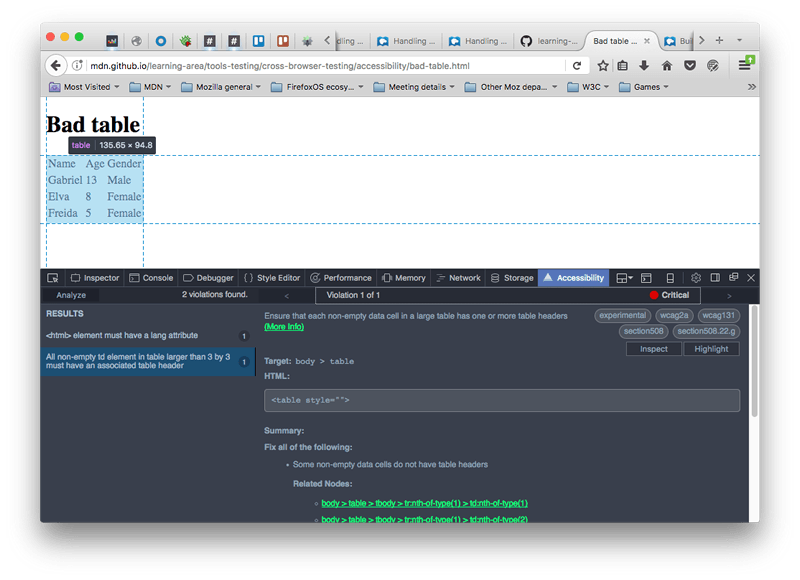
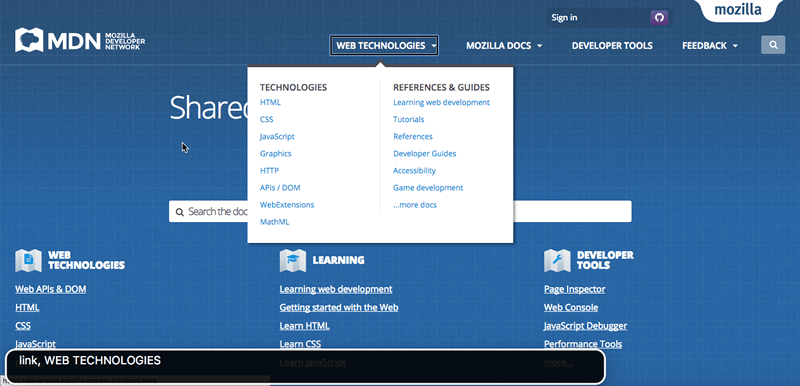

{{LearnSidebar}}

{{PreviousMenuNext("Learn_web_development/Core/Accessibility/What_is_Accessibility","Learn_web_development/Core/Accessibility/HTML", "Learn_web_development/Core/Accessibility")}}

> [!NOTE]
> The content in this article is currently incomplete, sorry about that! We are working hard to improve the MDN Learn Web Development section, and we will have places marked as incomplete ("TODO") finished soon.

Next we turn our attention to accessibility tooling, providing information on the kinds of tools you can use to help solve accessibility issues, and the assistive technologies used by people with disabilities as they browse the web. You'll be using these tools throughout subsequent articles.

<table>
  <tbody>
    <tr>
      <th scope="row">Prerequisites:</th>
      <td>Familiarity with <a href="/en-US/docs/Learn_web_development/Core/Structuring_content">HTML</a>, <a href="/en-US/docs/Learn_web_development/Core/Styling_basics">CSS</a>, a <a href="/en-US/docs/Learn_web_development/Core/Accessibility/What_is_accessibility">basic understanding of accessibility concepts</a>.</td>
    </tr>
    <tr>
      <th scope="row">Learning outcomes:</th>
      <td>
        <ul>
          <li>Familiarity with the kind of tooling you can use to help solve accessibility issues, for example auditing tools.</li>
          <li>Setting up screen readers and using them to test websites on desktop and mobile.</li>
          <li>Other assistive technology such as large text or braille keyboards, alternative pointing devices, and screen magnifiers.</li>
          <li>The importance of user testing alongside automated testing.</li>
        </ul>
      </td>
    </tr>
  </tbody>
</table>

## Accessibility tools

Let's have a look at the tools can make use of when implementing accessible websites and fixing accessibility issues.

### Testing source order

Your content should make logical sense in its source order — you can always place it where you want using CSS later on, but you should get the source order right to start with.

As a test, you can turn off a site's CSS and see how understandable it is without it. You could do this manually by just removing the CSS from your code, but the easiest way is to use browser features, for example:

- Firefox: Select _View > Page Style > No Style_ from the main menu.
- Safari: Select _Develop > Disable Styles_ from the main menu (to enable the _Develop_ menu, choose _Safari > Preferences > Advanced > Show Develop menu in menu bar_).
- Chrome: Install the Web Developer Toolbar extension, then restart the browser. Click the gear icon that will appear, then select _CSS > Disable All Styles_.
- Edge: Select _View > Style > No Style_ from the main menu.

### Color contrast checkers

When choosing a color scheme for your website, you should make sure that the text (foreground) color contrasts well with the background color. Your design might look cool, but it is no good if people with visual impairments like color blindness can't read your content. Use a tool like WebAIM's [Color Contrast Checker](https://webaim.org/resources/contrastchecker/) to check whether your scheme is contrasting enough.

Another tip is to not rely on color alone for signposts/information, as this will be no good for those who can't see the color. Instead of marking required form fields in red, for example, mark them with an asterisk and in red.

> [!NOTE]
> A high contrast ratio will also allow anyone using a smartphone or tablet with a glossy screen to better read pages when in a bright environment, such as sunlight.

### Auditing tools

There are a number of auditing tools available that you can feed your web pages into. They will look over them and return a list of accessibility issues present on the page. Let's look at an example, using [Wave](https://wave.webaim.org/), an online accessibility testing tool that accepts a web address and returns an annotated view of that page with accessibility problems highlighted.

1. Go to the [Wave homepage](https://wave.webaim.org/).
2. Enter the URL of our [bad-semantics.html](https://mdn.github.io/learning-area/accessibility/html/bad-semantics.html) example into the text input box near the top of the page. Then press enter or click/tap the arrow at the far right edge of the input box.
3. The site should respond with a description of the accessibility problems. Click the icons displayed to see more information about each of the issues identified by Wave's evaluation.

Other auditing tools that are worth checking out:

- [Firefox Accessibility Inspector](https://firefox-source-docs.mozilla.org/devtools-user/accessibility_inspector/index.html)
- [ANDI bookmarklet](https://www.ssa.gov/accessibility/andi/help/install.html)
- [Google Lighthouse accessibility audits](https://developer.chrome.com/docs/lighthouse/accessibility/)

> [!NOTE]
> Such tools aren't good enough to solve all your accessibility problems on their own. You'll need a combination of these, knowledge and experience, user testing, etc. to get a full picture.

### Automation tools

[Deque's aXe tool](https://www.deque.com/axe/) goes a bit further than the auditing tools we mentioned above. Like the others, it checks pages and returns accessibility errors. Its most immediately useful form is probably the browser extensions:

- [aXe for Chrome](https://chromewebstore.google.com/detail/axe-devtools-web-accessib/lhdoppojpmngadmnindnejefpokejbdd)
- [aXe for Firefox](https://addons.mozilla.org/en-US/firefox/addon/axe-devtools/)

These add an accessibility tab to the browser developer tools. For example, we installed the Firefox version, then used it to audit our [bad-table.html](https://mdn.github.io/learning-area/accessibility/html/bad-table.html) example. We got the following results:

aXe is also installable using `npm`, and can be integrated with task runners like [Grunt](https://gruntjs.com/) and [Gulp](https://gulpjs.com/), automation frameworks like [Selenium](https://www.selenium.dev/) and [Cucumber](https://cucumber.io/), unit testing frameworks like [Jasmine](https://jasmine.github.io/), and more besides (again, see the [main aXe page](https://www.deque.com/axe/) for details).

## Screen readers

It is definitely worth testing with a screen reader to get used to how severely visually impaired people use the Web. There are a number of screen readers available:

- Some are paid-for commercial products, like [JAWS](https://www.freedomscientific.com/Products/software/JAWS/) (Windows).
- Some are free products, like [NVDA](https://www.nvaccess.org/) (Windows), [ChromeVox](https://support.google.com/chromebook/answer/7031755) (Chrome, Windows, and macOS), and [Orca](https://wiki.gnome.org/Projects/Orca) (Linux).
- Some are built into the operating system, like [VoiceOver](https://www.apple.com/accessibility/vision/) (macOS and iOS), [ChromeVox](https://support.google.com/chromebook/answer/7031755) (on Chromebooks), and [TalkBack](https://play.google.com/store/apps/details?id=com.google.android.marvin.talkback) (Android).

Generally, screen readers are separate apps that run on the host operating system and can read not only web pages, but text in other apps as well. This is not always the case (ChromeVox is a browser extension), but usually, screen readers tend to act in slightly different ways and have different controls, so you'll have to consult the documentation for your chosen screen reader to get all the details — saying that, they all work in basically the same sort of way.

Let's go through some tests with a couple of different screen readers to give you a general idea of how they work and how to test with them.

> [!NOTE]
> WebAIM's [Designing for Screen Reader Compatibility](https://webaim.org/techniques/screenreader/) provides some useful information about screen reader usage and what works best for screen readers. Also see [Screen Reader User Survey #9 Results](https://webaim.org/projects/screenreadersurvey9/#used) for some interesting screen reader usage statistics.

### VoiceOver

VoiceOver (VO) comes free with your Mac/iPhone/iPad, so it's useful for testing on desktop/mobile if you use Apple products. We'll be testing it on macOS on a MacBook Pro.

To turn it on, press Cmd + F5. If you've not used VO before, you will be given a welcome screen where you can choose to start VO or not, and run through a rather useful tutorial to learn how to use it. To turn it off again, press Cmd + F5 again.

> [!NOTE]
> You should go through the tutorial at least once — it is a really useful way to learn VO.

When VO is on, the display will look mostly the same, but you'll see a black box at the bottom left of the screen that contains information on what VO currently has selected. The current selection will also be highlighted, with a black border — this highlight is known as the **VO cursor**.

To use VO, you will make a lot of use of the "VO modifier" — this is a key or key combination that you need to press in addition to the actual VO keyboard shortcuts to get them to work. Using a modifier like this is common with screen readers, to enable them to keep their commands from clashing with other commands. In the case of VO, the modifier can either be CapsLock, or Ctrl + Option.

VO has many keyboard commands, and we won't list them all here. The basic ones you'll need for web page testing are in the following table. In the keyboard shortcuts, "VO" means "the VoiceOver modifier".

<table class="standard-table no-markdown">
  <caption>
    Most common VoiceOver keyboard shortcuts
  </caption>
  <thead>
    <tr>
      <th scope="col">Keyboard shortcut</th>
      <th scope="col">Description</th>
    </tr>
  </thead>
  <tbody>
    <tr>
      <td>VO + Cursor keys</td>
      <td>Move the VO cursor up, right, down, left.</td>
    </tr>
    <tr>
      <td>VO + Spacebar</td>
      <td>
        Select/activate items highlighted by the VO cursor. This includes items
        selected in the Rotor (see below).
      </td>
    </tr>
    <tr>
      <td>VO + Shift + down cursor</td>
      <td>
        Move into a group of items (such as an HTML table, or a form, etc.) Once
        inside a group you can move around and select items inside that group
        using the above commands as normal.
      </td>
    </tr>
    <tr>
      <td>VO + Shift + up cursor</td>
      <td>Move out of a group.</td>
    </tr>
    <tr>
      <td>VO + C</td>
      <td>(when inside a table) Read the header of the current column.</td>
    </tr>
    <tr>
      <td>VO + R</td>
      <td>(when inside a table) Read the header of the current row.</td>
    </tr>
    <tr>
      <td>VO + C + C (two Cs in succession)</td>
      <td>
        (when inside a table) Read the entire current column, including header.
      </td>
    </tr>
    <tr>
      <td>VO + R + R (two Rs in succession)</td>
      <td>
        (when inside a table) Read the entire current row, including the headers
        that correspond to each cell.
      </td>
    </tr>
    <tr>
      <td>VO + left cursor, VO + right cursor</td>
      <td>
        (when inside some horizontal options, such as a date or time picker)
        Move between options.
      </td>
    </tr>
    <tr>
      <td>VO + up cursor, VO + down cursor</td>
      <td>
        (when inside some horizontal options, such as a date or time picker)
        Change the current option.
      </td>
    </tr>
    <tr>
      <td>VO + U</td>
      <td>
        Use the Rotor, which displays lists of headings, links, form controls,
        etc. for easy navigation.
      </td>
    </tr>
    <tr>
      <td>VO + left cursor, VO + right cursor</td>
      <td>
        (when inside Rotor) Move between different lists available in the Rotor.
      </td>
    </tr>
    <tr>
      <td>VO + up cursor, VO + down cursor</td>
      <td>
        (when inside Rotor) Move between different items in the current Rotor
        list.
      </td>
    </tr>
    <tr>
      <td>Esc</td>
      <td>(when inside Rotor) Exit Rotor.</td>
    </tr>
    <tr>
      <td>Ctrl</td>
      <td>(when VO is speaking) Pause/Resume speech.</td>
    </tr>
    <tr>
      <td>VO + Z</td>
      <td>Restart the last bit of speech.</td>
    </tr>
    <tr>
      <td>VO + D</td>
      <td>Go into the Mac's Dock, so you can select apps to run inside it.</td>
    </tr>
  </tbody>
</table>

This seems like a lot of commands, but it isn't so bad when you get used to it, and VO regularly gives you reminders of what commands to use in certain places. Have a play with VO now; you can then go on to play with some of our examples in the [Screen reader testing](#screen_reader_testing) section.

### NVDA

NVDA is Windows-only, and you'll need to install it.

1. Download it from [nvaccess.org](https://www.nvaccess.org/). You can choose whether to make a donation or download it for free; you'll also need to give them your email address before you can download it.
2. Once downloaded, install it — you double-click the installer, accept the license and follow the prompts.
3. To start NVDA, double-click on the program file/shortcut, or use the keyboard shortcut Ctrl + Alt + N. You'll see the NVDA welcome dialog when you start it. Here you can choose from a couple of options, then press the _OK_ button to get going.

NVDA will now be active on your computer.

To use NVDA, you will make a lot of use of the "NVDA modifier" — this is a key that you need to press in addition to the actual NVDA keyboard shortcuts to get them to work. Using a modifier like this is common with screen readers, to enable them to keep their commands from clashing with other commands. In the case of NVDA, the modifier can either be Insert (the default), or CapsLock (can be chosen by checking the first checkbox in the NVDA welcome dialog before pressing _OK_).

> [!NOTE]
> NVDA is more subtle than VoiceOver in terms of how it highlights where it is and what it is doing. When you are scrolling through headings, lists, etc., items you are selected on will generally be highlighted with a subtle outline, but this is not always the case for all things. If you get completely lost, you can press Ctrl + F5 to refresh the current page and begin from the top again.

NVDA has many keyboard commands, and we won't list them all here. The basic ones you'll need for web page testing are in the following table. In the keyboard shortcuts, "NVDA" means "the NVDA modifier".

<table class="standard-table no-markdown">
  <caption>
    Most common NVDA keyboard shortcuts
  </caption>
  <thead>
    <tr>
      <th scope="col">Keyboard shortcut</th>
      <th scope="col">Description</th>
    </tr>
  </thead>
  <tbody>
    <tr>
      <td>NVDA + Q</td>
      <td>Turn NVDA off again after you've started it.</td>
    </tr>
    <tr>
      <td>NVDA + up cursor</td>
      <td>Read the current line.</td>
    </tr>
    <tr>
      <td>NVDA + down cursor</td>
      <td>Start reading at the current position.</td>
    </tr>
    <tr>
      <td>Up cursor and down cursor, or Shift + Tab and Tab</td>
      <td>Move to previous/next item on page and read it.</td>
    </tr>
    <tr>
      <td>Left cursor and right cursor</td>
      <td>Move to previous/next character in current item and read it.</td>
    </tr>
    <tr>
      <td>Shift + H and H</td>
      <td>Move to previous/next heading and read it.</td>
    </tr>
    <tr>
      <td>Shift + K and K</td>
      <td>Move to previous/next link and read it.</td>
    </tr>
    <tr>
      <td>Shift + D and D</td>
      <td>
        Move to previous/next document landmark (e.g. <code>&#x3C;nav></code>)
        and read it.
      </td>
    </tr>
    <tr>
      <td>Shift + 1–6 and 1–6</td>
      <td>Move to previous/next heading (level 1–6) and read it.</td>
    </tr>
    <tr>
      <td>Shift + F and F</td>
      <td>Move to previous/next form input and focus on it.</td>
    </tr>
    <tr>
      <td>Shift + T and T</td>
      <td>Move to previous/next data table and focus on it.</td>
    </tr>
    <tr>
      <td>Shift + B and B</td>
      <td>Move to previous/next button and read its label.</td>
    </tr>
    <tr>
      <td>Shift + L and L</td>
      <td>Move to previous/next list and read its first list item.</td>
    </tr>
    <tr>
      <td>Shift + I and I</td>
      <td>Move to previous/next list item and read it.</td>
    </tr>
    <tr>
      <td>Enter/Return</td>
      <td>
        (when link/button or other activatable item is selected) Activate item.
      </td>
    </tr>
    <tr>
      <td>NVDA + Space</td>
      <td>
        (when form is selected) Enter form so individual items can be selected,
        or leave form if you are already in it.
      </td>
    </tr>
    <tr>
      <td>Shift Tab and Tab</td>
      <td>(when inside form) Move between form inputs.</td>
    </tr>
    <tr>
      <td>Up cursor and down cursor</td>
      <td>
        (when inside form) Change form input values (in the case of things like
        select boxes).
      </td>
    </tr>
    <tr>
      <td>Spacebar</td>
      <td>(when inside form) Select chosen value.</td>
    </tr>
    <tr>
      <td>Ctrl + Alt + cursor keys</td>
      <td>(when a table is selected) Move between table cells.</td>
    </tr>
  </tbody>
</table>

### Screen reader testing

Now you've gotten used to using a screen reader, we'd like you to use it to do some quick accessibility tests, to get an idea of how screen readers deal with good and bad webpage features:

- Look at [good-semantics.html](https://mdn.github.io/learning-area/accessibility/html/good-semantics.html), and note how the headers are found by the screen reader and available to use for navigation. Now look at [bad-semantics.html](https://mdn.github.io/learning-area/accessibility/html/bad-semantics.html), and note how the screen reader gets none of this information. Imagine how annoying this would be when trying to navigate a really long page of text.
- Look at [good-links.html](https://mdn.github.io/learning-area/accessibility/html/good-links.html), and note how they make sense when viewed out of context. This is not the case with [bad-links.html](https://mdn.github.io/learning-area/accessibility/html/bad-links.html) — they are all just "click here".
- Look at [good-form.html](https://mdn.github.io/learning-area/accessibility/html/good-form.html), and note how the form inputs are described using their labels because we've used `<label>` elements properly. In [bad-form.html](https://mdn.github.io/learning-area/accessibility/html/bad-form.html), they get an unhelpful label along the lines of "blank".
- Look at our [punk-bands-complete.html](https://mdn.github.io/learning-area/css/styling-boxes/styling-tables/punk-bands-complete.html) example, and see how the screen reader is able to associate columns and rows of content and read them out all together because we've defined headers properly. In [bad-table.html](https://mdn.github.io/learning-area/accessibility/html/bad-table.html), none of the cells can be associated at all. Note that NVDA seems to behave slightly strangely when you've only got a single table on a page; you could try [WebAIM's table test page](https://webaim.org/articles/nvda/tables.htm) instead.
- Have a look at the [WAI-ARIA live regions example](https://www.freedomscientific.com/SurfsUp/AriaLiveRegions.htm) we saw earlier, and note how the screen reader will keep reading out the constantly updating section as it updates.

## User testing

As mentioned above, you can't rely on automated tools alone for determining accessibility problems on your site. It is recommended that when you draw up your testing plan, you should include some accessibility user groups if at all possible. Try to get some screen reader users involved, some keyboard-only users, some non-hearing users, and perhaps other groups too, as suits your requirements.

## Other tooling

Many other assistive technology types exist, such as:

- Large text or braille keyboards.
- Alternative pointing devices such as trackballs, joysticks, and touchpads.
- Screen magnifiers.
- Voice recognition software.
- Switch controls.

## Accessibility testing checklist

The following list provides a checklist for you to follow to make sure you've carried out the recommended accessibility testing for your project:

1. Make sure your HTML is as semantically correct as possible. [Validating it](/en-US/docs/Learn_web_development/Core/Structuring_content/Debugging_HTML#html_validation) is a good start, as is using an [auditing tool](#auditing_tools).
2. Check that your content makes sense when the CSS is turned off.
3. Make sure your functionality is keyboard accessible (see [UI controls](/en-US/docs/Learn_web_development/Core/Accessibility/HTML#ui_controls) for more details). Test using Tab, Return/Enter, etc.
4. Make sure your non-text content has [text alternatives](/en-US/docs/Learn_web_development/Core/Accessibility/HTML#text_alternatives). An [auditing tool](#auditing_tools) is good for catching such problems.
5. Make sure your site's [color contrast](/en-US/docs/Learn_web_development/Core/Accessibility/CSS_and_JavaScript#color_and_color_contrast) is acceptable, using a suitable checking tool.
6. Make sure [hidden content](/en-US/docs/Learn_web_development/Core/Accessibility/CSS_and_JavaScript#hiding_things) is visible by screen readers.
7. Make sure that functionality is usable without JavaScript wherever possible.
8. Use ARIA to improve accessibility where appropriate.
9. Run your site through an [auditing tool](#auditing_tools).
10. Test it with a screen reader.
11. Include an accessibility policy/statement somewhere findable on your site to say what you did.

## Summary

Hopefully this article has given you an idea of the kinds of tools you can use to help fix accessibility issues, the assistive technology used by people with disabilities to help access the web.

In the next article we'll look how to write accessible HTML.

{{PreviousMenuNext("Learn_web_development/Core/Accessibility/What_is_Accessibility","Learn_web_development/Core/Accessibility/HTML", "Learn_web_development/Core/Accessibility")}}
