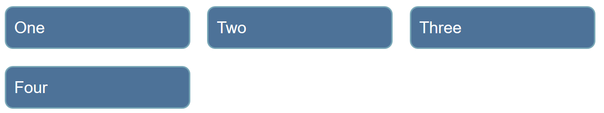
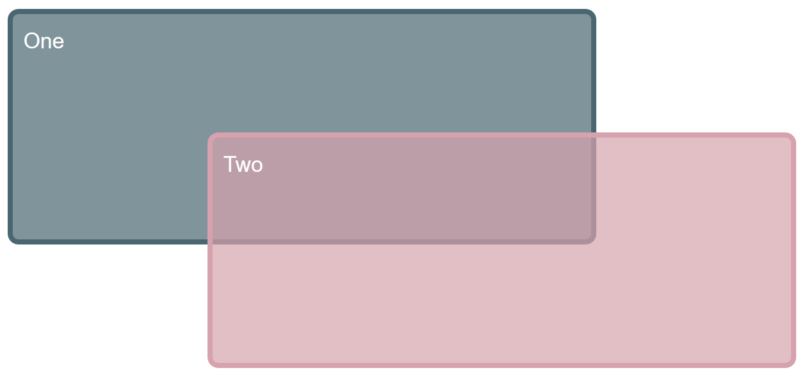
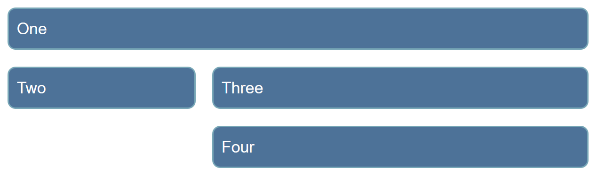
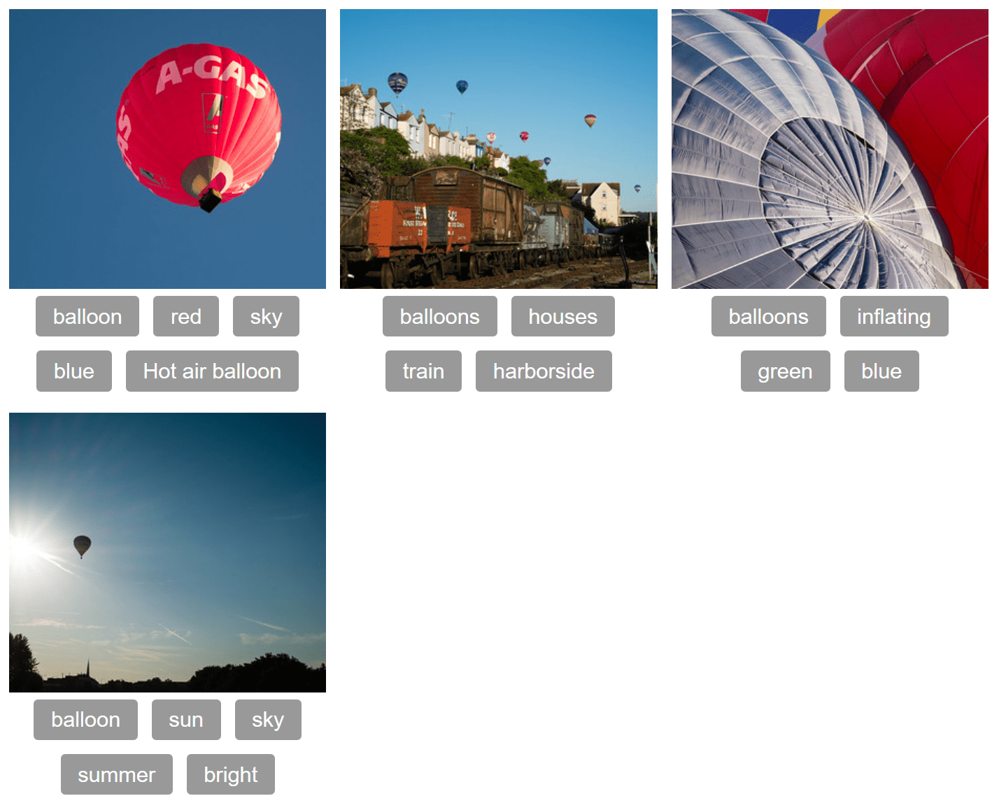

{{LearnSidebar}}

The aim of this skill test is to assess whether you understand how a [grid and grid items](/en-US/docs/Learn_web_development/Core/CSS_layout/Grids) behave. You will be working through several small tasks that use different elements of the material you have just covered.

> [!NOTE]
> Click **"Play"** in the code blocks below to edit the examples in the MDN Playground.
> You can also copy the code (click the clipboard icon) and paste it into an online editor such as [CodePen](https://codepen.io/), [JSFiddle](https://jsfiddle.net/), or [Glitch](https://glitch.com/).
> If you get stuck, you can reach out to us in one of our [communication channels](/en-US/docs/MDN/Community/Communication_channels).

## Task 1

In this task, you should create a grid into which the four child elements will auto-place. The grid should have three columns sharing the available space equally and a 20 pixel gap between the column and row tracks. After that, try adding more child containers inside the parent container with the class of `grid` and see how they behave by default.

Your final result should look like the image below:



Try to update the code below to recreate the finished example:

```html live-sample___grid1
<div class="grid">
  <div>One</div>
  <div>Two</div>
  <div>Three</div>
  <div>Four</div>
</div>
```

```css hidden live-sample___grid1
body {
  font: 1.2em / 1.5 sans-serif;
}
.grid > * {
  background-color: #4d7298;
  border: 2px solid #77a6b6;
  border-radius: 0.5em;
  color: #fff;
  padding: 0.5em;
}
```

```css live-sample___grid1
.grid {
}
```

{{EmbedLiveSample("grid1", "", "200px")}}

<details>
<summary>Click here to show the solution</summary>

Create a grid using `display: grid` with three columns using `grid-template-columns` and a `gap` between the items:

```css
.grid {
  display: grid;
  grid-template-columns: 1fr 1fr 1fr;
  gap: 20px;
}
```

</details>

## Task 2

In this task, we already have a grid defined. By editing the CSS rules for the two child elements, cause them to span over several grid tracks each. The second item should overlay the first as in the image below:



**Bonus question:** Can you now cause the first item to display on top without changing the order of items in the source?

Try to update the code below to recreate the finished example:

```html live-sample___grid2
<div class="grid">
  <div class="item1">One</div>
  <div class="item2">Two</div>
</div>
```

```css hidden live-sample___grid2
body {
  font: 1.2em / 1.5 sans-serif;
}
.grid > * {
  border-radius: 0.5em;
  color: #fff;
  padding: 0.5em;
}

.item1 {
  background-color: rgb(74 102 112 / 70%);
  border: 5px solid rgb(74 102 112 / 100%);
}

.item2 {
  background-color: rgb(214 162 173 / 70%);
  border: 5px solid rgb(214 162 173 / 100%);
}
```

```css live-sample___grid2
.grid {
  display: grid;
  grid-template-columns: 1fr 1fr 1fr 1fr;
  grid-template-rows: 100px 100px 100px;
  gap: 10px;
}

.item1 {
}

.item2 {
}
```

{{EmbedLiveSample("grid2", "", "340px")}}

<details>
<summary>Click here to show the solution</summary>

It is possible to layer items by way of them occupying the same grid cells.
One option is to use the shorthands below, however it would be correct to use the longhand `grid-row-start` for example.

```css
.item1 {
  grid-column: 1 / 4;
  grid-row: 1 / 3;
}

.item2 {
  grid-column: 2 / 5;
  grid-row: 2 / 4;
}
```

For the bonus question, one way of achieving this would be to use `order`, which we've encountered in the flexbox tutorial.

```css
.item1 {
  order: 1;
}
```

Another valid solution is to use `z-index`:

```css
.item1 {
  z-index: 1;
}
```

</details>

## Task 3

In this task, there are four direct children in this grid. The starting point has them displayed using auto-placement. Use the grid-area and grid-template-areas properties to lay the items out as shown in the image below:



Try to update the code below to recreate the finished example:

```html live-sample___grid3
<div class="grid">
  <div class="one">One</div>
  <div class="two">Two</div>
  <div class="three">Three</div>
  <div class="four">Four</div>
</div>
```

```css hidden live-sample___grid3
body {
  font: 1.2em / 1.5 sans-serif;
}
.grid > * {
  background-color: #4d7298;
  border: 2px solid #77a6b6;
  border-radius: 0.5em;
  color: #fff;
  padding: 0.5em;
}
```

```css live-sample___grid3
.grid {
  display: grid;
  grid-template-columns: 1fr 2fr;
  gap: 10px;
}
```

{{EmbedLiveSample("grid3", "", "200px")}}

<details>
<summary>Click here to show the solution</summary>

Each part of the layout needs a name using the `grid-area` property and `grid-template-areas` to lay them out. Possible areas of confusion would be not realizing you should place a `.` to leave a cell empty, or that you should repeat the name to cause an element to span more than one track:

```css
.grid {
  display: grid;
  gap: 20px;
  grid-template-columns: 1fr 2fr;
  grid-template-areas:
    "aa aa"
    "bb cc"
    ". dd";
}

.one {
  grid-area: aa;
}

.two {
  grid-area: bb;
}

.three {
  grid-area: cc;
}

.four {
  grid-area: dd;
}
```

</details>

## Task 4

In this task, you will need to use both grid layout and flexbox to recreate the example as seen in the image below. The gap between the column and row tracks should be 10px. You do not need to make any changes to the HTML in order to achieve this.



Try to update the code below to recreate the finished example:

```html live-sample___grid4
<div class="container">
  <div class="card">
    
    <ul class="tags">
      <li>balloon</li>
      <li>red</li>
      <li>sky</li>
      <li>blue</li>
      <li>Hot air balloon</li>
    </ul>
  </div>
  <div class="card">
    
    <ul class="tags">
      <li>balloons</li>
      <li>houses</li>
      <li>train</li>
      <li>harborside</li>
    </ul>
  </div>
  <div class="card">
    
    <ul class="tags">
      <li>balloons</li>
      <li>inflating</li>
      <li>green</li>
      <li>blue</li>
    </ul>
  </div>
  <div class="card">
    
    <ul class="tags">
      <li>balloon</li>
      <li>sun</li>
      <li>sky</li>
      <li>summer</li>
      <li>bright</li>
    </ul>
  </div>
</div>
```

```css hidden live-sample___grid4
body {
  font: 1.2em / 1.5 sans-serif;
}
.card {
  display: grid;
  grid-template-rows: 200px min-content;
}

.card > img {
  width: 100%;
  height: 100%;
  object-fit: cover;
}

.tags {
  margin: 0;
  padding: 0;
  list-style: none;
}

.tags > * {
  background-color: #999;
  color: #fff;
  padding: 0.2em 0.8em;
  border-radius: 0.2em;
  font-size: 80%;
  margin: 5px;
}
```

```css live-sample___grid4
.container {
}

.tags {
}
```

{{EmbedLiveSample("grid4", "", "400px")}}

<details>
<summary>Click here to show the solution</summary>

The container will need to be a grid layout, as we have alignment in rows and columns - two-dimensional.
The `<ul>` needs to be a flex container as tags (`<li>` elements) are not lined up in columns, only in rows and they are centered in the space with the alignment property `justify-content` set to `center`.

You may try to use flexbox on the container and restrict the cards with percentage values. You may also try to make the items into a grid layout in which case, note that the items are not aligned in two dimensions so flexbox isn't the best choice.

```css
.container {
  display: grid;
  gap: 10px;
  grid-template-columns: 1fr 1fr 1fr;
}

.tags {
  display: flex;
  flex-wrap: wrap;
  justify-content: center;
}
```

</details>

## See also

- [CSS styling basics](/en-US/docs/Learn_web_development/Core/Styling_basics)
