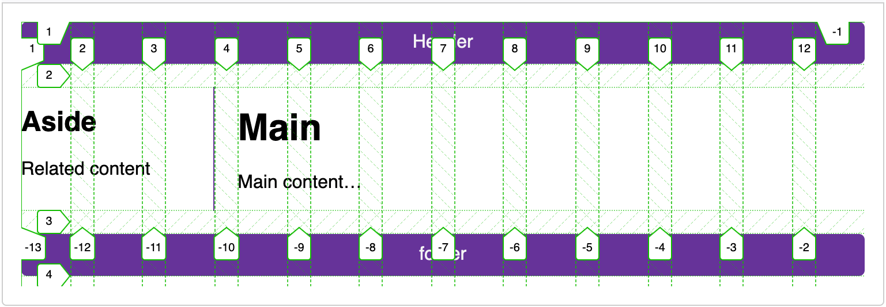

{{LearnSidebar}}

{{PreviousMenuNext("Learn_web_development/Core/CSS_layout/Flexbox", "Learn_web_development/Core/CSS_layout/Responsive_design", "Learn_web_development/Core/CSS_layout")}}

CSS grid layout is a two-dimensional layout system for the web. It lets you organize content into rows and columns and offers many features to simplify the creation of complex layouts. This article will explain all you need to know to get started with grid layout.

<table>
  <tbody>
    <tr>
      <th scope="row">Prerequisites:</th>
      <td>
        <a href="/en-US/docs/Learn_web_development/Core/Structuring_content"
          >Structuring content with HTML</a
        >,
        <a href="/en-US/docs/Learn_web_development/Core/Styling_basics">CSS Styling basics</a>,
        <a href="/en-US/docs/Learn_web_development/Core/Text_styling/Fundamentals">Fundamental text and font styling</a>,
        familiarity with <a href="/en-US/docs/Learn_web_development/Core/CSS_layout/Introduction">CSS layout fundamental concepts</a>.
      </td>
    </tr>
    <tr>
      <th scope="row">Learning outcomes:</th>
      <td>
        <ul>
          <li>Understand the purpose of CSS Grid — flexibly lay out a set of block or inline elements in two dimensions.</li>
          <li>Understand grid terminology — rows, columns, gaps, and gutters.</li>
          <li>Understand what <code>display: grid</code> gives you by default.</li>
          <li>Defining grid rows, columns, and gaps.</li>
          <li>Positioning elements on the grid.</li>
        </ul>
      </td>
    </tr>
  </tbody>
</table>

## What is grid layout?

A grid is a collection of horizontal and vertical lines creating a pattern against which we can line up our design elements. They help us to create layouts in which our elements won't jump around or change width as we move from page to page, providing greater consistency on our websites.

A grid will typically have **columns**, **rows**, and then gaps between each row and column. The gaps are commonly referred to as **gutters**.


## Creating your grid in CSS

Having decided on the grid that your design needs, you can use CSS grid layout to create it. We'll look at the basic features of grid layout first and then explore how to create a simple grid system for your project.
The following video provides a nice visual explanation of using CSS grid:

{{EmbedYouTube("KOvGeFUHAC0")}}

### Defining a grid

Let's try out grid layouts, here is an example with a container, which has some child items. By default, these items are displayed in a normal flow, causing them to appear one below the other.

```html live-sample___simple-grid_0
<div class="container">
  <div>One</div>
  <div>Two</div>
  <div>Three</div>
  <div>Four</div>
  <div>Five</div>
  <div>Six</div>
  <div>Seven</div>
</div>
```

```css live-sample___simple-grid_0
body {
  font: sans-serif;
}
.container > div {
  border-radius: 5px;
  padding: 10px;
  background-color: rgb(207 232 220);
  border: 2px solid rgb(79 185 227);
}
```

{{EmbedLiveSample('simple-grid_0', '100%', "310") }}

Similar to how you define flexbox, you define a grid layout by setting the value of the {{cssxref("display")}} property to `grid`. As in the case of flexbox, the `display: grid` property transforms all the direct children of the container into grid items. We have added the following CSS to the file:

```html hidden live-sample___simple-grid_1
<div class="container">
  <div>One</div>
  <div>Two</div>
  <div>Three</div>
  <div>Four</div>
  <div>Five</div>
  <div>Six</div>
  <div>Seven</div>
</div>
```

```css hidden live-sample___simple-grid_1
body {
  font: sans-serif;
}
.container > div {
  border-radius: 5px;
  padding: 10px;
  background-color: rgb(207 232 220);
  border: 2px solid rgb(79 185 227);
}
```

```css live-sample___simple-grid_1
.container {
  display: grid;
}
```

{{EmbedLiveSample('simple-grid_1', '100%', "310") }}

Unlike flexbox, the items will not immediately look any different. Declaring `display: grid` gives you a one column grid, so your items will continue to display one below the other as they do in normal flow.

To see something that looks more grid-like, we'll need to add some columns to the grid. Let's add three 200-pixel columns. You can use any length unit or percentage to create these column tracks.

```html hidden live-sample___simple-grid_2
<div class="container">
  <div>One</div>
  <div>Two</div>
  <div>Three</div>
  <div>Four</div>
  <div>Five</div>
  <div>Six</div>
  <div>Seven</div>
</div>
```

```css hidden live-sample___simple-grid_2
body {
  font: sans-serif;
}
.container > div {
  border-radius: 5px;
  padding: 10px;
  background-color: rgb(207 232 220);
  border: 2px solid rgb(79 185 227);
}
```

```css live-sample___simple-grid_2
.container {
  display: grid;
  grid-template-columns: 200px 200px 200px;
}
```

You should see that the items have rearranged themselves such that there's one in each cell of the grid.

{{EmbedLiveSample('simple-grid_2', '100%', "130") }}

### Flexible grids with the fr unit

In addition to creating grids using lengths and percentages, we can use [`fr`](/en-US/docs/Web/CSS/flex_value). The `fr` unit represents one fraction of the available space in the grid container to flexibly size grid rows and columns.

```html hidden live-sample___grid-fr-unit_0
<div class="container">
  <div>One</div>
  <div>Two</div>
  <div>Three</div>
  <div>Four</div>
  <div>Five</div>
  <div>Six</div>
  <div>Seven</div>
</div>
```

```css hidden live-sample___grid-fr-unit_0
body {
  font: sans-serif;
}
.container > div {
  border-radius: 5px;
  padding: 10px;
  background-color: rgb(207 232 220);
  border: 2px solid rgb(79 185 227);
}
```

Here we change the track listing to the following definition, creating three `1fr` tracks:

```css live-sample___grid-fr-unit_0
.container {
  display: grid;
  grid-template-columns: 1fr 1fr 1fr;
}
```

{{EmbedLiveSample('grid-fr-unit_0', '100%', "130") }}

You now have flexible tracks. The `fr` unit distributes space proportionally. You can specify different positive values for your tracks like so:

```html hidden live-sample___grid-fr-unit_1
<div class="container">
  <div>One</div>
  <div>Two</div>
  <div>Three</div>
  <div>Four</div>
  <div>Five</div>
  <div>Six</div>
  <div>Seven</div>
</div>
```

```css hidden live-sample___grid-fr-unit_1
body {
  font: sans-serif;
}
.container > div {
  border-radius: 5px;
  padding: 10px;
  background-color: rgb(207 232 220);
  border: 2px solid rgb(79 185 227);
}
```

Now change your track listing to the following definition, creating one `2fr` two `1fr` tracks:

```css live-sample___grid-fr-unit_1
.container {
  display: grid;
  grid-template-columns: 2fr 1fr 1fr;
}
```

{{EmbedLiveSample('grid-fr-unit_1', '100%', "130") }}

The first track gets `2fr` of the available space and the other two tracks get `1fr`, making the first track larger. You can mix `fr` units with fixed length units. In this case, the space needed for the fixed tracks is used up first before the remaining space is distributed to the other tracks.

> [!NOTE]
> The `fr` unit distributes _available_ space, not _all_ space. Therefore, if one of your tracks has something large inside it, there will be less free space to share.

### Gaps between tracks

To create gaps between tracks, we use the properties:

- {{cssxref("column-gap")}} for gaps between columns
- {{cssxref("row-gap")}} for gaps between rows
- {{cssxref("gap")}} as a shorthand for both

```html hidden live-sample___grid-gap
<div class="container">
  <div>One</div>
  <div>Two</div>
  <div>Three</div>
  <div>Four</div>
  <div>Five</div>
  <div>Six</div>
  <div>Seven</div>
</div>
```

```css hidden live-sample___grid-gap
body {
  font: sans-serif;
}
.container > div {
  border-radius: 5px;
  padding: 10px;
  background-color: rgb(207 232 220);
  border: 2px solid rgb(79 185 227);
}
```

Here we add the `gap` property to create gaps between the tracks with a value of `20px:

```css live-sample___grid-gap
.container {
  display: grid;
  grid-template-columns: 2fr 1fr 1fr;
  gap: 20px;
}
```

{{EmbedLiveSample('grid-gap', '100%', "180") }}

These gaps can be any length unit or percentage, but not an `fr` unit.

### Repeating track listings

You can repeat all or merely a section of your track listing using the CSS `repeat()` function.
Here we change the track listing to the following:

```html hidden live-sample___grid-repeat
<div class="container">
  <div>One</div>
  <div>Two</div>
  <div>Three</div>
  <div>Four</div>
  <div>Five</div>
  <div>Six</div>
  <div>Seven</div>
</div>
```

```css hidden live-sample___grid-repeat
body {
  font: sans-serif;
}
.container > div {
  border-radius: 5px;
  padding: 10px;
  background-color: rgb(207 232 220);
  border: 2px solid rgb(79 185 227);
}
```

```css live-sample___grid-repeat
.container {
  display: grid;
  grid-template-columns: repeat(3, 1fr);
  gap: 20px;
}
```

{{EmbedLiveSample('grid-repeat', '100%', "180") }}

You'll now get three `1fr` tracks just as before. The first value passed to the `repeat()` function specifies the number of times you want the listing to repeat, while the second value is a track listing, which may be one or more tracks that you want to repeat.

### Implicit and explicit grids

Up to this point, we've specified only column tracks, but rows are automatically created to hold the content. This concept highlights the distinction between explicit and implicit grids.
Here's a bit more about the difference between the two types of grids:

- **Explicit grid** is created using `grid-template-columns` or `grid-template-rows`.
- **Implicit grid** extends the defined explicit grid when content is placed outside of that grid, such as into the rows by drawing additional grid lines.

By default, tracks created in the implicit grid are `auto` sized, which in general means that they're large enough to contain their content. If you wish to give implicit grid tracks a size, you can use the {{cssxref("grid-auto-rows")}} and {{cssxref("grid-auto-columns")}} properties. If you add `grid-auto-rows` with a value of `100px` to your CSS, you'll see that those created rows are now 100 pixels tall.

```html hidden live-sample___grid-auto
<div class="container">
  <div>One</div>
  <div>Two</div>
  <div>Three</div>
  <div>Four</div>
  <div>Five</div>
  <div>Six</div>
  <div>Seven</div>
</div>
```

```css hidden live-sample___grid-auto
body {
  font: sans-serif;
}
.container > div {
  border-radius: 5px;
  padding: 10px;
  background-color: rgb(207 232 220);
  border: 2px solid rgb(79 185 227);
}
```

```css live-sample___grid-auto
.container {
  display: grid;
  grid-template-columns: repeat(3, 1fr);
  grid-auto-rows: 100px;
  gap: 20px;
}
```

{{EmbedLiveSample('grid-auto', '100%', "350") }}

### The minmax() function

Our 100-pixel tall tracks won't be very useful if we add content into those tracks that is taller than 100 pixels, in which case it would cause an overflow. It might be better to have tracks that are _at least_ 100 pixels tall and can still expand if more content becomes added. A fairly basic fact about the web is that you never really know how tall something is going to be — additional content or larger font sizes can cause problems with designs that attempt to be pixel perfect in every dimension.

The {{cssxref("minmax", "minmax()")}} function lets us set a minimum and maximum size for a track, for example, `minmax(100px, auto)`. The minimum size is 100 pixels, but the maximum is `auto`, which will expand to accommodate more content. Here we change the `grid-auto-rows` to use a `minmax()` value:

```html hidden live-sample___grid-minmax_0
<div class="container">
  <div>One</div>
  <div>Two</div>
  <div>Three</div>
  <div>Four<br />More content</div>
  <div>Five</div>
  <div>Six</div>
  <div>Seven</div>
</div>
```

```css hidden live-sample___grid-minmax_0
body {
  font: sans-serif;
}
.container > div {
  border-radius: 5px;
  padding: 10px;
  background-color: rgb(207 232 220);
  border: 2px solid rgb(79 185 227);
}
```

```css live-sample___grid-minmax_0
.container {
  display: grid;
  grid-template-columns: repeat(3, 1fr);
  grid-auto-rows: minmax(50px, auto);
  gap: 20px;
}
```

{{EmbedLiveSample('grid-minmax_0', '100%', "210") }}

If you add extra content, you'll see that the track expands to allow it to fit. Note that the expansion happens right along the row.

### As many columns as will fit

We can combine some of the lessons we've learned about track listing, repeat notation, and {{cssxref("minmax", "minmax()")}} to create a useful pattern. Sometimes it's helpful to be able to ask grid to create as many columns as will fit into the container. We do this by setting the value of `grid-template-columns` using the {{cssxref("repeat", "repeat()")}} function, but instead of passing in a number, pass in the keyword [`auto-fit`](/en-US/docs/Web/CSS/repeat#auto-fit). For the second parameter of the function we use `minmax()` with a minimum value equal to the minimum track size that we would like to have and a maximum of `1fr`.

```html hidden live-sample___grid-minmax_1
<div class="container">
  <div>One</div>
  <div>Two</div>
  <div>Three</div>
  <div>Four<br />More content</div>
  <div>Five</div>
  <div>Six</div>
  <div>Seven</div>
</div>
```

```css hidden live-sample___grid-minmax_1
body {
  font: sans-serif;
}
.container > div {
  border-radius: 5px;
  padding: 10px;
  background-color: rgb(207 232 220);
  border: 2px solid rgb(79 185 227);
}
```

```css live-sample___grid-minmax_1
.container {
  display: grid;
  grid-template-columns: repeat(auto-fit, minmax(230px, 1fr));
  grid-auto-rows: minmax(50px, auto);
  gap: 20px;
}
```

{{EmbedLiveSample('grid-minmax_1', '100%', "210") }}

This works because grid is creating as many 230-pixel columns as will fit into the container, then sharing whatever space is leftover among all the columns. The maximum is `1fr` which, as we already know, distributes space evenly between tracks.

## Line-based placement

We now move on from creating a grid to placing things on the grid. Our grid always has lines — these are numbered beginning with 1 and relate to the [writing mode](/en-US/docs/Web/CSS/CSS_writing_modes) of the document. For example, column line 1 in English (written left-to-right) would be on the left-hand side of the grid and row line 1 at the top, while in Arabic (written right-to-left), column line 1 would be on the right-hand side.

To position items along these lines, we can specify the start and end lines of the grid area where an item should be placed. There are four properties we can use to do this:

- {{cssxref("grid-column-start")}}
- {{cssxref("grid-column-end")}}
- {{cssxref("grid-row-start")}}
- {{cssxref("grid-row-end")}}

These properties accept line numbers as their values, so we can specify that an item should start on line 1 and end on line 3, for example.
Alternatively, you can also use shorthand properties that let you specify the start and end lines simultaneously, separated by a forward slash `/`:

- {{cssxref("grid-column")}} shorthand for `grid-column-start` and `grid-column-end`
- {{cssxref("grid-row")}} shorthand for `grid-row-start` and `grid-row-end`

```html live-sample___grid-placement_0
<div class="container">
  <header>Header</header>
  <main>
    <h1>Main</h1>
    <p>Main content…</p>
  </main>
  <aside>
    <h2>Aside</h2>
    <p>Related content</p>
  </aside>
  <footer>footer</footer>
</div>
```

```css live-sample___grid-placement_0
.container {
  font-family: sans-serif;
  display: grid;
  grid-template-columns: 1fr 3fr;
  gap: 20px;
}
header,
footer {
  border-radius: 5px;
  padding: 10px;
  background-color: rebeccapurple;
  color: whitesmoke;
  text-align: center;
}
aside {
  border-right: 1px solid rebeccapurple;
}
```

With out the placement defined, you can see that _auto-placement_ is placing each item into its own cell in the grid. The {{htmlelement("header")}} is taking up `1fr` (one quarter) and the {{htmlelement("main")}} is taking up `3fr` (three quarters).

{{EmbedLiveSample('grid-placement_0', '100%', "230") }}

Let's arrange all of the elements for our site by using the grid lines. Add the following rules to the bottom of your CSS:

```html hidden live-sample___grid-placement_1
<div class="container">
  <header>Header</header>
  <main>
    <h1>Main</h1>
    <p>Main content…</p>
  </main>
  <aside>
    <h2>Aside</h2>
    <p>Related content</p>
  </aside>
  <footer>footer</footer>
</div>
```

```css hidden live-sample___grid-placement_1
.container {
  font-family: sans-serif;
  display: grid;
  grid-template-columns: 1fr 3fr;
  gap: 20px;
}
header,
footer {
  border-radius: 5px;
  padding: 10px;
  background-color: rebeccapurple;
  color: whitesmoke;
  text-align: center;
}
aside {
  border-right: 1px solid rebeccapurple;
}
```

```css live-sample___grid-placement_1
header {
  grid-column: 1 / 3;
  grid-row: 1;
}
main {
  grid-column: 2;
  grid-row: 2;
}
aside {
  grid-column: 1;
  grid-row: 2;
}
footer {
  grid-column: 1 / 3;
  grid-row: 3;
}
```

Now the {{htmlelement("header")}} and {{htmlelement("footer")}} are set to `1 / 3`, which means to start at line `1` and ends at line `3`.

{{EmbedLiveSample('grid-placement_1', '100%', "230") }}

> [!NOTE]
> You can also use the value `-1` to target the end column or row line, then count inwards from the end using negative values. Note also that lines count always from the edges of the explicit grid, not the [implicit grid](/en-US/docs/Glossary/Grid).

## Positioning with grid-template-areas

An alternative way to arrange items on your grid is to use the {{cssxref("grid-template-areas")}} property and give the various elements of your design a name.

```html hidden live-sample___grid-placement_2
<div class="container">
  <header>Header</header>
  <main>
    <h1>Main</h1>
    <p>Main content…</p>
  </main>
  <aside>
    <h2>Aside</h2>
    <p>Related content</p>
  </aside>
  <footer>footer</footer>
</div>
```

```css hidden live-sample___grid-placement_2
.container {
  font-family: sans-serif;
  display: grid;
  grid-template-columns: 1fr 3fr;
  gap: 20px;
}
header,
footer {
  border-radius: 5px;
  padding: 10px;
  background-color: rebeccapurple;
  color: whitesmoke;
  text-align: center;
}
aside {
  border-right: 1px solid rebeccapurple;
}
```

```css live-sample___grid-placement_2
.container {
  display: grid;
  grid-template-areas:
    "header header"
    "sidebar content"
    "footer footer";
  grid-template-columns: 1fr 3fr;
  gap: 20px;
}
header {
  grid-area: header;
}
main {
  grid-area: content;
}
aside {
  grid-area: sidebar;
}
footer {
  grid-area: footer;
}
```

Here we are using the {{CSSXRef("grid-template-areas")}} property to define how the 3 rows are laid out. The first row has a value of `header header`, the second `sidebar content` and the third `footer footer`. We are then using the {{CSSXRef("grid-area")}} property to define where elements are placed in the `grid-template-areas`.

{{EmbedLiveSample('grid-placement_2', '100%', "230") }}

The rules for `grid-template-areas` are as follows:

- You need to have every cell of the grid filled.
- To span across two cells, repeat the name.
- To leave a cell empty, use a `.` (period).
- Areas must be rectangular — for example, you can't have an L-shaped area.
- Areas can't be repeated in different locations.

You can play around with our layout, changing the footer to only sit underneath the article and the sidebar to span all the way down. This is a very nice way to describe a layout because it's clear just from looking at the CSS to know exactly what's happening.

## Nesting grids and subgrid

It's possible to nest a grid within another grid, creating a ["subgrid"](/en-US/docs/Web/CSS/CSS_grid_layout/Subgrid).
You can do this by setting the `display: grid` property on an item in the parent grid.

Let's expand on the previous example by adding a container for articles and using a nested grid to control the layout of multiple articles.
While we're using only one column in the nested grid, we can define the rows to be split in a 4:3:3 ratio by using the `grid-template-rows` property.
This approach allows us to create a layout where one article at the top of the page has a large display, while the others have a smaller, preview-like layout.

```html hidden live-sample___nesting-grids
<div class="container">
  <header>Header</header>
  <main>
    <article>
      <h1>Article one</h1>
      <p>Content…</p>
    </article>
    <article>
      <h1>Article two</h1>
      <p>Content…</p>
    </article>
    <article>
      <h1>Article three</h1>
      <p>Content…</p>
    </article>
  </main>
  <aside>
    <h2>Aside</h2>
    <p>Related content</p>
  </aside>
  <footer>footer</footer>
</div>
```

```css hidden live-sample___nesting-grids
.container {
  font-family: sans-serif;
  display: grid;
  grid-template-columns: 1fr 3fr;
  gap: 20px;
}
header,
footer {
  border-radius: 5px;
  padding: 10px;
  background-color: rebeccapurple;
  color: whitesmoke;
  text-align: center;
}
header {
  grid-area: header;
}
aside {
  border-right: 1px solid rebeccapurple;
  grid-area: sidebar;
}
footer {
  grid-area: footer;
}
.container {
  display: grid;
  grid-template-areas:
    "header header"
    "sidebar content"
    "footer footer";
  grid-template-columns: 1fr 3fr;
  gap: 20px;
}
```

```css live-sample___nesting-grids
main {
  grid-area: content;
  display: grid;
  grid-template-rows: 4fr 3fr 3fr;
  gap: inherit;
}
article {
  padding: 10px;
  border: 2px solid rebeccapurple;
  border-radius: 5px;
}
```

{{EmbedLiveSample('nesting-grids', '100%', 560)}}

To make it easier to work with layouts in nested grids, you can use `subgrid` on `grid-template-rows` and `grid-template-columns` properties. This allows you to leverage the tracks defined in the parent grid.

In the following example, we're using [line-based placement](#line-based_placement), enabling the nested grid to span multiple columns and rows of the parent grid.
We've added `subgrid` to inherit the parent grid's column tracks while adding a different layout for the rows within the nested grid.

```html hidden live-sample___subgrid
<div class="container">
  <div>One</div>
  <div>Two</div>
  <div>Three</div>
  <div>Four</div>
  <div class="subgrid">
    <div>Five</div>
    <div>Six</div>
    <div>Seven</div>
    <div>Eight</div>
  </div>
  <div>Nine</div>
  <div>Ten</div>
</div>
```

```css hidden live-sample___subgrid
.container {
  font-family: sans-serif;
}
.container div {
  border-radius: 5px;
  padding: 10px;
  background-color: rebeccapurple;
  border: 1px solid white;
  color: white;
}
```

```css live-sample___subgrid
.container {
  display: grid;
  grid-template-columns: repeat(4, 1fr);
  grid-template-rows: repeat(1, 1fr);
  gap: 10px;
}
.subgrid {
  grid-column: 1 / 4;
  grid-row: 2 / 4;
  display: grid;
  gap: inherit;
  grid-template-columns: subgrid;
  grid-template-rows: 2fr 1fr;
}
```

{{ EmbedLiveSample('subgrid', '100%', 200) }}

## Grid frameworks

Numerous grid frameworks are available, offering a 12 or 16-column grid, to help with laying out your content.
The good news is that you probably won't need any third-party frameworks to help you create grid-based layouts — grid functionality is already included in the specification and is supported by most modern browsers.

This has a container with a 12-column grid defined, using `grid-template-columns: repeat(12, 1fr);`, and the same markup we used in the previous two examples. We can now use line-based placement to place our content on the 12-column grid.

```html hidden live-sample___grid-frameworks
<div class="container">
  <header>Header</header>
  <main>
    <h1>Main</h1>
    <p>Main content…</p>
  </main>
  <aside>
    <h2>Aside</h2>
    <p>Related content</p>
  </aside>
  <footer>footer</footer>
</div>
```

```css hidden live-sample___grid-frameworks
.container {
  font-family: sans-serif;
}

header,
footer {
  border-radius: 5px;
  padding: 10px;
  background-color: rebeccapurple;
  color: whitesmoke;
  text-align: center;
}
aside {
  border-right: 1px solid rebeccapurple;
}
```

```css live-sample___grid-frameworks
.container {
  font-family: sans-serif;
  display: grid;
  grid-template-columns: repeat(12, 1fr);
  gap: 20px;
}
header {
  grid-column: 1 / 13;
  grid-row: 1;
}
main {
  grid-column: 4 / 13;
  grid-row: 2;
}
aside {
  grid-column: 1 / 4;
  grid-row: 2;
}
footer {
  grid-column: 1 / 13;
  grid-row: 3;
}
```

{{EmbedLiveSample('grid-frameworks', '100%', "230") }}

If you use the [Firefox grid inspector](https://firefox-source-docs.mozilla.org/devtools-user/page_inspector/how_to/examine_grid_layouts/index.html) to overlay the grid lines on your design, you can see how our 12-column grid works.



## Test your skills!

You've reached the end of this article, but can you remember the most important information? You can find some further tests to verify that you've retained this information before you move on — see [Test your skills: Grid](/en-US/docs/Learn_web_development/Core/CSS_layout/Grid_skills).

## Summary

In this overview, we've toured the main features of CSS grid layout. You should be able to start using it in your designs. Next, we'll look at responsive design.

## See also

- [CSS Grid layout](/en-US/docs/Web/CSS/CSS_grid_layout#guides)
  - : Main CSS Grid Layout module page, containing lots of further resources
- [A complete guide to CSS grid](https://css-tricks.com/snippets/css/complete-guide-grid/)
  - : A visual guide on CSS-Tricks (2023).
- [Grid Garden](https://cssgridgarden.com/)
  - : An educational game to learn and better understand the basics of grid on cssgridgarden.com.

{{PreviousMenuNext("Learn_web_development/Core/CSS_layout/Flexbox", "Learn_web_development/Core/CSS_layout/Responsive_design", "Learn_web_development/Core/CSS_layout")}}
