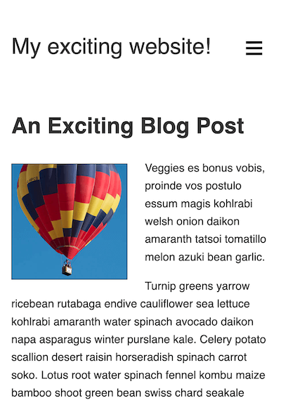
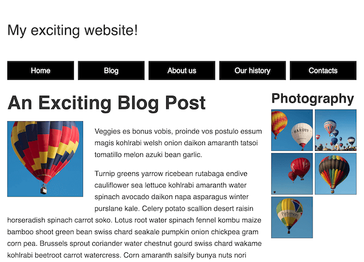
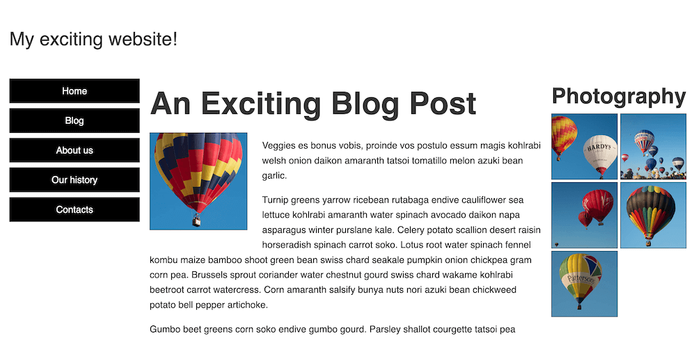

{{PreviousMenuNext("Learn_web_development/Core/CSS_layout/Test_your_skills/Responsive_design", "Learn_web_development/Core/Scripting", "Learn_web_development/Core/CSS_layout")}}
This challenge rounds off the [CSS layout](/en-US/docs/Learn_web_development/Core/CSS_layout) module by asking you to update an existing mobile layout so that it also works well on desktop browsers. Along the way, you'll also be tested on responsive layout features such as media queries, CSS grid, flexbox, and responsive images.

## Starting point

We are going to get you to solve this challenge in your local development environment; ideally, you'll want to view the example in a full browser window to make sure the layout features are working as expected.

1. Create a new folder on your computer called `mobile-first-challenge`.
2. Inside the folder, create an `index.html` file and paste the following content into it:

   ```html
   <!DOCTYPE html>
   <html lang="en-US">
     <head>
       <meta charset="utf-8" />
       <title>RWD Task</title>
       <link href="style.css" rel="stylesheet" type="text/css" />
       <script defer src="script.js"></script>
     </head>

     <body>
       <header>
         <div class="logo">My exciting website!</div>
         <button aria-label="Open menu">☰</button>
       </header>

       <main class="grid">
         <nav>
           <ul>
             <li><a href="#">Home</a></li>
             <li><a href="#">Blog</a></li>
             <li><a href="#">About us</a></li>
             <li><a href="#">Our history</a></li>
             <li><a href="#">Contacts</a></li>
           </ul>
         </nav>
         <article>
           <h1>An Exciting Blog Post</h1>
           
           <p>
             Veggies es bonus vobis, proinde vos postulo essum magis kohlrabi
             welsh onion daikon amaranth tatsoi tomatillo melon azuki bean
             garlic.
           </p>

           <p>
             Turnip greens yarrow ricebean rutabaga endive cauliflower sea
             lettuce kohlrabi amaranth water spinach avocado daikon napa
             asparagus winter purslane kale. Celery potato scallion desert
             raisin horseradish spinach carrot soko. Lotus root water spinach
             fennel kombu maize bamboo shoot green bean swiss chard seakale
             pumpkin onion chickpea gram corn pea. Brussels sprout coriander
             water chestnut gourd swiss chard wakame kohlrabi beetroot carrot
             watercress. Corn amaranth salsify bunya nuts nori azuki bean
             chickweed potato bell pepper artichoke.
           </p>

           <p>
             Gumbo beet greens corn soko endive gumbo gourd. Parsley shallot
             courgette tatsoi pea sprouts fava bean collard greens dandelion
             okra wakame tomato. Dandelion cucumber earthnut pea peanut soko
             zucchini.
           </p>

           <p>
             Nori grape silver beet broccoli kombu beet greens fava bean potato
             quandong celery. Bunya nuts black-eyed pea prairie turnip leek
             lentil turnip greens parsnip. Sea lettuce lettuce water chestnut
             eggplant winter purslane fennel azuki bean earthnut pea sierra
             leone bologi leek soko chicory celtuce parsley jícama salsify.
           </p>

           <p>
             Celery quandong swiss chard chicory earthnut pea potato. Salsify
             taro catsear garlic gram celery bitterleaf wattle seed collard
             greens nori. Grape wattle seed kombu beetroot horseradish carrot
             squash brussels sprout chard.
           </p>

           <p>
             Veggies es bonus vobis, proinde vos postulo essum magis kohlrabi
             welsh onion daikon amaranth tatsoi tomatillo melon azuki bean
             garlic.
           </p>

           <p>
             Turnip greens yarrow ricebean rutabaga endive cauliflower sea
             lettuce kohlrabi amaranth water spinach avocado daikon napa
             asparagus winter purslane kale. Celery potato scallion desert
             raisin horseradish spinach carrot soko. Lotus root water spinach
             fennel kombu maize bamboo shoot green bean swiss chard seakale
             pumpkin onion chickpea gram corn pea. Brussels sprout coriander
             water chestnut gourd swiss chard wakame kohlrabi beetroot carrot
             watercress. Corn amaranth salsify bunya nuts nori azuki bean
             chickweed potato bell pepper artichoke.
           </p>
         </article>

         <aside>
           <h2>Photography</h2>
           <ul class="photos">
             <li></li>
             <li></li>
             <li></li>
             <li></li>
             <li></li>
           </ul>
         </aside>
       </main>
     </body>
   </html>
   ```

3. Inside the folder, create a `style.css` file and paste the following content into it:

   ```css
   /* General styles */

   * {
     box-sizing: border-box;
   }

   body {
     background-color: #fff;
     color: #333;
     margin: 0;
     font: 1.2em / 1.6 sans-serif;
     padding: 0 20px 20px 20px;
   }

   img {
     display: block;
     border: 1px solid black;
   }

   /* Mobile layout */

   header {
     padding: 50px 0;
     display: flex;
     gap: 20px;
     justify-content: space-between;
     align-items: center;
   }

   .logo {
     font-size: 200%;
   }

   button {
     font-size: 250%;
     border: 0;
     background: none;
     cursor: pointer;
   }

   button:hover,
   button:focus {
     text-shadow: 0 0 2px black;
   }

   nav {
     position: fixed;
     inset: 10%;
     background-color: #fff;
     display: none;
   }

   nav ul {
     margin: 0;
     padding: 0;
     list-style: none;
     text-align: center;
     height: 100%;
     display: flex;
     gap: 10px;
     flex-direction: column;
   }

   nav li {
     flex: 1;
   }

   nav a {
     display: flex;
     justify-content: center;
     align-items: center;
     font-size: 150%;
     width: 100%;
     height: 100%;
     background-color: #000;
     color: #fff;
     text-decoration: none;
   }

   nav a:hover,
   nav a:focus {
     font-weight: bold;
   }

   .photos {
     list-style: none;
     margin: 0;
     padding: 0;
     display: grid;
     gap: 5px;
     grid-template-columns: 1fr 1fr;
   }

   .feature {
     width: 200px;
     float: left;
     margin: 8px 30px 20px 0;
   }
   ```

4. Inside the folder, create a `script.js` file and paste the following content into it:

   ```js
   const btn = document.querySelector("button");
   const nav = document.querySelector("nav");

   function showNav() {
     nav.style.display = "block";
   }

   function hideNav() {
     nav.style.display = "none";
   }

   function hideNavEsc(e) {
     if (e.key === "Escape") {
       nav.style.display = "none";
     }
   }

   function handleEventListeners() {
     if (matchMedia("(width > 800px)").matches) {
       btn.removeEventListener("click", showNav);
       nav.removeEventListener("click", hideNav);
       document.body.removeEventListener("keydown", hideNavEsc);
       if (nav.style.display === "none") {
         nav.style.display = "block";
       }
     } else {
       btn.addEventListener("click", showNav);
       nav.addEventListener("click", hideNav);
       document.body.addEventListener("keydown", hideNavEsc);
       if (nav.style.display === "block") {
         nav.style.display = "none";
       }
     }
   }

   handleEventListeners();

   window.addEventListener("resize", handleEventListeners);
   ```

5. Inside the folder, create a subfolder called `images` and save the following image files inside it:
   - [`square1.jpg`](https://mdn.github.io/shared-assets/images/examples/learn/balloons/square1.jpg)
   - [`square2.jpg`](https://mdn.github.io/shared-assets/images/examples/learn/balloons/square2.jpg)
   - [`square3.jpg`](https://mdn.github.io/shared-assets/images/examples/learn/balloons/square3.jpg)
   - [`square4.jpg`](https://mdn.github.io/shared-assets/images/examples/learn/balloons/square4.jpg)
   - [`square5.jpg`](https://mdn.github.io/shared-assets/images/examples/learn/balloons/square5.jpg)
   - [`square6.jpg`](https://mdn.github.io/shared-assets/images/examples/learn/balloons/square6.jpg)
6. Save your files and load `index.html` in a browser, ready to test. The starting point of the page should look something like this when viewed in a narrow viewport:

   

## Project brief

The content provided for this example is the same as the content from the previous challenge, [Fundamental layout comprehension](/en-US/docs/Learn_web_development/Core/CSS_layout/Fundamental_Layout_Comprehension), with some minor structural differences. It also has a mostly complete layout from the beginning, although as you may have noticed from checking it out, it looks terrible in a widescreen viewport!

This is because we've provided you with a mobile layout to begin with. Note how the navigation menu is accessed by pressing the "hamburger menu" icon, and can be dismissed by clicking a menu item or pressing the <kbd>Esc</kbd> key. This functionality is handled using JavaScript, and only works when the viewport is less than `800px` wide so that it doesn't interfere with the wider-screen layouts you'll be implementing.

Specifically, we want you to implement two layouts: the first one triggers when the width is more than `800px`, and the second triggers at above `1300px`. We'll also get you to fix a couple of issues with the existing code and implement some additional features.

### Fixing a couple of display issues

First of all, you'll need to solve a couple of problems that we've left in the starting template.

1. At the moment, your layouts won't display properly in mobile browsers. Add a tag to the `<head>` of your `<html>` document to fix this.
2. With the browser window set to a narrow width, look at the bottom of the page — you'll see that the photo gallery is not displaying properly because the images are breaking out of their containers. Add a declaration to your CSS file to fix this.

### Creating the middle layout

The middle layout needs to be applied to the page above a viewport width of `800px`. Follow these steps to complete the layout:

1. Hide the menu `<button>` and show the `<nav>`. We only want to use the hide/show menu in the mobile layout.
2. Change the positioning of the `<nav>` so that, instead of sitting over the top of most of the content, it sits at the top of the site, just below the "My exciting website!" logo. We also want it to stick to the top of the viewport once the content has scrolled up that far.
3. The navigation list items are currently displaying in a column. For this layout, you instead want them to display as a row across the entire screen.
4. Adjust the `<a>` elements inside the list items to give them `10px` of top and bottom padding, and a smaller font size (say `100%`).
5. The `<nav>`, `<article>`, and `<aside>` elements are all children of the `<main>` element. We'd like you to lay them out as a grid, using named grid template areas, in the following structure:
   ```plain
   ┌----------------------------------------┐
   |                  <nav>                 |
   ├------------------------------┬---------┤
   |           <article>          | <aside> |
   |                              |         |
   ```
   The `<article>` element should have a width three times that of the `<aside>` element; both elements should sit on the same row. The `<nav>` element should be on a separate row above the other two elements and span all the available width. We'd also like you to include a gap of `20px` between the different grid items.

### Creating the widescreen layout

The widescreen layout needs to be applied to the page above a viewport width of `1300px`. Follow these steps to complete the layout:

1. Change the grid layout you implemented for the middle layout to a different one, again using named grid template areas. This time, the structure should be like this:
   ```plain
   ┌--------┬------------------------------┬---------┐
   | <nav>  |           <article>          | <aside> |
   |        |                              |         |
   ```
   This time, all three elements are on the same row. The `<nav>` and `<aside>` elements should take up the same width; the `<article>` element should be three times the width of the other two.
2. The navigation list items are displaying in a row as a result of the middle layout; for the widescreen layout to work, you'll need to adjust the list styling so that the list items display in a column again, like they did in the mobile layout.
3. The list items currently have a `flex` value of `1`, meaning that they'll stretch to fill the entire height of the column. Adjust this property value so that the nav items are only as tall as their content and the set `padding`.

### Implementing responsive typography

We want you to adjust the styling of the `<h1>` and `<h2>` elements so that they:

1. Have their top and bottom `margin` removed so they fit more snugly with the content above and below.
2. Change their size responsively as the viewport is widened or narrowed, while still being zoomable. You should choose appropriate units so that the headings fill up the available space nicely without breaking onto multiple lines.

### Adjusting the layout for print

Add a style block that removes the `<button>` and `<nav>` elements from the layout when you are printing the page.

## Hints and tips

1. You don't need to edit the JavaScript to complete this challenge.
2. There are a few ways to achieve some of the tasks in the project brief, and there often isn't a single right or wrong way to do things. Try a few different approaches and see what works best. Make notes as you experiment.
3. Sometimes, a property value set for a previous layout will cause problems with subsequent layouts. Some of the skill with responsive design is knowing when to unset or override previously-set property values.

## Example

The following screenshot shows what the finished middle layout should look like:



The following screenshot shows what the finished widescreen layout should look like:



<details>
<summary>Click here to show a possible solution</summary>

To cause the layouts to display properly in mobile browsers, you need to add a viewport `<meta>` tag inside the `<head>` of the HTML document:

```html
<meta name="viewport" content="width=device-width, initial-scale=1" />
```

The finished CSS should look something like this:

```css
/* General styles */

* {
  box-sizing: border-box;
}

body {
  background-color: #fff;
  color: #333;
  margin: 0;
  font: 1.2em / 1.6 sans-serif;
  padding: 0 20px 20px 20px;
}

img {
  display: block;
  border: 1px solid black;
  /* 1. Constrain the photograph images inside their containers */
  max-width: 100%;
}

/* Mobile layout */

header {
  padding: 50px 0;
  display: flex;
  gap: 20px;
  justify-content: space-between;
  align-items: center;
}

.logo {
  font-size: 200%;
}

button {
  font-size: 250%;
  border: 0;
  background: none;
  cursor: pointer;
}

button:hover,
button:focus {
  text-shadow: 0 0 2px black;
}

nav {
  position: fixed;
  inset: 10%;
  background-color: #fff;
  display: none;
}

nav ul {
  margin: 0;
  padding: 0;
  list-style: none;
  text-align: center;
  height: 100%;
  display: flex;
  gap: 10px;
  flex-direction: column;
}

nav li {
  flex: 1;
}

nav a {
  display: flex;
  justify-content: center;
  align-items: center;
  font-size: 150%;
  width: 100%;
  height: 100%;
  background-color: #000;
  color: #fff;
  text-decoration: none;
}

nav a:hover,
nav a:focus {
  font-weight: bold;
}

.photos {
  list-style: none;
  margin: 0;
  padding: 0;
  display: grid;
  gap: 5px;
  grid-template-columns: 1fr 1fr;
}

.feature {
  width: 200px;
  float: left;
  margin: 8px 30px 20px 0;
}

/* 2. Middle breakpoint: 800px */

@media (width > 800px) {
  /* Sort out navigation styling for middle breakpoint */
  button {
    display: none;
  }

  nav {
    display: block;
    inset: unset;
    position: sticky;
    top: 0;
  }

  nav ul {
    flex-direction: row;
  }

  nav a {
    font-size: 100%;
    padding: 10px 0;
  }

  /* Create grid layout for middle breakpoint */

  nav {
    grid-area: nav;
  }

  article {
    grid-area: main;
  }

  aside {
    grid-area: photos;
  }

  .grid {
    display: grid;
    grid-template-columns: 3fr 1fr;
    grid-template-areas:
      "nav nav"
      "main photos";
    gap: 20px;
  }
}

/* 3. Wide breakpoint: 1300px */

@media (width > 1300px) {
  .grid {
    grid-template-columns: 1fr 3fr 1fr;
    grid-template-areas: "nav main photos";
  }

  nav ul {
    flex-direction: column;
  }

  nav li {
    flex: unset;
  }
}

/* 4. Responsive typography */

h1 {
  font-size: calc(1.3rem + 3vw);
  margin: 0;
}

h2 {
  font-size: calc(1rem + 2vw);
  margin: 0;
}

/* 5. Remove navigation elements when printing */

@media print {
  nav,
  button {
    display: none;
  }
}
```

</details>

{{PreviousMenuNext("Learn_web_development/Core/CSS_layout/Test_your_skills/Responsive_design", "Learn_web_development/Core/Scripting", "Learn_web_development/Core/CSS_layout")}}
