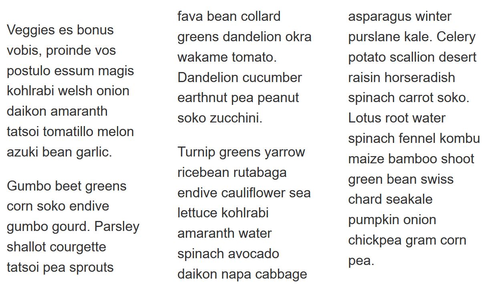
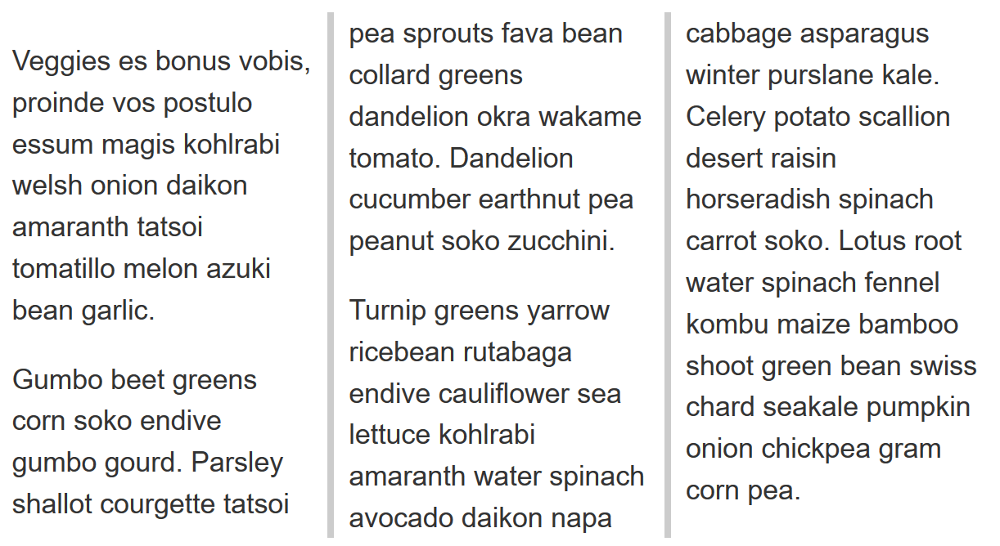
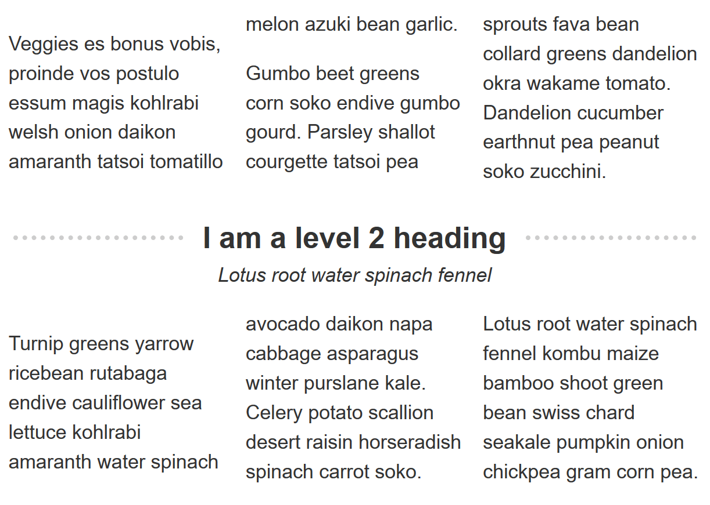

{{LearnSidebar}}

The aim of this skill test is to assess whether you understand [CSS multiple-column layout](/en-US/docs/Learn_web_development/Core/CSS_layout/Multiple-column_Layout), including the {{CSSxRef("column-count")}}, {{CSSxRef("column-width")}}, {{CSSxRef("column-gap")}}, {{CSSxRef("column-span")}} and {{CSSxRef("column-rule")}} properties and values. You will be working through three small tasks that use different elements of the material you have just covered.

> [!NOTE]
> Click **"Play"** in the code blocks below to edit the examples in the MDN Playground.
> You can also copy the code (click the clipboard icon) and paste it into an online editor such as [CodePen](https://codepen.io/), [JSFiddle](https://jsfiddle.net/), or [Glitch](https://glitch.com/).
> If you get stuck, you can reach out to us in one of our [communication channels](/en-US/docs/MDN/Community/Communication_channels).

## Task 1

In this task, we want you to create three columns, with a 50px gap between each column.

Your final result should look like the image below:



Try updating the live code below to recreate the finished example:

```html live-sample___multicol1
<div class="container">
  <p>
    Veggies es bonus vobis, proinde vos postulo essum magis kohlrabi welsh onion
    daikon amaranth tatsoi tomatillo melon azuki bean garlic.
  </p>

  <p>
    Gumbo beet greens corn soko endive gumbo gourd. Parsley shallot courgette
    tatsoi pea sprouts fava bean collard greens dandelion okra wakame tomato.
    Dandelion cucumber earthnut pea peanut soko zucchini.
  </p>

  <p>
    Turnip greens yarrow ricebean rutabaga endive cauliflower sea lettuce
    kohlrabi amaranth water spinach avocado daikon napa cabbage asparagus winter
    purslane kale. Celery potato scallion desert raisin horseradish spinach
    carrot soko. Lotus root water spinach fennel kombu maize bamboo shoot green
    bean swiss chard seakale pumpkin onion chickpea gram corn pea.
  </p>
</div>
```

```css live-sample___multicol1
body {
  font: 1.2em / 1.5 sans-serif;
}
.container {
}
```

{{EmbedLiveSample("multicol1", "", "300px")}}

<details>
<summary>Click here to show the solution</summary>

For this task, you need to use `column-count` and `column-gap`:

```css
.container {
  column-count: 3;
  column-gap: 50px;
}
```

</details>

## Task 2

In this task, we want you to create columns which have a minimum width of 200px. Then, add a 5px grey rule between each column, ensuring there is 10px of space between the edge of the rule and the column content.

Your final result should look like the image below:



Try updating the live code below to recreate the finished example:

```html live-sample___multicol2
<div class="container">
  <p>
    Veggies es bonus vobis, proinde vos postulo essum magis kohlrabi welsh onion
    daikon amaranth tatsoi tomatillo melon azuki bean garlic.
  </p>

  <p>
    Gumbo beet greens corn soko endive gumbo gourd. Parsley shallot courgette
    tatsoi pea sprouts fava bean collard greens dandelion okra wakame tomato.
    Dandelion cucumber earthnut pea peanut soko zucchini.
  </p>

  <p>
    Turnip greens yarrow ricebean rutabaga endive cauliflower sea lettuce
    kohlrabi amaranth water spinach avocado daikon napa cabbage asparagus winter
    purslane kale. Celery potato scallion desert raisin horseradish spinach
    carrot soko. Lotus root water spinach fennel kombu maize bamboo shoot green
    bean swiss chard seakale pumpkin onion chickpea gram corn pea.
  </p>
</div>
```

```css live-sample___multicol2
body {
  font: 1.2em / 1.5 sans-serif;
}
.container {
}
```

{{EmbedLiveSample("multicol2", "", "300px")}}

<details>
<summary>Click here to show the solution</summary>

You will need to use the `column-width` and `column-rule` properties.
You could use the longhand `column-rule-*` properties instead of the shorthand, though there is no benefit to doing so.
The key thing with the use of `column-gap` is that you have understood that the rule does not add 5px of space to the gap. To have 10px either side of the rule they need a 25px gap as the rule is laid over it.

```css
.container {
  column-width: 200px;
  column-rule: 5px solid #ccc;
  column-gap: 25px;
}
```

</details>

## Task 3

In this task, we want you to cause the element containing the heading and subheading to span across all columns so it looks like the image below:



Try updating the live code below to recreate the finished example:

```html live-sample___multicol3
<div class="container">
  <p>
    Veggies es bonus vobis, proinde vos postulo essum magis kohlrabi welsh onion
    daikon amaranth tatsoi tomatillo melon azuki bean garlic.
  </p>
  <p>
    Gumbo beet greens corn soko endive gumbo gourd. Parsley shallot courgette
    tatsoi pea sprouts fava bean collard greens dandelion okra wakame tomato.
    Dandelion cucumber earthnut pea peanut soko zucchini.
  </p>
  <div class="box">
    <h2>I am a level 2 heading</h2>
    <div class="subhead">Lotus root water spinach fennel</div>
  </div>
  <p>
    Turnip greens yarrow ricebean rutabaga endive cauliflower sea lettuce
    kohlrabi amaranth water spinach avocado daikon napa cabbage asparagus winter
    purslane kale. Celery potato scallion desert raisin horseradish spinach
    carrot soko. Lotus root water spinach fennel kombu maize bamboo shoot green
    bean swiss chard seakale pumpkin onion chickpea gram corn pea.
  </p>
</div>
```

```css hidden live-sample___multicol3
body {
  font: 1.2em / 1.5 sans-serif;
}
* {
  box-sizing: border-box;
}

.box {
  text-align: center;
  margin: 1em 0;
}

.box h2 {
  margin: 0;
  display: grid;
  grid-template-columns: 1fr auto 1fr;
  column-gap: 0.5em;
  align-items: center;
}

.box h2::before {
  content: "";
  border-bottom: 5px dotted #ccc;
}

.box h2::after {
  content: "";
  border-bottom: 5px dotted #ccc;
}

.subhead {
  font-style: italic;
}
```

```css live-sample___multicol3
.container {
  column-count: 3;
}

.box {
}

h2 {
}
```

{{EmbedLiveSample("multicol3", "", "400px")}}

<details>
<summary>Click here to show the solution</summary>

In this task, we test for understanding of the `column-span` property.
All you need to do is set the element with a class of `.box` to `column-span: all`.
This is mostly a task of checking that you select the right element.

```css
.box {
  column-span: all;
}
```

</details>

## See also

- [CSS styling basics](/en-US/docs/Learn_web_development/Core/Styling_basics)
