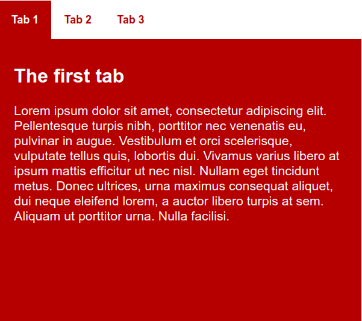
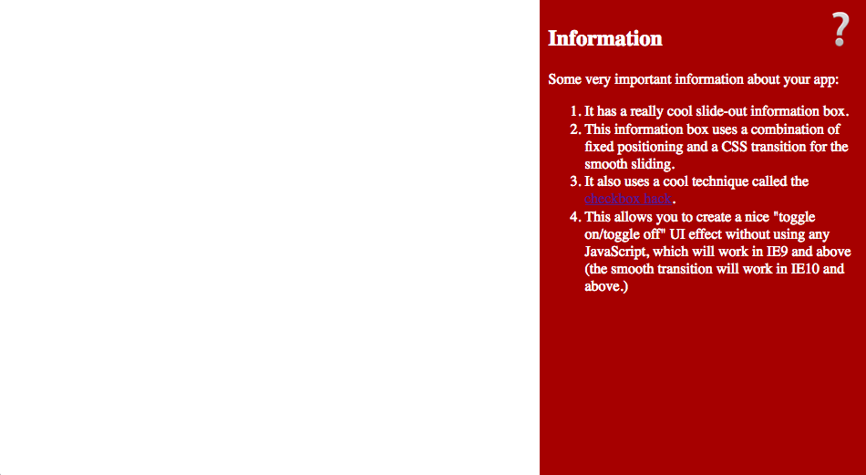

{{LearnSidebar}}

This article shows how to build some real-world examples to illustrate what kinds of things you can do with positioning.

<table>
  <tbody>
    <tr>
      <th scope="row">Prerequisites:</th>
      <td>
        HTML basics (study
        <a href="/en-US/docs/Learn_web_development/Core/Structuring_content"
          >Structuring content with HTML</a
        >), and an idea of How CSS works (study
        <a href="/en-US/docs/Learn_web_development/Core/Styling_basics">CSS Styling basics</a>.)
      </td>
    </tr>
    <tr>
      <th scope="row">Objective:</th>
      <td>To get an idea of the practicalities of positioning</td>
    </tr>
  </tbody>
</table>

## A tabbed info-box

The first example we'll look at is a classic tabbed info box — a very common feature used when you want to pack a lot of information into a small area. This includes information-heavy apps like strategy/war games, mobile versions of websites where the screen is narrow and space is limited, and compact information boxes where you might want to make lots of information available without having it fill the whole UI. Our simple example will look like this once we are finished:



> [!NOTE]
> You can see the finished example running live at [tabbed-info-box.html](https://mdn.github.io/learning-area/css/css-layout/practical-positioning-examples/tabbed-info-box.html) ([source code](https://github.com/mdn/learning-area/blob/main/css/css-layout/practical-positioning-examples/tabbed-info-box.html)). Check it out to get an idea of what you will be building in this section of the article.

You might be thinking "Why not just create the separate tabs as separate webpages, and just have the tabs clicking through to the separate pages to create the effect?" This code would be simpler, yes, but then each separate "page" view would actually be a newly-loaded webpage, which would make it harder to save information across views, and integrate this feature into a larger UI design.

To start with, we'd like you to make a local copy of the starting files — [tabbed-info-box-start.html](https://github.com/mdn/learning-area/blob/main/css/css-layout/practical-positioning-examples/tabbed-info-box-start.html) and [tabs-manual.js](https://github.com/mdn/learning-area/blob/main/css/css-layout/practical-positioning-examples/tabs-manual.js). Save these somewhere sensible on your local computer, and open `tabbed-info-box-start.html` in your text editor. Let's look at the HTML contained within the body:

```html
<section class="info-box">
  <div role="tablist" class="manual">
    <button
      id="tab-1"
      type="button"
      role="tab"
      aria-selected="true"
      aria-controls="tabpanel-1">
      <span>Tab 1</span>
    </button>

    <button
      id="tab-2"
      type="button"
      role="tab"
      aria-selected="false"
      aria-controls="tabpanel-2">
      <span>Tab 2</span>
    </button>
    <button
      id="tab-3"
      type="button"
      role="tab"
      aria-selected="false"
      aria-controls="tabpanel-3">
      <span>Tab 3</span>
    </button>
  </div>

  <div class="panels">
    <article id="tabpanel-1" role="tabpanel" aria-labelledby="tab-1">
      <h2>The first tab</h2>
      <p>
        Lorem ipsum dolor sit amet, consectetur adipiscing elit. Pellentesque
        turpis nibh, porttitor nec venenatis eu, pulvinar in augue. Vestibulum
        et orci scelerisque, vulputate tellus quis, lobortis dui. Vivamus varius
        libero at ipsum mattis efficitur ut nec nisl. Nullam eget tincidunt
        metus. Donec ultrices, urna maximus consequat aliquet, dui neque
        eleifend lorem, a auctor libero turpis at sem. Aliquam ut porttitor
        urna. Nulla facilisi.
      </p>
    </article>

    <article id="tabpanel-2" role="tabpanel" aria-labelledby="tab-2">
      <h2>The second tab</h2>
      <p>
        This tab hasn't got any Lorem Ipsum in it. But the content isn't very
        exciting all the same.
      </p>
    </article>

    <article id="tabpanel-3" role="tabpanel" aria-labelledby="tab-3">
      <h2>The third tab</h2>
      <p>
        Lorem ipsum dolor sit amet, consectetur adipiscing elit. Pellentesque
        turpis nibh, porttitor nec venenatis eu, pulvinar in augue. And now an
        ordered list: how exciting!
      </p>
      <ol>
        <li>dui neque eleifend lorem, a auctor libero turpis at sem.</li>
        <li>Aliquam ut porttitor urna.</li>
        <li>Nulla facilisi</li>
      </ol>
    </article>
  </div>
</section>
```

So here we've got a {{htmlelement("section")}} element with a `class` of `info-box`, which contains two {{htmlelement("div")}}s. The first div contains three buttons, which will become the actual tabs to click on for displaying our content panels. The second div contains three {{htmlelement("article")}} elements, which will make up the content panels that correspond to each tab. Each panel contains some sample content.

The idea here is that we will style the tabs to look like a standard horizontal navigation menu and style the panels to sit on top of one another using absolute positioning. We'll also give you a bit of JavaScript to include on your page to display the corresponding panel when a tab is pressed, and style the tab itself. You won't need to understand the JavaScript code itself at this stage, but you should think about learning some basic [JavaScript](/en-US/docs/Learn_web_development/Getting_started/Your_first_website/Adding_interactivity) as soon as possible — the more complex your UI features become, the more likely it is that you'll need some JavaScript to implement your desired functionality.

### General setup

To begin with, add the following between your opening and closing {{HTMLElement("style")}} tags:

```css
html {
  font-family: sans-serif;
}

* {
  box-sizing: border-box;
}

body {
  margin: 0;
}
```

This is just some general setup to set a sans-serif font on our page, use the `border-box` {{cssxref("box-sizing")}} model, and get rid of the default {{htmlelement("body")}} margin.

Next, add the following just below your previous CSS:

```css
.info-box {
  width: 452px;
  height: 400px;
  margin: 1.25rem auto 0;
}
```

This sets a specific width and height on the content and centers it on the screen using the old `margin: 1.25rem auto 0`. Previously in the course, we advised against setting a fixed height on content containers if at all possible; it is OK in this circumstance because we have fixed content in our tabs.

### Styling our tabs

Now we want to style tabs to look like tabs — basically, these are a horizontal navigation menu, but instead of loading different web pages when they are clicked on like we've seen previously in the course, they cause different panels to be displayed on the same page. First, add the following rule at the bottom of your CSS to make the `tablist` a {{cssxref("flex")}} container and have it span 100% width:

```css
.info-box [role="tablist"] {
  min-width: 100%;
  display: flex;
}
```

> [!NOTE]
> We are using descendant selectors with `.info-box` at the start of the chain throughout this example — this is so that we can insert this feature into a page with other content already on it, without fear of interfering with the styles applied to other parts of the page.

Next, we'll style the buttons to look like tabs. Add the following CSS:

```css
.info-box [role="tab"] {
  padding: 0 1rem 0 1rem;
  line-height: 3rem;
  background: white;
  color: #b60000;
  font-weight: bold;
  border: none;
  outline: none;
}
```

Next, we'll set the `:focus` and `:hover` states of the tabs to look different when they are focused/hovered, providing users with some visual feedback.

```css
.info-box [role="tab"]:focus span,
.info-box [role="tab"]:hover span {
  outline: 1px solid blue;
  outline-offset: 6px;
  border-radius: 4px;
}
```

Then we'll set a rule that highlights one of the tabs when [`aria-selected`](/en-US/docs/Web/Accessibility/ARIA/Attributes/aria-selected) property is set to `true` on it. We will set this using JavaScript when a tab is clicked on. Place the following CSS below your other styles:

```css
.info-box [role="tab"][aria-selected="true"] {
  background-color: #b60000;
  color: white;
}
```

### Styling the panels

The next job is to style our panels. Let's get going!

First, of all, add the following rule to style the `.panels` {{htmlelement("div")}} container. Here we set a fixed {{cssxref("height")}} to make sure the panels fit snugly inside the info-box, {{cssxref("position")}} `relative` to set the {{htmlelement("div")}} as the positioning context, so you can then place positioned child elements relative to it and not the initial viewport, and finally we {{cssxref("clear")}} the float set in the CSS above so that it doesn't interfere with the remainder of the layout.

```css
.info-box .panels {
  height: 352px;
  clear: both;
  position: relative;
}
```

Finally for this section, we will style the individual {{htmlelement("article")}} elements that comprise our panels. The first rule we'll add will absolutely {{cssxref("position")}} the panels, and make them all sit flush to the {{cssxref("top")}} and {{cssxref("left")}} of their {{htmlelement("div")}} container — this part is key to this whole layout feature, as it makes the panels sit on top of one another. The rule also gives the panels the same set height as the container, and gives the content some padding, a text {{cssxref("color")}}, and a {{cssxref("background-color")}}.

```css
.info-box [role="tabpanel"] {
  background-color: #b60000;
  color: white;
  position: absolute;
  padding: 0.8rem 1.2rem;
  height: 352px;
  top: 0;
  left: 0;
}
```

The second rule we'll add here makes it so that a panel with a class of `is-hidden` set on it will be hidden. Again, we'll add/remove this class using JavaScript at the appropriate time. When a tab is selected the corresponding panel will have its `is-hidden` class removed and all other panels will have `is-hidden` class set, thus only one panel will be visible at a time.

```css
.info-box [role="tabpanel"].is-hidden {
  display: none;
}
```

### JavaScript

The final part that makes this feature work is the JavaScript code. The `tabs-manual.js` file has been included using the [`<script>`](/en-US/docs/Web/HTML/Element/script) tag:

```html
<script src="tabs-manual.js"></script>
```

This code does the following:

- On [window load event](/en-US/docs/Web/API/Window/load_event) it initializes `TabsManual` [class](/en-US/docs/Learn_web_development/Extensions/Advanced_JavaScript_objects/Classes_in_JavaScript) for all the `tablist` elements.
- When a `TabsManual` object is created, in the constructor all the tab and panel references are collected in `tabs` and `tabpanels` variables, so we can easily do things to them later on.
- The constructor also registers [`click`](/en-US/docs/Web/API/Element/click_event) and [`keydown`](/en-US/docs/Web/API/Element/keydown_event) event handlers on all the tabs. The event handlers include logic about what should happen when a tab is selected using a click or keypress.
- In the `setSelectedTab(currentTab)` function, the following occurs:

  - A `for` loop is used to cycle through all the tabs and deselect them by setting `aria-selected` property to `false` and by setting `is-hidden` class on corresponding panels.
  - On the selected tab (`currentTab`) the `aria-selected` is set to `true` and `is-hidden` class is removed from the corresponding panel.

- The code also has logic to support keyboard navigation using `Left arrow`, `Right arrow`, `Home`, and `End` keys.

## A fixed position tabbed info-box

In our second example, we will take our first example — our info-box — and add it into the context of a full web page. But not only that — we'll give it a fixed position so that it stays in the same position in the browser window. When the main content scrolls, the info-box will stay in the same position on the screen. Our finished example will look like this:

![Info-box is a container with 3 tabs with the first tab selected and only the contents of the first tab are displayed. It is given a fixed position. The info-box is positioned at the top left corner of the window with a width of 452 pixels. A container of fake content occupies the rest right half of the window; the fake content container is taller than the window and is scrollable. When the page is scrolled, the right-hand side container moves while the info-box stays fixed in the same position on the screen. ](fixed-info-box.png)

> [!NOTE]
> You can see the finished example running live at [fixed-info-box.html](https://mdn.github.io/learning-area/css/css-layout/practical-positioning-examples/fixed-info-box.html) ([source code](https://github.com/mdn/learning-area/blob/main/css/css-layout/practical-positioning-examples/fixed-info-box.html)). Check it out to get an idea of what you will be building in this section of the article.

As a starting point, you can use your completed example from the first section of the article, or make a local copy of [tabbed-info-box.html](https://github.com/mdn/learning-area/blob/main/css/css-layout/practical-positioning-examples/tabbed-info-box.html) from our GitHub repo.

### HTML additions

First of all, we need some additional HTML to represent the webpage's main content. Add the following {{htmlelement("section")}} just below your opening {{htmlelement("body")}} tag, just before the existing section:

```html
<section class="fake-content">
  <h1>Fake content</h1>
  <p>
    This is fake content. Your main web page contents would probably go here.
  </p>
  <p>
    This is fake content. Your main web page contents would probably go here.
  </p>
  <p>
    This is fake content. Your main web page contents would probably go here.
  </p>
  <p>
    This is fake content. Your main web page contents would probably go here.
  </p>
  <p>
    This is fake content. Your main web page contents would probably go here.
  </p>
  <p>
    This is fake content. Your main web page contents would probably go here.
  </p>
  <p>
    This is fake content. Your main web page contents would probably go here.
  </p>
  <p>
    This is fake content. Your main web page contents would probably go here.
  </p>
</section>
```

> [!NOTE]
> You can feel free to change the fake content for some real content if you like.

### Changes to the existing CSS

Next we need to make some small changes to the existing CSS, to get the info-box placed and positioned. Change your `.info-box` rule to get rid of `margin: 0 auto;` (we no longer want the info-box centered), add {{cssxref("position", "position: fixed;")}}, and stick it to the {{cssxref("top")}} of the browser viewport.

It should now look like this:

```css
.info-box {
  width: 452px;
  height: 400px;
  margin: 0 auto;
  position: fixed;
  top: 0;
}
```

### Styling the main content

The only thing left for this example is to provide the main content with some styling. Add the following rule underneath the rest of your CSS:

```css
.fake-content {
  background-color: #a60000;
  color: white;
  padding: 10px;
  height: 2000px;
  margin-left: 470px;
}

.fake-content p {
  margin-bottom: 200px;
}
```

To start with, we give the content the same {{cssxref("background-color")}}, {{cssxref("color")}}, and {{cssxref("padding")}} as the info-box panels. We then give it a large {{cssxref("margin-left")}} to move it over to the right, making space for the info-box to sit in, so it is not overlapping anything else.

This marks the end of the second example; we hope you'll find the third just as interesting.

## A sliding hidden panel

The final example we'll present here is a panel that slides on and off the screen at the press of an icon — as mentioned earlier, this is popular for situations like mobile layouts, where the available screen space is small, so you don't want to use up most of it by showing a menu or info panel instead of the useful content.

Our finished example will look like this:



> [!NOTE]
> You can see the finished example running live at [hidden-info-panel.html](https://mdn.github.io/learning-area/css/css-layout/practical-positioning-examples/hidden-info-panel.html) ([source code](https://github.com/mdn/learning-area/blob/main/css/css-layout/practical-positioning-examples/hidden-info-panel.html)). Check it out to get an idea of what you will be building in this section of the article.

As a starting point, make a local copy of [hidden-info-panel-start.html](https://github.com/mdn/learning-area/blob/main/css/css-layout/practical-positioning-examples/hidden-info-panel-start.html) from our GitHub repo. This doesn't follow on from the previous example, so a fresh start file is required. Let's have a look at the HTML in the file:

```html-nolint
<button
  type="button"
  id="menu-button"
  aria-haspopup="true"
  aria-controls="info-panel"
  aria-expanded="false">
      ❔
</button>

<aside id="info-panel" aria-labelledby="menu-button">
  …
</aside>
```

To start with here we've got a {{htmlelement("button")}} element with a special question mark character as the button text. The button will be pressed to show/hide the [`aside`](/en-US/docs/Web/HTML/Element/aside) info panel. In the below sections we'll explain how this all works.

### Styling the button

First let's deal with the button — add the following CSS in between your {{htmlelement("style")}} tags:

```css
#menu-button {
  position: absolute;
  top: 0.5rem;
  right: 0.5rem;
  z-index: 1;

  font-size: 3rem;
  cursor: pointer;
  border: none;
  background-color: transparent;
}
```

The first rule styles the `<button>`; here we've:

- Set a large {{cssxref("font-size")}} to make the icon nice and big.
- Remove the border and make the background transparent so that instead of the button only the `?` icon will show.
- Set {{cssxref("position")}} `absolute` on it, and used {{cssxref("top")}} and {{cssxref("right")}} to position it nicely in the top-right corner.
- Set a {{cssxref("z-index")}} of 1 on it — this is so that when the info panel is styled and shown, it doesn't cover up the icon; instead the icon will sit on top of it so it can be pressed again to hide the info pane.
- Used the {{cssxref("cursor")}} property to change the mouse cursor when it is hovering over the icon to a hand pointer (like the one you see when links are hovered over), as an extra visual clue to users that the icon does something interesting.

### Styling the panel

Now it's time to style the actual sliding panel itself. Add the following rule to the bottom of your CSS:

```css
#info-panel {
  background-color: #a60000;
  color: white;

  width: 340px;
  height: 100%;
  padding: 0 20px;

  position: fixed;
  top: 0;
  right: -370px;

  transition: 0.6s right ease-out;
}
```

A lot going on here — let's discuss it bit by bit:

- First, we set some simple {{cssxref("background-color")}} and {{cssxref("color")}} on the info box.
- Next, we set a fixed {{cssxref("width")}} on the panel, and make its {{cssxref("height")}} the entire height of the browser viewport.
- We also include some horizontal {{cssxref("padding")}} to space it out a bit.
- Next we set {{cssxref("position", "position: fixed;")}} on the panel so it will always appear in the same place, even if the page has content to scroll. We glue it to the {{cssxref("top")}} of the viewport, and set it so that by default it is offscreen to the {{cssxref("right")}}.
- Finally, we set a {{cssxref("transition")}} on the element. Transition is an interesting feature that allows you to make changes between states happen smoothly, rather than just going "on" or "off" abruptly. In this case, we intend to make the panel slide smoothly onscreen when the checkbox is checked. (Or to put it another way, when the question mark icon is clicked.)

### Setting the checked state

There is one final bit of CSS to add — put the following at the bottom of your CSS:

```css
#info-panel.open {
  right: 0px;
}
```

The rule states that when the info-panel has `.open` class set on it, set the {{cssxref("right")}} property of the `<aside>` to `0px`, which causes the panel to appear on the screen again (smoothly due to the transition). Removing the `.open` class hides the panel again.

To add/remove the `.open` class from the info-panel with a click of the button we need to use some JavaScript. Add the following code in between {{htmlelement("script")}} tags:

```js
const button = document.querySelector("#menu-button");
const panel = document.querySelector("#info-panel");

button.addEventListener("click", () => {
  panel.classList.toggle("open");
  button.setAttribute("aria-expanded", panel.classList.contains("open"));
});
```

The code adds a click event handler to the button. The click handler toggles the `open` class on the info-box panel which slides the panel in or out of the view.
The event handler also sets [`aria-expanded`](/en-US/docs/Web/Accessibility/ARIA/Attributes/aria-expanded) property on the button to improve accessibility.

So there you have it — the easiest way to create a toggling info panel effect.

## Summary

So that rounds off our look at positioning — by now, you should have an idea of how the basic mechanics work, as well as understanding how to start applying these to build some interesting UI features. Don't worry if you didn't get this all immediately — positioning is a fairly advanced topic, and you can always work through the articles again to aid your understanding.
