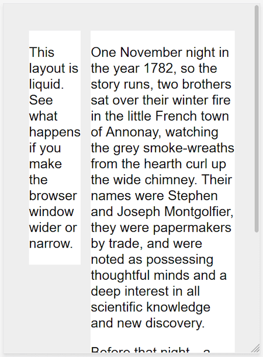

{{learnsidebar}}

{{PreviousMenuNext("Learn_web_development/Core/CSS_layout/Grids", "Learn_web_development/Core/CSS_layout/Media_queries", "Learn_web_development/Core/CSS_layout")}}

_Responsive web design_ (RWD) is a web design approach to make web pages render well on all screen sizes and resolutions while ensuring good usability. It is the way to design for a multi-device web. In this article, we'll help you understand some techniques that can be used to master it.

<table>
  <tbody>
    <tr>
      <th scope="row">Prerequisites:</th>
      <td>
        <a href="/en-US/docs/Learn_web_development/Core/Structuring_content"
          >Structuring content with HTML</a
        >,
        <a href="/en-US/docs/Learn_web_development/Core/Styling_basics">CSS Styling basics</a>,
        <a href="/en-US/docs/Learn_web_development/Core/Text_styling/Fundamentals">Fundamental text and font styling</a>,
        familiarity with <a href="/en-US/docs/Learn_web_development/Core/CSS_layout/Introduction">CSS layout fundamental concepts</a>.
      </td>
    </tr>
    <tr>
      <th scope="row">Learning outcomes:</th>
      <td>
        <ul>
          <li>What responsive design is — designing web layouts so that they are flexible and work well across different device screen sizes, resolutions, etc.</li>
          <li>The relationship between modern layout tools such as grid and flexbox, and responsive design.</li>
          <li>The concepts behind using media queries for responsive design, including mobile-first and breakpoints.</li>
          <li>Why <code>&lt;meta viewport=""&gt;</code> is needed to get web documents to display appropriately on mobile devices.</li>
        </ul>
      </td>
    </tr>
  </tbody>
</table>

## Precursor to responsive design: mobile web design

Before responsive web design became the standard approach for making websites work across different device types, web developers used to talk about mobile web design, mobile web development, or sometimes, mobile-friendly design. These are basically the same as responsive web design — the goals are to make sure that websites work well across devices with different physical attributes (screen size, resolution) in terms of layout, content (text and media), and performance.

The difference is mainly to do with the devices involved, and the technologies available to create solutions:

- We used to talk about desktop or mobile, but now there are many different types of device available such as desktop, laptop, mobile, tablets, watches, etc. Instead of catering for a few different screen sizes, we now need to design sites defensively to cater for common screen sizes and resolutions, plus unknowns.
- Mobile devices used to be low-powered in terms of CPU/GPU and available bandwidth. Some didn't support CSS or even HTML, and as a result, it was common to perform server-side browser sniffing to determine device/browser type before then serving a site that the device would be able to cope with. Mobile devices often had really simple, basic experiences served to them because it was all they could handle. These days, mobile devices are able to handle the same technologies as desktop computers, so such techniques are less common.
  - You should still use the techniques discussed in this article to serve mobile users a suitable experience, as there are still constraints such as battery life and bandwidth to worry about.
  - User experience is also a concern. A mobile user of a travel site might just want to check flight times and delay information, for example, and not be presented with a 3D animated globe showing flight paths and your company history. This can be handled using responsive design techniques, however.
- Modern technologies are much better for creating responsive experiences. For example, [responsive images/media technologies](#responsive_imagesmedia) now allow appropriate media to be served to different devices without having to rely on techniques like server-side sniffing.

## Introducing responsive web design

HTML is fundamentally responsive, or _fluid_. If you create a web page containing only HTML, with no CSS, and resize the window, the browser will automatically reflow the text to fit the viewport.

While the default responsive behavior may sound like no solution is needed, long lines of text displayed full screen on a wide monitor can be difficult to read. If wide screen line length is reduced with CSS, such as by creating columns or adding significant padding, the site may look squashed for the user who narrows their browser window or opens the site on a mobile device.



Creating a non-resizable web page by setting a fixed width doesn't work either; that leads to scroll bars on narrow devices and too much empty space on wide screens.

Responsive web design, or RWD, is a design approach that addresses the range of devices and device sizes, enabling automatic adaption to the screen, whether the content is viewed on a tablet, phone, television, or watch.

Responsive web design isn't a separate technology — it is an approach. It is a term used to describe a set of best practices used to create a layout that can _respond_ to any device being used to view the content.

The term _responsive design_, [coined by Ethan Marcotte in 2010](https://alistapart.com/article/responsive-web-design/), described using fluid grids, fluid images, and media queries to create responsive content.

At the time, the recommendation was to use CSS `float` for layout and media queries to query the browser width, creating layouts for different breakpoints. Fluid images are set to not exceed the width of their container; they have their `max-width` property set to `100%`. Fluid images scale down when their containing column narrows but do not grow larger than their intrinsic size when the column grows. This enables an image to scale down to fit its content, rather than overflow it, but not grow larger and become pixelated if the container becomes wider than the image.

Modern CSS layout methods are inherently responsive, and, since the publication of Marcotte's article, we have a multitude of features built into the web platform to make designing responsive sites easier.

The rest of this article will point you to the various web platform features you might want to use when creating a responsive site.

## Media Queries

[Media queries](/en-US/docs/Web/CSS/CSS_media_queries/Using_media_queries) allow us to run a series of tests (for example, whether the user's screen is greater than a certain width or resolution) and apply CSS selectively to style the page appropriately for the user's needs.

For example, the following media query tests to see if the current web page is being displayed as screen media (therefore not a printed document) and the viewport is at least `80rem` wide. The CSS for the `.container` selector will only be applied if these two things are true.

```css
@media screen and (min-width: 80rem) {
  .container {
    margin: 1em 2em;
  }
}
```

You can add multiple media queries within a stylesheet, tweaking your whole layout or parts of it to best suit the various screen sizes. The points at which a media query is introduced, and the layout changed, are known as _breakpoints_.

A common approach when using media queries is to create a simple single-column layout for narrow-screen devices (for example, mobile phones), then check for wider screens and implement a multiple-column layout when you know that you have enough screen width to handle it. Designing for mobile first is known as **mobile first** design.

If using breakpoints, best practices encourage defining media query breakpoints with [relative units](/en-US/docs/Learn_web_development/Core/Styling_basics/Values_and_units#relative_length_units) rather than absolute sizes of an individual device.

There are different approaches to the styles defined within a media query block; ranging from using media queries to {{htmlelement("link")}} style sheets based on browser size ranges to only including custom properties variables to store values associated with each breakpoint.

Media queries can help with RWD, but are not a requirement. Flexible grids, relative units, and minimum and maximum unit values can be used without media queries.

## Responsive layout technologies

Responsive sites are built on flexible grids, meaning you don't need to target every possible device size with pixel perfect layouts.

By using a flexible grid, you can change a feature or add in a breakpoint and change the design at the point where the content starts to look bad. For example, to ensure line lengths don't become unreadably long as the screen size increases you can use {{cssxref('columns')}}; if a box becomes squashed with two words on each line as it narrows you can set a breakpoint.

Several layout methods — including [Flexbox](/en-US/docs/Learn_web_development/Core/CSS_layout/Flexbox), and [CSS Grid](/en-US/docs/Learn_web_development/Core/CSS_layout/Grids) — are responsive by default. They all assume that you are trying to create a flexible grid and give you easier ways to do so.

### Flexbox

In flexbox, flex items shrink or grow, distributing space between the items according to the space in their container. By changing the values for `flex-grow` and `flex-shrink` you can indicate how you want the items to behave when they encounter more or less space around them.

In the example below the flex items will each take an equal amount of space in the flex container, using the shorthand of `flex: 1` as previously discussed (see [Flexbox: Flexible sizing of flex items](/en-US/docs/Learn_web_development/Core/CSS_layout/Flexbox#flexible_sizing_of_flex_items)).

```css
.container {
  display: flex;
}

.item {
  flex: 1;
}
```

Here's how we could use flexbox with a media query for responsive design.

```html live-sample___flex-based-rwd
<div class="wrapper">
  <div class="col1">
    <p>
      This layout is responsive. See what happens if you make the browser window
      wider or narrow.
    </p>
  </div>
  <div class="col2">
    <p>
      One November night in the year 1782, so the story runs, two brothers sat
      over their winter fire in the little French town of Annonay, watching the
      grey smoke-wreaths from the hearth curl up the wide chimney. Their names
      were Stephen and Joseph Montgolfier, they were papermakers by trade, and
      were noted as possessing thoughtful minds and a deep interest in all
      scientific knowledge and new discovery.
    </p>
    <p>
      Before that night—a memorable night, as it was to prove—hundreds of
      millions of people had watched the rising smoke-wreaths of their fires
      without drawing any special inspiration from the fact.
    </p>
  </div>
</div>
```

```css hidden live-sample___flex-based-rwd
body {
  font: 1.2em / 1.5 sans-serif;
  margin: 20px;
  padding: 0;
  background-color: #eee;
}
.wrapper {
  max-width: 960px;
  margin: 2em auto;
}

.col1,
.col2 {
  background-color: #fff;
}
```

```css live-sample___flex-based-rwd
@media screen and (min-width: 600px) {
  .wrapper {
    display: flex;
  }

  .col1 {
    flex: 1;
    margin-right: 5%;
  }

  .col2 {
    flex: 2;
  }
}
```

{{EmbedLiveSample("flex-based-rwd", "", "550px")}}

Resize your screen. The layout will change when the size of the above example crosses the 600px width threshold.

### CSS grid

In CSS grid layout the `fr` unit allows the distribution of available space across grid tracks. The next example creates a grid container with three tracks sized at `1fr`. This will create three column tracks, each taking one part of the available space in the container. You already looked at this approach (see [Flexible grids with the fr unit](/en-US/docs/Learn_web_development/Core/CSS_layout/Grids#flexible_grids_with_the_fr_unit) for a recap).

```css
.container {
  display: grid;
  grid-template-columns: 1fr 1fr 1fr;
}
```

Here's how we could use grid layout with a media query for responsive design.

```html live-sample___grid-based-rwd
<div class="wrapper">
  <div class="col1">
    <p>
      This layout is responsive. See what happens if you make the browser window
      wider or narrow.
    </p>
  </div>
  <div class="col2">
    <p>
      One November night in the year 1782, so the story runs, two brothers sat
      over their winter fire in the little French town of Annonay, watching the
      grey smoke-wreaths from the hearth curl up the wide chimney. Their names
      were Stephen and Joseph Montgolfier, they were papermakers by trade, and
      were noted as possessing thoughtful minds and a deep interest in all
      scientific knowledge and new discovery.
    </p>
    <p>
      Before that night—a memorable night, as it was to prove—hundreds of
      millions of people had watched the rising smoke-wreaths of their fires
      without drawing any special inspiration from the fact.
    </p>
  </div>
</div>
```

```css hidden live-sample___grid-based-rwd
body {
  font: 1.2em / 1.5 sans-serif;
  margin: 20px;
  padding: 0;
  background-color: #eee;
}
.wrapper {
  max-width: 960px;
  margin: 2em auto;
}

.col1,
.col2 {
  background-color: #fff;
}
```

```css live-sample___grid-based-rwd
@media screen and (min-width: 600px) {
  .wrapper {
    display: grid;
    grid-template-columns: 1fr 2fr;
    column-gap: 5%;
  }
}
```

{{EmbedLiveSample("grid-based-rwd", "", "550px")}}

## Responsive images/media

To ensure media is never larger than its responsive container, the following approach can be used:

```css
img,
picture,
video {
  max-width: 100%;
}
```

This scales media to ensure they never overflow their containers.

> [!NOTE]
> Using a single large image and scaling it down to fit small devices wastes bandwidth by downloading images larger than required. It can also look bad — a landscape image for example might look good on a widescreen monitor, but it might be hard to see on a mobile device, which would suit a portrait image better. Such problems can be solved using the {{htmlelement("picture")}} element and the {{htmlelement("img")}} `srcset` and `sizes` attributes. These are advanced features that are beyond the scope of this course, but you can find a detailed guide at [Responsive images](/en-US/docs/Web/HTML/Responsive_images).

Other useful tips:

- Always make sure to use an appropriate image format for your website images (such as PNG or JPG), and make sure to optimize the file size using a graphics editor before you put them on your website.
- You can make use of CSS features like [gradients](/en-US/docs/Web/CSS/CSS_images/Using_CSS_gradients) and [shadows](/en-US/docs/Web/CSS/box-shadow) to implement visual effects without using images.
- You can use media queries inside the media attribute on {{htmlelement("source")}} elements nested inside {{htmlelement("video")}}/{{htmlelement("audio")}} elements to serve video/audio files as appropriate for different devices (responsive video/audio).

## Responsive typography

Responsive typography describes changing font sizes within media queries or using viewport units to reflect lesser or greater amounts of screen real estate.

### Using media queries for responsive typography

In this example, we want to set our level 1 heading to be `4rem`, meaning it will be four times our base font size. That's a really large heading! We only want this jumbo heading on larger screen sizes, therefore we first create a smaller heading then use media queries to overwrite it with the larger size if we know that the user has a screen size of at least `1200px`.

```css
html {
  font-size: 1em;
}

h1 {
  font-size: 2rem;
}

@media (min-width: 1200px) {
  h1 {
    font-size: 4rem;
  }
}
```

We have edited our responsive grid example above to also include responsive type using the method outlined. You can see how the heading switches sizes as the layout goes to the two column version.

On mobile the heading is smaller, but on desktop, we see the larger heading size:

```html live-sample___type-rwd
<div class="wrapper">
  <div class="col1">
    <h1>Watch my size!</h1>
    <p>
      This layout is responsive. See what happens if you make the browser window
      wider or narrow.
    </p>
  </div>
  <div class="col2">
    <p>
      One November night in the year 1782, so the story runs, two brothers sat
      over their winter fire in the little French town of Annonay, watching the
      grey smoke-wreaths from the hearth curl up the wide chimney. Their names
      were Stephen and Joseph Montgolfier, they were papermakers by trade, and
      were noted as possessing thoughtful minds and a deep interest in all
      scientific knowledge and new discovery.
    </p>
    <p>
      Before that night—a memorable night, as it was to prove—hundreds of
      millions of people had watched the rising smoke-wreaths of their fires
      without drawing any special inspiration from the fact.
    </p>
  </div>
</div>
```

```css live-sample___type-rwd
html {
  font-size: 1em;
}

body {
  font:
    1.2em Helvetica,
    Arial,
    sans-serif;
  margin: 20px;
  padding: 0;
  background-color: #eee;
}
.wrapper {
  max-width: 960px;
  margin: 2em auto;
}

h1 {
  font-size: 2rem;
  margin: 0;
}

.col1,
.col2 {
  background-color: #fff;
}

@media screen and (min-width: 600px) {
  .wrapper {
    display: grid;
    grid-template-columns: 1fr 2fr;
    column-gap: 5%;
  }

  h1 {
    font-size: 4rem;
  }
}
```

{{EmbedLiveSample("type-rwd", "", "550px")}}

As this approach to typography shows, you do not need to restrict media queries to only changing the layout of the page. They can be used to tweak any element to make it more usable or attractive at alternate screen sizes.

### Using viewport units for responsive typography

Viewport units `vw` can also be used to enable responsive typography, without the need for setting breakpoints with media queries. `1vw` is equal to one percent of the viewport width, meaning that if you set your font size using `vw`, it will always relate to the size of the viewport.

```css
h1 {
  font-size: 6vw;
}
```

The problem with doing the above is that the user loses the ability to zoom any text set using the `vw` unit, as that text is always related to the size of the viewport. **Therefore you should never set text using viewport units alone**.

There is a solution, and it involves using [`calc()`](/en-US/docs/Web/CSS/calc). If you add the `vw` unit to a value set using a fixed size such as `em`s or `rem`s then the text will still be zoomable. Essentially, the `vw` unit adds on top of that zoomed value:

```css
h1 {
  font-size: calc(1.5rem + 4vw);
}
```

This means that we only need to specify the font size for the heading once, rather than set it up for mobile and redefine it in the media queries. The font then gradually increases as you increase the size of the viewport.

```html live-sample___type-vw
<div class="wrapper">
  <div class="col1">
    <h1>Watch my size!</h1>
    <p>
      This layout is responsive. See what happens if you make the browser window
      wider or narrow.
    </p>
  </div>
  <div class="col2">
    <p>
      One November night in the year 1782, so the story runs, two brothers sat
      over their winter fire in the little French town of Annonay, watching the
      grey smoke-wreaths from the hearth curl up the wide chimney. Their names
      were Stephen and Joseph Montgolfier, they were papermakers by trade, and
      were noted as possessing thoughtful minds and a deep interest in all
      scientific knowledge and new discovery.
    </p>
  </div>
</div>
```

```css live-sample___type-vw
body {
  font: 1.2em / 1.5 sans-serif;
  margin: 20px;
  padding: 0;
  background-color: #eee;
}

.wrapper {
  max-width: 960px;
  margin: 2em auto;
}

h1 {
  font-size: calc(1.5rem + 4vw);
  margin: 0;
}

.col1,
.col2 {
  background-color: #fff;
}

@media screen and (min-width: 600px) {
  .wrapper {
    display: grid;
    grid-template-columns: 1fr 2fr;
    column-gap: 5%;
  }
}
```

{{EmbedLiveSample("type-vw", "", "550px")}}

## The viewport meta tag

If you look at the HTML source of a responsive page, you will usually see the following {{htmlelement("meta")}} tag in the `<head>` of the document.

```html
<meta name="viewport" content="width=device-width,initial-scale=1" />
```

This [viewport](/en-US/docs/Web/HTML/Viewport_meta_tag) meta tag tells mobile browsers that they should set the width of the viewport to the device width, and scale the document to 100% of its intended size, which shows the document at the mobile-optimized size that you intended.

Why is this needed? Because mobile browsers tend to lie about their viewport width.

This meta tag exists because when smartphones first arrived, most sites were not mobile optimized. The mobile browser would, therefore, set the viewport width to 980 pixels, render the page at that width, and show the result as a zoomed-out version of the desktop layout. Users could zoom in and pan around the website to view the bits they were interested in, but it looked bad.

By setting `width=device-width` you are overriding a mobile device's default, like Apple's default `width=980px`, with the actual width of the device. Without it, your responsive design with breakpoints and media queries may not work as intended on mobile browsers. If you've got a narrow screen layout that kicks in at 480px viewport width or less, but the device is saying it is 980px wide, that user will not see your narrow screen layout.

**So you should _always_ include the viewport meta tag in the head of your documents.**

## Summary

Responsive design refers to a site or application design that responds to the environment in which it is viewed. It encompasses a number of CSS and HTML features and techniques and is now essentially just how we build websites by default. Consider the sites that you visit on your phone — it is probably fairly unusual to come across a site that is the desktop version scaled down, or where you need to scroll sideways to find things. This is because the web has moved to this approach of designing responsively.

It has also become much easier to achieve responsive designs with the help of the layout methods you have learned in these lessons. If you are new to web development today you have many more tools at your disposal than in the early days of responsive design. It is therefore worth checking the age of any materials you are using. While the historical articles are still useful, modern use of CSS and HTML makes it far easier to create elegant and useful designs, no matter what device your visitor views the site with.

Next, we will study media queries in more detail and show how to use them to solve some common problems.

## See also

- Working with touchscreen devices:
  - [Touch events](/en-US/docs/Web/API/Touch_events) provide the ability to interpret finger (or stylus) activity on touch screens or trackpads, enabling quality support for complex touch-based user interfaces.
  - Use the [pointer](/en-US/docs/Web/CSS/@media/pointer) or [any-pointer](/en-US/docs/Web/CSS/@media/any-pointer) media queries to load different CSS on touch-enabled devices.
- [CSS-Tricks guide to media queries](https://css-tricks.com/a-complete-guide-to-css-media-queries/)

{{PreviousMenuNext("Learn_web_development/Core/CSS_layout/Grids", "Learn_web_development/Core/CSS_layout/Media_queries", "Learn_web_development/Core/CSS_layout")}}
