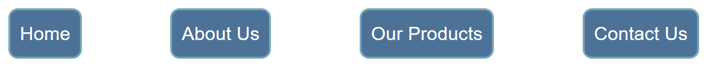
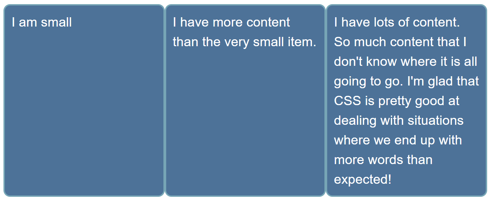

The aim of this skill test is to assess whether you understand how [flexbox and flex items](/en-US/docs/Learn_web_development/Core/CSS_layout/Flexbox) behave. Below are four sets of design problems you can solve using flexbox. Your task is to fix the problems.

> [!NOTE]
> Click **"Play"** in the code blocks in Tasks 1, 2, and 3 to edit the examples in the MDN Playground.
> You can also copy the code (click the clipboard icon) and paste it into an online editor such as [CodePen](https://codepen.io/) or [JSFiddle](https://jsfiddle.net/).
> If you get stuck, you can reach out to us in one of our [communication channels](/en-US/docs/MDN/Community/Communication_channels).

## Interactive challenge

First of all, we are giving you a fun, interactive flexbox challenge created by our [learning partner](/en-US/docs/MDN/Writing_guidelines/Learning_content#partner_links_and_embeds), [Scrimba](https://scrimba.com/home).

Watch the embedded scrim, and complete all the tasks on the timeline (the little ghost icons) by following the instructions and editing the code. When you are done, you can resume watching the scrim to check how the teacher's solution matches up with yours.

<scrim-inline url="https://scrimba.com/frontend-path-c0j/~03a" scrimtitle="Flexbox alignment challenges" survey="true"></scrim-inline>

## Task 1

In this task, the list items are the navigation for a site. They should be laid out as a row, with an equal amount of space between each item.

Your final result should look like the image below:



Try to update the code below to recreate the finished example:

```html live-sample___flexbox1
<nav>
  <ul>
    <li><a href="/">Home</a></li>
    <li><a href="/about">About Us</a></li>
    <li><a href="/products">Our Products</a></li>
    <li><a href="/contact">Contact Us</a></li>
  </ul>
</nav>
```

```css hidden live-sample___flexbox1
body {
  font: 1.2em / 1.5 sans-serif;
}
nav ul {
  max-width: 700px;
  list-style: none;
  padding: 0;
  margin: 0;
}
nav a:link,
nav a:visited {
  background-color: #4d7298;
  border: 2px solid #77a6b6;
  border-radius: 0.5em;
  color: #fff;
  padding: 0.5em;
  display: inline-block;
  text-decoration: none;
}
```

```css live-sample___flexbox1
nav ul {
}
```

{{EmbedLiveSample("flexbox1", "", "240px")}}

<details>
<summary>Click here to show the solution</summary>

You can apply `display: flex` and control spacing using the `justify-content` property:

```css
nav ul {
  display: flex;
  justify-content: space-between;
}
```

</details>

## Task 2

In this task, the list items are all different sizes, but we want them to be displayed as three equal sized columns, no matter what content is in each item.

Your final result should look like the image below:



**Bonus question:** Can you now make the first item twice the size of the other items?

Try to update the code below to recreate the finished example:

```html live-sample___flexbox2
<ul>
  <li>I am small</li>
  <li>I have more content than the very small item.</li>
  <li>
    I have lots of content. So much content that I don't know where it is all
    going to go. I'm glad that CSS is pretty good at dealing with situations
    where we end up with more words than expected!
  </li>
</ul>
```

```css hidden live-sample___flexbox2
body {
  font: 1.2em / 1.5 sans-serif;
}
ul {
  max-width: 700px;
  list-style: none;
  padding: 0;
  margin: 0;
}

li {
  background-color: #4d7298;
  border: 2px solid #77a6b6;
  border-radius: 0.5em;
  color: #fff;
  padding: 0.5em;
}
```

```css live-sample___flexbox2
ul {
}

li {
}
```

{{EmbedLiveSample("flexbox2", "", "240px")}}

<details>
<summary>Click here to show the solution</summary>

It's best to use shorthands, so in this scenario `flex: 1` is probably the best answer, and so the most optimal result would be:

```css
ul {
  display: flex;
}

li {
  flex: 1;
}
```

For the bonus question, add a selector that targets the first element and sets `flex: 2;` (or `flex: 2 0 0;` or `flex-grow: 2`):

```css
li:first-child {
  flex: 2;
}
```

</details>

## Task 3

In this task, we want you to arrange these items into rows as in the image below:


Try to update the code below to recreate the finished example:

```html live-sample___flexbox4
<ul>
  <li>Turnip</li>
  <li>greens</li>
  <li>yarrow</li>
  <li>ricebean</li>
  <li>rutabaga</li>
  <li>endive</li>
  <li>cauliflower</li>
  <li>sea lettuce</li>
  <li>kohlrabi</li>
  <li>amaranth</li>
</ul>
```

```css hidden live-sample___flexbox4
body {
  font: 1.2em / 1.5 sans-serif;
}
ul {
  width: 450px;
  list-style: none;
  padding: 0;
  margin: 0;
}

li {
  background-color: #4d7298;
  border: 2px solid #77a6b6;
  border-radius: 0.5em;
  color: #fff;
  padding: 0.5em;
  margin: 0.5em;
}
```

```css live-sample___flexbox4
ul {
}

li {
}
```

{{EmbedLiveSample("flexbox4", "", "260px")}}

<details>
<summary>Click here to show the solution</summary>

This task requires an understanding of the `flex-wrap` property to wrap flex lines. In addition, to ensure that you end up with something that looks like the example, you need to set `flex: auto` on the child (or `flex: 1 1 auto;`).

```css
ul {
  display: flex;
  flex-wrap: wrap;
}

li {
  flex: auto;
}
```

</details>

## See also

- [CSS styling basics](/en-US/docs/Learn_web_development/Core/Styling_basics)
