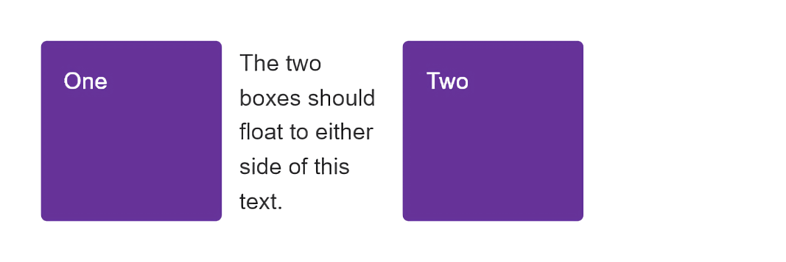
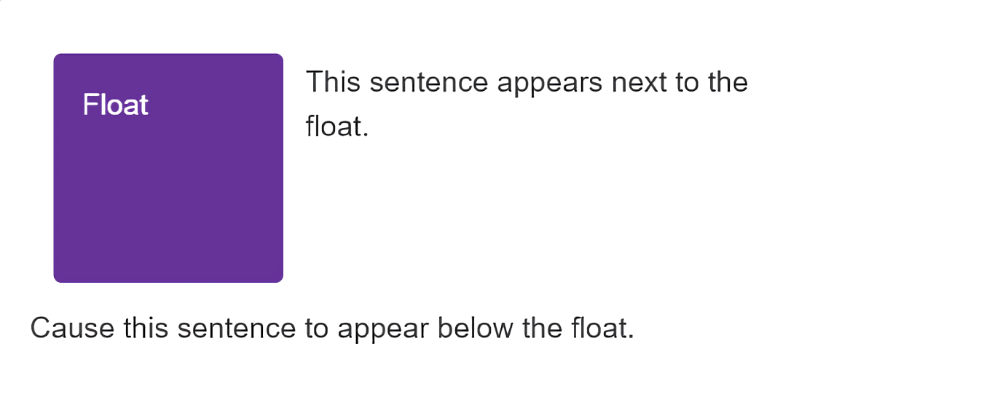

The aim of this skill test is to help you assess whether you understand [floats in CSS](/en-US/docs/Learn_web_development/Core/CSS_layout/Floats) using the {{CSSxRef("float")}} and {{CSSxRef("clear")}} properties and values as well as other methods for clearing floats. You will be working through three small tasks that use different elements of the material you have just covered.

> [!NOTE]
> To get help, read our [Test your skills](/en-US/docs/Learn_web_development#test_your_skills) usage guide. You can also reach out to us using one of our [communication channels](/en-US/docs/MDN/Community/Communication_channels).

## Task 1

To complete this task, float the two elements with a class of `float1` and `float2` left and right, respectively. The text should then appear between the two boxes, as shown in the image below:



```html live-sample___float1
<div class="box">
  <div class="float float1">One</div>
  <div class="float float2">Two</div>
  <p>The two boxes should float to either side of this text.</p>
</div>
```

```css live-sample___float1
body {
  font: 1.2em / 1.5 sans-serif;
}

* {
  box-sizing: border-box;
}

.box {
  padding: 0.5em;
}

.float {
  margin: 15px;
  width: 150px;
  height: 150px;
  border-radius: 5px;
  background-color: rebeccapurple;
  color: #fff;
  padding: 1em;
}

.float1 {
  /* Add styles here */
}

.float2 {
  /* Add styles here */
}
```

{{EmbedLiveSample("float1", "", "210px")}}

<details>
<summary>Click here to show the solution</summary>

You can use `float` for both boxes:

```css
.float1 {
  float: left;
}

.float2 {
  float: right;
}
```

</details>

## Task 2

To complete this task:

1. Float the element with a class of `float` to the left.
2. Update the code so that the first line of text displays next to that element, but the following line of text (which has a class of `below`) displays underneath it.

Your final result should look like the image below:



```html live-sample___float2
<div class="box">
  <div class="float">Float</div>
  <p>This sentence appears next to the float.</p>
  <p class="below">Make this sentence appear below the float.</p>
</div>
```

```css live-sample___float2
body {
  font: 1.2em / 1.5 sans-serif;
}

* {
  box-sizing: border-box;
}

.box {
  padding: 0.5em;
}

.float {
  margin: 15px;
  width: 150px;
  height: 150px;
  border-radius: 5px;
  background-color: rebeccapurple;
  color: #fff;
  padding: 1em;
}

.float {
  /* Add styles here */
}

.below {
  /* Add styles here */
}
```

{{EmbedLiveSample("float2", "", "300px")}}

<details>
<summary>Click here to show the solution</summary>

You need to flow the item left, then add `clear: left` to the class for the second paragraph:

```css
.float {
  float: left;
}

.below {
  clear: left;
}
```

</details>

## Task 3

In this task, we have a floated element. The box wrapping the float and text is displaying behind the float.

To complete the task, use the most up-to-date method available to cause the box background to extend to below the float, as in the image below:


```html live-sample___float3
<div class="box">
  <div class="float">Float</div>
  <p>This sentence appears next to the float.</p>
</div>
```

```css live-sample___float3
body {
  font: 1.2em / 1.5 sans-serif;
}

* {
  box-sizing: border-box;
}

.box {
  padding: 0.5em;
}

.float {
  margin: 15px;
  width: 150px;
  height: 150px;
  border-radius: 5px;
  background-color: rgb(207 232 220);
  padding: 1em;
  color: #fff;
}

.box {
  background-color: rebeccapurple;
  padding: 10px;
  color: #fff;
}

.float {
  float: right;
}

.box {
  /* Add styles here */
}
```

{{EmbedLiveSample("float3", "", "300px")}}

<details>
<summary>Click here to show the solution</summary>

Clear the box underneath the floated item by adding `display: flow-root` to the class for `.box`.
Other methods might be to use `overflow` or a clearfix hack, however the learning materials detail the `flow-root` method as the modern way to achieve this.

```css
.box {
  display: flow-root;
}
```

</details>
