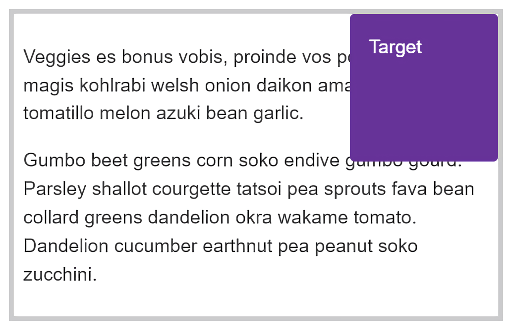
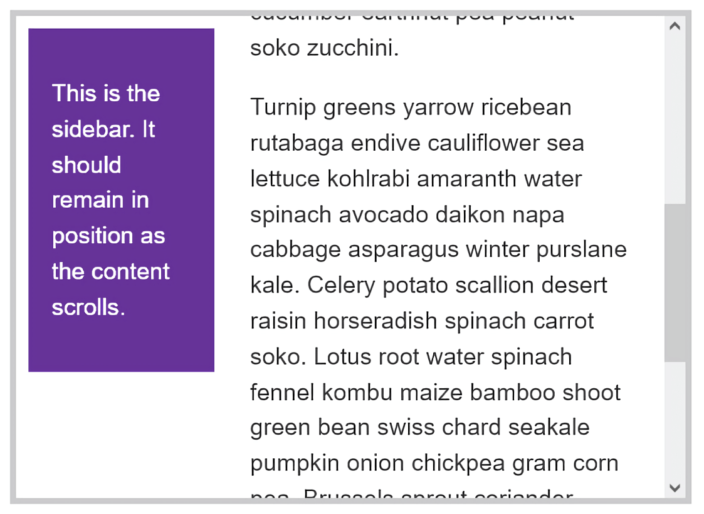

{{PreviousMenuNext("Learn_web_development/Core/CSS_layout/Positioning", "Learn_web_development/Core/CSS_layout/Flexbox", "Learn_web_development/Core/CSS_layout")}}

The aim of this skill test is to help you assess whether you understand [positioning in CSS](/en-US/docs/Learn_web_development/Core/CSS_layout/Positioning) using the CSS {{CSSxRef("position")}} property and values. You will be working through two small tasks that use different elements of the material you have just covered.

> [!NOTE]
> To get help, read our [Test your skills](/en-US/docs/Learn_web_development#test_your_skills) usage guide. You can also reach out to us using one of our [communication channels](/en-US/docs/MDN/Community/Communication_channels).

## Task 1

To complete this task, position the item with a class of `target` to the top and right of the container, which has the 5px grey border.

Your final result should look like the image below:



**Bonus question:** Can you change the target to display underneath the text?

```html live-sample___position1
<div class="container">
  <p>
    Veggies es bonus vobis, proinde vos postulo essum magis kohlrabi welsh onion
    daikon amaranth tatsoi tomatillo melon azuki bean garlic.
  </p>
  <div class="target">Target</div>
  <p>
    Gumbo beet greens corn soko endive gumbo gourd. Parsley shallot courgette
    tatsoi pea sprouts fava bean collard greens dandelion okra wakame tomato.
    Dandelion cucumber earthnut pea peanut soko zucchini.
  </p>
</div>
```

```css live-sample___position1
body {
  font: 1.2em / 1.5 sans-serif;
}

* {
  box-sizing: border-box;
}

.container {
  padding: 0.5em;
  border: 5px solid #cccccc;
}

.target {
  width: 150px;
  height: 150px;
  border-radius: 5px;
  background-color: #663398;
  padding: 1em;
  color: white;
}

.container {
  /* Add styles here */
}

.target {
  /* Add styles here */
}
```

{{EmbedLiveSample("position1", "", "400px")}}

<details>
<summary>Click here to show the solution</summary>

This requires `position: relative` and `position: absolute` and understanding how they relate to each other in terms of relative positioning creating a new positioning context.
A likely issue could be that you add `position: absolute` to the child without applying `position: relative` to the container. In that case, the target will end up being positioned according to the viewport.

```css
.container {
  position: relative;
}

.target {
  position: absolute;
  top: 0;
  right: 0;
}
```

For the bonus question, you need to add a negative `z-index` to the target, for example `z-index: -2`.

</details>

## Task 2

In this task, if you scroll the box in the example below, the sidebar scrolls with the content. We want you to update the code so that the sidebar (`<div class="sidebar">`) stays in place and only the content scrolls.



```html live-sample___position2
<div class="container">
  <div class="sidebar">
    <p>
      This is the sidebar. It should remain in position as the content scrolls.
    </p>
  </div>
  <div class="content">
    <p>
      Veggies es bonus vobis, proinde vos postulo essum magis kohlrabi welsh
      onion daikon amaranth tatsoi tomatillo melon azuki bean garlic.
    </p>
    <p>
      Gumbo beet greens corn soko endive gumbo gourd. Parsley shallot courgette
      tatsoi pea sprouts fava bean collard greens dandelion okra wakame tomato.
      Dandelion cucumber earthnut pea peanut soko zucchini.
    </p>
    <p>
      Turnip greens yarrow ricebean rutabaga endive cauliflower sea lettuce
      kohlrabi amaranth water spinach avocado daikon napa cabbage asparagus
      winter purslane kale. Celery potato scallion desert raisin horseradish
      spinach carrot soko. Lotus root water spinach fennel kombu maize bamboo
      shoot green bean swiss chard seakale pumpkin onion chickpea gram corn pea.
      Brussels sprout coriander water chestnut gourd swiss chard wakame kohlrabi
      beetroot carrot watercress. Corn amaranth salsify bunya nuts nori azuki
      bean chickweed potato bell pepper artichoke.
    </p>
  </div>
</div>
```

```css live-sample___position2
body {
  font: 1.2em / 1.5 sans-serif;
}

* {
  box-sizing: border-box;
}

.container {
  height: 400px;
  padding: 0.5em;
  border: 5px solid #cccccc;
  overflow: auto;
}

.sidebar {
  color: white;
  background-color: #663398;
  padding: 1em;
  float: left;
  width: 150px;
}

.content {
  padding: 1em;
  margin-left: 160px;
}

.container {
  /* Add styles here */
}

.sidebar {
  /* Add styles here */
}
```

{{EmbedLiveSample("position2", "", "400px")}}

<details>
<summary>Click here to show the solution</summary>

We're testing your understanding of `position: fixed` with a slightly different example to the ones in the learning materials.

```css
.sidebar {
  position: fixed;
}
```

</details>

{{PreviousMenuNext("Learn_web_development/Core/CSS_layout/Positioning", "Learn_web_development/Core/CSS_layout/Flexbox", "Learn_web_development/Core/CSS_layout")}}
