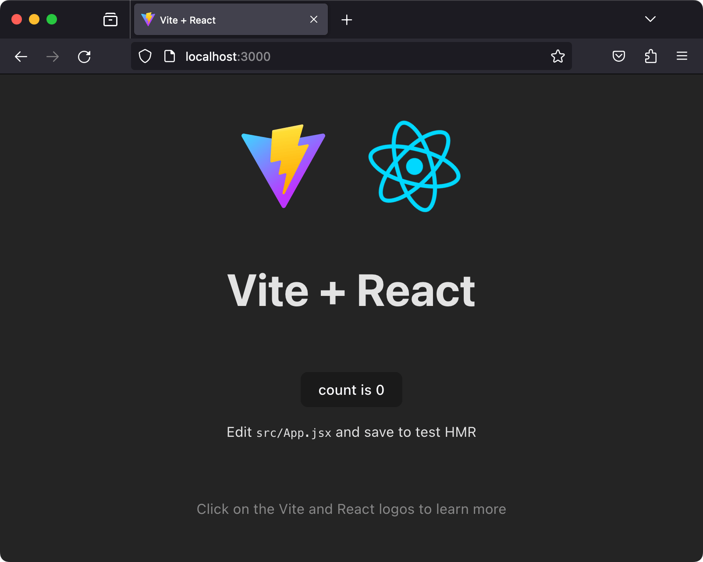

{{PreviousMenuNext("Learn_web_development/Core/Frameworks_libraries/Main_features","Learn_web_development/Core/Frameworks_libraries/React_todo_list_beginning", "Learn_web_development/Core/Frameworks_libraries")}}

In this article we will say hello to React. We'll discover a little bit of detail about its background and use cases, set up a basic React toolchain on our local computer, and create and play with a simple starter app — learning a bit about how React works in the process.

<table>
  <tbody>
    <tr>
      <th scope="row">Prerequisites:</th>
      <td>
        Familiarity with the core <a href="/en-US/docs/Learn_web_development/Core/Structuring_content">HTML</a>,
        <a href="/en-US/docs/Learn_web_development/Core/Styling_basics">CSS</a>, and
        <a href="/en-US/docs/Learn_web_development/Core/Scripting">JavaScript</a> languages, and the <a href="/en-US/docs/Learn_web_development/Getting_started/Environment_setup/Command_line">terminal/command line</a>.
      </td>
    </tr>
    <tr>
      <th scope="row">Learning outcomes:</th>
      <td>
          Set up a local React development environment, create a start app, and
          understand the basics of how it works.
      </td>
    </tr>
  </tbody>
</table>

## Hello React

As its official tagline states, [React](https://react.dev/) is a library for building user interfaces. React is not a framework – it's not even exclusive to the web. It's used with other libraries to render to certain environments. For instance, [React Native](https://reactnative.dev/) can be used to build mobile applications.

To build for the web, developers use React in tandem with [ReactDOM](https://react.dev/reference/react-dom). React and ReactDOM are often discussed in the same spaces as — and utilized to solve the same problems as — other true web development frameworks. When we refer to React as a "framework", we're working with that colloquial understanding.

React's primary goal is to minimize the bugs that occur when developers are building UIs. It does this through the use of components — self-contained, logical pieces of code that describe a portion of the user interface. These components can be composed together to create a full UI, and React abstracts away much of the rendering work, leaving you to concentrate on the UI design.

## Use cases

Unlike the other frameworks covered in this module, React does not enforce strict rules around code conventions or file organization. This allows teams to set conventions that work best for them, and to adopt React in any way they would like to. React can handle a single button, a few pieces of an interface, or an app's entire user interface.

While React _can_ be used for [small pieces of an interface](https://react.dev/learn/add-react-to-an-existing-project), it's not as easy to "drop into" an application as a library like jQuery, or even a framework like Vue — it is more approachable when you build your entire app with React.

In addition, many of the developer-experience benefits of a React app, such as writing interfaces with JSX, require a compilation process. Adding a compiler like Babel to a website makes the code on it run slowly, so developers often set up such tooling with a build step. React arguably has a heavy tooling requirement, but it can be learned.

This article is going to focus on the use case of using React to render the entire user interface of an application with the support of [Vite](https://vite.dev/), a modern front-end build tool.

## How does React use JavaScript?

React utilizes features of modern JavaScript for many of its patterns. Its biggest departure from JavaScript comes with the use of [JSX](https://react.dev/learn/writing-markup-with-jsx) syntax. JSX extends JavaScript's syntax so that HTML-like code can live alongside it. For example:

```jsx
const heading = <h1>Mozilla Developer Network</h1>;
```

This heading constant is known as a **JSX expression**. React can use it to render that [`<h1>`](/en-US/docs/Web/HTML/Reference/Elements/Heading_Elements) tag in our app.

Suppose we wanted to wrap our heading in a [`<header>`](/en-US/docs/Web/HTML/Reference/Elements/header) tag, for semantic reasons? The JSX approach allows us to nest our elements within each other, just like we do with HTML:

```jsx
const header = (
  <header>
    <h1>Mozilla Developer Network</h1>
  </header>
);
```

> [!NOTE]
> The parentheses in the previous snippet aren't unique to JSX, and don't have any effect on your application. They're a signal to you (and your computer) that the multiple lines of code inside are part of the same expression. You could just as well write the header expression like this:
>
> ```jsx-nolint
> const header = <header>
>   <h1>Mozilla Developer Network</h1>
> </header>;
> ```
>
> However, this looks kind of awkward, because the [`<header>`](/en-US/docs/Web/HTML/Reference/Elements/header) tag that starts the expression is not indented to the same position as its corresponding closing tag.

Of course, your browser can't read JSX without help. When compiled (using a tool like [Babel](https://babeljs.io/) or [Parcel](https://parceljs.org/)), our header expression would look like this:

```jsx
const header = React.createElement(
  "header",
  null,
  React.createElement("h1", null, "Mozilla Developer Network"),
);
```

It's _possible_ to skip the compilation step and use [`React.createElement()`](https://react.dev/reference/react/createElement) to write your UI yourself. In doing this, however, you lose the declarative benefit of JSX, and your code becomes harder to read. Compilation is an extra step in the development process, but many developers in the React community think that the readability of JSX is worthwhile. Plus, modern front-end development almost always involves a build process anyway — you have to downlevel modern syntax to be compatible with older browsers, and you may want to [minify](/en-US/docs/Glossary/Minification) your code to optimize loading performance. Popular tooling like Babel already comes with JSX support out-of-the-box, so you don't have to configure compilation yourself unless you want to.

Because JSX is a blend of HTML and JavaScript, some developers find it intuitive. Others say that its blended nature makes it confusing. Once you're comfortable with it, however, it will allow you to build user interfaces more quickly and intuitively, and allow others to better understand your codebase at a glance.

To read more about JSX, check out the React team's [Writing Markup with JSX](https://react.dev/learn/writing-markup-with-jsx) article.

## Setting up your first React app

There are many ways to create a new React application. We're going to use Vite to create a new application via the command line.

It's possible to [add React to an existing project](https://react.dev/learn/add-react-to-an-existing-project) by copying some [`<script>`](/en-US/docs/Web/HTML/Reference/Elements/script) elements into an HTML file, but using Vite will allow you to spend more time building your app and less time fussing with setup.

### Requirements

In order to use Vite, you need to have [Node.js](https://nodejs.org/en/) installed. As of Vite 5.0, at least Node version 18 or later is required, and it's a good idea to run the latest long term support (LTS) version when you can. As of 24th October 2023, Node 20 is the latest LTS version. Node includes npm (the Node package manager).

To check your version of Node, run the following in your terminal:

```bash
node -v
```

If Node is installed, you'll see a version number. If it isn't, you'll see an error message. To install Node, follow the instructions on the [Node.js website](https://nodejs.org/en/).

You may use the Yarn package manager as an alternative to npm but we'll assume you're using npm in this set of tutorials. See [Package management basics](/en-US/docs/Learn_web_development/Extensions/Client-side_tools/Package_management) for more information on npm and yarn.

If you're using Windows, you will need to install some software to give you parity with Unix/macOS terminal in order to use the terminal commands mentioned in this tutorial. **Gitbash** (which comes as part of the [git for Windows toolset](https://gitforwindows.org/)) or **[Windows Subsystem for Linux](https://learn.microsoft.com/en-us/windows/wsl/about)** (**WSL**) are both suitable. See [Command line crash course](/en-US/docs/Learn_web_development/Getting_started/Environment_setup/Command_line) for more information on these, and on terminal commands in general.

Also bear in mind that React and ReactDOM produce apps that only work on a fairly modern set of browsers like Firefox, Microsoft Edge, Safari, or Chrome when working through these tutorials.

See the following for more information:

- ["About npm" on the npm blog](https://docs.npmjs.com/about-npm/)
- ["Introducing npx" on the npm blog](https://blog.npmjs.org/post/162869356040/introducing-npx-an-npm-package-runner)
- [Vite's documentation](https://vite.dev/guide/)

### Initializing your app

The npm package manager comes with a `create` command that allows you to create new projects from templates. We can use it to create a new app from Vite's standard React template. Make sure you `cd` to the place you'd like your app to live on your machine, then run the following in your terminal:

```bash
npm create vite@latest moz-todo-react -- --template react
```

This creates a `moz-todo-react` directory using Vite's `react` template.

> [!NOTE]
> The `--` is necessary to pass arguments to npm commands such as `create`, and the `--template react` argument tells Vite to use its React template.

Your terminal will have printed some messages if this command was successful. You should see text prompting you to `cd` to your new directory, install the app's dependencies, and run the app locally. Let's start with two of those commands. Run the following in your terminal:

```bash
cd moz-todo-react && npm install
```

Once the process is complete, we need to start a local development server to run our app. Here, we're going to add some command line flags to Vite's default suggestion to open the app in our browser as soon as the server starts, and use port 3000.

Run the following in your terminal:

```bash
npm run dev -- --open --port 3000
```

Once the server starts, you should see a new browser tab containing your React app:



### Application structure

Vite gives us everything we need to develop a React application. Its initial file structure looks like this:

```plain
moz-todo-react
├── README.md
├── index.html
├── node_modules
├── package-lock.json
├── package.json
├── public
│   └── vite.svg
├── src
│   ├── App.css
│   ├── App.jsx
│   ├── assets
│   │   └── react.svg
│   ├── index.css
│   └── main.jsx
└── vite.config.js
```

**`index.html`** is the most important top-level file. Vite injects your code into this file so that your browser can run it. You won't need to edit this file during our tutorial, but you should change the text inside the [`<title>`](/en-US/docs/Web/HTML/Reference/Elements/title) element in this file to reflect the title of your application. Accurate page titles are important for accessibility.

The **`public`** directory contains static files that will be served directly to your browser without being processed by Vite's build tooling. Right now, it only contains a Vite logo.

The **`src`** directory is where we'll spend most of our time, as it's where the source code for our application lives. You'll notice that some JavaScript files in this directory end in the extension `.jsx`. This extension is necessary for any file that contains JSX – it tells Vite to turn the JSX syntax into JavaScript that your browser can understand. The `src/assets` directory contains the React logo you saw in the browser.

The `package.json` and `package-lock.json` files contain metadata about our project. These files are not unique to React applications: Vite populated `package.json` for us, and npm created `package-lock.json` for when we installed the app's dependencies. You don't need to understand these files at all to complete this tutorial. However, if you'd like to learn more about them, you can read about [`package.json`](https://docs.npmjs.com/cli/v9/configuring-npm/package-json/) and [`package-lock.json`](https://docs.npmjs.com/cli/v9/configuring-npm/package-lock-json/) in the npm docs. We also talk about `package.json` in our [Package management basics](/en-US/docs/Learn_web_development/Extensions/Client-side_tools/Package_management) tutorial.

### Customizing our dev script

Before we move on, you might want to change your `package.json` file a little bit so that you don't have to pass the `--open` and `--port` flags every time you run `npm run dev`. Open `package.json` in your text editor and find the `scripts` object. Change the `"dev"` key so that it looks like this:

```diff
- "dev": "vite",
+ "dev": "vite --open --port 3000",
```

With this in place, your app will open in your browser at `http://localhost:3000` every time you run `npm run dev`.

> [!NOTE]
> You _don't_ need the extra `--` here because we're passing arguments directly to `vite`, rather than to a pre-defined npm script.

## Exploring our first React component — `<App />`

In React, a **component** is a reusable module that renders a part of our overall application. Components can be big or small, but they are usually clearly defined: they serve a single, obvious purpose.

Let's open `src/App.jsx`, since our browser is prompting us to edit it. This file contains our first component, `<App />`:

```jsx
import { useState } from "react";
import reactLogo from "./assets/react.svg";
import viteLogo from "/vite.svg";
import "./App.css";

function App() {
  const [count, setCount] = useState(0);

  return (
    <>
      <div>
        <a href="https://vite.dev" target="_blank">
          
        </a>
        <a href="https://react.dev" target="_blank">
          
        </a>
      </div>
      <h1>Vite + React</h1>
      <div className="card">
        <button onClick={() => setCount((count) => count + 1)}>
          count is {count}
        </button>
        <p>
          Edit <code>src/App.jsx</code> and save to test HMR
        </p>
      </div>
      <p className="read-the-docs">
        Click on the Vite and React logos to learn more
      </p>
    </>
  );
}

export default App;
```

The `App.jsx` file consists of three main parts: some [`import`](/en-US/docs/Web/JavaScript/Reference/Statements/import) statements at the top, the `App()` function in the middle, and an [`export`](/en-US/docs/Web/JavaScript/Reference/Statements/export) statement at the bottom. Most React components follow this pattern.

### Import statements

The `import` statements at the top of the file allow `App.jsx` to use code that has been defined elsewhere. Let's look at these statements more closely.

```jsx
import { useState } from "react";
import reactLogo from "./assets/react.svg";
import viteLogo from "/vite.svg";
import "./App.css";
```

The first statement imports the `useState` hook from the `react` library. Hooks are a way of using React's features inside a component. We'll talk more about hooks later in this tutorial.

After that, we import `reactLogo` and `viteLogo`. Note that their import paths start with `./` and `/` respectively and that they end with the `.svg` extension at the end. This tells us that these imports are _local_, referencing our own files rather than npm packages.

The final statement imports the CSS related to our `<App />` component. Note that there is no variable name and no `from` directive. This is called a [_side-effect import_](/en-US/docs/Web/JavaScript/Reference/Statements/import#import_a_module_for_its_side_effects_only) — it doesn't import any value into the JavaScript file, but it tells Vite to add the referenced CSS file to the final code output, so that it can be used in the browser.

### The `App()` function

After the imports, we have a function named `App()`, which defines the structure of the `App` component. Whereas most of the JavaScript community prefers {{Glossary("camel_case", "lower camel case")}} names like `helloWorld`, React components use Pascal case (or upper camel case) variable names, like `HelloWorld`, to make it clear that a given JSX element is a React component and not a regular HTML tag. If you were to rename the `App()` function to `app()`, your browser would throw an error.

Let's look at `App()` more closely.

```jsx
function App() {
  const [count, setCount] = useState(0);

  return (
    <>
      <div>
        <a href="https://vite.dev" target="_blank">
          
        </a>
        <a href="https://react.dev" target="_blank">
          
        </a>
      </div>
      <h1>Vite + React</h1>
      <div className="card">
        <button onClick={() => setCount((count) => count + 1)}>
          count is {count}
        </button>
        <p>
          Edit <code>src/App.jsx</code> and save to test HMR
        </p>
      </div>
      <p className="read-the-docs">
        Click on the Vite and React logos to learn more
      </p>
    </>
  );
}
```

The `App()` function returns a JSX expression. This expression defines what your browser ultimately renders to the DOM.

Just under the `return` keyword is a special bit of syntax: `<>`. This is a [fragment](https://react.dev/reference/react/Fragment). React components have to return a single JSX element, and fragments allow us to do that without rendering arbitrary `<div>`s in the browser. You'll see fragments in many React applications.

### The `export` statement

There's one more line of code after the `App()` function:

```jsx
export default App;
```

This export statement makes our `App()` function available to other modules. We'll talk more about this later.

## Moving on to `main`

Let's open `src/main.jsx`, because that's where the `<App />` component is being used. This file is the entry point for our app, and it initially looks like this:

```jsx
import { StrictMode } from "react";
import { createRoot } from "react-dom/client";
import "./index.css";
import App from "./App.jsx";

createRoot(document.getElementById("root")).render(
  <StrictMode>
    <App />
  </StrictMode>,
);
```

As with `App.jsx`, the file starts by importing all the JavaScript modules and other assets it needs to run.

The first two statements import `StrictMode` and `createRoot` from the `react` and `react-dom` libraries because they are referenced later in the file. We don't write a path or extension when importing these libraries because they are not local files. In fact, they are listed as dependencies in our `package.json` file. Be careful of this distinction as you work through this lesson!

We then import our `App()` function and `index.css`, which holds global styles that are applied to our whole app.

We then call the `createRoot()` function, which defines the root node of our application. This takes as an argument the DOM element inside which we want our React app to be rendered. In this case, that's the DOM element with an ID of `root`. Finally, we chain the `render()` method onto the `createRoot()` call, passing it the JSX expression that we want to render inside our root. By writing `<App />` as this JSX expression, we're telling React to call the `App()` _function_, which renders the `App` _component_ inside the root node.

> **Note:** `<App />` is rendered inside a special `<React.StrictMode>` component. This component helps developers catch potential problems in their code.

You can read up on these React APIs, if you'd like:

- [`ReactDOM.createRoot()`](https://react.dev/reference/react-dom/client/createRoot)
- [`React.StrictMode`](https://react.dev/reference/react/StrictMode)

## Starting fresh

Before we start building our app, we're going to delete some of the boilerplate code that Vite provided for us.

First, as an experiment, change the [`<h1>`](/en-US/docs/Web/HTML/Reference/Elements/Heading_Elements) element in `App.jsx` so that it reads "Hello, World!", then save your file. You'll notice that this change is immediately rendered in the development server running at `http://localhost:3000` in your browser. Bear this in mind as you work on your app.

We won't be using the rest of the code! Replace the contents of `App.jsx` with the following:

```jsx
import "./App.css";

function App() {
  return (
    <>
      <header>
        <h1>Hello, World!</h1>
      </header>
    </>
  );
}

export default App;
```

## Practice with JSX

Next, we'll use our JavaScript skills to get a bit more comfortable writing JSX and working with data in React. We'll talk about how to add attributes to JSX elements, how to write comments, how to render content from variables and other expressions, and how to pass data into components with props.

### Adding attributes to JSX elements

JSX elements can have attributes, just like HTML elements. Try adding a `<button>` below the `<h1>` element in your `App.jsx` file, like this:

```jsx
<button type="button">Click me!</button>
```

When you save your file, you'll see a button with the words `Click me!`. The button doesn't do anything yet, but we'll learn about adding interactivity to our app soon.

Some attributes are different than their HTML counterparts. For example, the `class` attribute in HTML translates to `className` in JSX. This is because `class` is a reserved word in JavaScript, and JSX is a JavaScript extension. If you wanted to add a `primary` class to your button, you'd write it like this:

```jsx
<button type="button" className="primary">
  Click me!
</button>
```

### JavaScript expressions as content

Unlike HTML, JSX allows us to write variables and other JavaScript expressions right alongside our other content. Let's declare a variable called `subject` just above the `App()` function in your `App.jsx` file:

```jsx
const subject = "React";
function App() {
  // code omitted for brevity
}
```

Next, replace the word "World" in the `<h1>` element with `{subject}`:

```jsx
<h1>Hello, {subject}!</h1>
```

Save your file and check your browser. You should see "Hello, React!" rendered.

The curly braces around `subject` are another feature of JSX's syntax. The curly braces tell React that we want to read the value of the `subject` variable, rather than render the literal string `"subject"`. You can put any valid JavaScript expression inside curly braces in JSX; React will evaluate it and render the _result_ of the expression as the final content. Following is a series of examples, with comments above explaining what each expression will render:

```jsx-nolint
{/* Hello, React :)! */}
<h1>Hello, {subject + ' :)'}!</h1>
{/* Hello, REACT */}
<h1>Hello, {subject.toUpperCase()}</h1>
{/* Hello, 4! */}
<h1>Hello, {2 + 2}!</h1>
```

Even comments in JSX are written inside curly braces! This is because curly braces can contain a single JavaScript expression, and comments are valid as part of a JavaScript expression (and get ignored). You can use both `/* block comment syntax */` and `// line comment syntax` (with a trailing new line) inside curly braces.

### Component props

**Props** are a means of passing data into a React component. Their syntax is identical to that of attributes, in fact: `prop="value"`. The difference is that whereas attributes are passed into plain elements, props are passed into React components.

In React, the flow of data is unidirectional: props can only be passed from parent components down to child components.

Let's open `main.jsx` and give our `<App />` component its first prop.

Add a prop of `subject` to the `<App />` component call, with a value of `Clarice`. When you are done, it should look something like this:

```jsx
<App subject="Clarice" />
```

Back in `App.jsx`, let's revisit the `App()` function. Change the signature of `App()` so that it accepts `props` as a parameter and log `props` to the console so you can inspect it. Also delete the `subject` const; we don't need it anymore. Your `App.jsx` file should look like this:

```jsx
function App(props) {
  console.log(props);
  return (
    <>
      {
        // code omitted for brevity
      }
    </>
  );
}
```

Save your file and check your browser. You'll see a blank background with no content. This is because we're trying to read a `subject` variable that's no longer defined. Fix this by commenting out the `<h1>Hello {subject}!</h1>` line.

> [!NOTE]
> If your code editor understands how to parse JSX (most modern editors do!), you can use its built-in commenting shortcut — `Ctrl + /` (on Windows) or `Cmd + /` (on macOS) — to create comments more quickly.

Save the file with that line commented out. This time, you should see your
"Click me!" button rendered by itself. If you open your browser's developer console, you'll see a message that looks like this:

```plain
Object { subject: "Clarice" }
```

The object property `subject` corresponds to the `subject` prop we added to our `<App />` component call, and the string `Clarice` corresponds to its value. Component props in React are always collected into objects in this fashion.

Let's use this `subject` prop to fix the error in our app. Uncomment the `<h1>Hello, {subject}!</h1>` line and change it to `<h1>Hello, {props.subject}!</h1>`, then delete the `console.log()` statement. Your code should look like this:

```jsx
function App(props) {
  return (
    <>
      <header>
        <h1>Hello, {props.subject}!</h1>
        <button type="button" className="primary">
          Click me!
        </button>
      </header>
    </>
  );
}
```

When you save, the app should now greet you with "Hello, Clarice!". If you return to `main.jsx`, edit the value of `subject`, and save, your text will change.

For additional practice, you could try adding an additional `greeting` prop to the `<App />` component call inside `main.jsx` and using it alongside the `subject` prop inside `App.jsx`.

## Summary

This brings us to the end of our initial look at React, including how to install it locally, creating a starter app, and how the basics work. In the next article, we'll start building our first proper application — a todo list. Before we do that, however, let's recap some of the things we've learned.

In React:

- Components can import modules they need and must export themselves at the bottom of their files.
- Component functions are named with `PascalCase`.
- You can render JavaScript expressions in JSX by putting them between curly braces, like `{so}`.
- Some JSX attributes are different than HTML attributes so that they don't conflict with JavaScript reserved words. For example, `class` in HTML translates to `className` in JSX.
- Props are written just like attributes inside component calls and are passed into components.

## See also

- [Learn React](https://scrimba.com/learn-react-c0e?via=mdn) <sup>[_MDN learning partner_](/en-US/docs/MDN/Writing_guidelines/Learning_content#partner_links_and_embeds)</sup>
  - : [Scrimba's](https://scrimba.com/?via=mdn) _Learn React_ course is the ultimate React 101 — the perfect starting point for any React beginner. Learn the basics of modern React by solving 140+ interactive coding challenges and building eight fun projects.

{{PreviousMenuNext("Learn_web_development/Core/Frameworks_libraries/Main_features","Learn_web_development/Core/Frameworks_libraries/React_todo_list_beginning", "Learn_web_development/Core/Frameworks_libraries")}}
