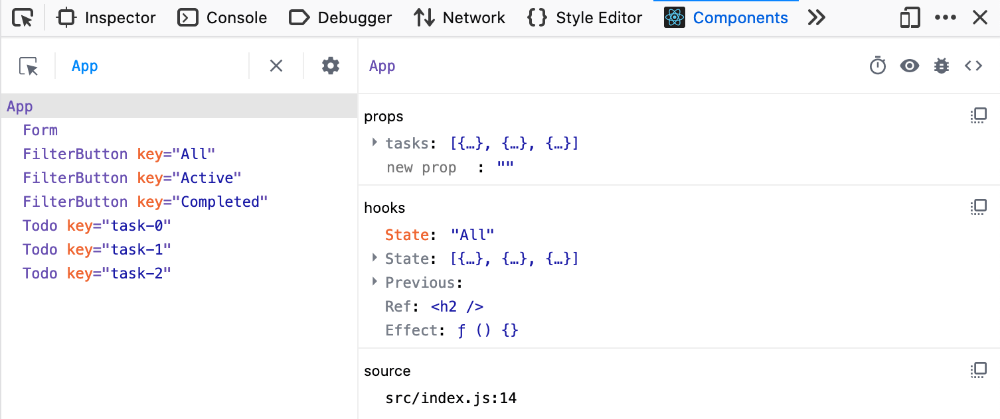

{{LearnSidebar}}

{{PreviousMenuNext("Learn_web_development/Core/Frameworks_libraries/React_accessibility","Learn_web_development/Core/Accessibility", "Learn_web_development/Core/Frameworks_libraries")}}

Our final article provides you with a list of React resources that you can use to go further in your learning.

<table>
  <tbody>
    <tr>
      <th scope="row">Prerequisites:</th>
      <td>
        Familiarity with the core <a href="/en-US/docs/Learn_web_development/Core/Structuring_content">HTML</a>,
        <a href="/en-US/docs/Learn_web_development/Core/Styling_basics">CSS</a>, and
        <a href="/en-US/docs/Learn_web_development/Core/Scripting">JavaScript</a> languages, and the <a href="/en-US/docs/Learn_web_development/Getting_started/Environment_setup/Command_line">terminal/command line</a>.
      </td>
    </tr>
    <tr>
      <th scope="row">Learning outcomes:</th>
      <td>Familiarity with further resources for learning more about React.</td>
    </tr>
  </tbody>
</table>

## Component-level styles

While we kept all the CSS for our tutorial in a single `index.css` file, it's common for React applications to define per-component stylesheets. In an application powered by Vite, this can be done by creating a CSS file and importing it into its corresponding component module.

For example: we could have written a dedicated `Form.css` file to house the CSS related to the `<Form />` component, then imported the styles into `Form.jsx`, like this:

```jsx
import Form from "./Form";
import "./Form.css";
```

This approach makes it easy to identify and manage the CSS that belongs to a specific component and distinguish it from your app-wide styles. However, it also fragments your stylesheet across your codebase, and this fragmentation might not be worthwhile. For larger applications with hundreds of unique views and lots of moving parts, it makes sense to use component-level styles and thereby limit the amount of irrelevant code that's sent to your user at any one time.

You can read more about this and other approaches to styling React components in the Smashing Magazine article, [Styling Components In React](https://www.smashingmagazine.com/2020/05/styling-components-react/).

## React DevTools

We used `console.log()` to check on the state and props of our application in this tutorial, and you'll also have seen some of the useful warnings and error message that React gives you both in the CLI and your browser's JavaScript console. But there's more we can do here.

The React DevTools utility allows you to inspect the internals of your React application directly in the browser. It adds a new panel to your browser's developer tools that allows you to inspect the state and props of various components, and even edit state and props to make immediate changes to your application.

This screenshot shows our finished application as it appears in React DevTools:



On the left, we see all of the components that make up our application, including unique keys for the items that are rendered from arrays. On the right, we see the props and hooks that our App component uses. Notice, too, that the `Form`, `FilterButton`, and `Todo` components are indented to the right – this indicates that `App` is their parent. This view is great for understanding parent/child relationships at a glance and is invaluable for understanding more complex apps.

React DevTools is available in several forms:

- A [Chrome browser extension](https://chromewebstore.google.com/detail/react-developer-tools/fmkadmapgofadopljbjfkapdkoienihi?hl=en).
- A [Firefox browser extension](https://addons.mozilla.org/en-US/firefox/addon/react-devtools/).
- A [Microsoft Edge browser extension](https://microsoftedge.microsoft.com/addons/detail/react-developer-tools/gpphkfbcpidddadnkolkpfckpihlkkil).
- A [stand-alone application you can install with npm or Yarn](https://www.npmjs.com/package/react-devtools).

Try installing one of these, and then using it to inspect the app you've just built!

You can [read more about React DevTools in the React docs](https://react.dev/learn/react-developer-tools).

## The `useReducer()` hook

In this tutorial, we used the `useState()` hook to manage state across a small collection of event handler functions. This was fine for learning purposes, but it left our state management logic tied to our component's event handlers – especially those of the `<Todo />` component.

The `useReducer()` hook offers developers a way to consolidate different-but-related state management logic into a single function. It's a bit more complex than `useState()`, but it's a good tool to have in your belt. You can [read more about `useReducer()` in the React docs](https://react.dev/learn/extracting-state-logic-into-a-reducer).

## The Context API

The application that we built in this tutorial utilized component props to pass data from its `App` component to the child components that needed it. Most of the time, props are an appropriate method for sharing data; for complex, deeply nested applications, however, they're not always best.

React provides the [Context API](https://react.dev/learn/passing-data-deeply-with-context) as a way to provide data to components that need it _without_ passing props down the component tree. There's also [a useContext hook](https://react.dev/reference/react/useContext) that facilitates this.

If you'd like to try this API for yourself, Smashing Magazine has written an [introductory article about React context](https://www.smashingmagazine.com/2020/01/introduction-react-context-api/).

## Class components

Although this tutorial doesn't mention them, it is possible to build React components using [JavaScript classes](/en-US/docs/Web/JavaScript/Reference/Classes) – these are called class components. Until the arrival of hooks, classes were the only way to bring state into components or manage rendering side effects. They're still the only way to handle certain edge-cases, and they're common in legacy React projects. The official React docs maintain a reference for the [`Component`](https://react.dev/reference/react/Component) base class, but recommend using hooks to manage [state](https://react.dev/learn/state-a-components-memory) and [side effects](https://react.dev/learn/synchronizing-with-effects).

## Testing

Libraries such as [React Testing Library](https://testing-library.com/docs/react-testing-library/intro/) make it possible to write unit tests for React components. There are many ways to _run_ these tests. The testing framework [Vitest](https://vitest.dev/) is built on top of Vite, and is a great companion to your Vite-powered React applications. [Jest](https://jestjs.io/) is another popular testing framework that can be used with React.

## Routing

While routing is traditionally handled by a server and not an application on the user's computer, it is possible to configure a web application to read and update the browser's location, and render certain user interfaces. This is called _client-side routing_. It's possible to create many unique routes for your application (such as `/home`, `/dashboard`, or `/login`).

[React Router](https://reactrouter.com/) is the most popular and most robust client-side routing library for React. It allows developers to define the routes of their application, and associate components with those routes . It also provides a number of useful hooks and components for managing the browser's location and history.

> [!NOTE]
> Client-side routing can make your application feel fast, but it poses a number of accessibility problems, especially for people who rely on assistive technology. You can read more about this in Marcy Sutton's article, ["The Implications of Client-Side Routing"](https://testingaccessibility.com/implications-of-client-side-routing).

{{PreviousMenuNext("Learn_web_development/Core/Frameworks_libraries/React_accessibility","Learn_web_development/Core/Accessibility", "Learn_web_development/Core/Frameworks_libraries")}}
