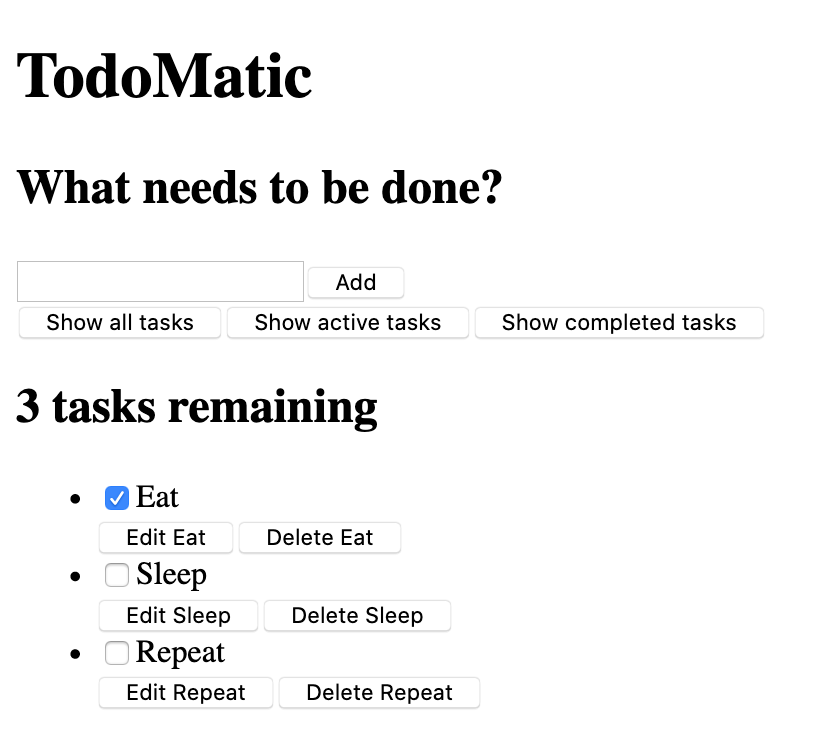

{{PreviousMenuNext("Learn_web_development/Core/Frameworks_libraries/React_getting_started","Learn_web_development/Core/Frameworks_libraries/React_components", "Learn_web_development/Core/Frameworks_libraries")}}

Let's say that we've been tasked with creating a proof-of-concept in React – an app that allows users to add, edit, and delete tasks they want to work on, and also mark tasks as complete without deleting them. This article will walk you through the basic structure and styling of such an application, ready for individual component definition and interactivity, which we'll add later.

> [!NOTE]
> If you need to check your code against our version, you can find a finished version of the sample React app code in our [todo-react repository](https://github.com/mdn/todo-react). For a running live version, see <https://mdn.github.io/todo-react/>.

<table>
  <tbody>
    <tr>
      <th scope="row">Prerequisites:</th>
      <td>
        Familiarity with the core <a href="/en-US/docs/Learn_web_development/Core/Structuring_content">HTML</a>,
        <a href="/en-US/docs/Learn_web_development/Core/Styling_basics">CSS</a>, and
        <a href="/en-US/docs/Learn_web_development/Core/Scripting">JavaScript</a> languages, and the <a href="/en-US/docs/Learn_web_development/Getting_started/Environment_setup/Command_line">terminal/command line</a>.
      </td>
    </tr>
    <tr>
      <th scope="row">Learning outcomes:</th>
      <td>
        Familiarity with our todo list case study, and getting the basic
        <code>App</code> structure and styling in place.
      </td>
    </tr>
  </tbody>
</table>

## Our app's user stories

In software development, a user story is an actionable goal from the perspective of the user. Defining user stories before we begin our work will help us focus our work. Our app should fulfill the following stories:

As a user, I can

- read a list of tasks.
- add a task using the mouse or keyboard.
- mark any task as completed, using the mouse or keyboard.
- delete any task, using the mouse or keyboard.
- edit any task, using the mouse or keyboard.
- view a specific subset of tasks: All tasks, only the active task, or only the completed tasks.

We'll tackle these stories one-by-one.

## Pre-project housekeeping

Vite has given us some code that we won't be using at all for our project. The following terminal commands will delete it to make way for our new project. Make sure you're starting in the app's root directory!

```bash
# Move into the src directory
cd src
# Delete the App.css file and the React logo provided by Vite
rm App.css assets/react.svg
# Empty the contents of App.jsx and index.css
echo -n > App.jsx && echo -n > index.css
# Move back up to the root of the project
cd ..
```

> [!NOTE]
> If you stopped your server to do the terminal tasks mentioned above, you'll have to start it again using `npm run dev`.

## Project starter code

As a starting point for this project, we're going to provide two things: an `App()` function to replace the one you just deleted, and some CSS to style your app.

### The JSX

Copy the following snippet to your clipboard, then paste it into `App.jsx`:

```jsx
function App(props) {
  return (
    <div className="todoapp stack-large">
      <h1>TodoMatic</h1>
      <form>
        <h2 className="label-wrapper">
          <label htmlFor="new-todo-input" className="label__lg">
            What needs to be done?
          </label>
        </h2>
        <input
          type="text"
          id="new-todo-input"
          className="input input__lg"
          name="text"
          autoComplete="off"
        />
        <button type="submit" className="btn btn__primary btn__lg">
          Add
        </button>
      </form>
      <div className="filters btn-group stack-exception">
        <button type="button" className="btn toggle-btn" aria-pressed="true">
          <span className="visually-hidden">Show </span>
          <span>all</span>
          <span className="visually-hidden"> tasks</span>
        </button>
        <button type="button" className="btn toggle-btn" aria-pressed="false">
          <span className="visually-hidden">Show </span>
          <span>Active</span>
          <span className="visually-hidden"> tasks</span>
        </button>
        <button type="button" className="btn toggle-btn" aria-pressed="false">
          <span className="visually-hidden">Show </span>
          <span>Completed</span>
          <span className="visually-hidden"> tasks</span>
        </button>
      </div>
      <h2 id="list-heading">3 tasks remaining</h2>
      <ul
        role="list"
        className="todo-list stack-large stack-exception"
        aria-labelledby="list-heading">
        <li className="todo stack-small">
          <div className="c-cb">
            <input id="todo-0" type="checkbox" defaultChecked />
            <label className="todo-label" htmlFor="todo-0">
              Eat
            </label>
          </div>
          <div className="btn-group">
            <button type="button" className="btn">
              Edit <span className="visually-hidden">Eat</span>
            </button>
            <button type="button" className="btn btn__danger">
              Delete <span className="visually-hidden">Eat</span>
            </button>
          </div>
        </li>
        <li className="todo stack-small">
          <div className="c-cb">
            <input id="todo-1" type="checkbox" />
            <label className="todo-label" htmlFor="todo-1">
              Sleep
            </label>
          </div>
          <div className="btn-group">
            <button type="button" className="btn">
              Edit <span className="visually-hidden">Sleep</span>
            </button>
            <button type="button" className="btn btn__danger">
              Delete <span className="visually-hidden">Sleep</span>
            </button>
          </div>
        </li>
        <li className="todo stack-small">
          <div className="c-cb">
            <input id="todo-2" type="checkbox" />
            <label className="todo-label" htmlFor="todo-2">
              Repeat
            </label>
          </div>
          <div className="btn-group">
            <button type="button" className="btn">
              Edit <span className="visually-hidden">Repeat</span>
            </button>
            <button type="button" className="btn btn__danger">
              Delete <span className="visually-hidden">Repeat</span>
            </button>
          </div>
        </li>
      </ul>
    </div>
  );
}

export default App;
```

Now open `index.html` and change the [`<title>`](/en-US/docs/Web/HTML/Reference/Elements/title) element's text to `TodoMatic`. This way, it will match the [`<h1>`](/en-US/docs/Web/HTML/Reference/Elements/Heading_Elements) at the top of our app.

```html
<title>TodoMatic</title>
```

When your browser refreshes, you should see something like this:



It's ugly, and doesn't function yet, but that's okay — we'll style it in a moment. First, consider the JSX we have, and how it corresponds to our user stories:

- We have a [`<form>`](/en-US/docs/Web/HTML/Reference/Elements/form) element, with an [`<input type="text">`](/en-US/docs/Web/HTML/Reference/Elements/input/text) for writing out a new task, and a button to submit the form.
- We have an array of buttons that will be used to filter our tasks.
- We have a heading that tells us how many tasks remain.
- We have our 3 tasks, arranged in an unordered list. Each task is a list item ([`<li>`](/en-US/docs/Web/HTML/Reference/Elements/li)), and has buttons to edit and delete it and a checkbox to check it off as done.

The form will allow us to _make_ tasks; the buttons will let us _filter_ them; the heading and list are our way to _read_ them. The UI for _editing_ a task is conspicuously absent for now. That's okay – we'll write that later.

### Accessibility features

You may notice some unusual markup here. For example:

```jsx
<button type="button" className="btn toggle-btn" aria-pressed="true">
  <span className="visually-hidden">Show </span>
  <span>all</span>
  <span className="visually-hidden"> tasks</span>
</button>
```

Here, `aria-pressed` tells assistive technology (like screen readers) that the button can be in one of two states: `pressed` or `unpressed`. Think of these as analogs for `on` and `off`. Setting a value of `"true"` means that the button is pressed by default.

The class `visually-hidden` has no effect yet, because we have not included any CSS. Once we have put our styles in place, though, any element with this class will be hidden from sighted users and still available to assistive technology users — this is because these words are not needed by sighted users; they are there to provide more information about what the button does for assistive technology users that do not have the extra visual context to help them.

Further down, you can find our [`<ul>`](/en-US/docs/Web/HTML/Reference/Elements/ul) element:

```html
<ul
  role="list"
  className="todo-list stack-large stack-exception"
  aria-labelledby="list-heading">
  …
</ul>
```

The `role` attribute helps assistive technology explain what kind of element a tag represents. A `<ul>` is treated like a list by default, but the styles we're about to add will break that functionality. This role will restore the "list" meaning to the `<ul>` element. If you want to learn more about why this is necessary, you can check out [Scott O'Hara's article, "Fixing Lists"](https://www.scottohara.me/blog/2019/01/12/lists-and-safari.html).

The `aria-labelledby` attribute tells assistive technologies that we're treating our list heading as the label that describes the purpose of the list beneath it. Making this association gives the list a more informative context, which could help assistive technology users better understand the list's purpose.

Finally, the labels and inputs in our list items have some attributes unique to JSX:

```jsx
<div className="c-cb">
  <input id="todo-0" type="checkbox" defaultChecked />
  <label className="todo-label" htmlFor="todo-0">
    Eat
  </label>
</div>
```

The `defaultChecked` attribute in the `<input />` tag tells React to check this checkbox initially. If we were to use `checked`, as we would in regular HTML, React would log some warnings into our browser console relating to handling events on the checkbox, which we want to avoid. Don't worry too much about this for now — we will cover this later on when we get to using events.

The `htmlFor` attribute corresponds to the `for` attribute used in HTML. We cannot use `for` as an attribute in JSX because `for` is a reserved word, so React uses `htmlFor` instead.

### A note on boolean attributes in JSX

The `defaultChecked` attribute in the previous section is a boolean attribute – an attribute whose value is either `true` or `false`. Like in HTML, a boolean attribute is `true` if it's present and `false` if it's absent; the assignment on the right-hand side of the expression is optional. You can explicitly set its value by passing it in curly braces – for example, `defaultChecked={true}` or `defaultChecked={false}`.

Because JSX is JavaScript, there's a gotcha to be aware of with boolean attributes: writing `defaultChecked="false"` will set a _string_ value of `"false"` rather than a _boolean_ value. Non-empty strings are [truthy](/en-US/docs/Glossary/Truthy), so React will consider `defaultChecked` to be `true` and check the checkbox by default. This is not what we want, so we should avoid it.

If you'd like, you can practice writing boolean attributes with another attribute you may have seen before, [`hidden`](/en-US/docs/Web/HTML/Reference/Global_attributes/hidden), which prevents elements from being rendered on the page. Try adding `hidden` to the `<h1>` element in `App.jsx` to see what happens, then try explicitly setting its value to `{false}`. Note, again, that writing `hidden="false"` results in a truthy value so the `<h1>` _will_ hide. Don't forget to remove this code when you're done.

> [!NOTE]
> The `aria-pressed` attribute used in our earlier code snippet has a value of `"true"` because `aria-pressed` is not a true boolean attribute in the way `checked` is.

### Implementing our styles

Paste the following CSS code into `src/index.css`:

```css
/* Resets */
*,
*::before,
*::after {
  box-sizing: border-box;
}
*:focus-visible {
  outline: 3px dashed #228bec;
  outline-offset: 0;
}
html {
  font: 62.5% / 1.15 sans-serif;
}
h1,
h2 {
  margin-bottom: 0;
}
ul {
  list-style: none;
  padding: 0;
}
button {
  -moz-osx-font-smoothing: inherit;
  -webkit-font-smoothing: inherit;
  appearance: none;
  background: transparent;
  border: none;
  color: inherit;
  font: inherit;
  line-height: normal;
  margin: 0;
  overflow: visible;
  padding: 0;
  width: auto;
}
button::-moz-focus-inner {
  border: 0;
}
button,
input,
optgroup,
select,
textarea {
  font-family: inherit;
  font-size: 100%;
  line-height: 1.15;
  margin: 0;
}
button,
input {
  overflow: visible;
}
input[type="text"] {
  border-radius: 0;
}
body {
  background-color: #f5f5f5;
  color: #4d4d4d;
  font:
    1.6rem/1.25 Arial,
    sans-serif;
  margin: 0 auto;
  max-width: 68rem;
  width: 100%;
}
@media screen and (min-width: 620px) {
  body {
    font-size: 1.9rem;
    line-height: 1.31579;
  }
}
/* End resets */
/* Global styles */
.form-group > input[type="text"] {
  display: inline-block;
  margin-top: 0.4rem;
}
.btn {
  border: 0.2rem solid #4d4d4d;
  cursor: pointer;
  padding: 0.8rem 1rem 0.7rem;
  text-transform: capitalize;
}
.btn.toggle-btn {
  border-color: #d3d3d3;
  border-width: 1px;
}
.btn.toggle-btn[aria-pressed="true"] {
  border-color: #4d4d4d;
  text-decoration: underline;
}
.btn__danger {
  background-color: #ca3c3c;
  border-color: #bd2130;
  color: #fff;
}
.btn__filter {
  border-color: lightgrey;
}
.btn__primary {
  background-color: #000;
  color: #fff;
}
.btn-group {
  display: flex;
  justify-content: space-between;
}
.btn-group > * {
  flex: 1 1 49%;
}
.btn-group > * + * {
  margin-left: 0.8rem;
}
.label-wrapper {
  flex: 0 0 100%;
  margin: 0;
  text-align: center;
}
.visually-hidden {
  clip: rect(1px 1px 1px 1px);
  clip: rect(1px, 1px, 1px, 1px);
  height: 1px;
  overflow: hidden;
  position: absolute !important;
  white-space: nowrap;
  width: 1px;
}
[class*="stack"] > * {
  margin-bottom: 0;
  margin-top: 0;
}
.stack-small > * + * {
  margin-top: 1.25rem;
}
.stack-large > * + * {
  margin-top: 2.5rem;
}
@media screen and (min-width: 550px) {
  .stack-small > * + * {
    margin-top: 1.4rem;
  }
  .stack-large > * + * {
    margin-top: 2.8rem;
  }
}
.stack-exception {
  margin-top: 1.2rem;
}
/* End global styles */
/* General app styles */
.todoapp {
  background: #fff;
  box-shadow:
    0 2px 4px 0 rgb(0 0 0 / 20%),
    0 2.5rem 5rem 0 rgb(0 0 0 / 10%);
  margin: 2rem 0 4rem 0;
  padding: 1rem;
  position: relative;
}
@media screen and (min-width: 550px) {
  .todoapp {
    padding: 4rem;
  }
}
.todoapp > * {
  margin-left: auto;
  margin-right: auto;
  max-width: 50rem;
}
.todoapp > form {
  max-width: 100%;
}
.todoapp > h1 {
  display: block;
  margin: 0;
  margin-bottom: 1rem;
  max-width: 100%;
  text-align: center;
}
.label__lg {
  line-height: 1.01567;
  font-weight: 300;
  margin-bottom: 1rem;
  padding: 0.8rem;
  text-align: center;
}
.input__lg {
  border: 2px solid #000;
  padding: 2rem;
}
.input__lg:focus-visible {
  border-color: #4d4d4d;
  box-shadow: inset 0 0 0 2px;
}
[class*="__lg"] {
  display: inline-block;
  font-size: 1.9rem;
  width: 100%;
}
[class*="__lg"]:not(:last-child) {
  margin-bottom: 1rem;
}
@media screen and (min-width: 620px) {
  [class*="__lg"] {
    font-size: 2.4rem;
  }
}
/* End general app styles */
/* Todo item styles */
.todo {
  display: flex;
  flex-direction: row;
  flex-wrap: wrap;
}
.todo > * {
  flex: 0 0 100%;
}
.todo-text {
  border: 2px solid #565656;
  min-height: 4.4rem;
  padding: 0.4rem 0.8rem;
  width: 100%;
}
.todo-text:focus-visible {
  box-shadow: inset 0 0 0 2px;
}
/* End todo item styles */
/* Checkbox styles */
.c-cb {
  -webkit-font-smoothing: antialiased;
  box-sizing: border-box;
  clear: left;
  display: block;
  font-family: Arial, sans-serif;
  font-size: 1.6rem;
  font-weight: 400;
  line-height: 1.25;
  min-height: 44px;
  padding-left: 40px;
  position: relative;
}
.c-cb > label::before,
.c-cb > input[type="checkbox"] {
  box-sizing: border-box;
  height: 44px;
  left: -2px;
  top: -2px;
  width: 44px;
}
.c-cb > input[type="checkbox"] {
  -webkit-font-smoothing: antialiased;
  cursor: pointer;
  margin: 0;
  opacity: 0;
  position: absolute;
  z-index: 1;
}
.c-cb > label {
  cursor: pointer;
  display: inline-block;
  font-family: inherit;
  font-size: inherit;
  line-height: inherit;
  margin-bottom: 0;
  padding: 8px 15px 5px;
  touch-action: manipulation;
}
.c-cb > label::before {
  background: transparent;
  border: 2px solid currentcolor;
  content: "";
  position: absolute;
}
.c-cb > input[type="checkbox"]:focus-visible + label::before {
  border-width: 4px;
  outline: 3px dashed #228bec;
}
.c-cb > label::after {
  background: transparent;
  border: solid;
  border-width: 0 0 5px 5px;
  border-top-color: transparent;
  box-sizing: content-box;
  content: "";
  height: 7px;
  left: 9px;
  opacity: 0;
  position: absolute;
  top: 11px;
  transform: rotate(-45deg);
  width: 18px;
}
.c-cb > input[type="checkbox"]:checked + label::after {
  opacity: 1;
}
/* End checkbox styles */
```

Save and look back at your browser, and your app should now have reasonable styling.

## Summary

Now our todo list app actually looks a bit more like a real app! The problem is: it doesn't actually do anything. We'll start fixing that in the next chapter!

{{PreviousMenuNext("Learn_web_development/Core/Frameworks_libraries/React_getting_started","Learn_web_development/Core/Frameworks_libraries/React_components", "Learn_web_development/Core/Frameworks_libraries")}}
