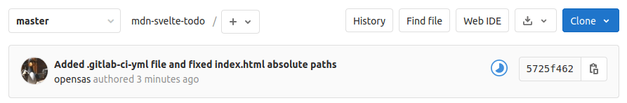
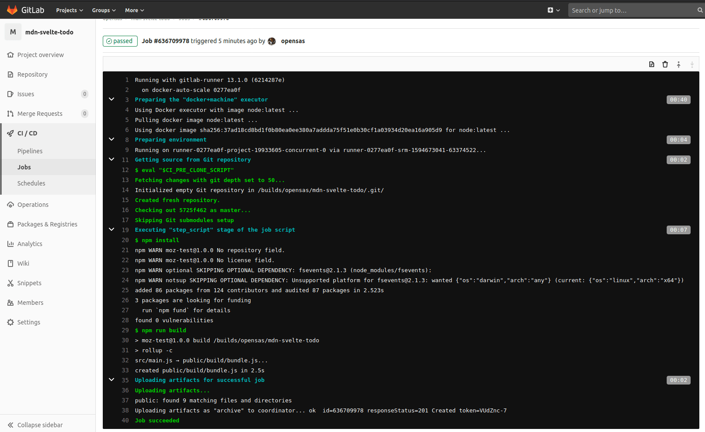

{{LearnSidebar}}

{{PreviousMenu("Learn_web_development/Core/Frameworks_libraries/Svelte_TypeScript", "Learn_web_development/Core/Frameworks_libraries")}}

In the previous article we learned about Svelte's TypeScript support, and how to use it to make your application more robust. In this final article we will look at how to deploy your application and get it online, and also share some of the resources that you should go on to, to continue your Svelte learning journey.

<table>
  <tbody>
    <tr>
      <th scope="row">Prerequisites:</th>
      <td>
        <p>
          At minimum, it is recommended that you are familiar with the core
          <a href="/en-US/docs/Learn_web_development/Core/Structuring_content">HTML</a>,
          <a href="/en-US/docs/Learn_web_development/Core/Styling_basics">CSS</a>, and
          <a href="/en-US/docs/Learn_web_development/Core/Scripting">JavaScript</a> languages, and
          have knowledge of the
          <a
            href="/en-US/docs/Learn_web_development/Getting_started/Environment_setup/Command_line"
            >terminal/command line</a
          >.
        </p>
        <p>
          You'll need a terminal with node + npm installed to compile and build
          your app.
        </p>
      </td>
    </tr>
    <tr>
      <th scope="row">Objective:</th>
      <td>
        Learn how to prepare our Svelte app for production, and what learning
        resources you should visit next.
      </td>
    </tr>
  </tbody>
</table>

## Code along with us

### Git

Clone the GitHub repo (if you haven't already done it) with:

```bash
git clone https://github.com/opensas/mdn-svelte-tutorial.git
```

Then to get to the current app state, run

```bash
cd mdn-svelte-tutorial/08-next-steps
```

Or directly download the folder's content:

```bash
npx degit opensas/mdn-svelte-tutorial/08-next-steps
```

Remember to run `npm install && npm run dev` to start your app in development mode.

## Compiling our app

So far we've been running our app in development mode with `npm run dev`. As we saw earlier, this instruction tells Svelte to compile our components and JavaScript files into a `public/build/bundle.js` file and all the CSS sections of our components into `public/build/bundle.css`. It also starts a development server and watches for changes, recompiling the app and refreshing the page when a change occurs.

Your generated `bundle.js` and `bundle.css` files will be something like this (file size on the left):

```plain
  504 Jul 13 02:43 bundle.css
95981 Jul 13 02:43 bundle.js
```

To compile our application for production we have to run `npm run build` instead. In this case, Svelte won't launch a web server or keep watching for changes. It will however minify and compress our JavaScript files using [terser](https://terser.org/).

So, after running `npm run build`, our generated `bundle.js` and `bundle.css` files will be more like this:

```plain
  504 Jul 13 02:43 bundle.css
21782 Jul 13 02:43 bundle.js
```

Try running `npm run build` in your app's root directory now. You might get a warning, but you can ignore this for now.

Our whole app is now just 21 KB — 8.3 KB when gzipped. There are no additional runtimes or dependencies to download, parse, execute, and keep running in memory. Svelte analyzed our components and compiled the code to vanilla JavaScript.

## A look behind the Svelte compilation process

By default, when you create a new app with `npx degit sveltejs/template my-svelte-project`, Svelte will use [rollup](https://rollupjs.org/) as the module bundler.

> [!NOTE]
> There is also an official template for using [webpack](https://webpack.js.org/) and also many [community-maintained plugins](https://github.com/sveltejs/integrations#bundler-plugins) for other bundlers.

In the file `package.json` you can see that the `build` and `dev` scripts are just calling rollup:

```json
"scripts": {
  "build": "rollup -c",
  "dev": "rollup -c -w",
  "start": "sirv public"
},
```

In the `dev` script we are passing the `-w` argument, which tells rollup to watch files and rebuild on changes.

If we have a look at the `rollup.config.js` file, we can see that the Svelte compiler is just a rollup plugin:

```js
import svelte from 'rollup-plugin-svelte';
// …
import { terser } from 'rollup-plugin-terser';

const production = !process.env.ROLLUP_WATCH;

export default {
  input: 'src/main.js',
  output: {
    sourcemap: true,
    format: 'iife',
    name: 'app',
    file: 'public/build/bundle.js'
  },
  plugins: [
    svelte({
      // enable run-time checks when not in production
      dev: !production,
      // we'll extract any component CSS out into
      // a separate file - better for performance
      css: (css) => {
        css.write('public/build/bundle.css');
      }
    }),
```

Later on in the same file you'll also see how rollup minimizes our scripts in production mode and launches a local server in development mode:

```js
    // In dev mode, call `npm run start` once
    // the bundle has been generated
    !production && serve(),

    // Watch the `public` directory and refresh the
    // browser on changes when not in production
    !production && livereload('public'),

    // If we're building for production (npm run build
    // instead of npm run dev), minify
    production && terser()
  ],
```

There are [many plugins for rollup](https://github.com/rollup/awesome) that allow you to customize its behavior. A particularly useful plugin which is also maintained by the Svelte team is [svelte-preprocess](https://github.com/sveltejs/svelte-preprocess), which pre-processes many different languages in Svelte files such as PostCSS, SCSS, Less, CoffeeScript, SASS, and TypeScript.

## Deploying your Svelte application

From the point of view of a web server, a Svelte application is nothing more than a bunch of HTML, CSS, and JavaScript files. All you need is a web server capable of serving static files, which means you have plenty of options to choose from. Let's look at a couple of examples.

> [!NOTE]
> The following section could be applied to any client-side static website requiring a build step, not just Svelte apps.

### Deploying with Vercel

One of the easiest ways to deploy a Svelte application is using [Vercel](https://vercel.com/home). Vercel is a cloud platform specifically tailored for static sites, which has out-of-the-box support for most common front-end tools, Svelte being one of them.

To deploy our app, follow these steps.

1. [register for an account with Vercel](https://vercel.com/signup).
2. Navigate to the root of your app and run `npx vercel`; the first time you do it, you'll be prompted to enter your email address, and follow the steps in the email sent to that address, for security purposes.
3. Run `npx vercel` again, and you'll be prompted to answer a few questions, like this:

   ```bash
   npx vercel
   ```

   ```plain
   Vercel CLI 19.1.2
   ? Set up and deploy "./mdn-svelte-tutorial"? [Y/n] y
   ? Which scope do you want to deploy to? opensas
   ? Link to existing project? [y/N] n
   ? What's your project's name? mdn-svelte-tutorial
   ? In which directory is your code located? ./
   Auto-detected Project Settings (Svelte):
   - Build Command: `npm run build` or `rollup -c`
   - Output Directory: public
   - Development Command: sirv public --single --dev --port $PORT
   ? Want to override the settings? [y/N] n
      Linked to opensas/mdn-svelte-tutorial (created .vercel)
      Inspect: https://vercel.com/opensas/mdn-svelte-tutorial/[...] [1s]
   ✅  Production: https://mdn-svelte-tutorial.vercel.app [copied to clipboard] [19s]
      Deployed to production. Run `vercel --prod` to overwrite later (https://vercel.link/2F).
      To change the domain or build command, go to https://zeit.co/opensas/mdn-svelte-tutorial/settings
   ```

4. Accept all the defaults, and you'll be fine.
5. Once it has finished deploying, go to the "Production" URL in your browser, and you'll see the app deployed!

You can also [import a Svelte git project](https://vercel.com/import/svelte) into Vercel from [GitHub](https://github.com/), [GitLab](https://about.gitlab.com/), or [Bitbucket](https://bitbucket.org/product/).

> [!NOTE]
> You can globally install Vercel with `npm i -g vercel` so you don't have to use `npx` to run it.

### Automatic deployment to GitLab pages

For hosting static files there are several online services that allow you to automatically deploy your site whenever you push changes to a git repository. Most of them involve setting up a deployment pipeline that gets triggered on every `git push`, and takes care of building and deploying your website.

To demonstrate this, we will deploy our todos app to [GitLab Pages](https://docs.gitlab.com/ee/user/project/pages/).

1. First you'll have to [register at GitLab](https://gitlab.com/users/sign_up) and then [create a new project](https://gitlab.com/projects/new). Give you new project a short, easy name like "mdn-svelte-todo". You will have a remote URL that points to your new GitLab git repository, like `git@gitlab.com:[your-user]/[your-project].git`.
2. Before you start to upload content to your git repository, it is a good practice to add a `.gitignore` file to tell git which files to exclude from source control. In our case we will tell git to exclude files in the `node_modules` directory by creating a `.gitignore` file in the root folder of your local project, with the following content:

   ```bash
   node_modules/
   ```

3. Now let's go back to GitLab. After creating a new repo GitLab will greet you with a message explaining different options to upload your existing files. Follow the steps listed under the _Push an existing folder_ heading:

   ```bash
   cd your_root_directory # Go into your project's root directory
   git init
   git remote add origin https://gitlab.com/[your-user]/mdn-svelte-todo.git
   git add .
   git commit -m "Initial commit"
   git push -u origin main
   ```

   > [!NOTE]
   > You could use [the `git` protocol](https://git-scm.com/book/en/v2/Git-on-the-Server-The-Protocols#_the_git_protocol) instead of `https`, which is faster and saves you from typing your username and password every time you access your origin repo. To use it you'll have to [create an SSH key pair](https://docs.gitlab.com/ee/user/ssh.html#generate-an-ssh-key-pair). Your origin URL will be like this: `git@gitlab.com:[your-user]/mdn-svelte-todo.git`.

With these instructions we initialize a local git repository, then set our remote origin (where we will push our code to) as our repo on GitLab. Next we commit all the files to the local git repo, and then push those to the remote origin on GitLab.

GitLab uses a built-in tool called GitLab CI/CD to build your site and publish it to the GitLab Pages server. The sequence of scripts that GitLab CI/CD runs to accomplish this task is created from a file named `.gitlab-ci.yml`, which you can create and modify at will. A specific job called `pages` in the configuration file will make GitLab aware that you are deploying a GitLab Pages website.

Let's have a go at doing this now.

1. Create a `.gitlab-ci.yml` file inside your project's root and give it the following content:

   ```yaml
   image: node:latest
   pages:
     stage: deploy
     script:
       - npm install
       - npm run build
     artifacts:
       paths:
         - public
     only:
       - main
   ```

   Here we are telling GitLab to use an image with the latest version of node to build our app. Next we are declaring a `pages` job, to enable GitLab Pages. Whenever there's a push to our repo, GitLab will run `npm install` and `npm run build` to build our application. We are also telling GitLab to deploy the contents of the `public` folder. On the last line, we are configuring GitLab to redeploy our app only when there's a push to our main branch.

2. Since our app will be published at a subdirectory (like `https://your-user.gitlab.io/mdn-svelte-todo`), we'll have to make the references to the JavaScript and CSS files in our `public/index.html` file relative. To do this, we just remove the leading slashes (`/`) from the `/global.css`, `/build/bundle.css`, and `/build/bundle.js` URLs, like this:

   ```html
   <title>Svelte To-Do list</title>

   <link rel="icon" type="image/png" href="favicon.png" />
   <link rel="stylesheet" href="global.css" />
   <link rel="stylesheet" href="build/bundle.css" />

   <script defer src="build/bundle.js"></script>
   ```

   Do this now.

3. Now we just have to commit and push our changes to GitLab. Do this by running the following commands:

   ```bash
   git add public/index.html
   git add .gitlab-ci.yml
   git commit -m "Added .gitlab-ci.yml file and fixed index.html absolute paths"
   git push
   ```

Whenever there's a job running GitLab will display an icon showing the process of the job. Clicking on it will let you inspect the output of the job.



You can also check the progress of the current and previous jobs from the _CI / CD_ > _Jobs_ menu option of your GitLab project.



Once GitLab finishes building and publishing your app, it will be accessible at `https://your-user.gitlab.io/mdn-svelte-todo/`; in my case it's `https://opensas.gitlab.io/mdn-svelte-todo/`. You can check your page's URL in GitLab's UI — see the _Settings_ > _Pages_ menu option.

With this configuration, whenever you push changes to the GitLab repo, the application will be automatically rebuilt and deployed to GitLab Pages.

## Learning more about Svelte

In this section we'll give you some resources and projects to go and check out, to take your Svelte learning further.

### Svelte documentation

To go further and learn more about Svelte, you should definitely visit the [Svelte homepage](https://svelte.dev/). There you'll find [many articles](https://svelte.dev/blog) explaining Svelte's philosophy. If you haven't already done it, make sure you go through the [Svelte interactive tutorial](https://learn.svelte.dev/tutorial/welcome-to-svelte). We already covered most of its content, so it won't take you much time to complete it — you should consider it as practice!

You can also consult the [Svelte API docs](https://svelte.dev/docs) and the available [examples](https://svelte.dev/examples/hello-world).

To understand the motivations behind Svelte, you should read [Rich Harris](https://x.com/Rich_Harris)'s [Rethinking reactivity](https://www.youtube.com/watch?v=AdNJ3fydeao&t=47s) presentation on YouTube. He is the creator of Svelte, so he has a couple of things to say about it. You also have the interactive slides available here which are, unsurprisingly, built with Svelte. If you liked it, you will also enjoy [The Return of 'Write Less, Do More'](https://www.youtube.com/watch?v=BzX4aTRPzno) presentation, which Rich Harris gave at [JSCAMP 2019](https://jscamp.tech/2019/).

### Related projects

There are other projects related to Svelte that are worth checking out:

- [Sapper](https://sapper.svelte.dev/): An application framework powered by Svelte that provides server-side rendering (SSR), code splitting, file-based routing and offline support, and more. Think of it as [Next.js](https://nextjs.org/) for Svelte. If you are planning to develop a fairly complex web application you should definitely have a look at this project.
- [Svelte Native](https://svelte-native.technology/): A mobile application framework powered by Svelte. Think of it as [React Native](https://reactnative.dev/) for Svelte.
- [Svelte for VS Code](https://marketplace.visualstudio.com/items?itemName=svelte.svelte-vscode): The officially supported VS Code plugin for working with `.svelte` files, which we looked at in our [TypeScript article](/en-US/docs/Learn_web_development/Core/Frameworks_libraries/Svelte_TypeScript).

### Other learning resources

- There's a [complete course about Svelte and Sapper](https://frontendmasters.com/courses/svelte/) by Rich Harris, available at Frontend Masters.
- Even though Svelte is a relatively young project there are lots of tutorials and [courses](https://www.udemy.com/topic/svelte-framework/?sort=popularity) available on the web, so it's difficult to make a recommendation.
- Nevertheless, [Svelte.js — The Complete Guide](https://www.udemy.com/course/sveltejs-the-complete-guide/) by [Academind](https://academind.com/) is a very popular option with great ratings.
- [The Svelte Handbook](https://www.freecodecamp.org/news/the-svelte-handbook/), by [Flavio Copes](https://flaviocopes.com/), is also a useful reference for learning the main Svelte concepts.
- If you prefer to read books, there's [Svelte and Sapper in Action](https://www.manning.com/books/svelte-and-sapper-in-action) by [Mark Volkman](https://x.com/mark_volkmann), published in October 2020, that [you can preview online](https://livebook.manning.com/book/svelte-and-sapper-in-action/welcome) for free.
- If you want dive deeper and understand the inner working of Svelte's compiler you should check [Tan Li Hau](https://x.com/lihautan)'s [_Compile Svelte in your head_](https://lihautan.com/compile-svelte-in-your-head) blog posts.

### Interacting with the community

There are a number of different ways to get support and interact with the Svelte community:

- [svelte.dev/chat](https://discord.com/invite/yy75DKs): Svelte's Discord server.
- [@sveltejs](https://x.com/sveltejs): The official Twitter account.
- [@sveltesociety](https://x.com/sveltesociety): Svelte community Twitter account.
- [Svelte Recipes](https://github.com/svelte-society/recipes-mvp#recipes-mvp): Community-driven repository of recipes, tips, and best practices to solve common problems.
- [Svelte questions on Stack Overflow](https://stackoverflow.com/questions/tagged/svelte): Questions with the `svelte` tag at SO.
- [Svelte reddit community](https://www.reddit.com/r/sveltejs/): Svelte community discussion and content rating site at reddit.
- [Svelte DEV community](https://dev.to/t/svelte): A collection of Svelte-related technical articles and tutorials from the DEV.to community.

## Finito

Congratulations! You have completed the Svelte tutorial. In the previous articles we went from zero knowledge about Svelte to building and deploying a complete application.

- We learned about Svelte philosophy and what sets it apart from other front-end frameworks.
- We saw how to add dynamic behavior to our website, how to organize our app in components and different ways to share information among them.
- We took advantage of the Svelte reactivity system and learned how to avoid common pitfalls.
- We also saw some advanced concepts and techniques to interact with DOM elements and to programmatically extend HTML element capabilities using the `use` directive.
- Then we saw how to use stores to work with a central data repository, and we created our own custom store to persist our application's data to Web Storage.
- We also took a look at Svelte's TypeScript support.

In this article we've learned about a couple of zero-fuss options to deploy our app in production and seen how to set up a basic pipeline to deploy our app to GitLab on every commit. Then we provided you with a list of Svelte resources to go further with your Svelte learning.

Congratulations! After completing this series of tutorials you should have a strong base from which to start developing professional web applications with Svelte.

{{PreviousMenu("Learn_web_development/Core/Frameworks_libraries/Svelte_TypeScript", "Learn_web_development/Core/Frameworks_libraries")}}
