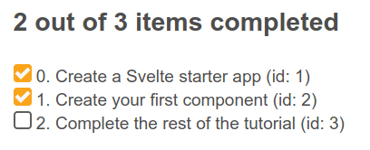

{{LearnSidebar}}
{{PreviousMenuNext("Learn_web_development/Core/Frameworks_libraries/Svelte_Todo_list_beginning","Learn_web_development/Core/Frameworks_libraries/Svelte_components", "Learn_web_development/Core/Frameworks_libraries")}}

Now that we have our markup and styles ready, we can start developing the required features for our Svelte to-do list app. In this article we'll be using variables and props to make our app dynamic, allowing us to add and delete to-dos, mark them as complete, and filter them by status.

<table>
  <tbody>
    <tr>
      <th scope="row">Prerequisites:</th>
      <td>
        <p>
          At minimum, it is recommended that you are familiar with the core
          <a href="/en-US/docs/Learn_web_development/Core/Structuring_content">HTML</a>,
          <a href="/en-US/docs/Learn_web_development/Core/Styling_basics">CSS</a>, and
          <a href="/en-US/docs/Learn_web_development/Core/Scripting">JavaScript</a> languages, and
          have knowledge of the
          <a
            href="/en-US/docs/Learn_web_development/Getting_started/Environment_setup/Command_line"
            >terminal/command line</a
          >.
        </p>
        <p>
          You'll need a terminal with node and npm installed to compile and build
          your app.
        </p>
      </td>
    </tr>
    <tr>
      <th scope="row">Objective:</th>
      <td>
        Learn and put into practice some basic Svelte concepts, like creating
        components, passing data using props, rendering JavaScript expressions into
        our markup, modifying the components' state, and iterating over lists.
      </td>
    </tr>
  </tbody>
</table>

## Code along with us

### Git

Clone the GitHub repo (if you haven't already done it) with:

```bash
git clone https://github.com/opensas/mdn-svelte-tutorial.git
```

Then to get to the current app state, run

```bash
cd mdn-svelte-tutorial/03-adding-dynamic-behavior
```

Or directly download the folder's content:

```bash
npx degit opensas/mdn-svelte-tutorial/03-adding-dynamic-behavior
```

Remember to run `npm install && npm run dev` to start your app in development mode.

### REPL

To code along with us using the REPL, start at

<https://svelte.dev/repl/c862d964d48d473ca63ab91709a0a5a0?version=3.23.2>

## Working with to-dos

Our `Todos.svelte` component is currently just displaying static markup; let's start making it a bit more dynamic. We'll take the tasks information from the markup and store it in a `todos` array. We'll also create two variables to keep track of the total number of tasks and the completed tasks.

The state of our component will be represented by these three top-level variables.

1. Create a `<script>` section at the top of `src/components/Todos.svelte` and give it some content, as follows:

   ```svelte
   <script>
     let todos = [
       { id: 1, name: "Create a Svelte starter app", completed: true },
       { id: 2, name: "Create your first component", completed: true },
       { id: 3, name: "Complete the rest of the tutorial", completed: false }
     ];
     let totalTodos = todos.length;
     let completedTodos = todos.filter((todo) => todo.completed).length;
   </script>
   ```

   Now let's do something with that information.

2. Let's start by showing a status message. Find the `<h2>` heading with an `id` of `list-heading` and replace the hardcoded number of active and completed tasks with dynamic expressions:

   ```svelte
   <h2 id="list-heading">{completedTodos} out of {totalTodos} items completed</h2>
   ```

3. Go to the app, and you should see the "2 out of 3 items completed" message as before, but this time the information is coming from the `todos` array.
4. To prove it, go to that array, and try changing some of the to-do object's completed property values, and even add a new to-do object. Observe how the numbers in the message are updated appropriately.

## Dynamically generating the to-dos from the data

At the moment, our displayed to-do items are all static. We want to iterate over each item in our `todos` array and render the markup for each task, so let's do that now.

HTML doesn't have a way of expressing logic — like conditionals and loops. Svelte does. In this case we use the [`{#each}`](https://svelte.dev/docs/logic-blocks#each) directive to iterate over the `todos` array. The second parameter, if provided, will contain the index of the current item. Also, a key expression can be provided, which will uniquely identify each item. Svelte will use it to diff the list when data changes, rather than adding or removing items at the end, and it's a good practice to always specify one. Finally, an `:else` block can be provided, which will be rendered when the list is empty.

Let's give it a try.

1. Replace the existing `<ul>` element with the following simplified version to get an idea of how it works:

   ```svelte
   <ul>
   {#each todos as todo, index (todo.id)}
     <li>
       <input type="checkbox" checked={todo.completed}/> {index}. {todo.name} (id: {todo.id})
     </li>
   {:else}
     Nothing to do here!
   {/each}
   </ul>
   ```

2. Go back to the app; you'll see something like this:

   

3. Now that we've seen that this is working, let's generate a complete to-do item with each loop of the `{#each}` directive, and inside embed the information from the `todos` array: `id`, `name`, and `completed`. Replace your existing `<ul>` block with the following:

   ```svelte
   <!-- To-dos -->
   <ul role="list" class="todo-list stack-large" aria-labelledby="list-heading">
     {#each todos as todo (todo.id)}
     <li class="todo">
       <div class="stack-small">
         <div class="c-cb">
           <input
             type="checkbox"
             id="todo-{todo.id}"
             checked={todo.completed} />
           <label for="todo-{todo.id}" class="todo-label"> {todo.name} </label>
         </div>
         <div class="btn-group">
           <button type="button" class="btn">
             Edit <span class="visually-hidden">{todo.name}</span>
           </button>
           <button type="button" class="btn btn__danger">
             Delete <span class="visually-hidden">{todo.name}</span>
           </button>
         </div>
       </div>
     </li>
     {:else}
     <li>Nothing to do here!</li>
     {/each}
   </ul>
   ```

   Notice how we are using curly braces to embed JavaScript expressions in HTML attributes, like we did with the `checked` and `id` attributes of the checkbox.

We've turned our static markup into a dynamic template ready to display the tasks from our component's state. Great! We are getting there.

## Working with props

With a hardcoded list of to-dos, our `Todos` component is not very useful. To turn our component into a general purpose to-do editor, we should allow the parent of this component to pass in the list of to-dos to edit. This would allow us to save them to a web service or local storage and later retrieve them for update. So let's turn the array into a `prop`.

1. In `Todos.svelte`, replace the existing `let todos = …` block with `export let todos = []`.

   ```js
   export let todos = [];
   ```

   This may feel a little weird at first. That's not how `export` normally works in JavaScript modules! This is how Svelte 'extends' JavaScript by taking valid syntax and giving it a new purpose. In this case Svelte is using the `export` keyword to mark a variable declaration as a property or prop, which means it becomes accessible to consumers of the component.

   You can also specify a default initial value for a prop. This will be used if the component's consumer doesn't specify the prop on the component — or if its initial value is undefined — when instantiating the component.

   So with `export let todos = []`, we are telling Svelte that our `Todos.svelte` component will accept a `todos` attribute, which when omitted will be initialized to an empty array.

2. Have a look at the app, and you'll see the "Nothing to do here!" message. This is because we are currently not passing any value into it from `App.svelte`, so it's using the default value.
3. Now let's move our to-dos to `App.svelte` and pass them to the `Todos.svelte` component as a prop. Update `src/App.svelte` as follows:

   ```svelte
   <script>
     import Todos from "./components/Todos.svelte";

     let todos = [
       { id: 1, name: "Create a Svelte starter app", completed: true },
       { id: 2, name: "Create your first component", completed: true },
       { id: 3, name: "Complete the rest of the tutorial", completed: false }
     ];
   </script>

   <Todos todos={todos} />
   ```

4. When the attribute and the variable have the same name, Svelte allows you to just specify the variable as a handy shortcut, so we can rewrite our last line like this. Try this now.

   ```svelte
   <Todos {todos} />
   ```

At this point your to-dos should render just like they did before, except that now we're passing them in from the `App.svelte` component.

## Toggling and removing to-dos

Let's add some functionality to toggle the task status. Svelte has the `on:eventname` directive for listening to DOM events. Let's add a handler to the `on:click` event of the checkbox input to toggle the completed value.

1. Update the `<input type="checkbox">` element inside `src/components/Todos.svelte` as follows:

   ```svelte
   <input type="checkbox" id="todo-{todo.id}"
     on:click={() => todo.completed = !todo.completed}
     checked={todo.completed}
   />
   ```

2. Next we'll add a function to remove a to-do from our `todos` array. At the bottom of the `<script>` section of `Todos.svelte`, add the `removeTodo()` function like so:

   ```js
   function removeTodo(todo) {
     todos = todos.filter((t) => t.id !== todo.id);
   }
   ```

3. We'll call it via the _Delete_ button. Update it with a `click` event, like so:

   ```svelte
   <button type="button" class="btn btn__danger"
     on:click={() => removeTodo(todo)}
   >
     Delete <span class="visually-hidden">{todo.name}</span>
   </button>
   ```

   A very common mistake with handlers in Svelte is to pass the result of executing a function as a handler, instead of passing the function. For example, if you specify `on:click={removeTodo(todo)}`, it will execute `removeTodo(todo)` and the result will be passed as a handler, which is not what we had in mind.

   In this case you have to specify `on:click={() => removeTodo(todo)}` as the handler. If `removeTodo()` received no params, you could use `on:event={removeTodo}`, but not `on:event={removeTodo()}`. This is not some special Svelte syntax — here we are just using regular JavaScript [arrow functions](/en-US/docs/Web/JavaScript/Reference/Functions/Arrow_functions).

Again, this is good progress — at this point, we can now delete tasks. When a to-do item's _Delete_ button is pressed, the relevant to-do is removed from the `todos` array, and the UI updates to no longer show it. In addition, we can now check the checkboxes, and the completed status of the relevant to-dos will now update in the `todos` array.

However, the "x out of y items completed" heading is not being updated. Read on to find out why this is happening and how we can solve it.

## Reactive to-dos

As we've already seen, every time the value of a component top-level variable is modified, Svelte knows how to update the UI. In our app, the `todos` array value is updated directly every time a to-do is toggled or deleted, and so Svelte will update the DOM automatically.

The same is not true for `totalTodos` and `completedTodos`, however. In the following code they are assigned a value when the component is instantiated and the script is executed, but after that, their values are not modified:

```js
let totalTodos = todos.length;
let completedTodos = todos.filter((todo) => todo.completed).length;
```

We could recalculate them after toggling and removing to-dos, but there's an easier way to do it.

We can tell Svelte that we want our `totalTodos` and `completedTodos` variables to be reactive by prefixing them with `$:`. Svelte will generate the code to automatically update them whenever data they depend on is changed.

> [!NOTE]
> Svelte uses the `$:` [JavaScript label statement syntax](/en-US/docs/Web/JavaScript/Reference/Statements/label) to mark reactive statements. Just like the `export` keyword being used to declare props, this may look a little alien. This is another example in which Svelte takes advantage of valid JavaScript syntax and gives it a new purpose — in this case to mean "re-run this code whenever any of the referenced values change". Once you get used to it, there's no going back.

Update your `totalTodos` and `completedTodos` variable definitions inside `src/components/Todos.svelte` to look like so:

```js
$: totalTodos = todos.length;
$: completedTodos = todos.filter((todo) => todo.completed).length;
```

If you check your app now, you'll see that the heading's numbers are updated when to-dos are completed or deleted. Nice!

Behind the scenes the Svelte compiler will parse and analyze our code to make a dependency tree, and then it will generate the JavaScript code to re-evaluate each reactive statement whenever one of their dependencies is updated. Reactivity in Svelte is implemented in a very lightweight and performant way, without using listeners, setters, getters, or any other complex mechanism.

## Adding new to-dos

Now on to the next major task for this article — let's add some functionality for adding new to-dos.

1. First we'll create a variable to hold the text of the new to-do. Add this declaration to the `<script>` section of `Todos.svelte` file:

   ```js
   let newTodoName = "";
   ```

2. Now we will use this value in the `<input>` for adding new tasks. To do that we need to bind our `newTodoName` variable to the `todo-0` input, so that the `newTodoName` variable value stays in sync with the input's `value` property. We could do something like this:

   ```svelte
   <input value={newTodoName} on:keydown={(e) => newTodoName = e.target.value} />
   ```

   Whenever the value of the variable `newTodoName` changes, it will be reflected in the `value` attribute of the input, and whenever a key is pressed in the input, we will update the contents of the variable `newTodoName`.

   This is a manual implementation of two-way data binding for an input box. But we don't need to do this — Svelte provides an easier way to bind any property to a variable, using the [`bind:property`](https://svelte.dev/docs/element-directives#bind-property) directive:

   ```svelte
   <input bind:value={newTodoName} />
   ```

   So, let's implement this. Update the `todo-0` input like so:

   ```svelte
   <input
     bind:value={newTodoName}
     type="text"
     id="todo-0"
     autocomplete="off"
     class="input input__lg" />
   ```

3. An easy way to test that this works is to add a reactive statement to log the contents of `newTodoName`. Add this snippet at the end of the `<script>` section:

   ```js
   $: console.log("newTodoName: ", newTodoName);
   ```

   > [!NOTE]
   > As you may have noticed, reactive statements aren't limited to variable declarations. You can put _any_ JavaScript statement after the `$:` sign.

4. Now try going back to `localhost:5042`, pressing <kbd>Ctrl</kbd> + <kbd>Shift</kbd> + <kbd>K</kbd> to open your browser console and typing something into the input field. You should see your entries logged. At this point, you can delete the reactive `console.log()` if you wish.
5. Next up we'll create a function to add the new to-do — `addTodo()` — which will push a new `todo` object onto the `todos` array. Add this to the bottom of your `<script>` block inside `src/components/Todos.svelte`:

   ```js
   function addTodo() {
     todos.push({ id: 999, name: newTodoName, completed: false });
     newTodoName = "";
   }
   ```

   > [!NOTE]
   > For the moment we are just assigning the same `id` to every to-do, but don't worry, we will fix that soon.

6. Now we want to update our HTML so that we call `addTodo()` whenever the form is submitted. Update the NewTodo form's opening tag like so:

   ```svelte
   <form on:submit|preventDefault={addTodo}>
   ```

   The [`on:eventname`](https://svelte.dev/docs/element-directives#on-eventname) directive supports adding modifiers to the DOM event with the `|` character. In this case, the `preventDefault` modifier tells Svelte to generate the code to call `event.preventDefault()` before running the handler. Explore the previous link to see what other modifiers are available.

7. If you try adding new to-dos at this point, the new to-dos are added to the to-dos array, but our UI is not updated. Remember that in Svelte [reactivity is triggered with assignments](https://svelte.dev/docs/svelte-components#script-2-assignments-are-reactive). That means that the `addTodo()` function is executed, the element is added to the `todos` array, but Svelte won't detect that the push method modified the array, so it won't refresh the tasks `<ul>`.

   Just adding `todos = todos` to the end of the `addTodo()` function would solve the problem, but it seems strange to have to include that at the end of the function. Instead, we'll take out the `push()` method and use [spread syntax](/en-US/docs/Web/JavaScript/Reference/Operators/Spread_syntax) to achieve the same result: we'll assign a value to the `todos` array equal to the `todos` array plus the new object.

   > **Note:** `Array` has several mutable operations: [`push()`](/en-US/docs/Web/JavaScript/Reference/Global_Objects/Array/push), [`pop()`](/en-US/docs/Web/JavaScript/Reference/Global_Objects/Array/pop), [`splice()`](/en-US/docs/Web/JavaScript/Reference/Global_Objects/Array/splice), [`shift()`](/en-US/docs/Web/JavaScript/Reference/Global_Objects/Array/shift), [`unshift()`](/en-US/docs/Web/JavaScript/Reference/Global_Objects/Array/unshift), [`reverse()`](/en-US/docs/Web/JavaScript/Reference/Global_Objects/Array/reverse), and [`sort()`](/en-US/docs/Web/JavaScript/Reference/Global_Objects/Array/sort). Using them often causes side effects and bugs that are hard to track. By using the spread syntax instead of `push()` we avoid mutating the array, which is considered a good practice.

   Update your `addTodo()` function like so:

   ```js
   function addTodo() {
     todos = [...todos, { id: 999, name: newTodoName, completed: false }];
     newTodoName = "";
   }
   ```

## Giving each to-do a unique ID

If you try to add new to-dos in your app now, you'll be able to add a new to-do and have it appear in the UI — once. If you try it a second time, it won't work, and you'll get a console message saying "Error: Cannot have duplicate keys in a keyed each". We need unique IDs for our to-dos.

1. Let's declare a `newTodoId` variable calculated from the number of to-dos plus 1, and make it reactive. Add the following snippet to the `<script>` section:

   ```js
   let newTodoId;
   $: {
     if (totalTodos === 0) {
       newTodoId = 1;
     } else {
       newTodoId = Math.max(...todos.map((t) => t.id)) + 1;
     }
   }
   ```

   > [!NOTE]
   > As you can see, reactive statements are not limited to one-liners. The following would work too, but it is a little less readable: `$: newTodoId = totalTodos ? Math.max(...todos.map((t) => t.id)) + 1 : 1`

2. How does Svelte achieve this? The compiler parses the whole reactive statement, and detects that it depends on the `totalTodos` variable and the `todos` array. So whenever either of them is modified, this code is re-evaluated, updating `newTodoId` accordingly.

   Let's use this in our `addTodo()` function. Update it like so:

   ```js
   function addTodo() {
     todos = [...todos, { id: newTodoId, name: newTodoName, completed: false }];
     newTodoName = "";
   }
   ```

## Filtering to-dos by status

Finally for this article, let's implement the ability to filter our to-dos by status. We'll create a variable to hold the current filter, and a helper function that will return the filtered to-dos.

1. At the bottom of our `<script>` section add the following:

   ```js
   let filter = "all";
   const filterTodos = (filter, todos) =>
     filter === "active"
       ? todos.filter((t) => !t.completed)
       : filter === "completed"
         ? todos.filter((t) => t.completed)
         : todos;
   ```

   We use the `filter` variable to control the active filter: _all_, _active_, or _completed_. Just assigning one of these values to the filter variable will activate the filter and update the list of to-dos. Let's see how to achieve this.

   The `filterTodos()` function will receive the current filter and the list of to-dos, and return a new array of to-dos filtered accordingly.

2. Let's update the filter button markup to make it dynamic and update the current filter when the user presses one of the filter buttons. Update it like this:

   ```svelte
   <div class="filters btn-group stack-exception">
     <button class="btn toggle-btn" class:btn__primary={filter === 'all'} aria-pressed={filter === 'all'} on:click={() => filter = 'all'} >
       <span class="visually-hidden">Show</span>
       <span>All</span>
       <span class="visually-hidden">tasks</span>
     </button>
     <button class="btn toggle-btn" class:btn__primary={filter === 'active'} aria-pressed={filter === 'active'} on:click={() => filter = 'active'} >
       <span class="visually-hidden">Show</span>
       <span>Active</span>
       <span class="visually-hidden">tasks</span>
     </button>
     <button class="btn toggle-btn" class:btn__primary={filter === 'completed'} aria-pressed={filter === 'completed'} on:click={() => filter = 'completed'} >
       <span class="visually-hidden">Show</span>
       <span>Completed</span>
       <span class="visually-hidden">tasks</span>
     </button>
   </div>
   ```

   There are a couple of things going on in this markup.

   We will show the current filter by applying the `btn__primary` class to the active filter button. To conditionally apply style classes to an element we use the `class:name={value}` directive. If the value expression evaluates to truthy, the class name will be applied. You can add many of these directives, with different conditions, to the same element. So when we issue `class:btn__primary={filter === 'all'}`, Svelte will apply the `btn__primary` class if filter equals all.

   > [!NOTE]
   > Svelte provides a shortcut which allows us to shorten `<div class:active={active}>` to `<div class:active>` when the class matches the variable name.

   Something similar happens with `aria-pressed={filter === 'all'}`: when the JavaScript expression passed between curly braces evaluates to a truthy value, the `aria-pressed` attribute will be added to the button.

   Whenever we click on a button, we update the filter variable by issuing `on:click={() => filter = 'all'}`. Read on to find out how Svelte reactivity will take care of the rest.

3. Now we just need to use the helper function in the `{#each}` loop; update it like this:

   ```svelte
   …
     <ul role="list" class="todo-list stack-large" aria-labelledby="list-heading">
     {#each filterTodos(filter, todos) as todo (todo.id)}
   …
   ```

   After analyzing our code, Svelte detects that our `filterTodos()` function depends on the variables `filter` and `todos`. And, just like with any other dynamic expression embedded in the markup, whenever any of these dependencies changes, the DOM will be updated accordingly. So whenever `filter` or `todos` changes, the `filterTodos()` function will be re-evaluated and the items inside the loop will be updated.

> [!NOTE]
> Reactivity can be tricky sometimes. Svelte recognizes `filter` as a dependency because we are referencing it in the `filterTodos(filter, todo)` expression. `filter` is a top-level variable, so we might be tempted to remove it from the helper function params, and just call it like this: `filterTodos(todo)`. This would work, but now Svelte has no way to find out that `{#each filterTodos(todos) }` depends on `filter`, and the list of filtered to-dos won't be updated when the filter changes. Always remember that Svelte analyzes our code to find out dependencies, so it's better to be explicit about it and not rely on the visibility of top-level variables. Besides, it's a good practice to make our code clear and explicit about what information it is using.

## The code so far

### Git

To see the state of the code as it should be at the end of this article, access your copy of our repo like this:

```bash
cd mdn-svelte-tutorial/04-componentizing-our-app
```

Or directly download the folder's content:

```bash
npx degit opensas/mdn-svelte-tutorial/04-componentizing-our-app
```

Remember to run `npm install && npm run dev` to start your app in development mode.

### REPL

To see the current state of the code in a REPL, visit:

<https://svelte.dev/repl/99b9eb228b404a2f8c8959b22c0a40d3?version=3.23.2>

## Summary

That will do for now! In this article we already implemented most of our desired functionality. Our app can display, add, and delete to-dos, toggle their completed status, show how many of them are completed, and apply filters.

To recap, we covered the following topics:

- Creating and using components
- Turning static markup into a live template
- Embedding JavaScript expressions in our markup
- Iterating over lists using the `{#each}` directive
- Passing information between components with props
- Listening to DOM events
- Declaring reactive statements
- Basic debugging with `console.log()` and reactive statements
- Binding HTML properties with the `bind:property` directive
- Triggering reactivity with assignments
- Using reactive expressions to filter data
- Explicitly defining our reactive dependencies

In the next article we will add further functionality, which will allow users to edit to-dos.

{{PreviousMenuNext("Learn_web_development/Core/Frameworks_libraries/Svelte_Todo_list_beginning","Learn_web_development/Core/Frameworks_libraries/Svelte_components", "Learn_web_development/Core/Frameworks_libraries")}}
