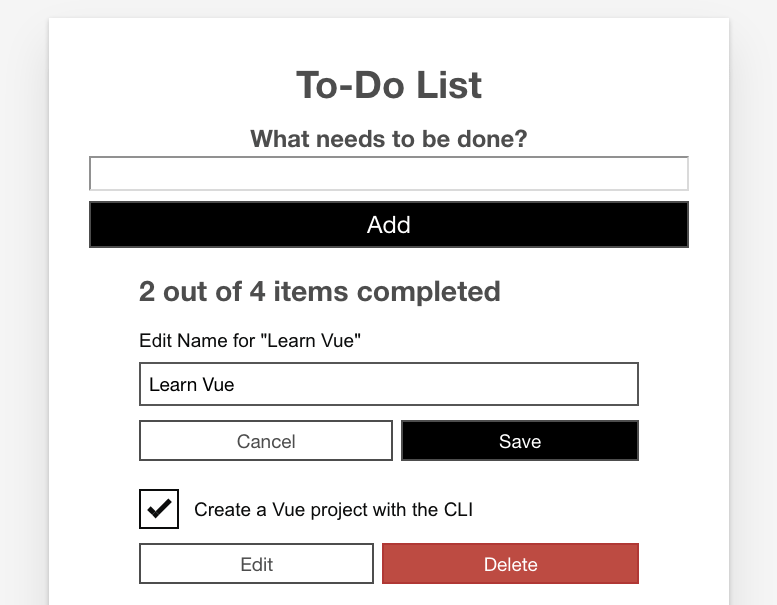

{{LearnSidebar}}{{PreviousMenuNext("Learn_web_development/Core/Frameworks_libraries/Vue_computed_properties","Learn_web_development/Core/Frameworks_libraries/Vue_refs_focus_management", "Learn_web_development/Core/Frameworks_libraries")}}

Now it is time to add one of the major parts of functionality that we're still missing — the ability to edit existing todo items. To do this, we will take advantage of Vue's conditional rendering capabilities — namely `v-if` and `v-else` — to allow us to toggle between the existing todo item view, and an edit view where you can update todo item labels. We'll also look at adding functionality to delete todo items.

<table>
  <tbody>
    <tr>
      <th scope="row">Prerequisites:</th>
      <td>
        <p>
          Familiarity with the core <a href="/en-US/docs/Learn_web_development/Core/Structuring_content">HTML</a>,
          <a href="/en-US/docs/Learn_web_development/Core/Styling_basics">CSS</a>, and
          <a href="/en-US/docs/Learn_web_development/Core/Scripting">JavaScript</a> languages,
          knowledge of the
          <a
            href="/en-US/docs/Learn_web_development/Getting_started/Environment_setup/Command_line"
            >terminal/command line</a
          >.
        </p>
        <p>
          Vue components are written as a combination of JavaScript objects that
          manage the app's data and an HTML-based template syntax that maps to
          the underlying DOM structure. For installation, and to use some of the
          more advanced features of Vue (like Single File Components or render
          functions), you'll need a terminal with node + npm installed.
        </p>
      </td>
    </tr>
    <tr>
      <th scope="row">Objective:</th>
      <td>To learn how to do conditional rendering in Vue.</td>
    </tr>
  </tbody>
</table>

## Creating an editing component

We can start by creating a separate component to handle the editing functionality. In your `components` directory, create a new file called `ToDoItemEditForm.vue`. Copy the following code into that file:

```html
<template>
  <form class="stack-small" @submit.prevent="onSubmit">
    <div>
      <label class="edit-label">Edit Name for &quot;\{{label}}&quot;</label>
      <input
        :id="id"
        type="text"
        autocomplete="off"
        v-model.lazy.trim="newLabel" />
    </div>
    <div class="btn-group">
      <button type="button" class="btn" @click="onCancel">
        Cancel
        <span class="visually-hidden">editing \{{label}}</span>
      </button>
      <button type="submit" class="btn btn__primary">
        Save
        <span class="visually-hidden">edit for \{{label}}</span>
      </button>
    </div>
  </form>
</template>
<script>
  export default {
    props: {
      label: {
        type: String,
        required: true,
      },
      id: {
        type: String,
        required: true,
      },
    },
    data() {
      return {
        newLabel: this.label,
      };
    },
    methods: {
      onSubmit() {
        if (this.newLabel && this.newLabel !== this.label) {
          this.$emit("item-edited", this.newLabel);
        }
      },
      onCancel() {
        this.$emit("edit-cancelled");
      },
    },
  };
</script>
<style scoped>
  .edit-label {
    font-family: Arial, sans-serif;
    -webkit-font-smoothing: antialiased;
    -moz-osx-font-smoothing: grayscale;
    color: #0b0c0c;
    display: block;
    margin-bottom: 5px;
  }
  input {
    display: inline-block;
    margin-top: 0.4rem;
    width: 100%;
    min-height: 4.4rem;
    padding: 0.4rem 0.8rem;
    border: 2px solid #565656;
  }
  form {
    display: flex;
    flex-direction: row;
    flex-wrap: wrap;
  }
  form > * {
    flex: 0 0 100%;
  }
</style>
```

> [!NOTE]
> Walk through the above code then read the below description to make sure you understand everything the component is doing before moving on. This is a useful way to help reinforce everything you've learned so far.

This code sets up the core of the edit functionality. We create a form with an `<input>` field for editing the name of our to-do.

There is a "Save" button and a "Cancel" button:

- When the "Save" button is clicked, the component emits the new label via an `item-edited` event.
- When the "Cancel" button is clicked, the component signals this by emitting an `edit-cancelled` event.

## Modifying our ToDoItem component

Before we can add `ToDoItemEditForm` to our app, we need to make a few modifications to our `ToDoItem` component. Specifically, we need to add a variable to track if the item is being edited, and a button to toggle that variable. We'll also add a `Delete` button since deletion is closely related.

Update your `ToDoItem`'s template as shown below.

```html
<template>
  <div class="stack-small">
    <div class="custom-checkbox">
      <input
        type="checkbox"
        class="checkbox"
        :id="id"
        :checked="isDone"
        @change="$emit('checkbox-changed')" />
      <label :for="id" class="checkbox-label">\{{label}}</label>
    </div>
    <div class="btn-group">
      <button type="button" class="btn" @click="toggleToItemEditForm">
        Edit <span class="visually-hidden">\{{label}}</span>
      </button>
      <button type="button" class="btn btn__danger" @click="deleteToDo">
        Delete <span class="visually-hidden">\{{label}}</span>
      </button>
    </div>
  </div>
</template>
```

We've added a wrapper `<div>` around the whole template for layout purposes.

We've also added "Edit" and "Delete" buttons:

- The "Edit" button, when clicked, will toggle displaying the `ToDoItemEditForm` component so we can use it to edit our todo item, via an event handler function called `toggleToItemEditForm()`. This handler will set an `isEditing` flag to true. To do that, we'll need to first define it inside our `data()` property.
- The "Delete" button, when clicked, will delete the todo item via an event handler function called `deleteToDo()`. In this handler we'll emit an `item-deleted` event to our parent component so the list can be updated.

Let's define our click handlers, and the necessary `isEditing` flag.

Add `isEditing` below your existing `isDone` data point:

```js
data() {
  return {
    isDone: this.done,
    isEditing: false
  };
}
```

Now add your methods inside a methods property, right below your `data()` property:

```js
methods: {
    deleteToDo() {
      this.$emit('item-deleted');
    },
    toggleToItemEditForm() {
      this.isEditing = true;
    }
  }
```

## Conditionally displaying components via v-if and v-else

Now we have an `isEditing` flag that we can use to signify that the item is being edited (or not). If `isEditing` is true, we want to use that flag to display our `ToDoItemEditForm` instead of the checkbox. To do that, we'll use another Vue directive: [`v-if`](https://vuejs.org/api/built-in-directives.html#v-if).

The `v-if` directive will only render a block if the value passed to it is truthy. This is similar to how an `if` statement works in JavaScript. `v-if` also has corresponding [`v-else-if`](https://vuejs.org/api/built-in-directives.html#v-else-if) and [`v-else`](https://vuejs.org/api/built-in-directives.html#v-else) directives to provide the equivalent of JavaScript `else if` and `else` logic inside Vue templates.

It's important to note that `v-else` and `v-else-if` blocks need to be the first sibling of a `v-if`/`v-else-if` block, otherwise Vue will not recognize them. You can also attach `v-if` to a `<template>` tag if you need to conditionally render an entire template.

Lastly, you can use a `v-if` + `v-else` at the root of your component to display only one block or another, since Vue will only render one of these blocks at a time. We'll do this in our app, as it will allow us to replace the code that displays our to-do item with the edit form.

First of all add `v-if="!isEditing"` to the root `<div>` in your `ToDoItem` component,

```html
<div class="stack-small" v-if="!isEditing"></div>
```

Next, below that `<div>`'s closing tag add the following line:

```html
<to-do-item-edit-form v-else :id="id" :label="label"></to-do-item-edit-form>
```

We also need to import and register the `ToDoItemEditForm` component, so we can use it inside this template. Add this line at the top of your `<script>` element:

```js
import ToDoItemEditForm from "./ToDoItemEditForm";
```

And add a `components` property above the `props` property inside the component object:

```js
components: {
  ToDoItemEditForm
},
```

Now, if you go to your app and click a todo item's "Edit" button, you should see the checkbox replaced with the edit form.



However, there's currently no way to go back. To fix that, we need to add some more event handlers to our component.

## Getting back out of edit mode

First, we need to add an `itemEdited()` method to our `ToDoItem` component's `methods`. This method should take the new item label as an argument, emit an `itemEdited` event to the parent component, and set `isEditing` to `false`.

Add it now, below your existing methods:

```js
itemEdited(newLabel) {
  this.$emit('item-edited', newLabel);
  this.isEditing = false;
}
```

Next, we'll need an `editCancelled()` method. This method will take no arguments and just serve to set `isEditing` back to `false`. Add this method below the previous one:

```js
editCancelled() {
  this.isEditing = false;
}
```

Last for this section, we'll add event handlers for the events emitted by the `ToDoItemEditForm` component, and attach the appropriate methods to each event.

Update your `<to-do-item-edit-form></to-do-item-edit-form>` call to look like so:

```html
<to-do-item-edit-form
  v-else
  :id="id"
  :label="label"
  @item-edited="itemEdited"
  @edit-cancelled="editCancelled">
</to-do-item-edit-form>
```

## Updating and deleting todo items

Now we can toggle between the edit form and the checkbox. However, we haven't actually handled updating the `ToDoItems` array back in `App.vue`. To fix that, we need to listen for the `item-edited` event, and update the list accordingly. We'll also want to handle the delete event so that we can delete todo items.

Add the following new methods to your `App.vue`'s component object, below the existing methods inside the `methods` property:

```js
deleteToDo(toDoId) {
  const itemIndex = this.ToDoItems.findIndex((item) => item.id === toDoId);
  this.ToDoItems.splice(itemIndex, 1);
},
editToDo(toDoId, newLabel) {
  const toDoToEdit = this.ToDoItems.find((item) => item.id === toDoId);
  toDoToEdit.label = newLabel;
}
```

Next, we'll add the event listeners for the `item-deleted` and `item-edited` events:

- For `item-deleted`, you'll need to pass the `item.id` to the method.
- For `item-edited`, you'll need to pass the `item.id` and the special `$event` variable. This is a special Vue variable used to pass event data to methods. When using native HTML events (like `click`), this will pass the native event object to your method.

Update the `<to-do-item></to-do-item>` call inside the `App.vue` template to look like this:

```html
<to-do-item
  :label="item.label"
  :done="item.done"
  :id="item.id"
  @checkbox-changed="updateDoneStatus(item.id)"
  @item-deleted="deleteToDo(item.id)"
  @item-edited="editToDo(item.id, $event)">
</to-do-item>
```

And there you have it — you should now be able to edit and delete items from the list!

## Fixing a small bug with isDone status

This is great so far, but we've actually introduced a bug by adding in the edit functionality. Try doing this:

1. Check (or uncheck) one of the todo checkboxes.
2. Press the "Edit" button for that todo item.
3. Cancel the edit by pressing the "Cancel" button.

Note the state of the checkbox after you cancel — not only has the app forgotten the state of the checkbox, but the done status of that todo item is now out of whack. If you try checking (or unchecking) it again, the completed count will change in the opposite way to what you'd expect. This is because the `isDone` inside `data` is only given the value `this.done` on component load.

Fixing this is fortunately quite easy — we can do this by converting our `isDone` data item into a [computed property](/en-US/docs/Learn_web_development/Core/Frameworks_libraries/Vue_computed_properties) — another advantage of computed properties is that they preserve [reactivity](https://vuejs.org/guide/essentials/reactivity-fundamentals.html), meaning (among other things) that their state is saved when the template changes like ours is now doing.

So, let's implement the fix in `ToDoItem.vue`:

1. Remove the following line from inside our `data()` property:

   ```js
   isDone: this.done,
   ```

2. Add the following block below the data() { } block:

   ```js
   computed: {
     isDone() {
       return this.done;
     }
   },
   ```

Now when you save and reload, you'll find that the problem is solved — the checkbox state is now preserved when you switch between todo item templates.

## Understanding the tangle of events

One of the most potentially confusing parts is the tangle of standard and custom events we've used to trigger all the interactivity in our app. To understand this better, it is a good idea to write out a flow chart, description, or diagram of what events are emitted where, where they are being listened for, and what happens as a result of them firing.

### App.vue

`<to-do-form>` listens for:

- `todo-added` event emitted by the `onSubmit()` method inside the `ToDoForm` component when the form is submitted.
  **Result**: `addToDo()` method invoked to add new todo item to the `ToDoItems` array.

`<to-do-item>` listens for:

- `checkbox-changed` event emitted by the checkbox `<input>` inside the `ToDoItem` component when it is checked or unchecked.
  **Result**: `updateDoneStatus()` method invoked to update done status of associated todo item.
- `item-deleted` event emitted by the `deleteToDo()` method inside the `ToDoItem` component when the "Delete" button is pressed.
  **Result**: `deleteToDo()` method invoked to delete associated todo item.
- `item-edited` event emitted by the `itemEdited()` method inside the `ToDoItem` component when the `item-edited` event emitted by the `onSubmit()` method inside the `ToDoItemEditForm` has been successfully listened for. Yes, this is a chain of two different `item-edited` events!
  **Result**: `editToDo()` method invoked to update label of associated todo item.

### ToDoForm.vue

`<form>` listens for `submit` event.
**Result**: `onSubmit()` method is invoked, which checks that the new label is not empty, then emits the `todo-added` event (which is then listened for inside `App.vue`, see above), and finally clears the new label `<input>`.

### ToDoItem.vue

The `<input>` of `type="checkbox"` listens for `change` events.
**Result**: `checkbox-changed` event emitted when the checkbox is checked/unchecked (which is then listened for inside `App.vue`; see above).

"Edit" `<button>` listens for `click` event.
**Result**: `toggleToItemEditForm()` method is invoked, which toggles `this.isEditing` to `true`, which in turn displays the todo item's edit form on re-render.

"Delete" `<button>` listens for `click` event.
**Result**: `deleteToDo()` method is invoked, which emits the `item-deleted` event (which is then listened for inside `App.vue`; see above).

`<to-do-item-edit-form>` listens for:

- `item-edited` event emitted by the `onSubmit()` method inside the `ToDoItemEditForm` component when the form is successfully submitted.
  **Result**: `itemEdited()` method is invoked, which emits the `item-edited` event (which is then listened for inside `App.vue`, see above), and sets `this.isEditing` back to `false`, so that the edit form is no longer shown on re-render.
- `edit-cancelled` event emitted by the `onCancel()` method inside the `ToDoItemEditForm` component when the "Cancel" button is clicked.
  **Result**: `editCancelled()` method is invoked, which sets `this.isEditing` back to `false`, so that the edit form is no longer shown on re-render.

### ToDoItemEditForm.vue

`<form>` listens for `submit` event.
**Result**: `onSubmit()` method is invoked, which checks to see if the new label value is not blank, and not the same as the old one, and if so emits the `item-edited` event (which is then listened for inside `ToDoItem.vue`, see above).

"Cancel" `<button>` listens for `click` event.
**Result**: `onCancel()` method is invoked, which emits the `edit-cancelled` event (which is then listened for inside `ToDoItem.vue`, see above).

## Summary

This article has been fairly intense, and we covered a lot here. We've now got edit and delete functionality in our app, which is fairly exciting. We are nearing the end of our Vue series now. The last bit of functionality to look at is focus management, or put another way, how we can improve our app's keyboard accessibility.

{{PreviousMenuNext("Learn_web_development/Core/Frameworks_libraries/Vue_computed_properties","Learn_web_development/Core/Frameworks_libraries/Vue_refs_focus_management", "Learn_web_development/Core/Frameworks_libraries")}}
