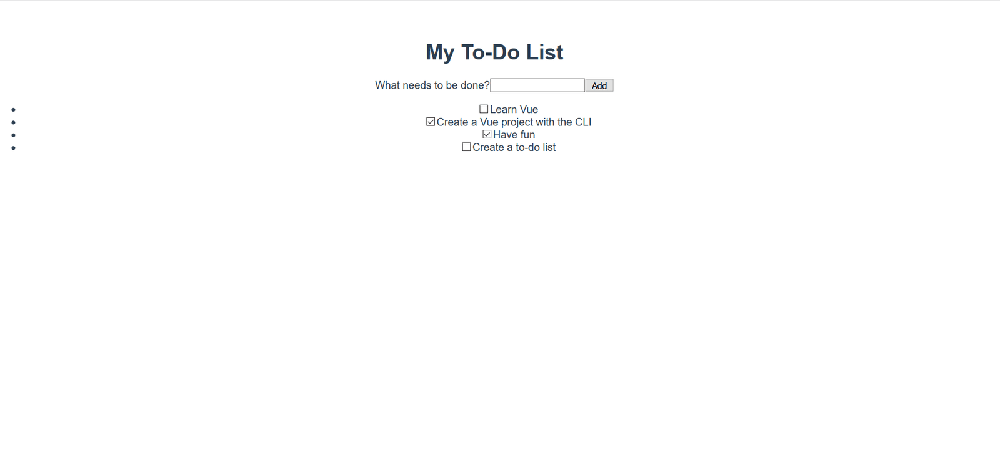

{{LearnSidebar}}{{PreviousMenuNext("Learn_web_development/Core/Frameworks_libraries/Vue_methods_events_models","Learn_web_development/Core/Frameworks_libraries/Vue_computed_properties", "Learn_web_development/Core/Frameworks_libraries")}}

The time has finally come to make our app look a bit nicer. In this article we'll explore the different ways of styling Vue components with CSS.

<table>
  <tbody>
    <tr>
      <th scope="row">Prerequisites:</th>
      <td>
        <p>
          Familiarity with the core <a href="/en-US/docs/Learn_web_development/Core/Structuring_content">HTML</a>,
          <a href="/en-US/docs/Learn_web_development/Core/Styling_basics">CSS</a>, and
          <a href="/en-US/docs/Learn_web_development/Core/Scripting">JavaScript</a> languages,
          knowledge of the
          <a
            href="/en-US/docs/Learn_web_development/Getting_started/Environment_setup/Command_line"
            >terminal/command line</a
          >.
        </p>
        <p>
          Vue components are written as a combination of JavaScript objects that
          manage the app's data and an HTML-based template syntax that maps to
          the underlying DOM structure. For installation, and to use some of the
          more advanced features of Vue (like Single File Components or render
          functions), you'll need a terminal with node + npm installed.
        </p>
      </td>
    </tr>
    <tr>
      <th scope="row">Objective:</th>
      <td>To learn about styling Vue components.</td>
    </tr>
  </tbody>
</table>

## Styling Vue components with CSS

Before we move on to add more advanced features to our app, we should add some basic CSS to make it look better. Vue has three common approaches to styling apps:

- External CSS files.
- Global styles in Single File Components (`.vue` files).
- Component-scoped styles in Single File Components.

To help familiarize you with each one, we'll use a combination of all three to give our app a nicer look and feel.

## Styling with external CSS files

You can include external CSS files and apply them globally to your app. Let's look at how this is done.

To start with, create a file called `reset.css` in the `src/assets` directory. Files in this folder get processed by webpack. This means we can use CSS pre-processors (like SCSS) or post-processors (like PostCSS).

While this tutorial will not be using such tools, it's good to know that when including such code in the assets folder it will be processed automatically.

Add the following contents to the `reset.css` file:

```css
/*reset.css*/
/* RESETS */
*,
*::before,
*::after {
  box-sizing: border-box;
}
*:focus {
  outline: 3px dashed #228bec;
}
html {
  font: 62.5% / 1.15 sans-serif;
}
h1,
h2 {
  margin-bottom: 0;
}
ul {
  list-style: none;
  padding: 0;
}
button {
  border: none;
  margin: 0;
  padding: 0;
  width: auto;
  overflow: visible;
  background: transparent;
  color: inherit;
  font: inherit;
  line-height: normal;
  -webkit-font-smoothing: inherit;
  -moz-osx-font-smoothing: inherit;
  appearance: none;
}
button::-moz-focus-inner {
  border: 0;
}
button,
input,
optgroup,
select,
textarea {
  font-family: inherit;
  font-size: 100%;
  line-height: 1.15;
  margin: 0;
}
button,
input {
  /* 1 */
  overflow: visible;
}
input[type="text"] {
  border-radius: 0;
}
body {
  width: 100%;
  max-width: 68rem;
  margin: 0 auto;
  font:
    1.6rem/1.25 "Helvetica Neue",
    Helvetica,
    Arial,
    sans-serif;
  background-color: #f5f5f5;
  color: #4d4d4d;
  -moz-osx-font-smoothing: grayscale;
  -webkit-font-smoothing: antialiased;
}
@media screen and (min-width: 620px) {
  body {
    font-size: 1.9rem;
    line-height: 1.31579;
  }
}
/*END RESETS*/
```

Next, in your `src/main.js` file, import the `reset.css` file like so:

```js
import "./assets/reset.css";
```

This will cause the file to get picked up during the build step and automatically added to our site.

The reset styles should be applied to the app now. The images below show the look of the app before and after the reset is applied.

Before:



After:


Noticeable changes include the removal of the list bullets, background color changes, and changes to the base button and input styles.

## Adding global styles to Single File Components

Now that we've reset our CSS to be uniform across browsers, we need to customize the styles a bit more. There are some styles that we want to apply across components in our app. While adding these files directly to the `reset.css` stylesheet would work, we'll instead add them to the `<style>` tags in `App.vue` to demonstrate how this can be used.

There are already some styles present in the file. Let's remove those and replace them with the styles below. These styles do a few things — adding some styling to buttons and inputs, and customizing the `#app` element and its children.

Update your `App.vue` file's `<style>` element so it looks like so:

```html
<style>
  /* Global styles */
  .btn {
    padding: 0.8rem 1rem 0.7rem;
    border: 0.2rem solid #4d4d4d;
    cursor: pointer;
    text-transform: capitalize;
  }
  .btn__danger {
    color: #fff;
    background-color: #ca3c3c;
    border-color: #bd2130;
  }
  .btn__filter {
    border-color: lightgrey;
  }
  .btn__danger:focus {
    outline-color: #c82333;
  }
  .btn__primary {
    color: #fff;
    background-color: #000;
  }
  .btn-group {
    display: flex;
    justify-content: space-between;
  }
  .btn-group > * {
    flex: 1 1 auto;
  }
  .btn-group > * + * {
    margin-left: 0.8rem;
  }
  .label-wrapper {
    margin: 0;
    flex: 0 0 100%;
    text-align: center;
  }
  [class*="__lg"] {
    display: inline-block;
    width: 100%;
    font-size: 1.9rem;
  }
  [class*="__lg"]:not(:last-child) {
    margin-bottom: 1rem;
  }
  @media screen and (min-width: 620px) {
    [class*="__lg"] {
      font-size: 2.4rem;
    }
  }
  .visually-hidden {
    position: absolute;
    height: 1px;
    width: 1px;
    overflow: hidden;
    clip: rect(1px 1px 1px 1px);
    clip: rect(1px, 1px, 1px, 1px);
    clip-path: rect(1px, 1px, 1px, 1px);
    white-space: nowrap;
  }
  [class*="stack"] > * {
    margin-top: 0;
    margin-bottom: 0;
  }
  .stack-small > * + * {
    margin-top: 1.25rem;
  }
  .stack-large > * + * {
    margin-top: 2.5rem;
  }
  @media screen and (min-width: 550px) {
    .stack-small > * + * {
      margin-top: 1.4rem;
    }
    .stack-large > * + * {
      margin-top: 2.8rem;
    }
  }
  /* End global styles */
  #app {
    background: #fff;
    margin: 2rem 0 4rem 0;
    padding: 1rem;
    padding-top: 0;
    position: relative;
    box-shadow:
      0 2px 4px 0 rgb(0 0 0 / 20%),
      0 2.5rem 5rem 0 rgb(0 0 0 / 10%);
  }
  @media screen and (min-width: 550px) {
    #app {
      padding: 4rem;
    }
  }
  #app > * {
    max-width: 50rem;
    margin-left: auto;
    margin-right: auto;
  }
  #app > form {
    max-width: 100%;
  }
  #app h1 {
    display: block;
    min-width: 100%;
    width: 100%;
    text-align: center;
    margin: 0;
    margin-bottom: 1rem;
  }
</style>
```

If you check the app, you'll see that our todo list is now in a card, and we have some better formatting of our to-do items. Now we can go through and begin editing our components to use some of these styles.


### Adding CSS classes in Vue

We should apply the button CSS classes to the `<button>` in our `ToDoForm` component. Since Vue templates are valid HTML, this is done in the same way to how you might do it in plain HTML — by adding a `class=""` attribute to the element.

Add `class="btn btn__primary btn__lg"` to your form's `<button>` element:

```html
<button type="submit" class="btn btn__primary btn__lg">Add</button>
```

While we're here, there's one more semantic and styling change we can make. Since our form denotes a specific section of our page, it could benefit from an `<h2>` element. The label, however, already denotes the purpose of the form. To avoid repeating ourselves, let's wrap our label in an `<h2>`. There are a few other global CSS styles which we can add as well. We'll also add the `input__lg` class to our `<input>` element.

Update your `ToDoForm` template so that it looks like this:

```html
<template>
  <form @submit.prevent="onSubmit">
    <h2 class="label-wrapper">
      <label for="new-todo-input" class="label__lg">
        What needs to be done?
      </label>
    </h2>
    <input
      type="text"
      id="new-todo-input"
      name="new-todo"
      autocomplete="off"
      v-model.lazy.trim="label"
      class="input__lg" />
    <button type="submit" class="btn btn__primary btn__lg">Add</button>
  </form>
</template>
```

Let's also add the `stack-large` class to the `<ul>` tag in our `App.vue` file. This will help improve the spacing of our to-do items a bit.

Update it as follows:

```html
<ul aria-labelledby="list-summary" class="stack-large">
  …
</ul>
```

## Adding scoped styles

The last component we want to style is our `ToDoItem` component. To keep the style definitions close to the component we can add a `<style>` element inside it. However, if these styles alter things outside of this component, it could be challenging to track down the styles responsible, and fix the problem. This is where the `scoped` attribute can be useful — this attaches a unique HTML `data` attribute selector to all of your styles, preventing them from colliding globally.

To use the `scoped` modifier, create a `<style>` element inside `ToDoItem.vue`, at the bottom of the file, and give it a `scoped` attribute:

```html
<style scoped>
  /* … */
</style>
```

Next, copy the following CSS into the newly created `<style>` element:

```css
.custom-checkbox > .checkbox-label {
  font-family: Arial, sans-serif;
  -webkit-font-smoothing: antialiased;
  -moz-osx-font-smoothing: grayscale;
  font-weight: 400;
  font-size: 16px;
  font-size: 1rem;
  line-height: 1.25;
  color: #0b0c0c;
  display: block;
  margin-bottom: 5px;
}
.custom-checkbox > .checkbox {
  font-family: Arial, sans-serif;
  -webkit-font-smoothing: antialiased;
  -moz-osx-font-smoothing: grayscale;
  font-weight: 400;
  font-size: 16px;
  font-size: 1rem;
  line-height: 1.25;
  box-sizing: border-box;
  width: 100%;
  height: 40px;
  height: 2.5rem;
  margin-top: 0;
  padding: 5px;
  border: 2px solid #0b0c0c;
  border-radius: 0;
  appearance: none;
}
.custom-checkbox > input:focus {
  outline: 3px dashed #fd0;
  outline-offset: 0;
  box-shadow: inset 0 0 0 2px;
}
.custom-checkbox {
  font-family: Arial, sans-serif;
  -webkit-font-smoothing: antialiased;
  font-weight: 400;
  font-size: 1.6rem;
  line-height: 1.25;
  display: block;
  position: relative;
  min-height: 40px;
  margin-bottom: 10px;
  padding-left: 40px;
  clear: left;
}
.custom-checkbox > input[type="checkbox"] {
  -webkit-font-smoothing: antialiased;
  cursor: pointer;
  position: absolute;
  z-index: 1;
  top: -2px;
  left: -2px;
  width: 44px;
  height: 44px;
  margin: 0;
  opacity: 0;
}
.custom-checkbox > .checkbox-label {
  font-size: inherit;
  font-family: inherit;
  line-height: inherit;
  display: inline-block;
  margin-bottom: 0;
  padding: 8px 15px 5px;
  cursor: pointer;
  touch-action: manipulation;
}
.custom-checkbox > label::before {
  content: "";
  box-sizing: border-box;
  position: absolute;
  top: 0;
  left: 0;
  width: 40px;
  height: 40px;
  border: 2px solid currentcolor;
  background: transparent;
}
.custom-checkbox > input[type="checkbox"]:focus + label::before {
  border-width: 4px;
  outline: 3px dashed #228bec;
}
.custom-checkbox > label::after {
  box-sizing: content-box;
  content: "";
  position: absolute;
  top: 11px;
  left: 9px;
  width: 18px;
  height: 7px;
  transform: rotate(-45deg);
  border: solid;
  border-width: 0 0 5px 5px;
  border-top-color: transparent;
  opacity: 0;
  background: transparent;
}
.custom-checkbox > input[type="checkbox"]:checked + label::after {
  opacity: 1;
}
@media only screen and (min-width: 40rem) {
  label,
  input,
  .custom-checkbox {
    font-size: 19px;
    font-size: 1.9rem;
    line-height: 1.31579;
  }
}
```

Now we need to add some CSS classes to our template to connect the styles.

To the root `<div>`, add a `custom-checkbox` class. To the `<input>`, add a `checkbox` class. Last of all, to the `<label>` add a `checkbox-label` class. The updated template is below:

```html
<template>
  <div class="custom-checkbox">
    <input type="checkbox" :id="id" :checked="isDone" class="checkbox" />
    <label :for="id" class="checkbox-label">\{{label}}</label>
  </div>
</template>
```

The app should now have custom checkboxes. Your app should look something like the screenshot below.


## Summary

Our work is done on the styling of our sample app. In the next article we'll return to adding some more functionality to our app, namely using a computed property to add a count of completed todo items to our app.

{{PreviousMenuNext("Learn_web_development/Core/Frameworks_libraries/Vue_methods_events_models","Learn_web_development/Core/Frameworks_libraries/Vue_computed_properties", "Learn_web_development/Core/Frameworks_libraries")}}
